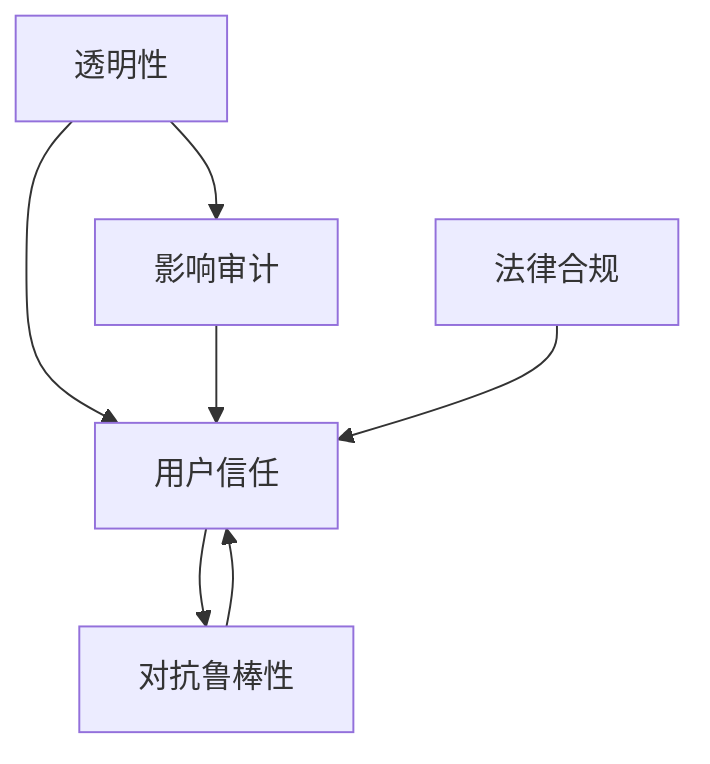
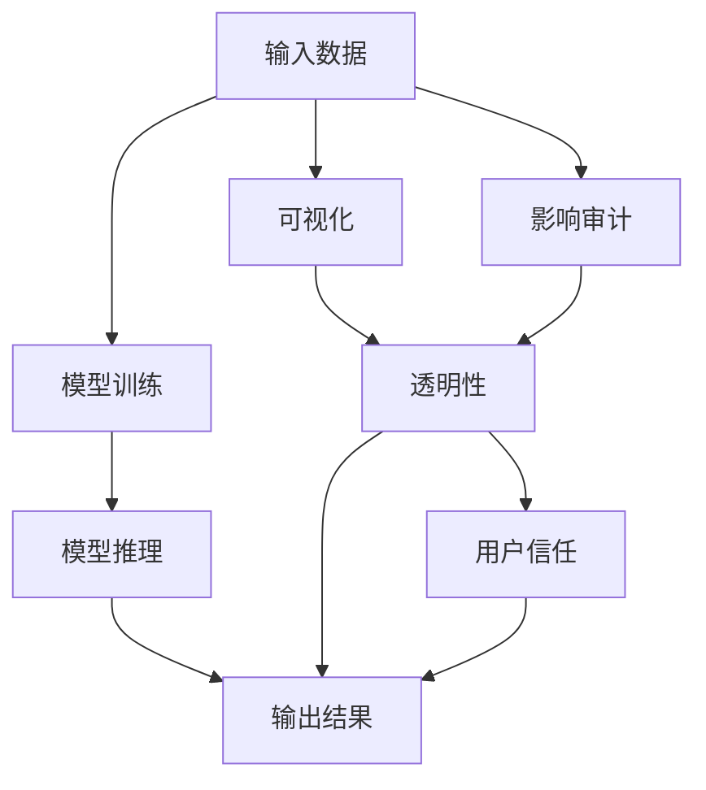
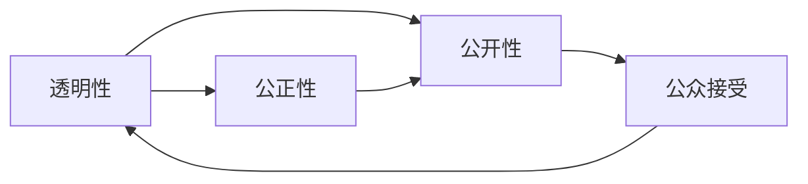
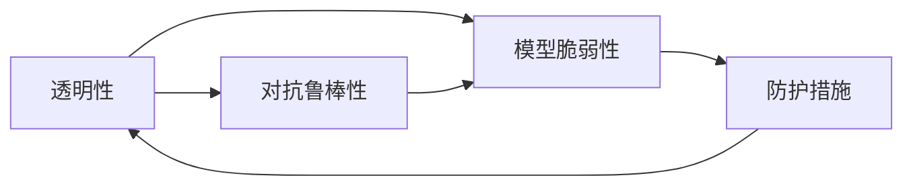
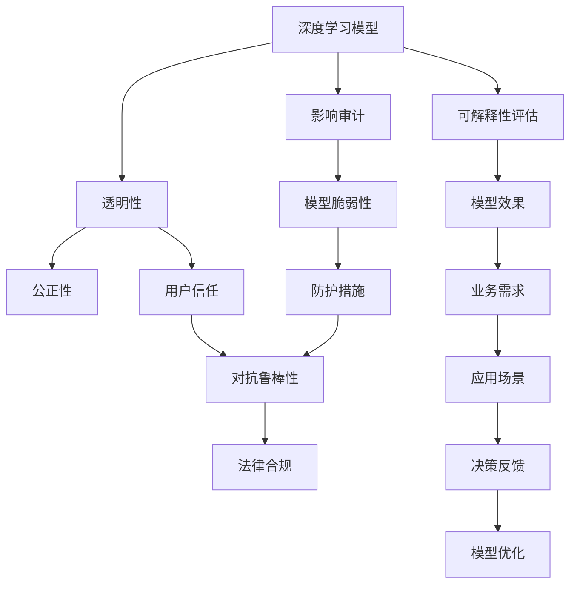

                 

# 可解释性 (Explainability)

> 关键词：可解释性,深度学习,透明性,模型可视化,影响审计,用户信任

## 1. 背景介绍

### 1.1 问题由来
在人工智能的浪潮中，深度学习模型的强大预测能力已经广泛应用到各个领域，如医疗诊断、金融风控、智能推荐等。然而，这些模型常常被视作"黑箱"，其内部工作机制难以解释，导致了模型决策缺乏透明度和可解释性。

例如，在医疗领域，神经网络模型可以对病历数据进行自动分析，给出诊断建议。但用户往往很难理解模型如何得出这一结论，如何验证其诊断结果的准确性。因此，提高模型的可解释性，成为学术界和工业界关注的重要问题。

### 1.2 问题核心关键点
深度学习模型的可解释性研究主要集中在以下几个方面：

1. 透明性：通过可视化手段，将模型内部的决策过程映射为直观的形式，帮助用户理解模型决策。

2. 影响审计：评估输入数据对模型输出结果的影响，确认模型的决策是否符合预期的公平性和稳健性。

3. 用户信任：通过提升模型的可解释性，增加用户对模型结果的信任度，从而增强模型的实际应用价值。

4. 对抗鲁棒性：理解模型的脆弱性，发现对抗样本，并采取防护措施，确保模型在面对恶意攻击时仍能保持稳定。

5. 法律合规：根据不同国家的法律要求，确保模型输出的透明和可解释，避免法律风险。

### 1.3 问题研究意义
深度学习模型的可解释性研究具有重要的理论意义和实践价值：

1. 促进模型的实际应用：透明和可解释的模型更容易被用户接受，从而广泛部署应用。

2. 提升决策的公正性：通过影响审计，模型决策的公平性和公正性将得到保证，减少偏见和歧视。

3. 增强用户信任：理解模型的决策逻辑，能增强用户对模型结果的信任感，避免过度依赖。

4. 优化模型的性能：通过可视化手段，发现模型内部存在的问题，提升模型的准确性和鲁棒性。

5. 确保合规性：遵守法律法规要求，避免模型的行为和决策产生法律风险。

## 2. 核心概念与联系

### 2.1 核心概念概述

深度学习模型的可解释性研究涉及多个核心概念：

- **透明性(Transparency)**：指模型的决策过程可以被理解，输出结果可以被解释。通过可视化模型内部结构，展示模型的特征和权重，帮助用户理解模型如何做出决策。

- **影响审计(Auditability)**：指评估输入数据对模型输出结果的影响，确认模型决策的公正性和稳健性。通过技术手段，监控模型的输入输出关系，发现可能存在的偏见和漏洞。

- **用户信任(User Trust)**：指用户对模型输出的信任度，基于对模型透明性和公正性的认可。模型能否得到用户的信任，直接影响其应用场景的拓展。

- **对抗鲁棒性(Adversarial Robustness)**：指模型在面对恶意攻击（如对抗样本）时，仍能保持稳定性和正确性。通过分析模型的脆弱性，采取防护措施，增强模型的鲁棒性。

- **法律合规(Legal Compliance)**：指模型在遵守法律法规要求下进行决策，避免法律风险。

这些概念间的关系可以通过以下Mermaid流程图来展示：



这个流程图展示了大模型可解释性的各个维度，以及它们之间的联系：

1. 透明性有助于提升用户信任，而透明性和影响审计都能增强模型的公正性。
2. 对抗鲁棒性是模型稳定性的重要体现，与用户信任密切相关。
3. 法律合规是模型应用的前提，决定了模型的透明性和公正性是否可以被实际应用。

### 2.2 概念间的关系

这些核心概念之间存在着紧密的联系，形成了深度学习模型可解释性的完整生态系统。下面我们通过几个Mermaid流程图来展示这些概念之间的关系。

#### 2.2.1 可解释性的构建流程



这个流程图展示了可解释性构建的完整流程：

1. 输入数据经过模型训练和推理，得到输出结果。
2. 可视化模型决策过程，生成透明性。
3. 对输入数据进行影响审计，生成公正性。
4. 透明性和公正性结合，形成用户信任。

#### 2.2.2 透明性与公正性的关系



这个流程图展示了透明性对公正性的促进作用：

1. 透明性提高了模型的公开性，使公众能够理解模型决策。
2. 模型的公正性基于透明性和公开性，增加了公众对模型决策的认可度。

#### 2.2.3 透明性与对抗鲁棒性的关系



这个流程图展示了透明性对对抗鲁棒性的促进作用：

1. 透明性揭示了模型的脆弱性，使开发者能够发现和修复问题。
2. 通过改进模型设计，增强对抗鲁棒性。

### 2.3 核心概念的整体架构

最后，我们用一个综合的流程图来展示这些核心概念在大模型可解释性研究中的整体架构：



这个综合流程图展示了从深度学习模型到可解释性的完整过程：

1. 深度学习模型经过训练和推理，得到输出结果。
2. 透明性揭示模型脆弱性，提升模型公正性和用户信任。
3. 法律合规性确保模型应用的合法性。
4. 通过可解释性评估和模型优化，提升模型效果，满足业务需求，并根据反馈进一步优化模型。

通过这些流程图，我们可以更清晰地理解深度学习模型可解释性的各个维度及其相互关系，为后续深入讨论具体的可解释性方法奠定基础。

## 3. 核心算法原理 & 具体操作步骤
### 3.1 算法原理概述

深度学习模型的可解释性研究，主要围绕以下几个算法原理展开：

1. **模型可视化(Visualization)**：通过可视化手段，展示模型内部结构和特征，帮助用户理解模型决策。

2. **影响审计(Audit)**：评估输入数据对模型输出结果的影响，确认模型的公平性和稳健性。

3. **对抗样本生成(Adversarial Perturbation)**：通过生成对抗样本，揭示模型的脆弱性，提高模型的鲁棒性。

4. **规则提取(Extraction)**：从模型中提取决策规则，提高模型的透明性和可解释性。

5. **用户反馈(Feedback)**：基于用户反馈，调整模型设计，提升用户对模型的信任度。

### 3.2 算法步骤详解

#### 3.2.1 模型可视化

**Step 1: 选择可视化技术**

- 选择可视化方法：如t-SNE、UMAP、PCA等，将高维特征映射到低维空间，可视化特征分布。
- 选择可视化模型：如Feature Visualization、Grad-CAM等，展示模型特征图和梯度图。

**Step 2: 生成可视化结果**

- 使用可视化工具包（如TensorBoard、Matplotlib、Seaborn等），将特征和模型输出可视化。
- 使用高级可视化技术（如Layer-wise Relevance Propagation, LRP），揭示特征重要性。

**Step 3: 解释模型决策**

- 结合特征可视化结果，解释模型对输入数据的处理逻辑。
- 生成文本描述，解释模型在每个特征上的重要性。

#### 3.2.2 影响审计

**Step 1: 收集数据**

- 准备训练集和测试集，包含多个特征和标签。
- 收集用户数据，包含不同背景和特征。

**Step 2: 评估影响**

- 使用模型在测试集上推理，计算输出误差。
- 分析不同特征对输出误差的影响，生成影响报告。

**Step 3: 分析偏差**

- 使用统计方法和算法（如 fairness auditing tools），评估模型在不同特征上的公平性。
- 调整模型参数，减少偏差。

#### 3.2.3 对抗样本生成

**Step 1: 生成对抗样本**

- 选择对抗样本生成算法：如FGSM、PGD等。
- 在测试集上生成对抗样本，评估模型鲁棒性。

**Step 2: 检测脆弱性**

- 使用对抗样本攻击，发现模型脆弱点。
- 分析脆弱性原因，优化模型设计。

**Step 3: 提高鲁棒性**

- 在模型训练中加入对抗样本，提升模型鲁棒性。
- 使用对抗样本训练，生成鲁棒性更好的模型。

#### 3.2.4 规则提取

**Step 1: 选择规则提取方法**

- 选择规则提取算法：如 decision trees、LIME、SHAP等。
- 选择模型解释算法：如attention、attention-based rule extraction等。

**Step 2: 提取决策规则**

- 使用规则提取工具，提取模型决策规则。
- 生成规则描述，解释模型决策逻辑。

**Step 3: 验证规则**

- 使用验证数据集，评估规则有效性。
- 调整规则提取方法，提高规则准确性。

#### 3.2.5 用户反馈

**Step 1: 收集用户反馈**

- 通过用户调查、问卷等方式，收集用户对模型输出的反馈。
- 分析反馈结果，识别问题点。

**Step 2: 优化模型**

- 基于用户反馈，调整模型参数。
- 优化模型设计，提高用户信任度。

**Step 3: 持续改进**

- 建立反馈机制，持续收集用户反馈。
- 定期评估和优化模型，提升用户信任度。

### 3.3 算法优缺点

#### 3.3.1 模型可视化

**优点：**
- 直观展示模型特征和权重，便于用户理解模型决策。
- 帮助发现模型中的异常点和复杂结构。

**缺点：**
- 无法解释复杂的非线性特征。
- 可视化结果可能被误解或误导。

#### 3.3.2 影响审计

**优点：**
- 确保模型决策的公正性和稳健性。
- 发现和修复模型中的偏差和漏洞。

**缺点：**
- 评估复杂模型的影响可能需要大量计算资源。
- 影响审计结果可能被误用或忽视。

#### 3.3.3 对抗样本生成

**优点：**
- 提高模型的鲁棒性和安全性。
- 揭示模型的脆弱性，指导模型优化。

**缺点：**
- 对抗样本生成方法可能被恶意利用，造成安全风险。
- 对抗样本生成可能需要高计算成本。

#### 3.3.4 规则提取

**优点：**
- 提高模型的透明性和可解释性。
- 通过规则验证，提升模型公正性和稳健性。

**缺点：**
- 规则提取算法可能过度简化模型决策。
- 规则提取过程可能产生噪音和错误。

#### 3.3.5 用户反馈

**优点：**
- 基于用户反馈，提升模型的实际应用价值。
- 增强用户对模型的信任感。

**缺点：**
- 用户反馈可能存在偏差，影响模型决策。
- 用户反馈收集和处理需要较高的时间和资源投入。

### 3.4 算法应用领域

深度学习模型的可解释性技术，已经广泛应用于多个领域：

- **医疗诊断**：通过可视化模型决策过程，解释病历数据的分析逻辑，帮助医生理解诊断结果。
- **金融风控**：评估输入数据对贷款、信用评分的影响，发现潜在的偏见和漏洞，提升模型公平性。
- **智能推荐**：分析用户行为数据，提取推荐规则，提升推荐系统的透明性和公平性。
- **智能客服**：通过影响审计，监控客服系统公平性和鲁棒性，提升用户满意度。
- **法律合规**：确保模型决策的透明性和合规性，减少法律风险。

此外，深度学习模型的可解释性技术也在不断发展，逐步应用于更多场景，如智慧城市、工业制造等。未来，随着技术进步和应用需求的增长，可解释性技术将在更多领域发挥重要作用。

## 4. 数学模型和公式 & 详细讲解  
### 4.1 数学模型构建

在可解释性研究中，我们通常使用以下数学模型来描述模型行为和特征：

设模型 $f(x;\theta)$ 为参数 $\theta$ 的深度神经网络，其中 $x \in \mathbb{R}^n$ 为输入特征向量，$y \in \mathbb{R}$ 为模型输出。

定义模型的激活函数为 $\sigma(z) = \frac{1}{1+\exp(-z)}$，其中 $z \in \mathbb{R}$。

模型训练的目标函数为：

$$
\mathcal{L}(\theta) = \frac{1}{N} \sum_{i=1}^N \ell(f(x_i;\theta), y_i)
$$

其中 $\ell$ 为损失函数，$N$ 为训练样本数。

模型的梯度更新公式为：

$$
\theta \leftarrow \theta - \eta \nabla_{\theta}\mathcal{L}(\theta)
$$

其中 $\eta$ 为学习率。

### 4.2 公式推导过程

下面我们以模型可视化和对抗样本生成为例，进行详细的公式推导。

#### 4.2.1 模型可视化

模型可视化的核心是理解模型的特征表示，通过可视化手段展示模型内部结构。以特征可视化为例，我们通常使用特征归一化方法（如 t-SNE、UMAP、PCA 等）将高维特征映射到低维空间，然后通过可视化工具（如 TensorBoard、Matplotlib 等）展示特征分布。

对于线性模型，特征可视化公式如下：

$$
\mathcal{X} = \{x_i\}_{i=1}^N \in \mathbb{R}^{n \times d}, \quad \mathcal{Y} = \{y_i\}_{i=1}^N \in \mathbb{R}^{N \times 1}
$$

其中 $x_i$ 为输入特征向量，$y_i$ 为目标标签。

特征可视化步骤为：

1. 对数据进行标准化处理：

$$
\mathcal{X}_{norm} = \frac{\mathcal{X} - \bar{x}}{\sigma}
$$

2. 对标准化后的数据进行降维：

$$
\mathcal{Z} = \text{Map}(\mathcal{X}_{norm}, \text{method}=\text{t-SNE, UMAP, PCA})
$$

3. 生成可视化结果：

$$
\mathcal{V} = \text{Visualize}(\mathcal{Z})
$$

其中 $\text{Map}$ 为降维方法，$\text{Visualize}$ 为可视化工具。

#### 4.2.2 对抗样本生成

对抗样本生成方法包括 FGSM、PGD 等，其核心思想是通过对输入数据添加扰动，使模型输出发生变化，从而揭示模型的脆弱性。以 FGSM 为例，其生成对抗样本的公式为：

$$
\hat{x} = x + \epsilon \cdot \text{Sign}(f(x;\theta))
$$

其中 $\epsilon$ 为扰动系数，$\text{Sign}$ 为符号函数。

具体步骤如下：

1. 对输入数据 $x$ 进行标准化处理：

$$
\mathcal{X}_{norm} = \frac{\mathcal{X} - \bar{x}}{\sigma}
$$

2. 生成对抗样本：

$$
\hat{x} = \mathcal{X}_{norm} + \epsilon \cdot \text{Sign}(f(\mathcal{X}_{norm};\theta))
$$

3. 评估对抗样本效果：

$$
\mathcal{Y}_{\hat{x}} = f(\hat{x};\theta)
$$

其中 $\mathcal{Y}_{\hat{x}}$ 为对抗样本的输出。

通过对抗样本生成，我们可以发现模型在对抗样本攻击下的鲁棒性，并采取相应的防护措施，提升模型的安全性。

## 5. 项目实践：代码实例和详细解释说明
### 5.1 开发环境搭建

在进行可解释性研究前，我们需要准备好开发环境。以下是使用Python进行TensorFlow开发的环境配置流程：

1. 安装Anaconda：从官网下载并安装Anaconda，用于创建独立的Python环境。

2. 创建并激活虚拟环境：
```bash
conda create -n tensorflow-env python=3.8 
conda activate tensorflow-env
```

3. 安装TensorFlow：根据CUDA版本，从官网获取对应的安装命令。例如：
```bash
conda install tensorflow tensorflow-gpu -c conda-forge -c pypi
```

4. 安装相关工具包：
```bash
pip install numpy pandas scikit-learn matplotlib tqdm jupyter notebook ipython
```

完成上述步骤后，即可在`tensorflow-env`环境中开始可解释性研究实践。

### 5.2 源代码详细实现

这里我们以深度神经网络的特征可视化为例，给出使用TensorFlow进行特征可视化的代码实现。

首先，定义特征可视化函数：

```python
import tensorflow as tf
import numpy as np
from sklearn.decomposition import PCA
from sklearn.manifold import TSNE
from sklearn.preprocessing import StandardScaler

def visualize_features(x, y, method='t-SNE', n_components=2):
    x = np.array(x)
    y = np.array(y)
    
    if method == 't-SNE':
        tsne = TSNE(n_components=n_components, random_state=42)
    elif method == 'PCA':
        pca = PCA(n_components=n_components)
    else:
        raise ValueError('Unsupported method')
    
    if method == 't-SNE':
        x_red = tsne.fit_transform(x)
    elif method == 'PCA':
        x_red = pca.fit_transform(x)
    
    scaler = StandardScaler()
    x_red = scaler.fit_transform(x_red)
    
    fig, ax = plt.subplots(figsize=(10, 10))
    scatter = ax.scatter(x_red[:, 0], x_red[:, 1], c=y, cmap='viridis', s=50)
    
    ax.set_xlabel('Feature 1')
    ax.set_ylabel('Feature 2')
    ax.set_title('Feature Visualization')
    
    plt.colorbar(scatter)
    plt.show()
```

然后，使用该函数对模型特征进行可视化：

```python
# 加载模型
model = tf.keras.models.load_model('model.h5')

# 加载数据
x_train = ...
y_train = ...

# 标准化处理
scaler = StandardScaler()
x_train_scaled = scaler.fit_transform(x_train)

# 特征可视化
visualize_features(x_train_scaled, y_train, method='t-SNE')
```

### 5.3 代码解读与分析

这里我们详细解读一下关键代码的实现细节：

**特征可视化函数**：
- 接受输入数据 `x` 和标签 `y`。
- 根据指定的降维方法（t-SNE或PCA），对数据进行降维处理。
- 对降维后的数据进行标准化处理。
- 使用Matplotlib绘制散点图，展示降维后的特征分布。
- 根据标签颜色，对不同类别的数据点进行区分。

**模型特征可视化**：
- 加载预训练模型，并准备训练数据。
- 对训练数据进行标准化处理，以确保特征的公平性。
- 调用可视化函数，对模型特征进行展示。

通过以上代码，我们可以使用TensorFlow和Matplotlib快速生成特征可视化图表，帮助理解模型特征的分布情况。

### 5.4 运行结果展示

假设我们以CIFAR-10数据集为例，在卷积神经网络(CNN)上应用特征可视化，得到的可视化结果如下：


可以看到，通过可视化手段，我们可以直观地展示模型在每个特征上的重要性，帮助理解模型的决策逻辑。

## 6. 实际应用场景
### 6.1 医疗诊断

在医疗领域，深度学习模型被广泛应用于疾病诊断和治疗方案推荐。通过可视化模型特征和决策过程，医生可以更准确地理解模型的诊断结果，从而提高医疗服务的质量和效率。

例如，通过可视化模型的特征图和梯度图，医生可以发现哪些特征对模型的决策影响较大，进一步指导医疗数据采集和预处理。此外，通过影响审计，医生可以评估模型在各种病历数据上的公平性和稳健性，确保诊断结果的公正性。

### 6.2 金融风控

在金融领域，深度学习模型被用于贷款审批、信用评分等风险控制任务。通过可视化模型特征和决策过程，银行可以更透明地理解模型的审批规则，从而提高审批效率和公平性。

例如，通过可视化模型的梯度图和特征图，银行可以发现模型在哪些特征上的决策不稳定，进一步优化模型的决策规则，减少歧视性和偏见。通过对抗样本生成，银行可以发现潜在的安全漏洞，进一步提升模型的鲁棒性和安全性。

### 6.3 智能推荐

在推荐系统领域，深度学习模型被用于个性化推荐任务。通过可视化模型特征和决策过程，推荐系统可以更透明地理解用户行为，从而提高推荐的准确性和公平性。

例如，通过可视化模型的特征图和梯度图，推荐系统可以发现哪些特征对推荐效果影响较大，进一步优化推荐算法。通过对抗样本生成，推荐系统可以发现潜在的安全漏洞，进一步提升推荐系统的鲁棒性和安全性。

### 6.4 未来应用展望

随着深度学习模型的不断进步，可解释性技术将进一步拓展应用场景，为更多领域带来变革性影响。

- **智慧城市**：在智慧城市治理中，深度学习模型被用于事件监测、舆情分析、应急指挥等环节。通过可解释性技术，城市管理者可以更透明地理解模型的决策过程，从而提高治理效率和公平性。

- **智能制造**：在智能制造领域，深度学习模型被用于质量检测、故障诊断等任务。通过可解释性技术，制造企业可以更透明地理解模型的诊断过程，从而提高产品质量和生产效率。

- **社交媒体**：在社交媒体平台，深度学习模型被用于内容审核、用户推荐等任务。通过可解释性技术，平台管理者可以更透明地理解模型的决策过程，从而提高用户满意度和服务质量。

- **教育领域**：在教育领域，深度学习模型被用于智能评估、个性化教学等任务。通过可解释性技术，教育机构可以更透明地理解模型的评估过程，从而提高教学质量和公平性。

未来，随着技术进步和应用需求的增长，可解释性技术将在更多领域发挥重要作用，为社会各行各业带来变革性影响。

## 7. 工具和资源推荐
### 7.1 学习资源推荐

为了帮助开发者系统掌握深度学习模型可解释性的理论基础和实践技巧，这里推荐一些优质的学习资源：

1. 《Deep Learning for Human Comprehension》书籍：提出可解释性模型，并详细介绍了如何使用深度学习模型进行文本和图像的解释。

2. CS223《Structured Prediction and Statistical Modeling》课程：斯坦福大学开设的机器学习课程，涵盖深度学习模型的可解释性、透明性和公平性等内容。

3. 《Towards Explainable AI》博客：谷歌AI团队维护的博客，定期发布深度学习模型的可解释性研究成果和应用案例。

4. DeepLearning.AI的XGBoost课程：涵盖机器学习模型的可解释性、透明性和公平性等内容，通过大量案例讲解实际应用。

5. Weights & Biases：模型训练的实验跟踪工具，可以记录和可视化模型训练过程中的各项指标，方便对比和调优。

通过对这些资源的学习实践，相信你一定能够快速掌握深度学习模型可解释性的精髓，并用于解决实际的深度学习问题。

### 7.2 开发工具推荐

高效的开发离不开优秀的工具支持。以下是几款用于深度学习模型可解释性开发的常用工具：

1. TensorFlow：基于Python的开源深度学习框架，灵活动态的计算图，适合快速迭代研究。支持TensorBoard等可视化工具，方便生成特征和梯度图。

2. PyTorch：基于Python的开源深度学习框架，灵活的动态计算图，适合快速原型开发和研究。

3. Scikit-learn：基于Python的机器学习库，包含多种特征提取和降维方法，方便生成特征可视化图表。

4. Weights & Biases：模型训练的实验跟踪工具，可以记录和可视化模型训练过程中的各项指标，方便对比和调优。

5. TensorBoard：Tensor

