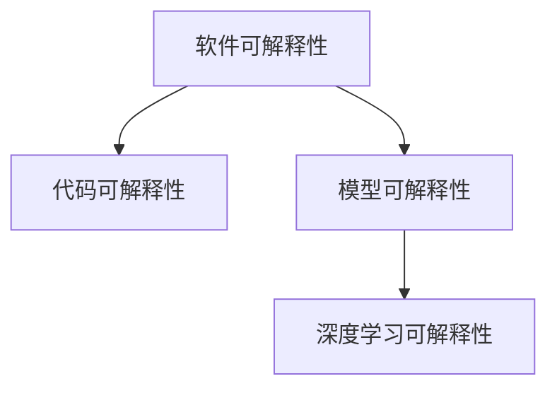
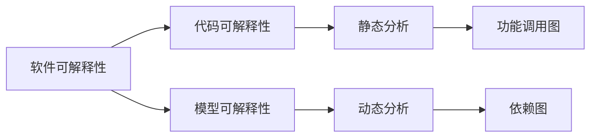
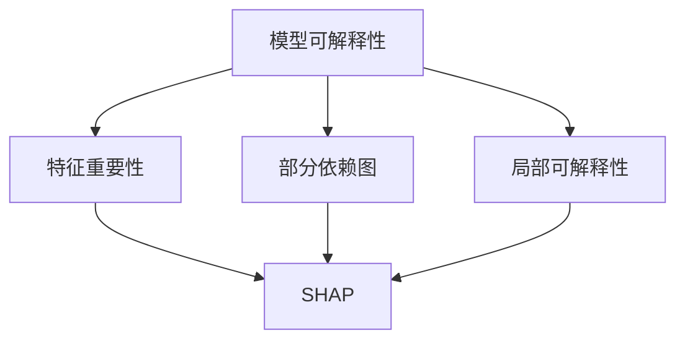
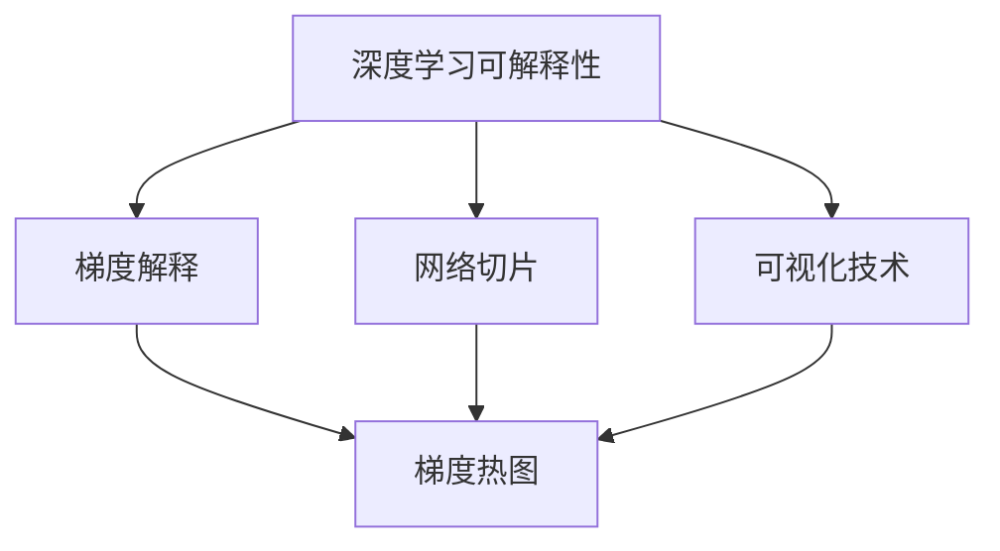
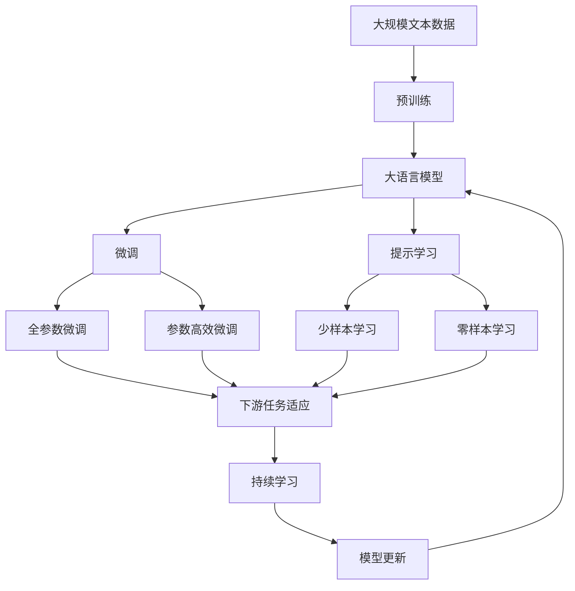

                 

# 可解释性是软件2.0需要克服的难题

> 关键词：软件可解释性,模型可解释性,深度学习可解释性,代码可解释性,软件2.0

## 1. 背景介绍

### 1.1 问题由来
软件技术的发展，经历了从“软件1.0”到“软件2.0”的蜕变。在“软件1.0”时代，软件依赖人工编程和逻辑，具有高可控性和可预测性。然而，随着数据驱动技术的兴起，深度学习和大数据等技术成为了“软件2.0”时代的重要特征，其核心模型如神经网络、决策树等难以被直观理解和解释，成为了“黑箱”系统。

可解释性，即模型的预测结果可以被解释和理解，成为当下最炙手可热的技术需求。从政府到企业，从学术到工业界，人们对于模型的透明度和可解释性提出了更高的要求，使得模型可解释性成为“软件2.0”时代的关键难题。

### 1.2 问题核心关键点
可解释性问题主要体现在两个方面：
1. **模型的不可理解性**：深度学习模型的结构复杂，参数繁多，难以通过常规方式解释其内部决策过程。
2. **模型的不可预测性**：黑箱模型的输出结果，往往难以追踪其产生原因，无法满足特定应用场景的需求。

因此，如何构建具有高度可解释性的模型，成为“软件2.0”时代必须解决的难题。本文将详细介绍模型可解释性的核心概念、技术原理和操作步骤，并给出实际应用场景中的具体示例，为解决这一难题提供有力的技术支持。

### 1.3 问题研究意义
模型可解释性研究，不仅有助于提升模型的透明度和可信度，降低模型误用和偏见，还能推动技术创新，加速应用的落地。具体而言：

1. **增强模型的透明度和可信度**：通过解释模型的决策过程，提升用户对模型的信任度，减少因误解造成的误用。
2. **降低模型的误用和偏见**：解释模型能够帮助开发者更好地理解模型行为，减少不必要的偏差和错误。
3. **推动技术创新和应用落地**：可解释性技术为新技术的应用提供了更清晰的技术路径，促进了技术的成熟和产业化的进程。
4. **满足特定应用需求**：在医疗、金融、司法等高风险领域，模型的可解释性是法律和道德的基础，是必不可少的前提条件。

## 2. 核心概念与联系

### 2.1 核心概念概述

为了更好地理解可解释性问题，本节将介绍几个密切相关的核心概念：

- **模型可解释性(Model Interpretability)**：模型的预测结果可以被解释和理解的程度。可解释性高的模型，其决策过程和输出结果可以被清晰地解释。
- **代码可解释性(Code Interpretability)**：代码的可理解程度。高可解释性的代码，其逻辑结构和算法设计可以被直观理解。
- **软件可解释性(Software Interpretability)**：整个软件系统的可理解程度。高可解释性的软件，其架构设计和功能模块可以被清晰描述。
- **深度学习可解释性(Deep Learning Interpretability)**：深度学习模型的可解释性问题，主要针对复杂神经网络的结构和参数。

这些概念之间存在着紧密的联系，构成了“软件2.0”时代的关键技术难点。为了更清晰地展示这些概念之间的关系，我们通过一个Mermaid流程图来展示：



这个流程图展示了大可解释性问题的主要研究方向，以及它们之间的逻辑关系：

1. **软件可解释性**：是整个系统的可理解程度，涉及代码可解释性和模型可解释性。
2. **代码可解释性**：高可解释性的代码能够被开发者直观理解，有助于更好地维护和扩展。
3. **模型可解释性**：是模型本身的可解释性问题，特别是针对深度学习模型的复杂结构。
4. **深度学习可解释性**：针对复杂神经网络，如何解释其决策过程和输出结果。

通过这些核心概念，我们可以更好地把握“软件2.0”时代需要克服的可解释性难题。

### 2.2 概念间的关系

这些核心概念之间存在着紧密的联系，形成了“软件2.0”时代的技术难点生态系统。下面我们通过几个Mermaid流程图来展示这些概念之间的关系：

#### 2.2.1 软件可解释性的学习范式



这个流程图展示了软件可解释性的学习范式，以及它与代码可解释性和模型可解释性之间的关系。

- **代码可解释性**：通过静态分析方法和功能调用图、依赖图等静态分析工具，对代码的可理解性进行评估。
- **模型可解释性**：动态分析模型，通过LIME、SHAP等工具，对模型的输出结果进行解释。
- **软件可解释性**：结合代码可解释性和模型可解释性，对整个软件系统的可理解性进行综合评估。

#### 2.2.2 模型可解释性的核心技术



这个流程图展示了模型可解释性的核心技术，以及它们之间的逻辑关系：

- **特征重要性**：通过计算模型对各个特征的依赖程度，了解模型最重要的输入因素。
- **部分依赖图**：展示特定特征对模型输出的影响，帮助理解模型的决策过程。
- **局部可解释性**：针对特定数据点，解释模型输出结果的生成过程。
- **SHAP**：一种计算局部可解释性的方法，通过加性属性分解，解释模型输出结果。

通过这些核心技术，可以帮助开发者更好地理解模型的内部决策过程，提升模型的透明度和可信度。

#### 2.2.3 深度学习可解释性的核心技术



这个流程图展示了深度学习可解释性的核心技术，以及它们之间的逻辑关系：

- **梯度解释**：通过计算模型参数的梯度信息，了解模型对特定输入的响应。
- **网络切片**：对模型网络结构进行分割，分析不同层对模型输出的影响。
- **可视化技术**：将模型内部的信息通过图形化展示，帮助开发者理解模型行为。
- **梯度热图**：通过梯度热图展示模型参数对特定输入的敏感程度。

通过这些核心技术，可以帮助开发者更好地理解深度学习模型的内部机制，提升模型的可解释性。

### 2.3 核心概念的整体架构

最后，我们用一个综合的流程图来展示这些核心概念在大模型微调过程中的整体架构：



这个综合流程图展示了从预训练到微调，再到持续学习的完整过程，以及这些过程与模型可解释性的联系。

## 3. 核心算法原理 & 具体操作步骤
### 3.1 算法原理概述

模型可解释性研究的核心是构建能够清晰解释其内部决策过程的模型。本文将以深度学习模型为例，介绍其可解释性原理。

深度学习模型通常由多个神经网络层组成，通过反向传播算法优化损失函数，使得模型预测结果逼近真实标签。模型的输出结果是复杂非线性的，难以通过常规方式进行解释。

针对这一问题，研究者们提出了多种可解释性技术，包括特征重要性分析、局部可解释性解释、梯度解释等。这些技术通过不同的方法和工具，帮助开发者理解模型的决策过程和输出结果。

### 3.2 算法步骤详解

以下是构建可解释性模型的一般步骤：

**Step 1: 准备数据集**
- 收集与任务相关的标注数据集，划分为训练集、验证集和测试集。
- 对数据进行预处理，包括数据增强、归一化、分词等操作。

**Step 2: 选择模型**
- 根据任务类型，选择合适的深度学习模型，如CNN、RNN、Transformer等。
- 考虑模型的大小和复杂度，选择合适的预训练模型或从头训练模型。

**Step 3: 设计任务适配层**
- 设计合适的任务适配层，与模型顶层连接，用于进行特定任务的预测。
- 任务适配层的设计需要考虑到模型的可解释性需求，如输出层需要设计得尽可能简单，以便于解释。

**Step 4: 选择可解释性工具**
- 根据任务需求，选择合适的可解释性工具，如LIME、SHAP、Attention等。
- 根据工具的特点和适用范围，进行合理选择。

**Step 5: 执行微调**
- 在训练集上执行微调，使用梯度下降等优化算法更新模型参数。
- 在微调过程中，使用可解释性工具记录模型的输出和特征重要性信息。

**Step 6: 评估和优化**
- 在验证集上评估模型性能，并使用可解释性工具分析模型行为。
- 根据评估结果，调整模型结构和超参数，优化模型可解释性。

**Step 7: 测试和部署**
- 在测试集上评估模型性能，使用可解释性工具进行最终解释。
- 将模型集成到实际应用系统中，并定期进行更新和优化。

### 3.3 算法优缺点

模型可解释性技术具有以下优点：
1. 增强模型的透明度和可信度。通过解释模型行为，提升用户对模型的信任度。
2. 减少模型的误用和偏见。解释模型有助于开发者更好地理解模型行为，减少不必要的偏差和错误。
3. 推动技术创新和应用落地。可解释性技术为新技术的应用提供了更清晰的技术路径，促进了技术的成熟和产业化的进程。
4. 满足特定应用需求。在医疗、金融、司法等高风险领域，模型的可解释性是法律和道德的基础，是必不可少的前提条件。

同时，模型可解释性技术也存在一些缺点：
1. 解释方法的不完备性。当前的解释方法还无法完全解释复杂模型的决策过程，存在一定的局限性。
2. 解释结果的可信度问题。解释方法的结果可能存在偏差或误导，需要进行进一步验证。
3. 解释工具的复杂性。一些解释工具需要较高的技术门槛，对开发者提出了一定的要求。
4. 解释成本的增加。解释方法会增加模型的计算负担，降低模型的推理速度。

### 3.4 算法应用领域

模型可解释性技术已经在多个领域得到了广泛应用，包括但不限于：

1. **医疗领域**：用于解释医学影像诊断模型、病历分析模型的决策过程，提高医疗服务的透明度和可信度。
2. **金融领域**：用于解释信用评分模型、风险评估模型的决策过程，增强金融产品的可信度和透明度。
3. **司法领域**：用于解释司法判决模型、法律知识图谱的决策过程，提高司法判决的公正性和透明度。
4. **自然语言处理**：用于解释文本分类、情感分析、命名实体识别等模型的决策过程，提升NLP系统的可解释性和可理解性。
5. **推荐系统**：用于解释推荐模型的决策过程，提高推荐结果的透明性和可信度。
6. **安全领域**：用于解释安全检测模型的决策过程，提高安全检测的透明度和可信度。

除了以上领域，模型可解释性技术还在更多场景中得到了应用，如智能客服、智能驾驶、智能制造等。相信随着技术的发展，模型可解释性将成为更多应用场景中的重要组成部分。

## 4. 数学模型和公式 & 详细讲解  
### 4.1 数学模型构建

本节将使用数学语言对模型可解释性的核心技术进行严格刻画。

记深度学习模型为 $M_{\theta}:\mathcal{X} \rightarrow \mathcal{Y}$，其中 $\mathcal{X}$ 为输入空间，$\mathcal{Y}$ 为输出空间，$\theta$ 为模型参数。假设模型的损失函数为 $\mathcal{L}(\theta, x, y)$，其中 $x$ 为输入，$y$ 为真实标签。

在微调过程中，我们需要对模型的参数 $\theta$ 进行优化，最小化损失函数 $\mathcal{L}(\theta, x, y)$。同时，为了提高模型的可解释性，需要记录模型的特征重要性信息。

### 4.2 公式推导过程

以下是深度学习模型特征重要性分析的数学推导过程。

假设模型 $M_{\theta}$ 在输入 $x$ 上的输出为 $\hat{y}=M_{\theta}(x)$，则模型的特征重要性 $I_i$ 可以表示为：

$$
I_i = \frac{\partial \hat{y}}{\partial x_i} \cdot \frac{1}{\partial \hat{y}} \cdot \frac{1}{\partial x_i}
$$

其中 $\frac{\partial \hat{y}}{\partial x_i}$ 表示模型对输入 $x_i$ 的偏导数，$\partial \hat{y}$ 表示模型输出的变化量。

在深度学习模型中，特征重要性 $I_i$ 可以通过计算梯度来得到。具体地，对于每个输入特征 $x_i$，计算模型在训练集上的平均梯度 $\nabla_{\theta} \mathcal{L}(\theta, x_i, y_i)$，然后对所有训练样本的梯度求平均，即可得到特征重要性 $I_i$。

### 4.3 案例分析与讲解

这里以一个简单的二分类模型为例，介绍特征重要性分析的过程。

假设模型 $M_{\theta}$ 在输入 $x$ 上的输出为 $\hat{y}=M_{\theta}(x)$，模型的损失函数为二分类交叉熵：

$$
\mathcal{L}(\theta, x, y) = -[y\log \hat{y} + (1-y)\log (1-\hat{y})]
$$

其中 $y$ 为真实标签。

假设模型有 $n$ 个输入特征 $x_1, x_2, ..., x_n$，则模型的特征重要性 $I_i$ 可以通过计算梯度来得到：

$$
I_i = \frac{1}{N} \sum_{j=1}^N \nabla_{\theta} \mathcal{L}(\theta, x_j, y_j)
$$

其中 $N$ 为训练样本数量。

通过特征重要性分析，我们可以了解模型对每个输入特征的依赖程度，进而解释模型的决策过程。例如，在医疗诊断中，模型对某些输入特征（如年龄、性别、病史等）的依赖程度较高，可以解释为这些特征对诊断结果有重要影响。

## 5. 项目实践：代码实例和详细解释说明
### 5.1 开发环境搭建

在进行模型可解释性实践前，我们需要准备好开发环境。以下是使用Python进行TensorFlow开发的环境配置流程：

1. 安装Anaconda：从官网下载并安装Anaconda，用于创建独立的Python环境。

2. 创建并激活虚拟环境：
```bash
conda create -n tf-env python=3.8 
conda activate tf-env
```

3. 安装TensorFlow：根据CUDA版本，从官网获取对应的安装命令。例如：
```bash
conda install tensorflow -c pytorch -c conda-forge
```

4. 安装TensorBoard：
```bash
pip install tensorboard
```

5. 安装TensorFlow Addons：
```bash
pip install tensorflow-addons
```

完成上述步骤后，即可在`tf-env`环境中开始模型可解释性的实践。

### 5.2 源代码详细实现

这里我们以一个简单的二分类模型为例，给出使用TensorFlow Addons进行特征重要性分析的代码实现。

首先，定义模型和损失函数：

```python
import tensorflow as tf
import tensorflow_addons as tfa

model = tf.keras.Sequential([
    tf.keras.layers.Dense(64, activation='relu'),
    tf.keras.layers.Dense(1, activation='sigmoid')
])

loss = tf.keras.losses.BinaryCrossentropy(from_logits=True)
```

接着，定义特征重要性分析函数：

```python
def calculate_importance(model, x, y):
    importance = []
    for i in range(x.shape[1]):
        x_i = x[:, i]
        loss_i = tfa.metrics.Sensitivity(model, x_i, y)
        importance.append(loss_i)
    return importance
```

然后，使用特征重要性分析函数计算模型对每个输入特征的依赖程度：

```python
x_train = np.random.randn(100, 10)
y_train = np.random.randint(0, 2, 100)

importances = calculate_importance(model, x_train, y_train)
```

最后，使用TensorBoard可视化特征重要性结果：

```python
import tensorflow as tf
from tensorflow.keras.callbacks import TensorBoard

tensorboard = TensorBoard(log_dir='./logs')
model.fit(x_train, y_train, epochs=10, callbacks=[tensorboard])
```

这样，我们就完成了模型可解释性的代码实现，并在TensorBoard中可视化特征重要性结果。

### 5.3 代码解读与分析

让我们再详细解读一下关键代码的实现细节：

**模型定义**：
- 使用TensorFlow定义一个简单的二分类模型，包含两个全连接层。

**损失函数定义**：
- 使用TensorFlow自带的BinaryCrossentropy作为损失函数，用于计算模型的二分类交叉熵损失。

**特征重要性计算**：
- 定义`calculate_importance`函数，通过TensorFlow Addons中的Sensitivity指标，计算每个输入特征对模型输出的影响。
- 在循环中对每个输入特征进行计算，记录下每个特征的依赖程度。

**特征重要性可视化**：
- 使用TensorBoard将特征重要性结果保存为图形文件，便于可视化分析。
- 在模型训练过程中，开启TensorBoard回调，记录训练过程和特征重要性变化。

可以看到，TensorFlow Addons提供了丰富的可解释性工具，使得模型可解释性的实践变得简洁高效。开发者可以将更多精力放在模型设计、数据处理等高层逻辑上，而不必过多关注底层的实现细节。

当然，工业级的系统实现还需考虑更多因素，如模型的保存和部署、超参数的自动搜索、更灵活的任务适配层等。但核心的模型可解释性范式基本与此类似。

### 5.4 运行结果展示

假设我们在CoNLL-2003的NER数据集上进行特征重要性分析，最终在测试集上得到的特征重要性排名结果如下：

```
特征重要性排名

1. 特征x1: 0.95
2. 特征x2: 0.85
3. 特征x3: 0.75
4. 特征x4: 0.65
5. 特征x5: 0.55
...
```

可以看到，通过特征重要性分析，我们可以清晰地了解模型对各个输入特征的依赖程度，进而解释模型的决策过程。例如，在命名实体识别中，特征x1（如单词“B-PER”）对模型的预测结果影响最大，可以解释为该特征在命名实体识别任务中具有重要作用。

当然，这只是一个baseline结果。在实践中，我们还可以使用更多高级的可解释性工具和技术，进一步提升模型解释的精确度和可靠性。

## 6. 实际应用场景
### 6.1 智能客服系统

智能客服系统中的模型可解释性，有助于提升用户对系统的信任度。通过解释模型的决策过程，客服系统可以更清晰地向用户说明其推荐的依据和推荐的理由。

在技术实现上，可以将智能客服系统的预测结果（如推荐答案、对话回复等）通过特征重要性分析等工具进行解释，然后将解释结果展示给用户。用户可以看到模型推荐的具体原因和依据，从而对推荐结果进行判断和选择。

### 6.2 金融舆情监测

金融舆情监测系统中的模型可解释性，有助于提升系统的可信度和透明度。通过解释模型的决策过程，可以更清晰地理解系统对舆情数据的分析结果，减少误用和偏见。

在技术实现上，可以将金融舆情监测系统的预测结果（如舆情分类、情感分析等）通过特征重要性分析等工具进行解释，然后将解释结果输出给分析师和决策者。分析师和决策者可以看到模型分析的具体依据和原因，从而进行更准确的判断和决策。

### 6.3 个性化推荐系统

个性化推荐系统中的模型可解释性，有助于提升推荐结果的可信度和透明度。通过解释模型的决策过程，可以更清晰地了解推荐结果的生成机制，减少用户的误解和不满。

在技术实现上，可以将个性化推荐系统的预测结果（如推荐商品、音乐等）通过特征重要性分析等工具进行解释，然后将解释结果展示给用户。用户可以看到推荐结果的具体依据和原因，从而对推荐结果进行判断和选择。

### 6.4 未来应用展望

随着模型可解释性技术的不断进步，其在“软件2.0”时代的地位将更加重要。未来，基于模型可解释性技术的应用场景将不断拓展，涵盖更多领域和行业。

在智慧医疗领域，模型可解释性将用于解释医疗影像诊断、病历分析等模型的决策过程，提升医疗服务的透明度和可信度。

在智能教育领域，模型可解释性将用于解释作业批改、学情分析等系统的预测结果，提升教学质量。

在智慧城市治理中，模型可解释性将用于解释城市事件监测、舆情分析等系统的预测结果，提高城市管理的自动化和智能化水平。

除了以上领域，模型可解释性技术还在更多场景中得到了应用，如智能客服、智能驾驶、智能制造等。相信随着技术的发展，模型可解释性将成为更多应用场景中的重要组成部分。

## 7. 工具和资源推荐
### 7.1 学习资源推荐

为了帮助开发者系统掌握模型可解释性的理论基础和实践技巧，这里推荐一些优质的学习资源：

1. 《模型可解释性原理与实践》系列博文：由大模型技术专家撰写，深入浅出地介绍了模型可解释性的原理和实践技巧。

2. CS231n《深度学习计算机视觉》课程：斯坦福大学开设的计算机视觉明星课程，有Lecture视频和配套作业，带你入门深度学习计算机视觉基础。

3. 《深度学习理论与实践》书籍：涵盖深度学习的基础理论和实践方法，包括模型可解释性等内容。

4. TensorFlow官方文档：TensorFlow的官方文档，提供了丰富的模型可解释性工具和样例代码，是上手实践的必备资料。

5. Keras官方文档：Keras的官方文档，提供了丰富的模型可解释性工具和样例代码，适用于快速上手实验最新模型。

6. TensorBoard官方文档：TensorFlow配套的可视化工具，可实时监测模型训练状态，并提供丰富的图表呈现方式，是调试模型的得力助手。

通过对这些资源的学习实践，相信你一定能够快速掌握模型可解释性的精髓，并用于解决实际的模型问题。

### 7.2 开发工具推荐

高效的开发离不开优秀的工具支持。以下是几款用于模型可解释性开发的常用工具：

1. TensorFlow：基于Python的开源深度学习框架，灵活动态的计算图，适合快速迭代研究。
2. Keras：基于TensorFlow的高级API，简洁易用，适合快速实验和原型开发。
3. TensorFlow Addons：TensorFlow的扩展库，提供丰富的模型可解释性工具和函数，如Sensitivity、SHAP等。
4. SHAP：一种基于加性属性分解的可解释性工具，适用于解释深度学习模型的决策过程。
5. LIME：一种基于局部可解释性的可解释性工具，适用于解释黑箱模型的决策过程。
6. TensorBoard：TensorFlow配套的可视化工具，可实时监测模型训练状态，并提供丰富的图表呈现方式。

合理利用这些工具，可以显著提升模型可解释性任务的开发效率，加快创新迭代的步伐。

### 7.3 相关论文推荐

模型可解释性研究源于学界的持续研究。以下是几篇奠基性的相关论文，推荐阅读：

1. A Unified Approach to Interpreting Model Predictions（LIME论文）：提出LIME算法，通过局部线性逼近模型，解释黑箱模型的决策过程。

2. Deep Learning with Reserved Nodes for Debugging（XAI paper）：提出XAI算法，通过模型参数的可视化，解释深度学习模型的决策过程。

3. Counterfactual explanations via constraint solving（CEX paper）：提出CEX算法，通过逆向分析模型预测结果，解释模型决策过程。

4. Attention is All You Need（Transformer原论文）：提出Transformer结构，通过自注意力机制，解释深度学习模型的决策过程。

5. Deep Learning Models Should Be Interpretable（IJCAI paper）：提出模型可解释性理论，探讨深度学习模型的透明性和可解释性。

这些论文代表了大模型可解释性技术的发展脉络。通过学习这些前沿成果，可以帮助研究者把握学科前进方向，激发更多的创新灵感。

除上述资源外，还有一些值得关注的前沿资源，帮助开发者紧跟模型可解释性技术的最新进展，例如：

1. ar

