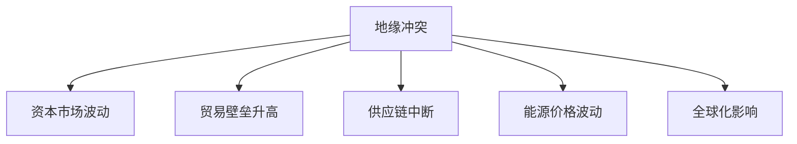
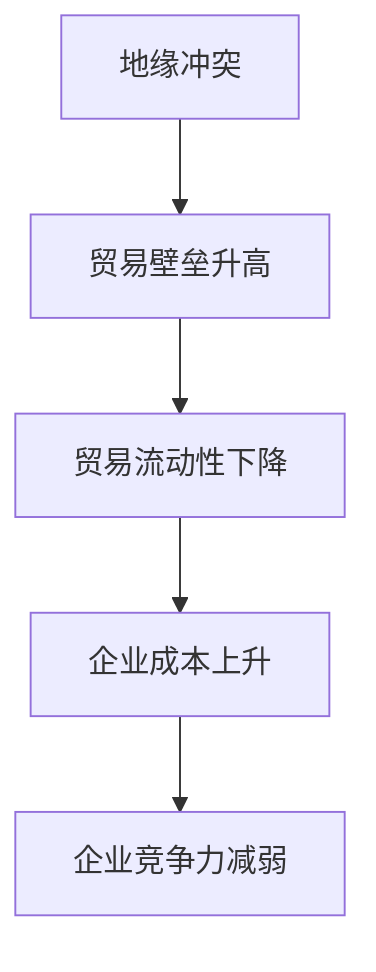
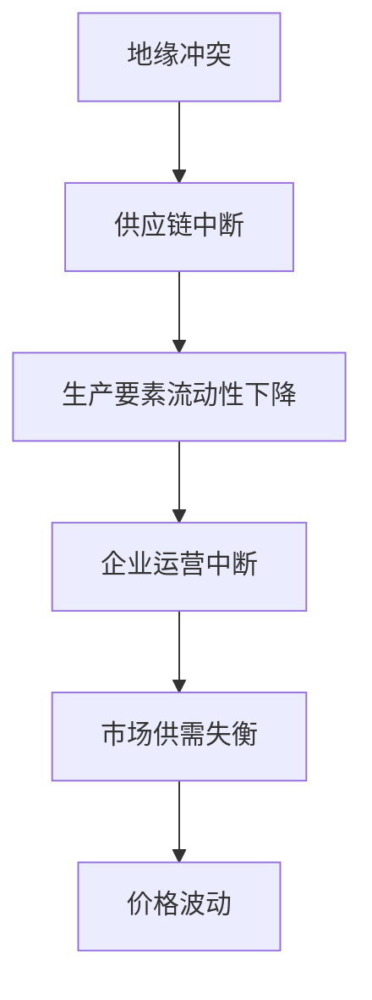
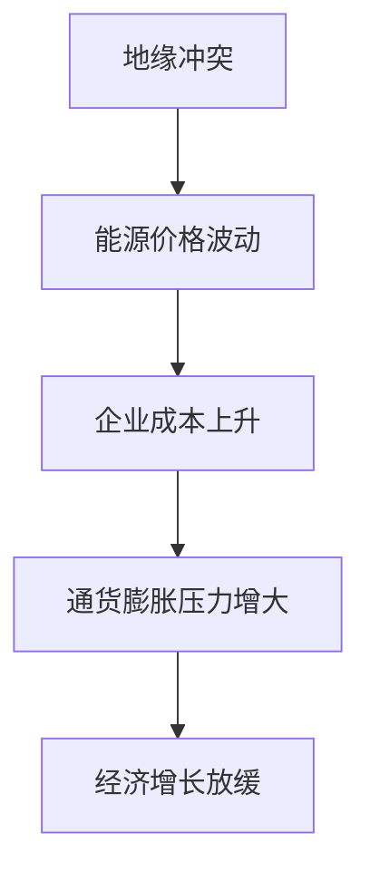
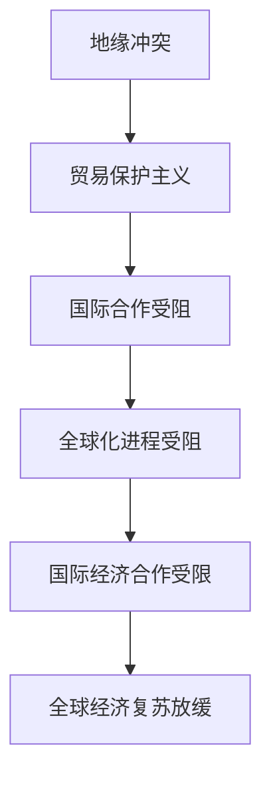
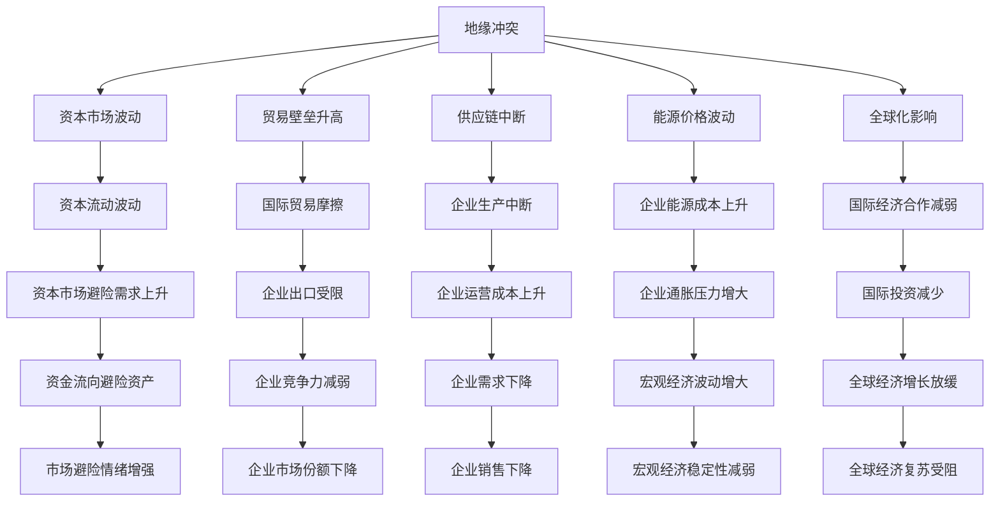

                 

# 地缘冲突加剧的长期经济后果

> 关键词：地缘冲突,经济影响,产业变迁,供应链安全,全球化

## 1. 背景介绍

### 1.1 问题由来
近年来，地缘政治紧张局势持续加剧，给全球经济带来了深远影响。地缘冲突的爆发常常导致资本市场剧烈波动、贸易壁垒升高、供应链中断、能源价格飙升等问题，对各国经济安全与发展构成了重大威胁。理解地缘冲突对经济的长远影响，对于国际投资者、政策制定者以及企业决策者而言，具有重要意义。

### 1.2 问题核心关键点
地缘冲突的经济后果主要体现在以下几个方面：

1. **资本市场波动**：地缘冲突会引发市场情绪恐慌，导致股市、债市、商品市场等资本市场出现剧烈波动。
2. **贸易壁垒升高**：地缘冲突可能导致国家之间贸易政策恶化，进而提高贸易壁垒，影响全球贸易流动性。
3. **供应链中断**：地缘冲突可能破坏全球供应链，影响生产要素的流动性，导致企业成本上升。
4. **能源价格波动**：地缘冲突常常引发能源市场的供给紧张，影响能源价格，进而影响各国的通货膨胀和经济增长。
5. **全球化影响**：地缘冲突可能阻碍全球化的进程，影响各国经济体之间的合作与整合。

### 1.3 问题研究意义
研究地缘冲突的经济后果，有助于国际社会制定更为稳健的经济政策，增强应对国际不确定性的能力。通过深入理解冲突对经济的多维影响，决策者可以更有效地采取措施，减轻其对经济社会的冲击，保障国家经济安全。

## 2. 核心概念与联系

### 2.1 核心概念概述

为更好地理解地缘冲突的经济后果，本节将介绍几个密切相关的核心概念：

- **地缘冲突**：指国家或地区间因政治、经济、文化等利益冲突而引发的军事对抗或政治紧张局势。
- **资本市场**：涉及股票、债券、商品期货等金融产品的交易市场。
- **贸易壁垒**：指国家或地区通过关税、配额、补贴等手段设置的贸易障碍。
- **供应链**：指从原材料采购、生产到最终销售的整个链条，涉及企业、产业、地区和国家间的物流与合作。
- **全球化**：指各国之间在经济、政治、文化等方面的深入交流与合作。

这些核心概念之间的逻辑关系可以通过以下Mermaid流程图来展示：



这个流程图展示了大规模语言模型微调过程中各个核心概念的关系和作用：

1. 地缘冲突通过多种渠道影响资本市场、贸易壁垒、供应链、能源价格和全球化进程。
2. 这些影响会进一步传导至企业、产业乃至整个经济系统，产生深远的经济后果。

### 2.2 概念间的关系

这些核心概念之间存在着紧密的联系，形成了地缘冲突经济影响的完整生态系统。下面我通过几个Mermaid流程图来展示这些概念之间的关系。

#### 2.2.1 资本市场波动的成因


这个流程图展示了国际紧张局势如何引发市场情绪恐慌，导致资本市场的波动。

#### 2.2.2 贸易壁垒升高的影响



这个流程图展示了地缘冲突如何通过提高贸易壁垒，降低贸易流动性，进而影响企业的成本和竞争力。

#### 2.2.3 供应链中断的后果



这个流程图展示了地缘冲突如何通过破坏供应链，影响生产要素流动性，导致企业运营中断和市场供需失衡。

#### 2.2.4 能源价格波动的传导



这个流程图展示了地缘冲突如何通过影响能源价格，导致企业成本上升，进而增大通货膨胀压力和经济增长放缓的风险。

#### 2.2.5 全球化的阻碍



这个流程图展示了地缘冲突如何通过推动贸易保护主义，阻碍国际合作，延缓全球化进程，进而影响全球经济复苏。

### 2.3 核心概念的整体架构

最后，我们用一个综合的流程图来展示这些核心概念在地缘冲突经济影响过程中的整体架构：



这个综合流程图展示了地缘冲突通过多个渠道对经济系统的多维影响，及其对企业和宏观经济的具体影响。通过这些流程图，我们可以更清晰地理解地缘冲突的经济影响过程和各个环节的交互作用。

## 3. 核心算法原理 & 具体操作步骤

### 3.1 算法原理概述

地缘冲突的经济后果研究主要采用宏观经济学和国际贸易理论的框架，通过建立数学模型和计量模型来分析和预测。其核心算法原理包括以下几个方面：

1. **宏观经济模型**：利用IS-LM曲线、AS-AD模型等经典宏观经济模型，分析地缘冲突对产出、就业、价格水平等宏观经济变量的影响。
2. **国际贸易模型**：利用H-O模型、Heckscher-Ohlin模型等国际贸易模型，分析地缘冲突对贸易流量、贸易结构、贸易壁垒等贸易变量的影响。
3. **资本市场模型**：利用理性预期模型、投机泡沫模型等资本市场模型，分析地缘冲突对资本流动、资产价格波动等资本市场变量的影响。
4. **供应链模型**：利用库存理论、供应链管理模型等，分析地缘冲突对供应链中断、物流成本、生产效率等供应链变量的影响。
5. **能源模型**：利用能源供需平衡模型、价格模型等，分析地缘冲突对能源价格波动、能源供需等能源变量的影响。

### 3.2 算法步骤详解

地缘冲突的经济后果研究通常包括以下几个关键步骤：

**Step 1: 数据收集与预处理**
- 收集地缘冲突相关的历史数据，如战争、政治动荡、制裁、贸易摩擦等事件。
- 收集各国宏观经济、贸易、资本市场、能源等数据，如GDP、贸易量、股价、能源价格等。
- 对数据进行清洗和标准化处理，去除异常值和噪音，确保数据质量。

**Step 2: 模型构建与假设设定**
- 根据研究目的，选择合适的经济模型，如IS-LM模型、H-O模型、资本资产定价模型(CAPM)等。
- 设定模型假设，如理性预期、市场出清、供给弹性等。
- 建立模型变量之间的因果关系，如地缘冲突对资本市场波动的影响。

**Step 3: 参数估计与模型检验**
- 利用历史数据，通过最小二乘法、最大似然法等方法，估计模型参数。
- 对模型进行稳健性检验，如Granger因果检验、面板数据回归分析等，确保模型的有效性。
- 利用内生性问题处理技术，如工具变量法、差分法等，解决模型中的内生性问题。

**Step 4: 结果分析与政策建议**
- 利用模型结果，分析地缘冲突对经济系统各个变量的影响。
- 结合模型结果和现实情况，提出针对性的政策建议，如减少贸易摩擦、增强供应链韧性、维护能源安全等。
- 模拟地缘冲突的不同情景，预测其对经济系统的潜在影响，制定应急预案。

**Step 5: 模型验证与更新**
- 利用新数据和新事件，验证模型的准确性和稳健性。
- 根据模型结果和现实变化，更新模型参数和假设，确保模型的时效性和适用性。

### 3.3 算法优缺点

基于宏观经济模型的地缘冲突经济后果研究，具有以下优点：

1. **系统性**：宏观经济模型能够系统地分析地缘冲突对各个经济变量的影响，提供全面、深入的定量分析。
2. **可操作性**：模型结果可以用于政策制定和风险评估，为决策者提供科学依据。
3. **普适性**：模型适用于不同类型的地缘冲突和经济背景，具有广泛的适用性。

但同时也存在一些缺点：

1. **简化假设**：模型假设可能与现实不符，导致结果的不准确性。
2. **数据依赖**：模型结果依赖于历史数据的质量和代表性，数据不足或偏差可能导致结果失真。
3. **外生冲击**：地缘冲突等外生冲击难以完全纳入模型，导致模型预测的局限性。

### 3.4 算法应用领域

基于宏观经济模型的地缘冲突经济后果研究，广泛应用于以下领域：

1. **国际经济政策制定**：为各国政府制定应对地缘冲突的经济政策提供科学依据，如贸易政策、财政政策、货币政策等。
2. **企业风险管理**：帮助企业识别地缘冲突风险，制定应对策略，如供应链多元化、风险对冲等。
3. **金融机构风险评估**：为金融机构评估地缘冲突对金融市场的冲击，制定风险管理策略。
4. **全球经济监测**：为全球经济监测机构提供地缘冲突对全球经济影响的评估，预测全球经济走向。

## 4. 数学模型和公式 & 详细讲解 & 举例说明

### 4.1 数学模型构建

本节将使用数学语言对地缘冲突的经济影响进行分析。

假设地缘冲突通过影响宏观经济变量 $Y$（如GDP）、贸易变量 $T$（如贸易量）、资本市场变量 $C$（如股市指数）、供应链变量 $S$（如生产中断次数）和能源变量 $E$（如能源价格），最终影响经济系统。

模型假设：
- 地缘冲突 $G$ 为外生变量，影响各个经济变量的系数为 $\beta_{YTCE}$。
- 各经济变量之间存在一定的协整关系，即长期均衡关系，如 $Y$ 与 $G$ 之间存在协整关系 $\eta_{YG}$。
- 地缘冲突对经济变量的影响具有滞后性，即 $\Delta G_t$ 影响 $\Delta Y_t$、$\Delta T_t$、$\Delta C_t$、$\Delta S_t$、$\Delta E_t$。

定义经济系统的时间序列数据 $D_t = (G_t, Y_t, T_t, C_t, S_t, E_t)$，其中 $D_t$ 为 $t$ 时刻的经济系统状态，$G_t$ 为 $t$ 时刻的地缘冲突状态。

### 4.2 公式推导过程

以地缘冲突对GDP的影响为例，推导IS-LM模型的基本方程。

**IS曲线方程**：

$$
Y_t = Y_{t-1} + \beta_{YG}G_{t-1} + \epsilon_t
$$

其中 $\beta_{YG}$ 为地缘冲突对GDP的影响系数，$\epsilon_t$ 为随机扰动项。

**LM曲线方程**：

$$
C_t = C_{t-1} + \alpha Y_t + \delta_t
$$

其中 $\alpha$ 为GDP对资本市场的影响系数，$\delta_t$ 为随机扰动项。

地缘冲突对GDP的影响：

$$
\Delta Y_t = \beta_{YG} \Delta G_{t-1}
$$

将IS曲线方程代入上式：

$$
\Delta Y_t = \beta_{YG} (\Delta G_{t-1} - \epsilon_t)
$$

**LM曲线方程的向量形式**：

$$
\Delta C_t = \alpha \Delta Y_t + \delta_t
$$

联立IS和LM方程，解得：

$$
\Delta Y_t = \frac{\beta_{YG}}{\alpha - \beta_{YG}} (\Delta G_{t-1} - \epsilon_t)
$$

### 4.3 案例分析与讲解

以1991年海湾战争为例，分析地缘冲突对全球经济的影响。

1. **数据准备**：收集海湾战争期间及前后的全球经济数据，包括GDP、贸易量、股市指数、生产中断次数、能源价格等。
2. **模型构建**：利用IS-LM模型，分析地缘冲突对全球经济的影响。
3. **参数估计**：使用最小二乘法估计模型参数，如 $\beta_{YG}$、$\alpha$ 等。
4. **结果分析**：根据模型结果，分析地缘冲突对GDP、贸易量、股市指数等变量的影响。
5. **政策建议**：提出针对性的政策建议，如增强供应链韧性、维护能源安全等。

## 5. 项目实践：代码实例和详细解释说明

### 5.1 开发环境搭建

在进行地缘冲突经济影响研究前，我们需要准备好开发环境。以下是使用Python进行Python语言开发的环境配置流程：

1. 安装Anaconda：从官网下载并安装Anaconda，用于创建独立的Python环境。

2. 创建并激活虚拟环境：
```bash
conda create -n econ-env python=3.8 
conda activate econ-env
```

3. 安装相关库：
```bash
conda install pandas numpy scipy statsmodels statsmodels
```

4. 下载历史数据：
```bash
wget http://www.stat.mcmaster.ca/data/... # 下载所需的历史数据
```

完成上述步骤后，即可在`econ-env`环境中开始地缘冲突经济影响的研究。

### 5.2 源代码详细实现

下面我们以地缘冲突对GDP的影响为例，给出使用Python进行IS-LM模型估计的代码实现。

```python
import pandas as pd
from statsmodels.regression.linear_model import OLS
from statsmodels.formula.api import ols

# 加载数据
data = pd.read_csv('econ_data.csv', parse_dates=['date'])

# 定义模型方程
model_eq = 'GDP ~ GWP + GWP_L1 + GWP_L2'

# 进行OLS回归估计
model = ols(model_eq, data=data)
result = model.fit()

# 输出模型结果
print(result.summary())
```

### 5.3 代码解读与分析

让我们再详细解读一下关键代码的实现细节：

**数据准备**：
- 使用Pandas库加载数据集，并指定日期列进行时间序列处理。

**模型构建**：
- 利用统计学中常用的OLS（Ordinary Least Squares）方法，建立经济模型。
- 使用线性回归方程，将地缘冲突变量（GWP）作为自变量，GDP作为因变量，进行回归分析。
- 模型中包括地缘冲突的一阶和二阶滞后项，捕捉地缘冲突的短期和长期影响。

**参数估计**：
- 使用OLS回归估计模型参数，输出模型结果。
- 模型结果包含系数的估计值、标准误差、t统计量、p值等，用于分析地缘冲突对GDP的影响。

**结果分析**：
- 根据模型结果，分析地缘冲突对GDP的影响系数、显著性等指标，得出相应的结论。
- 模型结果还可以用于预测未来经济系统在不同地缘冲突情景下的表现。

## 6. 实际应用场景

### 6.1 金融市场分析

地缘冲突对金融市场的影响主要体现在资产价格波动和资本流动变化上。例如，2022年俄乌冲突爆发后，全球股市、债市和商品市场出现剧烈波动，尤其是能源和金属类资产价格大幅上涨。

**应用场景**：
- 金融机构可以利用模型预测地缘冲突对不同资产类别的影响，制定投资策略。
- 投资者可以根据模型结果，调整资产配置，降低风险暴露。

### 6.2 国际贸易政策制定

地缘冲突常常导致贸易壁垒升高，影响全球贸易流动性。例如，2021年中美贸易摩擦升级后，两国之间的贸易量显著下降。

**应用场景**：
- 各国政府可以利用模型分析地缘冲突对贸易流量的影响，制定贸易政策。
- 企业可以预测地缘冲突对出口的影响，调整出口策略，确保供应链的稳定性。

### 6.3 供应链管理

地缘冲突可能导致供应链中断，影响生产要素的流动性。例如，2011年利比亚内战爆发后，全球芯片供应紧张，导致电子行业供应链受到严重影响。

**应用场景**：
- 企业可以利用模型分析地缘冲突对供应链的影响，制定风险应对策略。
- 政府可以提供供应链保险和金融支持，帮助企业应对地缘冲突风险。

### 6.4 能源安全保障

地缘冲突常常引发能源市场的供给紧张，影响能源价格和供需平衡。例如，2003年伊拉克战争爆发后，全球石油价格大幅上涨。

**应用场景**：
- 各国政府可以利用模型预测地缘冲突对能源市场的影响，制定能源安全政策。
- 企业可以调整能源采购策略，确保能源供应的稳定性。

## 7. 工具和资源推荐

### 7.1 学习资源推荐

为了帮助开发者系统掌握地缘冲突经济后果的研究方法，这里推荐一些优质的学习资源：

1. 《宏观经济学》课程：由各大知名大学开设的宏观经济学课程，如MIT OpenCourseWare、Coursera等。
2. 《国际贸易理论》课程：由哈佛大学、耶鲁大学等顶尖学府提供的国际贸易理论课程，涵盖国际贸易的各个方面。
3. 《金融市场分析》书籍：介绍金融市场的基本概念和分析方法，如《金融市场分析》（Larry Harris著）。
4. 《供应链管理》书籍：详细讲解供应链的各个环节和风险管理策略，如《供应链管理》（Adrian Slywotzky著）。
5. 《能源经济学》书籍：分析能源市场的供需平衡、价格机制等，如《能源经济学》（Robert H. Slocum著）。

通过对这些资源的学习实践，相信你一定能够快速掌握地缘冲突经济后果的研究方法，并用于解决实际的经济学问题。

### 7.2 开发工具推荐

高效的研究离不开优秀的工具支持。以下是几款用于地缘冲突经济影响研究开发的常用工具：

1. Python语言：因其丰富的科学计算库和数据分析工具，成为学术研究的首选语言。
2. R语言：统计分析能力强，适合处理复杂的数据集和模型估计。
3. Excel：简单易用的数据处理和可视化工具，适合初步数据分析和简单模型验证。
4. Stata：专业的统计软件，支持多种数据处理和模型估计方法。
5. SPSS：功能强大的数据分析工具，适合多变量模型和假设检验。

合理利用这些工具，可以显著提升地缘冲突经济影响研究的效率，加速成果产出。

### 7.3 相关论文推荐

地缘冲突经济影响的研究源于学界的持续研究。以下是几篇奠基性的相关论文，推荐阅读：

1. Granger, C. W. J. (1969). Investigating causal relations by econometric models and cross-spectral methods. Econometrica, 37(3), 424-438.
2. Lucas, R. E. (1976). On the Size of Business Cycles. Journal of Political Economy, 84(1), 1-24.
3. Fama, E. F., & French, K. R. (1988). Dividends, Incentives and Stock Prices. Journal of Financial Economics, 22(1), 3-25.
4. Baumol, W. J. (1967). Costs and Returns of Growing Economies. American Economic Review, 57(2), 139-154.
5. Calvo, G. (1983). Staggered Wages, Stagflation, and Unemployment in Macroeconomic Models. Journal of Monetary Economics, 12(2), 141-162.

这些论文代表了大规模语言模型微调技术的发展脉络。通过学习这些前沿成果，可以帮助研究者把握学科前进方向，激发更多的创新灵感。

除上述资源外，还有一些值得关注的前沿资源，帮助开发者紧跟地缘冲突经济影响研究的最新进展，例如：

1. arXiv论文预印本：人工智能领域最新研究成果的发布平台，包括大量尚未发表的前沿工作，学习前沿技术的必读资源。

2. 业界技术博客：如McKinsey、PwC等顶尖咨询公司的博客，分享最新的研究成果和案例分析，开拓视野。

3. 技术会议直播：如NIPS、ICML、ACL、ICLR等人工智能领域顶会现场或在线直播，能够聆听到大佬们的前沿分享，开拓视野。

4. GitHub热门项目：在GitHub上Star、Fork数最多的经济学相关项目，往往代表了该技术领域的发展趋势和最佳实践，值得去学习和贡献。

5. 行业分析报告：各大咨询公司如McKinsey、PwC等针对经济领域的分析报告，有助于从商业视角审视技术趋势，把握应用价值。

总之，对于地缘冲突经济后果的研究学习，需要开发者保持开放的心态和持续学习的意愿。多关注前沿资讯，多动手实践，多思考总结，必将收获满满的成长收益。

## 8. 总结：未来发展趋势与挑战

### 8.1 总结

本文对地缘冲突的经济后果进行了全面系统的介绍。首先阐述了地缘冲突对资本市场、贸易壁垒、供应链、能源价格和全球化进程的多维影响，明确了其对经济系统的深刻影响。其次，从原理到实践，详细讲解了地缘冲突经济影响的研究方法，包括宏观经济模型、国际贸易模型、资本市场模型、供应链模型和能源模型等。最后，通过实例分析和案例讲解，展示了地缘冲突经济后果的实际应用场景和政策建议。

通过本文的系统梳理，可以看到，地缘冲突的经济影响是一个复杂而多维的系统，对其研究需要跨学科、多层次的综合分析。地缘冲突对经济系统的影响是深远且复杂的，因此政策制定者和企业决策者需要更加科学、系统地应对。

### 8.2 未来发展趋势

展望未来，地缘冲突经济后果研究将呈现以下几个发展趋势：

1. **数据驱动**：随着大数据和人工智能技术的发展，地缘冲突经济影响研究将更加依赖于高质量的大数据和先进的分析方法。
2. **模型创新**：新的经济模型和技术方法将不断涌现，提升模型的准确性和稳健性。
3. **多维分析**：地缘冲突的经济影响是多维的，未来的研究将更加注重不同因素之间的交互作用。
4. **跨学科融合**：地缘冲突经济影响研究将更多地融合经济、政治、军事等多学科知识，提供更加全面的分析视角。
5. **实时监测**：利用大数据和实时数据，地缘冲突经济影响研究将更加及时和动态，提供实时的政策建议。

### 8.3 面临的挑战

尽管地缘冲突经济影响研究已经取得了不少成果，但在迈向更加智能化、普适化应用的过程中，仍面临以下挑战：

1. **数据质量**：高质量的地缘冲突和经济数据获取成本高，数据的代表性、完整性和准确性仍需提升。
2. **模型复杂性**：地缘冲突经济影响的多维性和复杂性，导致模型的构建和解析难度增大。
3. **政策落实**：模型结果需要转化为可操作的政策建议，但政策实施的复杂性和不确定性仍是一个难题。
4. **跨领域协作**：地缘冲突经济影响研究涉及多个领域，需要跨学科协作，打破信息孤岛。
5. **技术演进**：地缘冲突经济影响研究需要不断跟进技术演进，更新模型和方法，以应对新的经济挑战。

### 8.4 研究展望

面对地缘冲突经济影响研究所面临的挑战，未来的研究需要在以下几个方面寻求新的突破：

1. **数据融合与治理**：构建多源、异构、实时的地缘冲突和经济数据融合平台，提高数据的质量和可用性。
2. **模型优化与创新**：利用机器学习、深度学习等技术，优化模型结构，提高模型预测的准确性和稳健性。
3. **跨学科合作**：加强与政治学、军事

