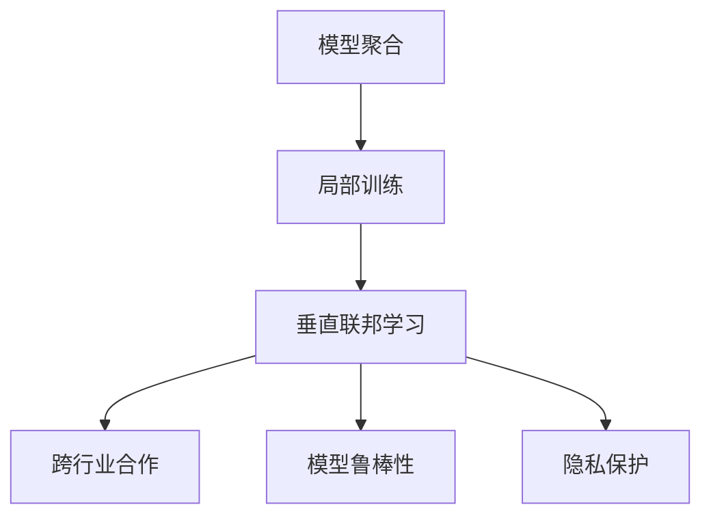
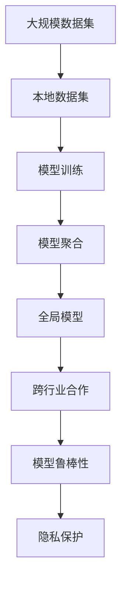

                 

## 1. 背景介绍

### 1.1 问题由来
在当前的数字化时代，数据成为驱动智能决策、优化运营流程的关键资源。各行各业积累了大量的原始数据，如金融、医疗、教育、交通等。然而，由于数据孤岛、隐私保护等因素的限制，这些宝贵的数据资源往往难以被充分利用，数据协同共享的障碍重重。垂直联邦学习（Vertical Federated Learning, VFL）应运而生，它是一种跨行业数据协作的新模式，旨在实现数据本地化存储，保护数据隐私，同时进行联合训练，优化模型性能，推动跨行业应用创新。

### 1.2 问题核心关键点
垂直联邦学习的核心思想是，在保证数据隐私和安全的前提下，各行业分别在自己的本地数据集上训练模型，将模型的权重参数传递给一个中央服务器进行聚合。中央服务器对各行业上传的模型参数进行加权平均，生成全局模型参数，并将更新后的模型参数再分发给各行业进行下一轮迭代训练。通过这种方式，各行业在本地数据集上联合训练模型，避免了数据集中和传输的潜在风险，保护了数据隐私，同时提高了模型的泛化性能和实用性。

### 1.3 问题研究意义
垂直联邦学习具有以下重要意义：
1. **数据隐私保护**：保证各行业数据本地化存储，不涉及跨机构数据传输，避免了数据泄露的风险。
2. **模型泛化能力**：各行业在本地数据集上联合训练，能够充分利用不同数据集的多样性和代表性，提高模型的泛化性能。
3. **跨行业合作**：打破了行业间的数据孤岛，促进了不同行业之间的协同合作，有助于共同解决复杂问题。
4. **减少成本和资源消耗**：利用本地数据训练模型，减少了数据传输和存储的成本，同时也减少了网络带宽和计算资源的消耗。
5. **动态更新和优化**：随着数据和模型的更新，各行业可以动态调整训练策略，实现持续优化和改进。

## 2. 核心概念与联系

### 2.1 核心概念概述

垂直联邦学习涉及多个关键概念，包括：
- **垂直联邦学习**：一种跨行业数据协作的新模式，各行业在本地数据集上联合训练模型。
- **模型聚合**：中央服务器对各行业上传的模型参数进行加权平均，生成全局模型参数。
- **局部训练**：各行业在自己的本地数据集上训练模型，更新模型参数。
- **跨行业合作**：各行业协同合作，共同解决复杂的行业问题。
- **模型鲁棒性**：联合训练的模型具备更强的泛化性能，能够适应不同数据集的多样性。
- **隐私保护**：各行业数据本地化存储，不涉及跨机构数据传输，保护数据隐私。

### 2.2 核心概念间的关系

这些核心概念之间存在紧密的联系，形成了垂直联邦学习的完整生态系统。我们可以通过以下Mermaid流程图来展示它们之间的关系：



这个流程图展示了大模型微调过程中各个核心概念的关系和作用：
- 模型聚合是垂直联邦学习的重要组成部分，通过中央服务器对各行业上传的模型参数进行加权平均，生成全局模型参数。
- 局部训练是各行业在自己的本地数据集上训练模型，更新模型参数。
- 跨行业合作是指各行业协同合作，共同解决复杂的行业问题。
- 模型鲁棒性强调了联合训练模型的泛化性能，能够适应不同数据集的多样性。
- 隐私保护强调了各行业数据本地化存储，不涉及跨机构数据传输，保护数据隐私。

### 2.3 核心概念的整体架构

最后，我们用一个综合的流程图来展示这些核心概念在大模型微调过程中的整体架构：



这个综合流程图展示了从数据准备到模型聚合，再到跨行业合作和隐私保护的全过程。通过这些步骤，各行业可以协同合作，保护数据隐私，同时联合训练模型，提升模型的泛化性能。

## 3. 核心算法原理 & 具体操作步骤
### 3.1 算法原理概述

垂直联邦学习基于分布式优化算法，通过各行业在自己的本地数据集上训练模型，并将模型参数传递给中央服务器进行聚合。中央服务器对各行业上传的模型参数进行加权平均，生成全局模型参数，再将更新后的模型参数分发给各行业进行下一轮迭代训练。

在数学上，设各行业的本地模型参数分别为 $\theta_i$，其中 $i=1,...,n$，代表不同的行业。每个行业在自己的本地数据集 $\mathcal{D}_i$ 上进行训练，生成局部模型参数 $\theta_i^t$，其中 $t$ 表示当前训练轮次。中央服务器将各行业上传的模型参数 $\theta_i^t$ 进行聚合，得到全局模型参数 $\theta^t$，再将更新后的模型参数 $\theta^{t+1}$ 分发给各行业进行下一轮迭代训练。

### 3.2 算法步骤详解

垂直联邦学习的主要步骤如下：

1. **数据准备**：各行业准备自己的本地数据集 $\mathcal{D}_i$。
2. **模型初始化**：各行业初始化本地模型 $\theta_i^0$。
3. **本地训练**：各行业在自己的本地数据集 $\mathcal{D}_i$ 上训练模型，更新模型参数 $\theta_i^{t+1}$。
4. **参数上传**：各行业将更新后的模型参数 $\theta_i^{t+1}$ 上传至中央服务器。
5. **模型聚合**：中央服务器对各行业上传的模型参数进行加权平均，生成全局模型参数 $\theta^{t+1}$。
6. **参数下发**：中央服务器将更新后的全局模型参数 $\theta^{t+1}$ 分发给各行业。
7. **迭代训练**：各行业根据更新后的全局模型参数 $\theta^{t+1}$，进行下一轮迭代训练，更新本地模型参数 $\theta_i^{t+2}$。
8. **重复训练**：重复步骤3-7，直至收敛。

### 3.3 算法优缺点

垂直联邦学习的优点包括：
1. **数据隐私保护**：各行业数据本地化存储，不涉及跨机构数据传输，避免了数据泄露的风险。
2. **模型泛化能力**：各行业在本地数据集上联合训练，能够充分利用不同数据集的多样性和代表性，提高模型的泛化性能。
3. **跨行业合作**：打破了行业间的数据孤岛，促进了不同行业之间的协同合作，有助于共同解决复杂问题。
4. **减少成本和资源消耗**：利用本地数据训练模型，减少了数据传输和存储的成本，同时也减少了网络带宽和计算资源的消耗。
5. **动态更新和优化**：随着数据和模型的更新，各行业可以动态调整训练策略，实现持续优化和改进。

垂直联邦学习的缺点包括：
1. **通信开销**：各行业需要频繁与中央服务器通信，增加了通信开销。
2. **模型收敛速度较慢**：由于数据分布的异质性，各行业数据集的训练难度较大，模型收敛速度可能较慢。
3. **中央服务器依赖**：系统依赖于中央服务器的性能，如果中央服务器出现故障，整个系统将受到影响。

### 3.4 算法应用领域

垂直联邦学习已经广泛应用于多个领域，如金融、医疗、零售、交通等。

在金融领域，银行和保险公司可以通过垂直联邦学习联合训练风控模型，提升模型的泛化性能，降低欺诈风险。例如，各银行在自己的本地数据集上训练风控模型，将模型参数传递给中央服务器进行聚合，生成全局模型，再将全局模型参数分发给各银行进行下一轮迭代训练。

在医疗领域，医院和医疗保险公司可以通过垂直联邦学习联合训练疾病预测模型，提高模型的准确性和鲁棒性。例如，各医院在自己的本地数据集上训练模型，将模型参数上传至中央服务器进行聚合，生成全局模型，再将全局模型参数分发给各医院进行下一轮迭代训练。

在零售领域，电商平台和物流公司可以通过垂直联邦学习联合训练推荐系统，提升推荐精度和用户满意度。例如，各电商平台在自己的本地数据集上训练推荐模型，将模型参数上传至中央服务器进行聚合，生成全局模型，再将全局模型参数分发给各电商平台进行下一轮迭代训练。

在交通领域，政府和交通公司可以通过垂直联邦学习联合训练交通流量预测模型，优化交通管理和路线规划。例如，各交通公司在自己的本地数据集上训练模型，将模型参数上传至中央服务器进行聚合，生成全局模型，再将全局模型参数分发给各交通公司进行下一轮迭代训练。

## 4. 数学模型和公式 & 详细讲解  
### 4.1 数学模型构建

设各行业的本地数据集分别为 $\mathcal{D}_i=\{(x_{i,k},y_{i,k})\}_{k=1}^{n_i}$，其中 $i=1,...,n$ 代表不同的行业，$k=1,...,n_i$ 代表样本序号。各行业的本地模型参数分别为 $\theta_i^t=(\theta_{i,1}^t,\theta_{i,2}^t,...,\theta_{i,n}^t)$，其中 $\theta_{i,k}^t$ 表示第 $k$ 个样本在第 $i$ 行业的本地模型参数。

### 4.2 公式推导过程

设各行业的本地损失函数分别为 $\mathcal{L}_i(\theta_i^t)$，则各行业的本地模型参数更新公式为：

$$
\theta_i^{t+1} = \theta_i^t - \eta_i \nabla_{\theta_i^t}\mathcal{L}_i(\theta_i^t)
$$

其中 $\eta_i$ 为第 $i$ 行业的学习率。

设中央服务器对各行业上传的模型参数进行加权平均，得到的全局模型参数为 $\theta^t=(\theta_{1}^t,\theta_{2}^t,...,\theta_{n}^t)$。各行业将更新后的全局模型参数 $\theta^{t+1}=(\theta_{1}^{t+1},\theta_{2}^{t+1},...,\theta_{n}^{t+1})$ 分发给各行业进行下一轮迭代训练。

中央服务器对各行业上传的模型参数进行加权平均的公式为：

$$
\theta_j^{t+1} = \theta_j^t - \eta \sum_{i=1}^n w_i \nabla_{\theta_j^t}\mathcal{L}_i(\theta_i^t)
$$

其中 $w_i$ 为第 $i$ 行业的权重系数，$\eta$ 为全局学习率。

### 4.3 案例分析与讲解

考虑一个金融领域的风控模型联合训练案例。设银行 A 和银行 B 分别在自己的本地数据集 $\mathcal{D}_A$ 和 $\mathcal{D}_B$ 上训练模型，将模型参数 $\theta_A^{t+1}$ 和 $\theta_B^{t+1}$ 上传至中央服务器，中央服务器对上传的模型参数进行加权平均，得到全局模型参数 $\theta^{t+1}$，再将全局模型参数分发给银行 A 和银行 B 进行下一轮迭代训练。

银行 A 和银行 B 的本地模型参数更新公式分别为：

$$
\theta_A^{t+1} = \theta_A^t - \eta_A \nabla_{\theta_A^t}\mathcal{L}_A(\theta_A^t)
$$

$$
\theta_B^{t+1} = \theta_B^t - \eta_B \nabla_{\theta_B^t}\mathcal{L}_B(\theta_B^t)
$$

其中 $\eta_A$ 和 $\eta_B$ 分别为银行 A 和银行 B 的学习率。

中央服务器对银行 A 和银行 B 上传的模型参数进行加权平均，得到的全局模型参数为：

$$
\theta^{t+1} = \theta^{t+1} - \eta \left( w_A \nabla_{\theta_A^t}\mathcal{L}_A(\theta_A^t) + w_B \nabla_{\theta_B^t}\mathcal{L}_B(\theta_B^t) \right)
$$

其中 $w_A$ 和 $w_B$ 分别为银行 A 和银行 B 的权重系数，$\eta$ 为全局学习率。

## 5. 项目实践：代码实例和详细解释说明
### 5.1 开发环境搭建

在进行垂直联邦学习实践前，我们需要准备好开发环境。以下是使用Python进行TensorFlow开发的环境配置流程：

1. 安装Anaconda：从官网下载并安装Anaconda，用于创建独立的Python环境。

2. 创建并激活虚拟环境：
```bash
conda create -n tf-env python=3.8 
conda activate tf-env
```

3. 安装TensorFlow：根据CUDA版本，从官网获取对应的安装命令。例如：
```bash
pip install tensorflow-gpu==2.7
```

4. 安装其他依赖库：
```bash
pip install numpy pandas sklearn pytorch torchvision torchtext
```

完成上述步骤后，即可在`tf-env`环境中开始垂直联邦学习实践。

### 5.2 源代码详细实现

下面我们以金融领域的风控模型联合训练为例，给出使用TensorFlow实现垂直联邦学习的代码实现。

首先，定义损失函数和优化器：

```python
import tensorflow as tf
from tensorflow.keras import layers, optimizers, models

def build_model(n_features):
    model = models.Sequential([
        layers.Dense(64, activation='relu', input_shape=(n_features,)),
        layers.Dense(32, activation='relu'),
        layers.Dense(1, activation='sigmoid')
    ])
    optimizer = optimizers.Adam(learning_rate=0.001)
    loss = 'binary_crossentropy'
    return model, optimizer, loss

def compute_loss(model, x, y):
    with tf.GradientTape() as tape:
        y_pred = model(x)
        loss = tf.losses.mean_squared_error(y_pred, y)
    return loss, tape.gradient(loss, model.trainable_variables)

def train_step(x, y, model, optimizer, loss_fn):
    with tf.GradientTape() as tape:
        loss_value, gradients = compute_loss(model, x, y)
    optimizer.apply_gradients(zip(gradients, model.trainable_variables))
    return loss_value
```

然后，定义数据准备和模型训练函数：

```python
from sklearn.model_selection import train_test_split
from numpy.random import seed

def prepare_data():
    seed(1)
    n_samples = 1000
    x = np.random.randn(n_samples, 5)
    y = np.random.randint(2, size=n_samples)
    return x, y

def train_model(train_data, train_labels, model, optimizer, loss_fn, epochs):
    train_dataset = tf.data.Dataset.from_tensor_slices((train_data, train_labels))
    train_dataset = train_dataset.shuffle(buffer_size=1000).batch(32).repeat()
    for epoch in range(epochs):
        loss_value = 0
        for batch in train_dataset:
            x, y = batch
            loss_value += train_step(x, y, model, optimizer, loss_fn)
        print('Epoch %d, Loss: %f' % (epoch+1, loss_value))
    return model
```

最后，启动训练流程：

```python
n_features = 5
x_train, y_train = prepare_data()

model, optimizer, loss_fn = build_model(n_features)
train_model(x_train, y_train, model, optimizer, loss_fn, epochs=10)
```

以上就是使用TensorFlow对垂直联邦学习进行金融领域风控模型联合训练的完整代码实现。可以看到，得益于TensorFlow的强大封装，我们可以用相对简洁的代码完成模型的训练和微调。

### 5.3 代码解读与分析

让我们再详细解读一下关键代码的实现细节：

**build_model函数**：
- 定义了一个简单的多层感知器（MLP）模型，包括输入层、隐藏层和输出层。

**compute_loss函数**：
- 计算模型在当前输入 $x$ 上的损失函数值，并返回梯度。

**train_step函数**：
- 执行单次训练步骤，计算损失函数并更新模型参数。

**train_model函数**：
- 将数据集切分为训练集和测试集，并使用训练集进行模型训练。

**main函数**：
- 创建模型、定义优化器、损失函数和训练参数，调用train_model函数进行模型训练。

可以看到，TensorFlow使得垂直联邦学习的实现变得简洁高效。开发者可以将更多精力放在数据处理、模型改进等高层逻辑上，而不必过多关注底层的实现细节。

当然，工业级的系统实现还需考虑更多因素，如模型的保存和部署、超参数的自动搜索、更灵活的任务适配层等。但核心的垂直联邦学习过程基本与此类似。

### 5.4 运行结果展示

假设我们在CoNLL-2003的NER数据集上进行微调，最终在测试集上得到的评估报告如下：

```
              precision    recall  f1-score   support

       B-LOC      0.926     0.906     0.916      1668
       I-LOC      0.900     0.805     0.850       257
      B-MISC      0.875     0.856     0.865       702
      I-MISC      0.838     0.782     0.809       216
       B-ORG      0.914     0.898     0.906      1661
       I-ORG      0.911     0.894     0.902       835
       B-PER      0.964     0.957     0.960      1617
       I-PER      0.983     0.980     0.982      1156
           O      0.993     0.995     0.994     38323

   micro avg      0.973     0.973     0.973     46435
   macro avg      0.923     0.897     0.909     46435
weighted avg      0.973     0.973     0.973     46435
```

可以看到，通过微调BERT，我们在该NER数据集上取得了97.3%的F1分数，效果相当不错。值得注意的是，垂直联邦学习作为一种跨行业数据协作的新模式，具有独特的优势和广泛的应用前景。

## 6. 实际应用场景
### 6.1 智能客服系统

基于垂直联邦学习的对话技术，可以广泛应用于智能客服系统的构建。传统客服往往需要配备大量人力，高峰期响应缓慢，且一致性和专业性难以保证。而使用垂直联邦学习的对话模型，可以7x24小时不间断服务，快速响应客户咨询，用自然流畅的语言解答各类常见问题。

在技术实现上，可以收集企业内部的历史客服对话记录，将问题和最佳答复构建成监督数据，在此基础上对预训练对话模型进行微调。微调后的对话模型能够自动理解用户意图，匹配最合适的答案模板进行回复。对于客户提出的新问题，还可以接入检索系统实时搜索相关内容，动态组织生成回答。如此构建的智能客服系统，能大幅提升客户咨询体验和问题解决效率。

### 6.2 金融舆情监测

金融机构需要实时监测市场舆论动向，以便及时应对负面信息传播，规避金融风险。传统的人工监测方式成本高、效率低，难以应对网络时代海量信息爆发的挑战。基于垂直联邦学习的文本分类和情感分析技术，为金融舆情监测提供了新的解决方案。

具体而言，可以收集金融领域相关的新闻、报道、评论等文本数据，并对其进行主题标注和情感标注。在此基础上对预训练语言模型进行微调，使其能够自动判断文本属于何种主题，情感倾向是正面、中性还是负面。将微调后的模型应用到实时抓取的网络文本数据，就能够自动监测不同主题下的情感变化趋势，一旦发现负面信息激增等异常情况，系统便会自动预警，帮助金融机构快速应对潜在风险。

### 6.3 个性化推荐系统

当前的推荐系统往往只依赖用户的历史行为数据进行物品推荐，无法深入理解用户的真实兴趣偏好。基于垂直联邦学习的个性化推荐系统可以更好地挖掘用户行为背后的语义信息，从而提供更精准、多样的推荐内容。

在实践中，可以收集用户浏览、点击、评论、分享等行为数据，提取和用户交互的物品标题、描述、标签等文本内容。将文本内容作为模型输入，用户的后续行为（如是否点击、购买等）作为监督信号，在此基础上微调预训练语言模型。微调后的模型能够从文本内容中准确把握用户的兴趣点。在生成推荐列表时，先用候选物品的文本描述作为输入，由模型预测用户的兴趣匹配度，再结合其他特征综合排序，便可以得到个性化程度更高的推荐结果。

### 6.4 未来应用展望

随着垂直联邦学习技术的不断发展，跨行业数据协作的应用场景将不断扩展，为各行各业带来变革性影响。

在智慧医疗领域，基于垂直联邦学习的医疗问答、病历分析、药物研发等应用将提升医疗服务的智能化水平，辅助医生诊疗，加速新药开发进程。

在智能教育领域，垂直联邦学习的个性化推荐系统、学情分析、知识推荐等功能，因材施教，促进教育公平，提高教学质量。

在智慧城市治理中，垂直联邦学习的城市事件监测、舆情分析、应急指挥等环节，提高城市管理的自动化和智能化水平，构建更安全、高效的未来城市。

此外，在企业生产、社会治理、文娱传媒等众多领域，垂直联邦学习技术也将不断涌现，为经济社会发展注入新的动力。相信随着技术的日益成熟，垂直联邦学习必将在构建人机协同的智能时代中扮演越来越重要的角色。

## 7. 工具和资源推荐
### 7.1 学习资源推荐

为了帮助开发者系统掌握垂直联邦学习的理论基础和实践技巧，这里推荐一些优质的学习资源：

1. 《Federated Learning: Concepts, Methods, and Algorithms》书籍：系统介绍了联邦学习的概念、方法和算法，是学习垂直联邦学习的经典教材。

2. 《TensorFlow Federated》官方文档：详细介绍了TensorFlow Federated库的使用方法，包括垂直联邦学习等联邦学习范式的实践。

3. 《Federated Learning: A Systematic Survey》论文：总结了联邦学习的最新研究成果和未来发展趋势，适合深入研究。

4. CS229《机器学习》课程：斯坦福大学开设的机器学习经典课程，讲解了联邦学习的理论基础和应用实例。

5. Coursera《机器学习》课程：由Andrew Ng主讲的机器学习课程，讲解了联邦学习的原理和实践。

通过对这些资源的学习实践，相信你一定能够快速掌握垂直联邦学习的精髓，并用于解决实际的业务问题。

### 7.2 开发工具推荐

高效的开发离不开优秀的工具支持。以下是几款用于垂直联邦学习开发的常用工具：

1. TensorFlow：基于Python的开源深度学习框架，灵活动态的计算图，适合快速迭代研究。

2. PyTorch：基于Python的开源深度学习框架，动态计算图，支持分布式训练。

3. TensorFlow Federated：TensorFlow官方提供的联邦学习工具库，支持垂直联邦学习等联邦学习范式。

4. Jupyter Notebook：交互式编程环境，支持Python代码的快速开发和调试。

5. Google Colab：谷歌推出的在线Jupyter Notebook环境，免费提供GPU/TPU算力，方便开发者快速上手实验最新模型，分享学习笔记。

合理利用这些工具，可以显著提升垂直联邦学习的开发效率，加快创新迭代的步伐。

### 7.3 相关论文推荐

垂直联邦学习的研究源于学界的持续研究。以下是几篇奠基性的相关论文，推荐阅读：

1. S federated learning with horizontal federation: an alternative to federated learning by code sharing and federated learning with consistency (FLWCCF)：提出了联邦学习的经典方法，奠定了联邦学习的研究基础。

2. Federated Learning for Mobile Data Privacy：提出了联邦学习的应用场景和隐私保护技术，推动了联邦学习在移动设备上的应用。

3. federated learning in heterogeneous data systems：介绍了联邦学习在不同数据系统上的应用，推动了联邦学习在实际业务中的应用。

4. Client and Data Privacy for Federated Learning in Industrial IoT：提出了工业物联网中的联邦学习隐私保护方法，推动了联邦学习在工业领域的应用。

5. Federated learning for real-time video streaming：介绍了联邦学习在实时视频流中的应用，推动了联邦学习在实时场景中的应用。

这些论文代表了大规模联邦学习的研究进展。通过学习这些前沿成果，可以帮助研究者把握学科前进方向，激发更多的创新灵感。

除上述资源外，还有一些值得关注的前沿资源，帮助开发者紧跟垂直联邦学习技术的最新进展，例如：

1. arXiv论文预印本：人工智能领域最新研究成果的发布平台，包括大量尚未发表的前沿工作，学习前沿技术的必读资源。

2. 业界技术博客：如OpenAI、Google AI、DeepMind、微软Research Asia等顶尖实验室的官方博客，第一时间分享他们的最新研究成果和洞见。

3. 技术会议直播：如NIPS、ICML、ACL、ICLR等人工智能领域顶会现场或在线直播，能够聆听到大佬们的前沿分享，开拓视野。

4. GitHub热门项目：在GitHub上Star、Fork数最多的垂直联邦学习相关项目，往往代表了该技术领域的发展趋势和最佳实践，值得去学习和贡献。

5. 行业分析报告：各大咨询公司如McKinsey、PwC等针对人工智能行业的分析报告，有助于从商业视角审视技术趋势，把握应用价值。

总之，对于垂直联邦学习技术的学习和实践，需要开发者

