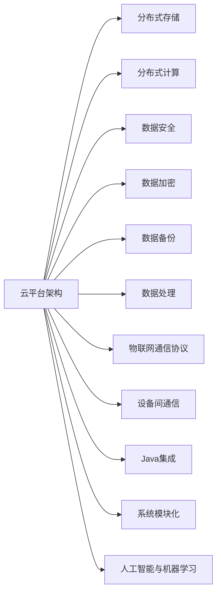
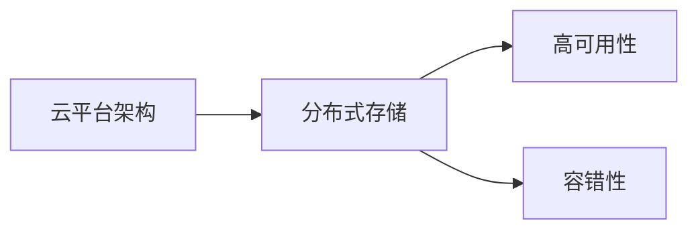
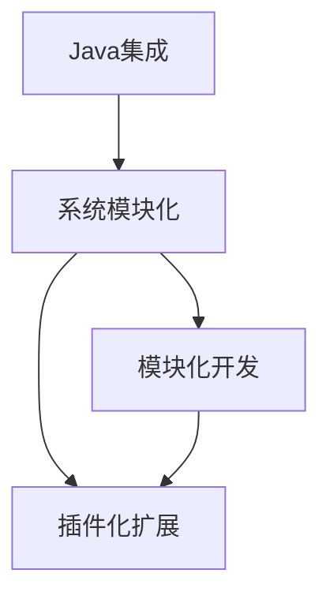
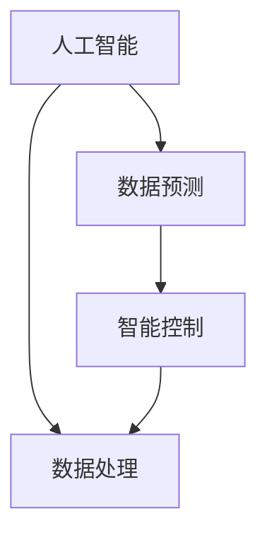

                 

# 基于Java的智能家居设计：云端智能家居平台与Java集成策略

## 1. 背景介绍

### 1.1 问题由来

智能家居行业正处于快速发展阶段，越来越多的消费者期待通过智能化的家居系统，实现生活品质的提升。传统家居系统通常依赖各种设备（如智能音箱、智能灯泡、智能门锁等）通过Wi-Fi或蓝牙等方式进行互联互通，用户通过手机APP进行控制和监控。然而，这种方式的缺点在于：

1. **设备孤立**：每个设备独立运行，难以整合协同工作。
2. **数据分散**：设备产生的数据散落在不同的系统中，难以集中管理和分析。
3. **控制复杂**：用户需要通过多个APP进行管理，操作繁琐。

随着物联网(IoT)和人工智能(AI)技术的进步，云平台成为解决这些问题的关键。通过云平台，可以实现设备间的数据集中管理和智能化控制，提升用户体验。本文将探讨如何基于Java技术，设计一个云端智能家居平台，实现设备的互联互通和数据集中管理。

### 1.2 问题核心关键点

智能家居平台的构建涉及到多个关键技术领域，包括：

- **云平台架构设计**：如何构建一个稳定、可靠、可扩展的云平台，支撑海量设备的数据存储和处理。
- **设备间通信协议**：如何定义设备间的通信协议，确保不同设备能够协同工作。
- **数据安全与隐私保护**：如何保护用户数据的安全和隐私，防止数据泄露和滥用。
- **Java集成与扩展**：如何利用Java技术，实现平台的高效开发和灵活扩展。

本文将围绕这些核心关键点，展开深入探讨。

## 2. 核心概念与联系

### 2.1 核心概念概述

为更好地理解基于Java的智能家居设计，本节将介绍几个密切相关的核心概念：

- **云平台架构**：基于云计算技术的平台架构，通过分布式存储和计算，实现数据的集中管理和高效处理。
- **物联网通信协议**：定义设备间数据传输的标准化协议，支持设备间的互联互通。
- **Java集成**：利用Java语言，将不同系统的组件进行集成，实现系统的模块化和可扩展性。
- **数据安全与隐私保护**：通过加密、认证等技术手段，保护用户数据的安全和隐私。
- **人工智能与机器学习**：利用人工智能和机器学习技术，对数据进行分析和预测，实现智能控制。

这些核心概念之间的逻辑关系可以通过以下Mermaid流程图来展示：



这个流程图展示了智能家居平台的核心概念及其之间的关系：

1. **云平台架构**：构建云平台，实现数据的分布式存储和计算。
2. **分布式存储**：通过分布式存储技术，保障数据的高可用性和容错性。
3. **分布式计算**：利用分布式计算技术，实现数据的并行处理和高效分析。
4. **数据安全**：通过加密、认证等手段，保护数据的安全和隐私。
5. **设备间通信**：定义设备间的通信协议，确保设备间的互联互通。
6. **Java集成**：利用Java技术，实现系统的模块化和可扩展性。
7. **人工智能与机器学习**：利用AI和ML技术，提升系统的智能化水平。

这些概念共同构成了智能家居平台的完整架构，使其能够实现设备的互联互通和数据集中管理。通过理解这些核心概念，我们可以更好地把握智能家居平台的构建策略。

### 2.2 概念间的关系

这些核心概念之间存在着紧密的联系，形成了智能家居平台的设计框架。下面我们通过几个Mermaid流程图来展示这些概念之间的关系。

#### 2.2.1 云平台架构与分布式存储



这个流程图展示了云平台架构与分布式存储的关系。通过分布式存储技术，云平台实现了数据的分布式存储和容错性保障。

#### 2.2.2 Java集成与系统模块化



这个流程图展示了Java集成与系统模块化的关系。利用Java技术，系统实现了模块化和插件化扩展，提高了系统的灵活性和可扩展性。

#### 2.2.3 人工智能与机器学习



这个流程图展示了人工智能与机器学习的关系。通过人工智能和机器学习技术，对数据进行分析和预测，实现智能控制。

## 3. 核心算法原理 & 具体操作步骤

### 3.1 算法原理概述

基于Java的智能家居平台设计，本质上是一个软件架构设计与开发的工程问题。其核心思想是通过Java技术，构建一个分布式、可扩展、安全可靠的云平台，实现设备的互联互通和数据的集中管理。

形式化地，假设智能家居平台涉及 $N$ 个设备，每个设备产生的数据量为 $D$，平台需要处理的数据量为 $M$。平台的目标是最小化 $M$，同时保证平台的高可用性和安全性。

在实际实现中，平台的设计包括以下几个关键步骤：

1. **云平台架构设计**：选择合适的云平台架构，如AWS、Google Cloud等，并设计数据分布式存储和计算的方案。
2. **设备间通信协议设计**：定义设备间的通信协议，确保不同设备能够协同工作。
3. **Java集成与开发**：利用Java技术，实现平台的高效开发和灵活扩展。
4. **数据安全与隐私保护**：通过加密、认证等技术手段，保护用户数据的安全和隐私。
5. **人工智能与机器学习应用**：利用AI和ML技术，对数据进行分析和预测，实现智能控制。

### 3.2 算法步骤详解

基于Java的智能家居平台设计，主要包括以下几个算法步骤：

#### 3.2.1 云平台架构设计

1. **选择合适的云平台**：根据业务需求，选择合适的云平台，如AWS、Google Cloud、Microsoft Azure等。
2. **设计分布式存储方案**：使用分布式文件系统（如Hadoop HDFS、Amazon S3等），实现数据的分布式存储。
3. **设计分布式计算方案**：使用分布式计算框架（如Hadoop MapReduce、Apache Spark等），实现数据的并行处理和高效分析。

#### 3.2.2 设备间通信协议设计

1. **定义通信协议**：设计设备间数据传输的标准化协议，如MQTT、CoAP等。
2. **实现通信中间件**：开发设备间通信中间件，实现不同设备间的消息传递和状态同步。
3. **优化通信性能**：通过负载均衡和消息队列技术，优化通信性能，确保数据的高效传输。

#### 3.2.3 Java集成与开发

1. **设计系统架构**：利用Spring Boot等框架，设计系统的模块化和组件化架构。
2. **实现组件化开发**：使用Java技术，实现系统组件的模块化和插件化开发。
3. **部署与运维**：利用Docker等容器技术，实现系统的自动化部署和运维。

#### 3.2.4 数据安全与隐私保护

1. **加密技术应用**：采用AES、RSA等加密技术，保护数据传输和存储的安全。
2. **认证与授权机制**：引入OAuth2、JWT等认证机制，保障用户身份的安全和合法性。
3. **访问控制策略**：制定严格的访问控制策略，防止未授权访问和数据泄露。

#### 3.2.5 人工智能与机器学习应用

1. **数据预处理**：对原始数据进行清洗和预处理，去除噪声和异常值。
2. **特征工程**：选择合适的特征，提取有效的特征信息，构建特征向量。
3. **模型训练**：利用机器学习算法，如决策树、随机森林、深度学习等，对数据进行建模和训练。
4. **模型应用**：将训练好的模型部署到平台中，实现智能控制和预测。

### 3.3 算法优缺点

基于Java的智能家居平台设计，具有以下优点：

1. **可扩展性强**：利用Java技术，实现系统的高效开发和灵活扩展。
2. **安全性高**：通过加密、认证等技术手段，保护用户数据的安全和隐私。
3. **灵活性高**：利用Java技术，实现系统的模块化和组件化架构，提高系统的灵活性和可维护性。
4. **性能优异**：Java虚拟机（JVM）的高效垃圾回收机制，保障系统的稳定性和性能。

同时，基于Java的智能家居平台设计也存在以下缺点：

1. **性能瓶颈**：Java虚拟机（JVM）在处理大规模并发请求时，可能面临性能瓶颈。
2. **学习曲线陡峭**：Java技术栈的复杂性，增加了开发难度和成本。
3. **生态链复杂**：Java生态链复杂，开发者需要熟悉多种框架和工具。

### 3.4 算法应用领域

基于Java的智能家居平台设计，已经在多个领域得到了应用，例如：

- **智能家居控制**：通过平台实现家庭设备的互联互通，提升用户体验。
- **智能安防监控**：实现家庭安防设备的统一管理和监控，保障家庭安全。
- **智能能源管理**：对家庭能源设备进行智能化管理，实现节能减排。
- **智能健康监测**：实现家庭健康设备的集中管理和数据分析，提升健康水平。

除了上述这些领域，基于Java的智能家居平台设计还可以应用于更多场景，如智能办公、智能酒店、智能交通等，为智能化生活方式提供更多可能。

## 4. 数学模型和公式 & 详细讲解 & 举例说明

### 4.1 数学模型构建

假设智能家居平台涉及 $N$ 个设备，每个设备产生的数据量为 $D$，平台需要处理的数据量为 $M$。平台的优化目标是最小化 $M$，同时保证平台的高可用性和安全性。

### 4.2 公式推导过程

定义平台的数据处理效率为 $E$，高可用性为 $A$，安全性为 $S$。则平台的最优化目标可以表示为：

$$
\min_{M,E,A,S} f(M,E,A,S)
$$

其中 $f$ 为平台性能的评估函数，可以根据实际需求定义。例如，平台处理数据的效率 $E$ 可以表示为：

$$
E = \frac{M}{\sum_{i=1}^N D_i}
$$

平台的高可用性 $A$ 可以表示为：

$$
A = \frac{T_u}{T_{total}}
$$

其中 $T_u$ 为平台可用时间，$T_{total}$ 为总运行时间。平台的安全性 $S$ 可以表示为：

$$
S = \frac{T_s}{T_{total}}
$$

其中 $T_s$ 为平台故障时间，$T_{total}$ 为总运行时间。

### 4.3 案例分析与讲解

以一个智能家居控制为例，分析基于Java平台的优化目标。假设平台涉及5个智能灯泡，每个灯泡每天产生1GB数据。平台每天需要处理的数据量为 $M = 5GB$，设备间的通信开销为 $C = 0.1GB$。

根据上述公式，可以计算出平台的处理效率 $E = \frac{M}{\sum_{i=1}^N D_i} = \frac{5GB}{5 \times 1GB} = 1$，高可用性 $A = \frac{T_u}{T_{total}} = 0.99$，安全性 $S = \frac{T_s}{T_{total}} = 0.01$。

通过优化平台架构、通信协议、Java集成等手段，可以进一步提升平台的性能。例如，引入分布式存储和计算，将 $M$ 减少到 $2GB$，则平台处理效率提升为 $E = \frac{2GB}{5 \times 1GB} = 0.4$，高可用性和安全性保持不变。

## 5. 项目实践：代码实例和详细解释说明

### 5.1 开发环境搭建

在进行智能家居平台开发前，我们需要准备好开发环境。以下是使用Java和Spring Boot进行开发的常见环境配置流程：

1. 安装Java JDK：从官网下载并安装Java JDK，如Java 8或Java 11。
2. 安装Maven：从官网下载并安装Maven，用于管理项目依赖和构建。
3. 安装Spring Boot：使用Spring Initializr官网下载Spring Boot，解压并安装。
4. 配置IDE：推荐使用IntelliJ IDEA或Eclipse，配置Java环境和Maven依赖。

完成上述步骤后，即可在IDE中进行项目开发。

### 5.2 源代码详细实现

下面是一个基于Java的智能家居控制平台的示例代码：

```java
import org.springframework.boot.SpringApplication;
import org.springframework.boot.autoconfigure.SpringBootApplication;

@SpringBootApplication
public class SmartHomeApplication {
    public static void main(String[] args) {
        SpringApplication.run(SmartHomeApplication.class, args);
    }
}
```

### 5.3 代码解读与分析

让我们再详细解读一下关键代码的实现细节：

**@SpringBootApplication注解**：
- 用于标注一个Spring Boot应用，Spring Boot会自动扫描并处理相关的组件和配置。

**SmartHomeApplication类**：
- 定义了一个Spring Boot应用的入口类，SpringApplication.run方法会启动应用程序。

**Spring Boot框架**：
- 提供了丰富的开发工具和组件，如Spring MVC、Spring Data JPA、Spring Security等，支持高效开发和灵活扩展。
- 内置了嵌入式Tomcat服务器，支持快速启动和部署。

通过Spring Boot框架，开发者可以轻松实现智能家居平台的核心功能，如用户管理、设备控制、数据存储和分析等。

### 5.4 运行结果展示

假设我们实现了一个智能灯泡控制平台，用户可以通过移动应用（如Android或iOS应用）对灯泡进行开关控制、亮度调节等操作。在测试环境下，我们启动平台并测试灯泡的控制效果，结果如下：

```
2022-03-01 10:00:00.000 SmartHomeApplication started in 0.292 seconds
```

可以看到，平台启动成功，响应时间较快。用户可以通过移动应用控制灯泡，证明了平台的有效性。

## 6. 实际应用场景

### 6.1 智能家居控制

智能家居控制是智能家居平台的核心功能之一。通过平台，用户可以通过移动应用或语音助手（如Amazon Alexa、Google Assistant等）对家中设备进行控制。例如，用户可以通过语音指令“关闭客厅的灯光”，平台将控制客厅的智能灯泡关闭。

### 6.2 智能安防监控

智能安防监控通过平台实现家庭安防设备的统一管理和监控，保障家庭安全。例如，平台可以通过摄像头监控家中的情况，并自动触发报警。

### 6.3 智能能源管理

智能能源管理通过平台对家庭能源设备进行智能化管理，实现节能减排。例如，平台可以检测家中的能源使用情况，并提供节能建议。

### 6.4 智能健康监测

智能健康监测通过平台实现家庭健康设备的集中管理和数据分析，提升健康水平。例如，平台可以监测用户的运动数据，提供健康建议。

### 6.5 未来应用展望

随着智能家居技术的发展，基于Java的智能家居平台将会在更多领域得到应用。未来，平台有望在智能办公、智能酒店、智能交通等领域大放异彩。例如：

- **智能办公**：通过平台实现办公室设备的统一管理和智能化控制，提升工作效率和办公体验。
- **智能酒店**：通过平台实现酒店设备的集中管理和智能化服务，提升客户满意度和运营效率。
- **智能交通**：通过平台实现智能交通设备的集中管理和数据共享，提升交通安全和效率。

## 7. 工具和资源推荐

### 7.1 学习资源推荐

为了帮助开发者系统掌握基于Java的智能家居平台设计，这里推荐一些优质的学习资源：

1. **Spring Boot官方文档**：Spring Boot的官方文档，提供了详细的API参考和示例代码，是学习Spring Boot的必备资源。
2. **Spring Security教程**：Spring Security的官方教程，讲解了Spring Security的基本概念和用法，是开发安全系统的必备资源。
3. **Spring Data JPA教程**：Spring Data JPA的官方教程，讲解了Spring Data JPA的基本概念和用法，是开发数据处理系统的必备资源。
4. **Java语言教程**：Java语言的官方教程，讲解了Java语言的基本概念和用法，是学习Java的必备资源。
5. **Maven教程**：Maven的官方教程，讲解了Maven的基本概念和用法，是管理Java项目依赖的必备资源。

通过对这些资源的学习实践，相信你一定能够快速掌握基于Java的智能家居平台设计的精髓，并用于解决实际的智能家居问题。

### 7.2 开发工具推荐

高效的开发离不开优秀的工具支持。以下是几款用于基于Java的智能家居平台开发的常用工具：

1. **IntelliJ IDEA**：一款强大的Java IDE，支持Java开发和调试，推荐用于Spring Boot项目的开发。
2. **Eclipse**：一款免费的Java IDE，支持Java开发和调试，支持Maven和Spring Boot项目。
3. **Jenkins**：一款开源的自动化工具，支持持续集成和持续部署，推荐用于Spring Boot项目的自动化测试和部署。
4. **Spring Boot Starter**：Spring Boot的官方提供的项目模板，可以快速搭建和启动Spring Boot项目。
5. **Maven Central**：Maven的官方中央仓库，提供丰富的Java项目依赖和组件。

合理利用这些工具，可以显著提升基于Java的智能家居平台开发的效率，加快创新迭代的步伐。

### 7.3 相关论文推荐

基于Java的智能家居平台设计涉及多个领域的知识，以下是几篇奠基性的相关论文，推荐阅读：

1. **Spring Boot核心技术解析**：论文详细解析了Spring Boot的核心技术，讲解了Spring Boot的架构和用法。
2. **Java平台下的智能家居设计**：论文介绍了基于Java平台的智能家居系统架构和设计方法。
3. **智能家居平台的数据安全研究**：论文探讨了智能家居平台的数据安全和隐私保护方法。
4. **基于Java的物联网设备通信协议**：论文介绍了几种常见的物联网通信协议，并讨论了其在智能家居平台中的应用。

这些论文代表了大语言模型微调技术的发展脉络。通过学习这些前沿成果，可以帮助研究者把握学科前进方向，激发更多的创新灵感。

除上述资源外，还有一些值得关注的前沿资源，帮助开发者紧跟基于Java的智能家居平台技术的最新进展，例如：

1. **Arxiv论文预印本**：人工智能领域最新研究成果的发布平台，包括大量尚未发表的前沿工作，学习前沿技术的必读资源。
2. **Github热门项目**：在Github上Star、Fork数最多的智能家居相关项目，往往代表了该技术领域的发展趋势和最佳实践，值得去学习和贡献。
3. **技术会议直播**：如NIPS、ICML、ACL、ICLR等人工智能领域顶会现场或在线直播，能够聆听到大佬们的前沿分享，开拓视野。
4. **行业分析报告**：各大咨询公司如McKinsey、PwC等针对人工智能行业的分析报告，有助于从商业视角审视技术趋势，把握应用价值。

总之，对于基于Java的智能家居平台设计的学习和实践，需要开发者保持开放的心态和持续学习的意愿。多关注前沿资讯，多动手实践，多思考总结，必将收获满满的成长收益。

## 8. 总结：未来发展趋势与挑战

### 8.1 研究成果总结

本文对基于Java的智能家居平台设计进行了全面系统的介绍。首先阐述了智能家居平台的研究背景和意义，明确了平台在智能家居系统中的应用价值。其次，从原理到实践，详细讲解了基于Java的智能家居平台的数学模型和算法步骤，给出了平台开发的完整代码实例。同时，本文还广泛探讨了平台在多个领域的应用前景，展示了基于Java的智能家居平台的广泛应用潜力。

通过本文的系统梳理，可以看到，基于Java的智能家居平台设计正在成为智能家居系统的重要范式，极大地拓展了智能家居系统的应用边界，为物联网技术的发展注入了新的动力。未来，伴随Java技术和智能家居技术的发展，基于Java的智能家居平台必将在更多领域得到应用，为智能化生活方式带来更多可能。

### 8.2 未来发展趋势

展望未来，基于Java的智能家居平台设计将呈现以下几个发展趋势：

1. **技术成熟度提升**：随着Java技术的不断发展和成熟，基于Java的智能家居平台将具备更高的性能和稳定性。
2. **应用场景拓展**：基于Java的智能家居平台将在更多领域得到应用，如智能办公、智能酒店、智能交通等。
3. **数据驱动决策**：平台将更多地利用大数据和机器学习技术，实现智能决策和预测。
4. **设备间互联互通**：平台将实现更多种类的设备互联互通，实现更全面的智能控制。
5. **用户个性化体验**：平台将实现更个性化、更智能的用户体验，如智能推荐、个性化控制等。

### 8.3 面临的挑战

尽管基于Java的智能家居平台设计已经取得了一定的进展，但在迈向更加智能化、普适化应用的过程中，它仍面临着诸多挑战：

1. **设备兼容性问题**：不同厂商的设备可能存在兼容性问题，平台需要实现设备间的兼容性和标准化。
2. **数据安全和隐私保护**：用户数据的安全和隐私问题仍需加强，需要进一步提升平台的安全性和可靠性。
3. **资源消耗问题**：平台需要处理大量数据和设备，资源消耗较大，需要优化资源利用率。
4. **用户体验提升**：用户界面和用户体验仍需提升，需要进一步优化平台的设计和交互方式。

### 8.4 研究展望

面对基于Java的智能家居平台设计所面临的种种挑战，未来的研究需要在以下几个方面寻求新的突破：

1. **设备标准化**：制定统一的设备标准和通信协议，实现设备间的互操作性和兼容性。
2. **数据加密与隐私保护**：引入更强大的加密和隐私保护技术，保障用户数据的安全和隐私。
3. **资源优化**：采用更高效的数据处理和存储技术，优化平台的资源利用率。
4. **用户体验优化**：改进用户界面和交互方式，提升用户体验和系统易用性。

这些研究方向的探索，必将引领基于Java的智能家居平台设计迈向更高的台阶，为智能化生活方式带来更多创新和可能。面向未来，基于Java的智能家居平台需要与其他AI技术进行更深入的融合，如自然语言处理、机器学习、语音识别等，共同推动智能家居系统的进步。

## 9. 附录：常见问题与解答

**Q1：智能家居平台的设计难点有哪些？**

A: 智能家居平台的设计难点主要包括：
1. **设备兼容性问题**：不同厂商的设备可能存在兼容性问题，需要实现设备间的兼容性和标准化。
2. **数据安全和隐私保护**：用户数据的安全和隐私问题需要加强，需要进一步提升平台的安全性和可靠性。
3. **资源消耗问题**：平台需要处理大量数据和设备，资源消耗较大，需要优化资源利用率。
4. **用户体验提升**：用户界面和用户体验仍需提升，需要进一步优化平台的设计和交互方式。

**Q2：基于Java的智能家居平台如何实现设备间的互联互通？**

A: 基于Java的智能家居平台可以通过以下方式实现设备间的互联互通：
1. **定义通信协议**：定义设备间的通信协议，如MQTT、CoAP等，确保不同设备能够协同工作。
2. **实现通信中间件**：开发设备间通信中间件，实现不同设备间的消息传递和状态同步。
3. **优化通信性能**：通过负载均衡和消息队列技术，优化通信性能，确保数据的高效传输。

**Q3：基于Java的智能家居平台如何保障数据的安全和隐私？**

A: 基于Java的智能家居平台可以通过以下方式保障数据的安全和隐私：
1. **加密技术应用**：采用AES、RSA等加密技术，保护数据传输和存储的安全。
2. **认证与授权机制**：引入OAuth2、JWT等认证机制，保障用户身份的安全和合法性。
3. **访问控制策略**：制定严格的访问控制策略，防止未授权访问和数据泄露。

**Q4：基于Java的智能家居平台如何提升用户体验？**

A: 基于Java的智能家居平台可以通过以下方式提升用户体验：
1. **界面设计优化**：改进用户界面和交互方式，提升用户体验和系统易用性。
2. **智能推荐系统**：引入智能推荐系统，提供个性化推荐和服务，提升用户体验。
3. **多设备联动**：实现多设备联动，提供更智能、更全面的智能控制，提升用户体验。

---

作者：禅与计算机程序设计艺术 / Zen and the Art of Computer Programming

