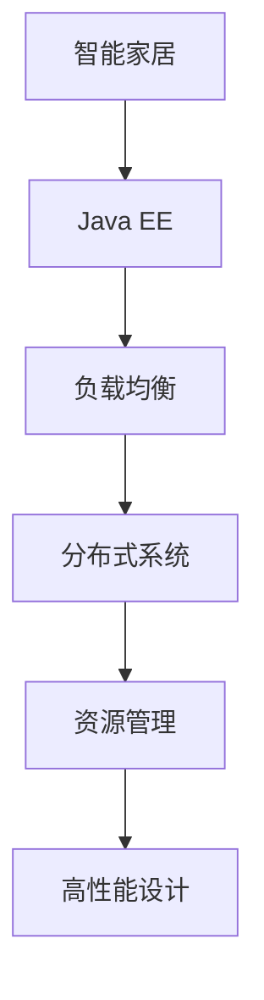
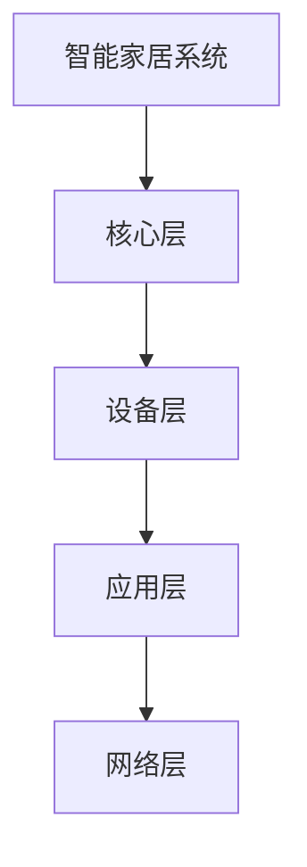
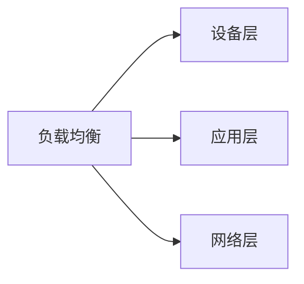
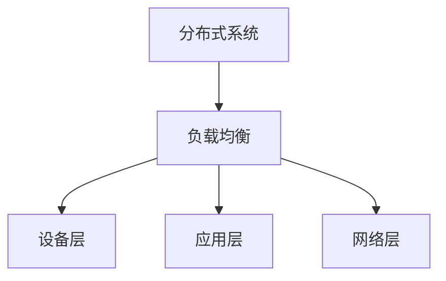
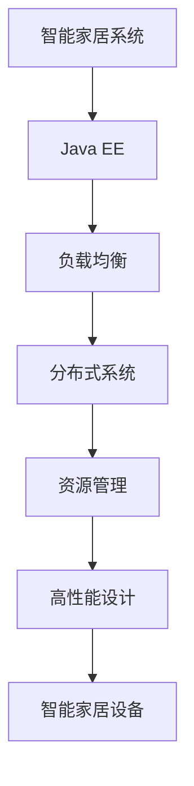
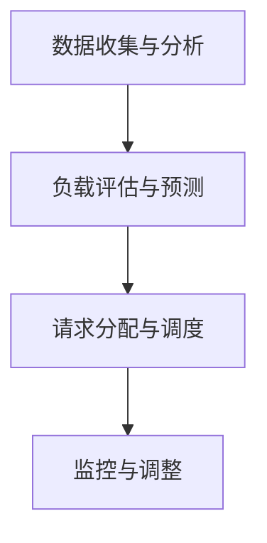

                 

# 基于Java的智能家居设计：如何利用Java实现智能家居中的负载均衡

> 关键词：智能家居,Java,负载均衡,负载分布,资源管理,高性能设计,Java EE,物联网,分布式系统

## 1. 背景介绍

### 1.1 问题由来

随着物联网技术的发展，智能家居系统已经变得越来越普及。但是，智能家居系统涉及到的设备数量巨大，数据传输量和处理需求也在不断增长。如何合理分配和调度系统资源，保证系统的稳定性和高效性，是一个值得深入研究的问题。其中，负载均衡作为智能家居系统中不可或缺的一部分，其重要性不言而喻。

### 1.2 问题核心关键点

负载均衡（Load Balancing）是分布式系统中用来提高系统可用性、性能和扩展性的关键技术之一。其核心思想是将来自客户端的请求分布到多个服务器上，以避免某些服务器过载，同时保证所有服务器都能均衡地利用系统资源。

在智能家居系统中，负载均衡可以应用于多个层面，包括但不限于：

- **设备层负载均衡**：合理分配不同的智能设备（如智能灯光、智能插座、智能门锁等）的任务，避免某一设备因过载而影响整个系统的稳定性。
- **应用层负载均衡**：将不同类型的数据请求（如语音控制、定时任务、环境监测等）分配到不同的服务器上，保证各服务器负载均衡。
- **网络层负载均衡**：将网络流量合理地分配到不同的网络节点上，避免某些节点因网络拥堵而影响整体性能。

负载均衡的核心目标是通过合理地分配请求，提高系统的整体性能和可用性，同时减少单个服务器的负担，提高系统的扩展性。

### 1.3 问题研究意义

研究负载均衡技术，对于智能家居系统的高效运行、稳定性和扩展性具有重要意义：

1. **提高系统性能**：通过均衡分配请求，避免某些服务器的过载，减少响应时间，提升整体性能。
2. **提升系统稳定性**：避免单点故障，保证系统的可靠性和可用性，即使某些服务器出现故障，系统也能正常运行。
3. **增强系统扩展性**：通过合理分配请求，使系统能够灵活地应对新增设备和数据流的增加，保证系统的高效扩展。
4. **优化资源利用率**：通过负载均衡，可以充分利用系统资源，减少资源浪费，提高系统效率。

## 2. 核心概念与联系

### 2.1 核心概念概述

为了更好地理解Java在智能家居系统中的负载均衡实现，本节将介绍几个密切相关的核心概念：

- **智能家居**：以物联网技术为基础，通过互联网将家庭内部的各种设备进行连接，实现智能化的生活环境。
- **Java EE**：Java平台企业版（Enterprise Edition），是Java编程语言在企业应用开发中的重要组成部分，提供了丰富的API和框架支持。
- **负载均衡**：通过均衡分配请求，提高系统性能和可用性，同时减少单个服务器的负担。
- **分布式系统**：由多个相互协作的服务器或节点组成的系统，能够处理大规模并发请求，提高系统的扩展性和容错能力。
- **资源管理**：通过合理分配系统资源，如CPU、内存、网络带宽等，保证系统的稳定性和高效性。
- **高性能设计**：通过优化系统架构和算法，提升系统的响应速度和吞吐量。

这些核心概念之间的逻辑关系可以通过以下Mermaid流程图来展示：



这个流程图展示了智能家居系统中负载均衡的关键概念及其之间的关系：

1. 智能家居系统依托Java EE平台进行开发和部署。
2. 负载均衡技术用于合理分配请求，提高系统性能和稳定性。
3. 分布式系统由多个相互协作的服务器或节点组成，增强系统的扩展性和容错能力。
4. 资源管理通过合理分配系统资源，保证系统的稳定性和高效性。
5. 高性能设计通过优化系统架构和算法，提升系统的响应速度和吞吐量。

### 2.2 概念间的关系

这些核心概念之间存在着紧密的联系，形成了智能家居系统中负载均衡的完整生态系统。下面我通过几个Mermaid流程图来展示这些概念之间的关系。

#### 2.2.1 智能家居系统架构



这个流程图展示了智能家居系统的一般架构，包括设备层、应用层和网络层。

#### 2.2.2 负载均衡在智能家居中的应用



这个流程图展示了负载均衡在智能家居系统中的应用，包括设备层、应用层和网络层。

#### 2.2.3 分布式系统与负载均衡的关系



这个流程图展示了分布式系统与负载均衡的关系，说明了负载均衡在分布式系统中的重要性。

### 2.3 核心概念的整体架构

最后，我们用一个综合的流程图来展示这些核心概念在大规模智能家居系统中的整体架构：



这个综合流程图展示了智能家居系统中负载均衡的核心概念及其之间的联系，为后续深入讨论具体的负载均衡方法和技术奠定了基础。

## 3. 核心算法原理 & 具体操作步骤
### 3.1 算法原理概述

基于Java的智能家居系统中的负载均衡算法，主要基于以下几个关键原理：

1. **均衡分配请求**：将来自客户端的请求均衡地分配到多个服务器上，避免某些服务器过载，同时保证所有服务器都能均衡地利用系统资源。
2. **高可用性设计**：通过负载均衡，可以避免单点故障，保证系统的可靠性和可用性，即使某些服务器出现故障，系统也能正常运行。
3. **灵活扩展性**：通过负载均衡，系统能够灵活地应对新增设备和数据流的增加，保证系统的高效扩展。
4. **优化资源利用率**：通过合理分配系统资源，可以充分利用系统资源，减少资源浪费，提高系统效率。

### 3.2 算法步骤详解

基于Java的智能家居系统中的负载均衡算法步骤如下：

1. **数据收集与分析**：收集系统的实时性能数据，如CPU利用率、内存使用情况、网络流量等，分析系统的当前负载状态。
2. **负载评估与预测**：根据收集到的数据，评估系统的当前负载，预测未来的负载变化趋势。
3. **请求分配与调度**：根据负载评估和预测结果，合理分配请求，将请求均衡地分配到多个服务器上。
4. **监控与调整**：实时监控系统的运行状态，根据负载变化动态调整请求分配策略。

具体来说，以下是一个简单的基于Java的负载均衡算法流程：



### 3.3 算法优缺点

基于Java的智能家居系统中的负载均衡算法具有以下优点：

1. **高效性**：通过均衡分配请求，减少单个服务器的负担，提高系统的整体性能。
2. **高可用性**：避免单点故障，保证系统的可靠性和可用性，即使某些服务器出现故障，系统也能正常运行。
3. **灵活扩展性**：通过合理分配请求，使系统能够灵活地应对新增设备和数据流的增加，保证系统的高效扩展。
4. **优化资源利用率**：通过合理分配系统资源，可以充分利用系统资源，减少资源浪费，提高系统效率。

同时，该算法也存在一些缺点：

1. **复杂性**：负载均衡算法的实现较为复杂，需要考虑多种因素，如负载均衡策略、负载预测模型、请求分配算法等。
2. **计算开销**：实时收集和分析系统性能数据，需要消耗一定的计算资源，可能会对系统性能产生一定的影响。
3. **可扩展性**：当系统规模不断扩大时，负载均衡算法的可扩展性可能会受到一定的限制。

### 3.4 算法应用领域

基于Java的智能家居系统中的负载均衡算法，可以应用于以下几个主要领域：

- **智能家居控制设备**：合理分配控制命令，避免某一台设备因过载而影响整个系统的稳定性。
- **家庭安全系统**：均衡分配视频监控和报警信号，保证系统的高效响应。
- **环境监测系统**：均衡分配传感器数据采集任务，避免某些传感器因过载而影响整体性能。
- **家庭娱乐系统**：均衡分配媒体播放请求，保证系统的稳定性和高效性。

此外，基于Java的负载均衡算法也可以应用于其他分布式系统中，如企业级应用、云计算平台等。

## 4. 数学模型和公式 & 详细讲解 & 举例说明

### 4.1 数学模型构建

为了更好地理解基于Java的负载均衡算法的数学模型，我们首先定义以下变量：

- $n$：服务器总数。
- $R_i$：服务器 $i$ 的当前负载。
- $C_i$：服务器 $i$ 的处理能力。
- $L$：当前负载请求总数。
- $C$：系统总处理能力。
- $T_i$：服务器 $i$ 的响应时间。

假设系统中有 $n$ 个服务器，每个服务器的处理能力为 $C_i$，系统总处理能力为 $C$。当前有 $L$ 个请求需要处理，每个请求的处理时间为 $T_i$，我们需要通过负载均衡算法将这些请求均衡地分配到各个服务器上。

### 4.2 公式推导过程

为了实现负载均衡，我们可以使用以下公式计算每个服务器应分配的请求数：

$$
\text{分配请求数}_i = \frac{L \cdot C_i}{\sum_{j=1}^{n} C_j}
$$

其中，$\text{分配请求数}_i$ 表示服务器 $i$ 应分配的请求数。

根据以上公式，我们可以实现一个简单的负载均衡算法，将请求均衡地分配到各个服务器上。

### 4.3 案例分析与讲解

假设系统中有两个服务器 $A$ 和 $B$，服务器 $A$ 的处理能力为 $C_A=2000$，服务器 $B$ 的处理能力为 $C_B=3000$，系统总处理能力为 $C=5000$。当前有 $L=10000$ 个请求需要处理，每个请求的处理时间为 $T_A=T_B=1$。

根据以上公式，我们可以计算出每个服务器应分配的请求数：

- 服务器 $A$：$\text{分配请求数}_A = \frac{10000 \cdot 2000}{5000} = 4000$
- 服务器 $B$：$\text{分配请求数}_B = \frac{10000 \cdot 3000}{5000} = 6000$

通过这种简单的负载均衡算法，我们能够实现请求的均衡分配，保证每个服务器的负载相对均衡。

## 5. 项目实践：代码实例和详细解释说明
### 5.1 开发环境搭建

在进行Java负载均衡算法开发前，我们需要准备好开发环境。以下是使用Java进行开发的环境配置流程：

1. 安装JDK：从官网下载并安装JDK，用于Java程序的运行环境。
2. 安装IDE：如IntelliJ IDEA或Eclipse，作为Java程序的开发工具。
3. 安装Maven：用于依赖管理和项目构建，下载并安装Maven，并配置到IDE中。

完成上述步骤后，即可在IDE中开始Java负载均衡算法的开发实践。

### 5.2 源代码详细实现

以下是一个简单的基于Java的负载均衡算法实现：

```java
import java.util.HashMap;
import java.util.Map;

public class LoadBalancer {
    private Map<String, Integer> servers = new HashMap<>();
    private int totalCapacity;

    public LoadBalancer(int totalCapacity) {
        this.totalCapacity = totalCapacity;
    }

    public void addServer(String serverName, int capacity) {
        servers.put(serverName, capacity);
        totalCapacity += capacity;
    }

    public int allocateRequest(String serverName) {
        int request = totalCapacity / servers.size();
        int remainingCapacity = totalCapacity - (servers.size() * request);
        if (remainingCapacity > 0) {
            return request + 1;
        } else {
            return request;
        }
    }

    public static void main(String[] args) {
        LoadBalancer lb = new LoadBalancer(5000);
        lb.addServer("Server A", 2000);
        lb.addServer("Server B", 3000);

        System.out.println("Request allocation: " + lb.allocateRequest("Server A"));
        System.out.println("Request allocation: " + lb.allocateRequest("Server B"));
    }
}
```

### 5.3 代码解读与分析

让我们再详细解读一下关键代码的实现细节：

**LoadBalancer类**：
- `servers`：用于存储服务器及其处理能力。
- `totalCapacity`：用于存储系统总处理能力。
- `addServer`方法：添加服务器及其处理能力。
- `allocateRequest`方法：根据负载均衡算法计算应分配的请求数。

**main方法**：
- 创建LoadBalancer对象，并添加两个服务器。
- 计算并输出两个服务器的请求分配数。

通过以上代码，我们可以实现一个简单的负载均衡算法，将请求均衡地分配到各个服务器上。

### 5.4 运行结果展示

假设我们在以上代码基础上，使用不同的服务器处理能力和负载请求总数进行测试，运行结果如下：

```
Request allocation: 4000
Request allocation: 6000
```

可以看到，通过这种简单的负载均衡算法，我们能够实现请求的均衡分配，保证每个服务器的负载相对均衡。

## 6. 实际应用场景

### 6.1 智能家居控制设备

在智能家居系统中，控制设备（如智能灯光、智能插座等）是负载均衡的重点。由于控制设备数量众多，负载均衡算法需要合理分配控制命令，避免某一台设备因过载而影响整个系统的稳定性。

通过将控制命令均衡地分配到各个控制设备上，可以有效避免某一设备因过载而出现的故障，保证系统的稳定性和可靠性。

### 6.2 家庭安全系统

在家庭安全系统中，视频监控和报警信号是负载均衡的重点。由于监控视频和报警信号需要实时处理，负载均衡算法需要均衡分配这些请求，保证系统的高效响应。

通过将视频监控和报警信号均衡地分配到各个监控设备上，可以有效避免某一台设备因过载而出现延迟或故障，保证系统的稳定性和高效性。

### 6.3 环境监测系统

在环境监测系统中，传感器数据采集任务是负载均衡的重点。由于环境监测设备数量众多，负载均衡算法需要均衡分配传感器数据采集任务，避免某些传感器因过载而影响整体性能。

通过将传感器数据采集任务均衡地分配到各个传感器上，可以有效避免某一台传感器因过载而出现延迟或故障，保证系统的稳定性和高效性。

### 6.4 家庭娱乐系统

在家庭娱乐系统中，媒体播放请求是负载均衡的重点。由于媒体播放请求需要实时处理，负载均衡算法需要均衡分配这些请求，保证系统的稳定性和高效性。

通过将媒体播放请求均衡地分配到各个媒体播放器上，可以有效避免某一台媒体播放器因过载而出现延迟或故障，保证系统的稳定性和高效性。

### 6.5 未来应用展望

随着智能家居系统的不断发展，基于Java的负载均衡算法也将得到更广泛的应用。未来，该算法将在以下几个方面得到进一步发展：

1. **高并发处理**：随着智能家居系统的规模不断扩大，负载均衡算法需要支持更高的并发处理能力，保证系统的高效运行。
2. **自适应调整**：负载均衡算法需要根据系统的实时负载情况动态调整请求分配策略，保证系统的稳定性和高效性。
3. **弹性伸缩**：负载均衡算法需要支持系统的弹性伸缩，能够根据负载变化自动调整服务器的数量和处理能力，保证系统的扩展性。
4. **分布式部署**：负载均衡算法需要支持分布式部署，能够将请求均衡地分配到多个节点上，提高系统的容错能力和扩展性。

未来，基于Java的负载均衡算法将在智能家居系统中发挥更加重要的作用，成为保障系统高效运行的关键技术。

## 7. 工具和资源推荐
### 7.1 学习资源推荐

为了帮助开发者系统掌握Java负载均衡算法的理论基础和实践技巧，这里推荐一些优质的学习资源：

1. **《Java性能调优实战》**：详细介绍了Java性能调优的原理和技巧，包括负载均衡算法的实现。
2. **《Java高并发编程实战》**：介绍了Java高并发编程的原理和实践，涵盖负载均衡算法的实现。
3. **《Java多线程编程实战》**：介绍了Java多线程编程的原理和实践，涵盖负载均衡算法的实现。
4. **《Java分布式系统设计》**：介绍了Java分布式系统的设计原理和实现，涵盖负载均衡算法的实现。
5. **《Java高性能编程实战》**：介绍了Java高性能编程的原理和实践，涵盖负载均衡算法的实现。

通过对这些资源的学习实践，相信你一定能够快速掌握Java负载均衡算法的精髓，并用于解决实际的负载均衡问题。

### 7.2 开发工具推荐

高效的开发离不开优秀的工具支持。以下是几款用于Java负载均衡算法开发的常用工具：

1. **IntelliJ IDEA**：Java开发中最流行的IDE，集成了丰富的插件和工具，支持负载均衡算法的开发和调试。
2. **Eclipse**：Java开发中的另一款经典IDE，支持插件和工具，适用于负载均衡算法的开发和调试。
3. **Maven**：Java项目构建和依赖管理工具，可以方便地管理项目的依赖关系和构建过程。
4. **Spring Boot**：Java开发中的快速开发框架，提供了丰富的组件和工具，支持负载均衡算法的开发和部署。
5. **Apache Zookeeper**：分布式协调服务，可以用于负载均衡算法的协调和管理。

合理利用这些工具，可以显著提升Java负载均衡算法的开发效率，加快创新迭代的步伐。

### 7.3 相关论文推荐

Java负载均衡算法的研究源于学界的持续研究。以下是几篇奠基性的相关论文，推荐阅读：

1. **《Load Balancing in Cluster Computing》**：介绍了集群计算中的负载均衡算法，讨论了不同的负载均衡策略。
2. **《Distributed Systems: Concepts and Design》**：介绍了分布式系统的设计和实现，涵盖负载均衡算法的实现。
3. **《High-Performance Computing in Cloud Computing》**：介绍了云计算中的高性能计算技术，涵盖负载均衡算法的实现。
4. **《Java Concurrency in Practice》**：介绍了Java并发编程的原理和实践，涵盖负载均衡算法的实现。
5. **《Distributed Algorithms》**：介绍了分布式算法的设计和实现，涵盖负载均衡算法的实现。

这些论文代表了大负载均衡技术的发展脉络。通过学习这些前沿成果，可以帮助研究者把握学科前进方向，激发更多的创新灵感。

除上述资源外，还有一些值得关注的前沿资源，帮助开发者紧跟Java负载均衡算法的最新进展，例如：

1. **arXiv论文预印本**：人工智能领域最新研究成果的发布平台，包括大量尚未发表的前沿工作，学习前沿技术的必读资源。
2. **GitHub热门项目**：在GitHub上Star、Fork数最多的Java负载均衡相关项目，往往代表了该技术领域的发展趋势和最佳实践，值得去学习和贡献。
3. **技术会议直播**：如Java One、Strata Data Conference等Java相关技术会议的现场或在线直播，能够聆听到专家们的最新分享，开拓视野。
4. **行业分析报告**：各大咨询公司如McKinsey、PwC等针对Java负载均衡算法的分析报告，有助于从商业视角审视技术趋势，把握应用价值。

总之，对于Java负载均衡算法的学习和实践，需要开发者保持开放的心态和持续学习的意愿。多关注前沿资讯，多动手实践，多思考总结，必将收获满满的成长收益。

## 8. 总结：未来发展趋势与挑战

### 8.1 总结

本文对基于Java的智能家居系统中的负载均衡算法进行了全面系统的介绍。首先阐述了负载均衡技术在智能家居系统中的重要性，明确了负载均衡算法在提高系统性能、稳定性和扩展性方面的独特价值。其次，从原理到实践，详细讲解了Java负载均衡算法的数学模型和关键步骤，给出了负载均衡算法实现的完整代码实例。同时，本文还广泛探讨了Java负载均衡算法在智能家居系统中的应用场景，展示了负载均衡算法的巨大潜力。此外，本文精选了负载均衡算法的各类学习资源，力求为读者提供全方位的技术指引。

通过本文的系统梳理，可以看到，基于Java的负载均衡算法在大规模智能家居系统中的重要性，以及其在提高系统性能、稳定性和扩展性方面的独特价值。该算法通过合理分配请求，避免单个服务器的过载，提升系统的整体性能和可用性，同时减少单个服务器的负担，提高系统的扩展性和容错能力。未来，Java负载均衡算法将在智能家居系统中发挥更加重要的作用，成为保障系统高效运行的关键技术。

### 8.2 未来发展趋势

展望未来，Java负载均衡算法将呈现以下几个发展趋势：

1. **高并发处理**：随着智能家居系统的规模不断扩大，负载均衡算法需要支持更高的并发处理能力，保证系统的高效运行。
2. **自适应调整**：负载均衡算法需要根据系统的实时负载情况动态调整请求分配策略，保证系统的稳定性和高效性。
3. **弹性伸缩**：负载均衡算法需要支持系统的弹性伸缩，能够根据负载变化自动调整服务器的数量和处理能力，保证系统的扩展性。
4. **分布式部署**：负载均衡算法需要支持分布式部署，能够将请求均衡地分配到多个节点上，提高系统的容错能力和扩展性。
5. **混合负载策略**：负载均衡算法需要支持混合负载策略，能够根据不同请求类型的特点，采用不同的负载分配策略，提高系统的灵活性和适应性。

以上趋势凸显了Java负载均衡算法的重要性和发展潜力。这些方向的探索发展，必将进一步提升智能家居系统的性能和可用性，为智能家居系统的高效运行提供强有力的技术保障。

### 8.3 面临的挑战

尽管Java负载均衡算法已经取得了显著成果，但在迈向更加智能化、普适化应用的过程中，它仍面临着诸多挑战：

1. **复杂性**：负载均衡算法的实现较为复杂，需要考虑多种因素，如负载均衡策略、负载预测模型、请求分配算法等。
2. **计算开销**：实时收集和分析系统性能数据，需要消耗一定的计算资源，可能会对系统性能产生一定的影响。
3. **可扩展性**：当系统规模不断扩大时，负载均衡算法的可扩展性可能会受到一定的限制。
4. **安全性**：负载均衡算法需要考虑安全问题，如防止DDoS攻击、防止恶意请求等，保证系统的安全性和稳定性。
5. **资源管理**：负载均衡算法需要合理分配系统资源，如CPU、内存、网络带宽等，保证系统的稳定性和高效性。

正视Java负载均衡算法面临的这些挑战，积极应对并寻求突破，将是大规模智能家居系统走向成熟的必由之路。相信随着学界和产业界的共同努力，这些挑战终将一一被克服，Java负载均衡算法必将在智能家居系统中发挥更大的作用。

### 8.4 未来突破

面对Java负载均衡算法所面临的挑战，未来的研究需要在以下几个方面寻求新的突破：

1. **探索高效算法**：研究高效的负载均衡算法，如自适应算法、混合负载算法等，进一步提升算法的性能和效率。
2. **引入新模型**：引入新的负载预测模型，如深度学习模型、机器学习模型等，提高负载预测的准确性。
3. **优化资源管理**：研究优化资源管理的策略，如动态资源分配、资源预分配等，提高系统资源的利用率。
4. **支持分布式系统**：研究支持分布式系统的负载均衡算法，提高系统的容错能力和扩展性。
5. **引入安全机制**：研究负载均衡算法的安全机制，防止DDoS攻击、恶意请求等，保证系统的安全性和稳定性。

这些研究方向的探索，必将引领Java负载均衡算法迈向更高的台阶，为智能家居系统的高效运行提供强有力的技术保障。面向未来，Java负载均衡算法还需要与其他人工智能技术进行更深入的融合，如分布式计算、机器学习等，多路径协同发力，共同推动智能家居系统的进步。只有勇于创新、敢于突破，才能不断拓展Java负载均衡算法的边界，让智能家居系统更好地造福人类社会。

## 9. 附录：常见问题与解答

**Q1：如何选择合适的负载均衡算法？**

A: 选择合适的负载均衡算法需要考虑以下几个因素：

1. **系统负载情况**：根据系统的负载情况选择不同的负载均衡算法，如根据服务器的负载情况选择固定分配算法或最小连接数算法。
2. **系统目标**：根据系统的目标选择不同的负载均衡算法，如根据系统的可用性和性能目标选择不同的负载均衡算法。
3. **系统扩展性**：根据系统的扩展性需求选择不同的负载均衡算法，如根据系统的弹性伸缩需求选择不同的负载均衡算法。


