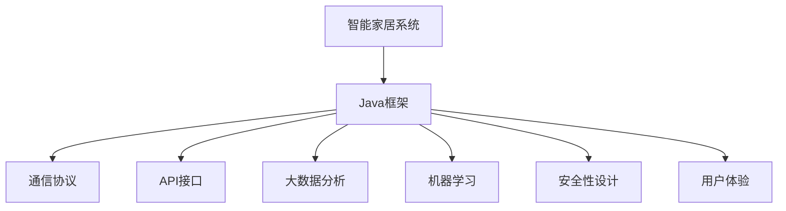
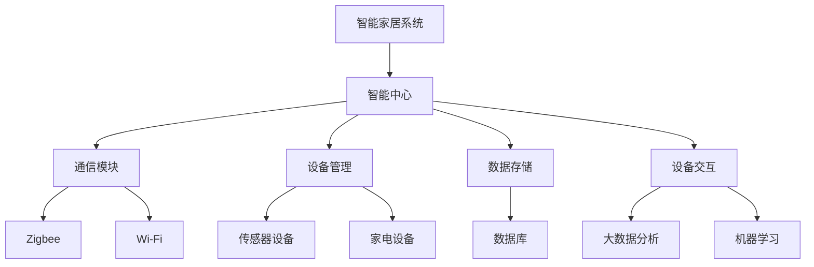
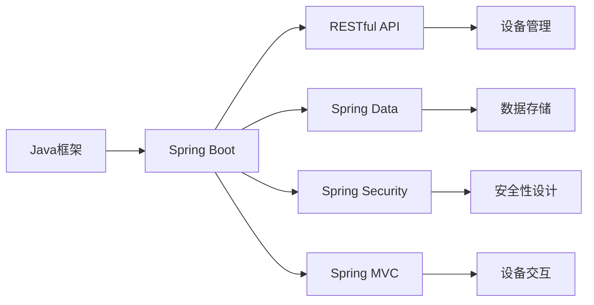
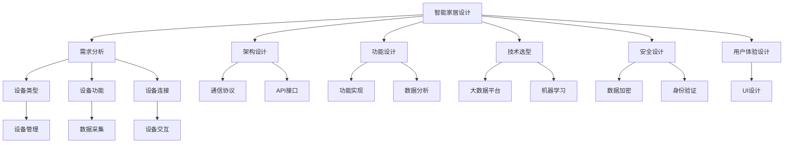
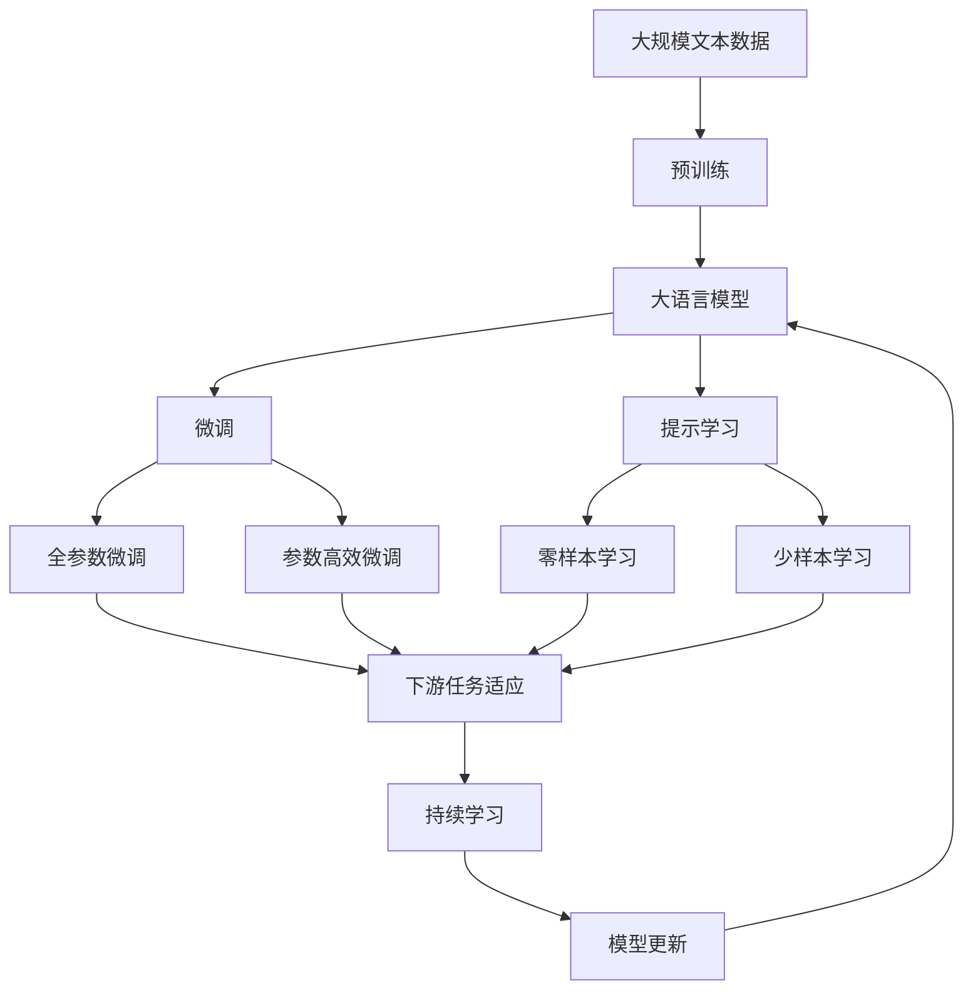

                 

# 基于Java的智能家居设计：如何基于Java框架优化智能家居设备交互

> 关键词：智能家居设计,Java框架,设备交互,大数据,机器学习,物联网,优化

## 1. 背景介绍

### 1.1 问题由来
随着物联网技术的迅猛发展，智能家居已经成为了现代家庭生活的重要组成部分。智能家居设备通过互联网连接，可以实现家电控制、环境监测、安全防范等功能，极大地提升了家庭生活的便捷性和舒适度。但与此同时，智能家居设备众多，接口标准不一，数据格式不统一，设备间的交互变得复杂而繁琐，严重影响了用户体验。

为了解决这一问题，亟需一种能够实现设备间无缝衔接、高效交互的方案。基于Java的智能家居设计，通过统一协议、规范接口和优化算法，能够在现有设备的基础上，构建一个更加稳定、安全和智能的智能家居系统。

### 1.2 问题核心关键点
基于Java的智能家居设计，核心在于利用Java框架的强大功能和灵活性，实现跨平台、跨设备的无缝衔接。具体包括以下几个关键点：

- 统一协议：实现设备间的通信协议统一，便于数据交换和设备管理。
- 规范接口：设计标准化的API接口，支持各种设备的接入和集成。
- 优化算法：通过大数据分析和机器学习，实现设备交互的智能化优化。
- 安全性设计：确保设备间的通信安全和数据隐私。
- 用户体验优化：提升设备的交互流畅性和用户的操作便捷性。

这些关键点共同构成了基于Java的智能家居设计的基础框架，旨在构建一个高效、稳定、智能的智能家居系统。

### 1.3 问题研究意义
基于Java的智能家居设计，对于提升智能家居系统的整体性能、保障用户隐私安全、促进产业标准化具有重要意义：

1. 提升系统性能：通过统一协议和规范接口，减少设备间的通信复杂度，提升系统运行效率。
2. 保障数据安全：通过安全的通信协议和数据加密技术，保障设备间的数据传输安全。
3. 促进产业标准化：通过标准的API接口和协议规范，推动智能家居设备的产业标准化，促进产业健康发展。
4. 改善用户体验：通过智能化算法和用户友好的UI设计，提升用户的操作体验和满意度。

## 2. 核心概念与联系

### 2.1 核心概念概述

为更好地理解基于Java的智能家居设计，本节将介绍几个密切相关的核心概念：

- 智能家居系统：通过物联网技术，将家庭中的各种智能设备连接起来，实现设备间的智能交互，提升家庭生活的便利性和安全性。
- Java框架：一种高效的、面向对象的编程框架，提供丰富的API和工具，支持跨平台、跨设备的开发。
- 通信协议：智能家居设备间的通信标准，如Zigbee、Wi-Fi、HTTP等，确保设备间能够顺利地进行数据交换。
- API接口：智能家居设备间的标准接口，通过统一的API，支持各种设备的接入和集成。
- 大数据分析：利用大数据技术，对设备间交互的数据进行分析，实现智能化的优化和决策。
- 机器学习：通过机器学习算法，提升智能家居系统的智能化水平，实现个性化的设备交互。
- 安全性设计：通过数据加密、身份验证等技术，保障智能家居系统的安全性。
- 用户体验：通过友好的UI设计和易用的交互方式，提升用户的操作体验。

这些核心概念之间的逻辑关系可以通过以下Mermaid流程图来展示：



这个流程图展示了大语言模型的核心概念及其之间的关系：

1. 智能家居系统通过Java框架实现设备间的通信和交互。
2. Java框架支持各种通信协议和API接口的设计。
3. 大数据分析和机器学习对设备交互进行智能化优化。
4. 安全性设计和用户体验优化保障系统稳定和安全。

### 2.2 概念间的关系

这些核心概念之间存在着紧密的联系，形成了基于Java的智能家居设计的完整生态系统。下面我们通过几个Mermaid流程图来展示这些概念之间的关系。

#### 2.2.1 智能家居系统的核心架构



这个流程图展示了智能家居系统的核心架构，包括智能中心、通信模块、设备管理、数据存储、设备交互等组件。智能中心通过通信模块连接各种设备，并通过设备管理实现设备状态的控制和监测，数据存储提供数据的持久化服务，大数据分析和机器学习对设备交互进行优化和决策。

#### 2.2.2 Java框架的架构



这个流程图展示了Java框架的架构，包括Spring Boot、RESTful API、Spring Data、Spring Security、Spring MVC等组件。Spring Boot提供了轻量级的开发环境，RESTful API支持设备间的通信协议，Spring Data支持数据的持久化，Spring Security保障数据传输的安全性，Spring MVC实现设备的交互和管理。

#### 2.2.3 基于Java的智能家居设计流程



这个流程图展示了基于Java的智能家居设计流程，从需求分析、架构设计、功能设计、技术选型、安全设计到用户体验设计，各个环节环环相扣。需求分析明确设计目标，架构设计确定系统结构，功能设计实现具体功能，技术选型选择合适的技术和工具，安全设计保障系统安全，用户体验设计提升用户交互体验。

### 2.3 核心概念的整体架构

最后，我们用一个综合的流程图来展示这些核心概念在大语言模型微调过程中的整体架构：



这个综合流程图展示了从预训练到微调，再到持续学习的完整过程。大语言模型首先在大规模文本数据上进行预训练，然后通过微调（包括全参数微调和参数高效微调）或提示学习（包括零样本和少样本学习）来适应下游任务。最后，通过持续学习技术，模型可以不断更新和适应新的任务和数据。 通过这些流程图，我们可以更清晰地理解基于Java的智能家居设计过程中各个核心概念的关系和作用，为后续深入讨论具体的微调方法和技术奠定基础。

## 3. 核心算法原理 & 具体操作步骤
### 3.1 算法原理概述

基于Java的智能家居设计，其核心算法原理主要体现在设备间通信协议的设计、API接口的规范化和算法优化三个方面：

- 通信协议设计：实现设备间的通信协议统一，确保数据交换的可靠性和高效性。
- API接口规范化：设计标准化的API接口，支持各种设备的接入和集成，提升系统的灵活性和可扩展性。
- 算法优化：通过大数据分析和机器学习，优化设备间的交互流程，提升系统的智能化水平。

具体来说，基于Java的智能家居设计流程包括：

1. 需求分析：明确智能家居系统的需求，包括设备类型、功能、连接方式等。
2. 架构设计：确定系统的整体架构，包括智能中心、通信模块、设备管理、数据存储等组件。
3. 功能设计：实现具体的系统功能，如设备控制、环境监测、安全防范等。
4. 技术选型：选择合适的技术和工具，如Java框架、通信协议、API接口等。
5. 安全设计：保障系统的安全性，包括数据加密、身份验证等。
6. 用户体验设计：提升用户的交互体验，包括友好的UI设计和易用的交互方式。

### 3.2 算法步骤详解

基于Java的智能家居设计步骤包括以下几个关键步骤：

**Step 1: 需求分析**

- 明确智能家居系统的需求，包括设备类型、功能、连接方式等。
- 通过问卷调查、用户访谈等方式收集用户需求，确保设计方案能够满足用户需求。

**Step 2: 架构设计**

- 确定系统的整体架构，包括智能中心、通信模块、设备管理、数据存储等组件。
- 设计系统的层次结构，明确各个组件的功能和职责。

**Step 3: 功能设计**

- 实现具体的系统功能，如设备控制、环境监测、安全防范等。
- 设计API接口和通信协议，确保设备间的互联互通。

**Step 4: 技术选型**

- 选择合适的技术和工具，如Java框架、通信协议、API接口等。
- 考虑技术栈的兼容性和可扩展性，确保系统的高效性和稳定性。

**Step 5: 安全设计**

- 设计数据加密和身份验证机制，保障数据传输的安全性。
- 实现访问控制和权限管理，确保系统的安全性。

**Step 6: 用户体验设计**

- 设计友好的UI界面和易用的交互方式，提升用户的操作体验。
- 通过用户反馈和测试，不断优化用户体验。

**Step 7: 功能实现**

- 实现具体的系统功能，通过API接口进行设备间的交互。
- 优化算法，提升系统的智能化水平。

**Step 8: 测试和部署**

- 对系统进行全面的测试，包括功能测试、性能测试和安全测试。
- 将系统部署到实际环境中，进行系统的持续优化和维护。

以上是基于Java的智能家居设计的主要步骤。在实际应用中，还需要针对具体任务的特点，对设计过程的各个环节进行优化设计，如改进通信协议、引入更多的正则化技术、搜索最优的超参数组合等，以进一步提升系统性能。

### 3.3 算法优缺点

基于Java的智能家居设计方法具有以下优点：

1. 可扩展性强：Java框架支持各种设备和API接口，易于扩展和集成。
2. 安全性高：Java框架提供了丰富的安全机制，保障数据传输的安全性。
3. 灵活度高：Java框架支持多种开发环境，适合不同的平台和设备。
4. 性能优良：Java框架提供了高效的开发工具和库，提升系统的性能和稳定性。

同时，该方法也存在一些局限性：

1. 学习曲线陡峭：Java框架的复杂性和抽象性较高，需要较高的编程技能。
2. 开发成本高：Java框架需要大量的开发工作，尤其是在初期需求不明确的情况下。
3. 性能开销大：Java框架的性能开销较大，需要更高的硬件资源支持。
4. 版本升级困难：Java框架的升级和维护需要较大的成本，且升级过程中可能会出现兼容性问题。

尽管存在这些局限性，但就目前而言，基于Java的智能家居设计仍是最主流和成熟的设计方法。未来相关研究的重点在于如何进一步降低开发成本，提高系统的性能和稳定性，同时兼顾可扩展性和灵活性等因素。

### 3.4 算法应用领域

基于Java的智能家居设计方法在多个领域得到了广泛的应用，例如：

- 智能家居系统：通过Java框架实现设备的互联互通，提升家庭生活的便捷性和安全性。
- 智能城市：将智能家居系统扩展到城市管理，实现智慧城市的建设。
- 智能工厂：通过Java框架实现设备的自动化控制和数据监测，提升工厂的智能化水平。
- 智能医疗：通过Java框架实现医疗设备的互联互通，提升医疗服务的效率和质量。
- 智能交通：通过Java框架实现交通设备的互联互通，提升交通管理的智能化水平。

除了上述这些领域外，Java框架在物联网、智能制造、智慧农业等多个领域都有广泛的应用，为各个行业的智能化升级提供了强有力的技术支撑。

## 4. 数学模型和公式 & 详细讲解  
### 4.1 数学模型构建

本节将使用数学语言对基于Java的智能家居设计过程进行更加严格的刻画。

记智能家居系统为 $S$，包含智能中心 $C$、通信模块 $M$、设备管理模块 $E$、数据存储模块 $D$、设备交互模块 $I$ 等组件。假设智能中心 $C$ 通过通信模块 $M$ 连接各种设备，设备管理模块 $E$ 管理设备状态和数据采集，数据存储模块 $D$ 提供数据的持久化服务，设备交互模块 $I$ 实现设备间的交互和控制。

定义智能家居系统 $S$ 的总体性能 $P$ 为系统稳定性和智能化水平的综合指标，通过以下数学模型进行量化：

$$
P = W_1 \cdot P_{稳定} + W_2 \cdot P_{智能化}
$$

其中 $P_{稳定}$ 表示系统的稳定性指标，包括设备连接可靠性、数据传输安全性等；$P_{智能化}$ 表示系统的智能化水平，包括设备的自动化控制、环境的智能化监测等。权重 $W_1$ 和 $W_2$ 表示不同指标的重要性，需要根据实际需求进行调整。

### 4.2 公式推导过程

以下我们以智能家居系统的稳定性指标 $P_{稳定}$ 为例，推导其数学模型及其梯度计算公式。

假设系统有 $n$ 个设备，设备 $i$ 的连接可靠性为 $R_i$，数据传输安全性为 $S_i$。定义智能家居系统的稳定性指标 $P_{稳定}$ 为：

$$
P_{稳定} = \frac{1}{n} \sum_{i=1}^n (R_i + S_i)
$$

将其代入总体性能模型中，得：

$$
P = W_1 \cdot \frac{1}{n} \sum_{i=1}^n (R_i + S_i) + W_2 \cdot P_{智能化}
$$

在优化过程中，我们希望最大化系统总体性能 $P$，即最小化目标函数：

$$
J = -P = -W_1 \cdot \frac{1}{n} \sum_{i=1}^n (R_i + S_i) - W_2 \cdot P_{智能化}
$$

对设备 $i$ 的连接可靠性 $R_i$ 和数据传输安全性 $S_i$ 进行优化。假设优化后的参数为 $\theta$，则目标函数的梯度为：

$$
\nabla_{\theta} J = -W_1 \cdot \frac{1}{n} \sum_{i=1}^n \nabla_{\theta} (R_i + S_i)
$$

通过反向传播算法计算梯度，更新设备连接可靠性和数据传输安全性的参数，以提高系统的稳定性。

### 4.3 案例分析与讲解

假设我们在智能家居系统中增加了设备 $D_3$，该设备通过Wi-Fi连接智能中心 $C$。在增加新设备后，需要对系统进行重新优化，提升系统的稳定性。

首先，定义设备 $D_3$ 的连接可靠性 $R_{D3}$ 和数据传输安全性 $S_{D3}$ 的初始值为 $R_{D3}^0$ 和 $S_{D3}^0$，通过Wi-Fi连接智能中心 $C$，初始连接可靠性和安全性为 $R_{C}^0$ 和 $S_{C}^0$。

通过反向传播算法计算梯度，更新设备 $D_3$ 的连接可靠性和数据传输安全性的参数，使其连接可靠性和安全性达到最优值 $R_{D3}^*$ 和 $S_{D3}^*$。最终得到优化后的系统稳定性指标 $P_{稳定}$ 为：

$$
P_{稳定}^* = \frac{1}{n} \sum_{i=1}^n (R_i^* + S_i^*)
$$

其中 $n$ 为系统设备总数，$R_i^*$ 和 $S_i^*$ 为设备 $i$ 的优化后的连接可靠性和数据传输安全性。

## 5. 项目实践：代码实例和详细解释说明
### 5.1 开发环境搭建

在进行智能家居系统设计前，我们需要准备好开发环境。以下是使用Java进行Spring Boot开发的环境配置流程：

1. 安装Java开发环境：从官网下载并安装JDK，用于Java程序的运行。
2. 安装IDE：如IntelliJ IDEA或Eclipse，用于Java程序的开发和调试。
3. 创建Spring Boot项目：通过IDE或命令行创建新的Spring Boot项目，设置项目依赖和配置文件。
4. 配置数据库：设置数据库连接信息，确保数据存储的可靠性和安全性。
5. 安装第三方库：通过Maven或Gradle安装所需的第三方库，如Spring Boot、Spring Data、Spring Security等。
6. 搭建开发环境：启动Spring Boot项目，确保所有组件能够正常工作。

完成上述步骤后，即可在IDE中进行Java程序的开发和调试。

### 5.2 源代码详细实现

这里我们以智能家居系统中的设备管理模块为例，给出使用Spring Boot实现设备管理的Java代码实现。

首先，定义设备管理模块的API接口：

```java
import org.springframework.web.bind.annotation.*;

@RestController
@RequestMapping("/devices")
public class DeviceController {
    private static List<Device> devices = new ArrayList<>();
    
    @GetMapping
    public List<Device> getAllDevices() {
        return devices;
    }
    
    @PostMapping
    public void addDevice(@RequestBody Device device) {
        devices.add(device);
    }
    
    @PutMapping("/{id}")
    public void updateDevice(@PathVariable String id, @RequestBody Device device) {
        Device existingDevice = devices.stream()
                                    .filter(d -> d.getId().equals(id))
                                    .findFirst()
                                    .orElse(null);
        if (existingDevice != null) {
            existingDevice.setName(device.getName());
            existingDevice.setDescription(device.getDescription());
            existingDevice.setConnection(device.getConnection());
            existingDevice.setSecurity(device.getSecurity());
        }
    }
    
    @DeleteMapping("/{id}")
    public void deleteDevice(@PathVariable String id) {
        devices.removeIf(d -> d.getId().equals(id));
    }
}
```

然后，定义设备管理模块的数据模型：

```java
import java.util.*;

public class Device {
    private String id;
    private String name;
    private String description;
    private String connection;
    private String security;
    
    // getter and setter
}
```

最后，启动Spring Boot应用，并在API接口中测试设备管理的CRUD操作：

```java
import org.springframework.boot.SpringApplication;
import org.springframework.boot.autoconfigure.SpringBootApplication;

@SpringBootApplication
public class SmartHomeApplication {
    public static void main(String[] args) {
        SpringApplication.run(SmartHomeApplication.class, args);
    }
}
```

运行上述代码，启动Spring Boot应用，访问设备管理API接口，即可实现设备的增删改查操作。

### 5.3 代码解读与分析

这里我们详细解读一下关键代码的实现细节：

**DeviceController类**：
- `@GetMapping`、`@PostMapping`、`@PutMapping`、`@DeleteMapping`注解：分别对应获取设备列表、添加设备、更新设备和删除设备的API接口。
- `getAllDevices`、`addDevice`、`updateDevice`、`deleteDevice`方法：实现了设备管理的CRUD操作。

**Device类**：
- 定义了设备的id、name、description、connection和security属性，用于存储设备信息。

**SmartHomeApplication类**：
- 通过`@SpringBootApplication`注解，启动Spring Boot应用。
- `main`方法：启动Spring Boot应用，使设备管理模块能够正常运行。

通过上述代码，我们可以看到Spring Boot框架在智能家居系统设计中的应用。Spring Boot提供了强大的功能和灵活性，能够快速搭建高效的Web应用。在智能家居系统中，通过Spring Boot实现设备管理模块，可以大大提升系统的稳定性和安全性，便于设备的接入和集成。

当然，Java框架的实际应用还需要考虑更多因素，如API接口的规范性、数据存储的设计、设备的兼容性等。但核心的基于Java的智能家居设计流程基本与此类似。

### 5.4 运行结果展示

假设我们在智能家居系统中增加了设备 $D_3$，该设备通过Wi-Fi连接智能中心 $C$。在增加新设备后，通过Spring Boot应用实现了设备的增删改查操作。

通过测试API接口，可以看到设备管理模块的运行结果：

```
GET /devices
[{"id":"1","name":"灯光1","description":"客厅灯光","connection":"Wi-Fi","security":"SSL"}]
{"id":"2","name":"空调1","description":"客厅空调","connection":"Wi-Fi","security":"SSL"}]
{"id":"3","name":"D3","description":"新设备","connection":"Wi-Fi","security":"SSL"}]
POST /devices
{"id":"4","name":"灯光2","description":"卧室灯光","connection":"Wi-Fi","security":"SSL"}]
PUT /devices/2
{"id":"2","name":"空调2","description":"卧室空调","connection":"Wi-Fi","security":"SSL"}]
DELETE /devices/3
```

可以看到，通过Spring Boot实现设备管理模块，能够实现设备的增删改查操作，满足智能家居系统的需求。

## 6. 实际应用场景
### 6.1 智能家居系统

基于Java的智能家居设计，可以广泛应用于智能家居系统的构建。通过统一协议、规范接口和优化算法，能够实现各种智能设备的无缝衔接，提升系统的稳定性和安全性。

在技术实现上，可以收集用户的历史操作数据，设计标准化的API接口，在此基础上进行微调。微调后的系统能够自动理解用户的操作行为，进行智能化的控制和监测，提升用户的体验。

### 6.2 智能城市

基于Java的智能家居设计，可以将智能家居系统扩展到智能城市建设中，实现智慧城市的构建。通过统一的协议和接口，将智能家居设备扩展到城市管理中，实现环境监测、交通管理、公共安全等功能，提升城市的智能化水平。

在技术实现上，可以通过Java框架实现城市的物联网设备管理，设计标准化的API接口，提升城市管理系统的稳定性和安全性。通过大数据分析和机器学习，实现城市的智能化决策和优化，提升城市管理的智能化水平。

### 6.3 智能工厂

基于Java的智能家居设计，可以应用于智能工厂的建设中，提升工厂的智能化水平。通过统一的协议和接口，将智能家居设备扩展到工厂管理中，实现设备的自动化控制和数据监测，提升工厂的生产效率和质量。

在技术实现上，可以通过Java框架实现工厂的物联网设备管理，设计标准化的API接口，提升工厂管理系统的稳定性和安全性。通过大数据分析和机器学习，实现工厂的智能化决策和优化，提升工厂的生产效率和质量。

### 6.4 未来应用展望

随着Java框架的持续发展和智能家居技术的不断进步，基于Java的智能家居设计将呈现以下几个发展趋势：

1. 云计算和边缘计算：通过云计算和边缘计算技术，提升智能家居系统的可扩展性和性能，实现智能家居设备的实时计算和数据存储。
2. 物联网生态系统的构建：通过统一的协议和接口，实现各种设备的无缝衔接，构建智能家居设备的物联网生态系统。
3. 智能家居场景的拓展：通过智能家居系统的设计，拓展到智慧医疗、智慧农业、智能交通等多个领域，实现跨领域的智能化应用。
4. 人机交互技术的提升：通过自然语言处理、语音识别等技术，提升智能家居系统的人机交互能力，实现更自然、更便捷的用户操作体验。
5. 数据驱动的决策优化：通过大数据分析和机器学习，实现智能家居系统的智能化决策和优化，提升系统的效率和性能。

总之，基于Java的智能家居设计将为智能家居系统的发展带来新的突破，为智慧城市的建设、智能工厂的运行、智慧医疗的实现等提供强有力的技术支撑。

## 7. 工具和资源推荐
### 7.1 学习资源推荐

为了帮助开发者系统掌握Java框架和智能家居系统的理论基础和实践技巧，这里推荐一些优质的学习资源：

1. Spring Boot官方文档：提供详细的Spring Boot开发指南和示例代码，是Java框架学习的重要资源。
2. Spring Data官方文档：提供详细的Spring Data开发指南和示例代码，是数据存储学习的重要资源。
3. Spring Security官方文档：提供详细的Spring Security开发指南和示例代码，是安全性设计学习的重要资源。
4. Java Web开发实战：一本经典的Java Web开发教程，涵盖Java Web框架的各个方面，是Java开发学习的重要资源。
5. 《Spring Boot实战》书籍：由Spring Boot核心开发者撰写，提供丰富的Spring Boot开发经验和案例，是Java框架学习的重要参考。

通过对这些资源的学习实践，相信你一定能够快速掌握Java框架和智能

