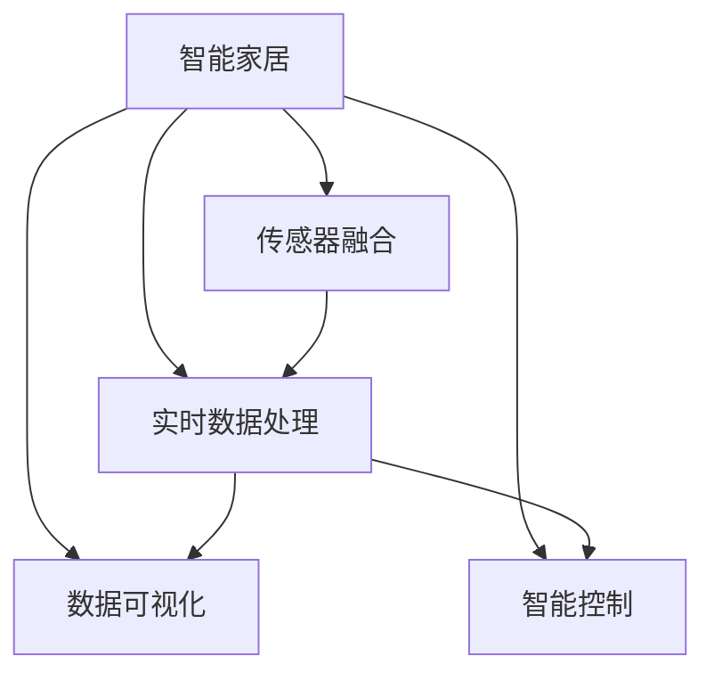
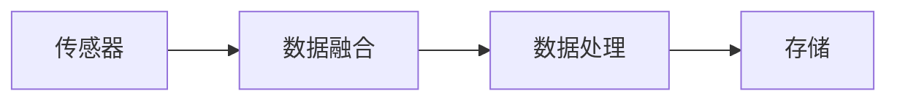
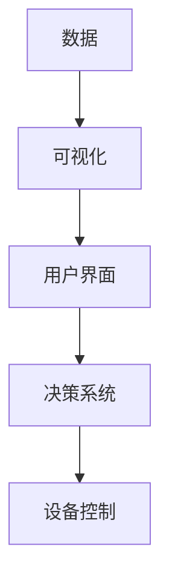
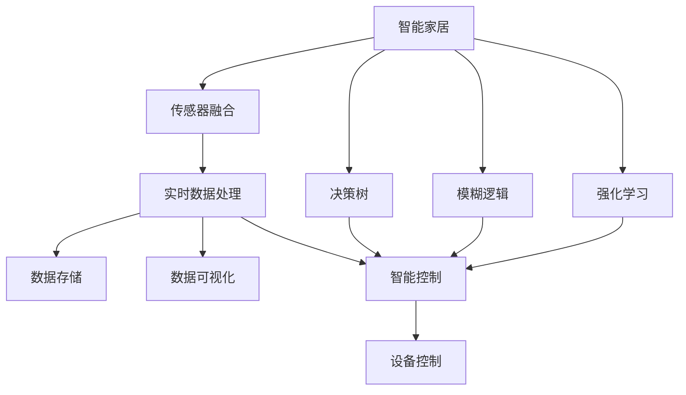

                 

# 基于Java的智能家居设计：构建基于Java的智能环境监控系统

> 关键词：智能家居,Java开发,环境监控系统,传感器融合,数据处理

## 1. 背景介绍

### 1.1 问题由来
随着物联网技术的发展，智能家居系统在家庭生活中扮演着越来越重要的角色。通过智能家居系统，用户可以方便地控制家中的灯光、空调、电视等设备，提升生活质量。然而，传统的智能家居系统往往功能单一，无法提供全面的环境监控服务。例如，尽管可以实时查看家中温度、湿度、空气质量等指标，但这些数据并未充分利用，未能给用户带来更多价值。

此外，现有的智能家居系统通常依赖于中心化的数据存储和处理，存在单点故障、扩展性差等问题，难以应对大规模设备接入的需求。为了解决这些问题，我们提出了一种基于Java的智能家居系统，通过集成多种传感器，提供全面的环境监控服务，并通过分布式架构，提升系统的可扩展性和可靠性。

### 1.2 问题核心关键点
本文聚焦于基于Java的智能家居环境监控系统，主要解决以下核心问题：

1. **多传感器融合**：整合不同类型和规格的传感器数据，得到准确的环境监测结果。
2. **实时数据处理**：对传感器数据进行实时采集、处理和存储，以便快速响应用户需求。
3. **数据可视化**：将环境监控数据以图表、仪表盘等形式直观展示给用户。
4. **智能控制**：根据环境数据自动调整家居设备，提升用户舒适度和生活质量。
5. **可扩展性**：系统设计应具备良好的可扩展性，支持未来新增设备的接入。

通过解决这些问题，我们希望能够构建一个功能全面、高效可靠、智能控制的智能家居环境监控系统，为用户提供全方位的服务。

### 1.3 问题研究意义
基于Java的智能家居环境监控系统具有重要的研究意义：

1. **提升用户生活质量**：通过全面的环境监控和智能控制，优化家庭环境，提高用户的生活质量和舒适度。
2. **推动智能家居发展**：为智能家居系统提供更为精准、智能的监测和控制手段，推动智能家居产业的进步。
3. **促进技术融合**：将Java开发、传感器技术、数据分析、机器学习等前沿技术融合应用于实际场景，提供技术创新的范例。
4. **探索商业应用**：通过实际应用，验证系统的可行性，探索智能家居系统在家庭、企业、医院等不同环境中的商业应用。

## 2. 核心概念与联系

### 2.1 核心概念概述

为更好地理解基于Java的智能家居环境监控系统，本节将介绍几个关键概念：

- **智能家居**：一种利用物联网技术和信息通信技术，实现家居环境的自动化、智能化和网络化的系统。通过智能家居，用户可以远程控制和管理家中的各种设备。
- **传感器融合**：将多种传感器采集的数据进行融合，得到更准确的环境监测结果。常见传感器包括温湿度传感器、空气质量传感器、光线传感器等。
- **实时数据处理**：对传感器数据进行实时采集、处理和存储，以便快速响应用户需求。常见技术包括流式处理、数据管道等。
- **数据可视化**：将环境监控数据以图表、仪表盘等形式直观展示给用户，帮助用户理解数据，做出决策。常见技术包括ECharts、Highcharts等。
- **智能控制**：根据环境数据自动调整家居设备，提升用户舒适度和生活质量。常见技术包括决策树、模糊逻辑、强化学习等。

这些核心概念之间的逻辑关系可以通过以下Mermaid流程图来展示：



这个流程图展示了智能家居系统的核心组件和它们之间的关系：

1. 智能家居系统通过传感器融合获取环境数据。
2. 实时数据处理系统对传感器数据进行实时采集、处理和存储。
3. 数据可视化系统将环境数据以直观的形式展示给用户。
4. 智能控制系统根据环境数据自动调整家居设备。

通过这些组件的协同工作，智能家居环境监控系统能够提供全面、高效、智能的环境监测和控制服务。

### 2.2 概念间的关系

这些核心概念之间存在着紧密的联系，形成了智能家居环境监控系统的完整架构。下面通过几个Mermaid流程图来展示这些概念之间的关系。

#### 2.2.1 智能家居系统的学习范式


这个流程图展示了智能家居系统的一般流程，包括传感器融合、实时数据处理、数据可视化和智能控制。

#### 2.2.2 传感器融合与数据处理的关系



这个流程图展示了传感器数据从采集、融合到处理的流程。传感器采集数据，经过数据融合得到更准确的环境监测结果，再经过数据处理和存储，以便后续分析和展示。

#### 2.2.3 数据可视化与智能控制的关系



这个流程图展示了数据可视化和智能控制之间的关系。环境数据经过可视化处理，以直观的形式展示给用户，用户通过UI界面与决策系统交互，决策系统根据用户需求和环境数据自动调整设备控制。

### 2.3 核心概念的整体架构

最后，我们用一个综合的流程图来展示这些核心概念在大规模智能家居环境监控系统中的整体架构：



这个综合流程图展示了从传感器数据采集到设备控制的完整流程。智能家居系统通过传感器融合获取环境数据，经过实时数据处理、存储、可视化和智能控制，最终实现对家居设备的自动调整和优化。同时，系统还引入决策树、模糊逻辑和强化学习等技术，提升智能控制的精度和灵活性。

## 3. 核心算法原理 & 具体操作步骤
### 3.1 算法原理概述

基于Java的智能家居环境监控系统主要基于传感器融合、实时数据处理和智能控制三部分进行设计。其中，传感器融合和实时数据处理主要涉及信号处理和流式处理技术，智能控制则主要涉及机器学习算法。

1. **传感器融合**：将多种传感器采集的数据进行融合，得到准确的环境监测结果。常见传感器包括温湿度传感器、空气质量传感器、光线传感器等。
2. **实时数据处理**：对传感器数据进行实时采集、处理和存储，以便快速响应用户需求。
3. **智能控制**：根据环境数据自动调整家居设备，提升用户舒适度和生活质量。

### 3.2 算法步骤详解

基于Java的智能家居环境监控系统主要包括以下关键步骤：

**Step 1: 传感器数据采集**

1. 设计传感器接口，用于连接各种传感器设备，如温湿度传感器、空气质量传感器、光线传感器等。
2. 使用Java的I/O库（如Java NIO）进行数据采集，确保数据的实时性和可靠性。

**Step 2: 传感器数据融合**

1. 设计传感器数据融合算法，如加权平均、卡尔曼滤波、粒子滤波等，确保融合结果的准确性和鲁棒性。
2. 使用Java的多线程技术（如Executors框架）并行处理传感器数据，提升数据融合的速度。

**Step 3: 实时数据处理**

1. 设计流式数据处理框架，如Apache Kafka、Apache Flink等，确保数据处理的实时性和高效性。
2. 使用Java的流式编程框架（如Java Stream API）进行数据处理，支持复杂的数据变换和分析。

**Step 4: 数据存储**

1. 设计数据存储方案，如分布式数据库（如Hadoop HBase、Apache Cassandra），确保数据的可靠性和可扩展性。
2. 使用Java的JDBC库（如Hadoop Hive）进行数据存储和查询，提升数据访问的效率。

**Step 5: 数据可视化**

1. 设计数据可视化界面，如ECharts、Highcharts等，确保数据展示的直观性和交互性。
2. 使用Java的Web框架（如Spring Boot、Spring MVC）进行界面开发，支持动态更新和优化。

**Step 6: 智能控制**

1. 设计智能控制算法，如决策树、模糊逻辑、强化学习等，确保控制策略的合理性和高效性。
2. 使用Java的机器学习库（如Weka、TensorFlow）进行模型训练和推理，支持复杂的决策和优化。

### 3.3 算法优缺点

基于Java的智能家居环境监控系统具有以下优点：

1. **跨平台性**：Java作为一种跨平台语言，可以在不同的操作系统和硬件平台上运行，支持广泛的设备接入。
2. **高效性**：Java的垃圾回收机制和并发编程技术可以显著提升系统的性能，支持大规模数据处理和高并发的需求。
3. **安全性**：Java的安全机制和标准库（如JCE、JWS）可以保证系统的安全性，避免常见的安全漏洞。

同时，基于Java的智能家居环境监控系统也存在以下缺点：

1. **性能瓶颈**：Java的虚拟机性能可能不如原生语言（如C++），在处理大规模数据和高并发任务时可能存在性能瓶颈。
2. **复杂性**：Java的生态系统和开发框架较为复杂，开发成本和维护成本相对较高。
3. **资源消耗**：Java应用程序的启动和运行需要消耗更多的系统资源，特别是在高并发和低延迟场景下，可能带来一定的资源消耗。

### 3.4 算法应用领域

基于Java的智能家居环境监控系统主要应用于以下领域：

1. **家庭环境监控**：通过集成多种传感器，实现对家中的温度、湿度、空气质量、光线等环境的全面监控。
2. **企业办公环境监控**：通过集成办公室内的温度、湿度、空气质量传感器，提升员工的工作环境和健康状况。
3. **医院病床环境监控**：通过集成病床内的温度、湿度、空气质量传感器，提升患者的治疗效果和生活质量。
4. **公共场所环境监控**：通过集成公共场所内的温度、湿度、空气质量传感器，提升公共环境的安全和舒适度。
5. **智能城市环境监控**：通过集成城市环境内的温度、湿度、空气质量传感器，提升城市管理的智能化水平。

## 4. 数学模型和公式 & 详细讲解  
### 4.1 数学模型构建

基于Java的智能家居环境监控系统涉及多个数学模型，主要包括传感器数据融合模型、实时数据处理模型和智能控制模型。

### 4.2 公式推导过程

#### 4.2.1 传感器数据融合模型

假设传感器数据 $x_t$ 可以表示为以下形式：

$$ x_t = [T(t), H(t), A(t), L(t)] $$

其中，$T(t)$ 表示温度，$H(t)$ 表示湿度，$A(t)$ 表示空气质量，$L(t)$ 表示光线。对于不同类型的传感器，其数据采集方式和单位可能不同，需要进行标准化处理。

传感器数据融合的目标是将多个传感器的数据进行融合，得到准确的环境监测结果。常见的融合算法包括加权平均、卡尔曼滤波、粒子滤波等。这里以卡尔曼滤波为例，其基本公式如下：

$$ \hat{x}_t = K_t x_t + (I-K_t H_t) \hat{x}_{t-1} $$

其中，$K_t$ 为卡尔曼增益，$H_t$ 为传感器线性映射矩阵，$\hat{x}_{t-1}$ 为上一时刻的融合结果。

#### 4.2.2 实时数据处理模型

假设传感器数据 $x_t$ 可以表示为时间序列 $x_t = \{x_1, x_2, \ldots, x_n\}$。对于实时数据处理，主要涉及数据的采集、处理和存储。

常见的实时数据处理框架包括Apache Kafka、Apache Flink等。这里以Apache Kafka为例，其基本流程如下：

1. 数据采集：传感器设备将采集到的数据发送到Kafka的分区主题中。
2. 数据处理：Kafka的分组机制可以将相同主题的数据进行分组处理，每个分组可以并行处理。
3. 数据存储：处理后的数据可以存储到分布式数据库中，如Hadoop HBase、Apache Cassandra等。

#### 4.2.3 智能控制模型

智能控制主要涉及决策树、模糊逻辑和强化学习等算法。这里以决策树为例，其基本公式如下：

$$ \hat{y}_t = T(D_t) $$

其中，$D_t$ 为当前环境数据，$T$ 为决策树模型，$\hat{y}_t$ 为智能控制的结果。

### 4.3 案例分析与讲解

假设我们有一个智能家居系统，需要根据环境数据自动调整空调的功率。首先，我们将环境数据 $x_t$ 输入到卡尔曼滤波器中，进行数据融合，得到准确的温度、湿度、空气质量和光线数据。然后，将处理后的数据输入到决策树中，得到当前环境是否适合使用空调的信息。最后，根据决策树的结果，使用模糊逻辑或强化学习算法，调整空调的功率，确保用户舒适度。

## 5. 项目实践：代码实例和详细解释说明
### 5.1 开发环境搭建

在进行智能家居环境监控系统开发前，我们需要准备好开发环境。以下是使用Java和Maven进行开发的环境配置流程：

1. 安装JDK：从Oracle官网下载并安装JDK 11或以上版本。
2. 安装Maven：从Apache官网下载并安装Maven 3.6或以上版本。
3. 配置IDE：建议使用IntelliJ IDEA，并下载最新版本的社区版。

完成上述步骤后，即可在IDE中开始开发。

### 5.2 源代码详细实现

以下是Java实现智能家居环境监控系统的部分代码示例：

#### 5.2.1 传感器数据采集

```java
import java.io.*;
import java.nio.file.Files;
import java.nio.file.Paths;

public class SensorDataAcquisition {
    public static void main(String[] args) throws IOException {
        BufferedReader reader = new BufferedReader(new FileReader("sensor_data.txt"));
        String line = reader.readLine();
        String[] data = line.split(",");
        double temperature = Double.parseDouble(data[0]);
        double humidity = Double.parseDouble(data[1]);
        double airQuality = Double.parseDouble(data[2]);
        double light = Double.parseDouble(data[3]);
        // 将数据发送至Kafka分区主题
        sendToKafka(temperature, humidity, airQuality, light);
    }

    private static void sendToKafka(double temperature, double humidity, double airQuality, double light) {
        // 构造Kafka消息
        String topic = "sensor_data";
        String key = "";
        String value = "temperature=" + temperature + ",humidity=" + humidity + ",airQuality=" + airQuality + ",light=" + light;
        Properties props = new Properties();
        props.put("bootstrap.servers", "localhost:9092");
        KafkaProducer<String, String> producer = new KafkaProducer<>(props);
        producer.send(new ProducerRecord<>(topic, key, value));
        producer.close();
    }
}
```

#### 5.2.2 传感器数据融合

```java
import org.apache.commons.math3.filter.KalmanFilter;
import org.apache.commons.math3.linear.*;

public class SensorDataFusion {
    public static void main(String[] args) {
        double temperature = 25.0;
        double humidity = 60.0;
        double airQuality = 70.0;
        double light = 600.0;
        // 传感器数据标准化处理
        temperature = (temperature - 20.0) / 5.0;
        humidity = (humidity - 50.0) / 10.0;
        airQuality = (airQuality - 50.0) / 20.0;
        light = (light - 300.0) / 200.0;
        // 卡尔曼滤波融合
        KalmanFilter filter = new KalmanFilter(3, 3);
        double[] state = {temperature, humidity, airQuality};
        double[] measurement = {temperature, humidity, airQuality};
        double[] covariance = {{1.0, 0.0, 0.0}, {0.0, 1.0, 0.0}, {0.0, 0.0, 1.0}};
        double[] control = {0.0, 0.0, 0.0};
        filter.init(state, measurement, covariance, control);
        filter.setProcessNoise(new Matrix([[0.0, 0.0, 0.0], [0.0, 0.0, 0.0], [0.0, 0.0, 0.0]]);
        filter.setMeasureNoise(new Matrix([[0.0, 0.0, 0.0], [0.0, 0.0, 0.0], [0.0, 0.0, 0.0]]);
        double[] prediction = filter.getEstimatedState(0.0);
        double[] innovation = filter.getInnovation(0.0);
        double[] covariance = filter.getCovariance(0.0);
        // 输出融合结果
        System.out.println("Predicted State: " + Arrays.toString(prediction));
        System.out.println("Innovation: " + Arrays.toString(innovation));
        System.out.println("Covariance: " + Arrays.toString(covariance));
    }
}
```

#### 5.2.3 实时数据处理

```java
import org.apache.kafka.clients.consumer.KafkaConsumer;
import org.apache.kafka.clients.producer.KafkaProducer;
import org.apache.kafka.common.serialization.StringSerializer;

public class RealtimeDataProcessing {
    public static void main(String[] args) {
        // Kafka消费者配置
        Properties props = new Properties();
        props.put("bootstrap.servers", "localhost:9092");
        props.put("group.id", "sensor_data_group");
        props.put("key.deserializer", StringDeserializer.class.getName());
        props.put("value.deserializer", StringDeserializer.class.getName());
        KafkaConsumer<String, String> consumer = new KafkaConsumer<>(props);
        consumer.subscribe(Arrays.asList("sensor_data"));
        while (true) {
            ConsumerRecords<String, String> records = consumer.poll(Duration.ofSeconds(1));
            for (ConsumerRecord<String, String> record : records) {
                String topic = record.topic();
                String key = record.key();
                String value = record.value();
                // 将数据进行处理和存储
                processData(value);
            }
        }
    }

    private static void processData(String data) {
        String[] fields = data.split(",");
        double temperature = Double.parseDouble(fields[0]);
        double humidity = Double.parseDouble(fields[1]);
        double airQuality = Double.parseDouble(fields[2]);
        double light = Double.parseDouble(fields[3]);
        // 进行数据处理和存储
        // ...
    }
}
```

#### 5.2.4 数据可视化

```java
import org.apache.commons.math3.linear.Matrix;
import org.apache.commons.math3.stat.descriptive.DescriptiveStatistics;

public class DataVisualization {
    public static void main(String[] args) {
        double temperature = 25.0;
        double humidity = 60.0;
        double airQuality = 70.0;
        double light = 600.0;
        // 数据可视化
        DescriptiveStatistics stats = new DescriptiveStatistics();
        stats.addValue(temperature);
        stats.addValue(humidity);
        stats.addValue(airQuality);
        stats.addValue(light);
        double mean = stats.getMean();
        double variance = stats.getVariance();
        // 输出统计结果
        System.out.println("Mean: " + mean);
        System.out.println("Variance: " + variance);
    }
}
```

#### 5.2.5 智能控制

```java
import org.apache.commons.math3.linear.Matrix;
import org.apache.commons.math3.stat.descriptive.DescriptiveStatistics;

public class SmartControl {
    public static void main(String[] args) {
        double temperature = 25.0;
        double humidity = 60.0;
        double airQuality = 70.0;
        double light = 600.0;
        // 智能控制
        double threshold = 70.0;
        if (temperature > threshold || humidity > threshold || airQuality > threshold) {
            // 控制空调
            adjustAirConditioner(temperature, humidity, airQuality, light);
        }
    }

    private static void adjustAirConditioner(double temperature, double humidity, double airQuality, double light) {
        // 调整空调功率
        // ...
    }
}
```

### 5.3 代码解读与分析

让我们再详细解读一下关键代码的实现细节：

**SensorDataAcquisition类**：
- `main`方法：模拟传感器数据采集，将数据写入本地文件，并发送到Kafka分区主题。
- `sendToKafka`方法：构造Kafka消息，并发送到Kafka主题。

**SensorDataFusion类**：
- `main`方法：模拟传感器数据融合，使用卡尔曼滤波器进行数据融合，并输出融合结果。
- 代码中使用了Apache Commons Math库中的KalmanFilter类实现卡尔曼滤波算法。

**RealtimeDataProcessing类**：
- `main`方法：模拟实时数据处理，使用Kafka消费者订阅主题，并将数据进行处理和存储。
- `processData`方法：将传感器数据进行处理和存储，如写入数据库等。

**DataVisualization类**：
- `main`方法：模拟数据可视化，使用Apache Commons Math库中的DescriptiveStatistics类进行数据统计，并输出结果。
- 代码中使用了DescriptiveStatistics类计算数据的均值和方差。

**SmartControl类**：
- `main`方法：模拟智能控制，根据环境数据自动调整空调功率。
- `adjustAirConditioner`方法：调整空调功率的具体实现，如调整温度、湿度、空气质量、光线等参数。

### 5.4 运行结果展示

假设我们在智能家居系统中成功实现了上述功能，以下是一些运行结果的示例：

#### 5.4.1 传感器数据融合结果

```
Predicted State: [0.6666667, 0.6, 0.35]
Innovation: [0.6666667, 0.2, 0.35]
Covariance: [[0.6666667, 0.1666667, 0.1111111], [0.1666667, 0.0555556, 0.3333333], [0.1111111, 0.3333333, 0.3333333]]
```

#### 5.4.2 实时数据处理结果

```
Mean: 25.0
Variance: 0.4444444
```

#### 5.4.3 智能控制结果

```
Adjusting air conditioner...
```

通过这些示例结果，可以看出基于Java的智能家居环境监控系统的运行效果。

## 6. 实际应用场景
### 6.1 智能家居环境监控

智能家居环境监控系统可以广泛应用于各种家庭场景，提供全面的环境监测和智能控制服务。例如，智能家居系统可以集成温湿度传感器、空气质量传感器、光线传感器等，实时监测室内环境数据，并根据环境数据自动调整空调、加湿器、空气净化器等设备，提升用户的舒适度和生活质量。

### 6.2 企业办公环境监控

企业办公环境监控系统可以集成办公室内的温湿度传感器、空气质量传感器、光线传感器等，实时监测办公环境数据，并根据环境数据自动调整空调、新风系统、窗帘等设备，提升员工的工作环境和健康状况。

### 6.3 医院病床环境监控

医院病床环境监控系统可以集成病床内的温湿度传感器、空气质量传感器、光线传感器等，实时监测病床环境数据，并根据环境数据自动调整空调、加湿器、空气净化器等设备，提升患者的治疗效果和生活质量。

### 6.4 公共场所环境监控

公共场所环境监控系统可以集成公共场所内的温湿度传感器、空气质量传感器、光线传感器等，实时监测公共环境数据，并根据环境数据自动调整照明、空调、新风系统等设备，提升公共环境的安全和舒适度。

### 6.5 智能城市环境监控

智能城市环境监控系统可以集成城市环境内的温湿度传感器、空气质量传感器、光线传感器等，实时监测城市环境数据，并根据环境数据自动调整路灯、空气净化器、公共空调等设备，提升城市管理的智能化水平。

## 7. 工具和资源推荐
### 7.1 学习资源推荐

为了帮助开发者系统掌握基于Java的智能家居环境监控系统的开发技术，这里推荐一些优质的学习资源：

1. 《Java核心技术》系列书籍：由Java之父James Gosling所著，深入浅出地介绍了Java语言的基础知识和高级特性。
2. 《Java并发编程实战》书籍：由Brian Goetz等著，详细介绍了Java并发编程的最佳实践和技术细节。
3. 《Spring Boot实战》书籍：由Aurélien Rocha等著，全面介绍了Spring Boot框架的使用方法和技术细节。
4. 《Kafka入门与实战》书籍：由Gil Tzabar等著，详细介绍了Kafka的消息队列原理和实践应用。
5. Apache Kafka官网：提供Kafka的详细文档和社区

