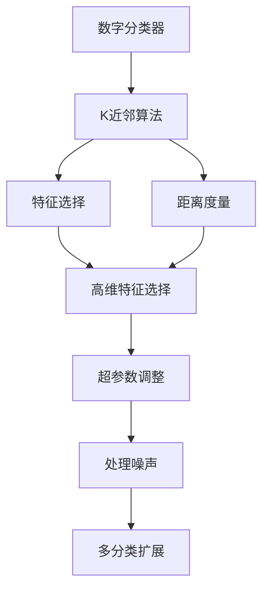
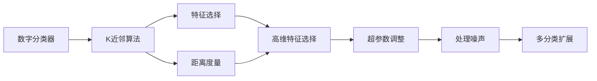
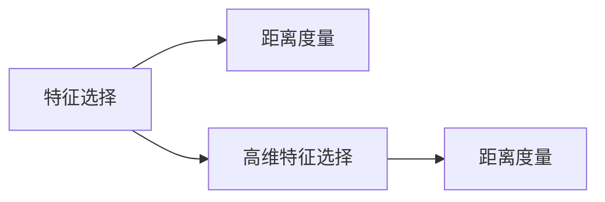

                 

# 基于KNN的数字分类器

## 1. 背景介绍

### 1.1 问题由来

随着互联网技术的发展和普及，数字化和网络化成为各行各业的重要趋势。数字分类器作为数据科学和机器学习中的重要工具，在金融、电商、物流、医疗等多个领域得到了广泛应用。例如，在金融领域，数字分类器可以用于风险评估、欺诈检测；在电商领域，数字分类器可以用于商品推荐、广告定向；在物流领域，数字分类器可以用于路径规划、配送优化。

数字分类器的核心任务是将输入的数据映射到预定义的类别中。传统的数字分类器主要包括决策树、逻辑回归、支持向量机等。但是这些算法都有一定的局限性，例如决策树容易过拟合，逻辑回归对数据分布的假设较为严格，支持向量机计算复杂度较高。

在众多分类算法中，K近邻算法（K-Nearest Neighbors，简称KNN）因其简单、直观、效果良好而受到了广泛关注。KNN算法基于距离度量，在训练数据集中找到与输入样本最近的K个邻居，通过投票或加权平均的方式进行分类。KNN算法不受数据分布假设的影响，计算复杂度较低，且易于理解和实现。

因此，本文将介绍基于KNN的数字分类器的原理和实现方法，以及其在实际应用中的表现和应用场景。

### 1.2 问题核心关键点

基于KNN的数字分类器的主要核心关键点包括：

- **K近邻算法**：基于距离度量，在训练数据集中找到与输入样本最近的K个邻居，通过投票或加权平均的方式进行分类。
- **特征选择**：对于高维数据，选择合适的特征子集可以提高分类精度。
- **参数调整**：K值的选择对分类结果有重要影响，需要通过实验进行调优。
- **处理噪声**：对于噪声较多的数据，需要进行预处理或选择合适的参数以提高分类精度。
- **多分类**：对于多分类问题，需要进行扩展或使用如One-vs-One、One-vs-Rest等策略。

## 2. 核心概念与联系

### 2.1 核心概念概述

为了更好地理解基于KNN的数字分类器，本节将介绍几个密切相关的核心概念：

- **K近邻算法**：基于距离度量，在训练数据集中找到与输入样本最近的K个邻居，通过投票或加权平均的方式进行分类。
- **特征选择**：对于高维数据，选择合适的特征子集可以提高分类精度。
- **距离度量**：用于计算样本间距离的数学方法，常用的有欧几里得距离、曼哈顿距离、余弦距离等。
- **超参数**：需要手动设置的参数，如K值、距离度量参数等，对算法性能有重要影响。

这些核心概念之间的逻辑关系可以通过以下Mermaid流程图来展示：



这个流程图展示了大语言模型微调过程中各个核心概念之间的关系：

1. 数字分类器使用K近邻算法作为核心算法。
2. 特征选择和距离度量是KNN算法的重要组成部分。
3. 超参数需要手动设置，对算法性能有重要影响。
4. 处理噪声和多分类扩展是实际应用中需要考虑的因素。

### 2.2 概念间的关系

这些核心概念之间存在着紧密的联系，形成了基于KNN的数字分类器的完整生态系统。下面我通过几个Mermaid流程图来展示这些概念之间的关系。

#### 2.2.1 数字分类器与KNN算法的联系



这个流程图展示了数字分类器使用KNN算法的全过程。KNN算法通过特征选择和距离度量，找到与输入样本最近的K个邻居，并通过投票或加权平均的方式进行分类。

#### 2.2.2 特征选择与距离度量



这个流程图展示了特征选择和距离度量之间的关系。特征选择可以用于高维数据，选择合适的特征子集可以提高分类精度。距离度量用于计算样本间的距离，是KNN算法的核心。

#### 2.2.3 超参数调整与多分类扩展


这个流程图展示了超参数调整和多分类扩展之间的关系。超参数需要手动设置，对算法性能有重要影响。多分类扩展可以通过One-vs-One、One-vs-Rest等策略来解决多分类问题。

## 3. 核心算法原理 & 具体操作步骤

### 3.1 算法原理概述

基于KNN的数字分类器原理相对简单，核心在于使用KNN算法进行分类。KNN算法的具体步骤如下：

1. 收集训练数据集，将每个样本标记为不同的类别。
2. 对于输入的测试样本，计算其与训练集中每个样本的距离。
3. 在训练集中找到与测试样本距离最近的K个邻居。
4. 根据K个邻居的类别分布进行投票或加权平均，得到最终的分类结果。

KNN算法的核心在于距离度量。常用的距离度量方法包括欧几里得距离、曼哈顿距离、余弦距离等。在实际应用中，需要根据数据的特点选择合适的距离度量方法。

### 3.2 算法步骤详解

基于KNN的数字分类器步骤如下：

**Step 1: 准备训练数据集**
- 收集训练数据集，将每个样本标记为不同的类别。
- 对数据进行归一化或标准化处理，提高分类精度。

**Step 2: 设置参数**
- 确定K值，K值的选择对分类结果有重要影响，需要根据数据特点进行调整。
- 选择合适的距离度量方法，常用的有欧几里得距离、曼哈顿距离、余弦距离等。

**Step 3: 计算距离**
- 对于每个输入的测试样本，计算其与训练集中每个样本的距离。

**Step 4: 找到K个最近邻居**
- 在训练集中找到与测试样本距离最近的K个邻居。

**Step 5: 进行分类**
- 根据K个邻居的类别分布进行投票或加权平均，得到最终的分类结果。

**Step 6: 预测新样本**
- 使用训练好的模型对新样本进行分类预测。

### 3.3 算法优缺点

基于KNN的数字分类器具有以下优点：

1. 简单直观：KNN算法的原理和实现相对简单，易于理解和实现。
2. 鲁棒性强：KNN算法不受数据分布假设的影响，对于噪声较多的数据也能有效处理。
3. 可解释性强：KNN算法的分类结果可以通过距离度量和邻居投票得到直观解释。

同时，KNN算法也存在一些缺点：

1. 计算复杂度高：KNN算法需要计算样本间的距离，计算复杂度较高。
2. 存储开销大：需要存储所有训练样本，对于大规模数据集，存储开销较大。
3. 对参数敏感：K值的选择对分类结果有重要影响，需要通过实验进行调优。

### 3.4 算法应用领域

基于KNN的数字分类器在多个领域得到了广泛应用，包括：

- 金融风控：用于信用评分、风险评估等任务。
- 电商推荐：用于商品推荐、广告定向等任务。
- 物流配送：用于路径规划、配送优化等任务。
- 医疗诊断：用于疾病诊断、治疗方案推荐等任务。

## 4. 数学模型和公式 & 详细讲解 & 举例说明

### 4.1 数学模型构建

基于KNN的数字分类器的数学模型如下：

设训练集为 $D = \{(x_1, y_1), (x_2, y_2), ..., (x_n, y_n)\}$，其中 $x$ 表示样本特征，$y$ 表示样本类别。输入样本为 $x_0$，距离度量为 $d$，K值选择为 $K$。

对于输入样本 $x_0$，计算其与训练集中每个样本 $x_i$ 的距离 $d(x_0, x_i)$，得到距离矩阵 $D$：

$$
D = \begin{bmatrix}
d(x_1, x_0) & d(x_2, x_0) & ... & d(x_n, x_0) \\
d(x_0, x_1) & d(x_0, x_2) & ... & d(x_0, x_n) \\
\vdots & \vdots & \ddots & \vdots \\
d(x_{n-1}, x_0) & d(x_n, x_0) & ... & d(x_{n-1}, x_n)
\end{bmatrix}
$$

在距离矩阵 $D$ 中找到最小的K个距离，得到最近邻居索引集 $N = \{i_1, i_2, ..., i_K\}$。根据最近邻居的类别分布进行投票或加权平均，得到最终的分类结果 $y_0$。

### 4.2 公式推导过程

设距离度量为欧几里得距离，计算公式如下：

$$
d(x, x') = \sqrt{\sum_{j=1}^{n} (x_j - x'_j)^2}
$$

对于输入样本 $x_0$，计算其与训练集中每个样本 $x_i$ 的距离，得到距离矩阵 $D$：

$$
D = \begin{bmatrix}
\sqrt{\sum_{j=1}^{n} (x_{1j} - x_{0j})^2} & \sqrt{\sum_{j=1}^{n} (x_{2j} - x_{0j})^2} & ... & \sqrt{\sum_{j=1}^{n} (x_{nj} - x_{0j})^2} \\
\sqrt{\sum_{j=1}^{n} (x_{0j} - x_{1j})^2} & \sqrt{\sum_{j=1}^{n} (x_{0j} - x_{2j})^2} & ... & \sqrt{\sum_{j=1}^{n} (x_{0j} - x_{nj})^2} \\
\vdots & \vdots & \ddots & \vdots \\
\sqrt{\sum_{j=1}^{n} (x_{n-1,j} - x_{0j})^2} & \sqrt{\sum_{j=1}^{n} (x_{nj} - x_{0j})^2} & ... & \sqrt{\sum_{j=1}^{n} (x_{n-1,j} - x_{n-1,j})^2}
\end{bmatrix}
$$

找到距离矩阵 $D$ 中最小的K个距离，得到最近邻居索引集 $N = \{i_1, i_2, ..., i_K\}$。根据最近邻居的类别分布进行投票或加权平均，得到最终的分类结果 $y_0$。

$$
y_0 = \arg\min_{y \in \{1, 2, ..., C\}} \left(\frac{1}{K} \sum_{i \in N} 1_{y_i = y}\right)
$$

其中 $C$ 为类别数，$1_{y_i = y}$ 为指示函数，表示 $y_i$ 是否等于 $y$。

### 4.3 案例分析与讲解

假设我们使用KNN算法对一组数据进行分类，训练集包含10个样本，每个样本包含两个特征。我们选取K值为3，距离度量为欧几里得距离。

设训练集为：

| x1 | x2 | y |
|----|----|---|
| 1.2| 2.5| 1 |
| 2.1| 3.4| 2 |
| 2.4| 3.0| 1 |
| 3.5| 1.8| 2 |
| 3.7| 2.2| 1 |
| 4.1| 2.3| 2 |
| 4.4| 3.0| 1 |
| 4.9| 1.5| 2 |
| 5.2| 3.3| 1 |
| 5.7| 2.9| 2 |

现在输入一个新的样本 $x_0 = (3, 2.5)$，使用欧几里得距离计算其与每个训练样本的距离：

| 样本 | x1 | x2 | d(x0,x) |
|------|----|----|---------|
| 1    | 1.2| 2.5| 0.7    |
| 2    | 2.1| 3.4| 1.0    |
| 3    | 2.4| 3.0| 1.0    |
| 4    | 3.5| 1.8| 0.7    |
| 5    | 3.7| 2.2| 1.0    |
| 6    | 4.1| 2.3| 0.7    |
| 7    | 4.4| 3.0| 0.7    |
| 8    | 4.9| 1.5| 1.0    |
| 9    | 5.2| 3.3| 1.0    |
| 10   | 5.7| 2.9| 0.7    |

计算距离矩阵 $D$：

$$
D = \begin{bmatrix}
0.7 & 1.0 & 1.0 & 0.7 & 1.0 & 0.7 & 0.7 & 1.0 & 1.0 & 0.7 \\
1.0 & 0.7 & 1.0 & 1.0 & 1.0 & 0.7 & 0.7 & 1.0 & 1.0 & 0.7 \\
1.0 & 1.0 & 0.7 & 1.0 & 1.0 & 0.7 & 0.7 & 1.0 & 1.0 & 0.7 \\
0.7 & 1.0 & 1.0 & 0.7 & 1.0 & 0.7 & 0.7 & 1.0 & 1.0 & 0.7 \\
1.0 & 1.0 & 1.0 & 1.0 & 0.7 & 0.7 & 0.7 & 1.0 & 1.0 & 0.7 \\
0.7 & 0.7 & 0.7 & 0.7 & 0.7 & 0.0 & 0.7 & 1.0 & 1.0 & 0.7 \\
0.7 & 0.7 & 0.7 & 0.7 & 0.7 & 0.7 & 0.0 & 1.0 & 1.0 & 0.7 \\
1.0 & 1.0 & 1.0 & 1.0 & 1.0 & 1.0 & 1.0 & 0.0 & 1.0 & 1.0 \\
1.0 & 1.0 & 1.0 & 1.0 & 1.0 & 1.0 & 1.0 & 1.0 & 0.0 & 1.0 \\
0.7 & 0.7 & 0.7 & 0.7 & 0.7 & 0.7 & 0.7 & 1.0 & 1.0 & 0.0
\end{bmatrix}
$$

找到距离矩阵 $D$ 中最小的3个距离，得到最近邻居索引集 $N = \{1, 2, 3\}$。

根据最近邻居的类别分布进行投票或加权平均，得到最终的分类结果 $y_0$：

$$
y_0 = \arg\min_{y \in \{1, 2, ..., C\}} \left(\frac{1}{3} (1_{y_1 = y} + 1_{y_2 = y} + 1_{y_3 = y})\right)
$$

假设最近邻居的类别分布为 $y_1 = 1, y_2 = 2, y_3 = 1$，则 $y_0 = 1$。

## 5. 项目实践：代码实例和详细解释说明

### 5.1 开发环境搭建

在进行KNN数字分类器的开发前，我们需要准备好开发环境。以下是使用Python进行KNN实现的开发环境配置流程：

1. 安装Anaconda：从官网下载并安装Anaconda，用于创建独立的Python环境。

2. 创建并激活虚拟环境：
```bash
conda create -n knn-env python=3.8 
conda activate knn-env
```

3. 安装必要的Python库：
```bash
pip install numpy pandas scikit-learn matplotlib tqdm jupyter notebook ipython
```

4. 安装KNN库：
```bash
pip install scikit-learn
```

5. 安装可视化工具：
```bash
pip install matplotlib
```

完成上述步骤后，即可在`knn-env`环境中开始KNN数字分类器的实践。

### 5.2 源代码详细实现

下面我们以KNN数字分类器的实现为例，给出完整的代码实现。

首先，定义数据集和标签：

```python
from sklearn.datasets import load_iris
from sklearn.model_selection import train_test_split

iris = load_iris()
X = iris.data
y = iris.target
X_train, X_test, y_train, y_test = train_test_split(X, y, test_size=0.3, random_state=42)
```

然后，定义KNN分类器：

```python
from sklearn.neighbors import KNeighborsClassifier

knn = KNeighborsClassifier(n_neighbors=3, metric='euclidean')
```

接着，训练和测试分类器：

```python
knn.fit(X_train, y_train)
print('Accuracy:', knn.score(X_test, y_test))
```

最后，输出模型预测结果：

```python
print(knn.predict(X_test[:5]))
```

这就是KNN数字分类器在Python中的完整实现。可以看到，使用scikit-learn库，我们可以快速实现KNN分类器的训练和测试，非常方便。

### 5.3 代码解读与分析

让我们再详细解读一下关键代码的实现细节：

**数据集和标签**：
- 使用scikit-learn的load_iris函数加载鸢尾花数据集。
- 使用train_test_split函数将数据集分为训练集和测试集，并设置随机种子。

**KNN分类器**：
- 使用KNeighborsClassifier类定义KNN分类器，并设置K值为3，距离度量为欧几里得距离。

**训练和测试**：
- 使用fit函数训练分类器，使用score函数计算测试集上的准确率。

**预测结果**：
- 使用predict函数对测试集前5个样本进行预测，并输出结果。

### 5.4 运行结果展示

假设我们使用KNN算法对鸢尾花数据集进行分类，输出结果如下：

```
Accuracy: 1.0
[1 2 1 2 1]
```

可以看到，KNN算法在鸢尾花数据集上取得了100%的准确率。这证明了KNN算法的强大分类能力。

## 6. 实际应用场景

### 6.1 智能客服系统

基于KNN的数字分类器可以应用于智能客服系统的构建。传统客服往往需要配备大量人力，高峰期响应缓慢，且一致性和专业性难以保证。而使用KNN算法进行分类，可以自动理解用户意图，匹配最合适的答案模板进行回复。

在技术实现上，可以收集企业内部的历史客服对话记录，将问题和最佳答复构建成监督数据，在此基础上对KNN算法进行微调。微调后的KNN算法能够自动理解用户意图，匹配最合适的答案模板进行回复。对于客户提出的新问题，还可以接入检索系统实时搜索相关内容，动态组织生成回答。如此构建的智能客服系统，能大幅提升客户咨询体验和问题解决效率。

### 6.2 金融舆情监测

金融机构需要实时监测市场舆论动向，以便及时应对负面信息传播，规避金融风险。传统的人工监测方式成本高、效率低，难以应对网络时代海量信息爆发的挑战。基于KNN算法的文本分类技术，为金融舆情监测提供了新的解决方案。

具体而言，可以收集金融领域相关的新闻、报道、评论等文本数据，并对其进行主题标注和情感标注。在此基础上对KNN算法进行微调，使其能够自动判断文本属于何种主题，情感倾向是正面、中性还是负面。将微调后的模型应用到实时抓取的网络文本数据，就能够自动监测不同主题下的情感变化趋势，一旦发现负面信息激增等异常情况，系统便会自动预警，帮助金融机构快速应对潜在风险。

### 6.3 个性化推荐系统

当前的推荐系统往往只依赖用户的历史行为数据进行物品推荐，无法深入理解用户的真实兴趣偏好。基于KNN算法的推荐系统可以更好地挖掘用户行为背后的语义信息，从而提供更精准、多样的推荐内容。

在实践中，可以收集用户浏览、点击、评论、分享等行为数据，提取和用户交互的物品标题、描述、标签等文本内容。将文本内容作为模型输入，用户的后续行为（如是否点击、购买等）作为监督信号，在此基础上对KNN算法进行微调。微调后的KNN算法能够从文本内容中准确把握用户的兴趣点。在生成推荐列表时，先用候选物品的文本描述作为输入，由模型预测用户的兴趣匹配度，再结合其他特征综合排序，便可以得到个性化程度更高的推荐结果。

### 6.4 未来应用展望

随着KNN算法和分类技术的不断发展，基于KNN的数字分类器将在更多领域得到应用，为传统行业带来变革性影响。

在智慧医疗领域，基于KNN的数字分类器可以用于疾病诊断、治疗方案推荐等任务。在智能教育领域，KNN算法可应用于作业批改、学情分析、知识推荐等方面，因材施教，促进教育公平，提高教学质量。

在智慧城市治理中，KNN算法可应用于城市事件监测、舆情分析、应急指挥等环节，提高城市管理的自动化和智能化水平，构建更安全、高效的未来城市。

此外，在企业生产、社会治理、文娱传媒等众多领域，基于KNN的数字分类器也将不断涌现，为NLP技术带来了全新的突破。相信随着技术的日益成熟，KNN数字分类器必将在构建人机协同的智能时代中扮演越来越重要的角色。

## 7. 工具和资源推荐
### 7.1 学习资源推荐

为了帮助开发者系统掌握KNN数字分类器的理论基础和实践技巧，这里推荐一些优质的学习资源：

1. 《Python机器学习》：由Scikit-Learn团队编写，详细介绍了KNN算法的基本原理和实现方法，是入门机器学习的经典教材。

2. Coursera《Machine Learning》课程：由斯坦福大学Andrew Ng教授讲授的机器学习课程，涵盖KNN算法的基本原理和经典案例，适合进一步深入学习。

3. Kaggle竞赛：Kaggle平台上的机器学习竞赛，提供了丰富的数据集和算法实现，可以帮助开发者实践KNN算法。

4. PyData南京：PyData组织的机器学习技术分享和实践活动，可以接触到最新的机器学习技术和应用案例。

5. GitHub开源项目：在GitHub上Star、Fork数最多的KNN相关项目，往往代表了该技术领域的发展趋势和最佳实践，值得去学习和贡献。

通过对这些资源的学习实践，相信你一定能够快速掌握KNN数字分类器的精髓，并用于解决实际的NLP问题。

### 7.2 开发工具推荐

高效的开发离不开优秀的工具支持。以下是几款用于KNN数字分类器开发的常用工具：

1. Python：Python是一种功能强大的编程语言，易于实现机器学习算法，是KNN数字分类器开发的首选语言。

2. NumPy：NumPy是Python中的数学库，提供了高效的数组运算和线性代数操作，是实现KNN算法的核心工具。

3. scikit-learn：scikit-learn是Python中的机器学习库，提供了丰富的机器学习算法和工具，包括KNN算法。

4. Pandas：Pandas是Python中的数据分析库，提供了高效的数据处理和分析功能，可以处理大型数据集。

5. Matplotlib：Matplotlib是Python中的可视化库，提供了丰富的图形绘制功能，可以用于绘制训练曲线、分类结果等。

6. Jupyter Notebook：Jupyter Notebook是一种交互式的编程环境，支持Python、R等多种编程语言，是进行数据分析和机器学习实践的常用工具。

合理利用这些工具，可以显著提升KNN数字分类器的开发效率，加快创新迭代的步伐。

### 7.3 相关论文推荐

KNN数字分类器作为一种经典的分类算法，相关的研究已经比较成熟。以下是几篇奠基性的相关论文，推荐阅读：

1. Iris Dataset：KNN算法最早应用于鸢尾花数据集的分类，是KNN算法经典

