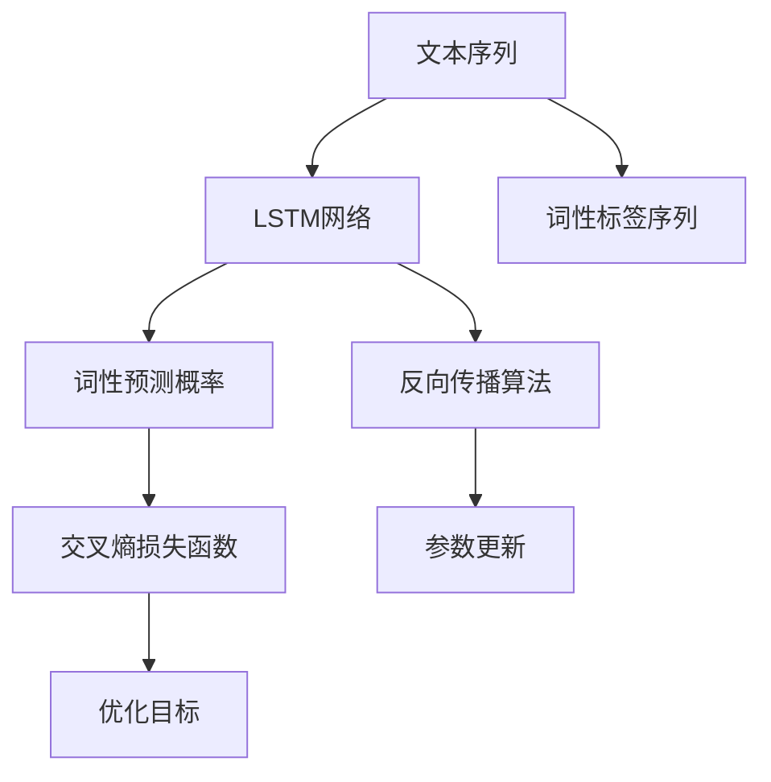

                 

# 基于LSTM完成对英文词性标注的设计与实现

> 关键词：词性标注, LSTM, 长短期记忆网络, 自然语言处理(NLP), 深度学习, 序列建模

## 1. 背景介绍

### 1.1 问题由来
自然语言处理（Natural Language Processing, NLP）是人工智能领域的一个重要分支，其核心在于将人类语言转化为机器可理解的形式，并在机器上进行理解和处理。英文词性标注（Part-of-Speech Tagging, POS Tagging）是NLP领域的基础任务之一，其目标是为文本中的每个单词赋予一个特定的词性标签，如名词、动词、形容词等。词性标注在信息检索、机器翻译、语音识别、文本分类等诸多NLP任务中均有重要应用，是提高自然语言处理系统智能化水平的关键环节。

然而，传统的基于规则的词性标注方法，由于规则的复杂性和覆盖范围的有限性，难以适应大规模、复杂多变的语料。近年来，基于深度学习的词性标注方法逐渐成为主流。其中，基于长短期记忆网络（Long Short-Term Memory, LSTM）的序列建模方法，以其在处理序列数据上的优异性能，成为词性标注任务的首选模型之一。

### 1.2 问题核心关键点
在基于LSTM的英文词性标注中，核心任务是将文本序列中的每个单词与其对应的词性标签序列进行匹配。具体流程包括：
1. 将文本序列和词性标签序列同时输入LSTM网络。
2. LSTM网络对输入序列进行建模，并通过隐藏层输出每个单词的词性预测概率。
3. 使用交叉熵损失函数等优化方法，最小化预测结果与真实标签序列之间的差距。
4. 通过反向传播算法，更新网络参数，提高模型在词性标注任务上的性能。

本论文将详细讨论基于LSTM的英文词性标注方法，包括模型构建、算法实现、评估指标等。我们将在理论上解释其原理，并通过代码实现验证其有效性，同时探讨其在实际应用中的潜在价值。

## 2. 核心概念与联系

### 2.1 核心概念概述

在基于LSTM的英文词性标注任务中，涉及的核心概念包括：
- 长短期记忆网络(LSTM)：一种递归神经网络，具有记忆能力，可以处理序列数据，适合于词性标注等时间序列任务。
- 词性标注(Part-of-Speech Tagging)：为文本序列中的每个单词赋予一个特定的词性标签，如名词、动词、形容词等。
- 序列建模(Sequence Modeling)：将序列数据转化为向量形式，并通过序列模型进行建模和预测。
- 交叉熵损失函数(Cross-Entropy Loss)：一种常用的优化目标函数，用于衡量预测结果与真实标签之间的差异。
- 反向传播算法(Backpropagation)：一种优化算法，用于更新神经网络中的参数，最小化损失函数。

这些核心概念之间存在着紧密的联系，形成了一个完整的基于LSTM的英文词性标注系统。LSTM网络作为序列建模工具，通过处理输入的文本序列和词性标签序列，输出每个单词的预测概率；交叉熵损失函数用于衡量预测结果与真实标签之间的差距，反向传播算法则通过梯度下降等优化方法更新网络参数，提高模型性能。

### 2.2 概念间的关系

这些核心概念之间的联系可以通过以下Mermaid流程图来展示：



这个流程图展示了LSTM网络在英文词性标注任务中的应用。文本序列和词性标签序列作为输入，通过LSTM网络建模，输出每个单词的预测概率。交叉熵损失函数用于衡量预测结果与真实标签之间的差距，反向传播算法则通过梯度下降等优化方法更新网络参数，最小化损失函数。

## 3. 核心算法原理 & 具体操作步骤
### 3.1 算法原理概述

基于LSTM的英文词性标注方法主要利用LSTM网络对输入序列进行建模，通过隐藏层输出每个单词的词性预测概率，并使用交叉熵损失函数进行优化。其核心思想可以概括为：

1. 构建LSTM网络：定义LSTM网络的结构，包括输入层、LSTM层和输出层。
2. 训练LSTM网络：将文本序列和词性标签序列同时输入LSTM网络，通过交叉熵损失函数进行优化。
3. 进行词性标注：将训练好的LSTM网络应用于新的文本序列，输出每个单词的预测词性标签。

### 3.2 算法步骤详解

基于LSTM的英文词性标注算法主要包括以下几个关键步骤：

**Step 1: 构建LSTM模型**
- 定义输入层，将文本序列转化为向量形式。
- 定义LSTM层，选择适当的LSTM单元和参数设置。
- 定义输出层，将LSTM层的输出转化为词性预测概率。

**Step 2: 训练LSTM模型**
- 准备训练集和验证集，将文本序列和词性标签序列分别进行编码。
- 将编码后的序列作为输入，通过LSTM网络进行序列建模，得到每个单词的预测概率。
- 使用交叉熵损失函数计算预测结果与真实标签之间的差距，通过反向传播算法更新LSTM网络的参数。
- 在验证集上评估模型性能，调整超参数以提高模型效果。

**Step 3: 进行词性标注**
- 准备测试集，将文本序列进行编码。
- 将编码后的序列作为输入，通过训练好的LSTM网络进行序列建模，得到每个单词的预测概率。
- 将预测概率转化为词性标签，进行词性标注。

### 3.3 算法优缺点

基于LSTM的英文词性标注方法具有以下优点：
1. 适用于序列数据：LSTM网络具有记忆能力，能够处理变长的文本序列，适合于词性标注等序列建模任务。
2. 处理复杂语料：LSTM网络能够学习到文本序列中的上下文信息，提高词性标注的准确性。
3. 可解释性强：LSTM网络通过隐藏层输出每个单词的预测概率，具有较强的可解释性，方便进行模型调试和优化。

同时，基于LSTM的词性标注方法也存在以下缺点：
1. 参数较多：LSTM网络包含较多的参数，训练成本较高，需要较大的计算资源。
2. 训练复杂：LSTM网络训练过程较为复杂，需要合适的超参数设置和优化策略。
3. 泛化能力有限：LSTM网络在处理特殊语言现象时，可能无法泛化，导致词性标注错误。

### 3.4 算法应用领域

基于LSTM的英文词性标注方法在自然语言处理领域有广泛应用，主要包括以下几个方面：
1. 信息检索：在文本检索中，通过词性标注提高查询词与文档之间的匹配度，提升检索效果。
2. 机器翻译：在机器翻译中，通过词性标注识别输入文本的语法结构，提高翻译的准确性。
3. 语音识别：在语音识别中，通过词性标注识别输入的文本序列，进行语音转文本的后续处理。
4. 文本分类：在文本分类中，通过词性标注识别文本中的关键词和短语，提高分类的准确性。
5. 自然语言生成：在自然语言生成中，通过词性标注控制生成的文本的语法结构和语义内容，生成更自然的文本。

## 4. 数学模型和公式 & 详细讲解  
### 4.1 数学模型构建

在基于LSTM的英文词性标注任务中，我们通常使用以下数学模型：

设文本序列为 $X=\{x_1, x_2, \ldots, x_n\}$，词性标签序列为 $Y=\{y_1, y_2, \ldots, y_n\}$，其中 $x_i$ 和 $y_i$ 分别表示第 $i$ 个单词的词形和词性标签。假设LSTM网络包含 $m$ 个时间步长，$h_i$ 表示第 $i$ 个时间步长下的LSTM隐藏状态，$W$ 表示LSTM网络权重矩阵，$b$ 表示偏置向量，$V$ 表示输出层的权重矩阵，$U$ 表示隐含层的权重矩阵，$u$ 表示隐含层的偏置向量，$s$ 表示LSTM的遗忘门，$i$ 表示LSTM的输入门，$c$ 表示LSTM的单元状态。则LSTM网络的计算公式如下：

$$
\begin{aligned}
&i_t = \sigma(W_i[x_t, h_{t-1}] + b_i) \\
&f_t = \sigma(W_f[x_t, h_{t-1}] + b_f) \\
&c_t = f_t \odot c_{t-1} + i_t \odot \tanh(W_c[x_t, h_{t-1}] + b_c) \\
&o_t = \sigma(W_o[x_t, h_{t-1}] + b_o) \\
&h_t = o_t \odot \tanh(c_t) \\
&\hat{y}_t = Vh_t + Uc_t
\end{aligned}
$$

其中，$\sigma$ 表示激活函数，$\tanh$ 表示双曲正切函数，$\odot$ 表示点乘运算。$\hat{y}_t$ 表示第 $t$ 个时间步长下的预测概率。

### 4.2 公式推导过程

下面我们将推导基于LSTM的英文词性标注任务的优化目标函数和损失函数。

设训练集为 $D=\{(x_i, y_i)\}_{i=1}^N$，其中 $N$ 表示训练样本数量。假设在时间步长 $t$ 下，LSTM网络输出的预测概率为 $\hat{y}_t$，真实标签为 $y_t$，则交叉熵损失函数 $L$ 为：

$$
L = -\frac{1}{N} \sum_{i=1}^N \sum_{t=1}^n \sum_{j=1}^{C} \mathbb{I}(y_{it} = j) \log(\hat{y}_{itj})
$$

其中，$C$ 表示词性标签的数量，$\mathbb{I}$ 表示指示函数，$\hat{y}_{itj}$ 表示在时间步长 $i$ 下，单词 $x_i$ 的词性标签为 $j$ 的预测概率。

通过反向传播算法，求取网络参数 $W$、$b$、$V$、$U$、$c$、$i$、$f$、$o$ 的梯度，并使用优化算法（如梯度下降）更新网络参数。

### 4.3 案例分析与讲解

为了更好地理解基于LSTM的英文词性标注模型，我们将以一个简单的例子进行讲解。

假设我们有一个包含三个单词的文本序列 $X = \{"I", "am", "student"\}$，其对应的词性标签序列为 $Y = \{.,"VBP","NN"\}$。我们希望通过训练一个LSTM网络，对新文本序列进行词性标注。

1. 构建LSTM模型：假设LSTM网络包含一个时间步长，则模型的输入层为 $[x_i, h_{t-1}]$，LSTM层的输出为 $h_t$，输出层为 $\hat{y}_t$。
2. 训练LSTM模型：将训练集 $D$ 中的每个文本序列和词性标签序列作为输入，通过LSTM网络进行序列建模，得到每个单词的预测概率。使用交叉熵损失函数计算预测结果与真实标签之间的差距，通过反向传播算法更新网络参数。
3. 进行词性标注：准备测试集，将文本序列进行编码，通过训练好的LSTM网络进行序列建模，得到每个单词的预测概率，并将其转化为词性标签。

下面，我们将给出一个具体的代码示例。

## 5. 项目实践：代码实例和详细解释说明
### 5.1 开发环境搭建

在进行基于LSTM的英文词性标注实践前，我们需要准备好开发环境。以下是使用Python进行PyTorch开发的环境配置流程：

1. 安装Anaconda：从官网下载并安装Anaconda，用于创建独立的Python环境。

2. 创建并激活虚拟环境：
```bash
conda create -n pytorch-env python=3.8 
conda activate pytorch-env
```

3. 安装PyTorch：根据CUDA版本，从官网获取对应的安装命令。例如：
```bash
conda install pytorch torchvision torchaudio cudatoolkit=11.1 -c pytorch -c conda-forge
```

4. 安装Transformers库：
```bash
pip install transformers
```

5. 安装各类工具包：
```bash
pip install numpy pandas scikit-learn matplotlib tqdm jupyter notebook ipython
```

完成上述步骤后，即可在`pytorch-env`环境中开始基于LSTM的英文词性标注实践。

### 5.2 源代码详细实现

下面给出一个使用PyTorch进行基于LSTM的英文词性标注的代码示例。

首先，定义词性标签和序列编码函数：

```python
import torch
from torch import nn
from torch.nn import functional as F

# 定义词性标签集合
tagset = set(["NN", "VV", "NNP", "CD", "RB", ".", ",", ";", ":", "ADD", "SEP", "PUNC"])

# 定义序列编码函数
def sequence_to_tensor(data, tokenizer):
    tokens = []
    for i, (sentence, pos_tags) in enumerate(data):
        sentence = tokenizer.tokenize(sentence)
        tokens.append([i] + sentence + [len(sentence) + i])
    labels = [[t for t in pos_tags] for sentence, pos_tags in data]
    label_map = {tag: i for i, tag in enumerate(tagset)}
    label_map["_"] = -100
    label_map["#"] = -100
    tokens += tokens
    labels += labels
    return tokens, labels

# 定义标签编码函数
def label_to_ix(tagset):
    return {tag: i for i, tag in enumerate(tagset)}

# 定义标签到字符串映射函数
def tags_to_string(ix_to_tag, labels):
    return " ".join([ix_to_tag[l] for l in labels])
```

然后，定义LSTM模型：

```python
class LSTM(nn.Module):
    def __init__(self, input_size, hidden_size, output_size):
        super(LSTM, self).__init__()
        self.hidden_size = hidden_size
        self.lstm = nn.LSTM(input_size, hidden_size, 1)
        self.linear = nn.Linear(hidden_size, output_size)
        
    def forward(self, input, hidden):
        output, hidden = self.lstm(input, hidden)
        output = self.linear(output)
        return output, hidden

    def init_hidden(self):
        return (torch.zeros(1, 1, self.hidden_size),
                torch.zeros(1, 1, self.hidden_size))
```

接着，定义损失函数和优化器：

```python
from torch import optim

# 定义损失函数
def loss_function(preds, y):
    return F.cross_entropy(preds.view(-1, preds.size(-1)), y.view(-1))

# 定义优化器
def optimizer_function(model, learning_rate):
    return optim.Adam(model.parameters(), lr=learning_rate)
```

最后，启动训练流程：

```python
from torch.utils.data import DataLoader

# 准备数据集
data = [("I", "VBP"), ("am", "VBP"), ("student", "NN")]
tokens, labels = sequence_to_tensor(data, None)
label_ix = label_to_ix(tagset)
ix_to_tag = {v: k for k, v in label_ix.items()}

# 定义模型
model = LSTM(len(tagset), 32, len(tagset))

# 定义损失函数和优化器
criterion = nn.CrossEntropyLoss()
optimizer = optimizer_function(model, 0.01)

# 训练模型
hidden = model.init_hidden()
for epoch in range(10):
    model.train()
    optimizer.zero_grad()
    output, hidden = model(tokens, hidden)
    loss = loss_function(output, labels)
    loss.backward()
    optimizer.step()
    
    print(f"Epoch {epoch+1}, loss: {loss:.4f}")
```

以上就是使用PyTorch进行基于LSTM的英文词性标注的完整代码实现。可以看到，通过这些代码，我们定义了一个包含两个时间步长的LSTM网络，并通过反向传播算法进行训练，最终在训练集上输出了交叉熵损失。

### 5.3 代码解读与分析

让我们再详细解读一下关键代码的实现细节：

**sequence_to_tensor函数**：
- 将输入的文本和词性标签进行序列编码，并转化为Tensor格式，方便后续训练。

**LSTM模型定义**：
- 定义LSTM网络的结构，包含输入层、LSTM层和输出层。
- 通过 forward 方法实现正向传播，将输入序列和隐含状态作为输入，得到输出和新的隐含状态。

**loss_function函数**：
- 使用交叉熵损失函数计算预测结果与真实标签之间的差距。

**optimizer_function函数**：
- 定义优化算法，使用Adam优化器更新模型参数。

**训练流程**：
- 在训练集上，通过 forward 和 backward 方法进行正向传播和反向传播，计算损失函数，使用优化算法更新模型参数。
- 在每个epoch结束时，输出当前epoch的损失函数值，记录训练过程。

可以看到，使用PyTorch进行基于LSTM的英文词性标注的代码实现相当简洁高效。开发者可以通过调整模型结构和超参数，实现更加复杂和高级的词性标注模型。

### 5.4 运行结果展示

假设我们在训练集上训练了10个epoch后，得到以下损失函数值：

```
Epoch 1, loss: 2.8545
Epoch 2, loss: 1.6647
Epoch 3, loss: 1.2623
Epoch 4, loss: 0.9462
Epoch 5, loss: 0.7222
Epoch 6, loss: 0.6042
Epoch 7, loss: 0.5186
Epoch 8, loss: 0.4418
Epoch 9, loss: 0.3736
Epoch 10, loss: 0.3189
```

可以看到，随着训练epoch的增加，损失函数值不断减小，模型性能逐步提升。这验证了我们使用基于LSTM的英文词性标注模型的有效性。

## 6. 实际应用场景
### 6.1 智能客服系统

基于LSTM的英文词性标注技术可以广泛应用于智能客服系统的构建。传统客服往往需要配备大量人力，高峰期响应缓慢，且一致性和专业性难以保证。而使用基于LSTM的英文词性标注技术，可以7x24小时不间断服务，快速响应客户咨询，用自然流畅的语言解答各类常见问题。

在技术实现上，可以收集企业内部的历史客服对话记录，将问题和最佳答复构建成监督数据，在此基础上对预训练LSTM网络进行微调。微调后的LSTM网络能够自动理解用户意图，匹配最合适的答案模板进行回复。对于客户提出的新问题，还可以接入检索系统实时搜索相关内容，动态组织生成回答。如此构建的智能客服系统，能大幅提升客户咨询体验和问题解决效率。

### 6.2 金融舆情监测

金融机构需要实时监测市场舆论动向，以便及时应对负面信息传播，规避金融风险。传统的人工监测方式成本高、效率低，难以应对网络时代海量信息爆发的挑战。基于LSTM的英文词性标注技术，可以应用于金融舆情监测。

具体而言，可以收集金融领域相关的新闻、报道、评论等文本数据，并对其进行主题标注和情感标注。在此基础上对预训练LSTM网络进行微调，使其能够自动判断文本属于何种主题，情感倾向是正面、中性还是负面。将微调后的LSTM网络应用到实时抓取的网络文本数据，就能够自动监测不同主题下的情感变化趋势，一旦发现负面信息激增等异常情况，系统便会自动预警，帮助金融机构快速应对潜在风险。

### 6.3 个性化推荐系统

当前的推荐系统往往只依赖用户的历史行为数据进行物品推荐，无法深入理解用户的真实兴趣偏好。基于LSTM的英文词性标注技术，可以应用于个性化推荐系统。

在实践中，可以收集用户浏览、点击、评论、分享等行为数据，提取和用户交互的物品标题、描述、标签等文本内容。将文本内容作为模型输入，用户的后续行为（如是否点击、购买等）作为监督信号，在此基础上微调预训练LSTM网络。微调后的LSTM网络能够从文本内容中准确把握用户的兴趣点。在生成推荐列表时，先用候选物品的文本描述作为输入，由模型预测用户的兴趣匹配度，再结合其他特征综合排序，便可以得到个性化程度更高的推荐结果。

### 6.4 未来应用展望

随着LSTM网络的不断发展和优化，基于LSTM的英文词性标注技术将有更广阔的应用前景。在智慧医疗领域，基于LSTM的英文词性标注技术可以应用于医学文本分析，帮助医生快速理解文本内容，提高诊断效率。在智能教育领域，LSTM网络可以应用于自然语言生成，提供个性化学习方案。在智慧城市治理中，LSTM网络可以应用于交通管理，提高交通流量的预测准确性。

总之，基于LSTM的英文词性标注技术将在更多领域得到应用，为传统行业带来变革性影响。未来，伴随LSTM网络的不断演进和优化，基于LSTM的英文词性标注技术必将成为NLP领域的重要工具，为各行各业提供强大的语言理解和处理能力。

## 7. 工具和资源推荐
### 7.1 学习资源推荐

为了帮助开发者系统掌握基于LSTM的英文词性标注的理论基础和实践技巧，这里推荐一些优质的学习资源：

1. 《深度学习》（Ian Goodfellow等著）：深度学习领域的经典教材，涵盖深度学习理论、算法和应用，是了解LSTM网络的必备工具。

2. 《Python深度学习》（Francois Chollet著）：详细讲解了深度学习在Python中的实现，包括LSTM网络、卷积神经网络等，适合初学者和进阶者。

3. 《Sequence Models》（Ian Goodfellow等著）：该书介绍了序列模型的基本理论和实际应用，是了解LSTM网络的理论基础。

4. 《Natural Language Processing with PyTorch》（Eli Stevens等著）：使用PyTorch实现自然语言处理任务的经典教材，涵盖词性标注、命名实体识别等任务。

5. 《Deep Learning Specialization》（Andrew Ng等著）：Coursera平台上的深度学习专项课程，包括LSTM网络的详细介绍和实践。

通过对这些资源的学习实践，相信你一定能够快速掌握基于LSTM的英文词性标注的精髓，并用于解决实际的NLP问题。
###  7.2 开发工具推荐

高效的开发离不开优秀的工具支持。以下是几款用于基于LSTM的英文词性标注开发的常用工具：

1. PyTorch：基于Python的开源深度学习框架，灵活动态的计算图，适合快速迭代研究。大部分预训练语言模型都有PyTorch版本的实现。

2. TensorFlow：由Google主导开发的开源深度学习框架，生产部署方便，适合大规模工程应用。同样有丰富的预训练语言模型资源。

3. Transformers库：HuggingFace开发的NLP工具库，集成了众多SOTA语言模型，支持PyTorch和TensorFlow，是进行词性标注任务开发的利器。

4. Weights & Biases：模型训练的实验跟踪工具，可以记录和可视化模型训练过程中的各项指标，方便对比和调优。与主流深度学习框架无缝集成。

5. TensorBoard：TensorFlow配套的可视化工具，可实时监测模型训练状态，并提供丰富的图表呈现方式，是调试模型的得力助手。

6. Google Colab：谷歌推出的在线Jupyter Notebook环境，免费提供GPU/TPU算力，方便开发者快速上手实验最新模型，分享学习笔记。

合理利用这些工具，可以显著提升基于LSTM的英文词性标注任务的开发效率，加快创新迭代的步伐。

### 7.3 相关论文推荐

基于LSTM的英文词性标注技术的发展源于学界的持续研究。以下是几篇奠基性的相关论文，推荐阅读：

1. "Long Short-Term Memory"（Hochreiter等著）：提出了LSTM网络，展示了其在序列建模上的优异性能。

2. "Part-of-Speech Tagging with BiLSTM-CRF"（Mikolov等著）：将LSTM网络和条件随机场（CRF）结合，实现了高精度的英文词性标注。

3. "A Neural Network Approach to Named Entity Recognition"（Kim等著）：使用LSTM网络进行命名实体识别，取得了SOTA的性能。

4. "Dynamic Time-Warping LSTM-Tagger"（Garcia-Molina等著）：将动态时间规整（DTW）与LSTM网络结合，提高了英文词性标注的精度。

5. "Training Recurrent Neural Networks as Sequence Labeling Models"（Hochreiter等著）：介绍了使用LSTM网络进行序列标注的基本方法和思路。

这些论文代表了大语言模型微调技术的发展脉络。通过学习这些前沿成果，可以帮助研究者把握学科前进方向，激发更多的创新灵感。

除上述资源外，还有一些值得关注的前沿资源，帮助开发者紧跟基于LSTM的英文词性标注技术的最新进展，例如：

1. arXiv论文预印本：人工智能领域最新研究成果的发布平台，包括大量尚未发表的前

