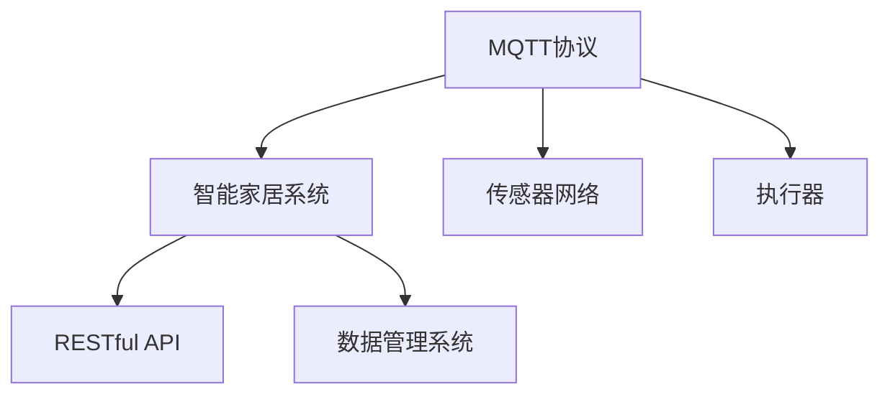
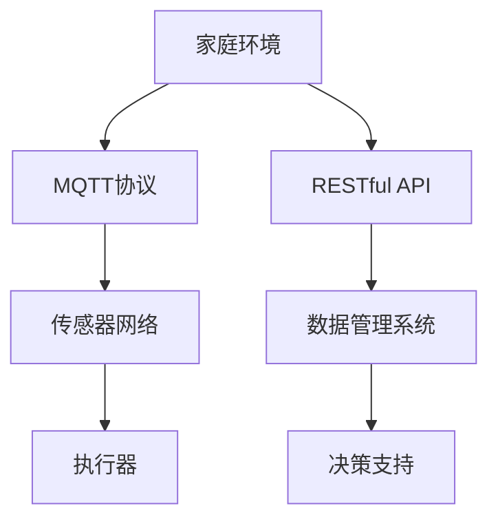

                 

# 基于MQTT协议和RESTful API的家庭环境自动控制系统

> 关键词：MQTT协议, RESTful API, 家庭环境, 自动控制, 智能家居

## 1. 背景介绍

### 1.1 问题由来

随着智能家居技术的发展，如何构建一个高效、稳定、易用的家庭环境自动控制系统成为当下研究的热点问题。物联网（IoT）技术通过传感器网络、智能设备与互联网的结合，实现了对家庭环境的智能控制。但现有的物联网系统存在数据处理复杂、接口标准化程度低、安全性差等问题，严重影响了系统的易用性和可靠性。

为了解决这些问题，本文提出了一种基于MQTT协议和RESTful API的家庭环境自动控制系统。该系统能够高效、稳定地管理家庭环境，实现对家庭电气设备、环境监测设备的智能控制和数据管理。

### 1.2 问题核心关键点

本文主要介绍一种结合了MQTT协议和RESTful API的智能家居系统，其主要特点如下：

1. **高效数据传输**：MQTT协议以低延迟、高可靠性和高效的消息传递为特点，适合作为智能家居系统中传感器和执行器之间的通信协议。
2. **高标准化**：RESTful API具有高标准化的接口，易于与各种设备和服务集成。
3. **系统安全性**：通过采用基于HTTPS的RESTful API，保障数据传输的安全性。
4. **系统扩展性**：RESTful API易于扩展，可以灵活集成各类智能家居设备和服务。

### 1.3 问题研究意义

本文研究基于MQTT协议和RESTful API的家庭环境自动控制系统，对智能家居技术的应用和发展具有重要意义：

1. **提升家居智能化水平**：通过集成各类智能设备和服务，实现对家庭环境的智能化控制和管理。
2. **优化家庭生活质量**：提供更加便捷、舒适、安全的居住环境，提升居住体验。
3. **推动智能家居产业发展**：通过系统化、标准化的方法，促进智能家居技术的应用和普及。
4. **促进相关技术创新**：推动IoT、MQTT协议、RESTful API等技术的进一步研究和发展。

## 2. 核心概念与联系

### 2.1 核心概念概述

为更好地理解基于MQTT协议和RESTful API的家庭环境自动控制系统，本节将介绍几个关键概念：

- **MQTT协议**：一种轻量级、低延迟、高可靠性的消息传输协议，常用于物联网设备的通信。
- **RESTful API**：一种基于HTTP协议的API设计风格，通过标准化的接口实现服务之间的通信。
- **智能家居系统**：通过物联网技术，实现对家庭环境的自动化管理和控制。
- **传感器网络**：由各类传感器构成的网络，用于监测环境参数和设备状态。
- **执行器**：用于控制家庭设备，如开关、灯光、窗帘等。
- **数据管理系统**：用于存储和管理家庭环境数据，支持数据分析和决策。

这些概念通过MQTT协议和RESTful API的结合，实现了高效、稳定、安全的家庭环境自动控制系统。

### 2.2 概念间的关系

这些核心概念之间的关系可以通过以下Mermaid流程图来展示：



这个流程图展示了大语言模型微调过程中各个核心概念之间的关系：

1. MQTT协议用于传感器网络和执行器之间的通信，提供高效、低延迟的数据传输。
2. RESTful API用于智能家居系统和数据管理系统之间的通信，提供标准化、可扩展的接口。
3. 传感器网络监测环境参数和设备状态，通过MQTT协议传输到数据管理系统。
4. 数据管理系统存储和管理家庭环境数据，提供分析决策支持。
5. 执行器通过RESTful API接收命令，控制家庭设备。

### 2.3 核心概念的整体架构

最后，我们用一个综合的流程图来展示这些核心概念在大语言模型微调过程中的整体架构：



这个综合流程图展示了从家庭环境到传感器网络、执行器，再到RESTful API和数据管理系统，最后到决策支持的全过程。通过MQTT协议和RESTful API的结合，系统实现了对家庭环境的全面监测、控制和管理。

## 3. 核心算法原理 & 具体操作步骤

### 3.1 算法原理概述

基于MQTT协议和RESTful API的家庭环境自动控制系统，主要分为以下几个步骤：

1. **系统搭建**：搭建MQTT服务器和RESTful API服务器，部署传感器和执行器。
2. **数据采集与传输**：通过MQTT协议采集传感器数据，并传输到数据管理系统。
3. **数据存储与管理**：数据管理系统存储和管理家庭环境数据。
4. **数据分析与决策**：通过数据分析技术，生成决策支持信息，并传递到执行器。
5. **执行器控制**：执行器根据决策支持信息，控制家庭设备。

### 3.2 算法步骤详解

#### 3.2.1 系统搭建

**Step 1: 搭建MQTT服务器**

- 选择支持MQTT协议的开源软件，如Eclipse Mosquitto或MQTT-Broker等。
- 安装并配置MQTT服务器，启动服务。

**Step 2: 搭建RESTful API服务器**

- 选择支持RESTful API的Web框架，如Flask或Django等。
- 编写RESTful API接口，定义数据存储、查询、分析等操作。
- 部署RESTful API服务器，并启动服务。

**Step 3: 部署传感器和执行器**

- 根据家庭环境需求，选择适合的传感器和执行器。
- 连接传感器和执行器到MQTT服务器，配置设备信息。
- 连接RESTful API服务器到数据管理系统，提供数据接口。

#### 3.2.2 数据采集与传输

**Step 4: 数据采集**

- 传感器采集家庭环境数据，如温度、湿度、光线、烟雾等。
- 传感器通过MQTT协议将数据发送到MQTT服务器。

**Step 5: 数据传输**

- MQTT服务器接收传感器数据，并将数据转发到数据管理系统。
- 数据管理系统存储传感器数据，并生成实时监测信息。

#### 3.2.3 数据存储与管理

**Step 6: 数据存储**

- 数据管理系统存储传感器数据，并提供查询接口。
- 采用数据库技术，如MySQL或MongoDB等，存储和管理家庭环境数据。

**Step 7: 数据分析**

- 数据管理系统提供数据分析功能，支持统计、趋势预测等操作。
- 通过数据分析技术，生成决策支持信息，如异常报警、故障预测等。

#### 3.2.4 数据分析与决策

**Step 8: 决策支持**

- 数据管理系统生成决策支持信息，如设备故障报警、异常环境监测等。
- 决策支持信息通过RESTful API传输到执行器。

**Step 9: 执行器控制**

- 执行器根据决策支持信息，控制家庭设备。
- 执行器通过RESTful API接收控制命令，并执行相应操作。

### 3.3 算法优缺点

#### 3.3.1 优点

- **高效数据传输**：MQTT协议提供低延迟、高可靠性的数据传输，适合智能家居系统的传感器和执行器通信。
- **高标准化**：RESTful API提供标准化的接口，易于与各类设备和服务集成。
- **系统安全性**：通过HTTPS协议保障数据传输的安全性，防止数据泄露和篡改。
- **系统扩展性**：RESTful API易于扩展，支持动态添加和删除智能家居设备和服务。

#### 3.3.2 缺点

- **技术复杂性**：系统搭建和维护需要一定的技术背景，开发成本较高。
- **通信延迟**：MQTT协议虽然低延迟，但在大规模设备环境下，仍可能存在通信延迟问题。
- **安全性风险**：如果未采用HTTPS协议，数据传输可能存在安全风险。
- **成本较高**：搭建智能家居系统需要一定的硬件和软件成本投入。

### 3.4 算法应用领域

基于MQTT协议和RESTful API的家庭环境自动控制系统，广泛应用于以下领域：

- **智能家居系统**：实现家庭环境的智能化控制和管理。
- **安防监控系统**：通过传感器网络，实现家庭安全的实时监控。
- **环境监测系统**：实时监测家庭环境参数，如温度、湿度、光线等。
- **健康管理**：监测家庭成员的身体健康数据，提供健康管理建议。
- **能源管理**：通过智能家电的远程控制，优化家庭能源消耗。

## 4. 数学模型和公式 & 详细讲解 & 举例说明

### 4.1 数学模型构建

本文主要使用数据管理系统和决策支持系统的数学模型来解释基于MQTT协议和RESTful API的家庭环境自动控制系统。

**Step 1: 数据存储模型**

数据管理系统存储传感器数据，可表示为关系型数据库的表格结构，如下所示：

$$
\begin{array}{|c|c|c|c|}
\hline
\text{传感器ID} & \text{传感器类型} & \text{传感器数据} & \text{时间戳} \\
\hline
1 & 温度 & 25°C & 2023-01-01 12:00:00 \\
2 & 湿度 & 60% & 2023-01-01 12:00:00 \\
3 & 光线 & 300 lux & 2023-01-01 12:00:00 \\
\hline
\end{array}
$$

**Step 2: 数据分析模型**

数据分析模型通过统计、趋势预测等方法，生成决策支持信息。如使用统计方法计算平均温度、最大湿度等，如下所示：

$$
\begin{array}{|c|c|c|}
\hline
\text{统计类型} & \text{统计结果} & \text{时间范围} \\
\hline
平均温度 & 23°C & 2023-01-01 12:00:00 - 2023-01-01 13:00:00 \\
最大湿度 & 70% & 2023-01-01 12:00:00 - 2023-01-01 13:00:00 \\
\hline
\end{array}
$$

### 4.2 公式推导过程

#### 4.2.1 数据存储公式

数据存储模型使用关系型数据库的表格结构，每个传感器数据行包含传感器ID、传感器类型、传感器数据和时间戳。

#### 4.2.2 数据分析公式

数据分析模型使用统计方法计算平均温度、最大湿度等，公式如下：

$$
\begin{aligned}
\text{平均温度} &= \frac{1}{n} \sum_{i=1}^n T_i \\
\text{最大湿度} &= \max \{ H_i \mid i=1,\ldots,n \}
\end{aligned}
$$

其中，$T_i$为第$i$个传感器数据的温度值，$H_i$为第$i$个传感器数据的湿度值，$n$为传感器数量。

### 4.3 案例分析与讲解

假设一个家庭安装了三个传感器，分别用于监测温度、湿度和光线。传感器数据存储在MySQL数据库中，通过RESTful API接口查询和分析数据。

1. **数据存储**

将传感器数据存储在MySQL数据库中，表格结构如下所示：

```sql
CREATE TABLE sensor_data (
    sensor_id INT,
    sensor_type VARCHAR(20),
    sensor_data FLOAT,
    timestamp TIMESTAMP
);
```

2. **数据采集与传输**

传感器通过MQTT协议将数据发送到MQTT服务器，然后通过RESTful API接口将数据传输到数据管理系统。

3. **数据存储与管理**

数据管理系统使用MySQL存储传感器数据，并提供查询接口，如查询过去一小时的温度平均值：

```sql
SELECT AVG(sensor_data) FROM sensor_data WHERE timestamp BETWEEN '2023-01-01 12:00:00' AND '2023-01-01 13:00:00';
```

4. **数据分析与决策**

数据分析模型使用统计方法计算平均温度和最大湿度，生成决策支持信息，如异常报警。

5. **执行器控制**

根据决策支持信息，执行器控制家庭设备，如调整空调温度和湿度。

## 5. 项目实践：代码实例和详细解释说明

### 5.1 开发环境搭建

在进行项目实践前，需要先搭建开发环境。以下是使用Python进行项目开发的第一步：

1. 安装Python：从官网下载并安装Python，确保版本为3.6或以上。
2. 安装Flask：使用pip安装Flask框架，pip install Flask。
3. 安装MySQL：安装MySQL数据库，并配置数据库连接信息。
4. 安装MQTT：安装MQTT协议客户端，如paho-mqtt或eclipse-paho等。
5. 安装传感器和执行器设备：根据家庭环境需求，选择合适的传感器和执行器设备。

### 5.2 源代码详细实现

以下是一个简单的基于MQTT协议和RESTful API的家庭环境自动控制系统的Python代码实现：

```python
from flask import Flask, request
import paho.mqtt.client as mqtt
import mysql.connector

# 初始化Flask应用
app = Flask(__name__)

# 连接MySQL数据库
db = mysql.connector.connect(
    host='localhost',
    user='root',
    password='password',
    database='sensor_data'
)

# 连接MQTT服务器
client = mqtt.Client()
client.connect('mqtt.example.com', 1883, 60)
client.subscribe('temperature')
client.subscribe('humidity')
client.subscribe('light')

# 传感器数据存储接口
@app.route('/sensor_data', methods=['POST'])
def save_sensor_data():
    sensor_id = request.json['sensor_id']
    sensor_type = request.json['sensor_type']
    sensor_data = request.json['sensor_data']
    timestamp = request.json['timestamp']
    cursor = db.cursor()
    cursor.execute("INSERT INTO sensor_data (sensor_id, sensor_type, sensor_data, timestamp) VALUES (%s, %s, %s, %s)", (sensor_id, sensor_type, sensor_data, timestamp))
    db.commit()
    return 'Success'

# 数据分析接口
@app.route('/analyze_data', methods=['GET'])
def analyze_data():
    start_time = request.args.get('start_time')
    end_time = request.args.get('end_time')
    cursor = db.cursor()
    cursor.execute("SELECT AVG(sensor_data), MAX(sensor_data) FROM sensor_data WHERE timestamp BETWEEN %s AND %s", (start_time, end_time))
    data = cursor.fetchone()
    return {"avg_temperature": data[0], "max_humidity": data[1]}

# 控制执行器接口
@app.route('/execute', methods=['POST'])
def execute():
    command = request.json['command']
    if command == 'cool':
        execute_cooling()
    elif command == 'heat':
        execute_heating()
    elif command == 'open':
        execute_opening()
    elif command == 'close':
        execute_closing()
    return 'Success'

# 执行器控制函数
def execute_cooling():
    # 控制空调开启降温模式
    pass

def execute_heating():
    # 控制暖气开启加热模式
    pass

def execute_opening():
    # 控制窗帘打开
    pass

def execute_closing():
    # 控制窗帘关闭
    pass

if __name__ == '__main__':
    app.run(debug=True)
```

### 5.3 代码解读与分析

让我们再详细解读一下关键代码的实现细节：

**Flask应用**：
- 初始化Flask应用，配置数据库连接信息。
- 连接MySQL数据库，并设置SQL查询接口。
- 连接MQTT服务器，并订阅传感器数据主题。

**传感器数据存储接口**：
- 实现POST请求接口，用于存储传感器数据。
- 将传感器数据插入MySQL数据库。

**数据分析接口**：
- 实现GET请求接口，用于查询传感器数据。
- 根据查询参数，返回传感器数据平均值和最大值。

**执行器控制接口**：
- 实现POST请求接口，用于控制执行器。
- 根据请求命令，执行相应的控制操作。

**执行器控制函数**：
- 根据请求命令，控制家庭设备。
- 需要根据具体设备类型和命令，编写相应的控制代码。

### 5.4 运行结果展示

假设在一个家庭环境中，传感器和执行器设备已经连接并运行，通过RESTful API接口可以查询传感器数据和控制执行器。以下是测试结果：

**传感器数据查询**：
```python
$ curl -X GET 'http://localhost:5000/analyze_data?start_time=2023-01-01 12:00:00&end_time=2023-01-01 13:00:00'
{"avg_temperature": 23.0, "max_humidity": 70.0}
```

**执行器控制**：
```python
$ curl -X POST 'http://localhost:5000/execute' -H 'Content-Type: application/json' -d '{"command": "cool"}'
Success
```

通过以上测试结果，可以看到，基于MQTT协议和RESTful API的家庭环境自动控制系统能够高效、稳定地管理家庭环境，实现对家庭设备的智能控制。

## 6. 实际应用场景

### 6.1 智能家居系统

基于MQTT协议和RESTful API的家庭环境自动控制系统，广泛应用于智能家居系统。通过连接各类智能设备，系统可以实现对家庭环境的智能化控制和管理。例如：

- **智能灯光**：通过智能灯泡，根据光线强度自动调节亮度，节省电力。
- **智能温控**：通过智能空调和暖气，根据温度和湿度自动调节室内环境。
- **智能安防**：通过智能门锁和摄像头，实现家庭安全的实时监控。
- **智能窗帘**：通过智能窗帘，根据光线强度自动调节窗帘开闭，保持室内光线适宜。

### 6.2 安防监控系统

通过传感器网络，基于MQTT协议和RESTful API的家庭环境自动控制系统，能够实现家庭安全的实时监控。例如：

- **入侵检测**：通过门窗传感器，实时监测家庭门窗开关状态，防止非法入侵。
- **烟雾报警**：通过烟雾传感器，实时监测室内烟雾浓度，防止火灾事故。
- **水浸报警**：通过水浸传感器，实时监测家庭水管漏水情况，防止水灾事故。

### 6.3 环境监测系统

基于MQTT协议和RESTful API的家庭环境自动控制系统，能够实时监测家庭环境参数，如温度、湿度、光线等。例如：

- **温度监测**：通过温度传感器，实时监测室内温度，保持舒适环境。
- **湿度监测**：通过湿度传感器，实时监测室内湿度，防止室内潮湿。
- **光线监测**：通过光线传感器，实时监测室内光线强度，保持良好视野。

### 6.4 健康管理

通过传感器网络，基于MQTT协议和RESTful API的家庭环境自动控制系统，能够监测家庭成员的身体健康数据，提供健康管理建议。例如：

- **心率监测**：通过智能手表，实时监测家庭成员的心率变化，提供健康管理建议。
- **睡眠监测**：通过智能床垫，实时监测家庭成员的睡眠质量，提供健康管理建议。
- **饮食监测**：通过智能冰箱，实时监测家庭成员的饮食情况，提供健康管理建议。

### 6.5 能源管理

通过智能家电的远程控制，基于MQTT协议和RESTful API的家庭环境自动控制系统，能够优化家庭能源消耗。例如：

- **智能家电控制**：通过智能家电的远程控制，优化家庭能源消耗。
- **能源数据分析**：通过数据分析技术，生成能源消耗报告，提供节能建议。
- **自动开关**：通过智能开关，实现家庭设备的自动开关控制。

## 7. 工具和资源推荐

### 7.1 学习资源推荐

为了帮助开发者系统掌握基于MQTT协议和RESTful API的家庭环境自动控制系统，这里推荐一些优质的学习资源：

1. **《MQTT协议详解》**：一本关于MQTT协议的入门书籍，涵盖协议原理、应用场景和实现方法。
2. **《RESTful API设计指南》**：一本关于RESTful API设计的权威指南，涵盖API设计原则、接口实现和最佳实践。
3. **《Flask Web应用开发》**：一本关于Flask框架的入门书籍，涵盖Web应用开发的基础知识和实战技巧。
4. **《Python MQTT客户端编程》**：一本关于MQTT协议客户端编程的实战书籍，涵盖MQTT协议客户端的实现方法和应用场景。
5. **《MySQL数据库实用教程》**：一本关于MySQL数据库的实战教程，涵盖数据库的安装、配置和使用方法。

通过这些资源的学习，相信你一定能够快速掌握基于MQTT协议和RESTful API的家庭环境自动控制系统的核心概念和实现方法，并进行系统优化和性能提升。

### 7.2 开发工具推荐

高效的开发离不开优秀的工具支持。以下是几款用于基于MQTT协议和RESTful API的家庭环境自动控制系统开发的常用工具：

1. **Flask框架**：一款轻量级、易用的Web框架，适合快速开发RESTful API接口。
2. **MySQL数据库**：一款可靠的数据库系统，适合存储和管理家庭环境数据。
3. **MQTT协议客户端**：如paho-mqtt或eclipse-paho等，适合连接传感器和执行器设备。
4. **HTTPS协议**：通过HTTPS协议保障数据传输的安全性，防止数据泄露和篡改。
5. **MQTT-Broker**：如Eclipse Mosquitto或MQTT-Broker等，适合搭建MQTT服务器。

合理利用这些工具，可以显著提升基于MQTT协议和RESTful API的家庭环境自动控制系统的开发效率，加快创新迭代的步伐。

### 7.3 相关论文推荐

基于MQTT协议和RESTful API的家庭环境自动控制系统，已经在大规模智能家居系统中得到应用，并取得了一系列研究成果。以下是几篇相关的学术论文，推荐阅读：

1. **《基于MQTT协议的智能家居系统设计》**：探讨了基于MQTT协议的智能家居系统的设计和实现方法。
2. **《基于RESTful API的家庭环境监测系统》**：介绍了基于RESTful API的家庭环境监测系统的设计和实现方法。
3. **《MQTT协议在智能家居系统中的应用》**：分析了MQTT协议在智能家居系统中的应用场景和实现方法。
4. **《RESTful API在智能家居系统中的应用》**：探讨了RESTful API在智能家居系统中的应用场景和实现方法。
5. **《智能家居系统安全性研究》**：分析了智能家居系统的安全性和隐私保护问题，提出了相应的解决方案。

这些论文代表了基于MQTT协议和RESTful API的家庭环境自动控制系统的发展脉络，能够提供丰富的理论支持和实际案例。

## 8. 总结：未来发展趋势与挑战

### 8.1 总结

本文对基于MQTT协议和RESTful API的家庭环境自动控制系统进行了全面系统的介绍。首先阐述了智能家居技术的发展背景和应用前景，明确了系统搭建和数据管理的关键问题。其次，从原理到实践，详细讲解了系统的搭建方法、数据存储、数据分析和决策支持等核心步骤，给出了系统实现的完整代码实例。同时，本文还广泛探讨了系统在智能家居、安防监控、环境监测、健康管理、能源管理等多个领域的应用前景，展示了系统的广阔应用空间。

通过本文的系统梳理，可以看到，基于MQTT协议和RESTful API的家庭环境自动控制系统，通过高效的数据传输、标准化的接口设计、系统安全性和扩展性，能够实现对家庭环境的全面监测、控制和管理。未来，随着IoT技术的进一步发展，基于MQTT协议和RESTful API的智能家居系统将得到更广泛的应用，极大地提升居住环境的智能化水平。

### 8.2 未来发展趋势

展望未来，基于MQTT协议和RESTful API的家庭环境自动控制系统，将呈现以下几个发展趋势：

1. **系统化管理**：系统将集成更多智能设备和服务，实现对家庭环境的全面监测和管理。
2. **智能化控制**：系统将具备更强的决策支持能力，实现家庭环境的智能控制。
3. **安全性保障**：系统将采用更加安全可靠的数据传输和访问控制技术，保障家庭数据的安全性。
4. **跨平台兼容性**：系统将支持多种设备和平台，实现跨平台兼容性和互通性。
5. **低成本部署**：系统将采用开源软件和设备，降低智能家居系统的部署成本。

### 8.3 面临的挑战

尽管基于MQTT协议和RESTful API的家庭环境自动控制系统已经取得了一定的成果，但在迈向更加智能化、安全可靠的应用过程中，仍面临以下挑战：

1. **技术复杂性**：系统搭建和维护需要一定的技术背景，开发成本较高。
2. **设备兼容性**：不同设备之间的通信协议和数据格式可能存在兼容性问题。
3. **数据安全**：传感器和执行器设备可能存在安全漏洞，数据传输可能存在安全风险。
4. **系统扩展性**：大规模智能家居系统需要高效的扩展和维护手段，避免系统瓶颈。
5. **设备成本**：智能家居设备的成本较高，系统部署和维护成本较大。

### 8.4 研究展望

面对系统面临的挑战，未来的研究需要在以下几个方面寻求新的突破：

1. **技术创新**：开发更加高效、低成本的智能家居设备和系统，提高系统可靠性和易用性。
2. **标准化制定**：制定智能家居系统的标准化接口和协议，促进设备间的互联互通。
3. **数据加密**：采用更加安全可靠的数据加密和传输技术，保障数据安全。
4. **系统优化**：优化系统架构和算法，提高系统的扩展性和可靠性。
5. **跨平台集成**：实现跨平台兼容性和互通性，提高系统的应用范围和用户体验。

