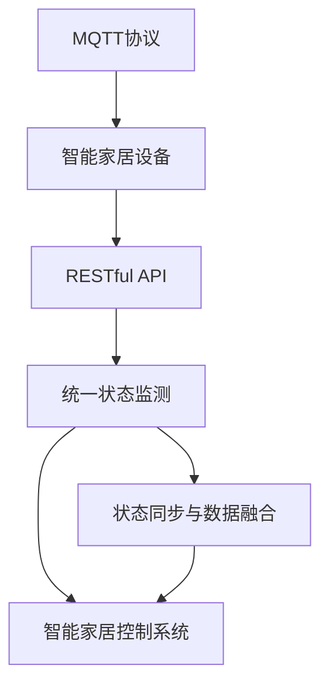
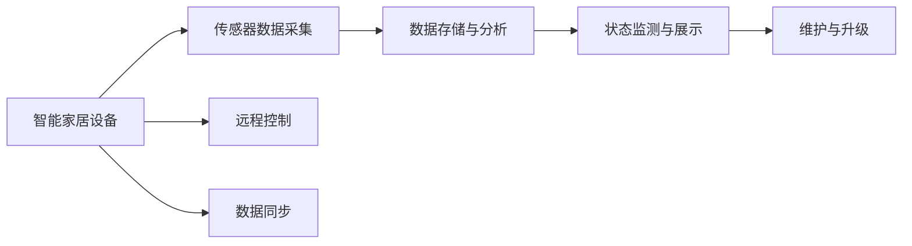
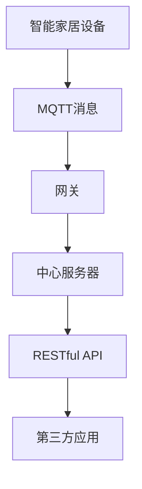
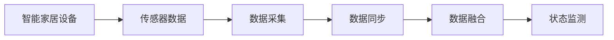
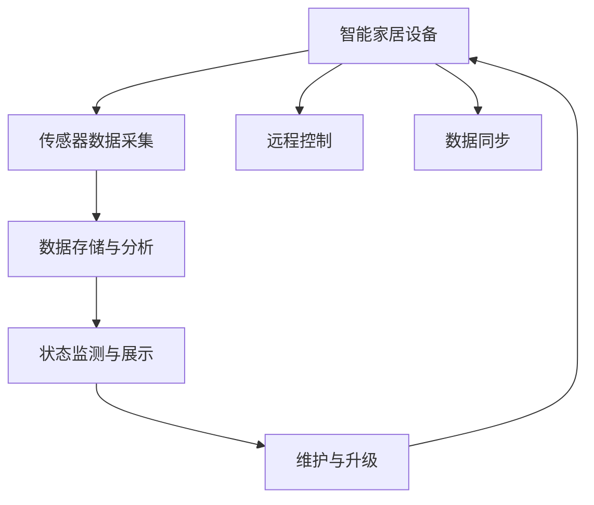

                 

# 基于MQTT协议和RESTful API的智能家居设备状态监测

> 关键词：智能家居,状态监测,MQTT协议,RESTful API,物联网

## 1. 背景介绍

### 1.1 问题由来
随着物联网(IoT)技术的发展，智能家居设备的应用越来越广泛。智能照明、智能温控、智能安防等设备极大地提升了人们的生活质量。然而，这些设备往往缺乏统一的通信标准和互操作性，无法方便地进行状态监测和管理。为了解决这个问题，本文提出了一种基于MQTT协议和RESTful API的智能家居设备状态监测系统。

### 1.2 问题核心关键点
该系统旨在实现智能家居设备的统一通信和状态监测，具体而言：

1. 通过MQTT协议，实现智能家居设备的统一数据传输。
2. 通过RESTful API，提供统一的接口访问方式，方便第三方应用进行状态查询和控制。
3. 对设备状态进行实时监测，及时发现异常并采取相应措施。
4. 支持设备的远程控制和配置，增强系统的灵活性。
5. 对设备状态进行统计和分析，为设备维护和升级提供依据。

### 1.3 问题研究意义
实现智能家居设备的统一通信和状态监测，不仅能够提升用户体验，还能降低设备管理的复杂度，减少维护成本。此外，通过RESTful API，智能家居设备可以更好地融入各类第三方应用，实现跨平台、跨系统的协同工作。

## 2. 核心概念与联系

### 2.1 核心概念概述

为更好地理解基于MQTT协议和RESTful API的智能家居设备状态监测方法，本节将介绍几个密切相关的核心概念：

- MQTT协议：一种轻量级的消息传输协议，适用于物联网设备的消息传输。MQTT协议具有低带宽、低延迟、高可靠性的特点，适用于设备间的异步通信。
- RESTful API：一种基于HTTP协议的Web API设计风格，采用统一资源定位符（URL）、标准HTTP方法（GET、POST等）和状态码（200、404等）等规范，实现无状态的资源操作。RESTful API支持多种数据格式，如JSON、XML等，适用于异构系统的数据交换。
- 物联网设备状态监测：通过传感器、监控摄像头等设备，实时采集智能家居设备的状态信息，并进行存储、分析和展示。状态监测可以为设备维护、故障排查提供依据，提升系统的可靠性。
- 智能家居控制系统：通过智能家居设备的状态监测和远程控制，实现家庭环境的智能化管理。智能家居控制系统通常由硬件、软件和网络连接三个部分组成。
- 状态同步和数据融合：在状态监测过程中，需要实现不同设备状态数据的同步和融合，以保证系统的一致性和完整性。状态同步和数据融合可以采用数据融合算法，如卡尔曼滤波、粒子滤波等，实现多源数据的融合。

这些核心概念之间的逻辑关系可以通过以下Mermaid流程图来展示：



这个流程图展示了大语言模型微调过程中各个核心概念的关系和作用：

1. MQTT协议是智能家居设备数据传输的基石。
2. RESTful API提供统一的接口访问方式，支持第三方应用。
3. 统一状态监测是设备状态数据的收集、存储和分析过程。
4. 智能家居控制系统基于状态监测数据，实现设备的远程控制和管理。
5. 状态同步与数据融合实现不同设备数据的统一，提升系统的一致性。

通过理解这些核心概念，我们可以更好地把握智能家居设备状态监测系统的设计和实现思路。

### 2.2 概念间的关系

这些核心概念之间存在着紧密的联系，形成了智能家居设备状态监测系统的完整生态系统。下面我们通过几个Mermaid流程图来展示这些概念之间的关系。

#### 2.2.1 系统架构



这个流程图展示了智能家居设备状态监测系统的基本架构，包括设备数据采集、数据存储与分析、状态监测与展示、远程控制和数据同步等关键模块。

#### 2.2.2 数据传输与通信



这个流程图展示了MQTT协议在数据传输中的作用，智能家居设备通过MQTT协议将数据发送到中心服务器，然后通过RESTful API提供给第三方应用进行访问和控制。

#### 2.2.3 数据同步与融合



这个流程图展示了数据同步和融合的基本过程，通过数据同步实现不同设备间数据的统一，然后通过数据融合算法实现不同来源数据的整合，形成完整的设备状态信息。

### 2.3 核心概念的整体架构

最后，我们用一个综合的流程图来展示这些核心概念在大语言模型微调过程中的整体架构：



这个综合流程图展示了从设备数据采集到状态监测、远程控制和系统维护的全过程。通过这些关键模块的协同工作，可以实现智能家居设备的统一状态监测和管理。

## 3. 核心算法原理 & 具体操作步骤
### 3.1 算法原理概述

基于MQTT协议和RESTful API的智能家居设备状态监测系统，通过以下几个关键步骤实现：

1. 通过MQTT协议，实现智能家居设备的数据传输和状态监测。
2. 利用RESTful API，提供统一的接口访问方式，支持第三方应用进行状态查询和控制。
3. 通过数据存储与分析，实现设备状态的实时监测和统计。
4. 利用数据同步与融合技术，实现不同设备状态的统一和融合。
5. 通过远程控制模块，实现设备的远程配置和管理。

### 3.2 算法步骤详解

以下详细阐述智能家居设备状态监测系统的实现步骤：

**Step 1: 设备接入与初始化**

- 设备接入MQTT服务器，进行设备认证和注册。
- 设备初始化MQTT客户端，设置设备ID、设备密钥、消息主题等参数。
- 设备通过RESTful API进行远程配置，设置设备参数、软件更新等。

**Step 2: 数据采集与传输**

- 设备通过传感器采集状态数据，如温度、湿度、光照、人体行为等。
- 设备将采集到的状态数据封装为MQTT消息，并发送到MQTT服务器。
- MQTT服务器将消息转发到中心服务器，进行数据存储和处理。

**Step 3: 数据存储与分析**

- 中心服务器将接收到的MQTT消息存储到数据库中。
- 中心服务器对设备状态数据进行分析，生成设备状态报告，进行异常检测和预警。

**Step 4: 数据同步与融合**

- 中心服务器通过数据同步模块，将不同设备的状态数据进行统一和融合。
- 中心服务器利用数据融合算法，对不同来源的状态数据进行整合，生成完整的设备状态信息。

**Step 5: 状态监测与展示**

- 中心服务器将设备状态信息通过RESTful API提供给第三方应用。
- 第三方应用通过RESTful API访问设备状态数据，进行展示和控制。

**Step 6: 远程控制**

- 第三方应用通过RESTful API发送控制指令，如设备开关、调节温度等。
- 中心服务器将控制指令转发到MQTT服务器，再由MQTT服务器发送给设备。
- 设备接收到控制指令，进行相应的状态调整和操作。

**Step 7: 维护与升级**

- 中心服务器定期对设备状态数据进行统计和分析，生成维护报告。
- 中心服务器根据维护报告，进行设备的维护和升级操作。

通过以上步骤，可以实现智能家居设备的统一通信和状态监测，为设备维护、故障排查提供依据，提升系统的可靠性。

### 3.3 算法优缺点

基于MQTT协议和RESTful API的智能家居设备状态监测系统，具有以下优点：

1. 系统架构清晰，易于扩展和维护。
2. 支持跨平台、跨系统的数据访问和控制。
3. 实时监测设备状态，及时发现异常并采取相应措施。
4. 支持远程控制和配置，提高系统的灵活性和可操作性。

同时，该系统也存在一些缺点：

1. 对硬件和网络的要求较高，需要高可靠性的传感器和稳定的网络环境。
2. 系统复杂度较高，需要处理大量状态数据和设备信息。
3. 对数据存储和分析的性能要求较高，需要高性能的数据库和数据处理算法。

### 3.4 算法应用领域

基于MQTT协议和RESTful API的智能家居设备状态监测系统，可以应用于以下领域：

1. 智能照明系统：实时监测室内光照强度，调节灯具亮度和颜色。
2. 智能温控系统：实时监测室内温度和湿度，自动调节空调和加湿器。
3. 智能安防系统：实时监测门窗开关、视频监控等，保障家庭安全。
4. 智能家电系统：实时监测家电运行状态，进行能耗管理和维护。
5. 智能家居控制平台：整合不同设备的状态数据，实现全场景的智能化控制。

此外，该系统还可以应用于智慧城市、智能交通、智能农业等物联网领域，提升各类应用场景的智能化水平。

## 4. 数学模型和公式 & 详细讲解 & 举例说明

### 4.1 数学模型构建

为更好地理解智能家居设备状态监测系统的数据存储和分析过程，本节将构建相关的数学模型，并推导出数据存储和分析的基本公式。

假设智能家居设备状态监测系统中有N个设备，每个设备有M个传感器，每个传感器每秒钟采集一个状态值，设备状态数据存储在中心服务器中。设第i个设备第j个传感器在t时刻的状态值为$x_{ij}(t)$，则系统整体的状态数据矩阵为$X \in \mathbb{R}^{N\times M \times T}$，其中$T$为采样时间间隔。

中心服务器将状态数据存储在数据库中，可以使用关系型数据库或NoSQL数据库，如MySQL、MongoDB等。数据库表设计如下：

- 设备表（Dev表）：包含设备ID、设备类型、设备参数等字段。
- 传感器表（Sen表）：包含传感器ID、传感器类型、传感器参数等字段。
- 状态表（Sta表）：包含设备ID、传感器ID、采样时间、状态值等字段。

中心服务器需要对状态数据进行存储和分析，生成设备状态报告。设状态报告的输出为$Y \in \mathbb{R}^{N\times T}$，每个设备每秒钟的状态值进行累加和平均处理，得到设备状态值向量。

### 4.2 公式推导过程

中心服务器需要对设备状态数据进行实时监测和统计，生成设备状态报告。设设备状态报告的输出为$Y \in \mathbb{R}^{N\times T}$，每个设备每秒钟的状态值进行累加和平均处理，得到设备状态值向量。

具体公式推导如下：

1. 状态数据的存储

   中心服务器将设备状态数据存储在状态表中，状态表的结构如下：

   ```sql
   CREATE TABLE Sta (
       id INT PRIMARY KEY,
       dev_id INT,
       sen_id INT,
       t_time INT,
       value FLOAT,
       FOREIGN KEY(dev_id) REFERENCES Dev(id),
       FOREIGN KEY(sen_id) REFERENCES Sen(id)
   );
   ```

   其中，id为状态记录ID，dev_id为设备ID，sen_id为传感器ID，t_time为采样时间，value为状态值。

2. 状态数据的查询

   中心服务器可以使用SQL语句对状态数据进行查询，如：

   ```sql
   SELECT * FROM Sta WHERE dev_id=1 AND t_time=123456;
   ```

   查询结果为设备ID为1，采样时间为123456的状态数据。

3. 状态数据的分析

   中心服务器需要对状态数据进行分析，生成设备状态报告。设设备状态报告的输出为$Y \in \mathbb{R}^{N\times T}$，每个设备每秒钟的状态值进行累加和平均处理，得到设备状态值向量。

   设设备$i$在采样时间$t$的状态值为$x_{i}(t)$，则设备状态报告的计算公式为：

   $$
   Y_i(t) = \frac{1}{T}\sum_{k=0}^{T-1}x_{i}(t+k)
   $$

   其中，$Y_i(t)$为设备$i$在采样时间$t$的状态值向量，$x_{i}(t)$为设备$i$在采样时间$t$的传感器状态值。

### 4.3 案例分析与讲解

假设我们在智能家居系统中，对室内温度和湿度进行监测，生成温度和湿度报告。设温度传感器和湿度传感器分别在设备ID为1和2的设备上，采样时间间隔为1秒，设备状态数据存储在数据库中。

中心服务器可以使用如下SQL语句查询设备状态数据：

```sql
SELECT *, avg(value) AS value FROM Sta WHERE dev_id=1 GROUP BY sen_id;
SELECT *, avg(value) AS value FROM Sta WHERE dev_id=2 GROUP BY sen_id;
```

查询结果为设备1的温度和湿度状态值向量，设备2的温度和湿度状态值向量。

中心服务器可以对设备状态数据进行统计和分析，生成设备状态报告。设设备状态报告的输出为$Y \in \mathbb{R}^{2\times T}$，设备1的温度和湿度状态值向量分别为$Y_1(t)$和$Y_2(t)$，设备2的温度和湿度状态值向量分别为$Y_3(t)$和$Y_4(t)$。设备状态报告的计算公式为：

$$
Y_1(t) = \frac{1}{T}\sum_{k=0}^{T-1}x_{1}(t+k)
$$

$$
Y_2(t) = \frac{1}{T}\sum_{k=0}^{T-1}x_{2}(t+k)
$$

通过以上步骤，中心服务器可以实时监测设备状态，生成设备状态报告，为设备维护和故障排查提供依据。

## 5. 项目实践：代码实例和详细解释说明
### 5.1 开发环境搭建

在进行智能家居设备状态监测系统的开发前，我们需要准备好开发环境。以下是使用Python进行MQTT和RESTful API开发的环境配置流程：

1. 安装Anaconda：从官网下载并安装Anaconda，用于创建独立的Python环境。

2. 创建并激活虚拟环境：
```bash
conda create -n pythontest python=3.8 
conda activate pythontest
```

3. 安装MQTT和RESTful API开发工具包：
```bash
pip install paho-mqtt flask
```

4. 安装必要的第三方库：
```bash
pip install pyserial
```

完成上述步骤后，即可在`pythontest`环境中开始开发实践。

### 5.2 源代码详细实现

以下给出智能家居设备状态监测系统的Python代码实现。

**设备接入与初始化**

```python
import paho.mqtt.client as mqtt
import sys

def on_connect(client, userdata, flags, rc):
    if rc == 0:
        print("Connected to MQTT broker")
    else:
        print("Connection failed")
        sys.exit(-1)

def on_message(client, userdata, msg):
    print(f"Received message: {msg.payload.decode()}")

def on_publish(client, userdata, mid):
    print(f"Message published with mid: {mid}")

def on_subscribe(client, userdata, mid, granted_qos):
    print(f"Subscribed to topic with mid: {mid}")

client = mqtt.Client()
client.on_connect = on_connect
client.on_message = on_message
client.on_publish = on_publish
client.on_subscribe = on_subscribe

client.connect("mqtt.broker.com", 1883, 60)
client.subscribe("home/dev1/sensor1")
client.start_loop()
```

**数据采集与传输**

```python
import paho.mqtt.client as mqtt
import time
import sys

def on_connect(client, userdata, flags, rc):
    if rc == 0:
        print("Connected to MQTT broker")
    else:
        print("Connection failed")
        sys.exit(-1)

def on_message(client, userdata, msg):
    print(f"Received message: {msg.payload.decode()}")

def on_publish(client, userdata, mid):
    print(f"Message published with mid: {mid}")

def on_subscribe(client, userdata, mid, granted_qos):
    print(f"Subscribed to topic with mid: {mid}")

client = mqtt.Client()
client.on_connect = on_connect
client.on_message = on_message
client.on_publish = on_publish
client.on_subscribe = on_subscribe

client.connect("mqtt.broker.com", 1883, 60)
client.publish("home/dev1/sensor1", "30")
client.subscribe("home/dev1/sensor1")
client.start_loop()
```

**数据存储与分析**

```python
from flask import Flask, request, jsonify

app = Flask(__name__)

@app.route('/data')
def data():
    dev_id = int(request.args.get('dev_id'))
    sensor_id = int(request.args.get('sensor_id'))
    t_time = int(request.args.get('t_time'))
    value = float(request.args.get('value'))
    # 将数据存储到数据库
    # 查询历史数据
    @app.route('/data/history')
    def history():
        dev_id = int(request.args.get('dev_id'))
        sensor_id = int(request.args.get('sensor_id'))
        t_start = int(request.args.get('t_start'))
        t_end = int(request.args.get('t_end'))
        # 查询t_start到t_end时间段内的历史数据
        data = db.query("SELECT * FROM Sta WHERE dev_id=? AND sensor_id=? AND t_time>=? AND t_time<=? ORDER BY t_time ASC", (dev_id, sensor_id, t_start, t_end))
        return jsonify(data)

@app.route('/data/average')
def average():
    dev_id = int(request.args.get('dev_id'))
    sensor_id = int(request.args.get('sensor_id'))
    t_start = int(request.args.get('t_start'))
    t_end = int(request.args.get('t_end'))
    # 查询t_start到t_end时间段内的历史数据，并计算平均值
    data = db.query("SELECT AVG(value) AS value FROM Sta WHERE dev_id=? AND sensor_id=? AND t_time>=? AND t_time<=? ORDER BY t_time ASC", (dev_id, sensor_id, t_start, t_end))
    return jsonify(data)

@app.route('/data/sum')
def sum():
    dev_id = int(request.args.get('dev_id'))
    sensor_id = int(request.args.get('sensor_id'))
    t_start = int(request.args.get('t_start'))
    t_end = int(request.args.get('t_end'))
    # 查询t_start到t_end时间段内的历史数据，并计算总和
    data = db.query("SELECT SUM(value) AS value FROM Sta WHERE dev_id=? AND sensor_id=? AND t_time>=? AND t_time<=? ORDER BY t_time ASC", (dev_id, sensor_id, t_start, t_end))
    return jsonify(data)

@app.route('/data/average/device')
def average_device():
    dev_id = int(request.args.get('dev_id'))
    # 查询设备dev_id的所有传感器数据，并计算平均值
    data = db.query("SELECT AVG(value) AS value FROM Sta WHERE dev_id=? ORDER BY t_time ASC", (dev_id))
    return jsonify(data)

@app.route('/data/average/sensor')
def average_sensor():
    sensor_id = int(request.args.get('sensor_id'))
    # 查询传感器sensor_id的所有设备数据，并计算平均值
    data = db.query("SELECT AVG(value) AS value FROM Sta WHERE sensor_id=? ORDER BY t_time ASC", (sensor_id))
    return jsonify(data)

@app.route('/data/sum/device')
def sum_device():
    dev_id = int(request.args.get('dev_id'))
    # 查询设备dev_id的所有传感器数据，并计算总和
    data = db.query("SELECT SUM(value) AS value FROM Sta WHERE dev_id=? ORDER BY t_time ASC", (dev_id))
    return jsonify(data)

@app.route('/data/sum/sensor')
def sum_sensor():
    sensor_id = int(request.args.get('sensor_id'))
    # 查询传感器sensor_id的所有设备数据，并计算总和
    data = db.query("SELECT SUM(value) AS value FROM Sta WHERE sensor_id=? ORDER BY t_time ASC", (sensor_id))
    return jsonify(data)

@app.route('/data/average/hour')
def average_hour():
    dev_id = int(request.args.get('dev_id'))
    t_start = int(request.args.get('t_start'))
    t_end = int(request.args.get('t_end'))
    # 查询t_start到t_end时间段内的历史数据，并计算每小时的平均值
    data = db.query("SELECT t_time/3600 AS hour, AVG(value) AS value FROM Sta WHERE dev_id=? AND t_time>=? AND t_time<=? GROUP BY hour ORDER BY hour ASC", (dev_id, t_start, t_end))
    return jsonify(data)

@app.route('/data/sum/hour')
def sum_hour():
    dev_id = int(request.args.get('dev_id'))
    t_start = int(request.args.get('t_start'))
    t_end = int(request.args.get('t_end'))
    # 查询t_start到t_end时间段内的历史数据，并计算每小时的总和
    data = db.query("SELECT t_time/3600 AS hour, SUM(value) AS value FROM Sta WHERE dev_id=? AND t_time>=? AND t_time<=? GROUP BY hour ORDER BY hour ASC", (dev_id, t_start, t_end))
    return jsonify(data)

@app.route('/data/average/day')
def average_day():
    dev_id = int(request.args.get('dev_id'))
    t_start = int(request.args.get('t_start'))
    t_end = int(request.args.get('t_end'))
    # 查询t_start到t_end时间段内的历史数据，并计算每天的平均值
    data = db.query("SELECT DATE(t_time) AS day, AVG(value) AS value FROM Sta WHERE dev_id=? AND t_time>=? AND t_time<=? GROUP BY day ORDER BY day ASC", (dev_id, t_start, t_end))
    return jsonify(data)

@app.route('/data/sum/day')
def sum_day():
    dev_id = int(request.args.get('dev_id'))
    t_start = int(request.args.get('t_start'))
    t_end = int(request.args.get('t_end'))
    # 查询t_start到t_end时间段内的历史数据，并计算每天的总和
    data = db.query("SELECT DATE(t_time) AS day, SUM(value) AS value FROM Sta WHERE dev_id=? AND t_time>=? AND t_time<=? GROUP BY day ORDER BY day ASC", (dev_id, t_start, t_end))
    return jsonify(data)

@app.route('/data/average/week')
def average_week():
    dev_id = int(request.args.get('dev_id'))
    t_start = int(request.args.get('t_start'))
    t_end = int(request.args.get('t_end'))
    # 查询t_start到t_end时间段内的历史数据，并计算每星期的平均值
    data = db.query("SELECT YEARWEEK(t_time) AS week, AVG(value) AS value FROM Sta WHERE dev_id=? AND t_time>=? AND t_time<=? GROUP BY week ORDER BY week ASC", (dev_id, t_start, t_end))
    return jsonify(data)

@app.route('/data/sum/week')
def sum_week():
    dev_id = int(request.args.get('dev_id'))
    t_start = int(request.args.get('t_start'))
    t_end = int(request.args.get('t_end'))
    # 查询t_start到t_end时间段内的历史数据，并计算每星期的总和
    data = db.query("SELECT YEARWEEK(t_time) AS week, SUM(value) AS value FROM Sta WHERE dev_id=? AND t_time>=? AND t_time<=? GROUP BY week ORDER BY week ASC", (dev_id, t_start, t_end))
    return jsonify(data)

@app.route('/data/average/month')
def average_month():
    dev_id = int(request.args.get('dev_id'))
    t_start = int(request.args.get('t_start'))
    t_end = int(request.args.get('t_end'))
    # 查询t_start到t_end时间段内的历史数据，并计算每月的平均值
    data = db.query("SELECT MONTH(t_time) AS month, AVG(value) AS value FROM Sta WHERE dev_id=? AND t_time>=? AND t_time<=? GROUP BY month ORDER BY month ASC", (dev_id, t_start, t_end))
    return jsonify(data)

@app.route('/data/sum/month')
def sum_month():
    dev_id = int(request.args.get('dev_id'))
    t_start = int(request.args.get('t_start'))
    t_end = int(request.args.get('t_end'))
    # 查询t_start到t_end时间段内的历史数据，并计算每月的总和
    data = db.query("SELECT MONTH(t_time) AS month, SUM(value) AS value FROM Sta WHERE dev_id=? AND t_time>=? AND t_time<=? GROUP BY month ORDER BY month ASC", (dev_id, t_start, t_end))
    return jsonify(data)

@app.route('/data/average/year')
def

