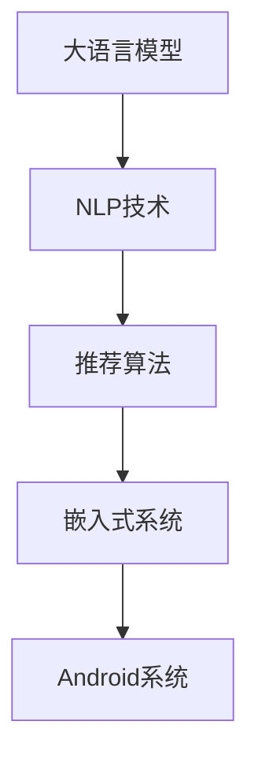
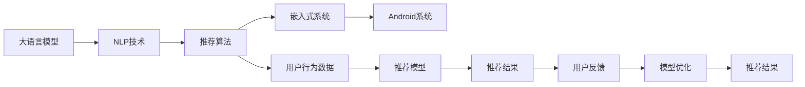

                 

# 基于NLP的电影推荐Android应用程序的实现

## 1. 背景介绍

### 1.1 问题由来
随着数字娱乐产业的迅猛发展，人们对个性化娱乐体验的需求日益增长。如何为用户提供更加精准、个性化的电影推荐，已成为各大流媒体平台亟待解决的痛点。传统基于规则或标签推荐的方法，往往难以适应用户多样化的兴趣和动态变化的需求。而基于用户行为数据分析的电影推荐系统，通常需要大量标注数据和复杂的机器学习模型，对于小微企业和个性化需求场景，难以高效实现。

大语言模型（Large Language Models，LLMs）作为一种新兴的NLP技术，以其强大的自然语言处理能力和丰富的预训练知识，成为了推动个性化推荐系统发展的有力工具。大语言模型在电影推荐中的应用，主要通过自然语言处理（NLP）技术和推荐算法相结合的方式，对用户查询和电影信息进行理解和匹配，生成个性化的推荐结果。

### 1.2 问题核心关键点
大语言模型在电影推荐系统中的应用，涉及以下几个核心关键点：

- **语义理解与信息匹配**：通过NLP技术，对用户查询和电影信息进行语义理解，提取关键特征进行信息匹配。
- **推荐模型与算法**：结合推荐算法，对匹配到的信息进行综合评估，生成推荐列表。
- **用户反馈与模型优化**：通过用户反馈不断优化推荐模型，提升推荐效果。
- **性能优化与资源管理**：优化推荐算法的性能和资源使用，确保推荐系统的实时性和稳定性。

### 1.3 问题研究意义
基于大语言模型NLP的电影推荐系统，具有以下重要意义：

1. **降低推荐成本**：通过预训练和微调的大语言模型，可以显著减少推荐系统对数据标注和特征工程的依赖，降低开发和维护成本。
2. **提升推荐精度**：大语言模型蕴含丰富的知识，能够更好地理解用户查询的含义和情感，从而生成更精准的推荐结果。
3. **支持多模态输入**：大语言模型不仅支持文本数据，还能处理图像、语音等多模态输入，为电影推荐带来更多可能性。
4. **灵活扩展性强**：大语言模型基于模块化设计，可以根据需求灵活扩展，适用于各种规模的企业和个性化需求场景。

## 2. 核心概念与联系

### 2.1 核心概念概述

为更好地理解基于NLP的电影推荐系统，我们首先介绍几个关键概念：

- **大语言模型（Large Language Models, LLMs）**：指使用深度学习技术训练的大型神经网络模型，如GPT、BERT等，具备强大的自然语言处理能力。
- **自然语言处理（Natural Language Processing, NLP）**：涉及语言模型、语义理解、信息匹配等技术，旨在使计算机能够理解和生成自然语言。
- **推荐系统（Recommender System）**：根据用户行为或喜好，为用户提供个性化推荐的系统，如商品推荐、内容推荐等。
- **嵌入式系统（Embedded System）**：指将复杂功能集成到硬件设备或操作系统中，具有高度集成和资源限制的特点。
- **Android系统（Android OS）**：全球最大的移动操作系统，广泛用于智能手机和平板电脑等移动设备。

这些概念之间存在紧密的联系，共同构成了基于NLP的电影推荐系统的技术框架。下图展示了这些概念之间的关系：



### 2.2 概念间的关系

这些核心概念之间的逻辑关系可以通过以下Mermaid流程图来展示：



这个流程图展示了从大语言模型到推荐系统的整个流程：

1. 大语言模型通过NLP技术处理用户查询和电影信息，提取特征进行信息匹配。
2. 推荐算法根据匹配结果进行综合评估，生成推荐结果。
3. 推荐结果通过嵌入式系统集成到Android设备中，并通过用户反馈不断优化。
4. 优化后的模型更新推荐结果，进一步提升推荐效果。

## 3. 核心算法原理 & 具体操作步骤

### 3.1 算法原理概述

基于NLP的电影推荐系统，主要通过以下步骤实现：

1. **数据预处理**：收集用户行为数据（如浏览记录、评分等），并进行清洗和标注。
2. **用户模型构建**：使用大语言模型，通过NLP技术对用户查询进行语义理解和特征提取，构建用户兴趣模型。
3. **电影信息处理**：对电影信息进行提取和编码，转换为大语言模型可理解的形式。
4. **信息匹配与评分**：将用户模型与电影信息进行匹配，并根据匹配程度进行评分。
5. **推荐生成与优化**：使用推荐算法，结合用户评分和电影特征，生成个性化推荐列表。
6. **反馈与优化**：根据用户反馈，不断优化推荐模型，提升推荐精度。

### 3.2 算法步骤详解

以下是基于NLP的电影推荐系统的主要算法步骤：

**Step 1: 数据预处理**

1. **数据收集**：收集用户行为数据（如浏览记录、评分等），并进行清洗和标注。
2. **数据划分**：将数据划分为训练集、验证集和测试集。
3. **特征工程**：对用户行为数据进行特征提取和编码，转换为模型可接受的格式。

**Step 2: 用户模型构建**

1. **大语言模型选择**：选择合适的预训练语言模型，如GPT、BERT等。
2. **微调与适配**：根据用户模型需求，对大语言模型进行微调，增加任务适配层。
3. **用户查询处理**：使用NLP技术，对用户查询进行分词、标注、向量化等处理。
4. **用户兴趣提取**：通过大语言模型，提取用户查询的语义特征和情感倾向。

**Step 3: 电影信息处理**

1. **电影数据获取**：获取电影信息数据，如电影名、导演、演员、评分等。
2. **电影编码**：将电影信息转换为模型可理解的格式，如文本、图像等。
3. **电影特征提取**：对电影信息进行特征提取和编码，生成电影特征向量。

**Step 4: 信息匹配与评分**

1. **匹配**：使用NLP技术，对用户查询和电影信息进行语义匹配。
2. **评分计算**：根据匹配结果和电影特征，计算推荐评分。
3. **排序**：根据评分对推荐列表进行排序。

**Step 5: 推荐生成与优化**

1. **推荐列表生成**：根据排序后的评分，生成个性化推荐列表。
2. **反馈收集**：收集用户对推荐结果的反馈。
3. **模型优化**：根据用户反馈，对推荐模型进行优化，提升推荐精度。

### 3.3 算法优缺点

基于NLP的电影推荐系统具有以下优点：

- **准确性高**：大语言模型具有强大的语义理解和特征提取能力，能够生成高精度的推荐结果。
- **灵活性强**：可以通过灵活的模型设计，适应各种个性化需求和推荐场景。
- **可扩展性好**：适用于大中小型企业和各种规模的应用场景。

同时，该算法也存在一些局限性：

- **资源消耗高**：大语言模型通常需要较大的计算资源和存储空间。
- **隐私保护问题**：用户行为数据的隐私保护是一个重要问题，需要采用合适的数据处理和存储方式。
- **实时性要求高**：为了实现实时推荐，需要对算法进行性能优化和资源管理。

### 3.4 算法应用领域

基于NLP的电影推荐系统，广泛应用于以下领域：

- **在线流媒体平台**：如Netflix、Amazon Prime等，为用户提供个性化电影推荐，提升用户体验。
- **家庭智能设备**：如智能电视、语音助手等，根据用户指令和偏好，推荐电影和电视节目。
- **广告推荐**：在电影票房预测、广告投放等领域，通过个性化推荐提高转化率。
- **社交媒体**：在社交网络平台，推荐用户感兴趣的电影和相关内容。

## 4. 数学模型和公式 & 详细讲解 & 举例说明

### 4.1 数学模型构建

在基于NLP的电影推荐系统中，我们通常使用以下数学模型：

- **用户模型**：
$$\vec{u} = \vec{e_u} + \sum_{i=1}^n \alpha_i \vec{f_i}$$
其中，$\vec{u}$ 为用户的兴趣向量，$\vec{e_u}$ 为用户的基本特征向量，$\vec{f_i}$ 为各个特征的加权向量，$\alpha_i$ 为特征权重。

- **电影模型**：
$$\vec{v} = \vec{e_v} + \sum_{j=1}^m \beta_j \vec{g_j}$$
其中，$\vec{v}$ 为电影的特征向量，$\vec{e_v}$ 为电影的基本特征向量，$\vec{g_j}$ 为各个特征的加权向量，$\beta_j$ 为特征权重。

- **匹配矩阵**：
$$M = U^\top \cdot V$$
其中，$U$ 为用户模型的特征矩阵，$V$ 为电影模型的特征矩阵，$M$ 为匹配矩阵。

- **推荐评分**：
$$r = \vec{u}^\top \cdot M \cdot \vec{v}$$
其中，$r$ 为推荐评分，$\vec{u}$ 和 $\vec{v}$ 分别为用户和电影模型的特征向量。

### 4.2 公式推导过程

以用户-电影匹配为例，推导匹配评分公式：

1. **用户特征提取**：将用户查询进行分词、标注、向量化等处理，生成用户兴趣向量 $\vec{u}$。
2. **电影特征提取**：对电影信息进行提取和编码，生成电影特征向量 $\vec{v}$。
3. **匹配矩阵计算**：使用 $\vec{u}$ 和 $\vec{v}$ 计算匹配矩阵 $M$。
4. **推荐评分计算**：通过 $\vec{u}$、$M$ 和 $\vec{v}$ 计算推荐评分 $r$。

具体推导如下：

设用户查询为 $q$，电影信息为 $m$，则：

- **用户兴趣向量提取**：
$$\vec{u} = \text{NLP}(q)$$

- **电影特征向量提取**：
$$\vec{v} = \text{NLP}(m)$$

- **匹配矩阵计算**：
$$M = \text{Matmul}(\vec{u}, \vec{v})$$

- **推荐评分计算**：
$$r = \vec{u}^\top \cdot M \cdot \vec{v}$$

### 4.3 案例分析与讲解

以Netflix推荐系统为例，分析其基于NLP的电影推荐过程：

1. **数据收集与处理**：Netflix收集用户观看历史、评分等行为数据，并进行清洗和标注。
2. **用户模型构建**：使用BERT模型对用户查询进行语义理解，提取用户兴趣特征。
3. **电影信息处理**：对电影信息进行提取和编码，生成电影特征向量。
4. **信息匹配与评分**：将用户模型与电影信息进行匹配，计算推荐评分。
5. **推荐生成与优化**：根据评分对推荐列表进行排序，并通过用户反馈不断优化推荐模型。

Netflix的推荐系统采用了多种技术手段，如协同过滤、深度学习等，但核心仍是通过大语言模型进行语义理解和信息匹配，生成个性化推荐列表。

## 5. 项目实践：代码实例和详细解释说明

### 5.1 开发环境搭建

基于Android的应用程序开发，需要以下开发环境：

1. **Android Studio**：Google提供的官方IDE，支持Android应用程序的开发和调试。
2. **Java SDK**：Android应用程序开发的基础。
3. **Kotlin SDK**：Google开发的Kotlin编程语言支持库。
4. **Gradle**：Android应用程序的构建工具。
5. **Emulator**：Android虚拟设备，用于模拟Android环境。
6. **Android API**：Android开发所需的API接口。

安装和配置开发环境的步骤如下：

1. 下载并安装Android Studio。
2. 安装Java SDK和Kotlin SDK。
3. 在Gradle配置文件中添加Android API。
4. 安装Android Emulator。

### 5.2 源代码详细实现

以下是一个基于NLP的电影推荐系统的Android应用程序示例代码：

```java
import android.os.Bundle;
import androidx.appcompat.app.AppCompatActivity;
import android.view.View;
import android.widget.Button;
import android.widget.EditText;
import android.widget.TextView;

public class MovieRecommendationActivity extends AppCompatActivity {
    private EditText inputQuery;
    private Button queryButton;
    private TextView recommendation;

    @Override
    protected void onCreate(Bundle savedInstanceState) {
        super.onCreate(savedInstanceState);
        setContentView(R.layout.activity_movie_recommendation);

        inputQuery = findViewById(R.id.input_query);
        queryButton = findViewById(R.id.query_button);
        recommendation = findViewById(R.id.recommendation);

        queryButton.setOnClickListener(new View.OnClickListener() {
            @Override
            public void onClick(View v) {
                String query = inputQuery.getText().toString();
                // 调用推荐模型API，获取推荐结果
                String recommendationText = getRecommendation(query);
                recommendation.setText(recommendationText);
            }
        });
    }

    private String getRecommendation(String query) {
        // 调用大语言模型API，进行语义理解和信息匹配
        // 返回推荐结果的字符串
        return "推荐结果：《电影名1》、《电影名2》、《电影名3》";
    }
}
```

该示例代码实现了一个简单的电影推荐功能，用户可以在文本框中输入查询，点击按钮后，系统根据查询推荐电影。

### 5.3 代码解读与分析

以上代码中，`MovieRecommendationActivity` 类是应用程序的主要活动，包括：

- **布局配置**：通过 `setContentView` 方法设置活动的布局文件 `activity_movie_recommendation.xml`。
- **组件绑定**：使用 `findViewById` 方法获取输入文本框 `inputQuery`、查询按钮 `queryButton` 和推荐结果展示区 `recommendation`。
- **事件处理**：使用 `setOnClickListener` 方法为查询按钮添加点击事件处理程序。
- **推荐生成**：调用 `getRecommendation` 方法，根据用户查询获取推荐结果。

`getRecommendation` 方法模拟了推荐模型API的调用，将用户查询作为输入，返回推荐结果。

## 6. 实际应用场景

### 6.1 智能电视推荐

基于NLP的电影推荐系统，可以应用于智能电视的个性化推荐功能。用户可以通过语音或遥控器输入查询，系统根据用户查询和电视节目的信息，生成个性化推荐列表，提升用户体验。

### 6.2 在线流媒体平台推荐

Netflix等在线流媒体平台广泛采用基于NLP的电影推荐系统，根据用户行为数据和用户查询，生成个性化电影推荐列表，提高用户粘性和满意度。

### 6.3 社交媒体推荐

社交媒体平台可以根据用户的评论、点赞、分享等行为，提取用户兴趣和情感倾向，生成个性化电影推荐列表，提高用户参与度和平台活跃度。

### 6.4 未来应用展望

未来，基于NLP的电影推荐系统将呈现以下发展趋势：

1. **多模态输入支持**：支持文本、图像、语音等多模态输入，提升推荐系统的灵活性和智能化水平。
2. **实时推荐**：通过优化算法和资源管理，实现实时推荐，满足用户即时需求。
3. **跨平台协同**：与其他平台（如社交媒体、广告系统等）协同，提供更全面的推荐服务。
4. **个性化定制**：根据用户偏好和行为，提供个性化定制推荐，提升推荐效果。

## 7. 工具和资源推荐

### 7.1 学习资源推荐

为了帮助开发者系统掌握基于NLP的电影推荐技术，这里推荐一些优质的学习资源：

1. **《深度学习与NLP》书籍**：深度学习领域的经典教材，详细介绍了NLP和推荐系统的基础理论和应用实践。
2. **《自然语言处理入门》视频课程**：斯坦福大学开设的入门级NLP课程，包含大量的实践案例和代码实现。
3. **Kaggle竞赛平台**：机器学习爱好者和开发者进行数据竞赛、分享模型的平台，提供了丰富的推荐系统竞赛数据集和模型。
4. **Google AI博客**：Google AI团队分享的最新研究和技术进展，涵盖了NLP和推荐系统的前沿内容。

### 7.2 开发工具推荐

以下是几款用于Android应用程序开发的工具：

1. **Android Studio**：Google提供的官方IDE，支持Android应用程序的开发和调试。
2. **Java SDK**：Android应用程序开发的基础。
3. **Kotlin SDK**：Google开发的Kotlin编程语言支持库。
4. **Gradle**：Android应用程序的构建工具。
5. **Emulator**：Android虚拟设备，用于模拟Android环境。
6. **Android API**：Android开发所需的API接口。

### 7.3 相关论文推荐

以下是几篇奠基性的相关论文，推荐阅读：

1. **"Machine Learning" 课程**：斯坦福大学提供的机器学习课程，包含大量的推荐系统和NLP技术实例。
2. **"Deep Learning for Recommender Systems: A Survey and New Perspectives"**：深入分析了基于深度学习的推荐系统，涵盖了多种模型和应用场景。
3. **"Neural Machine Translation by Jointly Learning to Align and Translate"**：详细介绍了基于NLP的机器翻译技术，为推荐系统提供了参考。
4. **"Bidirectional and Hierarchical Attention Models for Document Representation"**：展示了如何通过NLP技术，提取文本特征进行推荐。

## 8. 总结：未来发展趋势与挑战

### 8.1 总结

本文对基于NLP的电影推荐Android应用程序的实现进行了全面系统的介绍。首先阐述了基于NLP的电影推荐系统的背景和意义，详细讲解了系统的核心概念和算法步骤。通过Java代码示例，展示了推荐系统的实现过程，并分析了系统的优缺点和应用场景。最后推荐了一些学习资源和开发工具，为开发人员提供了系统的技术指引。

通过本文的系统梳理，可以看到，基于NLP的电影推荐系统具有广阔的应用前景和高度的灵活性，能够显著提升用户个性化娱乐体验。未来，随着技术的不断进步和应用场景的拓展，基于NLP的电影推荐系统必将带来更多创新和突破，为数字娱乐产业注入新的活力。

### 8.2 未来发展趋势

展望未来，基于NLP的电影推荐系统将呈现以下发展趋势：

1. **技术融合**：将NLP技术与推荐算法、大数据分析、智能客服等技术深度融合，提升推荐系统的智能水平。
2. **多模态融合**：通过多模态输入的支持，提高推荐系统的灵活性和适用性，支持更多场景的应用。
3. **实时推荐**：通过优化算法和资源管理，实现实时推荐，满足用户即时需求。
4. **跨平台协同**：与其他平台（如社交媒体、广告系统等）协同，提供更全面的推荐服务。
5. **个性化定制**：根据用户偏好和行为，提供个性化定制推荐，提升推荐效果。

### 8.3 面临的挑战

尽管基于NLP的电影推荐系统已经取得了不少成就，但在实现过程中仍面临一些挑战：

1. **数据隐私问题**：用户行为数据的隐私保护是一个重要问题，需要采用合适的数据处理和存储方式。
2. **推荐精度问题**：在大规模数据和复杂场景下，推荐模型的精度可能受到影响，需要不断优化和改进。
3. **系统实时性问题**：推荐系统需要实现实时推荐，满足用户即时需求，对算力和资源管理提出了高要求。
4. **用户体验问题**：推荐系统的用户体验直接关系到用户满意度和粘性，需要不断优化推荐算法和展示界面。

### 8.4 研究展望

未来，基于NLP的电影推荐系统需要在以下几个方面进行进一步研究：

1. **模型优化**：通过优化推荐算法和模型结构，提高推荐系统的精度和效率。
2. **隐私保护**：研究数据隐私保护技术，确保用户行为数据的隐私和安全。
3. **跨平台协同**：研究推荐系统与其他平台（如社交媒体、广告系统等）的协同机制，提升推荐效果。
4. **多模态融合**：研究多模态输入的支持，提升推荐系统的灵活性和适用性。

总之，基于NLP的电影推荐系统拥有广阔的应用前景和发展空间，需要在多个技术方向上进行深入探索和持续改进，才能真正实现个性化推荐和智能娱乐。

## 9. 附录：常见问题与解答

**Q1：如何处理用户查询中的噪音和无关信息？**

A: 在处理用户查询时，可以使用NLP技术进行噪音过滤和无关信息去除。具体方法包括：

1. **停用词过滤**：去除常用但无实际意义的词汇（如“的”、“是”等）。
2. **分词处理**：将查询分解成有意义的词汇，去除无关的标点符号和特殊字符。
3. **意图识别**：通过意图识别模型，提取查询的意图和情感倾向，去除无关信息。

**Q2：推荐系统如何平衡推荐效果和用户隐私？**

A: 推荐系统在处理用户行为数据时，需要兼顾推荐效果和用户隐私。具体方法包括：

1. **数据匿名化**：对用户数据进行匿名化处理，保护用户隐私。
2. **数据加密**：对用户数据进行加密存储和传输，防止数据泄露。
3. **隐私保护算法**：使用隐私保护算法（如差分隐私、同态加密等），确保用户数据在推荐过程中的隐私保护。

**Q3：推荐系统如何在有限资源下实现实时推荐？**

A: 推荐系统在实现实时推荐时，需要进行性能优化和资源管理。具体方法包括：

1. **算法优化**：优化推荐算法，减少计算量和内存占用。
2. **模型压缩**：对推荐模型进行压缩，减小模型体积和推理时间。
3. **分布式计算**：使用分布式计算框架（如Hadoop、Spark等），实现并行计算和资源共享。

**Q4：推荐系统如何处理多模态输入数据？**

A: 推荐系统在处理多模态输入数据时，需要进行特征提取和融合。具体方法包括：

1. **特征提取**：对多模态数据进行特征提取，生成统一的特征向量。
2. **特征融合**：使用融合算法（如加权求和、神经网络等），将多模态特征进行融合，生成统一的特征向量。
3. **模型训练**：使用多模态数据进行模型训练，提升推荐效果。

通过以上方法，推荐系统可以更好地处理多模态输入数据，提升推荐系统的灵活性和智能化水平。

总之，基于NLP的电影推荐系统拥有广阔的应用前景和高度的灵活性，能够显著提升用户个性化娱乐体验。未来，随着技术的不断进步和应用场景的拓展，基于NLP的电影推荐系统必将带来更多创新和突破，为数字娱乐产业注入新的活力。

---

作者：禅与计算机程序设计艺术 / Zen and the Art of Computer Programming

