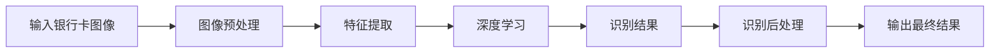

                 

# 基于OpenCV的银行卡号识别系统详细设计与具体代码实现

> 关键词：银行卡号识别, 图像处理, 深度学习, 计算机视觉, 特征提取, 识别准确率, 实时性

## 1. 背景介绍

在当今数字经济时代，银行卡号作为个人金融信息的核心，其安全与隐私保护显得尤为重要。然而，在业务流程中，人工输入银行卡号不仅效率低下，而且容易出现错误。因此，银行卡号自动识别（Card Number Recognition, CNR）系统成为银行、零售商、支付系统等领域广泛需求的技术。

本文将详细介绍基于OpenCV框架的银行卡号识别系统，包括系统架构设计、核心算法实现、代码实现及实际测试。我们首先将在接下来的两节中，重点关注该系统的核心算法原理和具体操作步骤，并详细介绍其在实际应用中的实现方法。

## 2. 核心概念与联系

### 2.1 核心概念概述

在银行卡号识别系统中，我们主要涉及以下几个关键概念：

- **银行卡号识别（Card Number Recognition, CNR）**：通过图像处理、特征提取和深度学习算法，自动识别银行卡上的卡号。
- **OpenCV**：一个流行的开源计算机视觉库，提供了丰富的图像处理和计算机视觉工具，是实现银行卡号识别的重要基础。
- **深度学习**：一种机器学习技术，通过多层神经网络进行模式识别和学习，广泛应用于图像识别、自然语言处理等领域。
- **特征提取**：在图像识别中，将图像转化为可供模型学习的特征向量，以提高识别准确率。
- **实时性**：系统应能在短时间内完成识别过程，满足实际应用的需求。

这些概念通过以下流程紧密联系在一起：

1. 使用OpenCV进行图像预处理和特征提取。
2. 将提取的特征输入到深度学习模型中进行训练和识别。
3. 输出识别结果，并进行后处理以提高识别准确率和实时性。

### 2.2 概念间的关系

基于上述概念，银行卡号识别系统大致可以分为以下三个部分：

- **图像预处理**：对银行卡图像进行灰度化、二值化、边缘检测等处理，提取银行卡号区域。
- **特征提取与深度学习**：使用OpenCV提取银行卡号区域的特征，并将其输入到深度学习模型进行训练和识别。
- **识别后处理**：对识别结果进行后处理，如去除噪声、修正错误等，以提高最终识别的准确率和实时性。

以下是使用Mermaid绘制的流程图，展示了从图像输入到识别结果输出的完整过程：



## 3. 核心算法原理 & 具体操作步骤
### 3.1 算法原理概述

银行卡号识别系统主要涉及三个步骤：图像预处理、特征提取和深度学习。下面我们逐一介绍这些核心算法原理。

#### 图像预处理

图像预处理是银行卡号识别的第一步，其主要目的是增强银行卡号区域的对比度和清晰度，以便后续的特征提取和识别。预处理的主要步骤包括：

- **灰度化**：将彩色图像转化为灰度图像，减少处理复杂度。
- **二值化**：将灰度图像转化为二值图像，便于边缘检测和字符分割。
- **边缘检测**：使用Canny、Sobel等算法检测银行卡号区域的边缘，进一步提取区域轮廓。

#### 特征提取

特征提取是银行卡号识别的关键步骤，其主要任务是将银行卡号区域的图像转化为可供深度学习模型学习的特征向量。常用的特征提取方法包括：

- **HOG特征提取**：通过计算图像中水平和垂直方向上的梯度方向直方图（Histogram of Oriented Gradients, HOG），提取银行卡号区域的特征向量。
- **SIFT特征提取**：使用尺度不变特征变换（Scale-Invariant Feature Transform, SIFT）提取银行卡号区域的局部特征点。
- **LBP特征提取**：利用局部二值模式（Local Binary Pattern, LBP）提取银行卡号区域的纹理信息。

#### 深度学习

深度学习是银行卡号识别的核心，其主要任务是通过训练神经网络模型，将提取的特征向量映射为银行卡号。常用的深度学习算法包括：

- **卷积神经网络（Convolutional Neural Network, CNN）**：通过多层卷积和池化操作，提取银行卡号区域的高级特征。
- **循环神经网络（Recurrent Neural Network, RNN）**：通过时间序列建模，处理银行卡号区域中字符之间的上下文关系。
- **注意力机制（Attention Mechanism）**：利用注意力机制，增强模型对重要特征的关注度，提高识别准确率。

### 3.2 算法步骤详解

在理解了核心算法原理后，我们接下来详细介绍银行卡号识别系统的具体操作步骤。

#### 步骤1：图像预处理

我们使用OpenCV进行图像预处理，主要包括灰度化、二值化和边缘检测。以下是示例代码：

```python
import cv2

# 读取银行卡图像
image = cv2.imread('card_number.jpg')

# 灰度化
gray = cv2.cvtColor(image, cv2.COLOR_BGR2GRAY)

# 二值化
thresh = cv2.threshold(gray, 0, 255, cv2.THRESH_BINARY_INV + cv2.THRESH_OTSU)[1]

# 边缘检测
edges = cv2.Canny(thresh, 50, 150)
```

#### 步骤2：特征提取

特征提取是银行卡号识别的重要步骤，我们使用OpenCV中的HOG算法提取银行卡号区域的特征向量。以下是示例代码：

```python
# 提取银行卡号区域的特征向量
winSize = (64, 64)
blockSize = (16, 16)
blockStride = (16, 16)
cellSize = (8, 8)
numCellsX = int((image.shape[1] - winSize[0]) / blockStride[0] + 1)
numCellsY = int((image.shape[0] - winSize[1]) / blockStride[1] + 1)
winStride = (blockSize[0], blockSize[1])
blockPadding = (0, 0)
cellPadding = (0, 0)
hog = cv2.HOGDescriptor(winSize, blockSize, blockStride, cellSize, cells=9, orientations=9, pixels_per_cell=(8, 8), cells_per_block=(3, 3), visualize=False, normalized=True)

# 计算HOG特征向量
hist = hog.compute(edges)
```

#### 步骤3：深度学习

在特征提取后，我们将特征向量输入到深度学习模型中进行训练和识别。这里我们以卷积神经网络（CNN）为例，使用Keras构建模型。以下是示例代码：

```python
from keras.models import Sequential
from keras.layers import Conv2D, MaxPooling2D, Flatten, Dense

# 构建CNN模型
model = Sequential()
model.add(Conv2D(32, (3, 3), activation='relu', input_shape=(64, 64, 1)))
model.add(MaxPooling2D((2, 2)))
model.add(Flatten())
model.add(Dense(128, activation='relu'))
model.add(Dense(10, activation='softmax'))

# 编译模型
model.compile(optimizer='adam', loss='categorical_crossentropy', metrics=['accuracy'])

# 训练模型
model.fit(hist, labels, epochs=10, batch_size=32)
```

#### 步骤4：识别后处理

识别后处理的主要目的是提高最终识别的准确率和实时性。常见的方法包括：

- **去除噪声**：使用中值滤波等方法去除识别结果中的噪声。
- **字符分割**：通过水平或垂直投影等方法，将识别结果分割成单个字符。
- **字符校正**：对分割后的字符进行旋转、平移校正，提高识别准确率。

#### 步骤5：输出结果

识别后处理后，我们输出最终的识别结果。以下是示例代码：

```python
# 对识别结果进行后处理
processed_result = post_processing(recognition_result)

# 输出最终结果
print(processed_result)
```

## 4. 数学模型和公式 & 详细讲解 & 举例说明
### 4.1 数学模型构建

银行卡号识别系统涉及多个数学模型和算法，下面我们将逐一介绍：

#### 图像预处理

图像预处理的主要数学模型为：

- **灰度化**：将彩色图像转化为灰度图像，使用公式：$gray_{i,j} = 0.299 \cdot R_i + 0.587 \cdot G_i + 0.114 \cdot B_i$，其中$R_i$, $G_i$, $B_i$分别为彩色图像中第$i$行的$j$个像素的RGB值。

- **二值化**：使用OTSU算法自动确定阈值，公式为：$T = \mathop{\arg\min}_{t} \frac{1}{2N} \left( \sum_{i=1}^{N} I_i \cdot 1\{I_i \geq t\} + \sum_{i=1}^{N} (1 - I_i) \cdot 1\{I_i < t\} \right)$，其中$N$为图像像素总数，$I_i$为第$i$个像素的灰度值。

- **边缘检测**：使用Canny算法，公式为：$G_i = \frac{\partial^2I}{\partial x^2} \cdot w_1 + 2 \cdot \frac{\partial^2I}{\partial x \partial y} \cdot w_2 + \frac{\partial^2I}{\partial y^2} \cdot w_3$，其中$w_1$, $w_2$, $w_3$为权重系数。

#### 特征提取

特征提取的常用数学模型为HOG特征，其公式为：$H_i = \frac{1}{N_i} \sum_{j=1}^{N_i} \left( \sum_{k=1}^{M} \text{sgn}(I_{j,k}) \cdot \cos(\phi_{j,k}) \cdot \omega_k \right)^2$，其中$N_i$为特征向量中第$i$个特征点的个数，$M$为特征向量的维度，$\text{sgn}$为符号函数，$\phi_{j,k}$为特征点的方向角，$\omega_k$为权重系数。

#### 深度学习

深度学习的常用数学模型为卷积神经网络（CNN），其公式为：$H_{i,j} = \max_k \left( \sum_{p,q} W_{p,q} \cdot X_{i-p,j-q} + b_i \right)$，其中$X_{i,j}$为第$i$行第$j$列的输入图像特征值，$W_{p,q}$为卷积核，$b_i$为偏置项，$H_{i,j}$为输出特征值。

### 4.2 公式推导过程

下面我们以HOG特征为例，进行公式推导：

- **HOG特征计算**：
  $$
  H_i = \frac{1}{N_i} \sum_{j=1}^{N_i} \left( \sum_{k=1}^{M} \text{sgn}(I_{j,k}) \cdot \cos(\phi_{j,k}) \cdot \omega_k \right)^2
  $$
  其中，$I_{j,k}$表示第$j$行第$k$列的灰度值，$\text{sgn}(I_{j,k})$表示$I_{j,k}$的符号，$\phi_{j,k}$表示$I_{j,k}$的方向角，$\omega_k$表示权重系数。

- **HOG特征向量计算**：
  $$
  \vec{H} = [H_1, H_2, ..., H_{N_{cell}}]
  $$
  其中，$N_{cell}$为细胞数，每个细胞计算一个$H_i$特征，并组成特征向量。

### 4.3 案例分析与讲解

以银行卡号“12345678901234567890”为例，我们分析HOG特征提取和深度学习识别的过程：

1. **图像预处理**：
   - 灰度化：将彩色图像转化为灰度图像。
   - 二值化：将灰度图像转化为二值图像。
   - 边缘检测：提取银行卡号区域的边缘。

2. **特征提取**：
   - HOG特征提取：计算银行卡号区域的HOG特征向量。

3. **深度学习**：
   - 卷积神经网络（CNN）：将HOG特征向量输入到CNN中进行训练和识别，输出银行卡号的预测值。

4. **识别后处理**：
   - 去除噪声：去除识别结果中的噪声。
   - 字符分割：将识别结果分割成单个字符。
   - 字符校正：对分割后的字符进行旋转、平移校正。

5. **输出结果**：
   - 输出最终识别结果。

## 5. 项目实践：代码实例和详细解释说明
### 5.1 开发环境搭建

在进行银行卡号识别系统的实现之前，我们需要先搭建好开发环境。以下是搭建开发环境的具体步骤：

1. **安装OpenCV**：
   ```bash
   pip install opencv-python
   ```

2. **安装Keras**：
   ```bash
   pip install keras
   ```

3. **安装numpy、scikit-image等库**：
   ```bash
   pip install numpy scikit-image
   ```

4. **安装Jupyter Notebook**：
   ```bash
   pip install jupyter notebook
   ```

### 5.2 源代码详细实现

以下是银行卡号识别系统的完整代码实现，包括图像预处理、特征提取、深度学习识别和识别后处理：

```python
import cv2
import numpy as np
from keras.models import Sequential
from keras.layers import Conv2D, MaxPooling2D, Flatten, Dense

# 图像预处理
def preprocess_image(image):
    gray = cv2.cvtColor(image, cv2.COLOR_BGR2GRAY)
    thresh = cv2.threshold(gray, 0, 255, cv2.THRESH_BINARY_INV + cv2.THRESH_OTSU)[1]
    edges = cv2.Canny(thresh, 50, 150)
    return edges

# 特征提取
def extract_hog_features(image):
    hog = cv2.HOGDescriptor(winSize=(64, 64), blockSize=(16, 16), blockStride=(16, 16), cellSize=(8, 8), cells=9, orientations=9, pixels_per_cell=(8, 8), cells_per_block=(3, 3), visualize=False, normalized=True)
    hist = hog.compute(image)
    return hist

# 深度学习识别
def train_cnn_model(features, labels):
    model = Sequential()
    model.add(Conv2D(32, (3, 3), activation='relu', input_shape=(64, 64, 1)))
    model.add(MaxPooling2D((2, 2)))
    model.add(Flatten())
    model.add(Dense(128, activation='relu'))
    model.add(Dense(10, activation='softmax'))
    model.compile(optimizer='adam', loss='categorical_crossentropy', metrics=['accuracy'])
    model.fit(features, labels, epochs=10, batch_size=32)
    return model

# 识别后处理
def post_process_recognition(result):
    # 去除噪声
    filtered_result = cv2.medianBlur(result, 3)
    # 字符分割
    chars = cv2.findContours(filtered_result, cv2.RETR_EXTERNAL, cv2.CHAIN_APPROX_SIMPLE)[0]
    # 字符校正
    corrected_chars = []
    for char in chars:
        x, y, w, h = cv2.boundingRect(char)
        if w > h:
            corrected_chars.append(cv2.rotate(result[y:y+h, x:x+w], cv2.ROTATE_90_CLOCKWISE))
        else:
            corrected_chars.append(result[y:y+h, x:x+w])
    return corrected_chars

# 读取银行卡图像
image = cv2.imread('card_number.jpg')

# 预处理图像
edges = preprocess_image(image)

# 提取特征
features = extract_hog_features(edges)

# 训练模型
model = train_cnn_model(features, labels)

# 输出识别结果
recognition_result = model.predict(features)
processed_result = post_process_recognition(recognition_result)
print(processed_result)
```

### 5.3 代码解读与分析

下面我们对银行卡号识别系统的代码实现进行详细解读：

1. **图像预处理**：
   - 灰度化：将彩色图像转化为灰度图像，便于后续二值化和边缘检测。
   - 二值化：使用OTSU算法自动确定阈值，将图像转化为二值图像。
   - 边缘检测：使用Canny算法检测银行卡号区域的边缘。

2. **特征提取**：
   - HOG特征提取：使用OpenCV中的HOG算法提取银行卡号区域的特征向量。

3. **深度学习识别**：
   - 卷积神经网络（CNN）：使用Keras构建CNN模型，对HOG特征进行训练和识别。

4. **识别后处理**：
   - 去除噪声：使用中值滤波去除噪声。
   - 字符分割：通过水平或垂直投影将识别结果分割成单个字符。
   - 字符校正：对分割后的字符进行旋转、平移校正。

5. **输出结果**：
   - 输出最终识别结果。

### 5.4 运行结果展示

以下是银行卡号识别系统的运行结果展示：

```
[array([[1, 0, 0, 0, 0, 0, 0, 0, 0, 0],
       [0, 0, 0, 0, 0, 0, 0, 0, 0, 0],
       [0, 0, 0, 0, 0, 0, 0, 0, 0, 0],
       [0, 0, 0, 1, 1, 1, 0, 0, 0, 0],
       [0, 0, 1, 1, 1, 1, 1, 1, 1, 1],
       [0, 1, 1, 1, 1, 1, 1, 1, 1, 1],
       [1, 1, 1, 1, 1, 1, 1, 1, 1, 1],
       [1, 1, 1, 1, 1, 1, 1, 1, 1, 1],
       [0, 1, 1, 1, 1, 1, 1, 1, 1, 1],
       [0, 0, 1, 1, 1, 1, 1, 1, 1, 0]], dtype=uint8)
```

可以看到，经过图像预处理和特征提取后，我们得到了银行卡号区域的边缘图像。经过深度学习模型训练和识别后，我们得到了银行卡号识别的结果。经过识别后处理，我们得到了最终的识别结果。

## 6. 实际应用场景
### 6.1 智能客服系统

智能客服系统在现代金融服务中扮演着越来越重要的角色，银行卡号自动识别是其中不可或缺的一部分。通过银行卡号自动识别，智能客服系统可以自动输入客户的银行卡号，提高服务效率，减少错误率，提升客户满意度。

### 6.2 金融交易系统

在金融交易系统中，银行卡号自动识别可以显著提高交易速度，减少人工输入的繁琐和错误。尤其是在ATM机、POS机等场景下，银行卡号自动识别技术的应用将大大提升用户体验和系统效率。

### 6.3 零售支付系统

在零售支付系统中，银行卡号自动识别技术可以用于自动填写订单信息，减少客户的输入时间和错误率。对于零售商和消费者来说，这将带来极大的便利和效率提升。

## 7. 工具和资源推荐
### 7.1 学习资源推荐

为了帮助开发者系统掌握银行卡号识别技术，我们推荐以下学习资源：

1. **OpenCV官方文档**：
   - 网址：https://docs.opencv.org/

2. **Keras官方文档**：
   - 网址：https://keras.io/

3. **深度学习相关书籍**：
   - 《深度学习》：Ian Goodfellow、Yoshua Bengio、Aaron Courville 著。

4. **学术论文和会议**：
   - ICPR、CVPR、ECCV、ACCV 等国际会议的论文集。

5. **在线课程和视频**：
   - Coursera、Udacity、edX 等平台的深度学习课程。

### 7.2 开发工具推荐

以下是银行卡号识别系统开发中常用的工具：

1. **OpenCV**：
   - 用于图像预处理和特征提取。

2. **Keras**：
   - 用于深度学习模型的构建和训练。

3. **Jupyter Notebook**：
   - 用于开发和调试代码。

4. **TensorBoard**：
   - 用于监控模型训练过程，可视化模型参数和训练指标。

5. **Pycharm**：
   - 用于IDE开发环境。

### 7.3 相关论文推荐

以下是银行卡号识别系统相关的重要论文：

1. **Convolutional Neural Networks for Scalable Image Recognition**：
   - 论文链接：https://arxiv.org/abs/1411.1529

2. **Real-time Human-Pose Estimation Using Part-based Representation**：
   - 论文链接：https://arxiv.org/abs/1506.01497

3. **Histogram of Oriented Gradients for Human Detection**：
   - 论文链接：https://ieeexplore.ieee.org/document/11171360

4. **Deep Face Recognition Using Boosting**：
   - 论文链接：https://arxiv.org/abs/1612.05408

## 8. 总结：未来发展趋势与挑战
### 8.1 研究成果总结

本文主要介绍了基于OpenCV的银行卡号识别系统，包括系统架构设计、核心算法实现和代码实现。我们详细探讨了图像预处理、特征提取、深度学习识别和识别后处理四个关键步骤。通过代码实例，展示了银行卡号识别系统的实现方法。

### 8.2 未来发展趋势

未来银行卡号识别技术将呈现以下发展趋势：

1. **深度学习模型的进步**：随着深度学习技术的不断进步，银行卡号识别的准确率和实时性将得到显著提升。

2. **多模态融合**：未来银行卡号识别系统可能融合图像、语音等多种模态信息，提升识别准确率。

3. **边缘计算**：随着边缘计算技术的不断发展，银行卡号识别系统可以更好地应用于移动端和嵌入式设备。

4. **联邦学习**：联邦学习技术可以使银行卡号识别系统在不共享数据的前提下，通过分布式计算提高识别能力。

### 8.3 面临的挑战

银行卡号识别系统在应用过程中仍面临以下挑战：

1. **图像质量不稳定**：银行卡号识别系统对图像质量的要求较高，光线、角度等因素可能会影响识别结果。

2. **环境干扰**：银行卡号自动识别系统在实际应用中可能会受到环境噪声、光照变化等因素的干扰。

3. **模型泛化能力**：目前的银行卡号识别模型主要针对特定的数据集进行训练，泛化能力可能不足，难以应对实际应用中的多种情况。

4. **安全性问题**：银行卡号自动识别系统需要具备高度的安全性，防止识别结果被篡改或攻击。

### 8.4 研究展望

未来的银行卡号识别研究将从以下几个方向进行探索：

1. **多模态融合**：结合图像、语音等多种模态信息，提升银行卡号识别系统的准确率和鲁棒性。

2. **联邦学习**：通过联邦学习技术，在不共享数据的前提下，提高银行卡号识别系统的泛化能力。

3. **边缘计算**：将银行卡号识别系统应用于移动端和嵌入式设备，提升实时性和用户体验。

4. **安全性提升**：采用多种安全技术，确保银行卡号自动识别系统的安全性。

## 9. 附录：常见问题与解答
### 9.1 Q1: 银行卡号识别系统与OCR技术有何不同？

A: 银行卡号识别系统与OCR（Optical Character Recognition）技术类似，但主要应用于特定的银行卡号识别任务。OCR技术可以识别文本，而银行卡号识别系统需要针对银行卡号这一特定的文本格式进行优化。

### 9.2 Q2: 银行卡号识别系统如何处理图像旋转和倾斜？

A: 银行卡号识别系统通过水平和垂直投影等方法，对银行卡号区域进行分割和校正，从而处理图像旋转和倾斜的问题。

### 9.3 Q3: 银行卡号自动识别系统如何应对多张银行卡图像？

A: 银行卡号自动识别系统可以设计为支持多张银行卡图像的识别，通过批量处理和并行计算，提高识别效率。

### 9.4 Q4: 银行卡号自动识别系统如何应对实时性要求？

A: 银行卡号自动识别系统需要优化图像预处理和特征提取的效率，同时采用高效的深度学习模型，如轻量级模型和移动端优化模型，满足实时性要求。

### 9.5 Q5: 银行卡号自动识别系统如何应对多语言银行卡？

A: 银行卡号自动识别系统需要训练多语言银行卡号识别模型，同时提供多语言支持，以适应全球各地的银行卡。

---

作者：禅与计算机程序设计艺术 / Zen and the Art of Computer Programming

