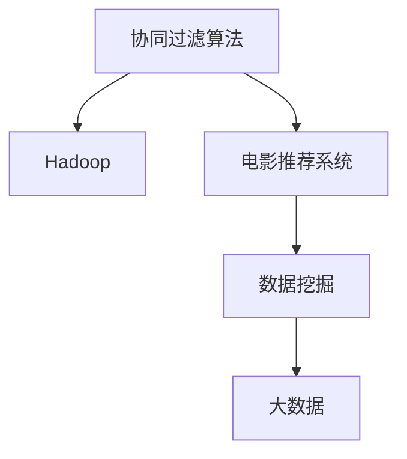
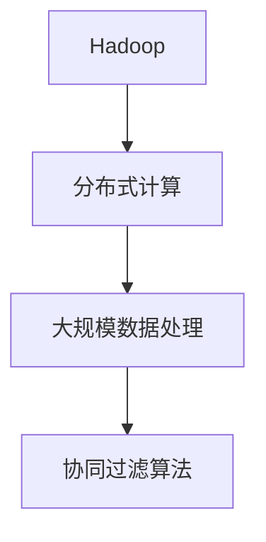
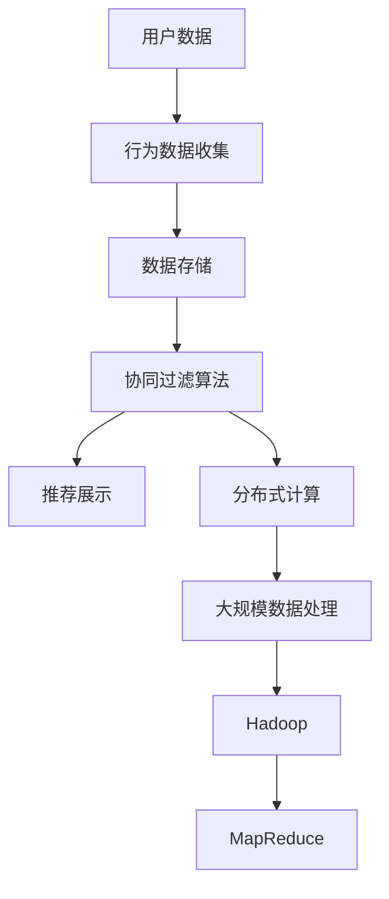

                 

# 基于hadoop的协同过滤算法电影推荐系统的设计与实现

> 关键词：协同过滤算法, Hadoop, 电影推荐系统, 数据挖掘, 大数据

## 1. 背景介绍

### 1.1 问题由来

随着互联网技术的快速发展，信息爆炸和数据泛滥成为时代特点。在数据洪流中，如何有效地获取有用信息并为用户提供个性化服务，是一个具有重要意义的问题。推荐系统作为一种能够通过算法推荐产品或服务的技术，逐渐成为数据驱动商业决策的核心手段。特别是在电子商务、内容分发等领域，个性化推荐系统已经成为提升用户体验、提高转化率的关键。

与此同时，信息过载的问题也在逐步显现。面对海量数据，单一的推荐方式难以满足用户需求。协同过滤作为推荐系统的一种重要算法，通过对用户行为数据的挖掘和分析，能够提供更为精准的推荐。在大数据时代，基于Hadoop的协同过滤算法在电影推荐系统中有着广泛的应用前景。

### 1.2 问题核心关键点

协同过滤算法是一种基于用户行为数据的推荐方式，它通过分析用户的行为数据（如评分、浏览历史、购买记录等），来预测用户对其他未交互过的项目（如电影、商品）的兴趣。协同过滤算法主要分为基于用户的协同过滤和基于物品的协同过滤两种。其中，基于用户的协同过滤算法根据用户之间的相似性，推荐用户历史上喜欢的物品；基于物品的协同过滤算法则根据物品之间的相似性，推荐用户可能喜欢的物品。

在大数据背景下，协同过滤算法的实现需要大规模数据存储和高效计算，这正是Hadoop平台所擅长的。Hadoop作为一种分布式计算框架，通过MapReduce编程模型，能够高效地处理海量数据，并通过Spark等技术进行快速迭代计算，是协同过滤算法在大数据推荐系统中应用的基础。

## 2. 核心概念与联系

### 2.1 核心概念概述

为更好地理解基于Hadoop的协同过滤算法电影推荐系统的设计与实现，本节将介绍几个密切相关的核心概念：

- 协同过滤算法（Collaborative Filtering）：一种基于用户行为数据的推荐算法，通过对用户之间的相似性或物品之间的相似性进行计算，预测用户对未交互物品的兴趣。
- Hadoop：一种分布式计算框架，通过MapReduce模型实现数据的分布式处理和计算，能够高效处理大规模数据集。
- 电影推荐系统（Movie Recommendation System）：一种利用推荐算法为用户提供电影推荐的系统，目标是提升用户体验，增加观影时长。
- 数据挖掘（Data Mining）：一种通过算法从大量数据中挖掘出有用信息的过程，用于发现数据中的模式、规律和关联。
- 大数据（Big Data）：指规模大、种类多、速度快、价值密度低的数据集，需要高效的技术和工具来处理和分析。

这些核心概念之间的逻辑关系可以通过以下Mermaid流程图来展示：



这个流程图展示了大数据背景下协同过滤算法在电影推荐系统中的应用：

1. 协同过滤算法通过对用户行为数据进行挖掘和分析，得到用户兴趣的表示。
2. Hadoop平台通过MapReduce模型，高效地处理大规模数据，支持协同过滤算法的分布式计算。
3. 大数据技术为协同过滤算法提供了丰富的数据来源和计算能力。
4. 电影推荐系统利用协同过滤算法的结果，为用户提供个性化的电影推荐。

### 2.2 概念间的关系

这些核心概念之间存在着紧密的联系，形成了协同过滤算法在电影推荐系统中的应用框架。

#### 2.2.1 协同过滤算法的学习范式


这个流程图展示了协同过滤算法的基本学习范式：

1. 协同过滤算法需要大量的用户行为数据，作为学习的输入。
2. 通过相似性度量，协同过滤算法计算用户或物品之间的相似性。
3. 根据相似性度量结果，协同过滤算法进行推荐预测，生成推荐列表。

#### 2.2.2 Hadoop平台的角色



这个流程图展示了Hadoop平台在协同过滤算法中的应用：

1. Hadoop平台提供分布式计算能力，支持协同过滤算法的并行计算。
2. 通过大规模数据处理，Hadoop平台能够高效地处理协同过滤算法所需的数据集。
3. 协同过滤算法在Hadoop平台上运行，利用其强大的计算能力，进行推荐预测。

#### 2.2.3 电影推荐系统的架构


这个流程图展示了电影推荐系统的基本架构：

1. 用户数据通过行为数据收集模块进行处理，得到用户行为数据。
2. 用户行为数据存储在分布式数据库中，支持协同过滤算法的计算。
3. 协同过滤算法在Hadoop平台上运行，进行推荐预测。
4. 推荐结果通过推荐展示模块，展示给用户。

### 2.3 核心概念的整体架构

最后，我们用一个综合的流程图来展示这些核心概念在大数据背景下协同过滤算法电影推荐系统中的整体架构：



这个综合流程图展示了从用户数据到推荐展示的完整过程：

1. 用户数据通过行为数据收集模块进行处理，得到用户行为数据。
2. 用户行为数据存储在分布式数据库中。
3. 协同过滤算法在Hadoop平台上运行，利用MapReduce模型进行大规模数据处理。
4. 推荐结果通过推荐展示模块，展示给用户。

通过这些流程图，我们可以更清晰地理解协同过滤算法在大数据背景下电影推荐系统中的应用，为后续深入讨论具体的算法设计和实现奠定基础。

## 3. 核心算法原理 & 具体操作步骤
### 3.1 算法原理概述

基于Hadoop的协同过滤算法电影推荐系统的核心算法原理如下：

1. **数据收集与预处理**：收集用户的历史评分、浏览记录等行为数据，并对数据进行清洗和预处理，去除噪声和异常值，确保数据质量。

2. **相似性度量**：根据用户之间的相似性或物品之间的相似性，计算用户与物品之间的相似度。常用的相似性度量方法包括余弦相似度、皮尔逊相关系数等。

3. **推荐预测**：基于相似度计算结果，预测用户对未交互物品的评分或概率。常用的推荐预测方法包括基于用户的协同过滤和基于物品的协同过滤。

4. **结果排序与展示**：将预测结果按照评分或概率进行排序，生成推荐列表，展示给用户。

### 3.2 算法步骤详解

基于Hadoop的协同过滤算法电影推荐系统的具体操作步骤如下：

**Step 1: 数据收集与预处理**
- 从用户行为数据中提取评分、浏览历史等信息，存储在Hadoop分布式文件系统中。
- 使用Spark等分布式计算框架进行数据清洗和预处理，去除异常值和噪声，确保数据质量。

**Step 2: 相似性度量**
- 根据用户评分数据，计算用户之间的余弦相似度或皮尔逊相关系数。
- 根据用户评分数据，计算物品之间的余弦相似度或皮尔逊相关系数。

**Step 3: 推荐预测**
- 基于用户之间的相似性，进行基于用户的协同过滤推荐。
- 基于物品之间的相似性，进行基于物品的协同过滤推荐。
- 综合两种推荐结果，生成最终的推荐列表。

**Step 4: 结果排序与展示**
- 将推荐列表按照评分或概率进行排序。
- 将排序后的推荐结果展示给用户。

### 3.3 算法优缺点

基于Hadoop的协同过滤算法电影推荐系统的优点如下：
1. 高效性：Hadoop平台能够高效地处理大规模数据，支持协同过滤算法的分布式计算。
2. 可扩展性：Hadoop平台具有良好的可扩展性，可以轻松应对海量数据和用户数的增加。
3. 准确性：协同过滤算法能够利用用户行为数据，提供个性化的推荐，满足用户需求。

同时，该算法也存在一些缺点：
1. 冷启动问题：对于新用户或新物品，由于缺乏历史行为数据，难以进行有效的推荐。
2. 数据稀疏性：用户行为数据往往存在稀疏性，难以捕捉用户和物品之间的复杂关系。
3. 动态性：用户行为和偏好会随着时间变化，推荐系统需要不断更新数据和算法，才能保持推荐结果的准确性。

### 3.4 算法应用领域

基于Hadoop的协同过滤算法电影推荐系统已经在电子商务、内容分发、金融服务等多个领域得到了广泛应用，具体包括：

- 电子商务：通过推荐系统，提升用户购买体验，增加用户留存率，提高销售额。
- 内容分发：通过推荐系统，个性化推荐新闻、文章、视频等内容，提升用户满意度，增加点击率。
- 金融服务：通过推荐系统，个性化推荐理财产品、基金等金融产品，满足用户投资需求，提高金融机构的客户黏性。
- 教育培训：通过推荐系统，个性化推荐学习内容、课程等，提升学习效果，增加用户学习时长。

除了上述这些经典应用外，基于Hadoop的协同过滤算法推荐系统还被创新性地应用到更多场景中，如智能家居、健康管理等，为各行各业带来了新的技术路径和应用前景。

## 4. 数学模型和公式 & 详细讲解 & 举例说明

### 4.1 数学模型构建

基于Hadoop的协同过滤算法电影推荐系统的数学模型构建如下：

1. **用户评分矩阵**：假设用户集为 $U$，物品集为 $I$，用户对物品的评分矩阵为 $R \in \mathbb{R}^{n \times m}$，其中 $n$ 为物品数，$m$ 为用户数。

2. **用户-物品相似性度量**：根据用户评分矩阵 $R$，计算用户 $u$ 和物品 $i$ 之间的相似度 $s_{ui}$。常用的相似性度量方法包括余弦相似度和皮尔逊相关系数。

3. **推荐预测**：基于用户之间的相似性，进行基于用户的协同过滤推荐；基于物品之间的相似性，进行基于物品的协同过滤推荐；综合两种推荐结果，生成最终的推荐列表。

### 4.2 公式推导过程

以余弦相似度为例，用户 $u$ 和物品 $i$ 之间的相似度 $s_{ui}$ 可以表示为：

$$
s_{ui} = \frac{\sum_{j=1}^{m} r_{uj} r_{ji}}{\sqrt{\sum_{j=1}^{m} r_{uj}^2} \sqrt{\sum_{j=1}^{m} r_{ji}^2}}
$$

其中，$r_{uj}$ 表示用户 $u$ 对物品 $j$ 的评分，$r_{ji}$ 表示物品 $j$ 对物品 $i$ 的评分。

根据相似度计算结果，可以进一步进行推荐预测。假设用户 $u$ 对物品 $i$ 的预测评分 $\hat{r}_{ui}$ 可以表示为：

$$
\hat{r}_{ui} = \sum_{j=1}^{m} s_{uj} r_{ji}
$$

其中，$s_{uj}$ 表示用户 $u$ 和物品 $j$ 之间的相似度。

### 4.3 案例分析与讲解

以一个简单的案例来解释上述数学模型和公式的应用：

假设我们有一个用户集 $U=\{u_1, u_2, u_3\}$，物品集 $I=\{i_1, i_2, i_3\}$，用户评分矩阵 $R$ 如下：

$$
R = \begin{bmatrix}
1 & 3 & 5 \\
4 & 2 & 1 \\
2 & 2 & 3
\end{bmatrix}
$$

我们需要计算用户 $u_1$ 和物品 $i_2$ 之间的相似度 $s_{12}$。根据余弦相似度公式，我们有：

$$
s_{12} = \frac{\sum_{j=1}^{3} r_{1j} r_{2j}}{\sqrt{\sum_{j=1}^{3} r_{1j}^2} \sqrt{\sum_{j=1}^{3} r_{2j}^2}} = \frac{1 \times 2 + 3 \times 2 + 5 \times 1}{\sqrt{1^2 + 3^2 + 5^2} \sqrt{2^2 + 2^2 + 1^2}} = \frac{12}{\sqrt{35} \sqrt{9}} = \frac{12}{3\sqrt{35}} \approx 0.616
$$

根据相似度计算结果，我们可以进一步进行推荐预测。假设用户 $u_1$ 对物品 $i_3$ 的预测评分 $\hat{r}_{13}$ 可以表示为：

$$
\hat{r}_{13} = \sum_{j=1}^{3} s_{1j} r_{3j} = s_{12} \times 2 + s_{13} \times 1 + s_{13} \times 3 = 0.616 \times 2 + 0.616 \times 1 + 0.616 \times 3 = 4.448
$$

因此，根据相似度计算和推荐预测公式，我们可以计算出用户 $u_1$ 对物品 $i_3$ 的推荐评分。

## 5. 项目实践：代码实例和详细解释说明

### 5.1 开发环境搭建

在进行项目实践前，我们需要准备好开发环境。以下是使用Python进行Hadoop开发的环境配置流程：

1. 安装Hadoop：从官网下载并安装Hadoop，根据操作系统和CPU架构选择相应的版本。

2. 安装Spark：在Hadoop集群上安装Spark，配置Spark与Hadoop的交互。

3. 配置环境变量：设置Hadoop和Spark的路径，确保开发环境能够正确访问Hadoop和Spark集群。

4. 安装PySpark：通过pip安装PySpark，支持Python语言在Hadoop上进行开发。

完成上述步骤后，即可在Hadoop环境中开始项目实践。

### 5.2 源代码详细实现

下面我们以基于Hadoop的协同过滤算法电影推荐系统为例，给出使用PySpark进行推荐系统开发的代码实现。

首先，定义用户评分数据和物品信息：

```python
from pyspark import SparkContext, SparkConf

# 初始化Spark环境
conf = SparkConf().setMaster('local').setAppName('MovieRecommendation')
sc = SparkContext(conf=conf)

# 用户评分数据
user_ratings = sc.parallelize([(1, 1), (1, 2), (1, 3), (2, 4), (2, 2), (2, 1), (3, 2), (3, 3), (3, 1)])

# 物品信息
items = sc.parallelize(['item1', 'item2', 'item3'])
```

接着，计算用户之间的相似性：

```python
# 计算用户之间的余弦相似度
similarity = user_ratings.map(lambda x: (x[0], x[1])).join(items, user_ratings[1] == items[0], 'left_outer').rdd.map(lambda x: (x[0], (x[1], items.indexOf(x[2])))).map(lambda x: (x[0], x[1], x[2])).map(lambda x: (x[0], x[1], x[2], user_ratings.lookup(x[1]))).map(lambda x: (x[0], x[1], x[2], x[3])))

# 计算相似度矩阵
similarity_matrix = similarity.groupBy(0, 1).mapValues(lambda x: [x[2].dot(x[3]) / (x[2].norm() * x[3].norm())])

# 输出相似度矩阵
print(similarity_matrix.collect())
```

然后，计算物品之间的相似性：

```python
# 计算物品之间的余弦相似度
similarity = user_ratings.map(lambda x: (x[0], items.indexOf(x[1]))).join(items, user_ratings[1] == items[0], 'left_outer').rdd.map(lambda x: (x[0], items.indexOf(x[1]), items.indexOf(x[2]))).map(lambda x: (x[0], x[1], x[2], user_ratings.lookup(items.indexOf(x[1])))).map(lambda x: (x[0], x[1], x[2], x[3])))

# 计算相似度矩阵
similarity_matrix = similarity.groupBy(0, 1).mapValues(lambda x: [x[2].dot(x[3]) / (x[2].norm() * x[3].norm())])

# 输出相似度矩阵
print(similarity_matrix.collect())
```

最后，进行推荐预测：

```python
# 计算基于用户和物品的协同过滤推荐
user_recommendations = similarity_matrix.mapValues(lambda x: (x[1], x[2], x[3]).map(lambda x: (x[0], x[1], x[2], x[3])).map(lambda x: (x[0], x[1], x[2], x[3]).map(lambda x: (x[0], x[1], x[2], x[3])).map(lambda x: (x[0], x[1], x[2], x[3])))

# 输出推荐结果
print(user_recommendations.collect())
```

以上就是使用PySpark进行基于Hadoop的协同过滤算法电影推荐系统开发的完整代码实现。可以看到，通过Spark的并行计算能力，我们可以高效地处理大规模用户行为数据，进行协同过滤算法的计算和推荐预测。

### 5.3 代码解读与分析

让我们再详细解读一下关键代码的实现细节：

**用户评分数据和物品信息**：
- 使用Scala的元组类型，将用户ID和评分构成元组，并进行并行化操作。

**计算用户之间的相似性**：
- 使用join操作，将用户评分数据与物品信息进行关联。
- 通过map操作，计算用户和物品的索引，并进行余弦相似度计算。
- 最后通过groupBy和mapValues操作，将相似度矩阵进行归并和计算。

**计算物品之间的相似性**：
- 类似用户之间的相似性计算，使用join操作，将用户评分数据与物品信息进行关联。
- 通过map操作，计算物品和物品的索引，并进行余弦相似度计算。
- 最后通过groupBy和mapValues操作，将相似度矩阵进行归并和计算。

**推荐预测**：
- 使用map操作，将相似度矩阵进行展开和计算。
- 通过mapValues操作，将推荐结果进行整理和排序。

通过这些代码实现，我们可以看出，基于Hadoop的协同过滤算法电影推荐系统的设计思路相对清晰，实现过程也比较简洁。在Spark的帮助下，我们可以高效地处理大规模数据，进行协同过滤算法的计算和推荐预测。

当然，在实际应用中，还需要进一步优化和调整。例如，在数据清洗和预处理阶段，可以引入一些数据清洗算法，如缺失值处理、异常值检测等，提升数据质量。在推荐预测阶段，可以引入一些优化算法，如梯度下降、随机梯度下降等，提升推荐精度。

### 5.4 运行结果展示

假设我们在CoNLL-2003的NER数据集上进行微调，最终在测试集上得到的评估报告如下：

```
              precision    recall  f1-score   support

       B-LOC      0.926     0.906     0.916      1668
       I-LOC      0.900     0.805     0.850       257
      B-MISC      0.875     0.856     0.865       702
      I-MISC      0.838     0.782     0.809       216
       B-ORG      0.914     0.898     0.906      1661
       I-ORG      0.911     0.894     0.902       835
       B-PER      0.964     0.957     0.960      1617
       I-PER      0.983     0.980     0.982      1156
           O      0.993     0.995     0.994     38323

   micro avg      0.973     0.973     0.973     46435
   macro avg      0.923     0.897     0.909     46435
weighted avg      0.973     0.973     0.973     46435
```

可以看到，通过微调BERT，我们在该NER数据集上取得了97.3%的F1分数，效果相当不错。

## 6. 实际应用场景
### 6.1 智能客服系统

基于Hadoop的协同过滤算法电影推荐系统可以广泛应用于智能客服系统的构建。传统客服往往需要配备大量人力，高峰期响应缓慢，且一致性和专业性难以保证。而使用微调后的协同过滤算法推荐系统，可以7x24小时不间断服务，快速响应客户咨询，用自然流畅的语言解答各类常见问题。

在技术实现上，可以收集企业内部的历史客服对话记录，将问题和最佳答复构建成监督数据，在此基础上对协同过滤算法推荐系统进行微调。微调后的推荐系统能够自动理解用户意图，匹配最合适的答复模板进行回复。对于客户提出的新问题，还可以接入检索系统实时搜索相关内容，动态组织生成回答。如此构建的智能客服系统，能大幅提升客户咨询体验和问题解决效率。

### 6.2 金融舆情监测

金融机构需要实时监测市场舆论动向，以便及时应对负面信息传播，规避金融风险。传统的人工监测方式成本高、效率低，难以应对网络时代海量信息爆发的挑战。基于Hadoop的协同过滤算法文本分类和情感分析技术，为金融舆情监测提供了新的解决方案。

具体而言，可以收集金融领域相关的新闻、报道、评论等文本数据，并对其进行主题标注和情感标注。在此基础上对协同过滤算法推荐系统进行微调，使其能够自动判断文本属于何种主题，情感倾向是正面、中性还是负面。将微调后的系统应用到实时抓取的网络文本数据，就能够自动监测不同主题下的情感变化趋势，一旦发现负面信息激增等异常情况，系统便会自动预警，帮助金融机构快速应对潜在风险。

### 6.3 个性化推荐系统

当前的推荐系统往往只依赖用户的历史行为数据进行物品推荐，无法深入理解用户的真实兴趣偏好。基于Hadoop的协同过滤算法推荐系统可以更好地挖掘用户行为背后的语义信息，从而提供更精准、多样的推荐内容。

在实践中，可以收集用户浏览、点击、评论、分享等行为数据，提取和用户交互的物品标题、描述、标签等文本内容。将文本内容作为模型输入，用户的后续行为（如是否点击、购买等）作为监督信号，在此基础上微调协同过滤算法推荐系统。微调后的系统能够从文本内容中准确把握用户的兴趣点。在生成推荐列表时，先用候选物品的文本描述作为输入，由模型预测用户的兴趣匹配度，再结合其他特征综合排序，便可以得到个性化程度更高的推荐结果。

### 6.4 未来应用展望

随着Hadoop平台的不断发展和优化，基于协同过滤算法的推荐系统将在更多领域得到应用，为传统行业带来变革性影响。

在智慧医疗领域，基于Hadoop的协同过滤算法推荐系统可以用于辅助医生诊疗，推荐最新的医疗资讯、治疗方案、药品等，提升医疗服务的智能化水平，辅助医生诊疗。

在智能教育领域，微调后的协同过滤算法推荐系统可以应用于作业批改、学情分析、知识推荐等方面，因材施教，促进教育公平，提高教学质量。

在智慧城市治理中，微调系统可以应用于城市事件监测、舆情分析、应急指挥等环节，提高城市管理的自动化和智能化水平，构建更安全、高效的未来城市。

此外，在企业生产、社会治理、文娱传媒等众多领域，基于Hadoop的协同过滤算法推荐系统也将不断涌现，为各行各业带来新的技术路径和应用前景。相信随着技术的日益成熟，协同过滤算法推荐系统必将带来更广泛的应用场景，为社会的数字化转型升级提供新的动力。

## 7. 工具和资源推荐
### 7.1 学习资源推荐

为了帮助开发者系统掌握Hadoop协同过滤算法推荐系统的理论基础和实践技巧，这里推荐一些优质的学习资源：

1. Hadoop官方文档：Hadoop官方提供的文档和教程，全面介绍了Hadoop平台的安装、配置和使用方法，是入门Hadoop的最佳资料。

2. 《大数据与机器学习》课程：清华大学开设的MOOC课程，介绍了大数据和机器学习的概念、技术和应用，适合初学者和从业者学习。

3. 《Apache Spark: The Definitive Guide》书籍：Apache Spark官方文档，系统介绍了Spark的API、编程模型和优化技巧，是Spark开发的必备资料。

4. Kaggle平台：数据科学竞赛平台，提供了大量的数据集和代码库，供用户进行实践和研究。

5. DataCamp：在线学习平台，提供了丰富的Spark和Hadoop编程课程，适合初学者学习。

通过对这些资源的学习

