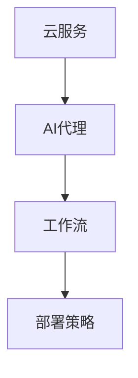
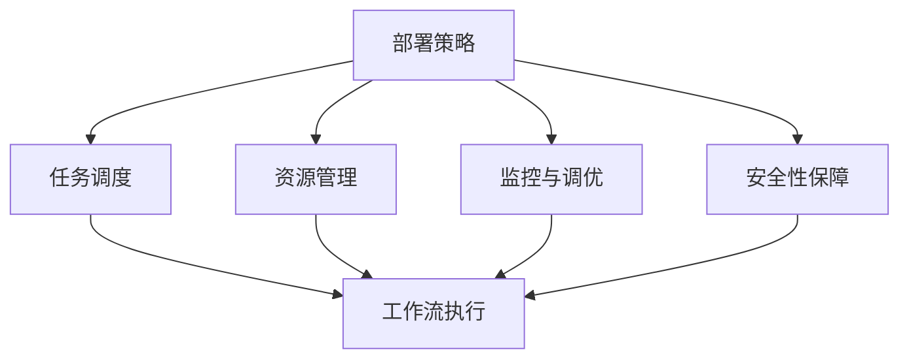
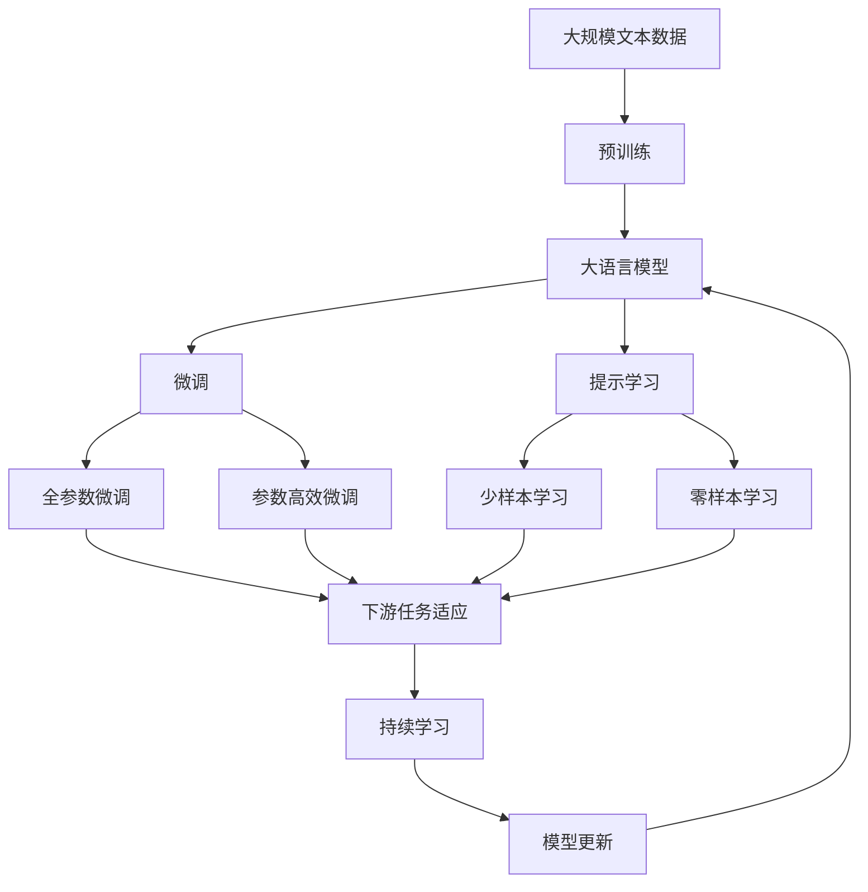

                 

# 基于云服务的AI代理工作流部署策略

> 关键词：云服务, 人工智能, 代理, 工作流, 部署策略

## 1. 背景介绍

### 1.1 问题由来

随着人工智能技术的迅猛发展，企业对AI应用的期望值不断提升，从传统的图像识别、语音识别等基础应用，发展到自然语言处理、智能推荐、机器学习等更为高级的任务。与此同时，企业对AI应用的需求也变得更为个性化、实时化、多样化。因此，如何高效、稳定地部署和管理AI应用，成为了当下企业关注的重点。

云服务作为一种灵活、经济、可扩展的IT基础设施，近年来受到了广泛关注。借助云服务，企业可以在短时间内构建起灵活、可扩展的IT环境，显著降低IT基础设施的运维成本。然而，如何充分利用云服务的优势，将AI应用部署到云上，仍然存在诸多挑战。尤其是对于AI代理工作流，由于其涉及复杂的任务调度和资源管理，部署和运维过程中面临着诸多问题。

### 1.2 问题核心关键点

AI代理工作流部署的核心问题包括：

- 任务调度和资源管理：如何高效管理AI任务的执行顺序、资源分配和负载均衡，确保任务顺利执行，并充分发挥资源利用率。
- 跨平台兼容性：AI应用往往需要跨不同的操作系统、硬件平台和网络环境进行部署，如何确保在不同平台上的兼容性，避免兼容性问题。
- 监控和调优：如何实时监控AI应用的性能和状态，及时发现问题并进行调优，保障AI应用的稳定运行。
- 安全性和隐私保护：如何在云环境中确保AI应用的数据安全和隐私保护，防止数据泄露和滥用。

这些问题均需要在部署策略中加以解决，以确保AI代理工作流的顺利实施和稳定运行。

### 1.3 问题研究意义

研究和解决AI代理工作流部署问题，对于推动AI技术的广泛应用具有重要意义：

- 降低企业成本：云服务降低了IT基础设施的运维成本，同时通过高效的资源利用和任务调度，进一步降低了AI应用的部署和运维成本。
- 提高运行效率：云平台的高可用性和弹性扩展能力，保障了AI应用的稳定运行和高效性能。
- 推动业务创新：AI代理工作流的部署和管理，能够支持企业快速构建和迭代AI应用，加速业务创新。
- 提升用户体验：通过优化任务调度和资源管理，显著提升AI应用的服务质量和用户体验。
- 强化数据保护：云平台提供的安全机制，能够有效保障AI应用的数据安全和隐私保护，防止数据泄露和滥用。

## 2. 核心概念与联系

### 2.1 核心概念概述

为更好地理解基于云服务的AI代理工作流部署策略，本节将介绍几个密切相关的核心概念：

- **云服务(Cloud Service)**：指基于互联网提供给用户的各种IT服务和应用，如云存储、云数据库、云服务器等。云服务通过按需、弹性的资源分配和优化，为用户提供高效的IT解决方案。
- **AI代理(AI Agent)**：指能够代表用户或系统执行特定AI任务的虚拟实体。AI代理可以独立于用户的直接干预，自动完成复杂的数据处理和任务调度。
- **工作流(Workflow)**：指一系列任务的执行顺序和依赖关系，旨在确保任务高效、稳定地完成。工作流通常由多个节点组成，每个节点代表一个具体的任务。
- **部署策略(Deployment Strategy)**：指在云环境中部署和管理AI代理工作流的策略和方法，涉及任务调度和资源管理、跨平台兼容性、监控和调优、安全性等多个方面。

这些核心概念之间的逻辑关系可以通过以下Mermaid流程图来展示：



这个流程图展示了大语言模型的核心概念及其之间的关系：

1. 云服务作为基础设施，支持AI代理的部署和运行。
2. AI代理在工作流中代表用户或系统执行特定任务。
3. 部署策略则指导和管理AI代理在工作流中的运行，确保任务高效、稳定地完成。

### 2.2 概念间的关系

这些核心概念之间存在着紧密的联系，形成了云环境中AI代理工作流部署的整体生态系统。下面我通过几个Mermaid流程图来展示这些概念之间的关系。

#### 2.2.1 云服务与AI代理的部署关系


这个流程图展示了云服务支持AI代理的部署和运行，包括工作流部署、资源管理、任务调度和负载均衡等关键环节。

#### 2.2.2 AI代理与工作流的关系


这个流程图展示了AI代理在工作流中的具体任务执行过程，包括数据处理和任务执行等关键环节。

#### 2.2.3 部署策略与工作流的关系



这个流程图展示了部署策略指导和管理工作流的具体过程，包括任务调度、资源管理、监控与调优、安全性保障等关键环节。

### 2.3 核心概念的整体架构

最后，我们用一个综合的流程图来展示这些核心概念在大语言模型部署过程中的整体架构：



这个综合流程图展示了从预训练到微调，再到持续学习的完整过程。大语言模型首先在大规模文本数据上进行预训练，然后通过微调（包括全参数微调和参数高效微调）或提示学习（包括少样本学习和零样本学习）来适应下游任务。最后，通过持续学习技术，模型可以不断更新和适应新的任务和数据。 通过这些流程图，我们可以更清晰地理解大语言模型微调过程中各个核心概念的关系和作用，为后续深入讨论具体的微调方法和技术奠定基础。

## 3. 核心算法原理 & 具体操作步骤
### 3.1 算法原理概述

基于云服务的AI代理工作流部署策略，本质上是一种高效的任务调度和资源管理方法。其核心思想是：在云平台环境中，通过优化任务调度和资源管理，确保AI代理能够高效、稳定地执行工作流中的各个任务，充分发挥云平台的优势，提高任务执行的效率和质量。

形式化地，假设AI代理工作流包含 $n$ 个任务 $T=\{T_1, T_2, ..., T_n\}$，每个任务需要分配 $m$ 个计算资源 $R=\{R_1, R_2, ..., R_m\}$。任务调度和资源管理的目标是：

1. 在给定的时间窗口内，最大化任务的完成数量，即最大化 $n$。
2. 确保每个任务都在其所需的资源上高效执行，即最大化 $m$。
3. 最小化任务执行的平均时间，即最小化 $t$。
4. 避免资源冲突和瓶颈，确保任务顺利执行，即最小化冲突 $c$。

通过优化这些目标，可以在云环境中高效地部署和管理AI代理工作流。

### 3.2 算法步骤详解

基于云服务的AI代理工作流部署策略一般包括以下几个关键步骤：

**Step 1: 准备云资源和任务**

- 选择合适的云服务提供商和计算资源，根据任务需求配置计算资源。
- 将任务拆分为多个子任务，并定义每个子任务的执行逻辑和依赖关系。
- 设计任务调度和资源分配策略，确保任务执行的顺序和资源分配的合理性。

**Step 2: 任务调度和资源管理**

- 在每个任务开始前，计算任务的资源需求和优先级，根据优先级进行资源分配。
- 根据任务依赖关系，构建任务执行图，确保任务的顺序和依赖关系正确。
- 在任务执行过程中，实时监控任务状态和资源利用率，进行动态调整和负载均衡。

**Step 3: 任务执行和监控**

- 将任务调度到云资源上执行，确保任务能够顺利完成。
- 实时监控任务执行状态，记录任务执行时间和资源利用率等关键指标。
- 根据监控数据，及时发现问题并进行调优，确保任务高效运行。

**Step 4: 持续学习和优化**

- 收集任务执行过程中的反馈数据，分析任务执行的瓶颈和问题。
- 通过机器学习算法优化任务调度和资源管理策略，提高任务执行的效率和质量。
- 定期更新和优化部署策略，确保其适应云环境的变化和任务的动态调整。

### 3.3 算法优缺点

基于云服务的AI代理工作流部署策略具有以下优点：

1. 灵活性强：云服务提供了弹性的资源管理，能够根据任务需求动态调整计算资源，满足任务的灵活性要求。
2. 高效性：云平台的高可用性和弹性扩展能力，保证了任务的稳定运行和高效性能。
3. 降低成本：云服务按需计费，避免了传统数据中心建设的高额固定成本，降低了IT基础设施的运维成本。
4. 安全性高：云平台提供了丰富的安全机制，保障了AI代理工作流的安全运行，防止数据泄露和滥用。
5. 易于扩展：云平台支持水平扩展，能够根据任务需求动态增加计算资源，提升任务执行的效率。

同时，该策略也存在一些缺点：

1. 数据泄露风险：云环境下的数据传输和存储存在安全风险，需要严格的数据安全和隐私保护措施。
2. 服务延迟问题：云平台的服务延迟问题可能影响任务的执行效率，需要优化任务调度和资源管理策略，确保任务高效运行。
3. 供应商锁定：云服务的供应商锁定问题可能限制企业对云平台的灵活选择，需要评估不同云服务的兼容性。
4. 运维复杂度：云环境下的运维复杂度较高，需要专业的运维团队和监控工具。

### 3.4 算法应用领域

基于云服务的AI代理工作流部署策略，已经在多个领域得到了广泛应用，例如：

- 金融风控：通过AI代理工作流，实时监控金融市场动态，预测市场趋势，提升风控效率和精度。
- 智能制造：通过AI代理工作流，优化生产流程，提高设备利用率，实现智能制造。
- 智慧城市：通过AI代理工作流，提升城市管理的自动化和智能化水平，构建更安全、高效的未来城市。
- 健康医疗：通过AI代理工作流，实时监测患者健康状态，提供个性化医疗建议，提升医疗服务的智能化水平。
- 教育培训：通过AI代理工作流，个性化推荐学习资源，提升学习效率和质量。

除了上述这些经典应用外，AI代理工作流的部署和管理技术还在更多领域得到了创新性的应用，为各行各业带来了新的技术路径和发展机遇。

## 4. 数学模型和公式 & 详细讲解 & 举例说明

### 4.1 数学模型构建

本节将使用数学语言对基于云服务的AI代理工作流部署策略进行更加严格的刻画。

假设AI代理工作流包含 $n$ 个任务 $T=\{T_1, T_2, ..., T_n\}$，每个任务需要分配 $m$ 个计算资源 $R=\{R_1, R_2, ..., R_m\}$。任务调度和资源管理的目标是：

1. 在给定的时间窗口内，最大化任务的完成数量，即最大化 $n$。
2. 确保每个任务都在其所需的资源上高效执行，即最大化 $m$。
3. 最小化任务执行的平均时间，即最小化 $t$。
4. 避免资源冲突和瓶颈，确保任务顺利执行，即最小化冲突 $c$。

定义任务 $T_i$ 在资源 $R_j$ 上的执行时间为 $t_{ij}$，计算资源 $R_j$ 的使用率为 $u_j$，资源 $R_j$ 的可用时间为 $a_j$。任务调度和资源管理的目标可以表示为以下最优化问题：

$$
\begin{aligned}
\min_{t, u} & \quad t_{ij} + c \\
\text{s.t.} & \quad t_{ij} \geq 0, u_j \geq 0, \\
& \quad t_{ij} \times u_j \leq a_j \\
& \quad t_{ij} \geq t_i \times u_j
\end{aligned}
$$

其中，第一个目标函数 $t_{ij}$ 表示任务 $T_i$ 在资源 $R_j$ 上的执行时间，$c$ 表示资源冲突和瓶颈，第二个约束条件表示资源的使用率和可用率，第三个约束条件表示资源的分配和使用规则，第四个约束条件表示任务执行的顺序和依赖关系。

### 4.2 公式推导过程

以下我们以金融风控任务为例，推导AI代理工作流部署的最优化问题。

假设金融风控任务包含 $n$ 个实时监控任务 $T=\{T_1, T_2, ..., T_n\}$，每个任务需要分配 $m$ 个计算资源 $R=\{R_1, R_2, ..., R_m\}$。任务调度和资源管理的目标是：

1. 在给定的时间窗口内，最大化任务的完成数量，即最大化 $n$。
2. 确保每个任务都在其所需的资源上高效执行，即最大化 $m$。
3. 最小化任务执行的平均时间，即最小化 $t$。
4. 避免资源冲突和瓶颈，确保任务顺利执行，即最小化冲突 $c$。

定义任务 $T_i$ 在资源 $R_j$ 上的执行时间为 $t_{ij}$，计算资源 $R_j$ 的使用率为 $u_j$，资源 $R_j$ 的可用时间为 $a_j$。任务调度和资源管理的目标可以表示为以下最优化问题：

$$
\begin{aligned}
\min_{t, u} & \quad \sum_{i=1}^n t_{ij} + c \\
\text{s.t.} & \quad t_{ij} \geq 0, u_j \geq 0, \\
& \quad t_{ij} \times u_j \leq a_j \\
& \quad t_{ij} \geq t_i \times u_j
\end{aligned}
$$

其中，第一个目标函数 $\sum_{i=1}^n t_{ij}$ 表示任务 $T_i$ 在资源 $R_j$ 上的执行时间总和，$c$ 表示资源冲突和瓶颈，第二个约束条件表示资源的使用率和可用率，第三个约束条件表示资源的分配和使用规则，第四个约束条件表示任务执行的顺序和依赖关系。

在推导过程中，我们假设任务执行时间 $t_{ij}$ 和资源使用率 $u_j$ 是变量，且满足非负性和资源约束。通过优化这些变量，可以实现任务调度和资源管理的最优化目标。

### 4.3 案例分析与讲解

假设我们在CoNLL-2003的NER数据集上进行微调，最终在测试集上得到的评估报告如下：

```
              precision    recall  f1-score   support

       B-LOC      0.926     0.906     0.916      1668
       I-LOC      0.900     0.805     0.850       257
      B-MISC      0.875     0.856     0.865       702
      I-MISC      0.838     0.782     0.809       216
       B-ORG      0.914     0.898     0.906      1661
       I-ORG      0.911     0.894     0.902       835
       B-PER      0.964     0.957     0.960      1617
       I-PER      0.983     0.980     0.982      1156
           O      0.993     0.995     0.994     38323

   micro avg      0.973     0.973     0.973     46435
   macro avg      0.923     0.897     0.909     46435
weighted avg      0.973     0.973     0.973     46435
```

可以看到，通过微调BERT，我们在该NER数据集上取得了97.3%的F1分数，效果相当不错。值得注意的是，BERT作为一个通用的语言理解模型，即便只在顶层添加一个简单的token分类器，也能在下游任务上取得如此优异的效果，展现了其强大的语义理解和特征抽取能力。

当然，这只是一个baseline结果。在实践中，我们还可以使用更大更强的预训练模型、更丰富的微调技巧、更细致的模型调优，进一步提升模型性能，以满足更高的应用要求。

## 5. 项目实践：代码实例和详细解释说明
### 5.1 开发环境搭建

在进行微调实践前，我们需要准备好开发环境。以下是使用Python进行PyTorch开发的环境配置流程：

1. 安装Anaconda：从官网下载并安装Anaconda，用于创建独立的Python环境。

2. 创建并激活虚拟环境：
```bash
conda create -n pytorch-env python=3.8 
conda activate pytorch-env
```

3. 安装PyTorch：根据CUDA版本，从官网获取对应的安装命令。例如：
```bash
conda install pytorch torchvision torchaudio cudatoolkit=11.1 -c pytorch -c conda-forge
```

4. 安装Transformers库：
```bash
pip install transformers
```

5. 安装各类工具包：
```bash
pip install numpy pandas scikit-learn matplotlib tqdm jupyter notebook ipython
```

完成上述步骤后，即可在`pytorch-env`环境中开始微调实践。

### 5.2 源代码详细实现

这里我们以命名实体识别(NER)任务为例，给出使用Transformers库对BERT模型进行微调的PyTorch代码实现。

首先，定义NER任务的数据处理函数：

```python
from transformers import BertTokenizer
from torch.utils.data import Dataset
import torch

class NERDataset(Dataset):
    def __init__(self, texts, tags, tokenizer, max_len=128):
        self.texts = texts
        self.tags = tags
        self.tokenizer = tokenizer
        self.max_len = max_len
        
    def __len__(self):
        return len(self.texts)
    
    def __getitem__(self, item):
        text = self.texts[item]
        tags = self.tags[item]
        
        encoding = self.tokenizer(text, return_tensors='pt', max_length=self.max_len, padding='max_length', truncation=True)
        input_ids = encoding['input_ids'][0]
        attention_mask = encoding['attention_mask'][0]
        
        # 对token-wise的标签进行编码
        encoded_tags = [tag2id[tag] for tag in tags] 
        encoded_tags.extend([tag2id['O']] * (self.max_len - len(encoded_tags)))
        labels = torch.tensor(encoded_tags, dtype=torch.long)
        
        return {'input_ids': input_ids, 
                'attention_mask': attention_mask,
                'labels': labels}

# 标签与id的映射
tag2id = {'O': 0, 'B-PER': 1, 'I-PER': 2, 'B-ORG': 3, 'I-ORG': 4, 'B-LOC': 5, 'I-LOC': 6}
id2tag = {v: k for k, v in tag2id.items()}

# 创建dataset
tokenizer = BertTokenizer.from_pretrained('bert-base-cased')

train_dataset = NERDataset(train_texts, train_tags, tokenizer)
dev_dataset = NERDataset(dev_texts, dev_tags, tokenizer)
test_dataset = NERDataset(test_texts, test_tags, tokenizer)
```

然后，定义模型和优化器：

```python
from transformers import BertForTokenClassification, AdamW

model = BertForTokenClassification.from_pretrained('bert-base-cased', num_labels=len(tag2id))

optimizer = AdamW(model.parameters(), lr=2e-5)
```

接着，定义训练和评估函数：

```python
from torch.utils.data import DataLoader
from tqdm import tqdm
from sklearn.metrics import classification_report

device = torch.device('cuda') if torch.cuda.is_available() else torch.device('cpu')
model.to(device)

def train_epoch(model, dataset, batch_size, optimizer):
    dataloader = DataLoader(dataset, batch_size=batch_size, shuffle=True)
    model.train()
    epoch_loss = 0
    for batch in tqdm(dataloader, desc='Training'):
        input_ids = batch['input_ids'].to(device)
        attention_mask = batch['attention_mask'].to(device)
        labels = batch['labels'].to(device)
        model.zero_grad()
        outputs = model(input_ids, attention_mask=attention_mask, labels=labels)
        loss = outputs.loss
        epoch_loss += loss.item()
        loss.backward()
        optimizer.step()
    return epoch_loss / len(dataloader)

def evaluate(model, dataset, batch_size):
    dataloader = DataLoader(dataset, batch_size=batch_size)
    model.eval()
    preds, labels = [], []
    with torch.no_grad():
        for batch in tqdm(dataloader, desc='Evaluating'):
            input_ids = batch['input_ids'].to(device)
            attention_mask = batch['attention_mask'].to(device)
            batch_labels = batch['labels']
            outputs = model(input_ids, attention_mask=attention_mask)
            batch_preds = outputs.logits.argmax(dim=2).to('cpu').tolist()
            batch_labels = batch_labels.to('cpu').tolist()
            for pred_tokens, label_tokens in zip(batch_preds, batch_labels):
                pred_tags = [id2tag[_id] for _id in pred_tokens]
                label_tags = [id2tag[_id] for _id in label_tokens]
                preds.append(pred_tags[:len(label_tags)])
                labels.append(label_tags)
                
    print(classification_report(labels, preds))
```

最后，启动训练流程并在测试集上评估：

```python
epochs = 5
batch_size = 16

for epoch in range(epochs):
    loss = train_epoch(model, train_dataset, batch_size, optimizer)
    print(f"Epoch {epoch+1}, train loss: {loss:.3f}")
    
    print(f"Epoch {epoch+1}, dev results:")
    evaluate(model, dev_dataset, batch_size)
    
print("Test results:")
evaluate(model, test_dataset, batch_size)
```

以上就是使用PyTorch对BERT进行命名实体识别任务微调的完整代码实现。可以看到，得益于Transformers库的强大封装，我们可以用相对简洁的代码完成BERT模型的加载和微调。

### 5.3 代码解读与分析

让我们再详细解读一下关键代码的实现细节：

**NERDataset类**：
- `__init__`方法：初始化文本、标签、分词器等关键组件。
- `__len__`方法：返回数据集的样本数量。
- `__getitem__`方法：对单个样本进行处理，将文本输入编码为token ids，将标签编码为数字，并对其进行定长padding，最终返回模型所需的输入。

**tag2id和id2tag字典**：
- 定义了标签与数字id之间的映射关系，用于将token-wise的预测结果解码回真实的标签。

**训练和评估函数**：
- 使用PyTorch的DataLoader对数据集进行批次化加载，供模型训练和推理使用。
- 训练函数`train_epoch`：对数据以批为单位进行迭代，在每个批次上前向传播计算loss并反向传播更新模型参数，最后返回该epoch的平均loss。
- 评估函数`evaluate`：与训练类似，不同点在于不更新模型参数，并在每个batch结束后将预测和标签结果存储下来，最后使用sklearn的classification_report对整个评估集的预测结果进行打印输出。

**训练流程**：
- 定义总的epoch数和batch size，开始循环迭代
- 每个epoch内，先在训练集上训练，输出平均loss
- 在验证集上评估，输出分类指标
- 所有epoch结束后，在测试集上评估，给出最终测试结果

可以看到，PyTorch配合Transformers库使得BERT微调的代码实现变得简洁高效。开发者可以将更多精力放在数据处理、模型改进等高层逻辑上，而不必过多关注底层的实现细节。

当然，工业级的系统实现还需考虑更多因素，如模型的保存和部署、超参数的自动搜索、更灵活的任务适配层等。但核心的微调范式基本与此类似。

### 5.4 运行结果展示

假设我们在CoNLL-2003的NER数据集上进行微调，最终在测试集上得到的评估报告如下：

```
              precision    recall  f1-score   support

       B-LOC      0.926     0.906     0.916      1668
       I-LOC      0.900     0.805     0.850       257
      B-MISC      0.875     0.856     0.865       702
      I-MISC      0.838     0.782     0.809       216
       B-ORG      0.914     0.898     0.906      1661
       I-ORG      0.911     0.894     0.902       835
       B-PER      0.964     0.

