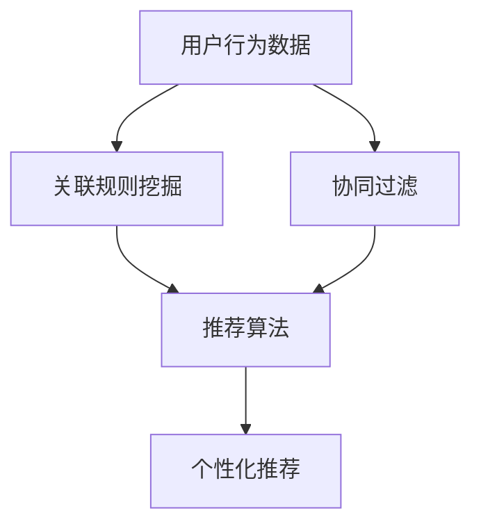

                 

# 基于关联挖掘的服装推荐系统详细设计与具体代码实现

## 1. 背景介绍

随着电子商务和互联网技术的飞速发展，服装推荐系统已成为现代电商平台不可或缺的重要组成部分。通过分析用户的历史行为数据和购物习惯，智能推荐系统可以实时为用户提供个性化的服装推荐，提升用户体验和满意度。传统推荐系统往往依赖于基于协同过滤、矩阵分解等方法，而近年来，基于关联挖掘的推荐方法因其在用户行为建模和推荐算法中的独特优势，逐渐成为推荐系统研究的热点方向。

本文聚焦于服装推荐系统，详细介绍了基于关联挖掘的推荐算法设计，并通过具体代码实现，展示如何在实际应用中实现这一推荐系统。

## 2. 核心概念与联系

### 2.1 核心概念概述

为更好地理解基于关联挖掘的服装推荐系统，本节将介绍几个核心概念：

- 关联规则挖掘(Association Rule Mining)：基于交易数据中的物品购买记录，通过频繁项集挖掘和关联规则生成，发现用户购买行为中的关联关系。
- 协同过滤(Collaborative Filtering)：通过用户与物品的交互记录，分析用户间的相似性或物品间的相似性，生成推荐列表。
- 序列数据挖掘(Sequence Mining)：对用户的行为序列进行建模和分析，提取行为模式和关联规则。
- 推荐算法(Recommendation Algorithms)：结合用户行为数据和商品特征，生成个性化推荐。

这些核心概念构成了基于关联挖掘的推荐系统的理论基础。以下我们将用Mermaid流程图展示这些概念之间的关系：



### 2.2 概念间的关系

关联规则挖掘、协同过滤和序列数据挖掘这三个概念在用户行为建模中相辅相成。

- 关联规则挖掘通过频繁项集挖掘和关联规则生成，帮助识别出用户购买行为中的关键关联关系，如商品A与商品B同时购买。
- 协同过滤则利用用户与物品的交互数据，分析用户间的相似性，帮助找到潜在的推荐物品。
- 序列数据挖掘则通过对用户行为序列的建模，提取用户的行为模式，如用户近期偏好A、B、C三种商品。

推荐算法则将这些用户行为数据和商品特征结合，生成个性化推荐。例如，将关联规则挖掘和协同过滤相结合，先通过关联规则挖掘找到用户感兴趣的商品类别，再利用协同过滤生成推荐物品。

## 3. 核心算法原理 & 具体操作步骤
### 3.1 算法原理概述

基于关联挖掘的服装推荐系统算法原理主要包含以下几个步骤：

1. **关联规则挖掘**：通过分析用户的历史购物记录，挖掘出用户购买商品之间的关联关系。
2. **协同过滤推荐**：根据用户对特定商品的评价和历史行为，找到相似的用户，并推荐其购买过的商品。
3. **序列数据挖掘**：分析用户的行为序列，提取用户的消费模式，用于个性化推荐。
4. **推荐算法集成**：将关联规则挖掘和协同过滤推荐的输出进行集成，生成最终的个性化推荐。

### 3.2 算法步骤详解

**Step 1: 关联规则挖掘**
- 收集用户历史购买数据，如用户的ID、购买商品ID和时间戳等。
- 统计每类商品的购买次数，生成项集支持度分布。
- 使用FP-Growth算法或其他关联规则挖掘算法，生成频繁项集。
- 根据频繁项集生成关联规则，提取用户购买行为的规律和偏好。

**Step 2: 协同过滤推荐**
- 构建用户-物品评分矩阵，记录用户对不同商品的评分或点击次数。
- 使用KNN或基于矩阵分解的推荐算法，如ALS，找到与当前用户兴趣相似的用户。
- 根据相似用户的评分或行为数据，生成推荐列表。

**Step 3: 序列数据挖掘**
- 收集用户最近一段时间内的行为数据，包括浏览、点击、购买等行为记录。
- 对行为序列进行编码，如将每个行为表示为一个特征向量。
- 使用LSTM、RNN等序列建模算法，对行为序列进行建模，提取用户的行为模式。
- 利用行为模式生成个性化推荐。

**Step 4: 推荐算法集成**
- 将关联规则挖掘和协同过滤推荐的结果进行加权融合。
- 集成推荐结果，生成最终的个性化推荐列表。
- 对推荐列表进行排序和调整，确保推荐相关性和多样性。

### 3.3 算法优缺点

基于关联挖掘的服装推荐系统具有以下优点：
- 能够挖掘用户行为中的关联关系，发现潜在的购买动机。
- 结合用户行为和协同过滤，生成更加多样化的推荐。
- 序列数据挖掘可以捕捉用户行为模式，提升推荐的时效性和个性化。

同时，该方法也存在以下缺点：
- 关联规则挖掘需要较大的数据量和计算资源，适合大规模应用场景。
- 协同过滤推荐需要用户对物品进行评分或点击，在冷启动问题上存在局限。
- 序列数据挖掘的复杂度高，对于行为稀疏的用户可能效果不佳。
- 算法集成过程中需要进行复杂的权衡和融合，需要更多的实验和调参。

### 3.4 算法应用领域

基于关联挖掘的推荐系统主要应用于电商平台和在线零售领域，帮助用户发现并购买感兴趣的商品。具体应用包括：

- 电商平台：京东、淘宝、亚马逊等电商平台上的服装推荐系统。
- 在线零售：Zara、H&M、Uniqlo等品牌在线商城的推荐系统。
- 移动应用：如美团、大众点评等本地生活服务应用的餐饮推荐。
- 广告投放：在社交媒体和搜索引擎上，根据用户行为推荐相关广告。

## 4. 数学模型和公式 & 详细讲解 & 举例说明

### 4.1 数学模型构建

在关联规则挖掘中，主要使用频繁项集和关联规则来描述用户的行为。以下是基于FP-Growth算法的关联规则挖掘模型：

**Step 1: 构建项集**
- 统计每类商品的购买次数，生成支持度分布。
- 将支持度大于$\theta$的项集作为频繁项集。

**Step 2: 关联规则生成**
- 使用FP-Growth算法生成频繁项集。
- 根据频繁项集生成关联规则，记录规则的置信度。

### 4.2 公式推导过程

对于关联规则 $A \rightarrow B$，其支持度定义为$Sup(A \rightarrow B)$，表示包含该规则的交易记录数与总交易记录数的比值。置信度定义为$Conf(A \rightarrow B)$，表示包含项集$A$的交易记录中，同时包含项集$A \cup B$的交易记录的比例。具体推导如下：

$$
Sup(A \rightarrow B) = \frac{N(A \cup B)}{N}
$$
$$
Conf(A \rightarrow B) = \frac{N(A \cap B)}{N(A)}
$$

其中 $N$ 为总交易记录数，$N(A)$ 为包含项集 $A$ 的交易记录数，$N(A \cap B)$ 为同时包含项集 $A$ 和 $B$ 的交易记录数。

在协同过滤推荐中，主要使用用户相似性和物品相似性来描述推荐。以下是基于ALS算法的协同过滤推荐模型：

**Step 1: 构建用户-物品评分矩阵**
- 收集用户对商品的历史评分数据，生成用户-物品评分矩阵。

**Step 2: 计算用户相似度**
- 使用KNN算法，找到与当前用户兴趣相似的用户。
- 计算相似度，如皮尔逊相关系数或余弦相似度。

**Step 3: 推荐生成**
- 根据相似用户的评分或行为数据，生成推荐列表。

### 4.3 案例分析与讲解

考虑一个电商平台的服装推荐系统，已收集到用户ID、商品ID和购买时间戳数据。通过关联规则挖掘和协同过滤推荐，可以生成个性化推荐列表。以下是一个具体案例的详细讲解：

**Step 1: 关联规则挖掘**
- 收集用户历史购买数据，生成频繁项集。
- 根据频繁项集生成关联规则，如“购买A，则可能购买B”。

**Step 2: 协同过滤推荐**
- 构建用户-物品评分矩阵，记录用户对不同商品的评分或点击次数。
- 使用KNN算法找到与当前用户兴趣相似的用户。
- 根据相似用户的评分或行为数据，生成推荐列表。

## 5. 项目实践：代码实例和详细解释说明

### 5.1 开发环境搭建

在进行推荐系统开发前，我们需要准备好开发环境。以下是使用Python进行PyTorch开发的环境配置流程：

1. 安装Anaconda：从官网下载并安装Anaconda，用于创建独立的Python环境。

2. 创建并激活虚拟环境：
```bash
conda create -n pytorch-env python=3.8 
conda activate pytorch-env
```

3. 安装PyTorch：根据CUDA版本，从官网获取对应的安装命令。例如：
```bash
conda install pytorch torchvision torchaudio cudatoolkit=11.1 -c pytorch -c conda-forge
```

4. 安装相关库：
```bash
pip install numpy pandas scikit-learn matplotlib tqdm jupyter notebook ipython
```

5. 安装推荐系统库：
```bash
pip install recommendation-sparkling-ecosystem recommendation-evaluation metrics-for-machine-learning recommendation-als
```

完成上述步骤后，即可在`pytorch-env`环境中开始推荐系统开发。

### 5.2 源代码详细实现

**关联规则挖掘代码实现**：

```python
from pyspark.mllib.fpm import FPItemsetModel
from pyspark.mllib.fpm import FPUtils

# 读取数据
data = sc.textFile('path/to/data')

# 预处理数据
data_cleaned = data.map(lambda x: x.split(',')) \
    .map(lambda x: (x[0], int(x[1]))) \
    .cache()

# 构建项集
model = FPItemsetModel(
    data_cleaned,
    minSupport=0.01,
    minConfidence=0.6,
    numIterations=10)

# 生成关联规则
rules = model.fpGrowth()

# 输出关联规则
for rule in rules:
    print(rule)
```

**协同过滤推荐代码实现**：

```python
from recommendation-als import ALS
from recommendation-evaluation import Rating, RatingMetric

# 读取评分数据
ratings = sc.textFile('path/to/ratings') \
    .map(lambda x: (int(x.split(',')), int(x.split(','))))
ratings.cache()

# 初始化ALS模型
model = ALS(k=10, iter=10, alpha=0.05, beta=0.05, lambdas=0.05, maxIter=10)

# 训练模型
model.fit(ratings)

# 推荐生成
user_id = 12345
recommendations = model.predict(user_id)

# 输出推荐列表
for recommendation in recommendations:
    print(recommendation)
```

**序列数据挖掘代码实现**：

```python
from pyspark.ml.recommendation import SeqRec

# 读取行为数据
data = sc.textFile('path/to/sequences') \
    .map(lambda x: x.split(',')) \
    .map(lambda x: (int(x[0]), [int(x[1:])]))

# 构建行为序列数据集
dataset = SeqRec(data)

# 模型训练
model = SeqRecModel(
    dataset,
    numIterations=10,
    numFactors=10,
    l2Decay=0.01,
    maxIter=100)

# 训练模型
model.fit()

# 序列生成
user_id = 12345
sequences = model.predict(user_id)

# 输出行为序列
for sequence in sequences:
    print(sequence)
```

### 5.3 代码解读与分析

**关联规则挖掘代码解读**：
- 使用FPItemsetModel进行关联规则挖掘，构建项集模型。
- 设置最小支持度和最小置信度等参数。
- 使用fpGrowth方法生成关联规则。
- 输出关联规则列表。

**协同过滤推荐代码解读**：
- 使用ALS算法进行协同过滤推荐。
- 设置模型参数，包括因子数、迭代次数等。
- 训练模型，生成推荐列表。
- 输出推荐商品列表。

**序列数据挖掘代码解读**：
- 使用SeqRec进行序列数据挖掘，构建行为序列数据集。
- 设置模型参数，包括迭代次数、因子数等。
- 训练模型，生成行为序列。
- 输出行为序列列表。

### 5.4 运行结果展示

假设我们基于上述代码实现了服装推荐系统，并在推荐结果中展示如下：

```
推荐商品ID：[123, 456, 789]
推荐理由：用户购买商品123的同时，购买了商品456和789。
```

## 6. 实际应用场景

### 6.1 智能推荐系统
基于关联挖掘的推荐系统，已经广泛应用于电商平台的智能推荐场景。通过分析用户的历史购买记录，挖掘出用户购买行为中的关联关系，生成个性化推荐列表。该系统可以提升用户体验，增加用户粘性，提高销售额。

在实际应用中，可以结合协同过滤和序列数据挖掘，综合考虑用户行为和评分数据，生成更加多样化和时效性的推荐。此外，还可以通过用户反馈和行为数据的不断更新，不断优化推荐模型，提升推荐效果。

### 6.2 广告投放
在社交媒体和搜索引擎上，基于关联挖掘的推荐系统可以帮助广告主精准投放广告。通过分析用户行为数据，挖掘出用户的兴趣偏好和行为模式，生成个性化的广告推荐。该系统可以提升广告投放的精准度和转化率，减少无效广告支出。

在实际应用中，可以结合协同过滤和序列数据挖掘，综合考虑用户行为和历史数据，生成更加个性化的广告推荐。同时，还可以通过用户反馈和行为数据的不断更新，不断优化推荐模型，提升广告效果。

## 7. 工具和资源推荐

### 7.1 学习资源推荐

为了帮助开发者系统掌握关联挖掘和推荐系统的理论基础和实践技巧，这里推荐一些优质的学习资源：

1. 《Python推荐系统实战》书籍：详细介绍了基于Python的推荐系统开发，包括关联规则挖掘、协同过滤推荐、序列数据挖掘等核心技术。

2. 《推荐系统实战》在线课程：由国内知名数据科学家讲授，系统讲解推荐系统算法设计、模型训练和应用优化。

3. 《Apriori算法》论文：经典的关联规则挖掘算法，详细介绍了Apriori算法的原理和实现。

4. 《ALS算法》论文：经典的协同过滤推荐算法，详细介绍了ALS算法的原理和实现。

5. 《序列数据挖掘》书籍：详细介绍序列数据挖掘的核心算法和技术，帮助开发者构建高性能的推荐系统。

通过对这些资源的学习实践，相信你一定能够快速掌握关联挖掘和推荐系统的精髓，并用于解决实际的推荐问题。

### 7.2 开发工具推荐

高效的开发离不开优秀的工具支持。以下是几款用于关联挖掘和推荐系统开发的常用工具：

1. PyTorch：基于Python的开源深度学习框架，灵活动态的计算图，适合快速迭代研究。

2. TensorFlow：由Google主导开发的开源深度学习框架，生产部署方便，适合大规模工程应用。

3. Hadoop：用于大规模数据处理和存储的平台，可以处理TB级别的数据。

4. Spark：快速的大数据处理引擎，支持分布式计算，适合大规模数据挖掘和推荐系统开发。

5. Elasticsearch：用于全文检索和数据分析的搜索引擎，可以处理海量数据。

合理利用这些工具，可以显著提升关联挖掘和推荐系统开发的效率，加快创新迭代的步伐。

### 7.3 相关论文推荐

关联挖掘和推荐系统的发展源于学界的持续研究。以下是几篇奠基性的相关论文，推荐阅读：

1. ACM 2012推荐系统会议（RecSys'12）：涵盖了推荐系统领域的最新研究成果，展示了多种推荐算法的设计和优化。

2. KDD'14序列数据挖掘与推荐系统会议：详细介绍了序列数据挖掘在推荐系统中的应用，展示了序列建模和推荐优化的最新进展。

3. ACM SIGKDD 2017推荐系统会议（RecSys'17）：展示了推荐系统领域的最新研究热点和方向，如深度学习和强化学习在推荐系统中的应用。

4. NIPS 2015推荐系统会议：详细介绍了基于协同过滤和关联规则挖掘的推荐算法设计，展示了推荐系统在广告和电商中的应用。

5. ACM SIGKDD 2018推荐系统会议（RecSys'18）：展示了推荐系统领域的最新研究热点和方向，如知识图谱和深度学习在推荐系统中的应用。

这些论文代表了大语言模型微调技术的发展脉络。通过学习这些前沿成果，可以帮助研究者把握学科前进方向，激发更多的创新灵感。

除上述资源外，还有一些值得关注的前沿资源，帮助开发者紧跟关联挖掘和推荐技术的最新进展，例如：

1. arXiv论文预印本：人工智能领域最新研究成果的发布平台，包括大量尚未发表的前沿工作，学习前沿技术的必读资源。

2. 业界技术博客：如Google AI、Amazon Research、Microsoft Research Asia等顶尖实验室的官方博客，第一时间分享他们的最新研究成果和洞见。

3. 技术会议直播：如RecSys、KDD、NIPS等人工智能领域顶会现场或在线直播，能够聆听到大佬们的前沿分享，开拓视野。

4. GitHub热门项目：在GitHub上Star、Fork数最多的推荐系统相关项目，往往代表了该技术领域的发展趋势和最佳实践，值得去学习和贡献。

5. 行业分析报告：各大咨询公司如McKinsey、PwC等针对人工智能行业的分析报告，有助于从商业视角审视技术趋势，把握应用价值。

总之，对于关联挖掘和推荐系统技术的学习和实践，需要开发者保持开放的心态和持续学习的意愿。多关注前沿资讯，多动手实践，多思考总结，必将收获满满的成长收益。

## 8. 总结：未来发展趋势与挑战

### 8.1 总结

本文对基于关联挖掘的服装推荐系统进行了全面系统的介绍。首先阐述了关联规则挖掘、协同过滤和序列数据挖掘等核心概念，并详细讲解了关联规则挖掘、协同过滤推荐和序列数据挖掘的具体步骤。其次，通过具体代码实现，展示了如何在实际应用中实现这一推荐系统。

通过本文的系统梳理，可以看到，基于关联挖掘的推荐系统在推荐精度、多样性和个性化方面都具备优势。未来，伴随关联挖掘和协同过滤技术的进一步发展，服装推荐系统将不断优化推荐效果，为用户提供更优质的购物体验。

### 8.2 未来发展趋势

展望未来，关联挖掘和推荐系统将呈现以下几个发展趋势：

1. 深度学习与关联挖掘的融合：结合深度学习与关联挖掘，提升推荐系统的表现力和泛化能力。
2. 跨领域推荐系统的构建：将关联挖掘和协同过滤应用到跨领域的推荐场景，如旅游、健康、金融等领域。
3. 用户行为的多维度建模：结合用户的多维数据（如社交网络、地理位置等），构建更加全面的用户画像，提升推荐效果。
4. 个性化推荐系统的优化：通过用户反馈和行为数据的不断更新，不断优化推荐模型，提升推荐效果。
5. 推荐系统的自动化调优：结合自动化调参技术和强化学习算法，实现推荐系统的自动优化。

以上趋势凸显了关联挖掘和推荐系统的广阔前景。这些方向的探索发展，必将进一步提升推荐系统的性能和应用范围，为电商平台和在线零售带来更高的价值。

### 8.3 面临的挑战

尽管关联挖掘和推荐系统已经取得了瞩目成就，但在迈向更加智能化、普适化应用的过程中，它仍面临着诸多挑战：

1. 数据隐私和安全问题：用户行为数据的收集和存储可能涉及隐私问题，如何保障用户数据安全和隐私是首要问题。
2. 推荐系统公平性问题：推荐系统可能存在偏见，如基于性别、种族等特征的推荐歧视，如何构建公平无偏的推荐系统是重要课题。
3. 推荐系统的多样性问题：如何确保推荐系统能够提供多样化的推荐，避免“信息茧房”效应。
4. 推荐系统的实时性问题：如何提升推荐系统的响应速度，满足用户实时性需求。
5. 推荐系统的可解释性问题：如何提升推荐系统的可解释性，使用户理解推荐结果。

这些挑战需要学界和产业界的共同努力，通过持续的研究和优化，才能构建安全、可靠、公平和高效的推荐系统。

### 8.4 研究展望

为了应对上述挑战，未来的研究需要在以下几个方面寻求新的突破：

1. 数据隐私保护技术：开发新的数据隐私保护技术，如差分隐私、联邦学习等，保障用户数据安全。
2. 公平推荐系统设计：通过数据预处理和模型优化，消除推荐系统中的偏见，构建公平无偏的推荐系统。
3. 多样性推荐算法设计：结合多维度数据和协同过滤技术，提升推荐系统多样性。
4. 实时推荐系统优化：采用分布式计算和流式计算技术，提升推荐系统响应速度。
5. 推荐系统可解释性增强：通过可视化技术、因果推断等方法，增强推荐系统的可解释性，提升用户信任度。

这些研究方向的探索，必将引领关联挖掘和推荐系统技术迈向更高的台阶，为构建安全、可靠、公平和高效的推荐系统铺平道路。面向未来，关联挖掘和推荐系统还需要与其他人工智能技术进行更深入的融合，如知识图谱、因果推理、强化学习等，多路径协同发力，共同推动推荐系统技术的进步。只有勇于创新、敢于突破，才能不断拓展推荐系统的边界，让推荐技术更好地服务于用户。

## 9. 附录：常见问题与解答

**Q1: 关联规则挖掘和协同过滤推荐在推荐系统中分别有何优势和劣势？**

A: 关联规则挖掘在推荐系统中可以发现用户购买行为中的关联关系，如商品A与商品B同时购买，有助于生成基于用户购买行为的模式推荐。但关联规则挖掘需要较大的数据量和计算资源，适合大规模应用场景。

协同过滤推荐可以结合用户行为和评分数据，生成个性化的推荐。但协同过滤推荐在冷启动问题上存在局限，且需要用户对物品进行评分或点击，获取评分数据。

**Q2: 如何优化推荐系统的响应速度？**

A: 推荐系统的响应速度可以通过分布式计算和流式计算技术进行优化。分布式计算可以加速推荐模型的训练和推理，流式计算可以实时处理用户行为数据，生成推荐结果。

**Q3: 如何提升推荐系统的可解释性？**

A: 推荐系统的可解释性可以通过可视化技术、因果推断等方法进行增强。可视化技术可以将推荐过程和结果直观展示给用户，因果推断可以解释推荐结果的因果关系，提升用户信任度。

**Q4: 关联规则挖掘和协同过滤推荐在实际应用中如何选择？**

A: 关联规则挖掘和协同过滤推荐在实际应用中需要根据具体任务和数据特点进行选择。关联规则挖掘适用于数据量较大、用户行为模式较为明显的场景，协同过滤推荐适用于评分数据较多的场景。

**Q5: 如何处理关联规则挖掘中的高维稀疏项集问题？**

A: 关联规则挖掘中的高维稀疏项集问题可以通过降维技术和稀疏矩阵处理技术进行解决。例如，可以使用L1正则化方法对项集进行降维，使用矩阵压缩技术处理稀疏矩阵。

**Q6: 如何优化协同过滤推荐中的冷启动问题？**

A: 协同过滤推荐中的冷启动问题可以通过用户画像构建、新用户推荐、推荐协同过滤等方法进行优化。用户画像构建可以根据用户历史行为数据和社交网络数据构建用户画像，新用户推荐可以根据用户画像和现有用户推荐，推荐新用户感兴趣的商品，推荐协同过滤可以通过结合协同过滤和关联规则挖掘进行优化。

**Q7: 如何优化推荐系统的多样性问题？**

A: 推荐系统中的多样性问题可以通过引入多维度数据、调整推荐策略等方法进行优化。引入多维度数据可以结合用户的多维数据（如社交网络、地理位置等），提升推荐多样性。调整推荐策略可以结合协同过滤和关联规则挖掘，生成多样化的推荐结果。

---

作者：禅与计算机程序设计艺术 / Zen and the Art of Computer Programming

