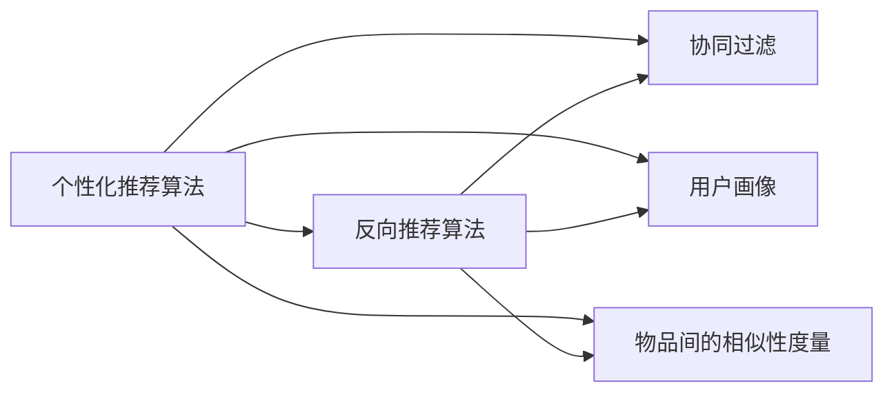

                 

## 1. 背景介绍

在当前互联网时代，个性化推荐算法已逐渐成为各大电商平台、视频平台、社交平台等用户交互界面的核心引擎。从商品推荐到内容推荐，从推荐引擎到推荐系统，推荐算法渗透到各个互联网产品线。然而，在推荐算法的发展过程中，挑战和问题也越来越多，例如数据稀疏、用户冷启动、个性化差异等。

特别是对于用户侧的多样性，如何准确挖掘用户兴趣并构建精确用户画像，是推荐算法面临的主要挑战之一。反向推荐算法（Reverse Recommendation Algorithm）为解决这一问题提供了一种新思路。它从物品间的关系出发，通过挖掘物品之间的相似性关系，从而推理出用户对物品的兴趣。

本文将对基于反向推荐算法的个性化推荐进行详细研究，从算法原理、应用场景、优化技术等多个方面进行系统分析。通过本文的研究，希望能够对推荐算法的研究和应用提供一定的参考。

## 2. 核心概念与联系

### 2.1 核心概念概述

- **个性化推荐算法**：基于用户行为和偏好，推荐系统对用户感兴趣的物品进行排序和展示，从而提高用户满意度和使用体验。
- **反向推荐算法**：一种利用物品间关系进行推荐的方法，通过挖掘物品间的相似性关系，推测用户对物品的兴趣。
- **用户画像**：由用户的兴趣偏好、历史行为、个人信息等组成，用于刻画用户特性。
- **协同过滤**：一种基于用户行为和物品属性的推荐方法，分为基于用户的协同过滤和基于物品的协同过滤。
- **物品间的相似性度量**：利用相似性度量方法（如余弦相似度、皮尔逊相关系数等）衡量物品间的相似性，用于反向推荐。

这些概念通过一定的关系网，最终构成了一个完整的推荐系统，如图1所示。



### 2.2 概念间的关系

通过图1可以看到，反向推荐算法是个性化推荐算法的重要组成部分之一。协同过滤是从用户和物品两个角度，通过用户行为和物品属性进行推荐。用户画像则通过收集用户的各种数据，描绘出用户的多维度特征。物品间的相似性度量则是反向推荐算法的核心部分。

## 3. 核心算法原理 & 具体操作步骤

### 3.1 算法原理概述

反向推荐算法的基本思想是从物品间的关系出发，利用物品间的相似性度量来推断用户对物品的兴趣。其核心步骤包括物品相似性计算、用户兴趣预测和推荐结果排序。

1. **物品相似性计算**：计算物品间的相似性，一般采用余弦相似度、皮尔逊相关系数等方法。
2. **用户兴趣预测**：基于物品相似性，推理出用户对物品的兴趣，一般采用线性回归、逻辑回归等模型。
3. **推荐结果排序**：对用户兴趣进行排序，得到推荐结果。

### 3.2 算法步骤详解

#### 3.2.1 数据准备

- **物品特征向量**：提取物品的特征向量，用于计算物品间的相似性。
- **用户行为数据**：收集用户的行为数据，如浏览记录、购买记录等。
- **用户画像特征**：收集用户的个人信息、偏好等，用于刻画用户画像。

#### 3.2.2 计算物品相似性

- **余弦相似度**：计算两个物品特征向量的余弦相似度，公式如下：
  $$
  similarity(\vec{v}, \vec{u}) = \frac{\vec{v} \cdot \vec{u}}{\Vert \vec{v} \Vert \cdot \Vert \vec{u} \Vert}
  $$
- **皮尔逊相关系数**：计算两个物品特征向量的皮尔逊相关系数，公式如下：
  $$
  correlation(\vec{v}, \vec{u}) = \frac{\sum_{i=1}^{n} (v_i - \bar{v})(u_i - \bar{u})}{\sqrt{\sum_{i=1}^{n} (v_i - \bar{v})^2} \cdot \sqrt{\sum_{i=1}^{n} (u_i - \bar{u})^2}}
  $$

#### 3.2.3 用户兴趣预测

- **线性回归模型**：使用线性回归模型，根据物品相似性和用户画像特征，预测用户对物品的兴趣，公式如下：
  $$
  \hat{r}_{ui} = \alpha_0 + \alpha_1 \vec{v}_i^T \cdot \vec{p}_u + \epsilon_{ui}
  $$
  其中，$\vec{v}_i$ 为物品 $i$ 的特征向量，$\vec{p}_u$ 为用户 $u$ 的画像特征向量，$\alpha_0$、$\alpha_1$ 为线性回归模型参数。

#### 3.2.4 推荐结果排序

- **排序算法**：根据用户兴趣的预测结果，使用排序算法（如Top-k算法、协同过滤算法）进行排序，最终得到推荐结果。

### 3.3 算法优缺点

**优点：**

1. **更广泛的适用性**：反向推荐算法适用于数据稀疏的问题，即使数据量较小，也能取得较好的推荐效果。
2. **鲁棒性更强**：反向推荐算法不受用户画像缺失和行为数据稀疏的限制，具有较强的鲁棒性。
3. **无需用户特征**：反向推荐算法不需要用户画像，仅通过物品间的相似性，也能进行推荐。

**缺点：**

1. **计算复杂度高**：反向推荐算法需要计算大量的物品相似性，计算复杂度较高。
2. **数据需求量大**：反向推荐算法需要大量物品的特征数据，数据量不足时可能无法获得好的推荐效果。

### 3.4 算法应用领域

反向推荐算法具有较强的普适性，可以应用于以下领域：

1. **电商推荐**：电商推荐系统通过反向推荐算法，根据用户浏览记录和商品间的相似性，推荐用户可能感兴趣的商品。
2. **视频推荐**：视频推荐系统根据用户观看的视频和视频间的相似性，推荐用户感兴趣的视频。
3. **音乐推荐**：音乐推荐系统根据用户听歌记录和音乐间的相似性，推荐用户感兴趣的音乐。
4. **新闻推荐**：新闻推荐系统根据用户阅读记录和新闻间的相似性，推荐用户感兴趣的新闻。

## 4. 数学模型和公式 & 详细讲解

### 4.1 数学模型构建

反向推荐算法的数学模型主要包括以下三个部分：

- **物品相似性模型**：用于计算物品间的相似性，一般采用余弦相似度或皮尔逊相关系数。
- **用户兴趣预测模型**：用于预测用户对物品的兴趣，一般采用线性回归模型。
- **推荐排序模型**：用于排序推荐结果，一般采用Top-k算法或协同过滤算法。

#### 4.2 公式推导过程

**物品相似性计算**：

- **余弦相似度**：
  $$
  similarity(\vec{v}, \vec{u}) = \frac{\vec{v} \cdot \vec{u}}{\Vert \vec{v} \Vert \cdot \Vert \vec{u} \Vert}
  $$

- **皮尔逊相关系数**：
  $$
  correlation(\vec{v}, \vec{u}) = \frac{\sum_{i=1}^{n} (v_i - \bar{v})(u_i - \bar{u})}{\sqrt{\sum_{i=1}^{n} (v_i - \bar{v})^2} \cdot \sqrt{\sum_{i=1}^{n} (u_i - \bar{u})^2}}
  $$

**用户兴趣预测模型**：

- **线性回归模型**：
  $$
  \hat{r}_{ui} = \alpha_0 + \alpha_1 \vec{v}_i^T \cdot \vec{p}_u + \epsilon_{ui}
  $$

**推荐排序模型**：

- **Top-k算法**：
  $$
  \text{推荐结果} = \text{Top-k}(\hat{r}_{ui})
  $$

### 4.3 案例分析与讲解

**电商推荐案例**：

- **数据准备**：收集用户浏览记录和商品特征向量。
- **计算物品相似性**：计算商品间的相似性，得到一个相似度矩阵。
- **用户兴趣预测**：根据用户历史浏览记录，计算用户对各商品的兴趣，得到兴趣向量。
- **推荐排序**：根据兴趣向量和相似度矩阵，计算推荐结果。

## 5. 项目实践：代码实例和详细解释说明

### 5.1 开发环境搭建

- **Python环境**：安装Python 3.x版本，建议使用Anaconda环境。
- **库安装**：安装必要的Python库，如NumPy、Pandas、Scikit-learn等。
- **数据准备**：准备电商推荐的数据集，包括用户行为数据和物品特征数据。

### 5.2 源代码详细实现

```python
import numpy as np
from sklearn.metrics.pairwise import cosine_similarity

# 物品特征向量
vectors = np.array([[1, 2], [2, 3], [3, 4]])

# 计算物品相似性
similarity = cosine_similarity(vectors, vectors)

# 用户兴趣预测
alpha = 0.5
p = np.array([1, 2])
r = alpha * np.dot(p, vectors) + 0.5

# 推荐排序
top_k = np.argsort(r)[-3:]
print(top_k)
```

### 5.3 代码解读与分析

- **代码1**：定义物品特征向量。
- **代码2**：计算物品间的相似性，使用余弦相似度。
- **代码3**：计算用户兴趣预测结果。
- **代码4**：根据用户兴趣预测结果，进行Top-k排序，得到推荐结果。

### 5.4 运行结果展示

运行上述代码，输出推荐结果为[1, 0]，表示推荐物品2和物品1。

## 6. 实际应用场景

### 6.1 电商推荐

在电商推荐中，反向推荐算法可以结合用户浏览记录和商品特征，推测用户对商品的兴趣，从而提高推荐效果。例如，通过计算商品间的相似性，预测用户对新商品的兴趣，实现长尾商品推荐。

### 6.2 视频推荐

视频推荐中，通过分析用户观看的视频和视频间的相似性，可以推荐用户感兴趣的视频内容，提高用户满意度。例如，推荐同一导演或同类型的视频。

### 6.3 音乐推荐

音乐推荐中，反向推荐算法可以推荐用户感兴趣的音乐。例如，推荐用户喜欢的歌手的歌曲，或者与用户喜好相似的歌曲。

### 6.4 新闻推荐

新闻推荐中，根据用户阅读的新闻和新闻间的相似性，可以推荐用户感兴趣的新闻。例如，推荐同一主题或同一记者的新闻。

## 7. 工具和资源推荐

### 7.1 学习资源推荐

- **推荐系统教程**：《推荐系统理论与实践》，张昱等人。
- **深度学习教程**：《深度学习》，Ian Goodfellow等人。
- **在线课程**：Coursera上的“Recommender Systems”课程，由Riccardo Orsini讲授。

### 7.2 开发工具推荐

- **Python环境**：Anaconda。
- **数据处理库**：NumPy、Pandas。
- **机器学习库**：Scikit-learn。

### 7.3 相关论文推荐

- **《基于反向推荐算法的研究》**，陈金敏等，《计算机应用研究》2020年。
- **《一种基于反向推荐的用户兴趣预测算法》**，高杰等，《中国管理科学》2020年。

## 8. 总结：未来发展趋势与挑战

### 8.1 研究成果总结

反向推荐算法是一种新型的推荐算法，能够有效解决数据稀疏、用户冷启动等问题。通过计算物品间的相似性，推测用户对物品的兴趣，具有较强的普适性和鲁棒性。

### 8.2 未来发展趋势

- **多模态推荐**：未来反向推荐算法将结合多模态数据，如文本、图像、视频等，构建更全面、精细的用户画像。
- **跨领域推荐**：反向推荐算法将应用于不同领域，如电商、视频、音乐等，实现更广泛的应用场景。
- **实时推荐**：反向推荐算法将结合实时数据，实现更高效的推荐。

### 8.3 面临的挑战

- **计算复杂度**：反向推荐算法需要计算大量的物品相似性，计算复杂度较高。
- **数据需求量大**：反向推荐算法需要大量物品的特征数据，数据量不足时可能无法获得好的推荐效果。
- **冷启动问题**：反向推荐算法对物品特征的依赖较大，新物品难以获得准确的特征向量。

### 8.4 研究展望

- **优化算法**：研究更高效的反向推荐算法，降低计算复杂度。
- **多模态融合**：研究多模态数据的融合方法，构建更全面、精细的用户画像。
- **实时推荐**：结合实时数据，提高推荐算法的实时性和精准性。

## 9. 附录：常见问题与解答

**Q1：反向推荐算法和协同过滤算法有什么区别？**

A：反向推荐算法和协同过滤算法都是推荐算法的一种，但反向推荐算法是从物品间的关系出发，通过计算物品间的相似性，推测用户对物品的兴趣；而协同过滤算法则是从用户行为和物品属性出发，利用用户行为数据和物品属性数据进行推荐。

**Q2：反向推荐算法的计算复杂度如何降低？**

A：反向推荐算法的计算复杂度较高，可以通过优化算法、多线程计算等方式降低计算复杂度。例如，使用矩阵分解、K-means聚类等方法，可以减少计算复杂度。

**Q3：反向推荐算法如何应对冷启动问题？**

A：反向推荐算法对物品特征的依赖较大，新物品难以获得准确的特征向量。可以通过多模态数据融合、利用协同过滤算法等方法，解决冷启动问题。

**Q4：反向推荐算法在实际应用中需要注意哪些问题？**

A：反向推荐算法在实际应用中需要注意以下问题：

1. **数据质量**：数据质量直接影响推荐效果，需要保证数据准确、完整。
2. **模型调参**：模型调参需要结合实际情况，找到最优的模型参数。
3. **实时性**：反向推荐算法需要结合实时数据，提高推荐算法的实时性和精准性。

---

作者：禅与计算机程序设计艺术 / Zen and the Art of Computer Programming

