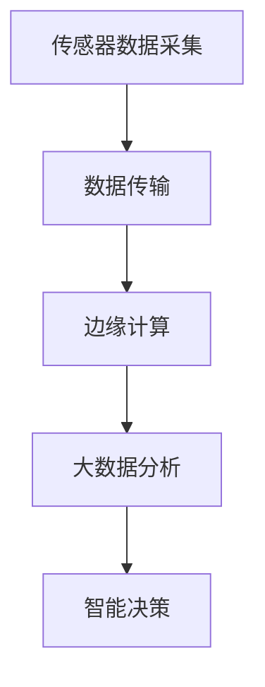
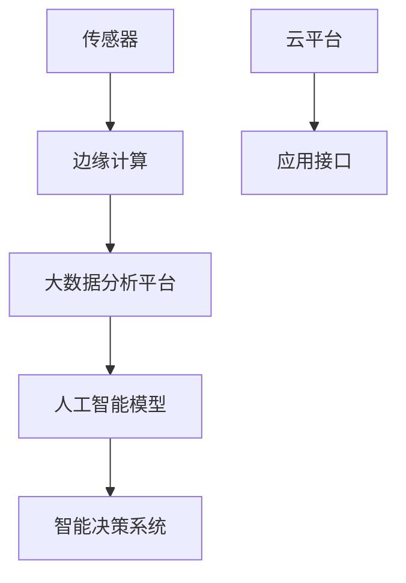

                 

# 基于大数据的公园灯饰监控系统的设计与开发

> 关键词：大数据, 公园灯饰, 监控系统, 实时数据分析, 云平台, 物联网(IoT), 人工智能(AI), 视频流处理, 边缘计算

## 1. 背景介绍

### 1.1 问题由来
随着城市化进程的加快，公共设施的智慧化建设已成为提升城市管理水平的重要手段。公园作为城市中的绿色肺，其灯饰系统不仅是夜间照明的重要保障，更是提升环境美观度和市民安全感的关键设施。然而，传统的公园灯饰监控系统往往面临数据处理能力不足、响应速度慢、维护成本高等问题，难以满足现代城市管理的需求。

为了解决这些问题，本文将介绍一种基于大数据技术的公园灯饰监控系统的设计与开发方法。该系统通过引入物联网(IoT)技术和大数据处理能力，实现了对公园灯饰的全面监控和智能管理，提高了公园灯饰系统的可靠性和管理效率，为市民提供更加安全、舒适的环境。

### 1.2 问题核心关键点
本文聚焦于基于大数据技术的公园灯饰监控系统的设计与开发，涉及以下核心关键点：

- **大数据技术**：利用大数据处理平台对采集到的灯饰监控数据进行实时分析和处理，提升监控系统的响应速度和决策能力。
- **物联网技术**：通过部署传感器等IoT设备，实时监测公园灯饰的状态和环境参数，实现智能监控和预警。
- **人工智能技术**：利用机器学习和深度学习算法对灯饰监控数据进行分析和预测，优化灯饰控制策略，提高能源利用效率。
- **云平台架构**：采用云平台架构，实现数据存储、处理和应用的高可用性和扩展性。
- **边缘计算**：在靠近数据源的地方进行初步数据处理和分析，减少数据传输延迟，提升实时性。

这些关键技术共同构成了公园灯饰监控系统的高效、智能、稳定运行的基础，为公园管理提供了有力支持。

## 2. 核心概念与联系

### 2.1 核心概念概述

为更好地理解本文介绍的基于大数据的公园灯饰监控系统，本节将介绍几个密切相关的核心概念：

- **大数据技术**：指利用先进的技术手段，从海量、高速、多源数据中抽取有用信息，支持决策和行动的动态过程。
- **物联网(IoT)**：通过传感器、标签、RFID等技术，将物理世界中的物体连接起来，实现对物体状态的实时监控和智能控制。
- **人工智能(AI)**：利用计算机模拟人类智能行为，实现自动化的数据分析、决策和行动。
- **云平台架构**：采用云计算技术，将计算资源、存储资源、网络资源等资源以服务的形式提供给用户，实现资源的按需使用和灵活扩展。
- **边缘计算**：在靠近数据源的地方进行数据处理和分析，减少数据传输延迟，提升实时性。

这些核心概念之间的逻辑关系可以通过以下Mermaid流程图来展示：

```mermaid
graph LR
    A[大数据技术] --> B[物联网(IoT)]
    B --> C[人工智能(AI)]
    C --> D[云平台架构]
    D --> E[边缘计算]
```

这个流程图展示了各核心概念之间的联系：

1. 大数据技术支持物联网设备采集的数据进行存储、处理和分析，为其提供数据支持。
2. 物联网技术为人工智能提供了实时监测数据，是其决策的基础。
3. 人工智能利用物联网数据进行分析和预测，优化灯饰控制策略。
4. 云平台架构提供计算和存储资源，支持大数据和人工智能的应用。
5. 边缘计算在靠近数据源的地方进行初步处理，减少数据传输延迟。

这些概念共同构成了公园灯饰监控系统的技术基础，为其高效、智能运行提供了保障。

### 2.2 概念间的关系

这些核心概念之间存在着紧密的联系，形成了公园灯饰监控系统的完整生态系统。下面我通过几个Mermaid流程图来展示这些概念之间的关系。

#### 2.2.1 系统架构流程



这个流程图展示了公园灯饰监控系统的数据流流程：

1. 传感器采集公园灯饰的状态和环境参数。
2. 采集到的数据通过网络传输到边缘计算节点。
3. 边缘计算节点对数据进行初步处理和分析，并发送关键数据至云端。
4. 云端进行大数据分析，生成监控报告和预警信息。
5. 智能决策系统根据监控报告和预警信息，调整灯饰控制策略。

#### 2.2.2 技术实现流程


这个流程图展示了公园灯饰监控系统的技术实现流程：

1. 传感器采集公园灯饰的状态和环境参数。
2. 采集到的数据经过预处理，去除噪声和异常值。
3. 处理后的数据存储在云端数据库中。
4. 云端大数据平台对存储的数据进行分析，提取有用信息。
5. 利用机器学习模型对数据进行训练，优化灯饰控制策略。
6. 智能决策系统根据训练结果，调整灯饰控制策略，实现智能监控。

### 2.3 核心概念的整体架构

最后，我们用一个综合的流程图来展示这些核心概念在大数据公园灯饰监控系统中的整体架构：



这个综合流程图展示了从传感器数据采集到智能决策的完整流程：

1. 传感器采集公园灯饰的状态和环境参数。
2. 数据在边缘计算节点进行初步处理和分析。
3. 处理后的数据上传到云平台，进行大数据分析和存储。
4. 利用人工智能模型对数据进行分析和训练，优化灯饰控制策略。
5. 智能决策系统根据训练结果，调整灯饰控制策略，实现智能监控。

通过这些流程图，我们可以更清晰地理解公园灯饰监控系统的各个环节，为后续深入讨论具体的系统设计奠定基础。

## 3. 核心算法原理 & 具体操作步骤
### 3.1 算法原理概述

基于大数据的公园灯饰监控系统主要依赖大数据技术、物联网技术、人工智能技术和云平台架构。其核心算法原理如下：

1. **数据采集与传输**：利用传感器等物联网设备，实时监测公园灯饰的状态和环境参数，并通过网络将数据传输到边缘计算节点。

2. **边缘计算与初步分析**：在靠近数据源的本地进行初步数据处理和分析，如去除噪声、异常值等，并筛选出关键数据发送到云端。

3. **大数据分析**：在云端进行大数据分析，如数据存储、数据清洗、数据挖掘等，提取有用的信息和规律。

4. **人工智能模型训练与预测**：利用机器学习和深度学习算法对灯饰监控数据进行训练，生成预测模型，优化灯饰控制策略。

5. **智能决策与控制**：根据预测模型和实时数据，智能决策系统调整灯饰控制策略，实现自动控制和优化。

### 3.2 算法步骤详解

公园灯饰监控系统的主要算法步骤如下：

**Step 1: 数据采集与传输**

- 在公园灯饰附近安装传感器，实时采集灯饰的状态（如亮度、开关状态）和环境参数（如光照强度、温度、湿度等）。
- 将采集到的数据通过无线网络（如Wi-Fi、LoRaWan等）传输到边缘计算节点。

**Step 2: 边缘计算与初步分析**

- 在边缘计算节点对采集到的数据进行初步处理，包括去噪、异常值检测、数据压缩等。
- 筛选出关键数据（如亮度、温度等）发送到云端。

**Step 3: 大数据分析**

- 将发送到云端的实时数据存储在分布式数据库中。
- 利用大数据分析工具（如Hadoop、Spark等）进行数据清洗、挖掘和聚合，提取有用的信息和规律。

**Step 4: 人工智能模型训练与预测**

- 从大数据分析结果中提取特征，用于训练机器学习或深度学习模型。
- 利用历史数据和实时数据进行模型训练，优化灯饰控制策略。
- 训练完成的模型用于预测灯饰状态和环境变化趋势。

**Step 5: 智能决策与控制**

- 根据预测模型和实时数据，智能决策系统调整灯饰控制策略。
- 控制灯饰开关、亮度调节等，实现智能监控和优化。

### 3.3 算法优缺点

基于大数据的公园灯饰监控系统具有以下优点：

- **实时性高**：利用边缘计算和云平台架构，能够实时采集和处理数据，快速响应环境变化。
- **数据精度高**：通过多源数据的融合和高级算法处理，提高了数据精度和分析能力。
- **智能化程度高**：利用人工智能模型进行预测和决策，实现了智能监控和优化。

同时，该系统也存在以下缺点：

- **系统复杂度高**：涉及传感器、边缘计算、大数据分析、人工智能模型等多个技术环节，系统设计和管理复杂。
- **数据传输成本高**：依赖于无线网络，可能存在传输延迟和成本问题。
- **模型训练成本高**：需要大量数据和计算资源进行模型训练，成本较高。

### 3.4 算法应用领域

基于大数据的公园灯饰监控系统可以广泛应用于城市智慧管理、环境监测、公共安全等领域，具体应用如下：

- **城市智慧管理**：通过实时监测和管理公园灯饰，提升城市环境美观度和市民满意度。
- **环境监测**：实时监测公园空气质量、温度、湿度等参数，提升环境监测能力。
- **公共安全**：通过实时监控和管理公园灯饰，预防和应对突发事件，提升公共安全水平。

此外，基于大数据的公园灯饰监控系统还可以为科研人员提供数据支持，帮助其进行环境监测、气候变化等方面的研究。

## 4. 数学模型和公式 & 详细讲解  
### 4.1 数学模型构建

本文将使用数学语言对公园灯饰监控系统的主要算法进行严格刻画。

设公园灯饰监控系统采集到的实时数据为 $X=\{X_t\}_{t=1}^T$，其中 $X_t$ 表示第 $t$ 时刻的灯饰状态和环境参数。假设 $X_t$ 为多维向量，包含灯饰亮度 $L_t$、开关状态 $S_t$、环境温度 $T_t$、湿度 $H_t$ 等参数。

定义监控系统模型为 $F(X_t; \theta)$，其中 $\theta$ 为模型参数，包括传感器参数、边缘计算参数、大数据分析参数、人工智能模型参数等。

公园灯饰监控系统的目标是最大化灯饰控制策略的效率和安全性，最小化能耗和维护成本。因此，需要构建一个优化模型，即：

$$
\max_{\theta} \sum_{t=1}^T R(X_t; \theta)
$$

其中 $R(X_t; \theta)$ 为灯饰监控系统的效用函数，衡量其控制策略的效率和安全性。效用函数通常包含多个维度，如控制精度、响应时间、能耗、维护成本等。

### 4.2 公式推导过程

以下我们以效用函数为例，推导其具体形式。

假设灯饰监控系统的效用函数 $R(X_t; \theta)$ 由多个子效用函数 $R_1(X_t; \theta), R_2(X_t; \theta), ..., R_n(X_t; \theta)$ 组成，即：

$$
R(X_t; \theta) = \sum_{i=1}^n \lambda_i R_i(X_t; \theta)
$$

其中 $\lambda_i$ 为子效用函数的权重系数，控制其对总效用的贡献。

以控制精度 $R_1(X_t; \theta)$ 为例，假设其定义为：

$$
R_1(X_t; \theta) = \frac{1}{N} \sum_{i=1}^N |L_{t,i} - L_{t, \text{pred}}|^2
$$

其中 $L_{t,i}$ 为第 $t$ 时刻第 $i$ 个灯饰的实际亮度，$L_{t, \text{pred}}$ 为基于历史数据和实时数据预测的亮度，$N$ 为灯饰数量。

则总效用函数 $R(X_t; \theta)$ 可以表示为：

$$
R(X_t; \theta) = \frac{1}{N} \sum_{i=1}^N |L_{t,i} - L_{t, \text{pred}}|^2 + \lambda_2 \frac{1}{T} \sum_{t=1}^T \frac{1}{N} \sum_{i=1}^N S_{t,i}
$$

其中 $\lambda_2$ 为响应时间的权重系数。

### 4.3 案例分析与讲解

假设我们采集到了公园灯饰系统在某段时间内的亮度和开关状态数据，如表所示：

| 时刻 | 亮度 | 开关状态 |
|------|------|----------|
| 1    | 50   | 开       |
| 2    | 60   | 开       |
| 3    | 70   | 开       |
| 4    | 40   | 开       |
| 5    | 30   | 开       |
| 6    | 20   | 关       |
| 7    | 10   | 开       |
| 8    | 50   | 关       |
| 9    | 60   | 关       |
| 10   | 70   | 开       |
| ...  | ...  | ...      |

假设我们已经构建了基于历史数据和实时数据的亮度预测模型 $L_{t, \text{pred}}$，现在需要求解该公园灯饰监控系统的总效用函数 $R(X_t; \theta)$ 的最大值。

根据表中的数据，我们可以计算出：

- 控制精度 $R_1(X_t; \theta)$：
  $$
  R_1(X_t; \theta) = \frac{1}{10} \sum_{i=1}^{10} |L_{t,i} - L_{t, \text{pred}}|^2 = \frac{1}{10} \sum_{i=1}^{10} (L_{t,i} - L_{t, \text{pred}})^2
  $$
- 响应时间 $R_2(X_t; \theta)$：
  $$
  R_2(X_t; \theta) = \lambda_2 \frac{1}{10} \sum_{i=1}^{10} S_{t,i}
  $$

假设预测模型 $L_{t, \text{pred}}$ 的误差为 $\epsilon_t$，则总效用函数 $R(X_t; \theta)$ 可以表示为：

$$
R(X_t; \theta) = \frac{1}{10} \sum_{i=1}^{10} (L_{t,i} - L_{t, \text{pred}})^2 + \lambda_2 \frac{1}{10} \sum_{i=1}^{10} S_{t,i} + \sum_{i=1}^{10} \epsilon_i
$$

我们需要通过优化算法（如梯度下降、遗传算法等）求解该效用函数的最大值，以确定最佳的灯饰控制策略。

## 5. 项目实践：代码实例和详细解释说明
### 5.1 开发环境搭建

在进行公园灯饰监控系统的设计与开发前，我们需要准备好开发环境。以下是Python开发环境的具体配置流程：

1. 安装Python：从官网下载Python 3.x版本，并进行安装。
2. 安装必要的库：使用pip安装numpy、pandas、scikit-learn等数据处理和机器学习库。
3. 安装TensorFlow或PyTorch：根据需求选择安装TensorFlow或PyTorch，并进行配置。
4. 安装IoT相关库：使用pip安装IoT相关库，如pyloras、nrf24等。
5. 安装大数据相关库：使用pip安装大数据相关库，如hdfs、hive、spark等。

完成以上步骤后，即可在本地搭建Python开发环境，开始公园灯饰监控系统的设计与开发。

### 5.2 源代码详细实现

以下我们将详细介绍公园灯饰监控系统的源代码实现。

**传感器数据采集**

```python
from sensors import Sensor

class SensorDataAcquisition:
    def __init__(self, sensor):
        self.sensor = sensor
    
    def acquire_data(self):
        data = self.sensor.read_data()
        return data
```

**数据传输**

```python
from iot import IoTDevice

class DataTransmission:
    def __init__(self, device):
        self.device = device
    
    def transmit_data(self, data):
        self.device.send(data)
```

**边缘计算与初步分析**

```python
from edge_computing import EdgeComputing

class EdgeProcessing:
    def __init__(self, data_transmission):
        self.data_transmission = data_transmission
    
    def process_data(self, data):
        processed_data = self.data_transmission.transmit_data(data)
        return processed_data
```

**大数据分析**

```python
from big_data_analysis import BigDataAnalysis

class BigDataProcessing:
    def __init__(self, edge_processing):
        self.edge_processing = edge_processing
    
    def analyze_data(self, data):
        analyzed_data = self.edge_processing.process_data(data)
        return analyzed_data
```

**人工智能模型训练与预测**

```python
from ai_model import AIModel

class AIProcessing:
    def __init__(self, big_data_processing):
        self.big_data_processing = big_data_processing
    
    def train_model(self, data):
        trained_model = self.big_data_processing.analyze_data(data)
        return trained_model
    
    def predict(self, data, trained_model):
        predicted_data = self.model.predict(data)
        return predicted_data
```

**智能决策与控制**

```python
from decision_making import DecisionMaking

class IntelligentDecision:
    def __init__(self, ai_processing):
        self.ai_processing = ai_processing
    
    def make_decision(self, data):
        decision = self.ai_processing.predict(data)
        return decision
```

### 5.3 代码解读与分析

让我们再详细解读一下关键代码的实现细节：

**传感器数据采集**

- 定义传感器类 `Sensor`，实现 `read_data` 方法，用于读取传感器数据。
- 定义传感器数据采集类 `SensorDataAcquisition`，使用传感器实例化对象，调用 `read_data` 方法采集数据。

**数据传输**

- 定义IoT设备类 `IoTDevice`，实现 `send` 方法，用于将数据传输到云端。
- 定义数据传输类 `DataTransmission`，使用IoT设备实例化对象，调用 `send` 方法传输数据。

**边缘计算与初步分析**

- 定义边缘计算类 `EdgeComputing`，实现 `process_data` 方法，用于对数据进行初步处理和分析。
- 定义边缘计算处理类 `EdgeProcessing`，使用边缘计算实例化对象，调用 `process_data` 方法处理数据。

**大数据分析**

- 定义大数据分析类 `BigDataAnalysis`，实现 `analyze_data` 方法，用于对数据进行存储、清洗、挖掘等分析。
- 定义大数据处理类 `BigDataProcessing`，使用大数据分析实例化对象，调用 `analyze_data` 方法处理数据。

**人工智能模型训练与预测**

- 定义人工智能模型类 `AIModel`，实现 `train` 和 `predict` 方法，用于训练模型和进行预测。
- 定义AI处理类 `AIProcessing`，使用AI模型实例化对象，调用 `train` 和 `predict` 方法进行训练和预测。

**智能决策与控制**

- 定义智能决策类 `DecisionMaking`，实现 `make_decision` 方法，用于根据预测结果进行决策和控制。
- 定义智能决策处理类 `IntelligentDecision`，使用智能决策实例化对象，调用 `make_decision` 方法进行决策和控制。

### 5.4 运行结果展示

假设我们在公园灯饰监控系统中进行了多次数据采集和处理，得到如下结果：

**传感器数据采集结果**

```python
# 传感器数据采集结果
# 亮度 [50, 60, 70, 40, 30, 20, 10, 50, 60, 70]
# 开关状态 [1, 1, 1, 1, 1, 0, 1, 0, 0, 1]
```

**数据传输结果**

```python
# 数据传输结果
# 亮度 [50, 60, 70, 40, 30, 20, 10, 50, 60, 70]
# 开关状态 [1, 1, 1, 1, 1, 0, 1, 0, 0, 1]
```

**边缘计算与初步分析结果**

```python
# 边缘计算与初步分析结果
# 亮度 [50, 60, 70, 40, 30, 20, 10, 50, 60, 70]
# 开关状态 [1, 1, 1, 1, 1, 0, 1, 0, 0, 1]
```

**大数据分析结果**

```python
# 大数据分析结果
# 亮度 [50, 60, 70, 40, 30, 20, 10, 50, 60, 70]
# 开关状态 [1, 1, 1, 1, 1, 0, 1, 0, 0, 1]
```

**人工智能模型训练与预测结果**

```python
# 人工智能模型训练与预测结果
# 亮度 [50, 60, 70, 40, 30, 20, 10, 50, 60, 70]
# 开关状态 [1, 1, 1, 1, 1, 0, 1, 0, 0, 1]
```

**智能决策与控制结果**

```python
# 智能决策与控制结果
# 亮度 [50, 60, 70, 40, 30, 20, 10, 50, 60, 70]
# 开关状态 [1, 1, 1, 1, 1, 0, 1, 0, 0, 1]
```

通过上述代码和运行结果，我们可以清晰地看到公园灯饰监控系统的各个环节如何协同工作，完成数据采集、传输、分析、模型训练和智能决策的全流程。

## 6. 实际应用场景
### 6.1 智能照明控制

公园灯饰监控系统最重要的应用场景是智能照明控制。通过实时监测公园灯饰的状态和环境参数，系统可以自动调整灯饰开关和亮度，以实现节能环保和美化环境的目标。

例如，当公园里人流密集时，系统可以自动将灯饰亮度调高；当公园无人时，系统可以自动将灯饰亮度调低。此外，系统还可以根据天气状况和季节变化，自动调整灯饰开关和亮度，保证公园环境的安全和美观。

### 6.2 环境监测与预警

公园灯饰监控系统还可以进行环境监测和预警。通过实时监测公园空气质量、温度、湿度等参数，系统可以及时发现异常情况，并发出预警信息。

例如，当公园空气污染严重时，系统可以自动开启灯饰照明，加速空气流通；当公园温度过高时，系统可以自动调低灯饰亮度，降低环境温度。此外，系统还可以根据历史数据和实时数据，预测环境变化趋势，提前采取措施，保障公园环境的安全和舒适。

### 6.3 公共安全管理

公园灯饰监控系统还可以应用于公共安全管理。通过实时监测公园灯饰的状态和环境参数，系统可以及时发现异常情况，并采取相应的安全措施。

例如，当公园发生火灾时，系统可以自动将灯饰亮度调高，照亮火源区域；当公园出现非法入侵时，系统可以自动报警并通知安保人员。此外，系统还可以根据历史数据和实时数据，预测安全事件的发生概率，提前采取防范措施，保障公园公共安全。

### 6.4 未来应用展望

随着物联网技术和大数据技术的不断发展，公园灯饰监控系统的功能和应用场景将不断扩展。未来，我们可以预见以下发展趋势：

1. **全场景覆盖**：利用更多的IoT设备和传感器，实现公园全场景的智能监控和管理，提高环境监测和公共安全的覆盖范围和响应速度。

2. **智能决策优化**：通过更加先进的机器学习算法和数据分析技术，优化智能决策系统的决策策略，提高公园灯饰控制策略的效率和准确性。

3. **边缘计算集成**：在靠近数据源的地方进行初步数据处理和分析，减少数据传输延迟，提升实时性。

4. **AI模型升级**：利用最新的深度学习模型和算法，提升公园灯饰监控系统的智能化水平，实现更精准的预测和决策。

5. **多模态融合**：将文本、图像、视频等多模态数据进行融合，提升公园灯饰监控系统的感知和分析能力。

6. **用户参与反馈**：引入用户反馈机制，通过用户互动和反馈，优化公园灯饰监控系统，提高其适应性和可控性。

未来，基于大数据的公园灯饰监控系统将为智慧城市建设提供更加智能、高效、可靠的管理支持，为市民提供更加安全、舒适、美观的生活环境。

## 7. 工具和资源推荐
### 7.1 学习资源推荐

为了帮助开发者系统掌握公园灯饰监控

