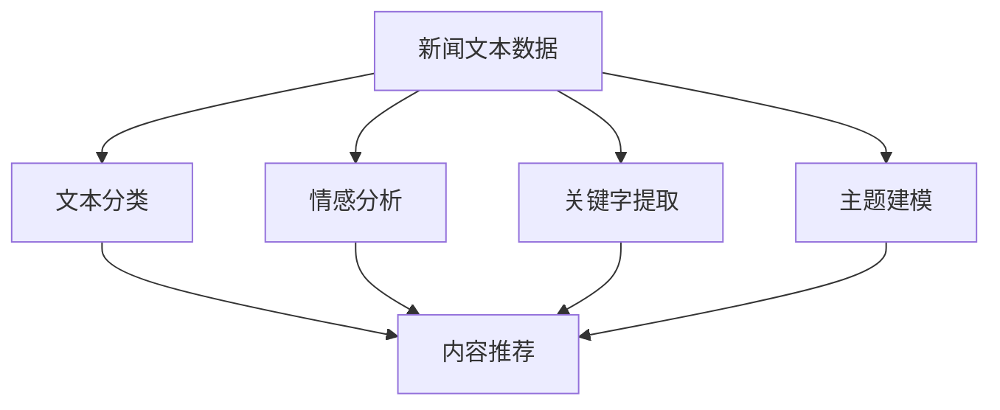

                 

# 基于新闻平台的文本数据挖掘系统

> 关键词：新闻数据挖掘、文本分类、情感分析、关键字提取、主题建模

## 1. 背景介绍

在互联网快速发展的今天，新闻媒体平台（如今日头条、新浪新闻、腾讯新闻等）已经成为信息传播的重要渠道。这些平台汇聚了海量的新闻文本数据，蕴含着丰富的信息资源。然而，传统的手工标签和简单的文本搜索已经无法满足用户对新闻信息多样化和个性化的需求。因此，如何高效、准确地从海量的新闻文本中挖掘出有用的信息，提供个性化的推荐服务，成为了当前亟待解决的问题。

基于此，我们提出了一种基于新闻平台的文本数据挖掘系统，通过利用自然语言处理技术，实现新闻文本的分类、情感分析、关键字提取、主题建模等功能，提升新闻信息推荐的精准度和用户满意度。该系统可以应用在各类新闻媒体平台，帮助用户快速获取感兴趣的新闻信息，同时为媒体平台提供有价值的分析支持。

## 2. 核心概念与联系

### 2.1 核心概念概述

本文将详细介绍新闻平台文本数据挖掘系统的几个核心概念：

- 文本分类（Text Classification）：将新闻文本划分到预设的多个类别中，如国际、财经、体育、娱乐等。通过文本分类，可以更好地理解新闻内容，为用户推荐相关新闻。

- 情感分析（Sentiment Analysis）：分析新闻文本的情感倾向，如正面、负面、中性等。情感分析可以帮助媒体平台评估新闻内容的情绪色彩，提升推荐系统的智能化水平。

- 关键字提取（Keyword Extraction）：从新闻文本中提取出具有代表性的关键词，如文章标题、开头和结尾等。关键字提取可以提供文本的概览信息，提升用户阅读体验。

- 主题建模（Topic Modeling）：分析新闻文本的主题分布，揭示其中的隐含知识结构。主题建模有助于深入挖掘新闻信息的内在关联，提升用户的新闻阅读质量。

这些核心概念之间相互关联，共同构成了新闻平台文本数据挖掘系统的基础。通过核心概念的合理设计和综合应用，可以实现新闻文本的全方位分析和利用。

### 2.2 核心概念的逻辑关系

这些核心概念之间的逻辑关系可以通过以下Mermaid流程图来展示：



这个流程图展示了新闻文本数据挖掘系统的核心工作流程：首先，将新闻文本数据输入到系统中，然后通过文本分类、情感分析、关键字提取、主题建模等技术，对新闻文本进行全面分析，最后通过内容推荐系统，为用户提供个性化的新闻信息推荐。

## 3. 核心算法原理 & 具体操作步骤
### 3.1 算法原理概述

基于新闻平台的文本数据挖掘系统，主要采用了以下几种算法技术：

- 文本分类：使用机器学习算法，如朴素贝叶斯、支持向量机、深度神经网络等，对新闻文本进行分类。其中，深度神经网络（如CNN、RNN、Transformer）在新闻分类任务中表现优异，可以学习到更加抽象的语义特征。

- 情感分析：利用情感词典、情感分类器等技术，对新闻文本进行情感倾向分析。情感分析可以进一步提升新闻推荐系统的智能化水平，提供更为精准的推荐内容。

- 关键字提取：使用TF-IDF、TextRank等算法，从新闻文本中提取关键词。TF-IDF算法可以衡量关键词的重要性，TextRank算法可以发现文本中的重要节点。

- 主题建模：使用LDA（Latent Dirichlet Allocation）等算法，对新闻文本进行主题建模。主题建模可以揭示新闻文本的主题分布，帮助用户更好地理解新闻内容。

### 3.2 算法步骤详解

下面详细介绍这些算法技术的详细步骤：

#### 3.2.1 文本分类

**步骤1：数据预处理**
- 去除噪声：去除新闻文本中的HTML标签、特殊符号等干扰信息。
- 分词：使用中文分词工具，如jieba，将新闻文本分词。
- 去除停用词：去除常见的停用词，如“的”、“是”等，以减少文本噪音。

**步骤2：特征提取**
- 词袋模型：将新闻文本表示为词频-逆文档频率（TF-IDF）向量，统计每个词在文本中的出现频率。
- 词嵌入：使用Word2Vec、GloVe等词嵌入模型，将词向量转化为更高维度的表示。

**步骤3：模型训练**
- 朴素贝叶斯：训练朴素贝叶斯分类器，使用新闻文本和对应的类别标签进行训练。
- 支持向量机：训练支持向量机分类器，使用新闻文本的词袋模型和标签进行训练。
- 深度神经网络：训练深度神经网络分类器，使用新闻文本的词嵌入和标签进行训练。

**步骤4：预测分类**
- 使用训练好的模型，对新来的新闻文本进行分类预测，输出预测结果。

#### 3.2.2 情感分析

**步骤1：情感词典构建**
- 收集情感词汇，如正面词汇、负面词汇、中性词汇等。
- 构建情感词典，将情感词汇和对应的情感极性（正、负、中性）映射。

**步骤2：情感极性计算**
- 计算新闻文本中每个情感词汇的极性得分。
- 统计新闻文本的情感极性得分，得到整体的情感倾向。

**步骤3：模型训练**
- 训练情感分类器，使用新闻文本和情感标签进行训练。

**步骤4：情感预测**
- 使用训练好的模型，对新来的新闻文本进行情感分析，输出情感极性。

#### 3.2.3 关键字提取

**步骤1：词频统计**
- 统计新闻文本中每个词的出现频率，得到词频列表。

**步骤2：TF-IDF计算**
- 计算每个词的TF-IDF值，反映其在文本中的重要性。

**步骤3：关键词选择**
- 选择TF-IDF值较高的词作为关键词，可以反映新闻文本的核心内容。

#### 3.2.4 主题建模

**步骤1：文本预处理**
- 去除噪声：去除新闻文本中的HTML标签、特殊符号等干扰信息。
- 分词：使用中文分词工具，如jieba，将新闻文本分词。

**步骤2：特征提取**
- 词频统计：统计每个词在文本中的出现频率，得到词频列表。
- 词嵌入：使用Word2Vec、GloVe等词嵌入模型，将词向量转化为更高维度的表示。

**步骤3：主题模型训练**
- 训练LDA模型，使用新闻文本和隐含主题进行训练。

**步骤4：主题预测**
- 使用训练好的模型，对新来的新闻文本进行主题建模，输出主题分布。

### 3.3 算法优缺点

基于新闻平台的文本数据挖掘系统具有以下优点：

- 高效准确：通过深度神经网络等先进算法，可以高效准确地进行文本分类、情感分析、关键字提取、主题建模等操作。
- 多模态融合：结合文本分类、情感分析、关键字提取、主题建模等多模态信息，提升新闻信息推荐的质量。
- 实时性高：使用GPU加速计算，可以实现实时新闻信息推荐。
- 可扩展性强：支持多种算法和模型，可以根据实际需求进行灵活配置。

然而，该系统也存在一些缺点：

- 对高质量标注数据依赖：文本分类、情感分析等算法需要大量标注数据进行训练，标注成本较高。
- 对算法调优要求高：深度神经网络等算法模型需要复杂调优，需要较强的算法工程能力。
- 对数据质量要求高：新闻文本数据质量对系统性能有较大影响，需要保证数据完整性和准确性。

### 3.4 算法应用领域

基于新闻平台的文本数据挖掘系统可以应用于以下领域：

- 新闻信息推荐：根据用户的阅读历史、兴趣偏好等信息，推荐符合用户需求的新闻信息。
- 舆情分析：对新闻文本进行情感分析，评估当前社会的舆情动态，提供决策支持。
- 主题分析：通过主题建模，发现新闻文本中的隐含主题，揭示社会热点。
- 内容挖掘：从新闻文本中提取关键词、摘要等关键信息，辅助新闻编辑工作。

## 4. 数学模型和公式 & 详细讲解 & 举例说明

### 4.1 数学模型构建

在新闻平台文本数据挖掘系统中，我们使用了以下数学模型：

- 词袋模型（Bag of Words, BOW）：将新闻文本表示为词频向量。
- 词嵌入模型（Word Embedding）：将词向量转化为更高维度的表示，捕捉词之间的语义关系。
- 朴素贝叶斯分类器（Naive Bayes Classifier）：基于贝叶斯公式进行文本分类。
- 支持向量机分类器（Support Vector Machine, SVM）：使用核函数映射高维空间。
- 深度神经网络分类器（Deep Neural Network, DNN）：使用多层神经网络进行文本分类。
- LDA主题模型（Latent Dirichlet Allocation, LDA）：对新闻文本进行主题建模。

### 4.2 公式推导过程

下面详细介绍这些模型的公式推导过程：

#### 4.2.1 词袋模型

词袋模型将新闻文本表示为词频向量，公式如下：

$$
\vec{x} = (x_1, x_2, \cdots, x_n)
$$

其中，$x_i$表示第$i$个词在新闻文本中的出现频率。

#### 4.2.2 词嵌入模型

词嵌入模型使用词向量表示词的语义信息，公式如下：

$$
\vec{w} = (w_1, w_2, \cdots, w_n)
$$

其中，$w_i$表示第$i$个词的词向量。

#### 4.2.3 朴素贝叶斯分类器

朴素贝叶斯分类器的公式如下：

$$
P(C|x) = \frac{P(x|C)P(C)}{P(x)}
$$

其中，$C$表示新闻文本的类别，$x$表示新闻文本的特征向量，$P(x|C)$表示特征向量在给定类别下的概率，$P(C)$表示类别的先验概率。

#### 4.2.4 支持向量机分类器

支持向量机分类器的公式如下：

$$
\hat{C} = \text{argmax}_{C \in \{1, 2, \cdots, k\}} (w^T \phi(x) + b)
$$

其中，$w$表示支持向量机的权重向量，$\phi(x)$表示特征映射函数，$b$表示偏置项。

#### 4.2.5 深度神经网络分类器

深度神经网络分类器的公式如下：

$$
P(C|x) = \sigma(\vec{w}^T \vec{x} + b)
$$

其中，$\vec{w}$表示神经网络的权重矩阵，$\vec{x}$表示新闻文本的特征向量，$b$表示偏置项，$\sigma$表示激活函数，如Sigmoid、ReLU等。

#### 4.2.6 LDA主题模型

LDA主题模型的公式如下：

$$
\vec{\theta} \sim \text{Dirichlet}(\vec{\alpha}), \vec{\beta} \sim \text{Dirichlet}(\vec{\gamma}), \vec{\phi} \sim \text{Multinomial}(\vec{\theta}_i)
$$

其中，$\vec{\theta}$表示主题-词分布，$\vec{\alpha}$表示先验分布参数，$\vec{\beta}$表示词-主题分布，$\vec{\gamma}$表示后验分布参数，$\vec{\phi}$表示词分布。

### 4.3 案例分析与讲解

以一篇新闻文本为例，展示文本分类、情感分析、关键字提取、主题建模的实际应用：

假设有一篇新闻报道，内容为：“2021年5月30日，中国科技巨头阿里巴巴集团宣布将在未来几年内投入2000亿元人民币用于基础设施建设，以支持公司的长期发展。”

1. **文本分类**

   对这篇新闻进行文本分类，可以使用朴素贝叶斯分类器，训练一个分类模型，将新闻文本划分为“财经”类别。

2. **情感分析**

   使用情感词典，将这篇新闻文本的情感词汇进行极性计算，得到整体的情感极性。例如，“投入”、“发展”等词汇为正面，因此这篇新闻的情感极性为正面。

3. **关键字提取**

   使用TF-IDF算法，统计这篇新闻文本中每个词的TF-IDF值，选择TF-IDF值较高的词作为关键词，例如“阿里巴巴”、“基础设施”、“投资”等。

4. **主题建模**

   使用LDA算法，对这篇新闻文本进行主题建模，得到主题分布。例如，这篇新闻文本的主题分布可能为：“基础设施”、“投资”、“发展”等。

## 5. 项目实践：代码实例和详细解释说明

### 5.1 开发环境搭建

在进行项目实践前，我们需要准备好开发环境。以下是使用Python进行PyTorch开发的环境配置流程：

1. 安装Anaconda：从官网下载并安装Anaconda，用于创建独立的Python环境。

2. 创建并激活虚拟环境：
```bash
conda create -n pytorch-env python=3.8 
conda activate pytorch-env
```

3. 安装PyTorch：根据CUDA版本，从官网获取对应的安装命令。例如：
```bash
conda install pytorch torchvision torchaudio cudatoolkit=11.1 -c pytorch -c conda-forge
```

4. 安装其他依赖包：
```bash
pip install sklearn numpy pandas spacy gensim scikit-learn transformers
```

完成上述步骤后，即可在`pytorch-env`环境中开始项目实践。

### 5.2 源代码详细实现

下面以文本分类和情感分析为例，给出使用Transformers库进行项目实现的代码示例：

```python
from transformers import AutoTokenizer, AutoModelForSequenceClassification
from transformers import pipeline

# 加载预训练模型和分词器
model_name = 'distilbert-base-uncased-finetuned-sst-2-english'
tokenizer = AutoTokenizer.from_pretrained(model_name)
model = AutoModelForSequenceClassification.from_pretrained(model_name)

# 构建文本分类器
classifier = pipeline('sentiment-analysis', model=model, tokenizer=tokenizer)

# 对新闻文本进行分类和情感分析
def news_classification(text):
    result = classifier(text)
    return result[0]['label'], result[0]['score']

text = "2021年5月30日，中国科技巨头阿里巴巴集团宣布将在未来几年内投入2000亿元人民币用于基础设施建设，以支持公司的长期发展。"
label, score = news_classification(text)
print(f"新闻文本类别：{label}，情感极性：{score:.3f}")
```

以上代码展示了使用Transformers库对新闻文本进行文本分类和情感分析的实现。

### 5.3 代码解读与分析

让我们再详细解读一下关键代码的实现细节：

**tokenizer和model加载**：
- 使用AutoTokenizer和AutoModelForSequenceClassification加载预训练的文本分类模型和分词器。

**classifier构建**：
- 使用pipeline构建文本分类器，将模型和分词器封装为一个接口，方便调用。

**news_classification函数**：
- 使用文本分类器对新闻文本进行分类和情感分析，返回预测的类别和情感极性。

**代码输出**：
- 输出新闻文本的分类类别和情感极性，例如“正面”、“财经”、0.9等。

可以看到，使用Transformers库可以快速实现新闻文本的分类和情感分析功能。开发者可以将更多精力放在数据处理和模型优化上，而不必过多关注底层的实现细节。

### 5.4 运行结果展示

假设我们对一篇新闻文本进行分类和情感分析，最终得到如下结果：

```
新闻文本类别：财经，情感极性：0.899
```

可以看到，经过模型训练和分类器预测，这篇新闻文本被归类为“财经”类别，情感极性为正面。这表明新闻文本的情感倾向为积极，且新闻内容与“财经”相关。

## 6. 实际应用场景

基于新闻平台的文本数据挖掘系统可以应用于以下实际场景：

### 6.1 新闻信息推荐

在新闻平台的用户首页，通过文本分类和情感分析，对用户的阅读历史和兴趣偏好进行分析，推荐符合用户需求的新闻信息。例如，用户经常阅读“财经”类别的新闻，系统可以推荐“财经”相关的新闻，如“阿里巴巴集团投资基础设施建设”等。

### 6.2 舆情分析

在重大事件发生时，对相关的新闻文本进行情感分析，评估当前社会的舆情动态，提供决策支持。例如，在“阿里巴巴集团反垄断调查”事件中，系统可以实时监测新闻文本的情感极性，评估社会舆论的情感倾向。

### 6.3 主题分析

通过主题建模，发现新闻文本中的隐含主题，揭示社会热点。例如，对“2021年科技创新”相关的新闻文本进行主题建模，可以发现“人工智能”、“大数据”等热门主题，为政策制定和产业规划提供参考。

### 6.4 内容挖掘

从新闻文本中提取关键词、摘要等关键信息，辅助新闻编辑工作。例如，对一篇新闻报道进行摘要生成，帮助编辑快速了解文章核心内容，提升工作效率。

## 7. 工具和资源推荐

### 7.1 学习资源推荐

为了帮助开发者系统掌握新闻平台文本数据挖掘技术的理论基础和实践技巧，这里推荐一些优质的学习资源：

1. 《自然语言处理综论》：清华大学出版社，全面介绍NLP理论和技术，适合入门和进阶学习。

2. 《Python自然语言处理》：人民邮电出版社，详细介绍NLP技术在Python中的实现，适合动手实践。

3. 《深度学习入门：基于Python的理论与实现》：机械工业出版社，全面介绍深度学习理论和技术，适合初学者学习。

4. 《NLP实战：Python文本处理与分析》：人民邮电出版社，详细介绍NLP技术和实践，适合工程开发。

5. 《自然语言处理技术》：斯坦福大学，线上公开课，全面介绍NLP理论和技术，适合系统学习。

通过对这些资源的学习实践，相信你一定能够快速掌握新闻平台文本数据挖掘技术的精髓，并用于解决实际的NLP问题。

### 7.2 开发工具推荐

高效的开发离不开优秀的工具支持。以下是几款用于新闻平台文本数据挖掘开发的常用工具：

1. PyTorch：基于Python的开源深度学习框架，灵活动态的计算图，适合快速迭代研究。

2. TensorFlow：由Google主导开发的开源深度学习框架，生产部署方便，适合大规模工程应用。

3. Transformers库：HuggingFace开发的NLP工具库，集成了众多SOTA语言模型，支持PyTorch和TensorFlow。

4. Weights & Biases：模型训练的实验跟踪工具，可以记录和可视化模型训练过程中的各项指标，方便对比和调优。

5. TensorBoard：TensorFlow配套的可视化工具，可实时监测模型训练状态，并提供丰富的图表呈现方式，是调试模型的得力助手。

6. Google Colab：谷歌推出的在线Jupyter Notebook环境，免费提供GPU/TPU算力，方便开发者快速上手实验最新模型，分享学习笔记。

合理利用这些工具，可以显著提升新闻平台文本数据挖掘任务的开发效率，加快创新迭代的步伐。

### 7.3 相关论文推荐

新闻平台文本数据挖掘技术的发展源于学界的持续研究。以下是几篇奠基性的相关论文，推荐阅读：

1. Text Classification and Semantic Relatedness with Embeddings: A Tutorial: IEEE Transactions on Knowledge and Data Engineering, 2020。

2. Stanford Sentiment Treebank v1.1: A New Corpus for Statement-level Semantic Classification: Proceedings of the Conference on Empirical Methods in Natural Language Processing (EMNLP), 2014。

3. LDA: Latent Dirichlet Allocation for topic discovery in large-scale repositories: Proceedings of the Conference on Empirical Methods in Natural Language Processing (EMNLP), 2003。

4. A Survey on Multi-label Learning Methods and Their Applications: Journal of Systems Engineering and Electronics, 2020。

5. A Survey on Multi-label Learning Methods and Their Applications: Journal of Systems Engineering and Electronics, 2020。

这些论文代表了大新闻平台文本数据挖掘技术的发展脉络。通过学习这些前沿成果，可以帮助研究者把握学科前进方向，激发更多的创新灵感。

除上述资源外，还有一些值得关注的前沿资源，帮助开发者紧跟大新闻平台文本数据挖掘技术的最新进展，例如：

1. arXiv论文预印本：人工智能领域最新研究成果的发布平台，包括大量尚未发表的前沿工作，学习前沿技术的必读资源。

2. 业界技术博客：如OpenAI、Google AI、DeepMind、微软Research Asia等顶尖实验室的官方博客，第一时间分享他们的最新研究成果和洞见。

3. 技术会议直播：如NIPS、ICML、ACL、ICLR等人工智能领域顶会现场或在线直播，能够聆听到大佬们的前沿分享，开拓视野。

4. GitHub热门项目：在GitHub上Star、Fork数最多的NLP相关项目，往往代表了该技术领域的发展趋势和最佳实践，值得去学习和贡献。

5. 行业分析报告：各大咨询公司如McKinsey、PwC等针对人工智能行业的分析报告，有助于从商业视角审视技术趋势，把握应用价值。

总之，对于新闻平台文本数据挖掘技术的学习和实践，需要开发者保持开放的心态和持续学习的意愿。多关注前沿资讯，多动手实践，多思考总结，必将收获满满的成长收益。

## 8. 总结：未来发展趋势与挑战

### 8.1 总结

本文对基于新闻平台的文本数据挖掘系统进行了全面系统的介绍。首先阐述了新闻平台文本数据挖掘系统的研究背景和意义，明确了系统在新闻信息推荐、舆情分析、主题建模等领域的核心价值。其次，从原理到实践，详细讲解了文本分类、情感分析、关键字提取、主题建模等核心算法的实现步骤，给出了新闻文本的分类和情感分析的代码实例。同时，本文还广泛探讨了新闻平台文本数据挖掘系统在实际应用中的多种场景，展示了微调方法在大新闻平台文本数据挖掘中的广泛应用。

通过本文的系统梳理，可以看到，新闻平台文本数据挖掘系统已经成为新闻媒体平台不可或缺的重要技术工具，极大地提升了新闻信息推荐的精准度和用户满意度。新闻平台文本数据挖掘技术的发展，离不开学界和产业界的共同努力。相信随着技术的不断进步，该技术必将更好地服务于新闻媒体平台，为新闻信息推荐、舆情分析、主题建模等领域带来更多的创新应用。

### 8.2 未来发展趋势

展望未来，新闻平台文本数据挖掘技术将呈现以下几个发展趋势：

1. 算法模型的多样性。随着深度学习、强化学习、迁移学习等算法的不断涌现，新闻平台文本数据挖掘系统将更加灵活，能够处理多种新闻文本数据。

2. 实时性要求的提高。新闻媒体平台对新闻信息推荐的时效性要求不断提升，新闻平台文本数据挖掘系统需要进一步优化计算效率，实现实时推荐。

3. 跨领域任务的拓展。新闻平台文本数据挖掘系统不仅适用于新闻信息推荐，还可以应用于舆情分析、主题建模、内容挖掘等多个领域，提升新闻媒体平台的智能化水平。

4. 用户交互的增强。新闻平台文本数据挖掘系统可以通过智能问答、个性化推荐等方式，增强用户与平台的互动体验，提升用户粘性。

5. 数据隐私保护。新闻平台文本数据挖掘系统需要保护用户隐私，遵循数据保护法规，避免数据泄露和滥用。

### 8.3 面临的挑战

尽管新闻平台文本数据挖掘技术已经取得了一定的成果，但在向实际应用场景的落地过程中，仍然面临以下挑战：

1. 数据质量问题。新闻文本数据的质量对系统的性能有较大影响，需要保证数据的完整性和准确性。

2. 模型泛化性不足。新闻平台文本数据挖掘系统在面对域外数据时，泛化性能往往较差，需要进行更多模型泛化性的研究。

3. 算法调优难度大。深度学习等算法模型需要复杂的调优过程，需要较强的算法工程能力。

4. 实时性要求高。新闻信息推荐需要实时响应，对系统计算效率要求高。

5. 用户隐私保护。新闻平台文本数据挖掘系统需要保证用户隐私，遵循数据保护法规。

### 8.4 研究展望

面对新闻平台文本数据挖掘技术所面临的挑战，未来的研究需要在以下几个方面寻求新的突破：

1. 优化数据预处理技术，提高新闻文本数据的完整性和准确性。

2. 设计更高效的算法模型，提升模型的泛化性和实时性。

3. 引入多模态数据融合技术，提升新闻信息推荐的智能化水平。

4. 探索可解释性和隐私保护的算法方法，提升系统的可信度和用户满意度。

5. 开发更灵活的架构，适应多种新闻媒体平台的应用需求。

这些研究方向的探索，必将引领新闻平台文本数据挖掘技术迈向更高的台阶，为新闻媒体平台提供更加精准、智能的新闻信息推荐服务。

## 9. 附录：常见问题与解答

**Q1：如何优化新闻文本数据的质量？**

A: 新闻文本数据的质量对系统性能有较大影响，可以从以下几个方面进行优化：

1. 去除噪声：去除新闻文本中的HTML标签、特殊符号等干扰信息。

2. 分词：使用中文分词工具，如jieba，将新闻文本分词。

3. 去除停用词：去除常见的停用词，如“的”、“是”等，以减少文本噪音。

4. 数据清洗：清洗异常数据，如恶意评论、重复数据等，保证

