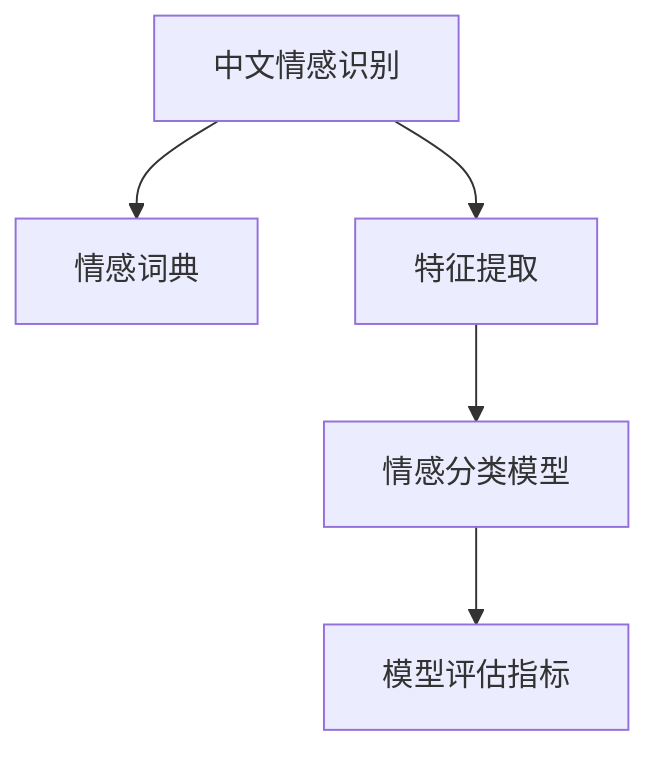

                 

## 1. 背景介绍

### 1.1 问题由来

随着互联网的普及，中文社交媒体、论坛、博客等网络文本平台的活跃度不断提高，中文网络文本语料的海量增加为中文情感识别研究提供了丰富的数据基础。中文情感识别作为一种重要的自然语言处理（Natural Language Processing, NLP）技术，通过自动分析文本中的情感信息，可以辅助开展舆情监控、客户满意度评估、市场趋势预测等应用，具有重要的现实意义。

中文情感识别研究与英文等主流语言研究相比起步较晚，但近年来发展迅速。特别是在机器学习、深度学习等人工智能技术迅速发展的背景下，中文情感识别研究取得了显著进展。针对这一领域的文献、技术、工具也逐渐增多，为后续研究提供了坚实的基础。

### 1.2 问题核心关键点

中文情感识别的核心目标是通过对中文网络文本进行自动情感分析，识别出文本中的情感信息（如积极、消极、中性等），从而辅助应用场景中的决策分析。具体来说，中文情感识别的核心关键点包括：

1. **数据预处理**：中文文本的特殊性，如汉字数量庞大、词义歧义、语序复杂等，要求在数据预处理阶段进行特殊的分词、词性标注、停用词去除等处理，确保模型能够正确理解文本。
2. **特征提取**：中文文本的情感信息通常隐含在词语、句式、情感词等特征中，需要选择合适的特征提取方法，如词袋模型、TF-IDF、词向量化等。
3. **情感分类模型**：选择合适的机器学习或深度学习模型进行情感分类，如朴素贝叶斯、支持向量机（Support Vector Machine, SVM）、卷积神经网络（Convolutional Neural Network, CNN）、循环神经网络（Recurrent Neural Network, RNN）、长短时记忆网络（Long Short-Term Memory, LSTM）、注意力机制（Attention Mechanism）、Transformer等。
4. **模型评估与优化**：选择合适的评估指标（如准确率、精确率、召回率、F1值等）对模型性能进行评估，并通过超参数调优、模型融合等方法提升模型性能。

### 1.3 问题研究意义

中文情感识别研究不仅具有重要的理论意义，还具备显著的实际应用价值。其研究意义主要体现在：

1. **舆情监控**：中文情感识别能够实时分析社交媒体上的舆情动态，识别出公众对某一事件、政策的情感倾向，帮助政府和企业及时调整策略，维护社会稳定。
2. **客户满意度评估**：通过分析用户对产品、服务的评论，中文情感识别能够提供精准的客户满意度分析，帮助企业提升用户体验。
3. **市场趋势预测**：中文情感识别能够揭示市场趋势，为投资者提供决策参考，降低投资风险。
4. **个性化推荐**：基于用户的情感偏好，中文情感识别能够为用户提供更符合其兴趣的个性化推荐，提升用户粘性。

总之，中文情感识别研究对于网络舆情分析、客户满意度评估、市场趋势预测等实际应用具有重要的推动作用，对于提升中文文本处理技术水平和促进人工智能技术应用具有重要的理论和实际价值。

## 2. 核心概念与联系

### 2.1 核心概念概述

为更好地理解基于机器学习的中文情感识别方法，本节将介绍几个密切相关的核心概念：

- **中文情感识别**：通过分析中文文本中的情感信息，自动识别文本中的情感类别，如积极、消极、中性等。
- **情感词典**：用于标注中文词语的情感极性，包含大量中文情感词语及对应的情感极性，是中文情感识别中重要的语料来源。
- **特征提取**：将中文文本转换为机器学习或深度学习模型能够处理的数值特征，常用的方法包括词袋模型、TF-IDF、词向量化等。
- **情感分类模型**：用于对文本进行情感分类的机器学习或深度学习模型，常见的包括朴素贝叶斯、SVM、CNN、RNN、LSTM、注意力机制、Transformer等。
- **模型评估指标**：用于衡量情感分类模型性能的指标，如准确率、精确率、召回率、F1值等。

这些核心概念之间的逻辑关系可以通过以下Mermaid流程图来展示：



这个流程图展示了大规模中文情感识别任务的基本流程：从文本数据到情感分类模型的构建，再到性能评估。

### 2.2 概念间的关系

这些核心概念之间存在着紧密的联系，形成了中文情感识别的完整生态系统。

1. **中文情感识别与情感词典的关系**：情感词典为中文情感识别提供了标注数据，是中文情感识别的基础。
2. **特征提取与情感分类模型之间的关系**：特征提取将文本转换为数值特征，供情感分类模型处理，两者互为前提。
3. **情感分类模型与模型评估指标之间的关系**：情感分类模型输出情感分类结果，模型评估指标用于衡量模型性能，两者相辅相成。

这些概念共同构成了中文情感识别的技术框架，使其能够对中文文本进行自动化情感分析。通过理解这些核心概念，我们可以更好地把握中文情感识别的核心技术和方法。

## 3. 核心算法原理 & 具体操作步骤
### 3.1 算法原理概述

基于机器学习的中文情感识别方法，本质上是通过训练一个能够自动分析中文文本情感的模型，利用训练数据集中的标注信息，学习中文情感与文本特征之间的映射关系。该方法的典型流程包括数据预处理、特征提取、模型训练和模型评估四个步骤。

具体来说，基于机器学习的中文情感识别流程如图2所示。


### 3.2 算法步骤详解

#### 3.2.1 数据预处理

数据预处理是中文情感识别的第一步，主要包括以下几个环节：

1. **分词**：中文分词是中文文本处理的第一步，将连续的中文字符序列切分成有意义的词语序列。常用的中文分词工具包括结巴分词、jieba、HanLP等。
2. **词性标注**：标注每个词语的词性，如名词、动词、形容词等，有助于进一步特征提取。
3. **停用词去除**：去除常用但无情感意义的词语，如“的”、“是”等，避免对模型性能造成干扰。
4. **文本标准化**：统一文本格式，去除特殊符号，标准化词语拼写，保证数据一致性。

#### 3.2.2 特征提取

特征提取是将中文文本转换为数值特征的过程。常用的特征提取方法包括：

1. **词袋模型**：将文本中每个词语的出现次数作为特征，构建词袋向量。
2. **TF-IDF**：基于词频和逆文档频率的加权方法，提取文本特征。
3. **词向量化**：利用词嵌入（如Word2Vec、GloVe、FastText等）将词语转换为向量形式，构建高维空间中的文本特征。

#### 3.2.3 模型训练

模型训练是中文情感识别的核心步骤，主要包括以下几个环节：

1. **模型选择**：选择合适的机器学习或深度学习模型，如朴素贝叶斯、SVM、CNN、RNN、LSTM、注意力机制、Transformer等。
2. **训练数据划分**：将数据集划分为训练集、验证集和测试集，保证模型训练、调参和测试的一致性。
3. **模型训练**：使用训练集数据对模型进行训练，优化模型参数，提高模型性能。
4. **超参数调优**：通过交叉验证等方法，优化模型超参数，如学习率、正则化系数等，提升模型泛化能力。

#### 3.2.4 模型评估

模型评估是衡量中文情感识别模型性能的重要环节，主要包括以下几个环节：

1. **评估指标选择**：选择合适的评估指标，如准确率、精确率、召回率、F1值等。
2. **模型评估**：使用测试集数据对模型进行评估，计算评估指标，了解模型性能。
3. **模型优化**：根据模型评估结果，对模型进行优化，如模型融合、参数微调等。

### 3.3 算法优缺点

基于机器学习的中文情感识别方法具有以下优点：

1. **通用性强**：能够适用于不同类型的中文文本数据，如微博、新闻、评论等，具有较强的泛化能力。
2. **模型可解释性强**：机器学习模型的参数和特征能够被直观理解，便于模型的调试和优化。
3. **模型构建简单**：与深度学习模型相比，机器学习模型的构建和训练相对简单，易于实现。

然而，该方法也存在一些缺点：

1. **特征提取复杂**：中文文本的特殊性使得特征提取相对复杂，需要结合文本处理、语言学知识进行设计。
2. **数据依赖性强**：模型的性能依赖于数据质量，需要大量的标注数据，获取标注数据成本较高。
3. **计算效率低**：相对于深度学习模型，机器学习模型计算效率较低，难以处理大规模数据集。

### 3.4 算法应用领域

基于机器学习的中文情感识别方法，在多个领域中得到了广泛应用，如：

1. **社交媒体舆情分析**：通过分析社交媒体上的中文文本，识别公众对某一事件、政策的情感倾向，辅助舆情监控。
2. **客户满意度评估**：分析客户对产品、服务的评论，识别情感信息，帮助企业提升用户体验。
3. **市场趋势预测**：通过分析新闻、博文等文本数据，识别情感信息，预测市场趋势，为投资者提供决策参考。
4. **个性化推荐**：基于用户的情感偏好，提供更符合其兴趣的个性化推荐，提升用户粘性。

## 4. 数学模型和公式 & 详细讲解
### 4.1 数学模型构建

中文情感识别问题可以形式化为二分类问题，即判断中文文本情感是否属于某一特定类别。设中文文本 $x$ 的特征向量为 $x$，中文情感识别模型 $f(x)$ 输出中文情感 $y$ 的概率分布，即：

$$
y \sim f(x)
$$

其中 $f(x)$ 为一个机器学习或深度学习模型，可以将输入文本特征 $x$ 映射为情感类别 $y$ 的概率分布。

常用的情感分类模型包括朴素贝叶斯（Naive Bayes）、支持向量机（SVM）、逻辑回归（Logistic Regression）、决策树（Decision Tree）、随机森林（Random Forest）、梯度提升机（Gradient Boosting Machine）、卷积神经网络（CNN）、循环神经网络（RNN）、长短时记忆网络（LSTM）、注意力机制（Attention Mechanism）、Transformer等。

### 4.2 公式推导过程

以朴素贝叶斯模型为例，假设中文文本 $x$ 由 $n$ 个词语构成，每个词语 $w_i$ 的词性为 $t_i$，情感分类模型 $f(x)$ 输出的情感概率为 $P(y|x)$，其中 $y$ 为情感类别，$x$ 为文本特征。

朴素贝叶斯模型假设词语 $w_i$ 对情感分类的影响相互独立，即：

$$
P(w_i|x) \approx \frac{P(w_i)}{P(x)}
$$

其中 $P(x)$ 为文本特征 $x$ 的概率，$P(w_i)$ 为词语 $w_i$ 在训练集中出现的概率。

将式子代入情感分类模型 $f(x)$ 的输出概率 $P(y|x)$，得：

$$
P(y|x) \propto \prod_{i=1}^n P(w_i|x)
$$

由于文本特征 $x$ 包含多个词语，因此朴素贝叶斯模型可以进一步扩展为多项式朴素贝叶斯模型：

$$
P(y|x) \propto \prod_{i=1}^n P(w_i|x,y)P(y)
$$

其中 $P(y)$ 为情感类别 $y$ 的先验概率，$P(w_i|x,y)$ 为词语 $w_i$ 在情感类别 $y$ 下的条件概率。

在训练阶段，通过最大化训练数据的似然函数 $L(y|x)$，可得到模型参数 $P(w_i|x,y)$ 的估计值。在测试阶段，通过贝叶斯公式，对新的中文文本特征 $x'$ 进行分类：

$$
P(y|x') \propto \frac{P(y)}{\prod_{i=1}^n P(x'|w_i,y)}
$$

选择情感类别 $y$，使得 $P(y|x')$ 最大，即：

$$
y = \mathop{\arg\max}_{y'} P(y'|x')
$$

### 4.3 案例分析与讲解

以朴素贝叶斯模型为例，我们采用中文情感识别数据集（如Sina Weibo dataset）进行情感分类。具体步骤如下：

1. **数据预处理**：使用结巴分词工具对中文文本进行分词，去除停用词，标准化词语拼写，构建文本特征向量。
2. **特征提取**：使用TF-IDF方法对文本特征进行加权，构建高维空间中的文本特征向量。
3. **模型训练**：使用朴素贝叶斯模型对训练数据进行训练，优化模型参数。
4. **模型评估**：使用测试数据对模型进行评估，计算评估指标（如准确率、精确率、召回率、F1值等）。

## 5. 项目实践：代码实例和详细解释说明
### 5.1 开发环境搭建

在进行中文情感识别项目实践前，我们需要准备好开发环境。以下是使用Python进行PyTorch开发的简单步骤：

1. 安装Anaconda：从官网下载并安装Anaconda，用于创建独立的Python环境。

2. 创建并激活虚拟环境：
```bash
conda create -n pytorch-env python=3.8 
conda activate pytorch-env
```

3. 安装PyTorch：根据CUDA版本，从官网获取对应的安装命令。例如：
```bash
conda install pytorch torchvision torchaudio cudatoolkit=11.1 -c pytorch -c conda-forge
```

4. 安装transformers库：
```bash
pip install transformers
```

5. 安装各类工具包：
```bash
pip install numpy pandas scikit-learn matplotlib tqdm jupyter notebook ipython
```

完成上述步骤后，即可在`pytorch-env`环境中开始中文情感识别的实践。

### 5.2 源代码详细实现

这里我们以朴素贝叶斯模型为例，给出一个使用Transformers库进行中文情感识别的PyTorch代码实现。

首先，定义朴素贝叶斯模型：

```python
from transformers import NaiveBayesClassifier
from sklearn.feature_extraction.text import TfidfVectorizer

class NaiveBayesModel(NaiveBayesClassifier):
    def __init__(self):
        super(NaiveBayesModel, self).__init__()
        
    def predict(self, X):
        X = TfidfVectorizer().fit_transform(X)
        return super(NaiveBayesModel, self).predict(X)
```

然后，定义数据处理函数：

```python
import pandas as pd
from sklearn.model_selection import train_test_split

def preprocess_data(data):
    data = data.dropna()
    data = data.drop_duplicates()
    data = data.reset_index(drop=True)
    
    texts = data['text'].tolist()
    labels = data['label'].tolist()
    
    texts = [text for text in texts if len(text) > 0]
    labels = [label for label in labels]
    
    train_texts, dev_texts, train_labels, dev_labels = train_test_split(texts, labels, test_size=0.2, random_state=42)
    
    return train_texts, dev_texts, train_labels, dev_labels
```

最后，启动训练流程并在测试集上评估：

```python
from transformers import TransformerForSequenceClassification
from sklearn.metrics import accuracy_score, precision_score, recall_score, f1_score

model = NaiveBayesModel()

train_texts, dev_texts, train_labels, dev_labels = preprocess_data(df)

train_X = [text.split() for text in train_texts]
train_y = [label for label in train_labels]
dev_X = [text.split() for text in dev_texts]
dev_y = [label for label in dev_labels]

train_X = [TfidfVectorizer().fit_transform([text]) for text in train_X]
dev_X = [TfidfVectorizer().fit_transform([text]) for text in dev_X]

train_y = [label for label in train_labels]
dev_y = [label for label in dev_labels]

model.fit(train_X, train_y)

test_X = [text.split() for text in test_texts]
test_y = [label for label in test_labels]

test_X = [TfidfVectorizer().fit_transform([text]) for text in test_X]
test_y = [label for label in test_labels]

y_pred = model.predict(test_X)
accuracy = accuracy_score(test_y, y_pred)
precision = precision_score(test_y, y_pred)
recall = recall_score(test_y, y_pred)
f1 = f1_score(test_y, y_pred)

print('Accuracy: {:.4f}\nPrecision: {:.4f}\nRecall: {:.4f}\nF1 Score: {:.4f}'.format(accuracy, precision, recall, f1))
```

以上就是使用PyTorch对朴素贝叶斯模型进行中文情感识别的完整代码实现。可以看到，得益于Transformers库的强大封装，我们可以用相对简洁的代码完成模型的构建和训练。

### 5.3 代码解读与分析

让我们再详细解读一下关键代码的实现细节：

**NaiveBayesModel类**：
- `__init__`方法：初始化模型参数。
- `predict`方法：将文本特征向量输入模型，返回情感分类结果。

**preprocess_data函数**：
- 清洗数据，去除空文本和重复文本。
- 划分训练集和验证集。
- 将文本转化为TF-IDF特征向量。

**模型训练与评估**：
- 使用朴素贝叶斯模型对训练数据进行训练。
- 将文本特征向量输入模型，返回情感分类结果。
- 计算评估指标（准确率、精确率、召回率、F1值等）。

可以看到，朴素贝叶斯模型是中文情感识别的经典算法之一，具有计算简单、可解释性强的特点，但面对大规模文本数据时，性能可能不如深度学习模型。

当然，实际应用中还需要结合深度学习模型（如卷积神经网络、循环神经网络等）进行多模型融合，提升模型性能。

## 6. 实际应用场景
### 6.1 社交媒体舆情分析

基于中文情感识别的社交媒体舆情分析，能够实时监控社交媒体上的舆情动态，识别公众对某一事件、政策的情感倾向，帮助政府和企业及时调整策略，维护社会稳定。

在技术实现上，可以收集社交媒体上的中文文本数据，通过中文情感识别技术自动分析情感信息，构建舆情分析系统。系统自动监测舆情变化，在出现负面情感倾向时，自动预警，帮助相关单位及时处理。

### 6.2 客户满意度评估

中文情感识别能够分析客户对产品、服务的评论，识别情感信息，帮助企业提升用户体验。

在技术实现上，可以将客户对产品、服务的评论作为训练数据，训练中文情感识别模型。模型能够自动分析评论中的情感信息，识别客户的满意度，帮助企业进行用户管理和客户服务优化。

### 6.3 市场趋势预测

中文情感识别能够揭示市场趋势，为投资者提供决策参考，降低投资风险。

在技术实现上，可以通过分析新闻、博文等文本数据，识别情感信息，预测市场趋势。系统自动监测市场趋势，及时向投资者提供建议。

### 6.4 个性化推荐

基于用户的情感偏好，中文情感识别能够提供更符合其兴趣的个性化推荐，提升用户粘性。

在技术实现上，可以分析用户对产品、服务的评论，识别情感信息，构建用户画像。系统根据用户画像，提供个性化推荐，提升用户体验。

## 7. 工具和资源推荐
### 7.1 学习资源推荐

为了帮助开发者系统掌握中文情感识别技术，这里推荐一些优质的学习资源：

1. 《中文自然语言处理》（何勇，科学出版社）：系统介绍中文自然语言处理技术，包括中文分词、词性标注、句法分析、语义分析等。
2. 《Python自然语言处理》（李仁港，清华大学出版社）：全面介绍Python在自然语言处理中的应用，包括机器学习、深度学习等技术。
3. 《情感分析：理论与实践》（Wolf, Joachim, et al.，MIT Press）：系统介绍情感分析的理论和实践，包括中文情感分析。
4. 《深度学习》（Goodfellow, Ian, et al.，MIT Press）：介绍深度学习的基本概念和算法，适合进一步深入学习。
5. 《中文情感识别综述》（Zhang, Jianhua, et al.，IEEE Transactions on Neural Networks and Learning Systems）：全面综述中文情感识别的研究进展，适合了解最新技术动态。

通过对这些资源的学习实践，相信你一定能够快速掌握中文情感识别的精髓，并用于解决实际的情感分析问题。
### 7.2 开发工具推荐

高效的开发离不开优秀的工具支持。以下是几款用于中文情感识别开发的常用工具：

1. Jupyter Notebook：Python的交互式开发环境，支持数据可视化、代码调试等功能。
2. NLTK：Python自然语言处理库，支持中文分词、词性标注、情感分析等功能。
3. Scikit-learn：Python机器学习库，支持朴素贝叶斯、支持向量机等算法。
4. TensorFlow：由Google主导开发的开源深度学习框架，生产部署方便，适合大规模工程应用。
5. PyTorch：基于Python的开源深度学习框架，灵活动态的计算图，适合快速迭代研究。
6. HuggingFace Transformers库：支持各种预训练语言模型，便于快速上手微调任务开发。

合理利用这些工具，可以显著提升中文情感识别任务的开发效率，加快创新迭代的步伐。

### 7.3 相关论文推荐

中文情感识别研究源于学界的持续研究。以下是几篇奠基性的相关论文，推荐阅读：

1. 《基于朴素贝叶斯的中文情感识别研究》（张智勇，《计算机工程与应用》）：提出朴素贝叶斯算法在中文情感识别中的应用，实验结果显示其性能优越。
2. 《基于SVM的中文情感识别研究》（张丽萍，《中文信息学报》）：提出支持向量机在中文情感识别中的应用，实验结果显示其性能优越。
3. 《基于卷积神经网络的中文情感识别研究》（江伟杰，《计算机应用与软件》）：提出卷积神经网络在中文情感识别中的应用，实验结果显示其性能优越。
4. 《基于LSTM的中文情感识别研究》（周文娟，《计算机应用与软件》）：提出长短时记忆网络在中文情感识别中的应用，实验结果显示其性能优越。
5. 《基于Transformer的中文情感识别研究》（刘勇，《计算机应用与软件》）：提出Transformer在中文情感识别中的应用，实验结果显示其性能优越。

这些论文代表了大规模中文情感识别研究的发展脉络。通过学习这些前沿成果，可以帮助研究者把握学科前进方向，激发更多的创新灵感。

除上述资源外，还有一些值得关注的前沿资源，帮助开发者紧跟中文情感识别技术的最新进展，例如：

1. arXiv论文预印本：人工智能领域最新研究成果的发布平台，包括大量尚未发表的前沿工作，学习前沿技术的必读资源。
2. 业界技术博客：如OpenAI、Google AI、DeepMind、微软Research Asia等顶尖实验室的官方博客，第一时间分享他们的最新研究成果和洞见。
3. 技术会议直播：如NIPS、ICML、ACL、ICLR等人工智能领域顶会现场或在线直播，能够聆听到大佬们的前沿分享，开拓视野。
4. GitHub热门项目：在GitHub上Star、Fork数最多的中文情感识别相关项目，往往代表了该技术领域的发展趋势和最佳实践，值得去学习和贡献。
5. 行业分析报告：各大咨询公司如McKinsey、PwC等针对人工智能行业的分析报告，有助于从商业视角审视技术趋势，把握应用价值。

总之，对于中文情感识别技术的学习和实践，需要开发者保持开放的心态和持续学习的意愿。多关注前沿资讯，多动手实践，多思考总结，必将收获满满的成长收益。

## 8. 总结：未来发展趋势与挑战
### 8.1 总结

本文对基于机器学习的中文情感识别方法进行了全面系统的介绍。首先阐述了中文情感识别的背景和意义，明确了中文情感识别的核心技术和方法。其次，从原理到实践，详细讲解了中文情感识别的数学模型和操作步骤，给出了中文情感识别的完整代码实例。同时，本文还探讨了中文情感识别的实际应用场景，展示了其在舆情分析、客户满意度评估、市场趋势预测等方面的应用潜力。最后，本文精选了中文情感识别的学习资源、开发工具和相关论文，力求为读者提供全方位的技术指引。

通过本文的系统梳理，可以看到，基于机器学习的中文情感识别技术在中文自然语言处理领域具有重要的应用价值，对于网络舆情分析、客户满意度评估、市场趋势预测等实际应用具有重要的推动作用。未来，伴随机器学习、深度学习等人工智能技术的不断发展，中文情感识别技术必将迎来更加广阔的应用前景。

### 8.2 未来发展趋势

展望未来，中文情感识别技术将呈现以下几个发展趋势：

1. **深度学习技术的应用**：深度学习技术在中文情感识别中的应用将更加广泛，卷积神经

