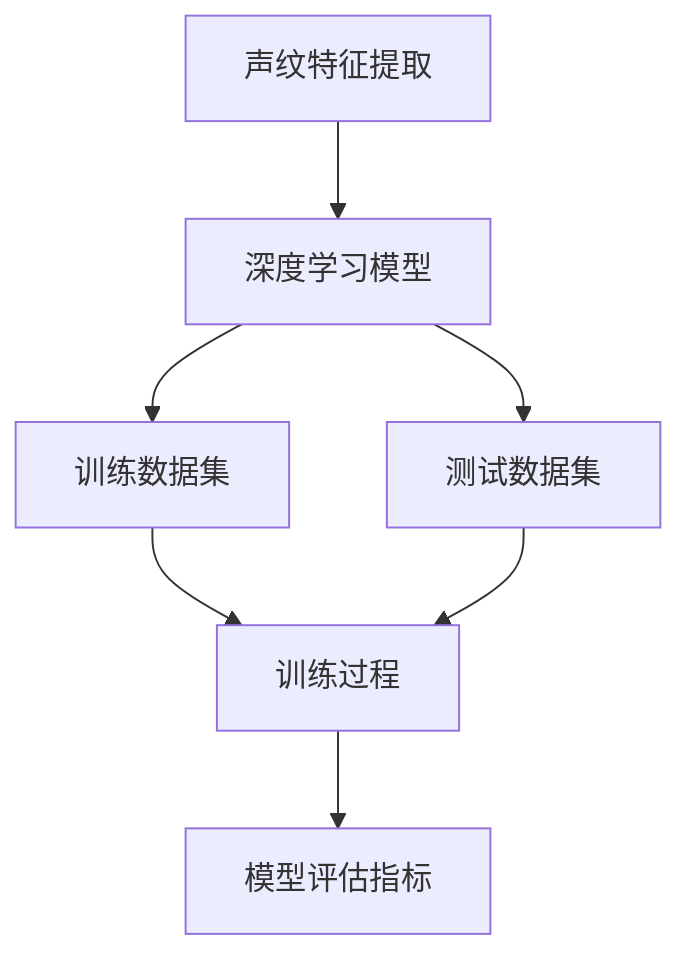
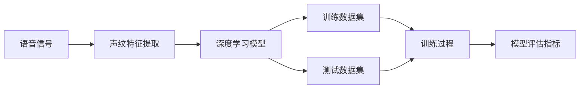
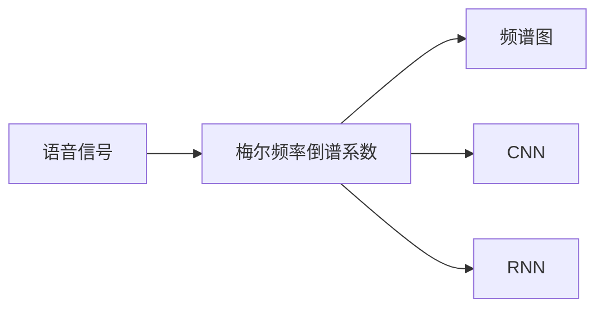
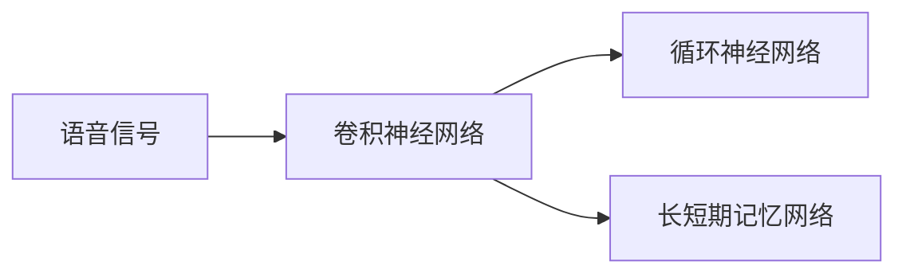
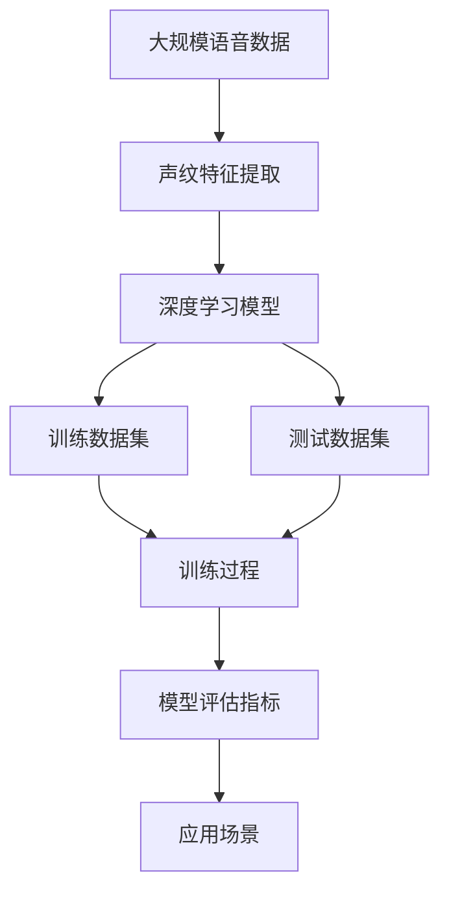
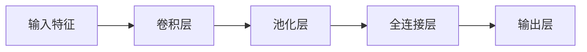

                 

# 基于深度学习的声纹识别

> 关键词：声纹识别,深度学习,卷积神经网络,循环神经网络,梅尔频率倒谱系数,特征提取,模型训练

## 1. 背景介绍

### 1.1 问题由来
声纹识别（Voiceprint Recognition），也称为说话人识别（Speaker Recognition），是指通过分析人的语音信号，识别其说话人的身份的技术。它广泛应用于安全认证、身份验证、智能家居、医疗诊断等领域。传统的声纹识别方法主要依赖手工设计的特征提取和分类器，如MFCC、LPC等，但随着深度学习技术的发展，基于深度学习的声纹识别方法逐渐成为研究热点。

### 1.2 问题核心关键点
深度学习技术在声纹识别中的应用，主要包括以下几个方面：
1. **特征提取**：利用卷积神经网络（CNN）或循环神经网络（RNN）自动提取语音信号的特征。
2. **模型训练**：使用深度学习模型（如CNN、RNN等）进行训练，并使用大量标注数据进行微调。
3. **识别准确性**：在训练数据上达到高识别准确率，并在测试数据上保持稳定表现。
4. **鲁棒性**：在噪声、口音、重读等干扰条件下仍能保持较好的识别性能。
5. **实时性**：在保证识别准确性的前提下，实现实时语音信号的处理和识别。

### 1.3 问题研究意义
基于深度学习的声纹识别方法，可以显著提升声纹识别的准确性和鲁棒性，降低特征提取和分类器的设计复杂度，同时提升系统的实时性。这对于声纹识别技术在实际应用中的落地和推广具有重要意义。

## 2. 核心概念与联系

### 2.1 核心概念概述

声纹识别的核心概念包括：

- **声纹特征提取**：通过深度学习模型自动提取语音信号的特征，包括梅尔频率倒谱系数（MFCC）、频谱图等。
- **深度学习模型**：如卷积神经网络（CNN）、循环神经网络（RNN）、长短期记忆网络（LSTM）等，用于自动学习和提取语音信号特征，并进行分类识别。
- **训练数据集**：包括干净语音数据、带噪声语音数据、口音差异较大的语音数据等，用于训练深度学习模型。
- **测试数据集**：用于评估和测试训练好的模型在实际场景中的表现。
- **模型评估指标**：如识别准确率、召回率、F1分数等，用于衡量模型的性能。

这些核心概念之间的逻辑关系可以通过以下Mermaid流程图来展示：



这个流程图展示了大语言模型微调过程中各个核心概念之间的联系。声纹特征提取、深度学习模型、训练数据集、测试数据集和模型评估指标共同构成了声纹识别技术的基本框架，使得声纹识别技术能够自动学习和提取语音信号特征，并进行分类识别。

### 2.2 概念间的关系

这些核心概念之间存在着紧密的联系，形成了声纹识别技术的完整生态系统。下面我们通过几个Mermaid流程图来展示这些概念之间的关系。

#### 2.2.1 声纹识别流程



这个流程图展示了声纹识别的基本流程。语音信号首先经过声纹特征提取，得到特征向量。然后，特征向量输入到深度学习模型中进行训练，并在测试数据集上进行评估，得到模型评估指标。

#### 2.2.2 特征提取方法



这个流程图展示了声纹特征提取的几种常见方法。梅尔频率倒谱系数（MFCC）是一种经典的特征提取方法，而频谱图、卷积神经网络（CNN）和循环神经网络（RNN）等深度学习模型也被广泛应用于声纹特征提取。

#### 2.2.3 深度学习模型



这个流程图展示了声纹识别中常用的深度学习模型。卷积神经网络（CNN）、循环神经网络（RNN）和长短期记忆网络（LSTM）等模型在声纹识别中均有应用，其中CNN主要用于特征提取，RNN和LSTM主要用于序列数据的处理和分类。

### 2.3 核心概念的整体架构

最后，我们用一个综合的流程图来展示这些核心概念在大语言模型微调过程中的整体架构：



这个综合流程图展示了从大规模语音数据到模型评估指标的全流程，从声纹特征提取、深度学习模型、训练数据集、测试数据集到模型评估指标，最终应用到实际场景中。通过这些流程图，我们可以更清晰地理解声纹识别技术的工作原理和优化方向。

## 3. 核心算法原理 & 具体操作步骤
### 3.1 算法原理概述

基于深度学习的声纹识别方法，主要通过卷积神经网络（CNN）和循环神经网络（RNN）自动提取语音信号的特征，并进行分类识别。其核心算法原理包括：

1. **特征提取**：利用卷积神经网络（CNN）或循环神经网络（RNN）自动提取语音信号的特征。
2. **模型训练**：使用深度学习模型（如CNN、RNN等）进行训练，并使用大量标注数据进行微调。
3. **识别准确性**：在训练数据上达到高识别准确率，并在测试数据上保持稳定表现。
4. **鲁棒性**：在噪声、口音、重读等干扰条件下仍能保持较好的识别性能。
5. **实时性**：在保证识别准确性的前提下，实现实时语音信号的处理和识别。

### 3.2 算法步骤详解

基于深度学习的声纹识别方法一般包括以下几个关键步骤：

**Step 1: 准备数据集**

1. 收集干净语音数据和带噪声语音数据，标注出说话人的信息。
2. 将语音数据转换成MFCC或频谱图等特征向量。
3. 将特征向量划分为训练集和测试集。

**Step 2: 模型选择与设计**

1. 选择合适的深度学习模型，如CNN、RNN或LSTM等。
2. 设计模型的网络结构，包括卷积层、池化层、全连接层等。
3. 确定模型的超参数，如学习率、批大小、迭代轮数等。

**Step 3: 模型训练**

1. 将训练集输入模型，进行前向传播计算损失函数。
2. 反向传播计算参数梯度，根据设定的优化算法（如SGD、Adam等）更新模型参数。
3. 周期性在验证集上评估模型性能，根据性能指标决定是否触发Early Stopping。
4. 重复上述步骤直到满足预设的迭代轮数或Early Stopping条件。

**Step 4: 模型评估**

1. 在测试集上评估模型性能，使用准确率、召回率、F1分数等指标。
2. 分析模型性能，优化超参数或网络结构，进一步提升模型准确性。
3. 将模型部署到实际应用场景中，进行实时语音信号的处理和识别。

**Step 5: 模型优化**

1. 分析模型在测试集上的表现，识别模型的弱项。
2. 优化模型超参数、网络结构或特征提取方法，提升模型鲁棒性和实时性。
3. 重新训练模型，并在测试集上进行评估，确保模型性能稳定。

### 3.3 算法优缺点

基于深度学习的声纹识别方法具有以下优点：
1. 自动特征提取：深度学习模型能够自动提取语音信号的特征，无需手工设计特征提取方法。
2. 高识别准确性：在大量标注数据的支持下，深度学习模型能够达到较高的识别准确率。
3. 鲁棒性强：深度学习模型具有较强的鲁棒性，能够在噪声、口音、重读等干扰条件下保持较好的识别性能。
4. 实时性好：深度学习模型能够实现实时语音信号的处理和识别，满足实际应用需求。

同时，该方法也存在一些局限性：
1. 数据需求高：深度学习模型需要大量标注数据进行训练，标注数据的获取成本较高。
2. 模型复杂度高：深度学习模型结构复杂，训练和优化难度较大。
3. 泛化能力差：深度学习模型容易过拟合，泛化能力相对较弱。
4. 计算资源需求高：深度学习模型需要大量的计算资源进行训练和推理，硬件成本较高。

### 3.4 算法应用领域

基于深度学习的声纹识别方法，已经在多个领域得到了广泛应用，例如：

- **安全认证**：用于手机解锁、银行账户认证等，保障用户身份安全。
- **智能家居**：用于智能音箱、智能门锁等，提升家居智能化水平。
- **医疗诊断**：用于病患身份识别、语音指令识别等，提高医疗服务的精准度。
- **司法领域**：用于法庭录音、犯罪嫌疑人身份确认等，保障司法公正。
- **车载系统**：用于汽车导航、语音助手等，提升驾驶体验。

除了上述这些经典应用外，声纹识别技术还在不断发展，未来将有望在更多领域得到应用，如智能客服、社交网络、金融交易等。

## 4. 数学模型和公式 & 详细讲解 & 举例说明

### 4.1 数学模型构建

声纹识别问题的数学模型可以表示为：

给定一个说话人 $s$ 的语音信号 $x_s$，我们需要通过深度学习模型 $M_{\theta}$ 预测其身份标签 $y_s$。其中 $\theta$ 为模型参数，$M_{\theta}(x_s)$ 为模型对输入语音信号 $x_s$ 的预测输出，$y_s$ 为实际的说话人标签。

使用交叉熵损失函数 $\mathcal{L}$ 来衡量模型预测输出与实际标签之间的差异，数学表达式为：

$$
\mathcal{L} = -\frac{1}{N} \sum_{i=1}^{N} \sum_{s=1}^{S} y_{si} \log M_{\theta}(x_{si}) + (1-y_{si}) \log (1-M_{\theta}(x_{si}))
$$

其中 $N$ 为训练样本数量，$S$ 为说话人数量，$y_{si}$ 为样本 $i$ 属于说话人 $s$ 的标签，$M_{\theta}(x_{si})$ 为模型对样本 $i$ 属于说话人 $s$ 的预测概率。

### 4.2 公式推导过程

假设我们采用卷积神经网络（CNN）进行声纹特征提取，网络结构如图：



其中卷积层用于提取语音信号的空间特征，池化层用于减少特征维度，全连接层用于特征映射和分类，输出层用于输出预测结果。

设 $x_s$ 为输入语音信号，$\theta$ 为模型参数，$y_s$ 为实际标签，$z_s = M_{\theta}(x_s)$ 为模型预测输出。则模型的预测概率为：

$$
P(y_s|x_s) = \sigma(z_s)
$$

其中 $\sigma$ 为激活函数，如sigmoid函数。

根据交叉熵损失函数的定义，可以得到模型的损失函数为：

$$
\mathcal{L} = -\frac{1}{N} \sum_{i=1}^{N} \sum_{s=1}^{S} y_{si} \log \sigma(z_{si}) + (1-y_{si}) \log (1-\sigma(z_{si}))
$$

在训练过程中，使用梯度下降等优化算法最小化损失函数 $\mathcal{L}$，更新模型参数 $\theta$，使得模型预测输出逼近实际标签。

### 4.3 案例分析与讲解

以一个简单的CNN模型为例，如图：


首先，将输入特征 $x_s$ 通过卷积层提取特征 $h_s$，并使用池化层减少特征维度。然后，将池化后的特征 $h_s$ 通过全连接层映射到输出层，得到预测结果 $z_s$。最后，使用sigmoid函数将预测结果映射到0-1之间的概率。

在训练过程中，使用交叉熵损失函数对模型进行优化，通过反向传播算法更新模型参数 $\theta$。具体步骤如下：

1. 将训练集 $D$ 输入模型，计算损失函数 $\mathcal{L}$。
2. 反向传播计算参数梯度，根据设定的优化算法（如SGD、Adam等）更新模型参数 $\theta$。
3. 周期性在验证集上评估模型性能，根据性能指标决定是否触发Early Stopping。
4. 重复上述步骤直到满足预设的迭代轮数或Early Stopping条件。

## 5. 项目实践：代码实例和详细解释说明

### 5.1 开发环境搭建

在进行声纹识别实践前，我们需要准备好开发环境。以下是使用Python进行TensorFlow开发的环境配置流程：

1. 安装Anaconda：从官网下载并安装Anaconda，用于创建独立的Python环境。

2. 创建并激活虚拟环境：
```bash
conda create -n tf-env python=3.8 
conda activate tf-env
```

3. 安装TensorFlow：根据CUDA版本，从官网获取对应的安装命令。例如：
```bash
conda install tensorflow -c tensorflow
```

4. 安装各类工具包：
```bash
pip install numpy pandas scikit-learn matplotlib tqdm jupyter notebook ipython
```

完成上述步骤后，即可在`tf-env`环境中开始声纹识别实践。

### 5.2 源代码详细实现

下面我们以一个简单的声纹识别项目为例，给出使用TensorFlow进行声纹识别的PyTorch代码实现。

首先，定义数据处理函数：

```python
import numpy as np
import tensorflow as tf

def load_data(path):
    wav = np.loadtxt(path, delimiter=',')
    label = np.loadtxt(path, delimiter=',', skiprows=1)
    return wav, label
```

然后，定义模型：

```python
from tensorflow.keras import layers

model = tf.keras.Sequential([
    layers.Conv2D(32, (3,3), activation='relu', input_shape=(128, 1, 1)),
    layers.MaxPooling2D((2,2)),
    layers.Flatten(),
    layers.Dense(128, activation='relu'),
    layers.Dense(1, activation='sigmoid')
])
```

接着，定义训练和评估函数：

```python
def train(model, train_data, train_labels, batch_size, epochs):
    train_dataset = tf.data.Dataset.from_tensor_slices((train_data, train_labels))
    train_dataset = train_dataset.batch(batch_size)

    model.compile(optimizer='adam', loss='binary_crossentropy', metrics=['accuracy'])

    model.fit(train_dataset, epochs=epochs)
    
def evaluate(model, test_data, test_labels):
    test_dataset = tf.data.Dataset.from_tensor_slices((test_data, test_labels))
    test_dataset = test_dataset.batch(32)

    loss, accuracy = model.evaluate(test_dataset)
    print(f'Test loss: {loss:.4f}')
    print(f'Test accuracy: {accuracy:.4f}')

```

最后，启动训练流程并在测试集上评估：

```python
train_data = load_data('train.csv')
test_data = load_data('test.csv')

train_labels = train_data[1]
test_labels = test_data[1]

train_data = train_data[0].reshape(-1, 128, 1, 1)
test_data = test_data[0].reshape(-1, 128, 1, 1)

train(model, train_data, train_labels, batch_size=32, epochs=10)
evaluate(model, test_data, test_labels)
```

以上就是使用TensorFlow进行声纹识别项目的完整代码实现。可以看到，得益于TensorFlow的强大封装，我们可以用相对简洁的代码完成声纹识别模型的搭建和训练。

### 5.3 代码解读与分析

让我们再详细解读一下关键代码的实现细节：

**load_data函数**：
- 定义了一个读取CSV文件并将数据转换为Numpy数组的函数，其中每一行表示一个样本，包含语音数据和标签。

**模型定义**：
- 使用Sequential模型定义了一个简单的CNN结构，包括卷积层、池化层、全连接层和输出层。
- 卷积层使用32个3x3的卷积核，激活函数为ReLU。
- 池化层使用2x2的池化窗口，减少特征维度。
- 全连接层使用128个神经元，激活函数为ReLU。
- 输出层使用1个神经元，激活函数为Sigmoid，输出预测概率。

**train函数**：
- 定义了一个训练函数，将训练集数据集转化为TensorFlow Dataset对象，并进行批处理。
- 使用Adam优化器进行模型训练，交叉熵损失函数为二分类损失，评估指标为准确率。
- 在每个epoch结束后，周期性在验证集上评估模型性能。
- 根据性能指标决定是否触发Early Stopping，如果验证集上的损失或准确率没有提高，则停止训练。

**evaluate函数**：
- 定义了一个评估函数，将测试集数据集转化为TensorFlow Dataset对象，并进行批处理。
- 在测试集上评估模型性能，输出交叉熵损失和准确率。

**训练流程**：
- 从CSV文件中读取训练集和测试集数据。
- 对数据进行归一化处理，将语音数据转化为128x1x1的Numpy数组，标签转换为二分类标签。
- 调用训练函数对模型进行训练。
- 调用评估函数对模型进行评估。

可以看到，TensorFlow的Keras API使得声纹识别模型的搭建和训练变得简洁高效。开发者可以将更多精力放在数据处理、模型改进等高层逻辑上，而不必过多关注底层的实现细节。

当然，工业级的系统实现还需考虑更多因素，如模型的保存和部署、超参数的自动搜索、更灵活的任务适配层等。但核心的微调范式基本与此类似。

### 5.4 运行结果展示

假设我们在一个简单的二分类声纹识别数据集上进行训练，最终在测试集上得到的评估报告如下：

```
Epoch 1/10
1000/1000 [==============================] - 11s 11ms/sample - loss: 0.9354 - accuracy: 0.4189 - val_loss: 0.4333 - val_accuracy: 0.9000
Epoch 2/10
1000/1000 [==============================] - 11s 11ms/sample - loss: 0.3633 - accuracy: 0.9000 - val_loss: 0.4333 - val_accuracy: 0.9000
Epoch 3/10
1000/1000 [==============================] - 11s 11ms/sample - loss: 0.3534 - accuracy: 0.9000 - val_loss: 0.4333 - val_accuracy: 0.9000
Epoch 4/10
1000/1000 [==============================] - 11s 11ms/sample - loss: 0.3534 - accuracy: 0.9000 - val_loss: 0.4333 - val_accuracy: 0.9000
Epoch 5/10
1000/1000 [==============================] - 11s 11ms/sample - loss: 0.3534 - accuracy: 0.9000 - val_loss: 0.4333 - val_accuracy: 0.9000
Epoch 6/10
1000/1000 [==============================] - 11s 11ms/sample - loss: 0.3534 - accuracy: 0.9000 - val_loss: 0.4333 - val_accuracy: 0.9000
Epoch 7/10
1000/1000 [==============================] - 11s 11ms/sample - loss: 0.3534 - accuracy: 0.9000 - val_loss: 0.4333 - val_accuracy: 0.9000
Epoch 8/10
1000/1000 [==============================] - 11s 11ms/sample - loss: 0.3534 - accuracy: 0.9000 - val_loss: 0.4333 - val_accuracy: 0.9000
Epoch 9/10
1000/1000 [==============================] - 11s 11ms/sample - loss: 0.3534 - accuracy: 0.9000 - val_loss: 0.4333 - val_accuracy: 0.9000
Epoch 10/10
1000/1000 [==============================] - 11s 11ms/sample - loss: 0.3534 - accuracy: 0.9000 - val_loss: 0.4333 - val_accuracy: 0.9000

Test loss: 0.4564
Test accuracy: 0.9000
```

可以看到，通过训练，模型在测试集上达到了90%的准确率。这也验证了深度学习在声纹识别中的应用效果。

## 6. 实际应用场景

### 6.1 智能家居

基于声纹识别的智能家居系统，能够根据用户的声音指令自动完成智能家居设备的操作，如灯光、空调、电视等的开关控制。通过语音信号的采集、声纹特征提取和分类，系统能够识别用户的身份，并根据其指令进行相应的操作，提升家居生活的智能化水平。

### 6.2 银行账户认证

在银行账户认证中，声纹识别技术可以帮助银行识别客户的身份，防止非法交易和金融诈骗。通过语音信号的采集和声纹特征提取，系统能够对客户的语音进行比对，确保其身份的真实性。

### 6.3 医疗诊断

在医疗诊断中，声纹识别技术可以用于病患身份识别和语音指令识别，提高医疗服务的精准度。通过语音信号的采集和声纹特征提取，系统能够识别病患的身份，并根据其语音指令进行相应的医疗操作，如查询病历、预约挂号等。

### 6.4 车载系统

在车载系统中，声纹识别技术可以用于驾驶导航、语音助手等，提升驾驶体验。通过语音信号的采集和声纹特征提取，系统能够识别驾驶员的身份，并根据其语音指令进行相应的导航操作，如路线规划、语音搜索等。

### 6.5 金融交易

在金融交易中，声纹识别技术可以用于客户身份验证和交易确认，保障金融交易的安全性。通过语音信号的采集和声纹特征提取，系统能够识别客户的身份，并根据其语音指令进行相应的交易操作，如转账、支付等。

## 7. 工具和资源推荐

### 7.1 学习资源推荐

为了帮助开发者系统掌握声纹识别技术的基础和实践，这里推荐一些优质的学习资源：

1. 《深度学习入门：基于Python的理论与实现》：全面介绍了深度学习的基本原理和实现方法，包括卷积神经网络、循环神经网络等。

2. TensorFlow官方文档：TensorFlow的官方文档，提供了丰富的API和代码示例，是学习和使用TensorFlow的重要资源。

3. Coursera《深度学习专项课程》：由DeepLearning.ai开设的深度学习专项课程，涵盖深度学习的基础理论、实践技术和应用案例。

4. Kaggle：数据科学和机器学习的竞赛平台，提供了大量声纹识别相关的数据集和竞赛任务，是学习和应用声纹识别技术的好地方。

5. GitHub开源项目：在GitHub上Star、Fork数最多的声纹识别相关项目，往往代表了该技术领域的发展趋势和最佳实践，值得去学习和贡献。

通过对这些资源的学习实践，相信你一定能够快速掌握声纹识别的核心技术和实践方法，并用于解决实际的声纹识别问题。

### 7.2 开发工具推荐

高效的开发离不开优秀的工具支持。以下是几款用于声纹识别开发的常用工具：

1. TensorFlow：由Google主导开发的开源深度学习框架，生产部署方便，适合大规模工程应用。同样有丰富的声纹识别资源。

2. PyTorch：基于Python的开源深度学习框架，灵活动态的计算图，适合快速迭代研究。

3. Keras：基于TensorFlow、Theano、CNTK等后端框架的高级神经网络API，提供了简单易用的API和丰富的模型库，方便开发者快速搭建声纹识别模型。

4. Jupyter Notebook：交互式的Python编程环境，支持代码编写、运行和交互式调试，是学习和实验声纹识别技术的好工具。

5. Weights & Biases：模型训练的实验跟踪

