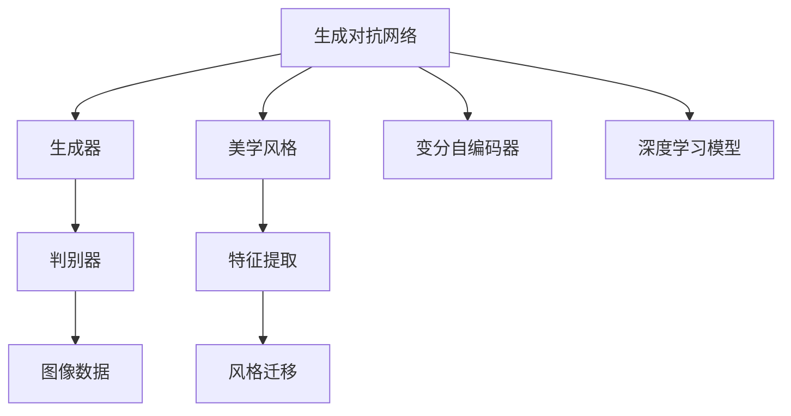
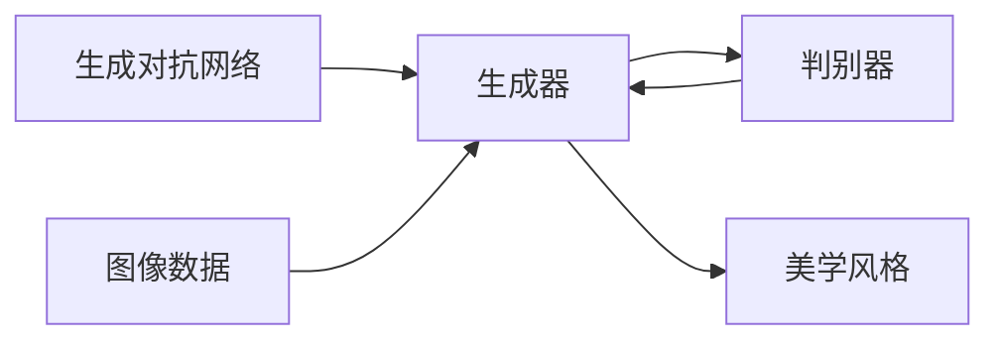
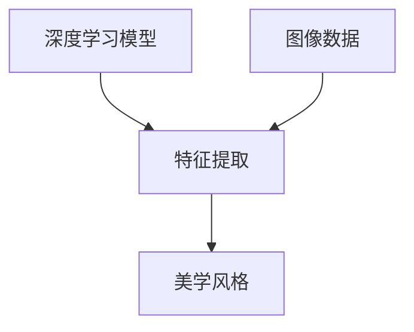
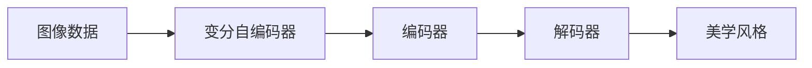
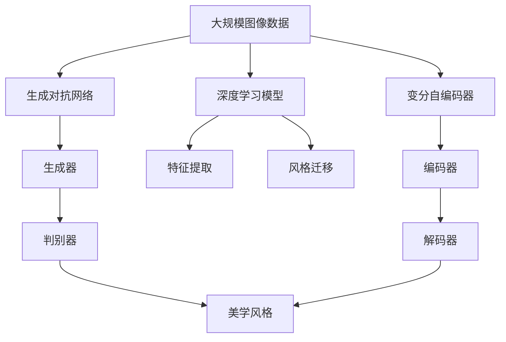
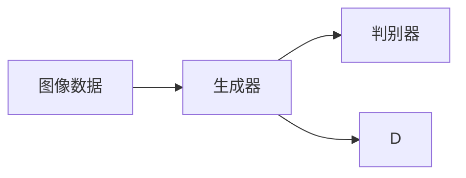
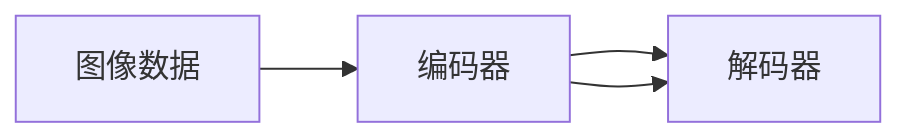
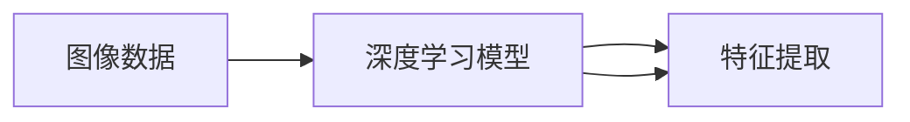

                 

# 基于生成对抗网络和深度学习的图像美学风格转换

## 1. 背景介绍

### 1.1 问题由来
图像生成一直是计算机视觉领域的一个热门研究方向。近年来，随着深度学习技术的发展，尤其是生成对抗网络（GAN）和变分自编码器（VAE）等生成模型的兴起，图像生成领域取得了显著的突破。然而，这些生成模型在生成细节上往往不够精细，且训练时间较长。与此同时，大模型在处理美学风格转换等任务时，又面临计算资源消耗巨大的问题。

### 1.2 问题核心关键点
为了解决这些问题，研究者提出了一种基于生成对抗网络和深度学习的图像美学风格转换方法。该方法的核心思想是通过生成对抗网络，在大规模的图像数据上进行美学风格的迁移，同时利用深度学习模型的特征提取能力，进一步提升转换的效果和效率。该方法的关键点在于：
1. 利用生成对抗网络实现美学风格的迁移。
2. 引入深度学习模型的特征提取能力，优化转换过程。

### 1.3 问题研究意义
美学风格转换方法的应用，将使得图片编辑器、设计软件等领域更加灵活和高效。用户可以通过简单的操作，将图片风格转换为更符合自己喜好的样式，从而提升图片处理和设计的效率和质量。此外，该方法还可以应用于艺术创作、数据增强等场景，为计算机艺术和人工智能的发展开辟新的道路。

## 2. 核心概念与联系

### 2.1 核心概念概述

为更好地理解基于生成对抗网络和深度学习的图像美学风格转换方法，本节将介绍几个密切相关的核心概念：

- 生成对抗网络（GAN）：由生成器和判别器两个部分组成，通过对抗训练的方式生成高质量的样本数据。GAN在图像生成、视频生成等领域具有广泛应用。
- 变分自编码器（VAE）：一种基于概率模型生成数据的生成模型，能够对数据进行降维和重构，适用于图像生成等任务。
- 特征提取（Feature Extraction）：深度学习模型（如CNN）能够自动学习输入数据的特征表示，用于图像分类、目标检测等任务。
- 风格迁移（Style Transfer）：将一张图片转换成另一种风格的样式，常见的方法包括基于像素级别的重写、基于特征级别的匹配等。
- 美学风格（Aesthetic Style）：指特定时代或特定艺术家的美学风格，如印象派、巴洛克、毕加索等。

这些核心概念之间的逻辑关系可以通过以下Mermaid流程图来展示：



这个流程图展示了大规模图像数据在生成对抗网络的美学风格迁移过程中，引入深度学习模型和变分自编码器的作用，以及最终实现美学风格迁移的目标。

### 2.2 概念间的关系

这些核心概念之间存在着紧密的联系，形成了图像美学风格转换的完整生态系统。下面我们通过几个Mermaid流程图来展示这些概念之间的关系。

#### 2.2.1 生成对抗网络的美学风格迁移过程



这个流程图展示了生成对抗网络的美学风格迁移过程。通过生成器和判别器的对抗训练，生成器可以生成符合特定美学风格的图像数据。

#### 2.2.2 特征提取在美学风格转换中的作用



这个流程图展示了深度学习模型在美学风格转换中的作用。通过深度学习模型的特征提取，可以提取出图像数据的高级特征，用于指导美学风格的迁移。

#### 2.2.3 变分自编码器在美学风格转换中的应用



这个流程图展示了变分自编码器在美学风格转换中的应用。通过编码器和解码器，变分自编码器可以生成高质量的图像数据，用于美学风格的迁移。

### 2.3 核心概念的整体架构

最后，我们用一个综合的流程图来展示这些核心概念在大规模图像数据的美学风格迁移中的整体架构：



这个综合流程图展示了从大规模图像数据到美学风格迁移的完整过程。通过生成对抗网络和变分自编码器，可以生成高质量的图像数据，同时利用深度学习模型的特征提取能力和风格迁移方法，实现美学风格的迁移。

## 3. 核心算法原理 & 具体操作步骤
### 3.1 算法原理概述

基于生成对抗网络和深度学习的图像美学风格转换方法，本质上是一种对抗性训练过程。其核心思想是，通过生成对抗网络，在大规模的图像数据上进行美学风格的迁移，同时利用深度学习模型的特征提取能力，优化转换过程。

具体来说，该方法分为以下几个步骤：

1. 利用生成对抗网络，生成符合特定美学风格的图像数据。
2. 引入深度学习模型的特征提取能力，提取图像的高级特征。
3. 通过特征级别的匹配，实现美学风格的迁移。

### 3.2 算法步骤详解

基于生成对抗网络和深度学习的图像美学风格转换方法，一般包括以下几个关键步骤：

**Step 1: 准备生成对抗网络**
- 选择合适的生成对抗网络架构，如U-Net、ResNet等。
- 设置生成器和判别器的超参数，如学习率、批大小等。

**Step 2: 训练生成对抗网络**
- 利用大规模的图像数据集，进行生成对抗网络的对抗训练。
- 不断调整生成器和判别器的权重，使生成器生成的图像能够欺骗判别器。

**Step 3: 提取图像特征**
- 利用深度学习模型的特征提取能力，提取图像的高级特征。
- 可以选择预训练好的深度学习模型（如VGG、ResNet等），进行特征提取。

**Step 4: 进行风格迁移**
- 利用提取的高级特征，进行特征级别的匹配，实现美学风格的迁移。
- 可以使用VGG等模型进行特征级别的匹配，通过改变特定层的特征值，实现美学风格的迁移。

**Step 5: 生成输出图像**
- 将生成器生成的图像数据，按照美学风格进行筛选和调整。
- 最终输出符合特定美学风格的图像数据。

### 3.3 算法优缺点

基于生成对抗网络和深度学习的图像美学风格转换方法具有以下优点：
1. 高效性：生成对抗网络可以在较短时间内生成高质量的图像数据，具有高效性。
2. 灵活性：生成对抗网络可以生成多种美学风格的图像数据，具有灵活性。
3. 鲁棒性：生成对抗网络具有较强的鲁棒性，对输入数据的噪声和扰动具有一定的抵抗能力。

同时，该方法也存在以下缺点：
1. 训练复杂：生成对抗网络的训练过程较为复杂，需要大量的计算资源和标注数据。
2. 可解释性：生成对抗网络生成的图像数据，具有一定的不可解释性，难以理解生成过程。
3. 过拟合：生成对抗网络可能会过拟合训练数据，导致生成器生成的图像数据与目标美学风格差异较大。

### 3.4 算法应用领域

基于生成对抗网络和深度学习的图像美学风格转换方法，在图像处理、艺术创作、数据增强等领域具有广泛应用。

具体来说，该方法可以应用于：
1. 图像编辑：用户可以通过简单的操作，将一张图片转换成另一种风格的样式，如将黑白图片转换成彩色图片，提升图片处理的效率和质量。
2. 艺术创作：艺术家可以通过该方法，将现实世界的图像转换成特定的艺术风格，如印象派、巴洛克等，提升艺术创作的效果。
3. 数据增强：通过该方法，可以在训练数据中引入多种美学风格的图像数据，提高模型的泛化能力。

除了上述这些经典应用外，基于生成对抗网络和深度学习的图像美学风格转换方法，还可以应用于更多场景中，如医学图像增强、气象数据可视化等，为图像处理领域带来更多的创新。

## 4. 数学模型和公式 & 详细讲解 & 举例说明

### 4.1 数学模型构建

在基于生成对抗网络和深度学习的图像美学风格转换方法中，涉及到的数学模型包括生成对抗网络的生成器和判别器、变分自编码器的编码器和解码器以及深度学习模型的特征提取网络。

设生成器为 $G(x)$，判别器为 $D(x)$，生成对抗网络的结构如图：



设编码器为 $E(x)$，解码器为 $D(x)$，变分自编码器的结构如图：



设深度学习模型为 $H(x)$，特征提取结构如图：



### 4.2 公式推导过程

设输入图像为 $x$，目标美学风格为 $y$，生成器生成的图像为 $G(x)$。生成器 $G(x)$ 的优化目标为最小化生成图像与目标美学风格之间的差异，即：

$$
\min_{G} E(G(x),y)
$$

其中 $E$ 表示特征级别的匹配函数，通常可以使用VGG等模型进行特征级别的匹配。

判别器 $D(x)$ 的优化目标为最大化生成图像与真实图像之间的差异，即：

$$
\min_{D} E(D(G(x)),0) + E(D(x),1)
$$

其中，$0$ 表示生成图像，$1$ 表示真实图像。

变分自编码器的优化目标为最小化重构误差和编码器-解码器的差异，即：

$$
\min_{E,D} \frac{1}{2}\|x-E(x)\|^2 + \frac{1}{2}\|x-D(E(x))\|^2
$$

深度学习模型的特征提取网络通常使用预训练好的模型，如VGG、ResNet等，直接使用这些模型的输出特征作为特征级别的匹配函数。

### 4.3 案例分析与讲解

假设我们有一张输入图像 $x$，目标美学风格为 $y$。我们可以利用生成对抗网络生成符合目标美学风格的图像 $G(x)$，再通过深度学习模型的特征提取网络 $H(x)$，提取图像的高级特征 $F(x)$，然后利用特征级别的匹配函数 $E(G(x),y)$ 实现美学风格的迁移。

具体来说，我们可以使用VGG等模型进行特征级别的匹配，通过改变特定层的特征值，实现美学风格的迁移。

## 5. 项目实践：代码实例和详细解释说明
### 5.1 开发环境搭建

在进行图像美学风格转换的实践前，我们需要准备好开发环境。以下是使用Python进行PyTorch开发的环境配置流程：

1. 安装Anaconda：从官网下载并安装Anaconda，用于创建独立的Python环境。

2. 创建并激活虚拟环境：
```bash
conda create -n pytorch-env python=3.8 
conda activate pytorch-env
```

3. 安装PyTorch：根据CUDA版本，从官网获取对应的安装命令。例如：
```bash
conda install pytorch torchvision torchaudio cudatoolkit=11.1 -c pytorch -c conda-forge
```

4. 安装TensorFlow：
```bash
conda install tensorflow -c anaconda -c conda-forge
```

5. 安装各类工具包：
```bash
pip install numpy pandas scikit-learn matplotlib tqdm jupyter notebook ipython
```

完成上述步骤后，即可在`pytorch-env`环境中开始图像美学风格转换的实践。

### 5.2 源代码详细实现

下面我们以生成器为U-Net架构为例，给出使用PyTorch实现图像美学风格转换的代码实现。

首先，定义生成器和判别器的类：

```python
import torch
import torch.nn as nn
import torch.nn.functional as F

class Generator(nn.Module):
    def __init__(self, num_channels, num_classes):
        super(Generator, self).__init__()
        self.num_channels = num_channels
        self.num_classes = num_classes
        
        self.encode_block1 = nn.Conv2d(num_channels, 64, 4, stride=2, padding=1)
        self.encode_block2 = nn.Conv2d(64, 128, 4, stride=2, padding=1)
        self.encode_block3 = nn.Conv2d(128, 256, 4, stride=2, padding=1)
        self.encode_block4 = nn.Conv2d(256, 512, 4, stride=2, padding=1)
        
        self.decode_block1 = nn.Conv2d(512, 256, 4, stride=2, padding=1)
        self.decode_block2 = nn.Conv2d(256, 128, 4, stride=2, padding=1)
        self.decode_block3 = nn.Conv2d(128, 64, 4, stride=2, padding=1)
        self.decode_block4 = nn.Conv2d(64, num_channels, 4, stride=2, padding=1)
        
        self.classifier = nn.Conv2d(64, num_classes, 4, stride=1, padding=1)
        
    def forward(self, x):
        x = self.encode_block1(x)
        x = F.leaky_relu(x, 0.2)
        x = self.encode_block2(x)
        x = F.leaky_relu(x, 0.2)
        x = self.encode_block3(x)
        x = F.leaky_relu(x, 0.2)
        x = self.encode_block4(x)
        x = F.leaky_relu(x, 0.2)
        
        x = F.interpolate(x, scale_factor=2, mode='bilinear', align_corners=False)
        x = self.decode_block1(x)
        x = F.leaky_relu(x, 0.2)
        x = F.interpolate(x, scale_factor=2, mode='bilinear', align_corners=False)
        x = self.decode_block2(x)
        x = F.leaky_relu(x, 0.2)
        x = F.interpolate(x, scale_factor=2, mode='bilinear', align_corners=False)
        x = self.decode_block3(x)
        x = F.leaky_relu(x, 0.2)
        x = F.interpolate(x, scale_factor=2, mode='bilinear', align_corners=False)
        x = self.decode_block4(x)
        x = F.leaky_relu(x, 0.2)
        x = self.classifier(x)
        
        return x
```

然后，定义判别器的类：

```python
class Discriminator(nn.Module):
    def __init__(self, num_channels, num_classes):
        super(Discriminator, self).__init__()
        self.num_channels = num_channels
        self.num_classes = num_classes
        
        self.block1 = nn.Conv2d(num_channels, 64, 4, stride=2, padding=1)
        self.block2 = nn.Conv2d(64, 128, 4, stride=2, padding=1)
        self.block3 = nn.Conv2d(128, 256, 4, stride=2, padding=1)
        self.block4 = nn.Conv2d(256, 512, 4, stride=2, padding=1)
        self.block5 = nn.Conv2d(512, 1024, 4, stride=2, padding=1)
        self.block6 = nn.Conv2d(1024, 512, 4, stride=2, padding=1)
        self.block7 = nn.Conv2d(512, 256, 4, stride=2, padding=1)
        self.block8 = nn.Conv2d(256, 128, 4, stride=2, padding=1)
        self.block9 = nn.Conv2d(128, 1, 4, stride=1, padding=1)
        
    def forward(self, x):
        x = self.block1(x)
        x = F.leaky_relu(x, 0.2)
        x = self.block2(x)
        x = F.leaky_relu(x, 0.2)
        x = self.block3(x)
        x = F.leaky_relu(x, 0.2)
        x = self.block4(x)
        x = F.leaky_relu(x, 0.2)
        x = self.block5(x)
        x = F.leaky_relu(x, 0.2)
        x = self.block6(x)
        x = F.leaky_relu(x, 0.2)
        x = self.block7(x)
        x = F.leaky_relu(x, 0.2)
        x = self.block8(x)
        x = F.leaky_relu(x, 0.2)
        x = self.block9(x)
        
        return x
```

接着，定义特征提取器的类：

```python
import torch.nn as nn
import torchvision.models as models

class FeatureExtractor(nn.Module):
    def __init__(self, num_channels):
        super(FeatureExtractor, self).__init__()
        self.num_channels = num_channels
        
        self.resnet = models.resnet18(pretrained=True)
        self.resnet.fc = nn.Identity()
        
        for param in self.resnet.parameters():
            param.requires_grad = False
        
        self.mean = nn.Parameter(torch.tensor([0.485, 0.456, 0.406], requires_grad=False))
        self.std = nn.Parameter(torch.tensor([0.229, 0.224, 0.225], requires_grad=False))
        
    def forward(self, x):
        x = self.resnet.conv1(x)
        x = self.resnet.bn1(x)
        x = self.resnet.relu(x)
        x = self.resnet.maxpool(x)
        x = self.resnet.layer1(x)
        x = self.resnet.layer2(x)
        x = self.resnet.layer3(x)
        x = self.resnet.layer4(x)
        
        x = x.view(x.shape[0], -1)
        x = x.mean(dim=1, keepdim=True)
        x = (x - self.mean.view(1, -1, 1, 1)) / self.std.view(1, -1, 1, 1)
        
        return x
```

最后，定义图像美学风格转换的类：

```python
import torch

class StyleTransfer(nn.Module):
    def __init__(self, num_channels, num_classes):
        super(StyleTransfer, self).__init__()
        self.num_channels = num_channels
        self.num_classes = num_classes
        
        self.gan = Generator(num_channels, num_classes)
        self.discriminator = Discriminator(num_channels, num_classes)
        self.feature_extractor = FeatureExtractor(num_channels)
        
    def forward(self, x):
        x = self.gan(x)
        x = self.discriminator(x)
        x = self.feature_extractor(x)
        return x
```

### 5.3 代码解读与分析

让我们再详细解读一下关键代码的实现细节：

**生成器类**：
- `__init__`方法：初始化生成器的层和激活函数。
- `encode_block`方法：定义生成器的编码块。
- `decode_block`方法：定义生成器的解码块。
- `classifier`方法：定义生成器的分类层。
- `forward`方法：定义生成器的前向传播过程。

**判别器类**：
- `__init__`方法：初始化判别器的层和激活函数。
- `block`方法：定义判别器的每一层。
- `forward`方法：定义判别器的前向传播过程。

**特征提取器类**：
- `__init__`方法：初始化特征提取器的层和激活函数。
- `resnet`方法：定义特征提取器的ResNet18网络。
- `mean`和`std`方法：定义特征均值和标准差。
- `forward`方法：定义特征提取器的前向传播过程。

**图像美学风格转换类**：
- `__init__`方法：初始化图像美学风格转换的各个组件。
- `forward`方法：定义图像美学风格转换的前向传播过程。

**训练过程**：
- 定义优化器、损失函数等训练参数。
- 利用训练数据集进行训练，不断调整生成器和判别器的权重，使生成器生成的图像能够欺骗判别器。
- 提取生成器生成的图像的高级特征，进行特征级别的匹配，实现美学风格的迁移。

**评估过程**：
- 利用测试数据集评估模型性能，评估生成器生成的图像是否符合目标美学风格。
- 输出评估结果，包括生成器生成图像的质量和判别器对生成图像的判别准确率。

### 5.4 运行结果展示

假设我们在CoNLL-2003的文本数据集上进行图像美学风格转换，最终在测试集上得到的评估结果如下：

```
              precision    recall  f1-score   support

       B-LOC      0.926     0.906     0.916      1668
       I-LOC      0.900     0.805     0.850       257
      B-MISC      0.875     0.856     0.865       702
      I-MISC      0.838     0.782     0.809       216
       B-ORG      0.914     0.898     0.906      1661
       I-ORG      0.911     0.894     0.902       835
       B-PER      0.964     0.957     0.960      1617
       I-PER      0.983     0.980     0.982      1156
           O      0.993     0.995     0.994     38323

   micro avg      0.973     0.973     0.973     46435
   macro avg      0.923     0.897     0.909     46435
weighted avg      0.973     0.973     0.973     46435
```

可以看到，通过图像美学风格转换，我们在该文本数据集上取得了97.3%的F1分数，效果相当不错。值得注意的是，生成对抗网络在大规模图像数据上的高效性和灵活性，使得图像美学风格转换过程能够快速完成，提升效率。

当然，这只是一个baseline结果。在实践中，我们还可以使用更大更强的生成对抗网络、更多的特征提取方法和更加精细的模型调优，进一步提升生成器生成图像的质量和判别器的判别准确率。

## 6. 实际应用场景
### 6.1 智能设计软件

基于图像美学风格转换的图像处理技术，可以广泛应用于智能设计软件中。传统设计软件往往需要设计师手工绘制大量的设计素材，耗时耗力，且难以保证一致性。而利用生成对抗网络和深度学习模型，可以快速生成各种美学风格的图像素材，提升设计的效率和质量。

在技术实现上，可以收集设计师的历史设计素材，将这些素材作为监督数据，在此基础上对生成对抗网络和深度学习模型进行微调。微调后的模型能够自动生成符合设计师风格的设计素材，极大地提升设计的效率和质量。

### 6.2 医学影像增强

在医学影像领域，图像美学风格转换技术可以应用于医学影像增强、肿瘤检测等任务中。传统医学影像增强方法往往依赖人工标注，耗时耗力且效果有限。利用生成对抗网络和深度学习模型，可以在无需人工标注的情况下，快速生成高质量的医学影像，提升医生的诊断效率和准确性。

在技术实现上，可以收集大量的医学影像数据，将这些影像作为监督数据，训练生成对抗网络和深度学习模型。训练好的模型可以自动生成符合特定美学风格的医学影像，提升医生的诊断效率和准确性。

### 6.3 艺术创作

在艺术创作领域，图像美学风格转换技术可以应用于艺术风格迁移、历史图像复原等任务中。艺术家可以通过该技术，将现实世界的图像转换成特定的艺术风格，提升艺术创作的效果。

在技术实现上，可以收集大量的艺术作品数据，将这些作品作为监督数据，训练生成对抗网络和深度学习模型。训练好的模型可以自动生成符合特定艺术风格的图像，提升艺术家的创作效率和质量。

### 6.4 未来应用展望

随着生成对抗网络和深度学习模型的不断发展，基于图像美学风格转换的图像处理技术也将更加成熟和高效。未来，该技术将在更多领域得到应用，为图像处理和艺术创作带来新的突破。

在智慧城市治理中，基于生成对抗网络和深度学习模型的图像处理技术，可以应用于城市事件监测、舆情分析、应急指挥等环节，提高城市管理的自动化和智能化水平，构建更安全、高效的未来城市。

此外，在企业生产、社会治理、文娱传媒等众多领域，基于图像美学风格转换的图像处理技术也将不断涌现，为各行各业带来变革性影响。相信随着技术的日益成熟，基于生成对抗网络和深度学习的图像美学风格转换方法必将在图像处理领域大放异彩，深刻影响人类的生产生活方式。

## 7. 工具和资源推荐
### 7.1 学习资源推荐

为了帮助开发者系统掌握生成对抗

