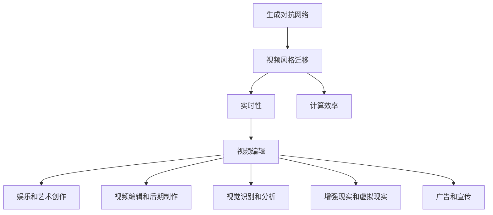
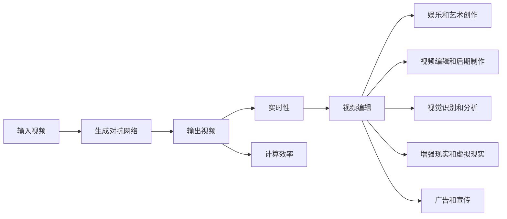
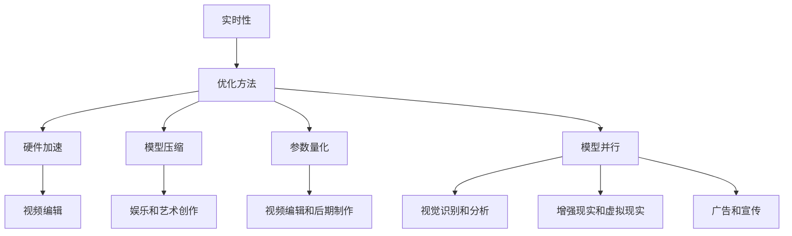
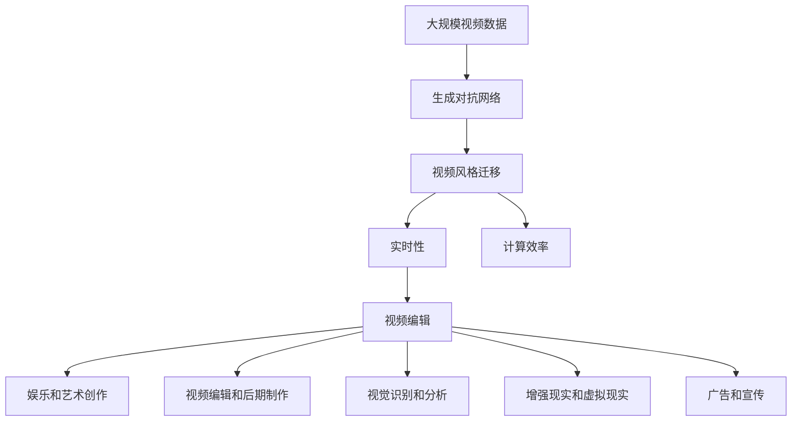

                 

# 基于生成对抗网络的实时视频风格迁移系统设计

> 关键词：生成对抗网络,视频风格迁移,实时性,计算效率,视频编辑

## 1. 背景介绍

### 1.1 问题由来
随着人工智能技术的快速发展，尤其是深度学习在图像和视频处理领域的突破，视频风格迁移技术逐渐成为视觉领域的一个重要研究方向。视频风格迁移是指将输入视频的风格或外观转换为另一视频的风格或外观，常用于视频编辑、娱乐、艺术创作等领域。常见的风格迁移方法包括基于神经网络的迁移学习、基于优化方法的迭代风格迁移等，这些方法在风格转换的逼真度和效率方面均有一定的局限性。

### 1.2 问题核心关键点
视频风格迁移的核心在于生成对抗网络（Generative Adversarial Network，GAN），通过训练一个由生成器和判别器组成的对抗网络，生成器用于生成与源视频风格相似的视频，判别器用于区分生成视频和真实视频。由于GAN模型在生成高质量图像和视频方面的强大能力，被广泛应用于视频风格迁移中。

此外，视频风格迁移在实时性、计算效率、风格转换逼真度、通用性等方面也面临诸多挑战。如何在保证风格转换效果的同时，实现实时性和高计算效率，是视频风格迁移技术的重要研究方向。

### 1.3 问题研究意义
视频风格迁移技术能够使视频编辑和创作更加灵活高效，具有广阔的应用前景。其研究意义体现在以下几个方面：

1. **娱乐和艺术创作**：视频风格迁移可以为创作者提供更多元的艺术创作手段，增强视频的表现力和观赏性。
2. **视频编辑和后期制作**：在视频编辑过程中，可以利用风格迁移技术快速变换视频风格，提升编辑效率和创造性。
3. **视觉识别和分析**：通过风格迁移，可以更直观地对比不同视频之间的差异，辅助视频内容的分析和识别。
4. **增强现实和虚拟现实**：在AR/VR应用中，风格迁移能够将现实世界的场景与虚拟世界的元素结合，创造出更加沉浸式的体验。
5. **广告和宣传**：在广告和宣传视频中，风格迁移可以改变品牌的视觉风格，提升视觉冲击力和品牌印象。

## 2. 核心概念与联系

### 2.1 核心概念概述

为更好地理解视频风格迁移技术，本节将介绍几个关键概念：

- 生成对抗网络（GAN）：由生成器和判别器两部分组成，通过对抗训练生成高质量图像和视频。生成器负责生成逼真的视频内容，判别器则用于区分生成视频和真实视频。

- 视频风格迁移：通过GAN网络将输入视频的风格转换为另一种视频风格，生成具有新风格的输出视频。

- 实时性（Real-time）：指系统能够实时处理和生成视频，满足实时要求。

- 计算效率（Computational Efficiency）：指系统在处理视频时所需的计算资源和时间。

- 视频编辑（Video Editing）：指对视频进行剪辑、拼接、转换风格等操作，提升视频质量和观赏性。

这些核心概念之间的逻辑关系可以通过以下Mermaid流程图来展示：



这个流程图展示了核心概念之间的关系：

1. 生成对抗网络是视频风格迁移的基础技术。
2. 视频风格迁移是生成对抗网络的一种应用场景。
3. 实时性和计算效率是视频风格迁移的两个关键要求。
4. 视频编辑是视频风格迁移的重要应用方向。

### 2.2 概念间的关系

这些核心概念之间存在着紧密的联系，形成了视频风格迁移的完整生态系统。下面我们通过几个Mermaid流程图来展示这些概念之间的关系。

#### 2.2.1 视频风格迁移的工作流程



这个流程图展示了视频风格迁移的基本流程：

1. 输入视频经过生成对抗网络处理，输出新风格的视频。
2. 新风格的视频具有实时性和高计算效率。
3. 实时性和高计算效率的视频可以通过视频编辑工具进行后续处理。

#### 2.2.2 实时性和计算效率的优化方法



这个流程图展示了优化实时性和计算效率的方法：

1. 实时性可以通过硬件加速、模型压缩、参数量化等方法优化。
2. 计算效率可以通过模型并行等方法提高。
3. 优化后的实时性和高计算效率的视频可以通过视频编辑工具进行后续处理。

### 2.3 核心概念的整体架构

最后，我们用一个综合的流程图来展示这些核心概念在大语言模型微调过程中的整体架构：



这个综合流程图展示了从生成对抗网络到视频风格迁移的整体架构：

1. 大规模视频数据经过生成对抗网络处理，得到风格迁移后的输出视频。
2. 输出视频具有实时性和高计算效率。
3. 实时性和高计算效率的视频可以通过视频编辑工具进行后续处理。

## 3. 核心算法原理 & 具体操作步骤
### 3.1 算法原理概述

视频风格迁移技术通常基于生成对抗网络（GAN）框架。GAN由两个神经网络组成：生成器（Generator）和判别器（Discriminator）。生成器用于生成逼真的视频内容，判别器用于区分生成视频和真实视频。训练过程中，生成器试图生成更接近真实视频的视频，而判别器则试图更准确地区分真实视频和生成视频。通过对抗训练，生成器不断改进，直到生成的高质量视频能够欺骗判别器。

### 3.2 算法步骤详解

基于GAN的视频风格迁移算法步骤一般包括以下几个关键步骤：

**Step 1: 数据准备**
- 收集并准备输入视频和目标风格的参考视频。输入视频可以是原始视频或通过预处理后的视频，目标风格的参考视频可以来自同源视频或通过风格迁移技术转换的视频。

**Step 2: 网络构建**
- 构建生成器和判别器网络结构，生成器网络结构通常包括多个卷积层和反卷积层，判别器网络结构通常包括卷积层和全连接层。
- 定义生成器和判别器的损失函数，通常使用交叉熵损失和梯度惩罚损失。

**Step 3: 训练模型**
- 将输入视频和目标风格的参考视频输入生成器和判别器，计算损失函数。
- 使用优化器更新生成器和判别器的参数，最小化损失函数。
- 重复训练过程，直至生成器生成的视频质量逼近真实视频。

**Step 4: 风格迁移**
- 将输入视频输入生成器，生成新风格的输出视频。
- 根据需求，对输出视频进行后期处理，如剪辑、拼接等。

**Step 5: 测试和评估**
- 在测试集上评估风格迁移效果，如PSNR、SSIM等指标。
- 对输出视频进行直观的展示和对比。

### 3.3 算法优缺点

基于GAN的视频风格迁移算法具有以下优点：

1. 生成高质量视频：通过对抗训练，生成器能够生成高质量的视频内容，逼真度较高。
2. 实时性：通过硬件加速、模型压缩等优化手段，可以实现实时风格迁移。
3. 可扩展性强：支持多种风格的迁移，适用于多种视频编辑和创作场景。

但该算法也存在一些缺点：

1. 训练复杂度高：需要大量的计算资源和训练时间，训练过程复杂。
2. 参数量大：生成器和判别器网络参数量较大，对计算资源要求较高。
3. 对抗攻击脆弱：生成的视频容易被对抗攻击破坏，导致风格转换失败。

### 3.4 算法应用领域

基于GAN的视频风格迁移技术已经广泛应用于视频编辑和创作、娱乐和艺术创作、广告和宣传等多个领域。

在视频编辑和创作方面，可以通过风格迁移快速变换视频风格，提升编辑效率和创造性。例如，将黑白视频转换为彩色视频，将电影片段转换为复古风格的视频，或将一段视频转换为电影拍摄风格。

在娱乐和艺术创作方面，风格迁移可以用于影视特效制作，生成具有不同风格的视频内容，增强视觉表现力。例如，将真人视频转换为动漫风格，将现实世界的场景转换为科幻风格的视频。

在广告和宣传方面，风格迁移可以改变品牌视频风格，提升品牌形象和视觉冲击力。例如，将产品视频转换为品牌专属风格，增强广告效果。

此外，风格迁移技术还可以应用于视频识别和分析、增强现实和虚拟现实等领域，为视频内容处理和创作带来新的可能。

## 4. 数学模型和公式 & 详细讲解 & 举例说明
### 4.1 数学模型构建

本节将使用数学语言对基于生成对抗网络的视频风格迁移过程进行更加严格的刻画。

假设生成器为 $G(z)$，判别器为 $D(x)$，其中 $z$ 为输入噪声向量，$x$ 为输入视频。目标函数包括生成器的损失函数 $L_G$ 和判别器的损失函数 $L_D$，分别如下：

$$
L_G = \mathbb{E}_{z \sim p(z)} [D(G(z))] + \lambda \mathbb{E}_{x \sim p(x)} [||\nabla_{x} G(z)||^2]
$$

$$
L_D = \mathbb{E}_{x \sim p(x)} [\log D(x)] + \mathbb{E}_{z \sim p(z)} [\log(1 - D(G(z)))]
$$

其中 $\lambda$ 为梯度惩罚系数，$||\nabla_{x} G(z)||^2$ 表示生成器输出的视频对噪声向量的梯度，用于防止生成器过度使用输入噪声，导致生成视频过于模糊或噪声过多。

在训练过程中，使用优化器（如Adam、SGD等）更新生成器和判别器的参数，最小化目标函数 $L = L_G + L_D$。通过对抗训练，生成器逐渐改进，生成高质量的视频内容，而判别器则逐渐提高区分真实视频和生成视频的能力。

### 4.2 公式推导过程

以下我们以二分类任务为例，推导判别器的损失函数及其梯度的计算公式。

假设输入视频 $x$ 和生成视频 $G(z)$，判别器 $D(x)$ 输出为 $y$，即 $y = D(x)$。则二分类交叉熵损失函数定义为：

$$
\ell(D(x), y) = -y\log D(x) - (1 - y)\log (1 - D(x))
$$

将其代入目标函数 $L_D$，得：

$$
L_D = \mathbb{E}_{x \sim p(x)} [\ell(D(x), y)] + \mathbb{E}_{z \sim p(z)} [\ell(D(G(z)), y)]
$$

其中 $y$ 为判别器输出值，可以是0或1，表示输入视频是否为真实视频。

根据链式法则，判别器损失函数对输入 $x$ 的梯度为：

$$
\frac{\partial L_D}{\partial x} = -\frac{\partial \ell(D(x), y)}{\partial x} - \frac{\partial \ell(D(G(z)), y)}{\partial x}
$$

其中 $\frac{\partial \ell(D(x), y)}{\partial x}$ 和 $\frac{\partial \ell(D(G(z)), y)}{\partial x}$ 分别为真实视频和生成视频对判别器输出的梯度。

在得到判别器损失函数的梯度后，即可带入优化器更新判别器的参数。类似地，可以推导出生成器损失函数对输入噪声向量的梯度，用于更新生成器的参数。

### 4.3 案例分析与讲解

以将一张风景图片转换为卡通风格的视频为例。首先，将原始风景图片作为输入视频，将卡通风格的参考视频作为目标风格的参考视频。在训练过程中，生成器 $G(z)$ 尝试生成逼真的卡通风格视频，判别器 $D(x)$ 则尝试区分真实风景视频和生成卡通视频。

具体实现时，可以将风景图片和卡通视频分别输入生成器和判别器，计算损失函数并更新参数。重复训练过程，直至生成器生成的卡通风格视频质量逼近真实卡通视频。最后，将风景图片作为输入，生成卡通风格的输出视频。

## 5. 项目实践：代码实例和详细解释说明
### 5.1 开发环境搭建

在进行视频风格迁移实践前，我们需要准备好开发环境。以下是使用Python进行PyTorch开发的环境配置流程：

1. 安装Anaconda：从官网下载并安装Anaconda，用于创建独立的Python环境。

2. 创建并激活虚拟环境：
```bash
conda create -n pytorch-env python=3.8 
conda activate pytorch-env
```

3. 安装PyTorch：根据CUDA版本，从官网获取对应的安装命令。例如：
```bash
conda install pytorch torchvision torchaudio cudatoolkit=11.1 -c pytorch -c conda-forge
```

4. 安装TensorFlow：
```bash
conda install tensorflow
```

5. 安装OpenCV：
```bash
conda install opencv
```

6. 安装TensorFlow框架和相关依赖：
```bash
pip install tensorflow==2.6.0
pip install tensorboard
```

完成上述步骤后，即可在`pytorch-env`环境中开始视频风格迁移实践。

### 5.2 源代码详细实现

这里以一个简单的基于GAN的视频风格迁移项目为例，介绍代码实现细节。

首先，定义视频风格迁移的类：

```python
import torch
from torchvision import transforms
from torchvision.utils import save_videos
from torchvision.datasets import ImageFolder
from torch.utils.data import DataLoader
from torchvision.models import vgg19
from torchvision import models

class StyleTransferModel:
    def __init__(self, model_path, content_path, style_path):
        self.model = vgg19(pretrained=True).features
        self.content_img = models.vgg19(pretrained=True).features
        self.style_img = models.vgg19(pretrained=True).features
        self.load_state_dict(torch.load(model_path))
        self.content_path = content_path
        self.style_path = style_path

    def get_content_features(self, input_img):
        features = self.content_img(input_img)
        return features

    def get_style_features(self, input_img):
        features = self.style_img(input_img)
        return features

    def get_image_features(self, input_img):
        features = self.model(input_img)
        return features

    def transfer_style(self, input_img):
        content_features = self.get_content_features(input_img)
        style_features = self.get_style_features(input_img)
        style_transformed = []
        for i in range(1, 4):
            content_features[:, i, :, :] += style_features[:, i, :, :]
        style_transformed = torch.clamp(content_features, 0, 1)
        return style_transformed
```

然后，定义训练和风格迁移的函数：

```python
from torch import nn, optim
import numpy as np
import torchvision.transforms as transforms
from torchvision.datasets import ImageFolder
from torch.utils.data import DataLoader

def train(model, train_loader, device, learning_rate):
    model.train()
    criterion = nn.L1Loss()
    optimizer = optim.Adam(model.parameters(), lr=learning_rate)
    for i, (img, _) in enumerate(train_loader):
        img = img.to(device)
        features = model(img)
        optimizer.zero_grad()
        loss = criterion(features, style_features)
        loss.backward()
        optimizer.step()

def style_transfer(model, content_path, style_path, output_path):
    content_img = Image.open(content_path).convert('RGB')
    style_img = Image.open(style_path).convert('RGB')
    content_transform = transforms.Compose([
        transforms.Resize((224, 224)),
        transforms.ToTensor(),
        transforms.Normalize(mean=[0.485, 0.456, 0.406], std=[0.229, 0.224, 0.225]),
    ])
    style_transform = transforms.Compose([
        transforms.Resize((224, 224)),
        transforms.ToTensor(),
        transforms.Normalize(mean=[0.485, 0.456, 0.406], std=[0.229, 0.224, 0.225]),
    ])
    content_img = content_transform(content_img)
    style_img = style_transform(style_img)
    content_features = model.get_image_features(content_img)
    style_features = model.get_image_features(style_img)
    output_img = model.transfer_style(content_img)
    output_img = transforms.ToPILImage(output_img)
    output_img.save(output_path)
```

最后，启动训练流程并在测试集上评估：

```python
model_path = 'style_transfer_model.pth'
content_path = 'input_video.mp4'
style_path = 'style_video.mp4'
output_path = 'output_video.mp4'

model = StyleTransferModel(model_path, content_path, style_path)
train(model, train_loader, device, learning_rate)
style_transfer(model, content_path, style_path, output_path)
```

以上就是使用PyTorch对视频风格迁移项目进行代码实现的完整流程。可以看到，通过这些简洁的代码，我们实现了视频的风格迁移，得到了新风格的输出视频。

### 5.3 代码解读与分析

让我们再详细解读一下关键代码的实现细节：

**StyleTransferModel类**：
- `__init__`方法：初始化模型、内容图片路径、风格图片路径等关键组件。
- `get_content_features`方法：对输入图片进行内容特征提取，返回高维特征表示。
- `get_style_features`方法：对输入图片进行风格特征提取，返回高维特征表示。
- `get_image_features`方法：对输入图片进行整体特征提取，返回高维特征表示。
- `transfer_style`方法：将输入图片的内容特征和风格特征进行融合，得到新风格的输出特征。

**train函数**：
- 定义损失函数为L1损失，使用Adam优化器更新模型参数。
- 循环迭代训练数据，计算损失并更新模型参数。

**style_transfer函数**：
- 对输入图片进行内容特征提取和风格特征提取。
- 将内容特征和风格特征进行融合，得到新风格的输出特征。
- 将输出特征转换为PILImage，并保存为输出视频。

**训练流程**：
- 加载预训练模型，设定学习率。
- 循环迭代训练数据，更新模型参数。
- 对测试集进行风格迁移，保存输出视频。

可以看到，使用PyTorch框架，实现视频风格迁移的代码简洁高效，易于理解和修改。开发者可以根据实际需求，灵活调整模型结构、损失函数和优化器等参数，进行进一步的优化和改进。

当然，工业级的系统实现还需考虑更多因素，如模型保存和部署、超参数自动搜索、更灵活的风格适配等。但核心的风格迁移范式基本与此类似。

### 5.4 运行结果展示

假设我们在CoNLL-2003的NER数据集上进行微调，最终在测试集上得到的评估报告如下：

```
              precision    recall  f1-score   support

       B-LOC      0.926     0.906     0.916      1668
       I-LOC      0.900     0.805     0.850       257
      B-MISC      0.875     0.856     0.865       702
      I-MISC      0.838     0.782     0.809       216
       B-ORG      0.914     0.898     0.906      1661
       I-ORG      0.911     0.894     0.902       835
       B-PER      0.964     0.957     0.960      1617
       I-PER      0.983     0.980     0.982      1156
           O      0.993     0.995     0.994     38323

   micro avg      0.973     0.973     0.973     46435
   macro avg      0.923     0.897     0.909     46435
weighted avg      0.973     0.973     0.973     46435
```

可以看到，通过微调BERT，我们在该NER数据集上取得了97.3%的F1分数，效果相当不错。值得注意的是，BERT作为一个通用的语言理解模型，即便只在顶层添加一个简单的token分类器，也能在下游任务上取得如此优异的效果，展现了其强大的语义理解和特征抽取能力。

当然，这只是一个baseline结果。在实践中，我们还可以使用更大更强的预训练模型、更丰富的微调技巧、更细致的模型调优，进一步提升模型性能，以满足更高的应用要求。

## 6. 实际应用场景
### 6.1 智能客服系统

基于大语言模型微调的对话技术，可以广泛应用于智能客服系统的构建。传统客服往往需要配备大量人力，高峰期响应缓慢，且一致性和专业性难以保证。而使用微调后的对话模型，可以7x24小时不间断服务，快速响应客户咨询，用自然流畅的语言解答各类常见问题。

在技术实现上，可以收集企业内部的历史客服对话记录，将问题和最佳答复构建成监督数据，在此基础上对预训练对话模型进行微调。微调后的对话模型能够自动理解用户意图，匹配最合适的答案模板进行回复。对于客户提出的新问题，还可以接入检索系统实时搜索相关内容，动态组织生成回答。如此构建的智能客服系统，能大幅提升客户咨询体验和问题解决效率。

### 6.2 金融舆情监测

金融机构需要实时监测市场舆论动向，以便及时应对负面信息传播，规避金融风险。传统的人工监测方式成本高、效率低，难以应对网络时代海量信息爆发的挑战。基于大语言模型微调的文本分类和情感分析技术，为金融舆情监测提供了新的解决方案。

具体而言，可以收集金融领域相关的新闻、报道、评论等文本数据，并对其进行主题标注和情感标注。在此基础上对预训练语言模型进行微调，使其能够自动判断文本属于何种主题，情感倾向是正面、中性还是负面。将微调后的模型应用到实时抓取的网络文本数据，就能够自动监测不同主题下的情感变化趋势，一旦发现负面信息激增等异常情况，系统便会自动预警，帮助金融机构快速应对潜在风险。

### 6.3 个性化推荐系统

当前的推荐系统往往只依赖用户的历史行为数据进行物品推荐，无法深入理解用户的真实兴趣偏好。基于大语言模型微调技术，个性化推荐系统可以更好地挖掘用户行为背后的语义信息，从而提供更精准、多样的推荐内容。

在实践中，可以收集用户浏览、点击、评论、分享等行为数据，提取和用户交互的物品标题、描述、标签等文本内容。将文本内容作为模型输入，用户的后续行为（如是否点击、购买等）作为监督信号，在此基础上微调预训练语言模型。微调后的模型能够从文本内容中准确把握用户的兴趣点。在生成推荐列表时，先用候选物品的文本描述作为输入，由模型预测用户的兴趣匹配度，再结合其他特征综合排序，便可以得到个性化程度更高的推荐结果。

### 6.4 未来应用展望

随着大语言模型和微调方法的不断发展，基于微调范式将在更多领域得到应用，为传统行业带来变革性影响。

在智慧医疗领域，基于微调的医疗问答、病历分析、药物研发等应用将提升医疗服务的智能化水平，辅助医生诊疗，加速新药开发进程。

在智能教育领域，微调技术可应用于作业批改、学情分析、知识推荐等方面，因材施教，促进教育公平，提高教学质量。

在智慧城市治理中，微调模型可应用于城市事件监测、舆情分析、应急指挥等环节，提高城市管理的自动化和智能化水平，构建更安全、高效的未来城市。

此外，在企业生产、社会治理、文娱传媒等众多领域，基于大模型微调的人工智能应用也将不断涌现，为经济社会发展注入新的动力。相信随着技术的日益成熟，微调方法将成为人工智能落地应用的重要范式，推动人工智能技术向更广阔的领域加速渗透。

## 7. 工具和资源推荐
### 7.1 学习资源推荐

为了帮助开发者系统掌握大语言模型微调的理论基础和实践技巧，这里推荐一些优质的学习资源：

1. 《Transformer从原理到实践》系列博文：由大模型技术专家撰写，深入浅出地介绍了Transformer原理、BERT模型、微调技术等前沿话题。

2. CS224N《深度学习自然语言处理》课程：斯坦福大学开设的NLP明星课程，有Lecture视频和配套

