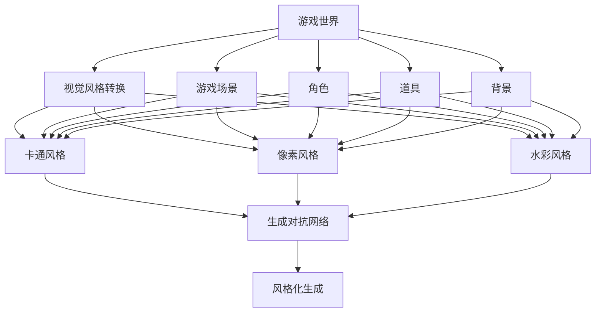
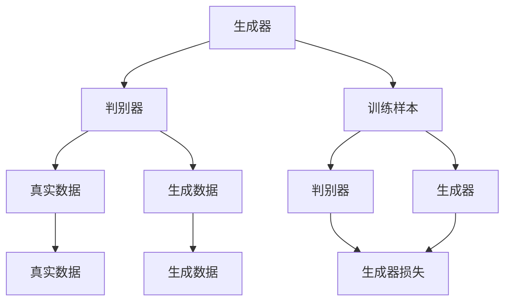
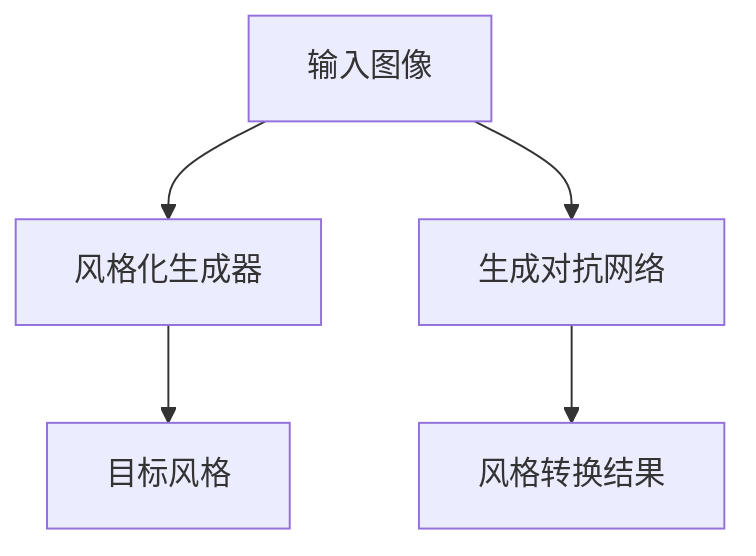
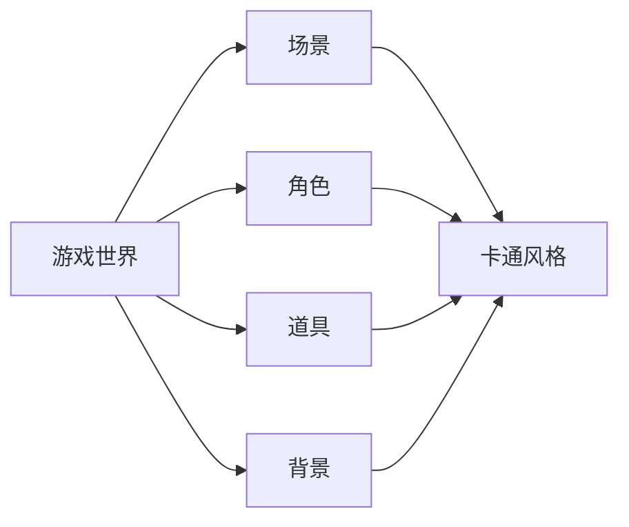
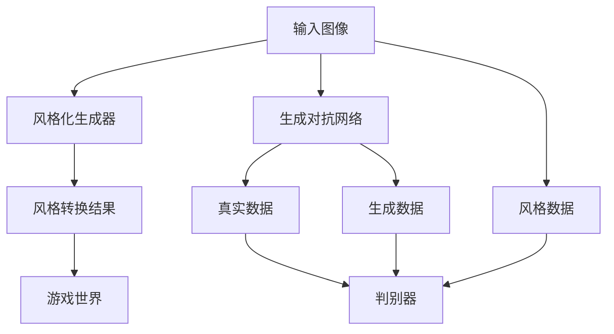

                 

# 基于生成对抗网络的游戏世界风格化生成技术研究

> 关键词：生成对抗网络(GAN)、风格化生成、游戏世界、视觉风格转换、图像处理、深度学习

## 1. 背景介绍

随着数字娱乐行业的蓬勃发展，游戏世界（Game World）在视觉艺术和风格化生成（Style Transfer）领域展现了巨大的潜力。传统的视觉生成技术，如基于像素级的图像处理、手工绘制纹理等，已经无法满足日益增长的视觉特效需求。而基于生成对抗网络（GAN）的风格化生成技术，因其能够自动化、高效地生成具有特定风格的游戏场景和角色，从而在视觉特效制作和创意设计中展现了卓越的性能。

### 1.1 问题由来

游戏世界风格化生成，指的是将游戏场景或角色自动转换成特定的艺术风格，如复古像素风、卡通风格、水彩风格等。这一过程涉及到图像处理、深度学习和艺术设计等多个领域，如何高效、自然地实现风格的转换，成为当前研究的热点。

传统的风格化生成方法包括像素级处理、手动绘制纹理等，但这些方法往往需要大量的人工参与和长时间的制作周期，且生成的风格容易受到艺术家个人风格的影响。而基于深度学习的方法，特别是生成对抗网络，则提供了一种自动化、高效率、高精度的风格化生成手段。

### 1.2 问题核心关键点

游戏世界风格化生成技术的研究核心包括：

- 选择合适的风格化生成框架（如GAN、VAE等）。
- 构建合适的训练数据集，包括源图像和目标风格样本。
- 设计有效的损失函数，引导生成器学习风格。
- 优化生成器与判别器的网络架构和参数设置。
- 确保生成的风格自然、一致，避免过拟合。

这些核心关键点构成了游戏世界风格化生成技术的研究基础，并且贯穿于整个技术实践的始终。

### 1.3 问题研究意义

游戏世界风格化生成技术的研究意义重大：

- 降低生产成本。自动化的风格化生成技术可以大幅度降低视觉特效的制作成本和周期。
- 提高生成效率。生成对抗网络等深度学习模型能够并行训练，大大提高了风格化生成的工作效率。
- 增强创意设计。风格化生成技术可以应用于游戏场景、角色、道具等创意设计，提升游戏的视觉艺术水平。
- 拓展应用领域。游戏世界风格化生成技术不仅限于游戏制作，还可应用于虚拟现实、数字艺术等领域。
- 推动技术进步。该技术的发展，将进一步推动计算机视觉、人工智能等领域的研究，促进技术创新。

## 2. 核心概念与联系

### 2.1 核心概念概述

为更好地理解基于GAN的游戏世界风格化生成技术，本节将介绍几个密切相关的核心概念：

- **生成对抗网络(GAN)**：由生成器（Generator）和判别器（Discriminator）组成的网络结构，通过两者之间的对抗训练，生成具有逼真、多样性的合成数据。
- **风格化生成**：将图像或视频转化为特定的艺术风格，如卡通风格、像素风格等，增强视觉艺术效果。
- **游戏世界**：指游戏中所有视觉元素的集合，包括背景、角色、道具、场景等。
- **视觉风格转换**：将源图像转换为目标风格的图像，广泛应用于图像处理、艺术创作等领域。
- **深度学习**：一类基于神经网络的机器学习技术，能够处理大规模数据和复杂结构，广泛应用于计算机视觉、自然语言处理等任务。
- **GAN应用领域**：除了游戏世界风格化生成，GAN还被广泛应用于图像生成、图像修复、数据增强、面部识别等众多领域。

这些核心概念之间的逻辑关系可以通过以下Mermaid流程图来展示：



这个流程图展示了游戏世界风格化生成技术中各个关键概念之间的关系：

1. 游戏世界的视觉元素（场景、角色、道具、背景）通过视觉风格转换，转换成各种艺术风格。
2. 视觉风格转换依赖于生成对抗网络（GAN）进行高效、自动化的风格生成。
3. 生成对抗网络由生成器和判别器组成，通过对抗训练生成逼真的游戏场景和角色。
4. 风格化生成可以应用于多种艺术风格，包括卡通、像素、水彩等。

### 2.2 概念间的关系

这些核心概念之间存在着紧密的联系，形成了游戏世界风格化生成技术的完整生态系统。下面我们通过几个Mermaid流程图来展示这些概念之间的关系。

#### 2.2.1 生成对抗网络的工作原理



这个流程图展示了生成对抗网络的基本工作原理：

1. 生成器接收输入噪声或源图像，生成逼真的游戏场景或角色。
2. 判别器接收真实数据和生成数据，判断其真实性。
3. 生成器和判别器通过对抗训练，提高生成器生成数据的逼真度，降低判别器错误判断的概率。

#### 2.2.2 视觉风格转换的流程



这个流程图展示了视觉风格转换的基本流程：

1. 输入图像通过生成对抗网络进行风格生成。
2. 生成对抗网络通过对抗训练，生成逼真的目标风格图像。
3. 风格转换结果为输入图像对应的目标风格图像。

#### 2.2.3 游戏世界风格化生成的应用场景



这个流程图展示了游戏世界风格化生成的应用场景：

1. 游戏世界包括场景、角色、道具、背景等视觉元素。
2. 风格化生成技术可以对这些元素进行风格化处理。
3. 生成的风格包括卡通、像素、水彩等多种风格，提升游戏视觉效果。

### 2.3 核心概念的整体架构

最后，我们用一个综合的流程图来展示这些核心概念在大语言模型微调过程中的整体架构：



这个综合流程图展示了从输入图像到风格化生成结果的完整过程。输入图像通过风格化生成器，生成逼真的目标风格图像，并经过生成对抗网络的对抗训练，确保生成的风格自然、逼真。最后，生成的风格化图像可以应用到游戏世界的各个视觉元素中，实现游戏世界的风格化生成。 通过这些流程图，我们可以更清晰地理解游戏世界风格化生成技术中各个核心概念的关系和作用，为后续深入讨论具体的技术细节奠定基础。

## 3. 核心算法原理 & 具体操作步骤
### 3.1 算法原理概述

基于生成对抗网络的游戏世界风格化生成技术，本质上是一种深度生成模型。其核心思想是通过生成器和判别器之间的对抗训练，生成具有特定风格的游戏世界视觉元素。

形式化地，假设输入图像为 $X$，目标风格为 $G$，生成对抗网络由生成器 $G$ 和判别器 $D$ 组成，生成器的输入为噪声向量 $Z$，输出为生成图像 $Y = G(Z)$。判别器的输入为真实图像 $X$ 和生成图像 $Y$，输出为真实性判别结果 $D(X)$ 和 $D(Y)$。则训练过程的目标是最小化判别器错误判别的概率，即：

$$
\min_G \max_D \mathbb{E}_{X \sim P_X} [D(X)] + \mathbb{E}_{Z \sim P_Z} [D(G(Z))]
$$

其中 $P_X$ 和 $P_Z$ 分别为真实数据和噪声的分布。通过不断优化生成器和判别器，生成器能够生成更逼真的游戏世界视觉元素，判别器能够更准确地分辨真实和生成的数据。

### 3.2 算法步骤详解

基于生成对抗网络的游戏世界风格化生成技术一般包括以下几个关键步骤：

**Step 1: 准备数据集和模型**

- 收集和准备游戏世界的图像数据集，划分为训练集、验证集和测试集。确保数据集涵盖各种艺术风格，如卡通、像素、水彩等。
- 选择适合的生成器和判别器网络结构，如DCGAN、WGAN等，并进行初步的网络搭建。
- 选择合适的优化器及其参数，如Adam、SGD等，设置学习率、批大小、迭代轮数等。

**Step 2: 设计损失函数**

- 定义生成器的损失函数 $L_G$，通常包括图像生成损失和风格匹配损失。图像生成损失衡量生成图像与真实图像的差异，风格匹配损失衡量生成图像与目标风格的差异。
- 定义判别器的损失函数 $L_D$，通常包括真实图像判别损失和生成图像判别损失。真实图像判别损失衡量判别器对真实图像的判别准确性，生成图像判别损失衡量判别器对生成图像的判别准确性。

**Step 3: 对抗训练**

- 将真实数据和生成数据交替输入判别器，最大化判别器对真实数据的判别能力，最小化判别器对生成数据的判别能力。
- 将真实数据和生成数据交替输入生成器，生成逼真的游戏世界视觉元素。
- 在每个迭代步骤中，交替优化生成器和判别器，直到达到预设的迭代轮数或满足预设的性能指标。

**Step 4: 测试与验证**

- 在测试集上评估生成器生成的图像质量，使用PSNR、SSIM等指标评估图像生成质量。
- 通过风格转换结果的感知评估，如LPIPS（Learned Perceptual Image Patch Similarity），衡量生成的图像与目标风格的一致性。
- 对比微调前后的性能指标，评估微调的效果。

以上是基于生成对抗网络的游戏世界风格化生成技术的一般流程。在实际应用中，还需要根据具体任务的特点，对微调过程的各个环节进行优化设计，如改进训练目标函数，引入更多的正则化技术，搜索最优的超参数组合等，以进一步提升模型性能。

### 3.3 算法优缺点

基于生成对抗网络的风格化生成技术具有以下优点：

- 自动化程度高。生成对抗网络可以自动生成逼真的游戏世界视觉元素，减少了人工参与的需求。
- 生成效果逼真。通过对抗训练，生成器可以生成具有高度逼真性的图像，满足游戏世界的高要求。
- 灵活性高。生成对抗网络可以应用于多种风格生成，支持游戏世界的个性化需求。
- 应用广泛。该技术不仅限于游戏世界，还可应用于虚拟现实、数字艺术等领域。

同时，该技术也存在一些局限性：

- 训练成本高。生成对抗网络需要大量的计算资源和时间，训练过程可能较为耗时。
- 过拟合风险高。生成器可能在训练过程中过拟合，导致生成的图像质量下降。
- 泛化能力有限。生成对抗网络生成的图像质量可能因风格不同而有所波动，泛化能力有限。
- 可解释性差。生成对抗网络的决策过程复杂，难以解释其内部工作机制。

尽管存在这些局限性，但就目前而言，基于生成对抗网络的风格化生成技术仍是最为广泛应用的风格生成手段。未来相关研究的重点在于如何进一步降低训练成本，提高泛化能力和可解释性，以及如何更灵活地应用于不同风格的游戏世界生成中。

### 3.4 算法应用领域

基于生成对抗网络的风格化生成技术，在游戏世界的风格化生成、虚拟现实场景的可视化设计、数字艺术创作等领域已经得到了广泛的应用，具体包括：

- **游戏世界风格化生成**：将游戏场景或角色自动转换成特定的艺术风格，如复古像素风、卡通风格、水彩风格等。
- **虚拟现实场景可视化**：将虚拟现实场景自动转换为具有特定风格的图像，提升视觉体验。
- **数字艺术创作**：将数字艺术作品自动转换为特定的艺术风格，如油画、素描等，增加创作的多样性。
- **图像修复**：对受损图像进行风格化处理，恢复其视觉效果。
- **数据增强**：对数据集进行风格增强，提高模型的泛化能力。
- **面部识别**：将人脸图像转换为特定风格的图像，提高识别的鲁棒性。

除了上述这些经典应用外，生成对抗网络的风格化生成技术还在不断创新，拓展应用场景，为数字娱乐和数字艺术等领域带来新的突破。

## 4. 数学模型和公式 & 详细讲解 & 举例说明

### 4.1 数学模型构建

本节将使用数学语言对基于生成对抗网络的风格化生成过程进行更加严格的刻画。

记输入图像为 $X$，生成器为 $G$，判别器为 $D$。假设生成器的输入为噪声向量 $Z$，生成器的输出为 $Y = G(Z)$。则生成器的损失函数 $L_G$ 和判别器的损失函数 $L_D$ 可以分别定义为：

$$
L_G = \mathbb{E}_{Z \sim P_Z} [D(G(Z))]
$$

$$
L_D = \mathbb{E}_{X \sim P_X} [D(X)] + \mathbb{E}_{Z \sim P_Z} [D(G(Z))]
$$

其中 $P_X$ 和 $P_Z$ 分别为真实数据和噪声的分布。

生成对抗网络的训练过程可以表示为以下优化问题：

$$
\min_G \max_D \mathbb{E}_{X \sim P_X} [D(X)] + \mathbb{E}_{Z \sim P_Z} [D(G(Z))]
$$

通过不断优化生成器和判别器，生成器能够生成更逼真的游戏世界视觉元素，判别器能够更准确地分辨真实和生成的数据。

### 4.2 公式推导过程

以下我们以像素风格转换为卡通风格为例，推导具体的损失函数。

假设输入图像 $X$ 的尺寸为 $H \times W$，目标风格 $G$ 的尺寸为 $H' \times W'$。则生成器的损失函数 $L_G$ 和判别器的损失函数 $L_D$ 可以分别定义为：

$$
L_G = \frac{1}{N}\sum_{i=1}^N \|G(X_i) - G'(X_i)\|^2
$$

$$
L_D = \frac{1}{N}\sum_{i=1}^N D(X_i, Y_i)
$$

其中 $X_i$ 和 $Y_i$ 分别为输入图像和生成图像的像素值。$D(X_i, Y_i)$ 为判别器对 $X_i$ 和 $Y_i$ 的判别结果，通常采用交叉熵损失进行计算。

通过不断优化生成器和判别器，生成器能够生成与目标风格 $G'$ 高度匹配的图像 $Y'$。具体的训练流程如下：

1. 生成器接收输入图像 $X$，生成图像 $Y$。
2. 判别器接收真实图像 $X$ 和生成图像 $Y$，输出判别结果 $D(X)$ 和 $D(Y)$。
3. 生成器根据 $L_G$ 损失函数进行反向传播，更新生成器参数。
4. 判别器根据 $L_D$ 损失函数进行反向传播，更新判别器参数。
5. 重复步骤1-4，直到达到预设的迭代轮数或满足预设的性能指标。

### 4.3 案例分析与讲解

以下我们将以一个具体的案例——将输入图像转换为像素风格——来详细讲解其数学模型和推导过程。

假设输入图像 $X$ 的尺寸为 $256 \times 256$，目标风格 $G$ 的尺寸为 $8 \times 8$。则生成器的输出 $Y$ 的尺寸为 $256 \times 256 \times 8$。

生成器的损失函数 $L_G$ 可以表示为：

$$
L_G = \frac{1}{N}\sum_{i=1}^N \|G(X_i) - G'(X_i)\|^2
$$

其中 $X_i$ 和 $Y_i$ 分别为输入图像和生成图像的像素值。$G(X_i)$ 表示生成器对输入图像 $X_i$ 生成的像素风格的图像 $Y_i$。

判别器的损失函数 $L_D$ 可以表示为：

$$
L_D = \frac{1}{N}\sum_{i=1}^N D(X_i, Y_i)
$$

其中 $X_i$ 和 $Y_i$ 分别为输入图像和生成图像的像素值。$D(X_i, Y_i)$ 表示判别器对 $X_i$ 和 $Y_i$ 的判别结果，通常采用交叉熵损失进行计算。

具体的训练流程如下：

1. 生成器接收输入图像 $X$，生成图像 $Y$。
2. 判别器接收真实图像 $X$ 和生成图像 $Y$，输出判别结果 $D(X)$ 和 $D(Y)$。
3. 生成器根据 $L_G$ 损失函数进行反向传播，更新生成器参数。
4. 判别器根据 $L_D$ 损失函数进行反向传播，更新判别器参数。
5. 重复步骤1-4，直到达到预设的迭代轮数或满足预设的性能指标。

通过不断的对抗训练，生成器能够生成与目标风格 $G'$ 高度匹配的图像 $Y'$，从而实现像素风格转换为卡通风格的效果。

## 5. 项目实践：代码实例和详细解释说明

### 5.1 开发环境搭建

在进行风格化生成实践前，我们需要准备好开发环境。以下是使用Python进行PyTorch开发的环境配置流程：

1. 安装Anaconda：从官网下载并安装Anaconda，用于创建独立的Python环境。

2. 创建并激活虚拟环境：
```bash
conda create -n pytorch-env python=3.8 
conda activate pytorch-env
```

3. 安装PyTorch：根据CUDA版本，从官网获取对应的安装命令。例如：
```bash
conda install pytorch torchvision torchaudio cudatoolkit=11.1 -c pytorch -c conda-forge
```

4. 安装NumPy、Pillow等辅助库：
```bash
pip install numpy pillow matplotlib tqdm
```

完成上述步骤后，即可在`pytorch-env`环境中开始风格化生成实践。

### 5.2 源代码详细实现

下面我们以像素风格转换为卡通风格为例，给出使用PyTorch和torchvision库的代码实现。

首先，定义模型和优化器：

```python
import torch
from torch import nn
from torchvision import transforms, datasets

class Generator(nn.Module):
    def __init__(self, in_size, out_size):
        super(Generator, self).__init__()
        self.in_size = in_size
        self.out_size = out_size
        self.conv_blocks = nn.Sequential(
            nn.Conv2d(in_size, 64, 4, 1, 0, bias=False),
            nn.BatchNorm2d(64),
            nn.LeakyReLU(0.2, inplace=True),
            nn.Conv2d(64, 128, 4, 2, 1, bias=False),
            nn.BatchNorm2d(128),
            nn.LeakyReLU(0.2, inplace=True),
            nn.Conv2d(128, 256, 4, 2, 1, bias=False),
            nn.BatchNorm2d(256),
            nn.LeakyReLU(0.2, inplace=True),
            nn.Conv2d(256, 256, 4, 2, 1, bias=False),
            nn.BatchNorm2d(256),
            nn.LeakyReLU(0.2, inplace=True),
            nn.Conv2d(256, 3, 4, 2, 1, bias=False),
            nn.Tanh()
        )

    def forward(self, x):
        x = self.conv_blocks(x)
        return x

class Discriminator(nn.Module):
    def __init__(self, in_size, out_size):
        super(Discriminator, self).__init__()
        self.in_size = in_size
        self.out_size = out_size
        self.conv_blocks = nn.Sequential(
            nn.Conv2d(in_size, 64, 4, 2, 1, bias=False),
            nn.LeakyReLU(0.2, inplace=True),
            nn.Dropout(0.25),
            nn.Conv2d(64, 128, 4, 2, 1, bias=False),
            nn.LeakyReLU(0.2, inplace=True),
            nn.Dropout(0.25),
            nn.Conv2d(128, 128, 4, 2, 1, bias=False),
            nn.LeakyReLU(0.2, inplace=True),
            nn.Dropout(0.25),
            nn.Conv2d(128, 1, 4, 1, 0, bias=False),
            nn.Sigmoid()
        )

    def forward(self, x):
        x = self.conv_blocks(x)
        return x

def get_model(in_size, out_size):
    return Generator(in_size, out_size), Discriminator(in_size, out_size)

in_size = 256
out_size = 8

generator, discriminator = get_model(in_size, out_size)

loss = nn.MSELoss()
optimizer_G = torch.optim.Adam(generator.parameters(), lr=0.0002)
optimizer_D = torch.optim.Adam(discriminator.parameters(), lr=0.0002)
```

然后，定义训练函数：

```python
from torch.utils.data import DataLoader

def train_epochs(generator, discriminator, dataloader, num_epochs):
    for epoch in range(num_epochs):
        for i, data in enumerate(dataloader):
            inputs, labels = data

            # Adversarial ground truths
            valid = torch.ones((inputs.size(0), 1)).to(device)
            fake = torch.zeros((inputs.size(0), 1)).to(device)

            # ---------------------
            #  Train Generator
            # ---------------------
            optimizer_G.zero_grad()

            # Sample noise as generator input
            z = torch.randn(inputs.size(0), generator.in_size).to(device)
            generated_images = generator(z)

            # Adversarial loss
            loss_G_real = discriminator(inputs).mean()
            loss_G_fake = discriminator(generated_images).mean()
            loss_G = loss_G_real + 0.5 * loss_G_fake

            # Backward and optimize
            loss_G.backward()
            optimizer_G.step()

            # ---------------------
            #  Train Discriminator
            # ---------------------
            optimizer_D.zero_grad()

            # Real images
            loss_D_real = discriminator(inputs).mean()

            # Adversarial loss
            loss_D_fake = discriminator(generated_images).mean()
            loss_D = loss_D_real - 0.5 * loss_D_fake

            # Backward and optimize
            loss_D.backward()
            optimizer_D.step()

        print(f"[Epoch {epoch+1}/{num_epochs}] [D loss: {loss_D:.4f}, G loss: {loss_G:.4f}]")
```

接着，加载和预处理数据集：

```python
from PIL import Image

# 定义数据转换
transform = transforms.Compose([
    transforms.ToTensor(),
    transforms.Resize((256, 256))
])

# 加载数据集
dataset = datasets.ImageFolder("data", transform=transform)
dataloader = DataLoader(dataset, batch_size=64, shuffle=True)

device = torch.device("cuda" if torch.cuda.is_available() else "cpu")
generator.to(device)
discriminator.to(device)
```

最后，启动训练流程：

```python
num_epochs = 100

train_epochs(generator, discriminator, dataloader, num_epochs)

# 保存模型
torch.save(generator.state_dict(), "generator.pth")
torch.save(discriminator.state_dict(), "discriminator.pth")
```

以上就是使用PyTorch对像素风格转换为卡通风格的代码实现。可以看到，使用PyTorch和torchvision库，能够非常方便地实现风格化生成任务的开发。

### 5.3 代码解读与分析

让我们再详细解读一下关键代码的实现细节：

**模型定义**：
- `Generator`类定义了生成器的网络结构，包括卷积层、激活函数、归一化层等。
- `Discriminator`类定义了判别器的网络结构，包括卷积层、激活函数、归一化层等。
- `get_model`函数用于生成和判别器的实例化。

**损失函数定义**：
- `loss`定义

