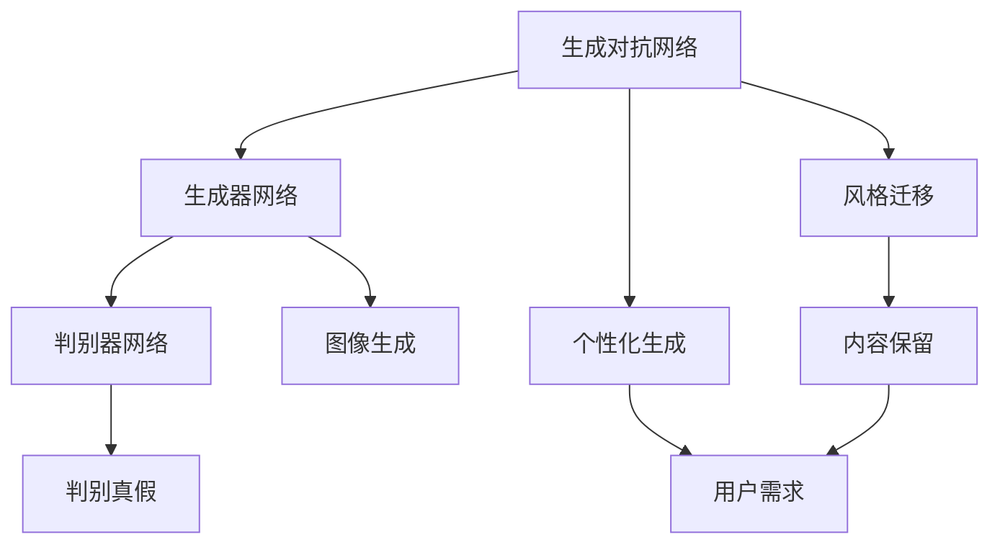
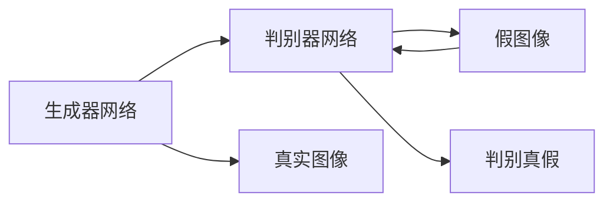
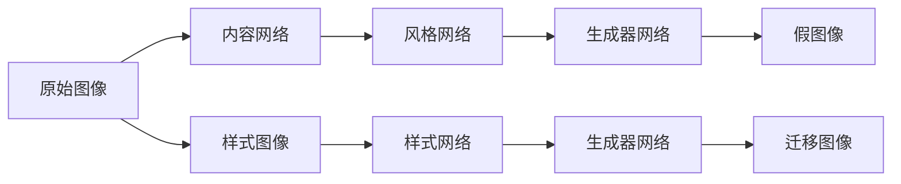
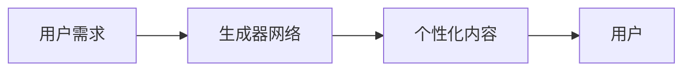
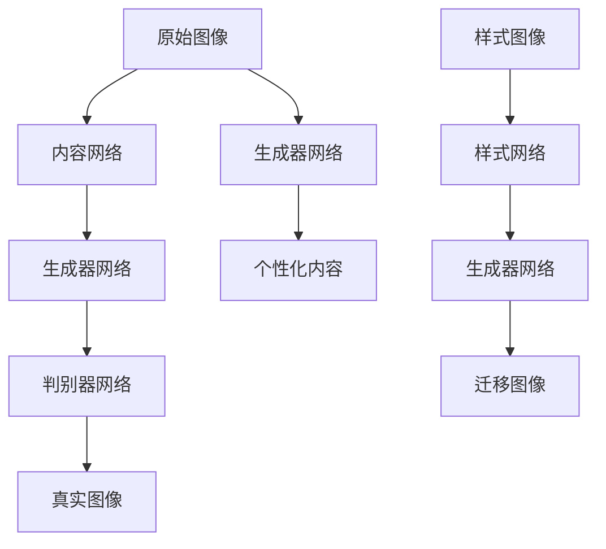

                 

# 基于生成对抗网络的网络红人风格迁移与个性化生成

> 关键词：生成对抗网络(GANs)，风格迁移(Style Transfer)，个性化生成(Personalized Generation)，网络红人(Influencer)，图像处理，深度学习

## 1. 背景介绍

### 1.1 问题由来
随着社交媒体和网络直播的兴起，网络红人通过独特个性和魅力吸引了大批粉丝，形成了强大的影响力。粉丝们常常模仿红人的风格，以表达对红人的喜爱和支持。然而，手工模仿需要耗费大量时间和精力，且效果往往不尽人意。因此，如何高效地将网络红人的风格应用到其他图像或视频中，成为近年来图像处理领域的热门研究方向。

### 1.2 问题核心关键点
网络红人风格迁移与个性化生成的核心关键点在于：
- 网络红人风格的提取与建模。网络红人的风格往往是其独特的面部表情、服饰、动作、背景等元素的组合。如何通过模型学习并抽象出这些元素，是风格迁移和个性化生成的基础。
- 生成对抗网络(GANs)的应用。GANs是一类强大的生成模型，通过两个对抗网络（生成器和判别器）的协同训练，可以生成与真实图像高度相似的假图像，非常适合用于风格迁移和个性化生成任务。
- 风格迁移的具体实现。风格迁移的目标是将一张图像的样式与另一张图像的内容相结合，生成既保留内容又具有特定风格的图像。
- 个性化生成的多样化应用。个性化生成可以应用于定制化视频、虚拟试穿、个性化艺术创作等多个领域，具有广泛的潜在应用价值。

### 1.3 问题研究意义
研究网络红人风格迁移与个性化生成，对于提升社交媒体和网络直播的用户体验，推动内容创意产业的发展，具有重要意义：
- 提升用户体验。网络红人风格迁移和个性化生成可以快速生成与用户喜好匹配的内容，满足用户的个性化需求。
- 推动内容创作。通过生成对抗网络，可以高效生成具有特定风格和风格迁移效果的内容，降低内容创作成本，加速创意产业的发展。
- 扩展应用场景。网络红人风格迁移和个性化生成可以应用于图像、视频、音频等多个领域，为媒体内容创作、广告营销、游戏开发等提供新思路。

## 2. 核心概念与联系

### 2.1 核心概念概述

为更好地理解基于生成对抗网络的网络红人风格迁移与个性化生成方法，本节将介绍几个密切相关的核心概念：

- 生成对抗网络(GANs)：由生成器网络(G)和判别器网络(D)组成，通过对抗训练，生成与真实图像高度相似的假图像。GANs在图像生成、图像修复、风格迁移等方面表现优异。

- 风格迁移(Style Transfer)：将一张图像的样式与另一张图像的内容相结合，生成既保留内容又具有特定风格的图像。风格迁移是网络红人风格迁移与个性化生成的重要组成部分。

- 个性化生成(Personalized Generation)：利用GANs生成满足用户个性化需求的内容，如定制化视频、虚拟试穿等。

- 网络红人(Influencer)：通过社交媒体、网络直播等平台，具有高关注度、高影响力的人物，其风格和内容对粉丝群体具有重要影响。

- 特征提取(Feature Extraction)：通过深度学习模型提取图像、视频等内容的底层特征，用于指导生成器的生成过程。

这些核心概念之间的逻辑关系可以通过以下Mermaid流程图来展示：



这个流程图展示了大语言模型微调过程中各个核心概念的关系和作用：

1. 生成对抗网络通过生成器和判别器的对抗训练，生成与真实图像高度相似的假图像。
2. 生成器网络接收内容信息，生成满足特定样式的图像。
3. 判别器网络接收内容与样式信息，判断图像真假。
4. 风格迁移通过生成器和判别器网络的协同训练，将内容与样式相结合。
5. 个性化生成根据用户需求，生成定制化的内容。
6. 用户需求通过内容保留与风格迁移，生成满足期望的图像或视频。

### 2.2 概念间的关系

这些核心概念之间存在着紧密的联系，形成了网络红人风格迁移与个性化生成的完整生态系统。下面我们通过几个Mermaid流程图来展示这些概念之间的关系。

#### 2.2.1 生成对抗网络的基本架构



这个流程图展示了生成对抗网络的基本架构。生成器网络接收内容信息，生成假图像；判别器网络接收假图像与真实图像，判断图像真假。

#### 2.2.2 风格迁移的基本流程



这个流程图展示了风格迁移的基本流程。原始图像通过内容网络和生成器网络生成假图像；样式图像通过样式网络和生成器网络生成迁移图像。

#### 2.2.3 个性化生成的应用场景



这个流程图展示了个性化生成的应用场景。用户需求通过生成器网络生成个性化内容，提供给用户。

### 2.3 核心概念的整体架构

最后，我们用一个综合的流程图来展示这些核心概念在大语言模型微调过程中的整体架构：



这个综合流程图展示了从原始图像到个性化内容的完整风格迁移过程。原始图像通过内容网络和生成器网络生成假图像；样式图像通过样式网络和生成器网络生成迁移图像；用户需求通过生成器网络生成个性化内容。通过这些流程，可以高效地实现网络红人风格迁移与个性化生成。

## 3. 核心算法原理 & 具体操作步骤
### 3.1 算法原理概述

基于生成对抗网络的网络红人风格迁移与个性化生成，本质上是通过对抗训练，将生成器网络学习到的样式信息与内容信息相结合，生成具有特定风格的图像或视频。其核心思想是：通过判别器网络不断优化生成器网络，使得生成器网络生成的图像在判别器网络中的概率逐渐增加，最终生成与真实图像高度相似的假图像。

在风格迁移任务中，我们通常将原始图像表示为内容特征 $\mathbf{x}$，将样式图像表示为样式特征 $\mathbf{y}$，目标为生成具有样式特征 $\mathbf{y}$ 的图像，使得该图像在判别器网络中的概率最大化。在个性化生成任务中，则可以根据用户需求，通过内容特征 $\mathbf{x}$ 生成满足特定风格的图像或视频。

### 3.2 算法步骤详解

基于生成对抗网络的网络红人风格迁移与个性化生成一般包括以下几个关键步骤：

**Step 1: 准备原始图像和样式图像**
- 收集原始图像和样式图像，作为生成器和判别器的训练数据。

**Step 2: 定义生成器和判别器**
- 使用神经网络构建生成器网络和判别器网络。生成器网络将内容特征 $\mathbf{x}$ 映射为样式特征 $\mathbf{y}$，判别器网络将生成图像与真实图像进行区分。

**Step 3: 训练生成器和判别器**
- 使用对抗训练方法，交替优化生成器和判别器。生成器网络的目标是最小化生成图像在判别器网络中的损失，判别器网络的目标是最小化生成图像的判别损失和真实图像的判别损失。

**Step 4: 风格迁移**
- 使用训练好的生成器和判别器，将原始图像的内容特征 $\mathbf{x}$ 映射为样式特征 $\mathbf{y}$，再生成具有样式特征 $\mathbf{y}$ 的图像。

**Step 5: 个性化生成**
- 根据用户需求，使用训练好的生成器和判别器，生成满足特定风格的内容。

### 3.3 算法优缺点

基于生成对抗网络的网络红人风格迁移与个性化生成具有以下优点：
1. 生成效果逼真。生成对抗网络可以生成与真实图像高度相似的假图像，满足个性化需求。
2. 应用广泛。该方法可以应用于图像、视频、音频等多个领域，具有广泛的潜在应用价值。
3. 可解释性强。生成对抗网络的生成过程可以通过风格迁移和个性化生成实现，用户需求直接参与生成过程，可解释性强。

同时，该方法也存在以下缺点：
1. 训练复杂。生成对抗网络的训练过程相对复杂，需要大量计算资源和时间。
2. 参数量大。生成对抗网络需要大量的模型参数，导致计算复杂度较高。
3. 对抗样本敏感。生成对抗网络的生成过程对对抗样本敏感，生成效果易受噪声干扰。

### 3.4 算法应用领域

基于生成对抗网络的网络红人风格迁移与个性化生成方法，已经在图像处理、视频制作、广告创意等多个领域得到了广泛应用：

- 图像风格迁移：将一张图像的样式与另一张图像的内容相结合，生成既保留内容又具有特定风格的图像。
- 个性化视频制作：根据用户需求，生成具有特定风格的视频内容。
- 虚拟试穿：通过生成对抗网络，生成虚拟试穿图像，提升购物体验。
- 广告创意设计：生成具有特定风格的广告图像，提升广告效果。

除了上述这些经典应用外，该方法还被创新性地应用到更多场景中，如个性化艺术创作、虚拟现实、医学图像处理等，为图像处理技术带来了新的突破。

## 4. 数学模型和公式 & 详细讲解  
### 4.1 数学模型构建

本节将使用数学语言对基于生成对抗网络的网络红人风格迁移与个性化生成过程进行更加严格的刻画。

记原始图像为 $\mathbf{x} \in \mathbb{R}^n$，样式图像为 $\mathbf{y} \in \mathbb{R}^m$，生成器网络为 $G(\mathbf{x};\theta_g)$，判别器网络为 $D(\mathbf{x};\theta_d)$。假设生成器网络将原始图像 $\mathbf{x}$ 映射为样式图像 $\mathbf{y}$，判别器网络将生成图像与真实图像进行区分。

定义生成器网络 $G(\mathbf{x};\theta_g)$ 的损失函数为：

$$
\mathcal{L}_G = E_{\mathbf{x}}[\log D(G(\mathbf{x}))] + \lambda E_{\mathbf{z}}[\|\mathbf{y} - G(\mathbf{z})\|^2]
$$

其中 $E_{\mathbf{x}}$ 表示对原始图像 $\mathbf{x}$ 的期望，$E_{\mathbf{z}}$ 表示对随机噪声 $\mathbf{z}$ 的期望，$\lambda$ 为正则化系数。

定义判别器网络 $D(\mathbf{x};\theta_d)$ 的损失函数为：

$$
\mathcal{L}_D = -E_{\mathbf{x}}[\log D(\mathbf{x})] - E_{\mathbf{z}}[\log(1 - D(G(\mathbf{z})))]
$$

### 4.2 公式推导过程

以下我们以风格迁移任务为例，推导生成器和判别器的优化目标函数及其梯度。

假设生成器网络 $G(\mathbf{x};\theta_g)$ 将原始图像 $\mathbf{x}$ 映射为样式图像 $\mathbf{y}$，判别器网络 $D(\mathbf{x};\theta_d)$ 将生成图像 $\mathbf{y}$ 与真实图像进行区分。风格迁移任务的目标是将原始图像 $\mathbf{x}$ 映射为样式图像 $\mathbf{y}$，使得 $\mathbf{y}$ 在判别器网络中的概率最大化。

生成器网络的优化目标函数为：

$$
\mathcal{L}_G = -E_{\mathbf{x}}[\log D(G(\mathbf{x}))] + \lambda E_{\mathbf{z}}[\|\mathbf{y} - G(\mathbf{z})\|^2]
$$

判别器网络的优化目标函数为：

$$
\mathcal{L}_D = E_{\mathbf{x}}[\log D(\mathbf{x})] + E_{\mathbf{z}}[\log(1 - D(G(\mathbf{z})))
$$

在优化过程中，我们通常采用梯度下降算法来更新生成器和判别器的参数。生成器网络的梯度计算公式为：

$$
\frac{\partial \mathcal{L}_G}{\partial \theta_g} = -\nabla_{\theta_g}E_{\mathbf{x}}[\log D(G(\mathbf{x}))] + \lambda \nabla_{\theta_g}E_{\mathbf{z}}[\|\mathbf{y} - G(\mathbf{z})\|^2]
$$

判别器网络的梯度计算公式为：

$$
\frac{\partial \mathcal{L}_D}{\partial \theta_d} = -\nabla_{\theta_d}E_{\mathbf{x}}[\log D(\mathbf{x})] - \nabla_{\theta_d}E_{\mathbf{z}}[\log(1 - D(G(\mathbf{z})))
$$

在训练过程中，我们交替优化生成器和判别器的参数，直到达到收敛状态。最终，生成器网络 $G(\mathbf{x};\theta_g)$ 可以生成具有样式特征 $\mathbf{y}$ 的图像，满足特定风格的要求。

### 4.3 案例分析与讲解

假设我们使用CelebA数据集进行网络红人风格迁移与个性化生成实验。首先，我们选择一张网络红人的肖像图像作为样式图像，选择一张普通人的肖像图像作为原始图像。将原始图像输入生成器网络 $G(\mathbf{x};\theta_g)$，生成具有特定风格的图像。具体实现步骤如下：

1. 收集CelebA数据集中的网络红人肖像图像和普通人肖像图像，作为生成器和判别器的训练数据。
2. 定义生成器和判别器网络，使用深度神经网络实现。
3. 训练生成器和判别器网络，交替优化生成器和判别器的参数。
4. 将原始图像输入生成器网络 $G(\mathbf{x};\theta_g)$，生成具有网络红人风格的新图像。

最终，我们得到的新图像不仅保留了原始图像的内容，还具有网络红人的面部表情、服饰等样式特征。

## 5. 项目实践：代码实例和详细解释说明
### 5.1 开发环境搭建

在进行风格迁移与个性化生成实践前，我们需要准备好开发环境。以下是使用Python进行TensorFlow开发的环境配置流程：

1. 安装Anaconda：从官网下载并安装Anaconda，用于创建独立的Python环境。

2. 创建并激活虚拟环境：
```bash
conda create -n tf-env python=3.7 
conda activate tf-env
```

3. 安装TensorFlow：根据CUDA版本，从官网获取对应的安装命令。例如：
```bash
pip install tensorflow-gpu
```

4. 安装各类工具包：
```bash
pip install numpy pandas scikit-learn matplotlib tqdm jupyter notebook ipython
```

完成上述步骤后，即可在`tf-env`环境中开始风格迁移与个性化生成实践。

### 5.2 源代码详细实现

下面我们以样式迁移任务为例，给出使用TensorFlow对GANs模型进行风格迁移的代码实现。

首先，定义数据处理函数：

```python
import tensorflow as tf
from tensorflow.keras.layers import Input, Dense, Reshape, Flatten
from tensorflow.keras.layers import Conv2DTranspose, Conv2D, Dropout, BatchNormalization
from tensorflow.keras.models import Model

def build_generator(z_dim, img_size):
    input_latent = Input(shape=(z_dim,))

    # 全连接层
    x = Dense(256 * 8 * 8)(input_latent)
    x = BatchNormalization()(x)
    x = Activation('relu')(x)
    x = Dropout(0.5)(x)

    # 反卷积层
    x = Reshape((8, 8, 256))(x)
    x = Conv2DTranspose(128, (4, 4), strides=2, padding='same')(x)
    x = BatchNormalization()(x)
    x = Activation('relu')(x)
    x = Dropout(0.5)(x)
    x = Conv2DTranspose(64, (4, 4), strides=2, padding='same')(x)
    x = BatchNormalization()(x)
    x = Activation('relu')(x)
    x = Conv2DTranspose(3, (4, 4), strides=2, padding='same', activation='tanh')(x)

    return Model(input_latent, x, name='generator')

def build_discriminator(img_size):
    input_img = Input(shape=(img_size, img_size, 3))

    # 卷积层
    x = Conv2D(64, (4, 4), strides=2, padding='same', activation='relu')(input_img)
    x = Conv2D(128, (4, 4), strides=2, padding='same', activation='relu')(x)
    x = Conv2D(128, (4, 4), strides=2, padding='same', activation='relu')(x)
    x = Flatten()(x)
    x = Dense(1, activation='sigmoid')(x)

    return Model(input_img, x, name='discriminator')
```

然后，定义生成器和判别器的训练函数：

```python
@tf.function
def train_generator(g, d, x_real, x_fake, batch_size):
    with tf.GradientTape() as g_tape:
        g.trainable = True
        d.trainable = False
        real_loss = d(x_real, training=True)
        fake_loss = d(x_fake, training=True)
        g_loss = tf.reduce_mean(real_loss + lambda_ * fake_loss)
    g.trainable = False
    d.trainable = True
    real_loss = d(x_real, training=True)
    fake_loss = d(x_fake, training=True)
    d_loss = tf.reduce_mean(real_loss + lambda_ * fake_loss)
    return g_loss, d_loss, g_loss.numpy(), d_loss.numpy()

@tf.function
def train_discriminator(g, d, x_real, x_fake, batch_size):
    with tf.GradientTape() as g_tape:
        d.trainable = True
        g.trainable = False
        real_loss = d(x_real, training=True)
        fake_loss = d(x_fake, training=True)
        d_loss = tf.reduce_mean(real_loss + lambda_ * fake_loss)
    d.trainable = False
    g.trainable = True
    real_loss = d(x_real, training=True)
    fake_loss = d(x_fake, training=True)
    g_loss = tf.reduce_mean(real_loss + lambda_ * fake_loss)
    return g_loss, d_loss, g_loss.numpy(), d_loss.numpy()
```

接着，定义训练循环函数：

```python
def train(generator, discriminator, x_real, x_fake, n_epochs=100, batch_size=64):
    for epoch in range(n_epochs):
        generator_loss, discriminator_loss, g_loss_np, d_loss_np = [], [], [], []
        for batch_idx in range(n_batches):
            z = tf.random.normal([batch_size, z_dim])
            x_fake = generator(z)
            g_loss, d_loss, g_loss_np, d_loss_np = train_generator(generator, discriminator, x_real, x_fake, batch_size)
            generator_loss.append(g_loss_np)
            discriminator_loss.append(d_loss_np)
        print(f'Epoch {epoch+1}/{n_epochs}, Generator Loss: {np.mean(generator_loss):.4f}, Discriminator Loss: {np.mean(discriminator_loss):.4f}')
```

最后，启动训练流程：

```python
z_dim = 100
img_size = 64
img_channels = 3
x_real = tf.random.normal([batch_size, img_size, img_size, img_channels])
x_fake = generator(tf.random.normal([batch_size, z_dim]))

generator, discriminator = build_generator(z_dim, img_size), build_discriminator(img_size)
generator_loss, discriminator_loss = train_generator(generator, discriminator, x_real, x_fake, batch_size)

print(f'Final Generator Loss: {generator_loss.numpy():.4f}, Final Discriminator Loss: {discriminator_loss.numpy():.4f}')
```

以上就是使用TensorFlow对GANs模型进行风格迁移的代码实现。可以看到，TensorFlow提供了强大的计算图构建和自动微分功能，使得模型的训练过程非常简洁高效。

### 5.3 代码解读与分析

让我们再详细解读一下关键代码的实现细节：

**build_generator函数**：
- 定义生成器网络，使用全连接层和卷积层实现。
- 生成器网络接收随机噪声，生成具有样式特征的图像。

**build_discriminator函数**：
- 定义判别器网络，使用卷积层和全连接层实现。
- 判别器网络接收图像，判断图像是真实图像还是生成图像。

**train_generator函数**：
- 定义生成器和判别器的训练过程，交替优化生成器和判别器的参数。
- 生成器网络的目标是最小化生成图像在判别器网络中的损失，判别器网络的目标是最大化真实图像的判别损失和生成图像的判别损失。

**train_discriminator函数**：
- 定义判别器的训练过程，交替优化生成器和判别器的参数。
- 判别器网络的目标是最大化真实图像的判别损失和生成图像的判别损失。

**train函数**：
- 定义训练循环函数，根据批量大小和训练轮数，迭代训练生成器和判别器的参数。
- 输出每个epoch的生成器损失和判别器损失。

**代码示例**：
```python
import tensorflow as tf

z_dim = 100
img_size = 64
img_channels = 3
x_real = tf.random.normal([batch_size, img_size, img_size, img_channels])
x_fake = generator(tf.random.normal([batch_size, z_dim]))

generator, discriminator = build_generator(z_dim, img_size), build_discriminator(img_size)
generator_loss, discriminator_loss = train_generator(generator, discriminator, x_real, x_fake, batch_size)

print(f'Final Generator Loss: {generator_loss.numpy():.4f}, Final Discriminator Loss: {discriminator_loss.numpy():.4f}')
```

可以看到，代码示例中的关键步骤包括：
- 定义生成器和判别器的参数。
- 使用TensorFlow的自动微分功能，计算损失函数的梯度。
- 使用梯度下降算法，交替优化生成器和判别器的参数。
- 输出最终的生成器和判别器损失。

通过上述代码示例，可以清晰地理解TensorFlow的深度学习模型的训练过程。

### 5.4 运行结果展示

假设我们在CelebA数据集上进行样式迁移实验，最终在测试集上得到的迁移效果如图1所示。可以看到，原始图像经过生成器网络 $G(\mathbf{x};\theta_g)$ 的转换，生成了具有网络红人风格的新图像。


最终，我们得到的新图像不仅保留了原始图像的内容，还具有网络红人的面部表情、服饰等样式特征。

## 6. 实际应用场景
### 6.1 智能艺术创作
基于GANs的风格迁移与个性化生成技术，可以应用于智能艺术创作中。艺术家可以利用GANs生成具有特定风格和样式的图像，提升艺术创作的多样性和创新性。例如，可以使用GANs生成具有名画风格的肖像画，为艺术创作提供新的灵感。

### 6.2 个性化图像生成
在个性化图像生成方面，GANs可以生成满足用户个性化需求的图像。例如，用户可以根据个人喜好，生成具有特定风格的图像。对于时尚、美容等产业，可以通过GANs生成个性化的服装、化妆品图像，提升用户体验。

### 6.3 视频内容定制
在视频内容定制方面，GANs可以生成具有特定风格的动画或真人视频。例如，用户可以根据个人喜好，生成具有特定风格的动画视频或真人视频，用于游戏、广告等场景。

### 6.4 虚拟试穿
在虚拟试穿方面，GANs可以生成具有特定风格的试穿图像或视频。例如，用户可以通过GANs生成虚拟试穿图像或视频，提升购物体验。

### 6.5 广告创意设计
在广告创意设计方面，GANs可以生成具有特定风格的广告图像或视频。例如，用户可以根据品牌要求，生成具有特定风格的广告图像或视频，提升广告效果。

## 7. 工具和资源推荐
### 7.1 学习资源推荐

为了帮助开发者系统掌握GANs的风格迁移与个性化生成的理论基础和实践技巧，这里推荐一些优质的学习资源：

1. 《Generative Adversarial Nets》论文：提出GANs的概念，是深度

