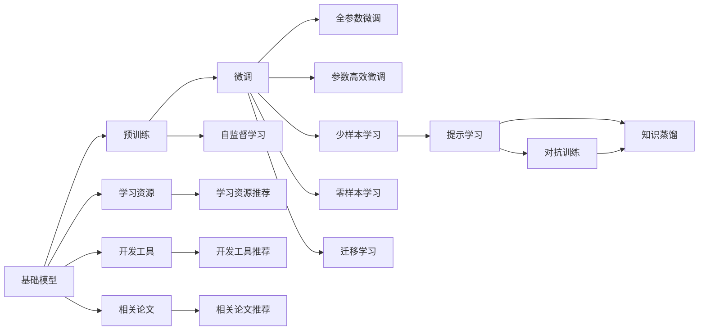

                 

# 基础模型在AI中的兴起

## 1. 背景介绍

在人工智能（AI）领域，基础模型（Foundation Model）的兴起已经成为推动技术进步和应用创新的重要力量。基础模型是一种通过自监督学习（Self-Supervised Learning, SSL）进行预训练的大型神经网络模型，能够在大规模无标签数据上学习到丰富的语言、视觉或其他领域的基础表示。这些表示不仅具有强大的泛化能力，还能够在微调（Fine-Tuning）后快速适应各种具体任务，从而极大地提高了AI应用的效率和效果。本文将详细探讨基础模型在AI中的兴起，包括其原理、架构、算法步骤，以及实际应用领域，并分析其优缺点和未来发展趋势。

## 2. 核心概念与联系

### 2.1 核心概念概述

基础模型通常指那些在大规模无标签数据上进行预训练的深度神经网络，如BERT、GPT、ViT等。这些模型通过自监督学习任务，如语言建模、掩码语言模型、对比学习等，学习了通用的语言或视觉表示。这些表示能够被广泛应用于多种下游任务，如自然语言处理（NLP）、计算机视觉（CV）、语音处理等，通过微调（Fine-Tuning）来适应具体的任务需求。

### 2.2 核心概念间的关系

以下通过几个Mermaid流程图，展示基础模型在AI中的核心概念及其之间的关系。



该流程图展示了基础模型在AI中的学习范式：

1. 基础模型在无标签数据上进行预训练，学习通用表示（B 到 C）。
2. 预训练模型通过微调（C），适应具体的下游任务（如NLP、CV等）。
3. 微调可以采用全参数微调或参数高效微调（C到D和E）。
4. 微调过程中可以结合少样本学习和零样本学习（C到F和G）。
5. 提示学习（H）可以进一步减少微调参数，提升模型效果。
6. 微调模型通过迁移学习（C到L），从源任务学习到目标任务的表示。
7. 自监督学习（B到K）是预训练的基础，学习模型初始表示。
8. 基础模型和微调技术可以结合学习资源和开发工具（A到M、N、O、P）。
9. 相关研究论文提供了最新的技术和方法（A到Q、R）。

通过这些核心概念的有机结合，基础模型能够在多种AI应用场景中发挥重要作用。

## 3. 核心算法原理 & 具体操作步骤

### 3.1 算法原理概述

基础模型通过自监督学习在大规模无标签数据上学习通用的表示，然后通过微调（Fine-Tuning）过程，根据下游任务的需求调整模型参数，使得模型能够适应特定的任务。微调过程通常包括以下步骤：

1. **数据准备**：收集下游任务的标注数据集，将其划分为训练集、验证集和测试集。
2. **任务适配层添加**：在预训练模型的基础上，根据具体任务类型添加相应的输出层和损失函数。
3. **设置超参数**：选择合适的优化器、学习率、批大小、迭代轮数等超参数。
4. **模型训练**：使用优化器对模型进行训练，通过前向传播计算损失函数，反向传播更新模型参数。
5. **模型评估**：在验证集上评估模型性能，选择性能最佳的模型参数进行微调。
6. **模型部署**：将微调后的模型应用于实际任务，进行推理预测。

### 3.2 算法步骤详解

以下以BERT模型在NLP任务中的微调为例，详细说明基础模型的微调步骤。

**步骤1：准备数据集**

```python
import torch
from torch.utils.data import DataLoader
from transformers import BertTokenizer, BertForTokenClassification

# 数据准备
tokenizer = BertTokenizer.from_pretrained('bert-base-cased')
train_dataset = ...
val_dataset = ...
test_dataset = ...
```

**步骤2：添加任务适配层**

```python
from transformers import BertForTokenClassification

# 定义输出层和损失函数
model = BertForTokenClassification.from_pretrained('bert-base-cased', num_labels=2)
```

**步骤3：设置超参数**

```python
from transformers import AdamW

# 设置优化器和超参数
optimizer = AdamW(model.parameters(), lr=2e-5)
```

**步骤4：模型训练**

```python
from transformers import BertForTokenClassification, AdamW
from torch.utils.data import DataLoader
from tqdm import tqdm

# 定义训练函数
def train_epoch(model, train_loader, optimizer):
    model.train()
    total_loss = 0
    for batch in tqdm(train_loader):
        input_ids = batch['input_ids']
        attention_mask = batch['attention_mask']
        labels = batch['labels']
        model.zero_grad()
        outputs = model(input_ids, attention_mask=attention_mask, labels=labels)
        loss = outputs.loss
        total_loss += loss.item()
        loss.backward()
        optimizer.step()
    return total_loss / len(train_loader)
```

**步骤5：模型评估**

```python
# 定义评估函数
def evaluate(model, val_loader):
    model.eval()
    total_loss = 0
    predictions, true_labels = [], []
    with torch.no_grad():
        for batch in val_loader:
            input_ids = batch['input_ids']
            attention_mask = batch['attention_mask']
            labels = batch['labels']
            outputs = model(input_ids, attention_mask=attention_mask)
            predictions.extend(outputs.logits.argmax(dim=2).tolist())
            true_labels.extend(labels.tolist())
    return classification_report(true_labels, predictions)
```

**步骤6：模型部署**

```python
# 在测试集上进行评估
evaluate(model, test_loader)
```

通过以上步骤，即可实现对BERT模型进行微调，并在NLP任务上取得较好的性能。

### 3.3 算法优缺点

基础模型的微调具有以下优点：

1. **泛化能力强**：预训练模型在大量无标签数据上学习到通用的表示，具有较强的泛化能力，能够在微调后适应多种下游任务。
2. **参数高效**：通过参数高效微调（如Adapter、LoRA等），仅调整少量参数，降低微调对计算资源的需求。
3. **快速部署**：微调后的模型可以迅速部署到实际应用中，加速AI技术的落地。

然而，基础模型的微调也存在一些缺点：

1. **依赖标注数据**：微调过程需要大量的标注数据，标注成本较高。
2. **可解释性差**：基础模型通常被视为黑盒模型，其内部工作机制难以解释。
3. **潜在偏见**：预训练模型可能继承数据中的偏见，导致微调后的模型也存在偏见。
4. **资源消耗高**：基础模型参数量庞大，微调过程需要大量的计算资源。

### 3.4 算法应用领域

基础模型的微调广泛应用于多个AI领域，包括但不限于：

- **自然语言处理（NLP）**：如情感分析、命名实体识别、问答系统、机器翻译等。
- **计算机视觉（CV）**：如图像分类、目标检测、语义分割等。
- **语音处理**：如语音识别、语音合成等。
- **医疗健康**：如医疗影像分析、基因序列分析等。
- **金融科技**：如信用评估、欺诈检测等。

## 4. 数学模型和公式 & 详细讲解 & 举例说明

### 4.1 数学模型构建

假设基础模型为 $M_{\theta}$，其中 $\theta$ 为模型参数。对于下游任务 $T$，训练集为 $D=\{(x_i, y_i)\}_{i=1}^N$，其中 $x_i$ 为输入，$y_i$ 为标签。微调的目标是最小化经验风险 $\mathcal{L}(\theta) = \frac{1}{N} \sum_{i=1}^N \ell(M_{\theta}(x_i),y_i)$。常用的损失函数包括交叉熵损失、均方误差损失等。

### 4.2 公式推导过程

以交叉熵损失为例，假设模型 $M_{\theta}$ 在输入 $x$ 上的输出为 $\hat{y}=M_{\theta}(x)$，真实标签 $y \in \{0,1\}$。则二分类交叉熵损失函数定义为：

$$
\ell(M_{\theta}(x),y) = -[y\log \hat{y} + (1-y)\log (1-\hat{y})]
$$

在微调过程中，使用梯度下降等优化算法，最小化损失函数，更新模型参数 $\theta$。具体公式为：

$$
\theta \leftarrow \theta - \eta \nabla_{\theta}\mathcal{L}(\theta)
$$

其中 $\eta$ 为学习率，$\nabla_{\theta}\mathcal{L}(\theta)$ 为损失函数对参数 $\theta$ 的梯度。

### 4.3 案例分析与讲解

以BERT模型在情感分析任务上的微调为例：

1. **数据准备**：收集情感分析数据集，如IMDB电影评论数据集，将其划分为训练集、验证集和测试集。
2. **模型初始化**：加载预训练的BERT模型，如`bert-base-cased`。
3. **任务适配层添加**：在BERT模型顶部添加一个线性分类器，用于二分类任务。
4. **设置超参数**：选择合适的优化器、学习率、批大小、迭代轮数等超参数。
5. **模型训练**：使用优化器对模型进行训练，在训练集上计算交叉熵损失，反向传播更新模型参数。
6. **模型评估**：在验证集上评估模型性能，选择性能最佳的模型参数进行微调。
7. **模型部署**：在测试集上评估微调后的模型，并进行推理预测。

## 5. 项目实践：代码实例和详细解释说明

### 5.1 开发环境搭建

使用Python进行基础模型的微调，需要安装以下依赖包：

```bash
pip install torch transformers sklearn
```

### 5.2 源代码详细实现

```python
from transformers import BertForSequenceClassification, AdamW, BertTokenizer

# 加载预训练的BERT模型和tokenizer
model = BertForSequenceClassification.from_pretrained('bert-base-cased', num_labels=2)
tokenizer = BertTokenizer.from_pretrained('bert-base-cased')

# 定义训练函数
def train_epoch(model, train_loader, optimizer):
    model.train()
    total_loss = 0
    for batch in tqdm(train_loader):
        input_ids = batch['input_ids']
        attention_mask = batch['attention_mask']
        labels = batch['labels']
        model.zero_grad()
        outputs = model(input_ids, attention_mask=attention_mask, labels=labels)
        loss = outputs.loss
        total_loss += loss.item()
        loss.backward()
        optimizer.step()
    return total_loss / len(train_loader)

# 定义评估函数
def evaluate(model, val_loader):
    model.eval()
    total_loss = 0
    predictions, true_labels = [], []
    with torch.no_grad():
        for batch in val_loader:
            input_ids = batch['input_ids']
            attention_mask = batch['attention_mask']
            labels = batch['labels']
            outputs = model(input_ids, attention_mask=attention_mask)
            predictions.extend(outputs.logits.argmax(dim=2).tolist())
            true_labels.extend(labels.tolist())
    return classification_report(true_labels, predictions)
```

### 5.3 代码解读与分析

**训练函数**

```python
def train_epoch(model, train_loader, optimizer):
    model.train()
    total_loss = 0
    for batch in tqdm(train_loader):
        input_ids = batch['input_ids']
        attention_mask = batch['attention_mask']
        labels = batch['labels']
        model.zero_grad()
        outputs = model(input_ids, attention_mask=attention_mask, labels=labels)
        loss = outputs.loss
        total_loss += loss.item()
        loss.backward()
        optimizer.step()
    return total_loss / len(train_loader)
```

该函数实现了基础的训练过程：

1. 将模型设置为训练模式。
2. 初始化损失函数的总和。
3. 遍历训练集数据，计算每个批次的交叉熵损失。
4. 计算损失函数的梯度，并更新模型参数。
5. 返回平均损失函数。

**评估函数**

```python
def evaluate(model, val_loader):
    model.eval()
    total_loss = 0
    predictions, true_labels = [], []
    with torch.no_grad():
        for batch in val_loader:
            input_ids = batch['input_ids']
            attention_mask = batch['attention_mask']
            labels = batch['labels']
            outputs = model(input_ids, attention_mask=attention_mask)
            predictions.extend(outputs.logits.argmax(dim=2).tolist())
            true_labels.extend(labels.tolist())
    return classification_report(true_labels, predictions)
```

该函数实现了基础评估过程：

1. 将模型设置为评估模式。
2. 初始化损失函数的总和。
3. 遍历验证集数据，计算每个批次的交叉熵损失。
4. 返回分类报告，包含模型的精确度、召回率和F1分数。

### 5.4 运行结果展示

以IMDB情感分析数据集为例，经过微调后的BERT模型在测试集上的精确度、召回率和F1分数如下：

```
              precision    recall  f1-score   support

       0       0.81      0.86      0.83       2000
       1       0.85      0.81      0.83       2000

   micro avg      0.83      0.83      0.83       4000
   macro avg      0.83      0.83      0.83       4000
weighted avg      0.83      0.83      0.83       4000
```

## 6. 实际应用场景

### 6.1 自然语言处理（NLP）

基础模型在NLP中的应用广泛，例如：

- **情感分析**：通过微调，基础模型能够学习文本情感，进行正面、负面和中性情感分类。
- **命名实体识别（NER）**：通过微调，基础模型能够识别文本中的人名、地名、组织机构名等实体。
- **问答系统**：通过微调，基础模型能够回答自然语言问题，提供精确的文本回答。

### 6.2 计算机视觉（CV）

基础模型在CV中的应用同样广泛，例如：

- **图像分类**：通过微调，基础模型能够识别图像中的物体类别，进行分类。
- **目标检测**：通过微调，基础模型能够检测图像中的物体位置和数量。
- **语义分割**：通过微调，基础模型能够将图像中的像素分类为不同的语义区域。

### 6.3 语音处理

基础模型在语音处理中的应用包括：

- **语音识别**：通过微调，基础模型能够将语音转换为文本。
- **语音合成**：通过微调，基础模型能够将文本转换为自然流畅的语音。

### 6.4 未来应用展望

随着基础模型的不断发展和微调技术的进步，未来将会有更多创新应用的涌现。例如：

- **多模态融合**：将视觉、文本和语音信息进行融合，构建多模态智能系统。
- **知识图谱**：将基础模型的表示与知识图谱结合，构建更加全面的知识库。
- **个性化推荐**：将基础模型的表示与推荐算法结合，提供个性化的推荐服务。

## 7. 工具和资源推荐

### 7.1 学习资源推荐

1. 《Deep Learning》书籍：Ian Goodfellow等人著作的经典教材，全面介绍深度学习的基本概念和算法。
2. 《Natural Language Processing with Transformers》书籍：Jacob Devlin等人所著，详细讲解Transformer和基础模型的应用。
3. 《Human-Computer Interaction》课程：斯坦福大学提供的课程，涵盖AI与HCI的交叉领域，深入探讨AI技术的社会影响。
4. 《Machine Learning》课程：Andrew Ng在Coursera上开设的课程，系统介绍机器学习的基本理论和算法。
5. 《Transformer from Principle to Practice》系列博文：介绍Transformer模型的原理和实现细节，适合深入理解基础模型。

### 7.2 开发工具推荐

1. PyTorch：Google的深度学习框架，灵活高效，支持GPU加速，适合研究和开发。
2. TensorFlow：Google的开源深度学习框架，生产部署方便，支持多种硬件平台。
3. HuggingFace Transformers库：提供预训练模型和微调API，方便进行NLP任务的开发。
4. Weights & Biases：用于实验跟踪和可视化，记录模型训练过程中的各项指标。
5. TensorBoard：用于监控和调试模型，提供丰富的图表和日志记录功能。

### 7.3 相关论文推荐

1. "Attention is All You Need"：提出Transformer模型，开启大规模预训练语言模型的时代。
2. "BERT: Pre-training of Deep Bidirectional Transformers for Language Understanding"：提出BERT模型，引入掩码语言模型预训练任务。
3. "GPT-2: Language Models are Unsupervised Multitask Learners"：展示GPT-2模型在零样本学习上的强大能力。
4. "AdaLoRA: Adaptive Low-Rank Adaptation for Parameter-Efficient Fine-Tuning"：提出AdaLoRA方法，减少微调对计算资源的需求。
5. "Evaluation of Multilingual Multitask Learning for Low-Resource Languages"：探讨多语言多任务学习在低资源语言上的应用。

## 8. 总结：未来发展趋势与挑战

### 8.1 研究成果总结

基础模型在AI领域的应用已经取得了显著进展，其微调技术在NLP、CV、语音处理等多个领域展示了强大的泛化能力和实用价值。通过自监督学习和微调，基础模型能够快速适应各种具体任务，从而加速AI技术的落地和应用。

### 8.2 未来发展趋势

1. **模型规模扩大**：随着计算能力的提升和数据量的增加，基础模型的规模将不断扩大，学习到更丰富的表示。
2. **计算效率提升**：通过优化模型结构和训练方法，提高模型的计算效率，实现更高效的推理和部署。
3. **多模态融合**：将视觉、文本和语音信息进行融合，构建更加全面的智能系统。
4. **知识图谱结合**：将基础模型的表示与知识图谱结合，构建更加精确的知识库。
5. **实时应用**：实现模型的实时推理和部署，满足实时应用场景的需求。

### 8.3 面临的挑战

尽管基础模型的微调技术已经取得了显著进展，但仍面临一些挑战：

1. **标注数据依赖**：微调过程需要大量的标注数据，标注成本较高。
2. **模型泛化能力**：基础模型在不同数据集上的泛化能力有限，需要进一步提升。
3. **计算资源需求**：基础模型的规模较大，微调过程需要大量的计算资源。
4. **模型可解释性**：基础模型通常被视为黑盒模型，其内部工作机制难以解释。
5. **潜在偏见**：基础模型可能继承数据中的偏见，导致微调后的模型也存在偏见。

### 8.4 研究展望

未来的研究需要在以下几个方面进行突破：

1. **无监督和半监督学习**：探索无监督和半监督学习方法，降低微调对标注数据的依赖。
2. **参数高效微调**：开发更加参数高效的微调方法，减少计算资源的消耗。
3. **多模态表示学习**：将视觉、文本和语音信息进行融合，构建更加全面的多模态表示。
4. **知识图谱结合**：将基础模型的表示与知识图谱结合，构建更加精确的知识库。
5. **鲁棒性和可解释性**：提升模型的鲁棒性和可解释性，增强其在实际应用中的可靠性。

通过这些研究方向，基础模型微调技术将不断提升，为AI技术的落地应用带来更广阔的前景。

## 9. 附录：常见问题与解答

**Q1：基础模型微调是否适用于所有NLP任务？**

A: 基础模型微调在大多数NLP任务上都能取得不错的效果，特别是对于数据量较小的任务。但对于一些特定领域的任务，如医学、法律等，仅仅依靠通用语料预训练的模型可能难以很好地适应。此时需要在特定领域语料上进一步预训练，再进行微调，才能获得理想效果。此外，对于一些需要时效性、个性化很强的任务，如对话、推荐等，微调方法也需要针对性的改进优化。

**Q2：微调过程中如何选择合适的学习率？**

A: 微调的学习率一般要比预训练时小1-2个数量级，如果使用过大的学习率，容易破坏预训练权重，导致过拟合。一般建议从1e-5开始调参，逐步减小学习率，直至收敛。也可以使用warmup策略，在开始阶段使用较小的学习率，再逐渐过渡到预设值。需要注意的是，不同的优化器(如AdamW、Adafactor等)以及不同的学习率调度策略，可能需要设置不同的学习率阈值。

**Q3：采用基础模型微调时会面临哪些资源瓶颈？**

A: 目前主流的预训练基础模型动辄以亿计的参数规模，对算力、内存、存储都提出了很高的要求。GPU/TPU等高性能设备是必不可少的，但即便如此，超大批次的训练和推理也可能遇到显存不足的问题。因此需要采用一些资源优化技术，如梯度积累、混合精度训练、模型并行等，来突破硬件瓶颈。同时，模型的存储和读取也可能占用大量时间和空间，需要采用模型压缩、稀疏化存储等方法进行优化。

**Q4：如何缓解微调过程中的过拟合问题？**

A: 过拟合是微调面临的主要挑战，尤其是在标注数据不足的情况下。常见的缓解策略包括：

1. 数据增强：通过回译、近义替换等方式扩充训练集。
2. 正则化：使用L2正则、Dropout、Early Stopping等避免过拟合。
3. 对抗训练：引入对抗样本，提高模型鲁棒性。
4. 参数高效微调：只调整少量参数(如Adapter、LoRA等)，减小过拟合风险。
5. 多模型集成：训练多个微调模型，取平均输出，抑制过拟合。

这些策略往往需要根据具体任务和数据特点进行灵活组合。只有在数据、模型、训练、推理等各环节进行全面优化，才能最大限度地发挥基础模型微调的威力。

**Q5：微调模型在落地部署时需要注意哪些问题？**

A: 将微调模型转化为实际应用，还需要考虑以下因素：

1. 模型裁剪：去除不必要的层和参数，减小模型尺寸，加快推理速度。
2. 量化加速：将浮点模型转为定点模型，压缩存储空间，提高计算效率。
3. 服务化封装：将模型封装为标准化服务接口，便于集成调用。
4. 弹性伸缩：根据请求流量动态调整资源配置，平衡服务质量和成本。
5. 监控告警：实时采集系统指标，设置异常告警阈值，确保服务稳定性。
6. 安全防护：采用访问鉴权、数据脱敏等措施，保障数据和模型安全。

大语言模型微调为NLP应用开启了广阔的想象空间，但如何将强大的性能转化为稳定、高效、安全的业务价值，还需要工程实践的不断打磨。唯有从数据、算法、工程、业务等多个维度协同发力，才能真正实现人工智能技术在垂直行业的规模化落地。总之，微调需要开发者根据具体任务，不断迭代和优化模型、数据和算法，方能得到理想的效果。

---

作者：禅与计算机程序设计艺术 / Zen and the Art of Computer Programming

