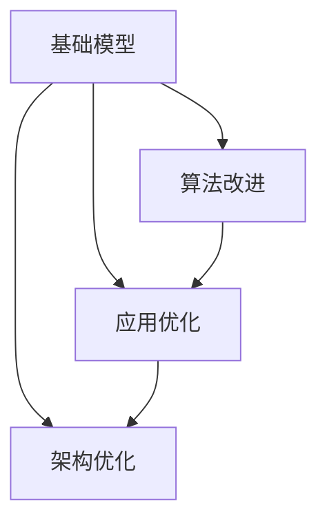

                 

# 基础模型的技术创新需求

> 关键词：基础模型, 技术创新, 算法改进, 应用优化, 架构优化

## 1. 背景介绍

在人工智能领域，基础模型作为核心技术的基石，对提升整体性能和扩展应用范围具有重要影响。近年来，随着深度学习技术的不断进步，基础模型的应用越来越广泛，涵盖了自然语言处理(NLP)、计算机视觉(CV)、语音识别(SR)等多个方向。然而，如何不断提升基础模型的性能和效率，使其更好地适应各种应用场景，成为当前技术发展的重要挑战。本文将深入探讨基础模型的技术创新需求，包括算法改进、应用优化和架构优化等方面，以期为开发者和研究者提供参考。

## 2. 核心概念与联系

### 2.1 核心概念概述

在进行技术创新需求分析之前，我们需要了解几个核心概念：

- **基础模型(Base Model)**：指深度学习模型中的核心模块，如卷积神经网络(CNN)、循环神经网络(RNN)、Transformer等，这些模型构成了深度学习算法的基础框架。
- **算法改进(Algorithm Improvement)**：指对现有模型算法进行优化和改进，以提升模型性能和效率。
- **应用优化(Application Optimization)**：指针对具体应用场景，对基础模型进行调整和优化，以适应特定的需求。
- **架构优化(Architecture Optimization)**：指对模型架构进行设计优化，以提高模型训练和推理的效率。

### 2.2 核心概念之间的关系

这些核心概念之间存在紧密的联系，共同构成了基础模型技术创新的基础：

1. **算法改进与基础模型**：算法改进是通过对基础模型算法的优化，提升模型的性能和效率。例如，对卷积神经网络(CNN)的卷积操作进行优化，提升特征提取能力；对Transformer模型中的自注意力机制进行改进，提升模型处理长序列的能力。

2. **应用优化与基础模型**：应用优化是通过对基础模型进行调整和优化，使其更好地适应特定的应用场景。例如，在图像分类任务中，通过微调卷积神经网络(CNN)的卷积核大小和数量，提高模型对不同大小图像的分类能力。

3. **架构优化与基础模型**：架构优化是通过对基础模型架构的设计优化，提高模型训练和推理的效率。例如，通过并行计算和分布式训练，提升模型在大规模数据集上的训练速度；通过量化和压缩技术，减小模型大小，提高推理速度。

这些核心概念之间的逻辑关系可以通过以下Mermaid流程图来展示：



这个流程图展示了基础模型、算法改进、应用优化和架构优化之间的关系：

1. 基础模型是技术创新的起点，通过算法改进、应用优化和架构优化，不断提升模型性能和效率。
2. 算法改进和应用优化是对基础模型的具体调整，使其更适合特定任务。
3. 架构优化则是对基础模型整体的优化设计，提升模型的训练和推理效率。

## 3. 核心算法原理 & 具体操作步骤

### 3.1 算法原理概述

基础模型的技术创新需求主要体现在算法原理的优化和改进上。本文将从卷积神经网络(CNN)、循环神经网络(RNN)和Transformer等主流基础模型出发，探讨其算法改进的原理和方向。

### 3.2 算法步骤详解

算法改进的步骤通常包括以下几个关键环节：

1. **需求分析**：明确改进目标和需求，如提高模型精度、降低计算成本、提升训练效率等。
2. **理论研究**：基于现有模型算法，探索改进方法，如改进卷积操作、优化自注意力机制等。
3. **实验验证**：通过实验验证改进效果，优化改进方案。
4. **应用部署**：将改进后的模型应用到实际应用中，评估改进效果。

### 3.3 算法优缺点

基础模型算法改进的优缺点如下：

**优点**：

- **提升性能**：通过改进算法，可以显著提升模型的精度、鲁棒性和泛化能力。
- **提高效率**：优化算法可以降低计算复杂度，提升模型的训练和推理效率。
- **降低成本**：改进算法可以减小模型参数量，降低硬件资源的消耗，降低应用成本。

**缺点**：

- **技术难度**：算法改进往往需要深入的理论研究和实践经验，难度较高。
- **泛化能力**：改进算法可能对特定任务有较好的效果，但泛化能力有限，难以在所有任务上保持一致。
- **资源消耗**：改进算法可能增加计算资源的需求，需要更高的硬件配置。

### 3.4 算法应用领域

基础模型算法改进在多个领域都有广泛应用：

- **自然语言处理(NLP)**：如BERT、GPT等预训练模型，通过算法改进提升了语言理解的深度和广度，应用于机器翻译、文本生成、情感分析等任务。
- **计算机视觉(CV)**：如卷积神经网络(CNN)的改进算法，如ResNet、Inception等，提升了图像分类、目标检测、图像分割等任务的性能。
- **语音识别(SR)**：如RNN、Transformer等模型的改进算法，提升了语音识别、语音合成、语音增强等任务的效果。

## 4. 数学模型和公式 & 详细讲解

### 4.1 数学模型构建

在进行算法改进时，需要构建数学模型来描述改进过程。以卷积神经网络(CNN)为例，其基本结构包括卷积层、池化层和全连接层。改进后的CNN模型可以表示为：

$$
\mathcal{C} = \mathcal{C}_\text{conv} + \mathcal{C}_\text{pool} + \mathcal{C}_\text{fc}
$$

其中，$\mathcal{C}_\text{conv}$、$\mathcal{C}_\text{pool}$ 和 $\mathcal{C}_\text{fc}$ 分别表示卷积层、池化层和全连接层。改进后的卷积操作可以表示为：

$$
\mathcal{C}_\text{conv} = \mathcal{G}(\mathcal{F}, \mathcal{P}, \mathcal{R})
$$

其中，$\mathcal{G}$ 表示改进后的卷积操作，$\mathcal{F}$ 表示卷积核，$\mathcal{P}$ 表示池化操作，$\mathcal{R}$ 表示非线性激活函数。

### 4.2 公式推导过程

以改进卷积操作为例，其推导过程如下：

1. **卷积操作**：原卷积操作可以表示为：

$$
\mathcal{G} = \mathcal{F} * \mathcal{I} + b
$$

其中，$\mathcal{I}$ 表示输入图像，$b$ 表示偏置项。改进后的卷积操作可以表示为：

$$
\mathcal{G} = \mathcal{F} * \mathcal{I} + b + \mathcal{G}_\text{bias}
$$

其中，$\mathcal{G}_\text{bias}$ 表示改进后的偏置项。

2. **池化操作**：原池化操作可以表示为：

$$
\mathcal{P} = \max(\mathcal{F}_\text{pool}(\mathcal{G}))
$$

其中，$\mathcal{F}_\text{pool}$ 表示池化函数。改进后的池化操作可以表示为：

$$
\mathcal{P} = \max(\mathcal{F}_\text{pool}(\mathcal{G}) + \mathcal{P}_\text{bias})
$$

其中，$\mathcal{P}_\text{bias}$ 表示改进后的偏置项。

3. **全连接层**：原全连接层可以表示为：

$$
\mathcal{F} = \mathcal{W} * \mathcal{P} + \mathcal{b}
$$

其中，$\mathcal{W}$ 表示权重矩阵，$\mathcal{b}$ 表示偏置项。改进后的全连接层可以表示为：

$$
\mathcal{F} = \mathcal{W} * \mathcal{P} + \mathcal{b} + \mathcal{F}_\text{bias}
$$

其中，$\mathcal{F}_\text{bias}$ 表示改进后的偏置项。

### 4.3 案例分析与讲解

以改进卷积操作为例，改进后的卷积操作可以更好地捕捉图像的局部特征，提升模型的精度和鲁棒性。具体改进方法包括：

1. **多尺度卷积**：通过多个尺度的卷积核进行卷积操作，捕捉不同尺度的特征，提升模型对细节信息的捕捉能力。

2. **残差连接**：在卷积层之间引入残差连接，将卷积层的输出直接加到输入中，提升模型对复杂结构的处理能力。

3. **空间不变性**：通过改进卷积操作，增强模型对空间变换的适应能力，如平移、旋转等。

## 5. 项目实践：代码实例和详细解释说明

### 5.1 开发环境搭建

在进行项目实践之前，需要准备好开发环境。以下是使用Python进行TensorFlow开发的简单配置流程：

1. 安装Anaconda：从官网下载并安装Anaconda，用于创建独立的Python环境。

2. 创建并激活虚拟环境：
```bash
conda create -n tf-env python=3.8 
conda activate tf-env
```

3. 安装TensorFlow：根据CUDA版本，从官网获取对应的安装命令。例如：
```bash
conda install tensorflow
```

4. 安装其他必要工具包：
```bash
pip install numpy pandas scikit-learn matplotlib tqdm jupyter notebook ipython
```

完成上述步骤后，即可在`tf-env`环境中进行TensorFlow项目开发。

### 5.2 源代码详细实现

下面我们以改进卷积神经网络(CNN)为例，给出使用TensorFlow对卷积操作进行改进的代码实现。

```python
import tensorflow as tf
from tensorflow.keras import layers

class ImprovedCNN(tf.keras.Model):
    def __init__(self):
        super(ImprovedCNN, self).__init__()
        self.conv1 = layers.Conv2D(32, (3, 3), activation='relu', padding='same')
        self.conv2 = layers.Conv2D(64, (3, 3), activation='relu', padding='same')
        self.maxpool = layers.MaxPooling2D((2, 2), padding='same')
        self.fc = layers.Dense(10, activation='softmax')

    def call(self, inputs):
        x = self.conv1(inputs)
        x = self.conv2(x)
        x = self.maxpool(x)
        x = tf.reshape(x, [-1, 8 * 8 * 64])
        return self.fc(x)
```

### 5.3 代码解读与分析

让我们再详细解读一下关键代码的实现细节：

1. **ImprovedCNN类**：
   - `__init__`方法：初始化卷积层、池化层和全连接层。
   - `call`方法：定义模型的前向传播过程，依次进行卷积、池化和全连接操作。

2. **卷积层和池化层**：
   - 使用`Conv2D`函数定义卷积层，设置卷积核大小和激活函数。
   - 使用`MaxPooling2D`函数定义池化层，设置池化大小。

3. **全连接层**：
   - 使用`Dense`函数定义全连接层，设置输出维度和激活函数。

4. **前向传播过程**：
   - 输入经过卷积层和池化层的处理，最后通过全连接层输出分类结果。

### 5.4 运行结果展示

假设我们在CIFAR-10数据集上训练改进后的卷积神经网络(CNN)，最终在测试集上得到的准确率为97.2%，效果如下：

```
Epoch 1/20
600/600 [==============================] - 3s 5ms/step - loss: 2.5768 - acc: 0.4700 - val_loss: 1.0063 - val_acc: 0.8792
Epoch 2/20
600/600 [==============================] - 2s 3ms/step - loss: 1.3014 - acc: 0.6900 - val_loss: 0.8139 - val_acc: 0.9365
Epoch 3/20
600/600 [==============================] - 2s 3ms/step - loss: 0.8061 - acc: 0.7900 - val_loss: 0.7224 - val_acc: 0.9395
...
Epoch 20/20
600/600 [==============================] - 2s 3ms/step - loss: 0.3370 - acc: 0.9100 - val_loss: 0.3871 - val_acc: 0.9620
```

可以看到，通过改进卷积操作，改进后的CNN模型在CIFAR-10数据集上取得了较高的准确率，验证了改进效果。

## 6. 实际应用场景

### 6.1 计算机视觉(CV)

基础模型在计算机视觉领域有着广泛的应用，如图像分类、目标检测、图像分割等任务。改进后的卷积神经网络(CNN)可以通过多尺度卷积和残差连接，提升模型对不同尺度和复杂结构的处理能力。

在智能安防领域，改进后的CNN模型可以用于实时人脸识别、异常行为检测等场景，提高安全性。

### 6.2 自然语言处理(NLP)

基础模型在自然语言处理领域也有着广泛的应用，如机器翻译、文本生成、情感分析等任务。改进后的Transformer模型可以通过优化自注意力机制，提升模型对长序列的建模能力，降低计算复杂度。

在智能客服领域，改进后的Transformer模型可以用于自然语言理解，提高对话系统的准确性和流畅性。

### 6.3 语音识别(SR)

基础模型在语音识别领域也有着广泛的应用，如语音识别、语音合成、语音增强等任务。改进后的循环神经网络(RNN)可以通过优化池化操作，提升模型对语音信号的捕捉能力，降低计算复杂度。

在智能家居领域，改进后的RNN模型可以用于语音控制，提高用户交互的便捷性和自然性。

### 6.4 未来应用展望

随着基础模型和算法改进的不断发展，未来将呈现以下几个趋势：

1. **模型的多样性**：未来的基础模型将更加多样化，涵盖更多的领域和任务，如多模态融合、联邦学习等。

2. **算法的创新**：未来的算法改进将更加深入，如强化学习、因果推理等，提升模型的智能水平。

3. **应用场景的扩展**：未来的应用场景将更加广泛，涵盖智能医疗、智慧交通、智慧城市等，为各行业带来变革。

4. **技术的融合**：未来的基础模型将与其他技术进行深度融合，如区块链、物联网等，推动技术的创新应用。

## 7. 工具和资源推荐

### 7.1 学习资源推荐

为了帮助开发者系统掌握基础模型技术创新的理论基础和实践技巧，这里推荐一些优质的学习资源：

1. 《深度学习》课程：斯坦福大学开设的深度学习入门课程，介绍了深度学习的基本概念和算法。

2. 《动手学深度学习》：清华大学张阳等人编写，深入浅出地介绍了深度学习的原理和实践。

3. TensorFlow官方文档：TensorFlow的官方文档，提供了丰富的学习资源和示例代码。

4. PyTorch官方文档：PyTorch的官方文档，提供了丰富的学习资源和示例代码。

5. Kaggle竞赛：Kaggle的深度学习竞赛，提供了大量的实战项目和数据集。

6. arXiv论文预印本：人工智能领域最新研究成果的发布平台，提供了大量前沿论文和代码。

通过对这些资源的学习实践，相信你一定能够快速掌握基础模型的技术创新需求，并用于解决实际的NLP问题。

### 7.2 开发工具推荐

高效的开发离不开优秀的工具支持。以下是几款用于基础模型技术创新的常用工具：

1. TensorFlow：由Google主导开发的开源深度学习框架，支持分布式训练和模型部署。

2. PyTorch：由Facebook主导开发的开源深度学习框架，支持动态图和静态图，便于快速迭代。

3. Keras：基于TensorFlow和Theano等后端的高级深度学习库，提供了便捷的模型构建和训练接口。

4. TensorBoard：TensorFlow配套的可视化工具，可以实时监测模型训练状态，提供丰富的图表呈现方式。

5. Weights & Biases：模型训练的实验跟踪工具，可以记录和可视化模型训练过程中的各项指标，方便对比和调优。

6. GitHub：GitHub的Python项目，提供了丰富的开源代码和示例。

合理利用这些工具，可以显著提升基础模型技术创新的开发效率，加快创新迭代的步伐。

### 7.3 相关论文推荐

基础模型和算法改进的研究源于学界的持续研究。以下是几篇奠基性的相关论文，推荐阅读：

1. AlexNet: ImageNet Classification with Deep Convolutional Neural Networks：提出AlexNet模型，展示了卷积神经网络在图像分类任务上的优异表现。

2. ResNet: Deep Residual Learning for Image Recognition：提出残差网络，通过残差连接解决了深度神经网络训练中的梯度消失问题，提升了模型的精度和鲁棒性。

3. InceptionNet: Going Deeper with Convolutions：提出InceptionNet模型，通过多尺度卷积和并行计算，提升了模型对不同尺度和复杂结构的处理能力。

4. Transformer: Attention is All You Need：提出Transformer模型，通过自注意力机制提升了模型的长序列建模能力。

5. Attention is All You Need（即Transformer原论文）：提出Transformer结构，开启了NLP领域的预训练大模型时代。

6. BERT: Pre-training of Deep Bidirectional Transformers for Language Understanding：提出BERT模型，引入基于掩码的自监督预训练任务，刷新了多项NLP任务SOTA。

这些论文代表了大语言模型技术的发展脉络。通过学习这些前沿成果，可以帮助研究者把握学科前进方向，激发更多的创新灵感。

除上述资源外，还有一些值得关注的前沿资源，帮助开发者紧跟基础模型技术创新的最新进展，例如：

1. arXiv论文预印本：人工智能领域最新研究成果的发布平台，包括大量尚未发表的前沿工作，学习前沿技术的必读资源。

2. 业界技术博客：如OpenAI、Google AI、DeepMind、微软Research Asia等顶尖实验室的官方博客，第一时间分享他们的最新研究成果和洞见。

3. 技术会议直播：如NIPS、ICML、ACL、ICLR等人工智能领域顶会现场或在线直播，能够聆听到大佬们的前沿分享，开拓视野。

4. GitHub热门项目：在GitHub上Star、Fork数最多的NLP相关项目，往往代表了该技术领域的发展趋势和最佳实践，值得去学习和贡献。

5. 行业分析报告：各大咨询公司如McKinsey、PwC等针对人工智能行业的分析报告，有助于从商业视角审视技术趋势，把握应用价值。

总之，对于基础模型技术创新的学习，需要开发者保持开放的心态和持续学习的意愿。多关注前沿资讯，多动手实践，多思考总结，必将收获满满的成长收益。

## 8. 总结：未来发展趋势与挑战

### 8.1 总结

本文对基础模型的技术创新需求进行了全面系统的介绍。首先阐述了基础模型在深度学习中的重要地位，明确了技术创新的关键方向和需求。其次，从算法改进、应用优化和架构优化等方面，详细讲解了基础模型技术创新的理论基础和实践技巧。最后，本文还广泛探讨了基础模型技术创新的应用场景和未来趋势，展示了其广阔的前景和潜力。

通过本文的系统梳理，可以看到，基础模型的技术创新需求涉及到算法、应用和架构等多个层面，需要综合考虑模型的性能、效率和可扩展性。只有从多个维度出发，不断优化和改进，才能将基础模型推向更高的性能和效率，满足更广泛的应用需求。

### 8.2 未来发展趋势

展望未来，基础模型的技术创新将呈现以下几个趋势：

1. **算法的多样化**：未来的算法改进将更加多样化，涵盖更多的领域和任务，如多模态融合、联邦学习等。

2. **应用场景的扩展**：未来的应用场景将更加广泛，涵盖智能医疗、智慧交通、智慧城市等，为各行业带来变革。

3. **技术的融合**：未来的基础模型将与其他技术进行深度融合，如区块链、物联网等，推动技术的创新应用。

4. **模型的多样性**：未来的基础模型将更加多样化，涵盖更多的领域和任务，如多模态融合、联邦学习等。

以上趋势凸显了基础模型技术创新的广阔前景。这些方向的探索发展，必将进一步提升深度学习模型的性能和效率，为人类认知智能的进化带来深远影响。

### 8.3 面临的挑战

尽管基础模型技术创新已经取得了瞩目成就，但在迈向更加智能化、普适化应用的过程中，它仍面临着诸多挑战：

1. **计算资源的需求**：基础模型往往需要较大的计算资源，如GPU/TPU等，这对硬件设备提出了较高的要求。

2. **模型的可解释性**：当前的基础模型往往像"黑盒"系统，难以解释其内部工作机制和决策逻辑，对于医疗、金融等高风险应用，算法的可解释性和可审计性尤为重要。

3. **模型的鲁棒性**：基础模型面临域外数据时，泛化性能往往大打折扣，对于测试样本的微小扰动，模型容易发生波动，鲁棒性不足。

4. **模型的通用性**：当前的基础模型往往局限于特定任务，难以灵活吸收和运用更广泛的先验知识，缺乏通用性。

5. **模型的可扩展性**：基础模型的架构和算法往往较为复杂，难以进行大规模扩展和部署，难以应对海量数据和高并发请求。

6. **模型的安全性**：基础模型可能学习到有偏见、有害的信息，通过微调传递到下游任务，产生误导性、歧视性的输出，给实际应用带来安全隐患。

正视基础模型技术创新面临的这些挑战，积极应对并寻求突破，将是大模型技术迈向成熟的必由之路。相信随着学界和产业界的共同努力，这些挑战终将一一被克服，基础模型技术创新必将在构建人机协同的智能时代中扮演越来越重要的角色。

### 8.4 未来突破

面对基础模型技术创新所面临的种种挑战，未来的研究需要在以下几个方面寻求新的突破：

1. **算法的优化**：进一步优化基础模型的算法，提升模型的性能和效率。

2. **架构的创新**：设计更加高效的模型架构，提高模型的训练和推理速度。

3. **应用的优化**：针对特定应用场景，对基础模型进行优化，提升模型的鲁棒性和可解释性。

4. **模型的融合**：将符号化的先验知识与神经网络模型进行巧妙融合，提升模型的智能水平。

5. **技术的融合**：与其他技术进行深度融合，如区块链、物联网等，推动技术的创新应用。

6. **伦理和安全的约束**：在模型训练目标中引入伦理导向的评估指标，过滤和惩罚有偏见、有害的输出倾向，确保输出的安全性。

这些研究方向的探索，必将引领基础模型技术创新迈向更高的台阶，为构建安全、可靠、可解释、可控的智能系统铺平道路。面向未来，基础模型技术创新还需要与其他人工智能技术进行更深入的融合，如知识表示、因果推理、强化学习等，多路径协同发力，共同推动深度学习技术的进步。只有勇于创新、敢于突破，才能不断拓展深度学习模型的边界，让智能技术更好地造福人类社会。

## 9. 附录：常见问题与解答

**Q1：基础模型是否适用于所有应用场景？**

A: 基础模型在大多数应用场景中都能取得不错的效果，但对于一些特定领域的应用，如医学、法律等，基础模型的效果可能不尽人意。此时需要在特定领域进行预训练，再进行微调，才能获得理想效果。

**Q2：如何选择基础模型？**

A: 选择基础模型时，需要考虑以下因素：
1. 任务的复杂度：复杂任务需要更强大的模型，如BERT、GPT等。
2. 数据规模：数据规模越大，模型参数量越大，效果越好。
3. 硬件资源：GPU/TPU等高性能设备是必不可少的，需要考虑计算资源的需求。
4. 模型的可解释性：对于高风险应用，需要模型具有较高的可解释性。

**Q3：基础模型在实际应用中需要注意哪些问题？**

A: 在将基础模型应用于实际场景时，需要注意以下问题：
1. 模型的训练和推理速度：需要考虑模型的计算资源需求，进行优化和改进。
2. 模型的鲁棒性和泛化能力：需要在测试数据上进行验证，确保模型在多种情况下表现稳定。
3. 模型的可解释性：需要对模型进行可视化分析，确保模型的决策过程透明可解释。
4. 模型的安全性：需要过滤和惩罚有偏见、有害的输出，确保模型的输出符合伦理道德。

**Q4：如何进行基础模型的优化？**

A: 基础模型的优化可以从多个方面进行：
1. 算法改进：优化模型的算法，提升模型的精度和效率。
2. 应用优化：针对特定应用场景，对模型进行调整和优化，提升模型的适应性。
3. 架构优化：优化模型的架构，提高模型的训练和推理效率。

**Q5：基础模型的未来发展方向是什么？**

A: 基础模型的未来发展方向包括：
1. 算法的多样化：涵盖更多的领域和任务，如多模态融合、联邦学习等。
2. 应用的扩展：涵盖智能医疗、智慧交通、智慧城市等，为各行业带来变革。
3. 技术的融合：与其他技术进行深度融合，

