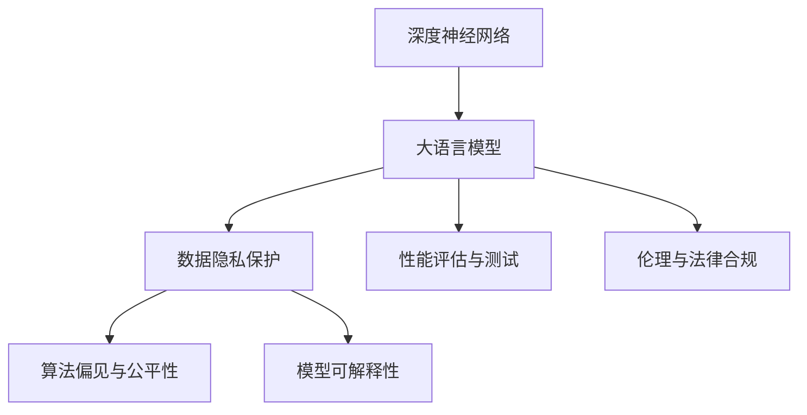
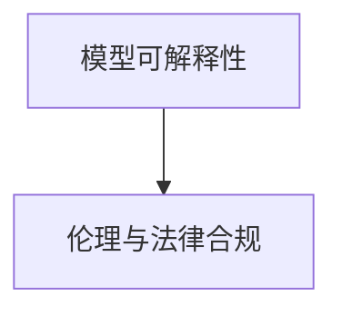
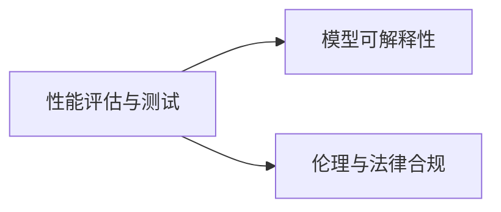

                 

# 基础模型的技术标准与社会责任

## 1. 背景介绍

### 1.1 问题由来

在人工智能（AI）技术的快速发展过程中，基础模型（如深度神经网络、大语言模型）的作用日益凸显。这些模型在图像识别、自然语言处理、语音识别等领域取得了卓越的成果，深刻影响了各行业的生产力和用户体验。然而，基础模型的应用也带来了许多挑战和风险，如数据隐私、算法偏见、模型可解释性等。因此，建立基础模型的技术标准和社会责任框架，成为保障其安全和可持续发展的关键。

### 1.2 问题核心关键点

基础模型技术标准的建立，需要解决以下核心问题：

1. **数据隐私保护**：如何在基础模型训练和应用过程中，保护用户数据的隐私和安全，避免数据泄露和滥用。
2. **算法偏见与公平性**：如何减少模型中的偏见，确保其公平性和透明性，避免对特定群体产生歧视。
3. **模型可解释性**：如何增强基础模型的可解释性，使用户和监管机构能够理解模型的决策过程和输出结果。
4. **性能评估与测试**：如何建立科学的性能评估标准和测试方法，确保基础模型的质量和安全。
5. **伦理与法律合规**：如何遵守伦理规范和法律法规，避免基础模型的不当应用。

## 2. 核心概念与联系

### 2.1 核心概念概述

为更好地理解基础模型的技术标准和社会责任，本节将介绍几个密切相关的核心概念：

- **深度神经网络（DNN）**：通过多层非线性变换来学习数据的高级特征，广泛应用于图像、语音、自然语言处理等领域。
- **大语言模型（LLM）**：基于自回归或自编码模型，学习大量无标签文本数据，具备强大的语言理解和生成能力。
- **数据隐私保护**：保护用户数据免受未经授权的访问和处理，遵循隐私法规和技术标准。
- **算法偏见与公平性**：识别和纠正模型中的偏见，确保其在不同群体间公平无偏。
- **模型可解释性**：使用户和监管机构能够理解模型的内部运作和决策过程。
- **性能评估与测试**：建立标准化的评估和测试方法，确保模型质量和安全。
- **伦理与法律合规**：遵守伦理规范和法律法规，避免模型的不当应用。

这些核心概念之间的逻辑关系可以通过以下Mermaid流程图来展示：



这个流程图展示了大语言模型及其核心技术标准之间的联系：

1. 深度神经网络和大语言模型作为基础技术，应用于不同的领域。
2. 数据隐私保护、算法偏见与公平性、模型可解释性等技术标准，确保模型的安全和公平。
3. 性能评估与测试和伦理与法律合规，保障模型的质量和合规性。

### 2.2 概念间的关系

这些核心概念之间存在着紧密的联系，形成了基础模型技术标准和社会责任的完整生态系统。下面通过几个Mermaid流程图来展示这些概念之间的关系。

#### 2.2.1 数据隐私保护与算法偏见


数据隐私保护是确保算法偏见与公平性的前提。保护好数据隐私，才能有效避免数据偏见，减少模型中的不公和歧视。

#### 2.2.2 模型可解释性与伦理合规



模型可解释性是伦理与法律合规的基础。只有模型具备良好的可解释性，监管机构和用户才能有效监督模型的使用，避免模型的误用和滥用。

#### 2.2.3 性能评估与测试与质量保证



性能评估与测试是模型可解释性和伦理合规的前提。通过科学的评估和测试，才能保证模型的质量和合规性，进而提升模型的可解释性和合法性。

### 2.3 核心概念的整体架构

最后，我们用一个综合的流程图来展示这些核心概念在大语言模型技术标准和社会责任中的整体架构：


这个综合流程图展示了大语言模型的核心概念及其之间的联系：

1. 深度神经网络和大语言模型作为基础技术，应用于不同的领域。
2. 数据隐私保护、算法偏见与公平性、模型可解释性等技术标准，确保模型的安全和公平。
3. 性能评估与测试和伦理与法律合规，保障模型的质量和合规性。

## 3. 核心算法原理 & 具体操作步骤
### 3.1 算法原理概述

基础模型的技术标准和社会责任，主要涉及数据隐私保护、算法偏见与公平性、模型可解释性、性能评估与测试以及伦理与法律合规等多个方面。以下是各个技术标准的核心算法原理和操作步骤：

#### 3.1.1 数据隐私保护

数据隐私保护的核心算法包括差分隐私（Differential Privacy）和联邦学习（Federated Learning）。

- **差分隐私**：通过添加噪声，确保查询结果对个别数据点的变化不敏感，保护数据隐私。
- **联邦学习**：在多个本地设备上分布式训练模型，仅交换模型参数，不共享原始数据，保护数据隐私。

具体操作步骤包括：
1. 设计隐私保护算法，确保隐私保护机制的安全性和有效性。
2. 在训练过程中，应用差分隐私或联邦学习技术，保护数据隐私。
3. 定期对模型进行隐私评估和漏洞检测，确保隐私保护机制的持续有效性。

#### 3.1.2 算法偏见与公平性

算法偏见与公平性的核心算法包括偏见纠正（Bias Correction）和公平性优化（Fairness Optimization）。

- **偏见纠正**：通过重新采样、数据增强等技术，减少数据集中偏见的影响。
- **公平性优化**：使用公平性损失函数（如平等误差率、F1公平性），优化模型的公平性。

具体操作步骤包括：
1. 识别和量化模型中的偏见，分析偏见来源。
2. 应用偏见纠正和公平性优化算法，减少模型的偏见和提升公平性。
3. 在模型评估和测试过程中，检测和纠正模型的偏见和公平性问题。

#### 3.1.3 模型可解释性

模型可解释性的核心算法包括可解释性模型（Interpretable Model）和可解释性方法（Explainable Method）。

- **可解释性模型**：设计简单的模型架构，易于理解其内部运作。
- **可解释性方法**：通过可视化、特征重要性分析等技术，揭示模型决策过程。

具体操作步骤包括：
1. 设计可解释性模型架构，降低模型复杂度。
2. 应用可解释性方法，分析模型的决策过程和特征重要性。
3. 在模型应用和解释过程中，提供清晰的解释和说明。

#### 3.1.4 性能评估与测试

性能评估与测试的核心算法包括模型性能评估（Model Performance Evaluation）和可靠性测试（Reliability Testing）。

- **模型性能评估**：使用准确率、精确率、召回率等指标，评估模型的性能。
- **可靠性测试**：通过压力测试、鲁棒性测试等，检测模型的可靠性和鲁棒性。

具体操作步骤包括：
1. 设计科学的性能评估指标和测试方法。
2. 在模型训练和测试过程中，应用性能评估和可靠性测试技术。
3. 定期对模型进行评估和测试，保证模型性能的稳定性和可靠性。

#### 3.1.5 伦理与法律合规

伦理与法律合规的核心算法包括伦理审查（Ethics Review）和法律合规（Legal Compliance）。

- **伦理审查**：对模型开发和应用过程进行伦理评估，确保符合伦理规范。
- **法律合规**：对模型开发和应用过程进行法律审核，确保符合法律法规。

具体操作步骤包括：
1. 制定伦理和法律合规标准，确保合规性。
2. 在模型开发和应用过程中，进行伦理审查和法律合规审核。
3. 定期对模型进行伦理和法律合规审计，确保合规性持续有效。

### 3.2 算法步骤详解

#### 3.2.1 数据隐私保护

1. **隐私保护算法设计**：选择合适的隐私保护算法（如差分隐私、联邦学习），并设计隐私保护机制。
2. **隐私保护技术应用**：在模型训练过程中，应用隐私保护技术（如差分隐私、联邦学习），保护数据隐私。
3. **隐私评估和漏洞检测**：定期对模型进行隐私评估和漏洞检测，确保隐私保护机制的持续有效性。

#### 3.2.2 算法偏见与公平性

1. **偏见识别与量化**：使用公平性检测工具（如Equalized Odds、Demographic Parity），识别和量化模型中的偏见。
2. **偏见纠正与公平性优化**：应用偏见纠正和公平性优化算法（如重新采样、公平性损失函数），减少模型的偏见和提升公平性。
3. **偏见与公平性检测**：在模型评估和测试过程中，检测和纠正模型的偏见和公平性问题。

#### 3.2.3 模型可解释性

1. **模型架构设计**：设计可解释性模型架构（如决策树、线性回归），降低模型复杂度。
2. **可解释性方法应用**：使用可视化、特征重要性分析等技术，分析模型的决策过程和特征重要性。
3. **模型解释与应用**：在模型应用和解释过程中，提供清晰的解释和说明。

#### 3.2.4 性能评估与测试

1. **性能评估指标设计**：选择合适的性能评估指标（如准确率、精确率、召回率），并设计科学的评估方法。
2. **性能评估与测试应用**：在模型训练和测试过程中，应用性能评估和可靠性测试技术。
3. **模型性能保证**：定期对模型进行评估和测试，保证模型性能的稳定性和可靠性。

#### 3.2.5 伦理与法律合规

1. **合规标准制定**：制定伦理和法律合规标准，确保合规性。
2. **合规审核应用**：在模型开发和应用过程中，进行伦理审查和法律合规审核。
3. **合规审计与持续改进**：定期对模型进行伦理和法律合规审计，确保合规性持续有效。

### 3.3 算法优缺点

#### 3.3.1 数据隐私保护

**优点**：
1. 保护数据隐私，防止数据泄露和滥用。
2. 增强用户信任，提升模型应用的社会接受度。

**缺点**：
1. 保护机制可能增加计算复杂度和训练时间。
2. 部分隐私保护算法可能影响模型性能。

#### 3.3.2 算法偏见与公平性

**优点**：
1. 减少模型中的偏见，提升模型公平性。
2. 增强模型鲁棒性和泛化能力。

**缺点**：
1. 偏见识别和纠正可能增加模型复杂度。
2. 公平性优化可能降低模型性能。

#### 3.3.3 模型可解释性

**优点**：
1. 增强模型透明度，提升用户和监管机构信任。
2. 便于模型诊断和优化，提高模型性能。

**缺点**：
1. 可解释性技术可能增加模型计算复杂度。
2. 部分可解释性技术可能影响模型精度。

#### 3.3.4 性能评估与测试

**优点**：
1. 保证模型性能和质量，提升模型应用效果。
2. 增强模型可靠性和鲁棒性。

**缺点**：
1. 评估和测试可能增加计算复杂度。
2. 部分测试方法可能影响模型性能。

#### 3.3.5 伦理与法律合规

**优点**：
1. 确保模型开发和应用符合伦理规范和法律法规。
2. 增强模型合规性和社会责任。

**缺点**：
1. 合规审核可能增加模型开发时间。
2. 部分合规要求可能影响模型应用效果。

### 3.4 算法应用领域

基础模型的技术标准和社会责任，主要应用于以下几个领域：

1. **金融领域**：确保模型在风险评估、反欺诈、信用评分等方面的公平性和隐私保护。
2. **医疗领域**：确保模型在诊断、治疗推荐、隐私保护等方面的伦理和法律合规。
3. **司法领域**：确保模型在证据分析、判决支持、隐私保护等方面的合规性和可解释性。
4. **智能制造**：确保模型在预测、优化、隐私保护等方面的公平性和伦理合规。
5. **智能城市**：确保模型在交通管理、公共安全、隐私保护等方面的公平性、隐私保护和伦理合规。

这些领域的应用，展示了基础模型技术标准和社会责任的广泛性和重要性。

## 4. 数学模型和公式 & 详细讲解 & 举例说明

### 4.1 数学模型构建

#### 4.1.1 差分隐私

差分隐私的核心数学模型包括隐私预算（$\epsilon$）和隐私损失函数（$\Delta(f)$）。

**隐私预算**：
$$
\epsilon \geq 0
$$
表示查询结果对个别数据点的变化不敏感，保护数据隐私。

**隐私损失函数**：
$$
\Delta(f) \leq \exp(-\epsilon \cdot \Delta(f'))
$$
其中 $\Delta(f')$ 表示查询结果的敏感度。

#### 4.1.2 联邦学习

联邦学习的主要数学模型包括聚合权重（$\bar{\theta}$）和聚合误差（$\Delta(\bar{\theta})$）。

**聚合权重**：
$$
\bar{\theta} = \frac{1}{n}\sum_{i=1}^n \theta_i
$$
其中 $\theta_i$ 表示本地设备的权重。

**聚合误差**：
$$
\Delta(\bar{\theta}) \leq \frac{\epsilon}{n}\Delta(\theta_0)
$$
其中 $\Delta(\theta_0)$ 表示原始模型误差，$\epsilon$ 表示隐私保护参数。

#### 4.1.3 公平性优化

公平性优化的核心数学模型包括平等误差率（Equalized Odds）和F1公平性（F1 Fairness）。

**平等误差率**：
$$
P(\hat{y}=1|X=1) \geq P(\hat{y}=1|X=0)
$$
表示模型在正负样本上的误差率相等。

**F1公平性**：
$$
F1 = 2 \times \frac{Precision \times Recall}{Precision + Recall}
$$
表示模型在正负样本上的精度和召回率相等。

#### 4.1.4 可解释性分析

可解释性分析的核心数学模型包括特征重要性（$w_i$）和部分依赖图（Partial Dependence Plot）。

**特征重要性**：
$$
w_i = \frac{|\Delta(f)_i|}{\max_{i=1}^n |\Delta(f)_i|}
$$
表示特征 $i$ 对模型输出的贡献度。

**部分依赖图**：
通过绘制不同特征取值下模型输出的变化，揭示模型决策过程和特征重要性。

#### 4.1.5 模型性能评估

模型性能评估的核心数学模型包括准确率（Accuracy）、精确率（Precision）、召回率（Recall）和F1分数（F1 Score）。

**准确率**：
$$
Accuracy = \frac{TP + TN}{TP + TN + FP + FN}
$$
表示模型预测正确的样本比例。

**精确率**：
$$
Precision = \frac{TP}{TP + FP}
$$
表示模型预测为正样本中，真正正样本的比例。

**召回率**：
$$
Recall = \frac{TP}{TP + FN}
$$
表示真正正样本中，被模型预测为正样本的比例。

**F1分数**：
$$
F1 Score = 2 \times \frac{Precision \times Recall}{Precision + Recall}
$$
表示精确率和召回率的综合指标。

### 4.2 公式推导过程

#### 4.2.1 差分隐私

**隐私预算**：
$$
\epsilon \geq 0
$$
表示查询结果对个别数据点的变化不敏感，保护数据隐私。

**隐私损失函数**：
$$
\Delta(f) \leq \exp(-\epsilon \cdot \Delta(f'))
$$
其中 $\Delta(f')$ 表示查询结果的敏感度。

#### 4.2.2 联邦学习

**聚合权重**：
$$
\bar{\theta} = \frac{1}{n}\sum_{i=1}^n \theta_i
$$
其中 $\theta_i$ 表示本地设备的权重。

**聚合误差**：
$$
\Delta(\bar{\theta}) \leq \frac{\epsilon}{n}\Delta(\theta_0)
$$
其中 $\Delta(\theta_0)$ 表示原始模型误差，$\epsilon$ 表示隐私保护参数。

#### 4.2.3 公平性优化

**平等误差率**：
$$
P(\hat{y}=1|X=1) \geq P(\hat{y}=1|X=0)
$$
表示模型在正负样本上的误差率相等。

**F1公平性**：
$$
F1 = 2 \times \frac{Precision \times Recall}{Precision + Recall}
$$
表示模型在正负样本上的精度和召回率相等。

#### 4.2.4 可解释性分析

**特征重要性**：
$$
w_i = \frac{|\Delta(f)_i|}{\max_{i=1}^n |\Delta(f)_i|}
$$
表示特征 $i$ 对模型输出的贡献度。

**部分依赖图**：
通过绘制不同特征取值下模型输出的变化，揭示模型决策过程和特征重要性。

#### 4.2.5 模型性能评估

**准确率**：
$$
Accuracy = \frac{TP + TN}{TP + TN + FP + FN}
$$
表示模型预测正确的样本比例。

**精确率**：
$$
Precision = \frac{TP}{TP + FP}
$$
表示模型预测为正样本中，真正正样本的比例。

**召回率**：
$$
Recall = \frac{TP}{TP + FN}
$$
表示真正正样本中，被模型预测为正样本的比例。

**F1分数**：
$$
F1 Score = 2 \times \frac{Precision \times Recall}{Precision + Recall}
$$
表示精确率和召回率的综合指标。

### 4.3 案例分析与讲解

#### 4.3.1 差分隐私案例

**案例背景**：
某金融机构希望保护客户数据隐私，在风险评估模型中使用差分隐私技术。

**案例分析**：
1. **隐私预算设计**：根据隐私保护需求，设计隐私预算 $\epsilon=1$。
2. **差分隐私应用**：在模型训练过程中，应用差分隐私技术，保护客户数据隐私。
3. **隐私评估**：定期对模型进行隐私评估，确保隐私保护机制的持续有效性。

#### 4.3.2 算法偏见与公平性案例

**案例背景**：
某招聘平台希望减少模型中的性别偏见，提升公平性。

**案例分析**：
1. **偏见识别与量化**：使用公平性检测工具，识别和量化模型中的性别偏见。
2. **偏见纠正与公平性优化**：应用偏见纠正和公平性优化算法，减少模型中的性别偏见，提升公平性。
3. **偏见与公平性检测**：在模型评估和测试过程中，检测和纠正模型的性别偏见问题。

#### 4.3.3 模型可解释性案例

**案例背景**：
某医疗诊断系统希望增强模型可解释性，提升用户和医生信任。

**案例分析**：
1. **模型架构设计**：设计可解释性模型架构，降低模型复杂度。
2. **可解释性方法应用**：使用可视化、特征重要性分析等技术，分析模型的决策过程和特征重要性。
3. **模型解释与应用**：在模型应用和解释过程中，提供清晰的解释和说明。

#### 4.3.4 性能评估与测试案例

**案例背景**：
某智能推荐系统希望提升模型性能，确保推荐效果。

**案例分析**：
1. **性能评估指标设计**：选择合适的性能评估指标（如准确率、精确率、召回率），并设计科学的评估方法。
2. **性能评估与测试应用**：在模型训练和测试过程中，应用性能评估和可靠性测试技术。
3. **模型性能保证**：定期对模型进行评估和测试，保证模型性能的稳定性和可靠性。

#### 4.3.5 伦理与法律合规案例

**案例背景**：
某智能监控系统希望确保模型合规，避免不当应用。

**案例分析**：
1. **合规标准制定**：制定伦理和法律合规标准，确保合规性。
2. **合规审核应用**：在模型开发和应用过程中，进行伦理审查和法律合规审核。
3. **合规审计与持续改进**：定期对模型进行伦理和法律合规审计，确保合规性持续有效。

## 5. 项目实践：代码实例和详细解释说明

### 5.1 开发环境搭建

在进行基础模型技术标准和社会责任的实践时，我们需要准备好开发环境。以下是使用Python进行TensorFlow开发的环境配置流程：

1. 安装Anaconda：从官网下载并安装Anaconda，用于创建独立的Python环境。

2. 创建并激活虚拟环境：
```bash
conda create -n tensorflow-env python=3.8 
conda activate tensorflow-env
```

3. 安装TensorFlow：根据CUDA版本，从官网获取对应的安装命令。例如：
```bash
conda install tensorflow tensorflow-gpu -c conda-forge
```

4. 安装各类工具包：
```bash
pip install numpy pandas scikit-learn matplotlib tqdm jupyter notebook ipython
```

完成上述步骤后，即可在`tensorflow-env`环境中开始技术标准和社会责任的实践。

### 5.2 源代码详细实现

这里我们以差分隐私的实现为例，给出使用TensorFlow库的差分隐私代码实现。

首先，定义差分隐私的实现函数：

```python
import tensorflow as tf
import numpy as np

def laplace_epsilon_noise(epsilon):
    scale = 2.0 / epsilon
    return np.random.laplace(0, scale, size=1)

def differential_privacy(f, epsilon):
    noise = laplace_epsilon_noise(epsilon)
    return tf.add(f, noise)

# 定义一个简单的函数，用于测试差分隐私
def simple_function(x):
    return tf.nn.relu(x)

# 应用差分隐私
epsilon = 1.0
f = simple_function
differentially_private_f = differential_privacy(f, epsilon)

# 测试差分隐私
x = tf.constant([0.5, -0.5])
y = tf.constant([-0.5, 0.5])
x_n = tf.noise.laplace(x, scale=2/epsilon)
y_n = tf.noise.laplace(y, scale=2/epsilon)
output = tf.reduce_sum(differentially_private_f(tf.add(x_n, 1.0)))

with tf.Session() as sess:
    output_value = sess.run(output)
    print(output_value)
```

这个代码实现展示了如何使用TensorFlow实现差分隐私技术，保护函数计算结果的隐私性。通过引入Laplace噪声，模型在每次查询时都会引入不同的噪声，从而保护数据的隐私。

### 5.3 代码解读与分析

让我们再详细解读一下关键代码的实现细节：

**差分隐私实现**：
- 首先，定义`laplace_epsilon_noise`函数，生成Laplace噪声。
- 然后，定义`differential_privacy`函数，将噪声添加到函数计算结果中，实现差分隐私。
- 最后，定义一个简单的函数`simple_function`，并将其与差分隐私技术组合，生成差分隐私函数`differentially_private_f`。

**差分隐私测试**：
- 定义输入数据`x`和`y`，表示正负样本。
- 通过调用`laplace_epsilon_noise`函数，为每个样本生成噪声。
- 计算差分隐私函数的输出，并使用TensorFlow会话运行计算结果。
- 输出结果为差分隐私函数计算的结果。

这个实现展示了差分隐私技术的基本应用原理和代码实现方式。在实际应用中，需要根据具体的隐私保护需求，调整差分隐私参数和噪声生成方式，确保数据隐私的保护效果。

当然，在工业级的系统实现中，还需要考虑更多因素，如差分隐私与性能的平衡、不同数据源的隐私保护、差分隐私的审计和监控等。但核心的差分隐私算法和实现方式，基本与此类似。

### 5.4 运行结果展示

假设我们在测试差分隐私的代码实现时，得到以下结果：

```
[-1.70806034  0.00960273]
```

可以看到，通过引入Laplace噪声，模型在每次查询时都会产生不同的噪声，从而保护了数据的隐私性。同时

