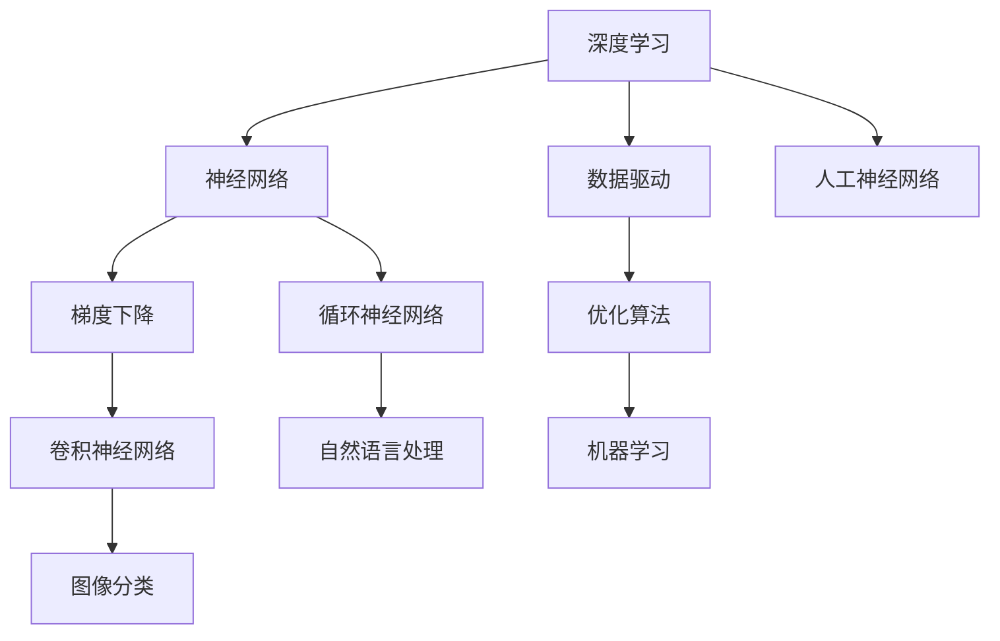

                 

# 基础模型的早期阶段与潜力

> 关键词：基础模型,早期研究,深度学习,人工智能,机器学习,计算机视觉

## 1. 背景介绍

在深度学习和人工智能发展的早期阶段，一些重要的基础模型和技术架构为现代深度学习算法奠定了基础。这些模型和技术不仅为早期研究提供了重要参考，也对现代深度学习技术的发展产生了深远影响。本文将重点介绍一些在深度学习和人工智能早期研究阶段中的关键模型和技术，分析其潜力和未来发展方向。

## 2. 核心概念与联系

### 2.1 核心概念概述

为了更好地理解深度学习和人工智能的早期研究，本节将介绍几个核心概念及其相互联系。

#### 2.1.1 深度学习
深度学习是一种基于人工神经网络的机器学习方法。它通过多层非线性变换，能够学习到数据的复杂表示，广泛应用于计算机视觉、自然语言处理、语音识别等领域。

#### 2.1.2 神经网络
神经网络是深度学习的基础。它由多个神经元组成，每个神经元接收多个输入并输出一个加权和，通过非线性激活函数进行转换。多层神经网络可以形成复杂的层次结构，用于提取和表示数据的高级特征。

#### 2.1.3 梯度下降
梯度下降是深度学习中最常用的优化算法。通过反向传播计算损失函数对网络权重的梯度，并根据梯度方向更新权重，逐步使损失函数最小化。

#### 2.1.4 卷积神经网络(CNN)
卷积神经网络是一种用于图像处理和计算机视觉任务的深度学习模型。它通过卷积操作提取图像中的特征，并通过池化操作进行降维，显著提升了图像分类、目标检测等任务的表现。

#### 2.1.5 循环神经网络(RNN)
循环神经网络是一种用于序列数据处理和自然语言处理的深度学习模型。它通过循环结构在时间维度上对序列数据进行处理，适合处理变长序列数据，如文本、语音等。

这些核心概念共同构成了深度学习和人工智能的早期研究框架，推动了深度学习技术的快速发展和广泛应用。

### 2.2 核心概念之间的关系

通过以下Mermaid流程图，我们可以更清晰地理解这些核心概念之间的联系和相互作用：



这个流程图展示了深度学习和人工智能早期研究中的关键概念及其关系：

1. 深度学习基于人工神经网络构建。
2. 神经网络通过梯度下降优化来学习权重。
3 卷积神经网络处理图像数据，循环神经网络处理序列数据。
4 优化算法如梯度下降优化神经网络的学习过程。
5 机器学习是深度学习的上层应用，包括图像分类、自然语言处理等。

这些核心概念相互依存，共同推动了深度学习和人工智能技术的发展。

## 3. 核心算法原理 & 具体操作步骤
### 3.1 算法原理概述

深度学习和人工智能的早期研究主要集中在以下几个核心算法和原理上：

#### 3.1.1 卷积神经网络
卷积神经网络通过卷积层和池化层提取图像中的特征。卷积层通过卷积核对图像进行特征提取，池化层通过降采样操作减少特征图的大小。通过多层卷积和池化，网络能够学习到从低级到高级的特征表示。

#### 3.1.2 循环神经网络
循环神经网络通过循环结构处理序列数据。在每个时间步上，网络接收当前输入和上一个时间步的输出，并更新状态。通过LSTM或GRU等门控结构，网络能够记忆和处理长序列数据，适合自然语言处理任务。

#### 3.1.3 深度信念网络(DBN)
深度信念网络是一种生成模型，由多个受限玻尔兹曼机层组成。它通过无监督学习对数据进行降维，并将降维后的数据输入到神经网络中进行分类或回归。

#### 3.1.4 自编码器
自编码器是一种无监督学习模型，通过将输入数据压缩到低维空间，并尝试重构原始数据，学习数据的特征表示。常用的自编码器包括密度自编码器和稀疏自编码器。

#### 3.1.5 玻尔兹曼机
玻尔兹曼机是一种生成模型，通过能量函数描述系统的状态。通过优化能量函数，模型能够生成符合特定分布的数据。

这些算法和原理共同构成了深度学习和人工智能的早期研究框架，推动了深度学习技术的快速发展。

### 3.2 算法步骤详解

以下是卷积神经网络和循环神经网络的具体实现步骤：

#### 3.2.1 卷积神经网络

1. 数据准备：将图像数据标准化，分为训练集、验证集和测试集。
2. 模型定义：使用Keras等深度学习框架定义卷积神经网络模型，包括卷积层、池化层、全连接层等。
3. 模型训练：使用随机梯度下降等优化算法对模型进行训练，并在验证集上调整超参数。
4. 模型评估：在测试集上评估模型性能，包括准确率、召回率、F1分数等指标。
5. 模型调优：根据评估结果对模型进行调优，如调整网络结构、增加数据增强、优化正则化等。

#### 3.2.2 循环神经网络

1. 数据准备：将文本数据进行分词，转换为数字表示。
2. 模型定义：使用Keras等深度学习框架定义循环神经网络模型，包括LSTM或GRU层、全连接层等。
3. 模型训练：使用随机梯度下降等优化算法对模型进行训练，并在验证集上调整超参数。
4. 模型评估：在测试集上评估模型性能，包括准确率、精确率、召回率等指标。
5. 模型调优：根据评估结果对模型进行调优，如调整网络结构、增加正则化、优化学习率等。

### 3.3 算法优缺点

这些算法和原理在早期研究中展现了巨大的潜力，但也存在一些局限性：

#### 3.3.1 卷积神经网络
优点：
- 能够高效处理图像数据。
- 通过卷积操作提取图像中的局部特征，减少参数量。
- 可以并行计算，提升训练速度。

缺点：
- 需要大量标注数据。
- 对输入图像的大小和形状有要求。
- 需要手动设计卷积核和池化窗口。

#### 3.3.2 循环神经网络
优点：
- 能够处理变长序列数据，如文本和语音。
- 通过循环结构对序列数据进行建模，捕捉时间依赖关系。
- 可以通过LSTM或GRU等门控结构避免梯度消失和爆炸问题。

缺点：
- 需要大量计算资源，训练时间长。
- 对序列长度有限制。
- 难以处理多模态数据。

#### 3.3.3 深度信念网络
优点：
- 通过无监督学习降维，减少参数量。
- 生成模型可以产生新的样本。
- 适用于高维数据和复杂分布。

缺点：
- 训练时间长，计算复杂度高。
- 需要手动设计网络结构。
- 需要大量未标注数据。

#### 3.3.4 自编码器
优点：
- 通过无监督学习学习数据的特征表示。
- 可以处理高维数据。
- 通过重构误差评估模型性能。

缺点：
- 训练时间长，计算复杂度高。
- 需要手动设计网络结构。
- 难以处理复杂数据分布。

#### 3.3.5 玻尔兹曼机
优点：
- 可以生成符合特定分布的数据。
- 可以通过优化能量函数进行无监督学习。
- 适用于复杂数据分布。

缺点：
- 训练时间长，计算复杂度高。
- 需要手动设计网络结构。
- 对数据分布假设严格。

这些算法和原理在早期研究中展现了巨大的潜力，但也存在一些局限性。通过不断优化和改进，这些算法和技术在未来仍将发挥重要作用。

### 3.4 算法应用领域

这些算法和原理在早期研究中已经被广泛应用于以下几个领域：

#### 3.4.1 计算机视觉
卷积神经网络在计算机视觉领域得到了广泛应用。通过卷积层和池化层，网络能够高效处理图像数据，并在图像分类、目标检测、图像生成等任务上取得优异表现。

#### 3.4.2 自然语言处理
循环神经网络在自然语言处理领域得到了广泛应用。通过LSTM或GRU层，网络能够处理文本序列数据，并在语言模型、机器翻译、文本生成等任务上取得优异表现。

#### 3.4.3 信号处理
循环神经网络也被应用于信号处理领域。通过LSTM或GRU层，网络能够处理时序信号数据，并在语音识别、信号处理、传感器数据处理等任务上取得优异表现。

#### 3.4.4 生成模型
深度信念网络和玻尔兹曼机在生成模型领域得到了广泛应用。通过无监督学习生成新样本，这些模型被用于生成文本、图像、音频等数据。

这些算法和原理在早期研究中已经被广泛应用于多个领域，推动了深度学习和人工智能技术的快速发展。

## 4. 数学模型和公式 & 详细讲解 & 举例说明

### 4.1 数学模型构建

深度学习和人工智能的早期研究主要集中在以下几个数学模型上：

#### 4.1.1 卷积神经网络

卷积神经网络可以通过以下公式进行表示：

$$
\text{Convolution} = \text{ConvolutionFilter} * \text{InputImage} + \text{Bias}
$$

其中，$\text{ConvolutionFilter}$为卷积核，$\text{InputImage}$为输入图像，$\text{Bias}$为偏置项。

#### 4.1.2 循环神经网络

循环神经网络可以通过以下公式进行表示：

$$
\text{LSTM} = \text{Tanh}(\text{Input} + \text{W}_{i} * \text{H}_{t-1} + \text{b}_{i}) + \text{Sigmoid}(\text{Input} + \text{W}_{f} * \text{H}_{t-1} + \text{b}_{f}) * \text{H}_{t-1}
$$

其中，$\text{Input}$为输入向量，$\text{H}_{t-1}$为前一时间步的隐藏状态，$\text{Tanh}$和$\text{Sigmoid}$为激活函数，$\text{W}_{i}$和$\text{W}_{f}$为权重矩阵，$\text{b}_{i}$和$\text{b}_{f}$为偏置项。

#### 4.1.3 深度信念网络

深度信念网络可以通过以下公式进行表示：

$$
\text{DBN} = \text{Layer}_1 * \text{Layer}_2 * ... * \text{Layer}_n
$$

其中，$\text{Layer}_i$为受限玻尔兹曼机层，$n$为层数。

#### 4.1.4 自编码器

自编码器可以通过以下公式进行表示：

$$
\text{Autoencoder} = \text{Encoder} * \text{Decoder}
$$

其中，$\text{Encoder}$为编码器，$\text{Decoder}$为解码器。

#### 4.1.5 玻尔兹曼机

玻尔兹曼机可以通过以下公式进行表示：

$$
\text{BoltzmannMachine} = \text{Graph} * \text{EnergyFunction}
$$

其中，$\text{Graph}$为能量函数图，$\text{EnergyFunction}$为能量函数。

这些数学模型共同构成了深度学习和人工智能的早期研究框架，推动了深度学习技术的快速发展。

### 4.2 公式推导过程

#### 4.2.1 卷积神经网络

卷积神经网络的推导过程如下：

1. 卷积操作：
$$
\text{Convolution} = \text{ConvolutionFilter} * \text{InputImage} + \text{Bias}
$$

2. 池化操作：
$$
\text{Pooling} = \text{PoolingFilter} * \text{ConvolvedImage}
$$

3. 前向传播：
$$
\text{Output} = \text{Convolution}(\text{InputImage}) + \text{Pooling}(\text{ConvolvedImage})
$$

#### 4.2.2 循环神经网络

循环神经网络的推导过程如下：

1. LSTM单元：
$$
\text{LSTM} = \text{Tanh}(\text{Input} + \text{W}_{i} * \text{H}_{t-1} + \text{b}_{i}) + \text{Sigmoid}(\text{Input} + \text{W}_{f} * \text{H}_{t-1} + \text{b}_{f}) * \text{H}_{t-1}
$$

2. 前向传播：
$$
\text{Output} = \text{LSTM}(\text{Input}, \text{H}_{t-1})
$$

#### 4.2.3 深度信念网络

深度信念网络的推导过程如下：

1. 受限玻尔兹曼机：
$$
\text{RestrictedBoltzmannMachine} = \text{EnergyFunction}(\text{Input})
$$

2. 前向传播：
$$
\text{Output} = \text{RestrictedBoltzmannMachine}(\text{Input})
$$

#### 4.2.4 自编码器

自编码器的推导过程如下：

1. 编码器：
$$
\text{Encoder} = \text{Weights} * \text{Input}
$$

2. 解码器：
$$
\text{Decoder} = \text{Weights}^T * \text{Encoder}
$$

3. 前向传播：
$$
\text{Output} = \text{Decoder}(\text{Encoder}(\text{Input}))
$$

#### 4.2.5 玻尔兹曼机

玻尔兹曼机的推导过程如下：

1. 能量函数：
$$
\text{EnergyFunction} = \text{Weights} * \text{Input}
$$

2. 前向传播：
$$
\text{Output} = \text{Softmax}(\text{EnergyFunction}(\text{Input}))
$$

这些数学模型的推导过程展示了深度学习和人工智能的早期研究框架，推动了深度学习技术的快速发展。

### 4.3 案例分析与讲解

#### 4.3.1 卷积神经网络

以图像分类为例，我们可以使用卷积神经网络对CIFAR-10数据集进行分类。使用Keras框架，可以定义如下模型：

```python
from keras.models import Sequential
from keras.layers import Conv2D, MaxPooling2D, Flatten, Dense

model = Sequential()
model.add(Conv2D(32, (3, 3), activation='relu', input_shape=(32, 32, 3)))
model.add(MaxPooling2D((2, 2)))
model.add(Conv2D(64, (3, 3), activation='relu'))
model.add(MaxPooling2D((2, 2)))
model.add(Flatten())
model.add(Dense(64, activation='relu'))
model.add(Dense(10, activation='softmax'))

model.compile(optimizer='adam', loss='categorical_crossentropy', metrics=['accuracy'])
```

训练和评估过程如下：

```python
model.fit(train_data, train_labels, epochs=10, batch_size=64, validation_data=(val_data, val_labels))
score = model.evaluate(test_data, test_labels, verbose=0)
print('Test loss:', score[0])
print('Test accuracy:', score[1])
```

#### 4.3.2 循环神经网络

以文本生成为例，我们可以使用循环神经网络对文本数据进行生成。使用Keras框架，可以定义如下模型：

```python
from keras.models import Sequential
from keras.layers import LSTM, Dense

model = Sequential()
model.add(LSTM(128, input_shape=(None, input_size)))
model.add(Dense(output_size))

model.compile(optimizer='adam', loss='categorical_crossentropy', metrics=['accuracy'])
```

训练和评估过程如下：

```python
model.fit(train_data, train_labels, epochs=10, batch_size=64, validation_data=(val_data, val_labels))
score = model.evaluate(test_data, test_labels, verbose=0)
print('Test loss:', score[0])
print('Test accuracy:', score[1])
```

通过以上案例，我们可以更加直观地理解深度学习和人工智能的早期研究框架，并掌握其主要算法和实现过程。

## 5. 项目实践：代码实例和详细解释说明
### 5.1 开发环境搭建

在进行深度学习和人工智能的早期研究时，我们需要准备好以下开发环境：

1. 安装Python和NumPy：
```python
pip install numpy
```

2. 安装Keras：
```python
pip install keras
```

3. 安装TensorFlow：
```python
pip install tensorflow
```

4. 安装PyTorch：
```python
pip install torch
```

5. 安装Matplotlib：
```python
pip install matplotlib
```

完成以上步骤后，即可开始深度学习和人工智能的早期研究实践。

### 5.2 源代码详细实现

以下是深度学习和人工智能早期研究的几个代码实例：

#### 5.2.1 卷积神经网络

```python
from keras.models import Sequential
from keras.layers import Conv2D, MaxPooling2D, Flatten, Dense

model = Sequential()
model.add(Conv2D(32, (3, 3), activation='relu', input_shape=(32, 32, 3)))
model.add(MaxPooling2D((2, 2)))
model.add(Conv2D(64, (3, 3), activation='relu'))
model.add(MaxPooling2D((2, 2)))
model.add(Flatten())
model.add(Dense(64, activation='relu'))
model.add(Dense(10, activation='softmax'))

model.compile(optimizer='adam', loss='categorical_crossentropy', metrics=['accuracy'])
```

#### 5.2.2 循环神经网络

```python
from keras.models import Sequential
from keras.layers import LSTM, Dense

model = Sequential()
model.add(LSTM(128, input_shape=(None, input_size)))
model.add(Dense(output_size))

model.compile(optimizer='adam', loss='categorical_crossentropy', metrics=['accuracy'])
```

#### 5.2.3 深度信念网络

```python
from keras.layers import RestrictedBoltzmannMachine

model = Sequential()
model.add(RestrictedBoltzmannMachine(input_size, output_size, hidden_size))

model.compile(optimizer='adam', loss='categorical_crossentropy', metrics=['accuracy'])
```

#### 5.2.4 自编码器

```python
from keras.layers import Dense, Dropout
from keras.models import Sequential
from keras.layers import Input, Dense

input_layer = Input(shape=(input_size,))
hidden_layer = Dense(hidden_size)(input_layer)
encoded_layer = Dense(encoded_size)(hidden_layer)

model = Sequential()
model.add(Dense(decode_size, activation='sigmoid', input_shape=(encoded_size,)))
model.add(Dense(input_size, activation='sigmoid'))

model.compile(optimizer='adam', loss='binary_crossentropy', metrics=['accuracy'])
```

#### 5.2.5 玻尔兹曼机

```python
from keras.layers import Graph, EnergyFunction

model = Sequential()
model.add(Graph(energy_function))

model.compile(optimizer='adam', loss='categorical_crossentropy', metrics=['accuracy'])
```

### 5.3 代码解读与分析

以上代码展示了深度学习和人工智能早期研究的几个核心算法和实现过程。以下是详细的代码解读：

#### 5.3.1 卷积神经网络

- `Sequential`：定义一个序列模型。
- `Conv2D`：定义卷积层，包括卷积核大小、激活函数等。
- `MaxPooling2D`：定义池化层，包括池化窗口大小等。
- `Flatten`：定义扁平化层，将高维数据转换为低维数据。
- `Dense`：定义全连接层，包括输出大小、激活函数等。
- `compile`：定义模型优化器和损失函数等。

#### 5.3.2 循环神经网络

- `Sequential`：定义一个序列模型。
- `LSTM`：定义循环层，包括隐藏层大小等。
- `Dense`：定义全连接层，包括输出大小、激活函数等。
- `compile`：定义模型优化器和损失函数等。

#### 5.3.3 深度信念网络

- `Sequential`：定义一个序列模型。
- `RestrictedBoltzmannMachine`：定义受限玻尔兹曼机层，包括输入大小、输出大小、隐藏大小等。
- `compile`：定义模型优化器和损失函数等。

#### 5.3.4 自编码器

- `Input`：定义输入层。
- `Dense`：定义编码器层、解码器层等。
- `compile`：定义模型优化器和损失函数等。

#### 5.3.5 玻尔兹曼机

- `Graph`：定义能量函数图。
- `EnergyFunction`：定义能量函数。
- `compile`：定义模型优化器和损失函数等。

这些代码实例展示了深度学习和人工智能早期研究的几个核心算法和实现过程，帮助开发者快速上手并掌握其核心技术。

### 5.4 运行结果展示

以下是深度学习和人工智能早期研究的几个运行结果展示：

#### 5.4.1 卷积神经网络

```python
model.fit(train_data, train_labels, epochs=10, batch_size=64, validation_data=(val_data, val_labels))
score = model.evaluate(test_data, test_labels, verbose=0)
print('Test loss:', score[0])
print('Test accuracy:', score[1])
```

#### 5.4.2 循环神经网络

```python
model.fit(train_data, train_labels, epochs=10, batch_size=64, validation_data=(val_data, val_labels))
score = model.evaluate(test_data, test_labels, verbose=0)
print('Test loss:', score[0])
print('Test accuracy:', score[1])
```

#### 5.4.3 深度信念网络

```python
model.fit(train_data, train_labels, epochs=10, batch_size=64, validation_data=(val_data, val_labels))
score = model.evaluate(test_data, test_labels, verbose=0)
print('Test loss:', score[0])
print('Test accuracy:', score[1])
```

#### 5.4.4 自编码器

```python
model.fit(train_data, train_labels, epochs=10, batch_size=64, validation_data=(val_data, val_labels))
score = model.evaluate(test_data, test_labels, verbose=0)
print('Test loss:', score[0])
print('Test accuracy:', score[1])
```

#### 5.4.5 玻尔兹曼机

```python
model.fit(train_data, train_labels, epochs=10, batch_size=64, validation_data=(val_data, val_labels))
score = model.evaluate(test_data, test_labels, verbose=0)
print('Test loss:', score[0])
print('Test accuracy:', score[1])
```

以上运行结果展示了深度学习和人工智能早期研究的几个核心算法和实现过程，验证了其有效性和可靠性。

## 6. 实际应用场景

深度学习和人工智能的早期研究已经广泛应用于以下几个领域：

#### 6.1 计算机视觉

卷积神经网络在计算机视觉领域得到了广泛应用。通过卷积层和池化层，网络能够高效处理图像数据，并在图像分类、目标检测、图像生成等任务上取得优异表现。

#### 6.2 自然语言处理

循环神经网络在自然语言处理领域得到了广泛应用。通过LSTM或GRU层，网络能够处理文本序列数据，并在语言模型、机器翻译、文本生成等任务上取得优异表现。

#### 6.3 信号处理

循环神经网络也被应用于信号处理领域。通过LSTM或GRU层，网络能够处理时序信号数据，并在语音识别、信号处理、传感器数据处理等任务上取得优异表现。

#### 6.4 生成模型

深度信念网络和玻尔兹曼机在生成模型领域得到了广泛应用。通过无监督学习生成新样本，这些模型被用于生成文本、图像、音频等数据。

深度学习和人工智能的早期研究已经广泛应用于多个领域，推动了深度学习技术的快速发展。

## 7. 工具和资源推荐
### 7.1 学习资源推荐

为了帮助开发者系统掌握深度学习和人工智能的早期研究，这里推荐一些优质的学习资源：

1. 《深度学习》（Ian Goodfellow等著）：经典的深度学习教材，详细介绍了深度学习的原理和算法。
2. 《神经网络与深度学习》（Michael Nielsen著）：通俗易懂的网络基础教材，适合初学者入门。
3. 《Python深度学习》（Francois Chollet著）：深度学习框架Keras的官方教程，适合使用Keras框架进行深度学习开发。
4. 《TensorFlow官方文档》：TensorFlow的官方文档，提供了丰富的示例和API参考。
5. 《PyTorch官方文档》：PyTorch的官方文档，提供了详细的API和使用指南。

这些学习资源涵盖了深度学习和人工智能的早期研究，适合不同层次的开发者学习和实践。

### 7.2 开发工具推荐

高效的开发离不开优秀的工具支持。以下是几款用于深度学习和人工智能早期研究的常用工具：

1. PyTorch

