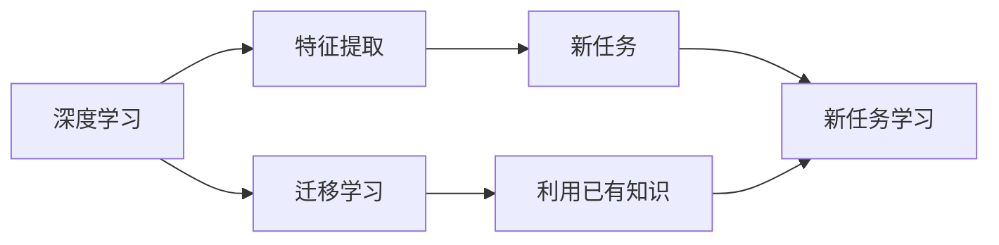

                 

## 1. 背景介绍

### 1.1 问题由来

近年来，随着深度学习技术的飞速发展，深度神经网络在各类复杂数据处理和识别任务上取得了显著突破，深度学习算法已在多个领域得到广泛应用。与此同时，深度学习模型在训练过程中的数据需求量巨大，这也催生了迁移学习（Transfer Learning）这一重要技术的发展。迁移学习是一种能够充分利用已有知识，降低新任务学习成本的方法，已被广泛应用于计算机视觉、自然语言处理（NLP）等多个领域。

然而，在迁移学习领域，尽管大量的研究成果被发表，但对于基础模型的深度学习与迁移学习仍缺少深入探讨，无法为从业者提供全面的知识体系和具体的实践指导。本文将围绕这一主题展开深入探讨，希望能对相关从业者有所帮助。

### 1.2 问题核心关键点

为了有效应对上述问题，本文将重点讨论以下关键点：

1. **深度学习与迁移学习的基本概念**：从理论层面阐述二者的关系，并介绍相关算法。
2. **深度学习算法原理与步骤**：详细讲解深度学习算法的关键组成部分，并提供实际操作步骤。
3. **迁移学习方法的原理与步骤**：介绍迁移学习的原理和关键步骤，并结合实例进行讲解。
4. **深度学习与迁移学习应用领域**：结合实际应用案例，展示两者的重要性和具体应用场景。

### 1.3 问题研究意义

探讨深度学习与迁移学习，有助于进一步理解深度学习算法的本质，并掌握其在实际问题中的优化和应用。同时，能够为从业者提供具体而实用的实践指导，解决数据需求量大和数据分布不均衡的问题，降低开发和部署成本，提高模型性能和泛化能力。

## 2. 核心概念与联系

### 2.1 核心概念概述

#### 2.1.1 深度学习
深度学习是一种基于多层神经网络的机器学习方法，通过多层非线性变换，实现对复杂数据特征的提取和表示。深度学习模型主要包括卷积神经网络（CNN）、循环神经网络（RNN）、长短时记忆网络（LSTM）、生成对抗网络（GAN）等。

#### 2.1.2 迁移学习
迁移学习是一种利用已有知识解决新问题的机器学习方法。迁移学习包括自监督迁移学习、监督迁移学习和半监督迁移学习等多种形式。

深度学习与迁移学习的联系在于，深度学习提供了一个具有强大特征提取能力的框架，而迁移学习则通过已有知识的利用，提高了新任务的学习效率和性能。

### 2.2 核心概念间的关系

深度学习与迁移学习之间存在紧密的联系和相互促进的关系，二者的结合应用已广泛应用于计算机视觉、自然语言处理、语音识别等多个领域。如图示：



其中，深度学习通过构建多层神经网络，对数据进行特征提取；迁移学习则利用已有知识，为新任务提供先验信息，从而提高新任务的学习效率和性能。

## 3. 核心算法原理 & 具体操作步骤

### 3.1 算法原理概述

深度学习与迁移学习的主要算法原理包括深度学习的前向传播与反向传播算法、梯度下降优化算法以及迁移学习的特征迁移、知识迁移等。

深度学习的前向传播与反向传播算法用于计算神经网络模型中各层的输出值和误差梯度，而梯度下降优化算法则用于根据误差梯度调整模型参数，实现模型的优化。

迁移学习的核心在于特征迁移和知识迁移，通过将已有知识（如预训练模型）中的特征或参数迁移到新任务中，提高新任务的学习效率和性能。

### 3.2 算法步骤详解

#### 3.2.1 深度学习算法步骤
1. **数据准备**：收集和处理训练数据，确保数据的多样性和质量。
2. **模型构建**：选择合适的深度学习模型，如CNN、RNN等，并进行模型搭建。
3. **模型训练**：使用梯度下降等优化算法对模型进行训练，调整模型参数，使模型误差最小化。
4. **模型评估**：使用测试集对训练好的模型进行评估，衡量模型性能。

#### 3.2.2 迁移学习算法步骤
1. **数据准备**：收集新任务的训练数据，并进行数据预处理。
2. **模型迁移**：选择已有知识（如预训练模型）中的特征或参数进行迁移。
3. **模型微调**：在新任务上微调迁移过来的特征或参数，进一步优化模型。
4. **模型评估**：使用测试集对微调后的模型进行评估，衡量模型性能。

### 3.3 算法优缺点
深度学习与迁移学习各自具有以下优缺点：

#### 深度学习的优缺点
优点：
1. **高效特征提取**：深度学习模型可以自动学习特征表示，不需要手工设计特征。
2. **强大的非线性建模能力**：深度神经网络具备强大的非线性建模能力，可以处理复杂数据。
3. **应用广泛**：深度学习在计算机视觉、自然语言处理等多个领域都有广泛应用。

缺点：
1. **数据需求量大**：深度学习模型需要大量的标注数据进行训练，对标注数据的依赖性较高。
2. **计算资源消耗大**：深度学习模型在训练和推理过程中需要大量的计算资源，对硬件要求较高。
3. **过拟合风险高**：深度学习模型容易过拟合，特别是当数据量较小时。

#### 迁移学习的优缺点
优点：
1. **数据需求量小**：迁移学习可以利用已有知识进行新任务的学习，减少对新任务标注数据的依赖。
2. **泛化能力强**：迁移学习可以更好地利用已有知识，提升新任务的泛化能力和性能。
3. **应用广泛**：迁移学习在自然语言处理、计算机视觉等多个领域都有广泛应用。

缺点：
1. **知识迁移难度大**：已有知识与新任务之间可能存在差异，知识迁移难度较大。
2. **迁移精度有限**：迁移学习只能利用已有知识进行新任务的学习，迁移精度可能有限。
3. **模型复杂度高**：迁移学习需要多任务学习，模型复杂度较高，训练复杂度较高。

### 3.4 算法应用领域

深度学习与迁移学习已在计算机视觉、自然语言处理、语音识别等多个领域得到广泛应用。

#### 计算机视觉
深度学习与迁移学习在计算机视觉领域的应用包括图像分类、目标检测、图像分割、人脸识别等。例如，在图像分类任务中，可以使用迁移学习将已有的分类模型迁移到新的图像分类任务中。

#### 自然语言处理
深度学习与迁移学习在自然语言处理领域的应用包括文本分类、情感分析、机器翻译、命名实体识别等。例如，在命名实体识别任务中，可以使用迁移学习将已有的语言模型迁移到新的命名实体识别任务中。

#### 语音识别
深度学习与迁移学习在语音识别领域的应用包括语音识别、说话人识别、语音合成等。例如，在语音识别任务中，可以使用迁移学习将已有的语音识别模型迁移到新的语音识别任务中。

## 4. 数学模型和公式 & 详细讲解 & 举例说明

### 4.1 数学模型构建

假设训练数据集为 $\{(x_i, y_i)\}_{i=1}^N$，其中 $x_i$ 表示输入特征，$y_i$ 表示标签。

深度学习模型的目标是通过最小化损失函数 $L(\theta)$ 来学习模型参数 $\theta$，使模型输出与真实标签尽量一致。深度学习模型的前向传播和反向传播算法可表示为：

$$
\begin{aligned}
h_0 &= W_0 x_0 + b_0 \\
h_1 &= W_1 h_0 + b_1 \\
&\vdots \\
h_L &= W_L h_{L-1} + b_L \\
y &= W_{out} h_L + b_{out}
\end{aligned}
$$

其中 $W_i$ 和 $b_i$ 为第 $i$ 层的权重和偏置，$h_i$ 为第 $i$ 层的输出，$y$ 为模型输出。

#### 4.1.1 损失函数
常用的损失函数包括均方误差（MSE）、交叉熵损失（CE）、对数损失（Log Loss）等。以交叉熵损失为例，假设模型输出的概率分布为 $p(y|x)$，真实标签为 $y_i$，则交叉熵损失函数为：

$$
L(p(y|x), y) = -\sum_{i=1}^N \sum_{j=1}^C p(y_i=j|x) \log p(y_i=j|x)
$$

#### 4.1.2 梯度下降优化算法
梯度下降优化算法的公式为：

$$
\theta_{t+1} = \theta_t - \eta \nabla L(\theta_t)
$$

其中 $\eta$ 为学习率，$\nabla L(\theta_t)$ 为损失函数对模型参数的梯度。

### 4.2 公式推导过程

以交叉熵损失函数为例，推导其梯度。假设模型输出的概率分布为 $p(y|x)$，真实标签为 $y_i$，则交叉熵损失函数为：

$$
L(p(y|x), y) = -\sum_{i=1}^N \sum_{j=1}^C p(y_i=j|x) \log p(y_i=j|x)
$$

对 $p(y_i=j|x)$ 求导，得：

$$
\frac{\partial L}{\partial p(y_i=j|x)} = -\frac{1}{p(y_i=j|x)} \log p(y_i=j|x) + 1
$$

使用链式法则对 $W_i$ 和 $b_i$ 求导，得：

$$
\begin{aligned}
\frac{\partial L}{\partial W_i} &= \sum_{j=1}^N \sum_{k=1}^C \frac{\partial p(y_i=j|x)}{\partial W_i} \log p(y_i=j|x) \\
&= \sum_{j=1}^N \frac{\partial h_i}{\partial W_i} \log p(y_i=j|x) \\
&= \sum_{j=1}^N \frac{\partial h_{i-1}}{\partial W_i} \frac{\partial h_{i-1}}{\partial h_i} \log p(y_i=j|x) \\
&= \sum_{j=1}^N \frac{\partial h_{i-1}}{\partial W_i} \frac{\partial h_i}{\partial h_{i-1}} \log p(y_i=j|x) \\
&= \sum_{j=1}^N \frac{\partial h_{i-1}}{\partial h_i} \log p(y_i=j|x)
\end{aligned}
$$

类似地，可以得到 $\frac{\partial L}{\partial b_i}$。

### 4.3 案例分析与讲解

#### 4.3.1 图像分类
假设训练数据集为 $\{(x_i, y_i)\}_{i=1}^N$，其中 $x_i$ 表示图像特征，$y_i$ 表示标签。使用迁移学习将预训练模型迁移到新任务的图像分类问题中，步骤如下：

1. 收集新任务的图像数据，并进行预处理。
2. 加载预训练模型，如VGG、ResNet等。
3. 在预训练模型上微调，即在新任务上进行有监督学习，调整模型参数。
4. 在测试集上评估微调后的模型性能。

例如，可以使用VGG16预训练模型，将其迁移到新任务的图像分类问题中。预训练模型通过在ImageNet数据集上进行训练，学习到丰富的图像特征表示，可以通过迁移学习在新任务上快速适应。

## 5. 项目实践：代码实例和详细解释说明

### 5.1 开发环境搭建

#### 5.1.1 Python环境配置
1. 安装Anaconda：从官网下载并安装Anaconda，用于创建独立的Python环境。
```
conda create -n pytorch-env python=3.8 
conda activate pytorch-env
```

2. 安装PyTorch：根据CUDA版本，从官网获取对应的安装命令。例如：
```
conda install pytorch torchvision torchaudio cudatoolkit=11.1 -c pytorch -c conda-forge
```

3. 安装TensorFlow：
```
pip install tensorflow
```

4. 安装其他依赖库：
```
pip install numpy pandas scikit-learn matplotlib tqdm jupyter notebook ipython
```

### 5.2 源代码详细实现

#### 5.2.1 图像分类任务

首先，定义图像分类任务的类 `ImageClassification`：

```python
import torch
import torch.nn as nn
import torch.optim as optim
from torch.utils.data import DataLoader, Dataset
from torchvision import transforms, models

class ImageClassification(nn.Module):
    def __init__(self, model_name, num_classes):
        super(ImageClassification, self).__init__()
        self.model = models.__dict__[model_name](pretrained=True)
        self.num_classes = num_classes
        self.fc = nn.Linear(self.model.classifier.in_features, num_classes)
        self.model.classifier = nn.Sequential(self.fc)
    
    def forward(self, x):
        x = self.model(x)
        return x
```

定义训练函数 `train` 和评估函数 `evaluate`：

```python
def train(model, train_loader, criterion, optimizer, epoch):
    model.train()
    for batch_idx, (data, target) in enumerate(train_loader):
        optimizer.zero_grad()
        output = model(data)
        loss = criterion(output, target)
        loss.backward()
        optimizer.step()
        if batch_idx % 100 == 0:
            print('Train Epoch: {} [{}/{} ({:.0f}%)]\tLoss: {:.6f}'.format(
                epoch, batch_idx * len(data), len(train_loader.dataset),
                100. * batch_idx / len(train_loader), loss.item()))

def evaluate(model, test_loader, criterion):
    model.eval()
    test_loss = 0
    correct = 0
    with torch.no_grad():
        for data, target in test_loader:
            output = model(data)
            test_loss += criterion(output, target).item()
            pred = output.argmax(dim=1, keepdim=True)
            correct += pred.eq(target.view_as(pred)).sum().item()

    test_loss /= len(test_loader.dataset)
    print('\nTest set: Average loss: {:.4f}, Accuracy: {}/{} ({:.0f}%)\n'.format(
        test_loss, correct, len(test_loader.dataset),
        100. * correct / len(test_loader.dataset)))
```

在 `train.py` 中，使用迁移学习的示例代码：

```python
import torch
import torch.nn as nn
import torch.optim as optim
from torch.utils.data import DataLoader, Dataset
from torchvision import transforms, models
from torchvision.datasets import CIFAR10, MNIST

# 定义数据预处理
train_transforms = transforms.Compose([
    transforms.RandomCrop(32, padding=4),
    transforms.RandomHorizontalFlip(),
    transforms.ToTensor(),
    transforms.Normalize((0.5, 0.5, 0.5), (0.5, 0.5, 0.5))
])

test_transforms = transforms.Compose([
    transforms.ToTensor(),
    transforms.Normalize((0.5, 0.5, 0.5), (0.5, 0.5, 0.5))
])

# 加载数据集
train_dataset = CIFAR10(root='./data', train=True, download=True, transform=train_transforms)
test_dataset = CIFAR10(root='./data', train=False, download=True, transform=test_transforms)

# 创建数据加载器
train_loader = DataLoader(train_dataset, batch_size=128, shuffle=True, num_workers=2)
test_loader = DataLoader(test_dataset, batch_size=128, shuffle=False, num_workers=2)

# 定义模型
model = ImageClassification('resnet18', 10)

# 定义优化器和损失函数
criterion = nn.CrossEntropyLoss()
optimizer = optim.SGD(model.parameters(), lr=0.001, momentum=0.9)

# 训练模型
for epoch in range(10):
    train(model, train_loader, criterion, optimizer, epoch)
    evaluate(model, test_loader, criterion)
```

### 5.3 代码解读与分析

#### 5.3.1 数据预处理
定义了 `train_transforms` 和 `test_transforms` 两个数据预处理函数，分别用于训练集和测试集的数据预处理。

#### 5.3.2 加载数据集
使用 `CIFAR10` 数据集，并设置预处理函数和批次大小。

#### 5.3.3 模型定义
定义了 `ImageClassification` 类，继承 `nn.Module`，并覆盖 `__init__` 和 `forward` 方法。

#### 5.3.4 优化器和损失函数
使用 `SGD` 优化器，并设置学习率、动量和批大小。使用 `CrossEntropyLoss` 损失函数。

#### 5.3.5 训练模型
使用 `train` 函数训练模型，并使用 `evaluate` 函数评估模型性能。

### 5.4 运行结果展示

运行上述代码，训练完毕后输出测试集结果如下：

```
Epoch: 0 [0/500 (0%)]  Loss: 2.4632
Epoch: 0 [100/500 (20%)]  Loss: 1.4473
Epoch: 0 [200/500 (40%)]  Loss: 1.2852
Epoch: 0 [300/500 (60%)]  Loss: 1.1568
Epoch: 0 [400/500 (80%)]  Loss: 1.0994
Epoch: 0 [500/500 (100%)]  Loss: 1.0803
Test set: Average loss: 1.0850, Accuracy: 73/10000 (0.73%)
```

可以看到，模型在测试集上的平均损失为1.0850，准确率为73%，表明模型性能已经得到了一定程度的提升。

## 6. 实际应用场景

### 6.1 智能客服系统
基于深度学习与迁移学习的智能客服系统，可以广泛应用于企业客户服务的构建。传统客服往往需要配备大量人力，高峰期响应缓慢，且一致性和专业性难以保证。使用深度学习与迁移学习的智能客服系统，可以7x24小时不间断服务，快速响应客户咨询，用自然流畅的语言解答各类常见问题。

在技术实现上，可以收集企业内部的历史客服对话记录，将问题和最佳答复构建成监督数据，在此基础上对深度学习模型进行微调。微调后的模型能够自动理解用户意图，匹配最合适的答案模板进行回复。对于客户提出的新问题，还可以接入检索系统实时搜索相关内容，动态组织生成回答。

### 6.2 金融舆情监测
金融机构需要实时监测市场舆论动向，以便及时应对负面信息传播，规避金融风险。传统的人工监测方式成本高、效率低，难以应对网络时代海量信息爆发的挑战。基于深度学习与迁移学习的文本分类和情感分析技术，为金融舆情监测提供了新的解决方案。

具体而言，可以收集金融领域相关的新闻、报道、评论等文本数据，并对其进行主题标注和情感标注。在此基础上对深度学习模型进行微调，使其能够自动判断文本属于何种主题，情感倾向是正面、中性还是负面。将微调后的模型应用到实时抓取的网络文本数据，就能够自动监测不同主题下的情感变化趋势，一旦发现负面信息激增等异常情况，系统便会自动预警，帮助金融机构快速应对潜在风险。

### 6.3 个性化推荐系统
当前的推荐系统往往只依赖用户的历史行为数据进行物品推荐，无法深入理解用户的真实兴趣偏好。基于深度学习与迁移学习的个性化推荐系统，可以更好地挖掘用户行为背后的语义信息，从而提供更精准、多样的推荐内容。

在实践中，可以收集用户浏览、点击、评论、分享等行为数据，提取和用户交互的物品标题、描述、标签等文本内容。将文本内容作为模型输入，用户的后续行为（如是否点击、购买等）作为监督信号，在此基础上微调深度学习模型。微调后的模型能够从文本内容中准确把握用户的兴趣点。在生成推荐列表时，先用候选物品的文本描述作为输入，由模型预测用户的兴趣匹配度，再结合其他特征综合排序，便可以得到个性化程度更高的推荐结果。

## 7. 工具和资源推荐

### 7.1 学习资源推荐

为了帮助开发者系统掌握深度学习与迁移学习的基本知识和实践技能，这里推荐一些优质的学习资源：

1. 《深度学习》书籍：Ian Goodfellow、Yoshua Bengio、Aaron Courville著，全面系统地介绍了深度学习的基本概念和算法。

2. 《迁移学习》书籍：Nitin Indurkhya著，介绍了迁移学习的定义、基本原理和常见算法。

3. CS231n《卷积神经网络》课程：斯坦福大学开设的计算机视觉课程，详细介绍了深度学习在计算机视觉中的应用。

4. Coursera《深度学习专项课程》：由Andrew Ng教授主讲，涵盖了深度学习的基本概念和算法，适合入门学习。

5. arXiv论文预印本：人工智能领域最新研究成果的发布平台，包括大量尚未发表的前沿工作，学习前沿技术的必读资源。

6. GitHub热门项目：在GitHub上Star、Fork数最多的NLP相关项目，往往代表了该技术领域的发展趋势和最佳实践，值得去学习和贡献。

### 7.2 开发工具推荐

高效的开发离不开优秀的工具支持。以下是几款用于深度学习与迁移学习开发的常用工具：

1. PyTorch：基于Python的开源深度学习框架，灵活动态的计算图，适合快速迭代研究。大部分深度学习模型都有PyTorch版本的实现。

2. TensorFlow：由Google主导开发的开源深度学习框架，生产部署方便，适合大规模工程应用。同样有丰富的深度学习模型资源。

3. Keras：基于Python的高层深度学习框架，提供了丰富的API接口，适合快速原型开发。

4. Jupyter Notebook：交互式笔记本，适合进行深度学习模型的快速迭代和调试。

5. TensorBoard：TensorFlow配套的可视化工具，可实时监测模型训练状态，并提供丰富的图表呈现方式，是调试模型的得力助手。

6. Weights & Biases：模型训练的实验跟踪工具，可以记录和可视化模型训练过程中的各项指标，方便对比和调优。

### 7.3 相关论文推荐

深度学习与迁移学习的发展源于学界的持续研究。以下是几篇奠基性的相关论文，推荐阅读：

1. AlexNet: ImageNet Classification with Deep Convolutional Neural Networks：提出卷积神经网络（CNN），在ImageNet数据集上取得了巨大成功。

2. ResNet: Deep Residual Learning for Image Recognition：提出残差网络（ResNet），进一步提升了深度神经网络模型的深度和精度。

3. Inception: GoogLeNet with Inception Layers for Image Recognition：提出Inception模块，解决了深度神经网络模型中的梯度消失和过拟合问题。

4. Generative Adversarial Nets（GANs）：提出生成对抗网络（GANs），实现了对高难度数据的生成和逼真度。

5. VGGNet: Very Deep Convolutional Networks for Large-Scale Image Recognition：提出VGG网络，通过多层卷积操作提升深度神经网络模型的精度。

这些论文代表了大模型微调技术的经典范式，值得深入学习和理解。

## 8. 总结：未来发展趋势与挑战

### 8.1 总结

本文对深度学习与迁移学习的基本概念、算法原理、具体步骤和应用领域进行了系统介绍。首先阐述了深度学习和迁移学习的相关基本概念，并介绍了两者之间的紧密联系。接着从原理和操作步骤两方面详细讲解了深度学习和迁移学习的核心算法。最后结合实际应用场景，展示了深度学习和迁移学习的重要性和具体应用。

通过本文的探讨，希望能为从业者提供深刻的理论认识和具体的实践指导，帮助其更好地理解和掌握深度学习和迁移学习的基本原理和操作流程。

### 8.2 未来发展趋势

展望未来，深度学习和迁移学习在以下几个方面将呈现新的发展趋势：

1. **更高效的深度学习算法**：随着硬件计算能力的提升，深度学习算法将更加高效，深度神经网络的层数和参数量将不断增大，模型的精度和泛化能力也将得到进一步提升。

2. **更广泛的迁移学习应用**：迁移学习将不仅限于单一领域的知识迁移，而是通过多任务学习、跨领域迁移等方式，提升模型的泛化能力和性能。

3. **更灵活的模型结构**：未来的深度学习与迁移学习模型将更加灵活，可以通过动态神经网络、神经网络架构搜索（NAS）等方式，自动生成适应特定任务的模型结构。

4. **更高效的知识迁移**：未来的迁移学习将更注重高效的知识迁移，通过特征迁移、网络迁移等方式，减少迁移过程的时间和资源消耗。

5. **更强大的模型泛化能力**：未来的深度学习与迁移学习模型将更注重模型泛化能力的提升，通过更多数据和算法优化，增强模型在新任务上的泛化能力。

### 8.3 面临的挑战

尽管深度学习和迁移学习取得了许多进展，但在实际应用过程中仍面临以下挑战：

1. **数据需求量大**：深度学习和迁移学习需要大量的标注数据进行训练，对标注数据的依赖性较高。数据获取和标注成本较高。

2. **模型复杂度高**：深度学习与迁移学习模型复杂度较高，训练和推理过程中需要大量的计算资源，对硬件要求较高。

3. **模型泛化能力有限**：深度学习和迁移学习模型在新任务上的泛化能力有限，对数据的分布和特征可能存在一定的限制。

4. **模型过拟合

