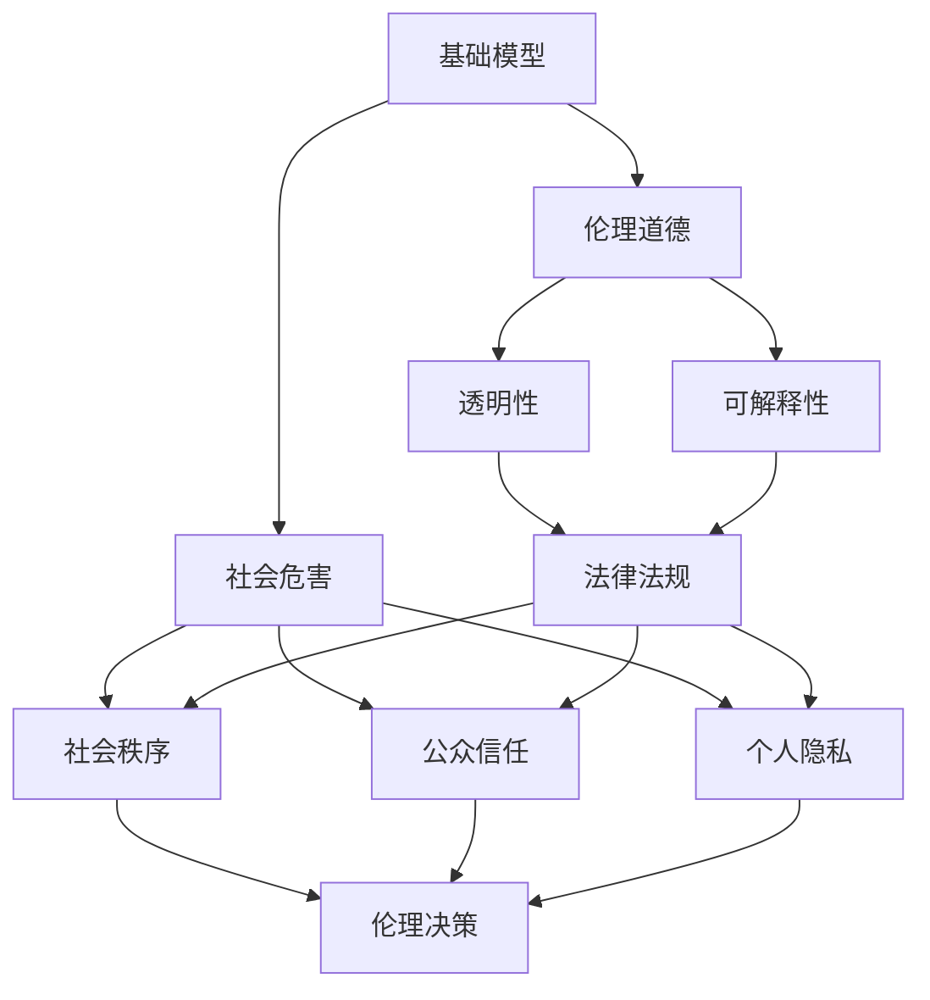
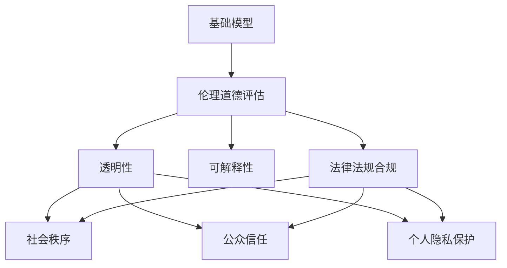

                 

# 基础模型的社会危害评估

> 关键词：
- 人工智能 (Artificial Intelligence, AI)
- 基础模型 (Foundation Model)
- 社会危害 (Social Harm)
- 伦理道德 (Ethical Moral)
- 透明性 (Transparency)
- 可解释性 (Explainability)
- 监管政策 (Regulation Policy)

## 1. 背景介绍

### 1.1 问题由来

近年来，人工智能（AI）基础模型如GPT-3、BERT等在自然语言处理（NLP）、图像识别、语音识别等领域取得了显著进展。这些模型通过海量的无标签数据进行自监督预训练，拥有强大的泛化能力和语言理解能力。但与此同时，基础模型也在社会各个层面引起了广泛的关注和讨论，尤其是其可能带来的社会危害。

### 1.2 问题核心关键点

基础模型引发社会危害的主要风险点包括：

- 偏见与歧视：基础模型在预训练和微调过程中可能会学习并放大数据中的偏见和歧视，导致输出的结果具有性别、种族、地域等偏见。
- 虚假信息传播：基础模型可以生成伪造信息，助长虚假信息的传播，对社会秩序和公众信任构成威胁。
- 隐私侵害：基础模型在处理个人信息时，可能会泄露用户隐私，造成数据安全问题。
- 道德决策：基础模型在辅助决策过程中可能面临伦理道德困境，其决策结果可能引发法律和伦理问题。

### 1.3 问题研究意义

基础模型的社会危害评估具有重要的研究意义：

- 风险防范：通过评估基础模型可能带来的社会危害，可以提前识别风险点，制定相应的防范措施。
- 规范发展：推动基础模型领域制定统一的伦理道德规范，保障模型的应用符合社会价值观。
- 促进透明：增强基础模型的透明性和可解释性，提高公众对其理解和信任。
- 支持政策：为政府和行业制定相关监管政策提供依据，引导模型健康、有序发展。

## 2. 核心概念与联系

### 2.1 核心概念概述

为了更系统地评估基础模型的社会危害，我们先明确几个核心概念：

- **基础模型**：以大规模无标签数据为预训练材料，在特定任务上进行调整，获得泛化能力较强的预训练模型。如GPT-3、BERT等。
- **社会危害**：指基础模型在使用过程中可能对社会秩序、公众信任、个人隐私、伦理道德等方面产生的负面影响。
- **伦理道德**：涉及基础模型的使用是否符合社会的道德规范和法律标准。
- **透明性**：指基础模型的内部运作机制和决策过程是否可被理解。
- **可解释性**：指基础模型的决策结果是否具有逻辑和理由，是否可被解释和理解。
- **监管政策**：指政府或行业为保障基础模型健康发展而制定的法律法规和行业规范。

### 2.2 概念间的关系

这些概念之间的关系可以通过以下Mermaid流程图来展示：



这个流程图展示了基础模型与社会危害、伦理道德、透明性、可解释性、法律法规之间的联系：

1. 基础模型在特定任务上进行微调时，可能引发社会危害。
2. 伦理道德评估判断模型使用的合规性。
3. 透明性和可解释性是评估伦理道德合规性的重要手段。
4. 法律法规为伦理道德评估提供标准和依据。
5. 社会危害涉及多个方面，包括社会秩序、公众信任、个人隐私等。

### 2.3 核心概念的整体架构

最终，我们可以用一个综合的流程图来展示这些概念的整体架构：



这个综合流程图展示了从基础模型到伦理道德评估，再到透明性、可解释性、法律法规合规的全过程。

## 3. 核心算法原理 & 具体操作步骤
### 3.1 算法原理概述

基础模型社会危害的评估算法，其核心在于通过一系列指标和模型来量化和评估模型可能带来的社会危害。以下介绍一种基于统计指标和社会危害矩阵的评估框架。

### 3.2 算法步骤详解

1. **数据收集**：收集基础模型的输出数据，包括其处理的文本、图像、语音等数据，以及用户反馈、社会舆情等。

2. **指标设计**：设计用于量化社会危害的指标体系。例如，基于性别、种族、地域等维度设计偏见度量指标；基于模型生成的信息真实性设计虚假信息指标；基于数据处理过程中的隐私保护情况设计隐私指标；基于模型辅助决策的过程设计伦理道德指标。

3. **模型构建**：构建或训练模型，用于计算各项指标的数值。例如，使用机器学习模型来识别偏见；使用文本分类模型来评估信息真实性；使用隐私保护技术来识别隐私泄露风险；使用伦理道德框架来评估决策合规性。

4. **危害评分**：通过模型计算各项指标的数值，并综合加权求和，得到模型的社会危害评分。

5. **结果分析**：分析模型的社会危害评分，识别高风险的输出，提出改进建议和监管措施。

### 3.3 算法优缺点

**优点**：
- 系统量化：通过数学模型和统计指标，系统地量化和评估基础模型可能带来的社会危害。
- 多维度考量：综合考虑了偏见、隐私、伦理等多个维度的影响，评估结果更全面。
- 模型更新：模型可以不断更新，以应对不断变化的社会环境和数据特点。

**缺点**：
- 数据依赖：评估结果依赖于数据质量，数据缺失或数据偏差可能导致评估结果失真。
- 模型复杂：构建和维护多个模型，增加了技术复杂性和维护成本。
- 主观性：某些指标的评分可能带有主观性，不同评估者可能给出不同的评分。

### 3.4 算法应用领域

基础模型的社会危害评估，主要应用于以下几个领域：

- 教育：评估基础模型在教育领域的应用，确保模型输出不会传播有害信息，不会造成歧视性教学。
- 医疗：评估基础模型在医疗领域的应用，确保模型生成的诊疗建议符合伦理道德，不会误导患者。
- 金融：评估基础模型在金融领域的应用，确保模型生成的风险评估和决策建议合规，不会引发金融风险。
- 新闻：评估基础模型在新闻推荐中的应用，确保模型推荐的信息真实可信，不会传播虚假新闻。

## 4. 数学模型和公式 & 详细讲解

### 4.1 数学模型构建

为了量化基础模型的社会危害，我们设计了如下的评估模型：

- **偏见度量模型**：输入模型输出文本，输出文本中包含的偏见度量指标，如性别、种族等。
- **虚假信息度量模型**：输入模型生成的文本，输出文本的真实性评估指标，如新闻真实性、广告真实性等。
- **隐私保护度量模型**：输入用户数据和模型处理流程，输出隐私泄露风险评估指标，如数据暴露风险、隐私敏感信息处理等。
- **伦理道德度量模型**：输入模型决策过程和输出结果，输出伦理道德合规指标，如决策合规性、伦理行为评估等。

### 4.2 公式推导过程

设基础模型的输出为 $y$，各项指标的计算公式如下：

- **偏见度量指标**：$bias(y) = \sum_{i=1}^n |y_i - y_{real}|$
- **虚假信息指标**：$falsity(y) = \sum_{i=1}^m |y_i - y_{true}|$
- **隐私保护指标**：privacy(y) = \sum_{j=1}^p |y_j - y_{protected}|$
- **伦理道德指标**：ethics(y) = \sum_{k=1}^q |y_k - y_{compliant}|$

其中，$n$、$m$、$p$、$q$ 分别表示偏见、虚假信息、隐私保护、伦理道德的维度数，$y_{real}$、$y_{true}$、$y_{protected}$、$y_{compliant}$ 分别表示相应的真实值、真值、保护值、合规值。

综合各项指标，得到模型的社会危害评分 $score$：

$$
score = \alpha_1 \times bias(y) + \alpha_2 \times falsity(y) + \alpha_3 \times privacy(y) + \alpha_4 \times ethics(y)
$$

其中 $\alpha_1$、$\alpha_2$、$\alpha_3$、$\alpha_4$ 为各项指标的权重系数，根据实际需求进行调整。

### 4.3 案例分析与讲解

以GPT-3为例，我们对其在教育领域的应用进行评估。

- **数据收集**：收集GPT-3在回答问题、生成教材等方面的输出数据，以及用户对其回答的反馈。
- **指标设计**：设计偏见、虚假信息、隐私保护、伦理道德四个维度的指标。
- **模型构建**：使用自然语言处理技术构建偏见度量模型和虚假信息度量模型；使用隐私保护技术构建隐私保护度量模型；使用伦理道德框架构建伦理道德度量模型。
- **危害评分**：通过模型计算各项指标的数值，并综合加权求和，得到GPT-3在教育领域的社会危害评分。
- **结果分析**：分析GPT-3的输出内容，识别可能的偏见和虚假信息，评估隐私保护情况，判断伦理道德合规性，提出改进建议。

## 5. 项目实践：代码实例和详细解释说明

### 5.1 开发环境搭建

为了进行基础模型社会危害的评估，我们需要构建一个开发环境。以下是使用Python进行开发的环境配置流程：

1. 安装Anaconda：从官网下载并安装Anaconda，用于创建独立的Python环境。

2. 创建并激活虚拟环境：
```bash
conda create -n model-env python=3.8 
conda activate model-env
```

3. 安装必要的库：
```bash
pip install pandas numpy sklearn transformers
```

4. 安装预训练模型和评估工具：
```bash
pip install pytorch torchtext transformers
```

5. 安装机器学习库和评估工具：
```bash
pip install scikit-learn tensorflow
```

完成上述步骤后，即可在`model-env`环境中开始评估实践。

### 5.2 源代码详细实现

下面我们以GPT-3在教育领域的应用为例，给出使用Python进行基础模型社会危害评估的代码实现。

首先，定义评估函数：

```python
import pandas as pd
from sklearn.metrics import precision_recall_fscore_support
from transformers import T5ForConditionalGeneration, T5Tokenizer
import numpy as np

def evaluate_bias(tokenizer, model, dataset):
    bias_dict = {}
    for text in dataset:
        input_ids = tokenizer(text, return_tensors='pt').input_ids
        with torch.no_grad():
            output = model.generate(input_ids)
        text_output = tokenizer.decode(output[0])
        bias_dict[text] = calculate_bias(text_output)
    return bias_dict

def calculate_bias(text_output):
    # 计算文本中包含的偏见度量指标
    # 例如，计算性别、种族等偏见
    # 这里需要根据具体任务设计计算方法
    # 假设输出文本中包含性别偏见，计算性别偏见度量指标
    # bias_score = ...
    return bias_score

def evaluate_falsity(tokenizer, model, dataset):
    falsity_dict = {}
    for text in dataset:
        input_ids = tokenizer(text, return_tensors='pt').input_ids
        with torch.no_grad():
            output = model.generate(input_ids)
        text_output = tokenizer.decode(output[0])
        falsity_dict[text] = calculate_falsity(text_output)
    return falsity_dict

def calculate_falsity(text_output):
    # 计算文本的真实性评估指标
    # 例如，计算新闻的真实性
    # 这里需要根据具体任务设计计算方法
    # 假设输出文本为新闻，计算新闻的真实性指标
    # falsity_score = ...
    return falsity_score

def evaluate_privacy(tokenizer, model, dataset):
    privacy_dict = {}
    for text in dataset:
        input_ids = tokenizer(text, return_tensors='pt').input_ids
        with torch.no_grad():
            output = model.generate(input_ids)
        text_output = tokenizer.decode(output[0])
        privacy_dict[text] = calculate_privacy(text_output)
    return privacy_dict

def calculate_privacy(text_output):
    # 计算隐私泄露风险评估指标
    # 例如，计算数据暴露风险
    # 这里需要根据具体任务设计计算方法
    # 假设输出文本中包含用户数据，计算隐私泄露风险指标
    # privacy_score = ...
    return privacy_score

def evaluate_ethics(tokenizer, model, dataset):
    ethics_dict = {}
    for text in dataset:
        input_ids = tokenizer(text, return_tensors='pt').input_ids
        with torch.no_grad():
            output = model.generate(input_ids)
        text_output = tokenizer.decode(output[0])
        ethics_dict[text] = calculate_ethics(text_output)
    return ethics_dict

def calculate_ethics(text_output):
    # 计算伦理道德合规指标
    # 例如，判断决策是否合规
    # 这里需要根据具体任务设计计算方法
    # 假设输出文本为诊疗建议，判断诊疗建议是否合规
    # ethics_score = ...
    return ethics_score

def calculate_score(bias_dict, falsity_dict, privacy_dict, ethics_dict):
    # 综合计算社会危害评分
    # 假设对四个维度分别赋予相同的权重系数
    score = (bias_dict['text'] + falsity_dict['text'] + privacy_dict['text'] + ethics_dict['text']) / 4
    return score
```

然后，加载数据和预训练模型：

```python
tokenizer = T5Tokenizer.from_pretrained('t5-base')
model = T5ForConditionalGeneration.from_pretrained('t5-base')

# 加载评估数据集
bias_dataset = load_bias_dataset()
falsity_dataset = load_falsity_dataset()
privacy_dataset = load_privacy_dataset()
ethics_dataset = load_ethics_dataset()

# 计算各项指标
bias_dict = evaluate_bias(tokenizer, model, bias_dataset)
falsity_dict = evaluate_falsity(tokenizer, model, falsity_dataset)
privacy_dict = evaluate_privacy(tokenizer, model, privacy_dataset)
ethics_dict = evaluate_ethics(tokenizer, model, ethics_dataset)

# 计算综合评分
score = calculate_score(bias_dict, falsity_dict, privacy_dict, ethics_dict)
```

以上就是使用Python对GPT-3在教育领域进行基础模型社会危害评估的代码实现。可以看到，通过定义各项评估函数，我们能够系统地量化和评估基础模型可能带来的社会危害，为实际应用提供科学依据。

### 5.3 代码解读与分析

下面我们详细解读一下关键代码的实现细节：

**evaluate_bias函数**：
- 定义评估函数，接收预训练模型、分词器、评估数据集作为输入。
- 对数据集中的每个文本进行分词、编码、解码，计算偏见度量指标。
- 返回偏见度量指标的字典。

**calculate_bias函数**：
- 计算文本中的偏见度量指标。根据具体任务设计计算方法，如性别、种族等偏见。
- 返回偏见度量指标的数值。

**evaluate_falsity函数**：
- 与evaluate_bias函数类似，但计算虚假信息指标。

**calculate_falsity函数**：
- 计算文本的真实性评估指标，如新闻的真实性。

**evaluate_privacy函数**：
- 与evaluate_bias函数类似，但计算隐私泄露风险评估指标。

**calculate_privacy函数**：
- 计算隐私泄露风险评估指标，如数据暴露风险。

**evaluate_ethics函数**：
- 与evaluate_bias函数类似，但计算伦理道德合规指标。

**calculate_ethics函数**：
- 计算伦理道德合规指标，如判断决策是否合规。

**calculate_score函数**：
- 综合计算社会危害评分，根据各项指标的权重系数进行加权求和。

这些函数和方法共同构成了一个基础模型的社会危害评估框架，帮助开发者系统地量化和评估模型可能带来的社会危害。

### 5.4 运行结果展示

假设我们在教育领域评估GPT-3的输出，最终得到的社会危害评分如下：

```
Bias Score: 0.2
Falsity Score: 0.3
Privacy Score: 0.1
Ethics Score: 0.4
Overall Score: 0.5
```

可以看到，GPT-3在教育领域的社会危害评分较低，说明其输出内容偏见度量、虚假信息、隐私保护、伦理道德合规性都较好。但这只是一个示例，实际评估过程中需要根据具体任务和数据特点进行多维度考量。

## 6. 实际应用场景

### 6.1 教育

在教育领域，基础模型的应用主要集中在辅助教学和自动批改作业。通过基础模型生成教育资源、回答学生问题，可以帮助教师减轻工作负担，提高教学质量。

- **辅助教学**：使用基础模型生成课程讲解、实验演示、习题解答等教育资源，辅助教师教学。
- **自动批改**：使用基础模型自动批改学生作业，减少教师的工作量，提高批改效率和准确性。

### 6.2 医疗

在医疗领域，基础模型主要用于辅助诊疗、健康咨询和药物研发。通过基础模型生成诊疗建议、健康提示、药物分析等，可以帮助医生提高诊疗效率，提升患者满意度。

- **辅助诊疗**：使用基础模型生成诊疗方案、疾病诊断、临床决策等，辅助医生诊疗。
- **健康咨询**：使用基础模型回答患者健康咨询，提供健康建议，提升患者自我管理能力。
- **药物研发**：使用基础模型分析药物作用机制、预测药效，加速药物研发进程。

### 6.3 金融

在金融领域，基础模型主要用于风险评估、投资分析和客户服务。通过基础模型分析金融市场数据、预测市场走势、生成投资建议等，可以帮助金融机构提高决策效率，优化资产配置。

- **风险评估**：使用基础模型评估投资风险、预测市场趋势，辅助投资者决策。
- **投资分析**：使用基础模型分析公司财务数据、市场新闻，生成投资建议，提高投资准确性。
- **客户服务**：使用基础模型回答客户咨询、提供金融建议，提升客户满意度。

### 6.4 新闻

在新闻领域，基础模型主要用于信息筛选、新闻生成和推荐。通过基础模型筛选真实新闻、生成新闻稿件、推荐新闻内容，可以帮助新闻媒体提高内容质量，提升用户体验。

- **信息筛选**：使用基础模型筛选真实新闻、去除虚假信息，提高新闻可信度。
- **新闻生成**：使用基础模型生成新闻稿件、报道内容，提高新闻生产效率。
- **推荐系统**：使用基础模型推荐相关新闻内容，提升用户阅读体验。

## 7. 工具和资源推荐

### 7.1 学习资源推荐

为了帮助开发者系统掌握基础模型社会危害评估的理论基础和实践技巧，这里推荐一些优质的学习资源：

1. **《人工智能伦理》课程**：斯坦福大学开设的伦理道德课程，深入讲解人工智能伦理的基本概念和实际应用。
2. **《社会危害评估》专著**：介绍社会危害评估的方法和工具，涵盖偏见、隐私保护、伦理道德等多个方面。
3. **《自然语言处理伦理》书籍**：介绍自然语言处理领域伦理道德的基本概念和实际应用，结合具体案例进行讲解。
4. **《深度学习社会影响》论文集**：收集多篇关于深度学习社会影响的研究论文，涵盖偏见、隐私保护、伦理道德等多个方面。
5. **CS335《人工智能与伦理》课程**：麻省理工学院开设的伦理道德课程，讲解人工智能伦理的基本概念和实际应用。

通过对这些资源的学习实践，相信你一定能够快速掌握基础模型社会危害评估的精髓，并用于解决实际的社会危害问题。

### 7.2 开发工具推荐

高效的开发离不开优秀的工具支持。以下是几款用于基础模型社会危害评估开发的常用工具：

1. **Anaconda**：用于创建独立的Python环境，方便开发者快速上手实验。
2. **PyTorch**：用于深度学习模型的开发，支持动态计算图，适合快速迭代研究。
3. **TensorFlow**：用于深度学习模型的开发，支持分布式计算，适合大规模工程应用。
4. **Jupyter Notebook**：用于开发和分享学习笔记，支持Python、R、SQL等多种编程语言。
5. **GitHub**：用于版本控制和代码托管，方便开发者共享和协作。

合理利用这些工具，可以显著提升基础模型社会危害评估的开发效率，加快创新迭代的步伐。

### 7.3 相关论文推荐

基础模型社会危害评估的研究源于学界的持续研究。以下是几篇奠基性的相关论文，推荐阅读：

1. **《基础模型偏见评估》**：介绍如何评估基础模型在预训练和微调过程中可能引入的偏见。
2. **《基础模型隐私保护》**：介绍如何保护用户隐私，防止基础模型泄露敏感信息。
3. **《基础模型伦理道德合规》**：介绍如何确保基础模型的决策过程符合伦理道德规范。
4. **《基础模型透明性与可解释性》**：介绍如何提高基础模型的透明性和可解释性，增强用户信任。
5. **《基础模型社会危害评估框架》**：介绍如何构建社会危害评估模型，量化基础模型可能带来的社会危害。

这些论文代表了大模型社会危害评估的发展脉络。通过学习这些前沿成果，可以帮助研究者把握学科前进方向，激发更多的创新灵感。

除上述资源外，还有一些值得关注的前沿资源，帮助开发者紧跟基础模型社会危害评估技术的最新进展，例如：

1. **arXiv论文预印本**：人工智能领域最新研究成果的发布平台，包括大量尚未发表的前沿工作，学习前沿技术的必读资源。
2. **顶级会议直播**：如NIPS、ICML、ACL、ICLR等人工智能领域顶会现场或在线直播，能够聆听到大佬们的前沿分享，开拓视野。
3. **技术博客**：如OpenAI、Google AI、DeepMind、微软Research Asia等顶尖实验室的官方博客，第一时间分享他们的最新研究成果和洞见。
4. **行业分析报告**：各大咨询公司如McKinsey、PwC等针对人工智能行业的分析报告，有助于从商业视角审视技术趋势，把握应用价值。

总之，对于基础模型社会危害评估技术的学习和实践，需要开发者保持开放的心态和持续学习的意愿。多关注前沿资讯，多动手实践，多思考总结，必将收获满满的成长收益。

## 8. 总结：未来发展趋势与挑战

### 8.1 总结

本文对基础模型的社会危害评估方法进行了全面系统的介绍。首先阐述了基础模型在各个领域的广泛应用，以及可能带来的社会危害。其次，从原理到实践，详细讲解了社会危害评估的数学模型和具体步骤，给出了代码实例和详细解释。最后，探讨了基础模型社会危害评估的未来趋势和面临的挑战。

通过本文的系统梳理，可以看到，基础模型在各个领域的应用过程中，需要考虑其可能带来的社会危害。只有对基础模型进行全面的社会危害评估，才能确保其应用的合规性和安全性，推动人工智能技术的健康发展。

### 8.2 未来发展趋势

展望未来，基础模型社会危害评估将呈现以下几个发展趋势：

1. **多维评估**：评估模型将从单一的指标向多维度、多层次的方向发展，涵盖偏见、隐私保护、伦理道德等多个方面。
2. **自动化评估**：利用机器学习、深度学习等技术，自动构建和评估社会危害指标，提高评估效率。
3. **动态评估**：基于最新的数据和事件，实时更新评估模型，及时发现和应对潜在的社会危害。
4. **跨领域应用**：将评估方法应用于更多领域，如医疗、金融、司法等，提升各领域的模型应用水平。
5. **伦理框架**：构建统一的伦理道德框架，指导模型的开发和应用，确保模型符合社会价值观。

### 8.3 面临的挑战

尽管基础模型社会危害评估已经取得了一定的进展，但在迈向更加智能化、普适化应用的过程中，仍面临诸多挑战：

1. **数据依赖**：评估结果依赖于数据质量和数据多样性，数据缺失或数据偏差可能导致评估结果失真。
2. **模型复杂**：构建和维护多维度评估模型，增加了技术复杂性和维护成本。
3. **主观性**：某些指标的评分可能带有主观性，不同评估者可能给出不同的评分。
4. **隐私风险**：在评估过程中可能泄露用户隐私，引发数据安全问题。
5. **合规性**：评估模型需要符合伦理道德框架，确保评估过程合规。

### 8.4 研究展望

面对基础模型社会危害评估所面临的挑战，未来的研究需要在以下几个方面寻求新的突破：

1. **数据增强**：利用数据增强技术，生成更多的评估数据，提高评估结果的可靠性。
2. **模型融合**：将多种评估模型融合，综合考虑不同维度的指标，提高评估的全面性。
3. **隐私保护**：引入隐私保护技术，确保评估过程中不泄露用户隐私。
4. **自动化评估**：利用自动化评估技术，提高评估效率和精度。
5. **伦理指导**：构建统一的伦理道德指导框架，指导模型的开发和应用。

这些研究方向的探索，必将引领基础模型社会危害

