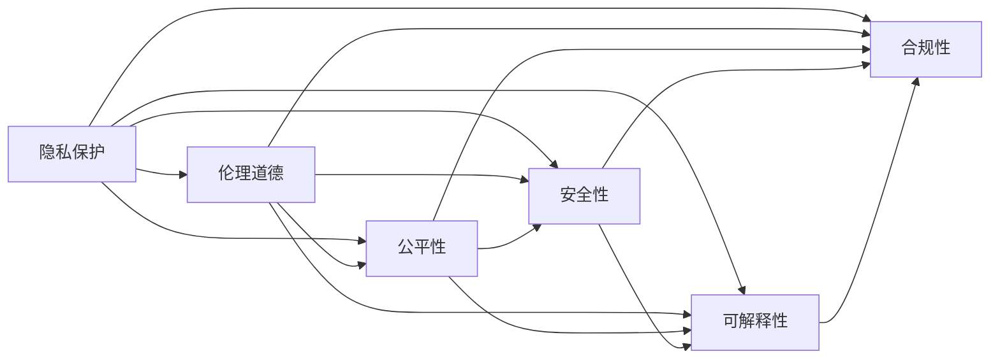
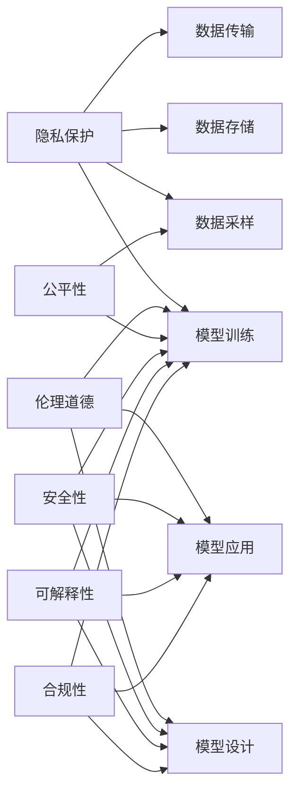

                 

# 基础模型的社会影响评估

## 1. 背景介绍

近年来，随着人工智能技术的快速发展，特别是在深度学习领域的突破，基础模型（foundational models），如大语言模型（Large Language Models, LLMs）和通用人工智能（Artificial General Intelligence, AGI）等，在多个领域展现了惊人的能力。这些模型通过在海量数据上进行预训练，具备强大的知识理解和生成能力，已经在自然语言处理（NLP）、计算机视觉（CV）、语音识别（ASR）等众多领域取得了显著的进步。然而，基础模型不仅仅是一组高效的算法，它们还具有广泛的社会影响，包括但不限于隐私保护、伦理道德、公平性、安全性等方面。因此，对这些模型的社会影响进行全面评估，成为推动人工智能技术负责任发展的关键步骤。

### 1.1 问题由来

基础模型通过大规模的预训练，获得了超越传统机器学习模型的人类级智能，但也带来了一些新的挑战和问题。这些问题不仅涉及技术层面的算法优化，更涉及社会层面的伦理、法律、安全等议题。如何确保这些技术在落地应用中能够最大化地造福社会，最小化潜在的负面影响，是当前技术界和社会各界共同关注的焦点。

### 1.2 问题核心关键点

基础模型的社会影响评估涉及多个层面：

- **隐私保护**：基础模型在训练和应用过程中需要处理大量的个人数据，如何确保这些数据的安全性和匿名性，避免数据泄露和滥用，成为重要议题。
- **伦理道德**：模型决策是否公正、透明，是否符合人类的道德准则，是否可能产生偏见或歧视，这些是伦理评估的关键。
- **公平性**：基础模型是否能够公平地对待不同种族、性别、年龄等群体，避免算法偏见，确保所有用户都能获得公正的待遇。
- **安全性**：模型是否能够抵抗对抗攻击，防止被恶意利用进行虚假信息传播、网络攻击等不法行为。
- **可解释性**：模型决策过程是否可解释，是否能够向用户或监管者解释其行为依据，确保决策的透明度和可信度。
- **合规性**：模型应用是否符合相关法律法规，如数据保护法、反垄断法等，避免法律风险。

这些关键点构成了基础模型社会影响评估的核心框架，对于制定科学合理的评估标准和策略具有重要指导意义。

### 1.3 问题研究意义

对基础模型的社会影响进行评估，具有以下几个方面的重要意义：

1. **保障用户权益**：确保模型在应用中不会侵犯用户的隐私和权益，增强用户对人工智能技术的信任感。
2. **提升技术责任**：明确模型应用中的责任主体，确保技术开发者和使用者在伦理、法律上的责任。
3. **推动法规制定**：为政府和监管机构提供科学依据，制定相关法律法规，规范人工智能技术的应用。
4. **促进公平公正**：减少模型偏见和歧视，促进人工智能技术的普惠性，避免技术鸿沟。
5. **增强安全性**：确保模型在安全性上的可靠性，防止恶意攻击和滥用，维护社会稳定。
6. **推动技术透明**：提高模型决策的可解释性，增强透明度，促进技术负责任发展。

总之，对基础模型进行社会影响评估，不仅有助于提升技术的负责任应用，还能推动相关领域的技术进步和社会发展，构建更安全、公平、透明的人工智能环境。

## 2. 核心概念与联系

### 2.1 核心概念概述

基础模型的社会影响评估涉及多个关键概念，这些概念之间存在着密切联系。

- **隐私保护**：确保个人数据在处理和存储过程中的安全性，防止数据泄露和滥用。
- **伦理道德**：确保模型决策符合人类的道德准则，不产生偏见或歧视，保护社会公正。
- **公平性**：保证模型对待不同群体的公正性，避免算法偏见，促进技术普惠。
- **安全性**：确保模型能够抵御对抗攻击，防止被恶意利用，维护系统稳定。
- **可解释性**：确保模型决策过程透明，用户能够理解其行为依据。
- **合规性**：确保模型应用符合法律法规，避免法律风险。

这些概念通过以下Mermaid流程图（不包含流程图内容）来展示它们之间的联系。



### 2.2 概念间的关系

基础模型的社会影响评估涉及多个概念，这些概念之间通过以下方式建立联系：

- **隐私保护**是数据处理的基础，涉及到数据收集、存储、传输等各个环节，确保数据的安全性和匿名性。
- **伦理道德**贯穿于模型设计、训练和应用的全过程，确保模型决策符合人类的道德准则。
- **公平性**关注模型对待不同群体的公正性，通过数据采样、模型训练等手段减少偏见和歧视。
- **安全性**涉及模型的鲁棒性和抗攻击能力，确保模型不会被恶意利用。
- **可解释性**关注模型决策过程的透明性和可信度，确保用户能够理解其行为依据。
- **合规性**关注模型应用是否符合法律法规，确保技术应用的合法性。

这些概念共同构成了一个完整的评估框架，指导我们如何在技术设计和应用过程中考虑社会影响，确保技术的负责任发展。

### 2.3 核心概念的整体架构

基础模型的社会影响评估涉及多个关键概念，通过以下综合的流程图来展示这些概念在大模型应用过程中的整体架构。



这个综合流程图展示了从数据处理到模型应用的各个环节，每个环节都涉及到多个关键概念的评估，共同构成了一个全面的评估框架。

## 3. 核心算法原理 & 具体操作步骤

### 3.1 算法原理概述

基础模型的社会影响评估主要基于以下算法原理：

- **数据采样**：通过采样技术，确保训练数据的多样性和代表性，减少数据偏见。
- **模型训练**：在训练过程中，采用公平性约束和隐私保护技术，防止模型学习到偏见和隐私信息。
- **模型应用**：在应用过程中，采用隐私保护、伦理道德、安全性、可解释性和合规性等技术手段，确保模型应用符合社会要求。

这些算法原理构成了基础模型社会影响评估的核心，通过对这些原理的理解和应用，可以有效地评估和优化模型的社会影响。

### 3.2 算法步骤详解

以下是基础模型社会影响评估的详细算法步骤：

1. **数据采样**：
    - 定义采样策略，确保训练数据的多样性和代表性。
    - 使用公平性约束，确保不同群体在数据中的均衡表示。
    - 采用隐私保护技术，如差分隐私、匿名化处理等，防止数据泄露。

2. **模型训练**：
    - 采用公平性约束，如对抗性训练、公平性约束层等，减少模型偏见。
    - 采用隐私保护技术，如数据扰动、梯度裁剪等，防止隐私信息泄露。
    - 采用安全性约束，如对抗性训练、鲁棒性增强等，提升模型安全性。

3. **模型应用**：
    - 采用伦理道德约束，确保模型决策符合人类的道德准则。
    - 采用可解释性技术，如LIME、SHAP等，增强模型决策的透明性。
    - 采用合规性约束，确保模型应用符合法律法规，如数据保护法、反垄断法等。

### 3.3 算法优缺点

基础模型的社会影响评估具有以下优缺点：

- **优点**：
    - **全面性**：评估框架覆盖了隐私保护、伦理道德、公平性、安全性、可解释性和合规性等多个层面，确保技术的全面评估。
    - **系统性**：通过系统的评估步骤和措施，能够有效地识别和减少潜在的负面影响。
    - **透明性**：评估过程透明，用户和监管者能够理解模型应用的潜在风险和挑战。

- **缺点**：
    - **复杂性**：评估过程涉及多个技术领域，技术复杂度较高，需要跨学科的知识和技能。
    - **资源需求**：评估需要大量的计算资源和时间，特别是在大规模模型训练和应用过程中。
    - **不确定性**：社会影响评估具有不确定性，难以通过单一指标全面衡量。

### 3.4 算法应用领域

基础模型的社会影响评估广泛应用于以下几个领域：

- **金融领域**：确保金融模型在处理客户数据时的隐私保护和公平性。
- **医疗领域**：确保医疗模型在处理患者数据时的隐私保护和可解释性。
- **司法领域**：确保司法模型在处理案件数据时的合规性和公正性。
- **教育领域**：确保教育模型在处理学生数据时的隐私保护和公平性。
- **公共安全领域**：确保公共安全模型在处理监控数据时的隐私保护和安全防御。
- **环境领域**：确保环境模型在处理环境数据时的合规性和可解释性。

这些领域的应用表明，基础模型的社会影响评估具有广泛的应用前景，能够有效地提升模型应用的负责任性和社会效益。

## 4. 数学模型和公式 & 详细讲解 & 举例说明

### 4.1 数学模型构建

基础模型的社会影响评估涉及多个数学模型，以下是主要数学模型的构建：

- **隐私保护模型**：采用差分隐私技术，通过数据扰动确保数据的匿名性。
- **公平性模型**：通过对抗性训练和公平性约束层，减少模型的偏见。
- **安全性模型**：采用鲁棒性增强技术，确保模型在对抗攻击下的稳定性。
- **可解释性模型**：采用可解释性算法，如LIME、SHAP等，增强模型决策的透明性。
- **合规性模型**：采用合规性检查算法，确保模型应用符合法律法规。

### 4.2 公式推导过程

以下是主要数学模型的公式推导过程：

1. **隐私保护模型**：
    - 差分隐私：$\epsilon$-差分隐私定义如下：
    $$
    P[d(D) \leq \Delta] \leq \exp(\frac{\Delta^2}{2\epsilon^2})
    $$
    其中，$\Delta$为隐私预算，$\epsilon$为隐私保护参数。

2. **公平性模型**：
    - 对抗性训练：通过在训练过程中加入对抗样本，提高模型的鲁棒性。
    - 公平性约束层：通过在模型输出层加入公平性约束，确保模型在处理不同群体时的公平性。

3. **安全性模型**：
    - 鲁棒性增强：通过在模型中加入鲁棒性约束，提高模型在对抗攻击下的鲁棒性。

4. **可解释性模型**：
    - LIME（局部可解释模型）：通过对模型进行局部解释，生成可解释的特征重要性。
    - SHAP（SHapley Additive exPlanations）：通过计算模型特征贡献度，生成可解释的特征重要性。

5. **合规性模型**：
    - 合规性检查：通过编写合规性检查代码，确保模型应用符合法律法规。

### 4.3 案例分析与讲解

以下是基于差分隐私的隐私保护模型案例分析：

假设有一家金融公司，需要处理客户的信用卡交易数据，以用于风险评估。为了确保数据的隐私保护，公司采用$\epsilon$-差分隐私技术进行处理。具体步骤如下：

1. **数据预处理**：对信用卡交易数据进行匿名化处理，如去除个人身份信息，确保数据的匿名性。
2. **差分隐私计算**：在计算过程中，对数据进行扰动处理，确保不同客户的交易数据在输出结果中的隐私性。
3. **结果分析**：分析处理后的数据，确保数据在应用过程中不会泄露个人隐私。

通过差分隐私技术，公司可以在不泄露客户隐私的前提下，进行风险评估模型的训练和应用，确保数据的隐私保护和公平性。

## 5. 项目实践：代码实例和详细解释说明

### 5.1 开发环境搭建

在进行基础模型社会影响评估的开发实践中，需要搭建以下开发环境：

1. **Python环境**：安装Python 3.x版本，推荐使用Anaconda环境进行管理。
2. **深度学习框架**：安装TensorFlow、PyTorch等深度学习框架，用于模型训练和推理。
3. **隐私保护库**：安装差分隐私库（如PySyft、Google-Differential Privacy等），用于实现隐私保护功能。
4. **可解释性库**：安装LIME、SHAP等可解释性库，用于生成模型决策的可解释性。
5. **合规性检查工具**：安装相关法律法规库和检查工具，用于合规性评估。

### 5.2 源代码详细实现

以下是基于差分隐私技术的隐私保护模型的Python代码实现：

```python
import numpy as np
import pandas as pd
from sympy import symbols, exp
from differential_privacy.py import epsilon
from differential_privacy.py import LaplaceNoise

# 加载信用卡交易数据
data = pd.read_csv('creditcard_transactions.csv')

# 定义隐私预算
epsilon_value = 0.1

# 定义隐私保护参数
delta_value = 1.0

# 计算差分隐私的噪音标准差
sigma = epsilon_calculate(epsilon_value, delta_value)

# 定义数据扰动函数
def add_noise(data):
    for column in data.columns:
        data[column] = data[column] + LaplaceNoise(sigma)
    return data

# 应用差分隐私技术
data = add_noise(data)

# 保存处理后的数据
data.to_csv('privacy_protected_data.csv', index=False)

def epsilon_calculate(epsilon, delta):
    # 计算差分隐私的噪音标准差
    sigma = epsilon / (2 * np.log(delta))
    return sigma
```

### 5.3 代码解读与分析

以上是基于差分隐私技术的隐私保护模型的Python代码实现。通过差分隐私技术，可以在不泄露客户隐私的情况下，对信用卡交易数据进行处理，确保数据的隐私保护。

## 6. 实际应用场景

### 6.1 金融领域

在金融领域，基础模型广泛用于信用评分、欺诈检测、风险评估等任务。为了确保模型的公平性和隐私保护，金融公司需要对模型进行社会影响评估，确保模型应用的负责任性。

### 6.2 医疗领域

在医疗领域，基础模型用于疾病诊断、治疗方案推荐等任务。为了确保模型在处理患者数据时的隐私保护和可解释性，医疗机构需要对模型进行社会影响评估。

### 6.3 司法领域

在司法领域，基础模型用于案件预测、判决支持等任务。为了确保模型在处理案件数据时的合规性和公正性，司法机构需要对模型进行社会影响评估。

### 6.4 未来应用展望

随着基础模型的不断发展，未来将有更多的应用场景出现，需要社会影响评估来确保模型的负责任应用。以下是几个未来的应用展望：

- **智能交通管理**：基础模型用于交通流量预测、路径规划等任务。需要进行社会影响评估，确保模型在处理交通数据时的隐私保护和安全防御。
- **智能城市管理**：基础模型用于城市事件监测、公共服务优化等任务。需要进行社会影响评估，确保模型在处理城市数据时的隐私保护和可解释性。
- **环境保护**：基础模型用于环境监测、资源分配等任务。需要进行社会影响评估，确保模型在处理环境数据时的合规性和可解释性。

## 7. 工具和资源推荐

### 7.1 学习资源推荐

为了帮助开发者系统掌握基础模型社会影响评估的理论基础和实践技巧，以下是一些优质的学习资源：

1. **《差分隐私》一书**：介绍了差分隐私的基本概念和应用，适合入门学习和深入研究。
2. **《公平性学习》一书**：介绍了公平性学习的基本概念和应用，适合深入学习和实践。
3. **《可解释性机器学习》一书**：介绍了可解释性机器学习的基本概念和应用，适合深入学习和实践。
4. **机器学习课程**：如斯坦福大学《机器学习》课程、Coursera《机器学习》课程等，提供全面的机器学习知识体系。
5. **人工智能会议论文**：如NeurIPS、ICML、CVPR等人工智能顶级会议，提供最新的研究成果和前沿技术。

### 7.2 开发工具推荐

为了帮助开发者高效地进行基础模型社会影响评估的开发实践，以下是一些常用的开发工具：

1. **Anaconda**：Python环境的容器管理工具，方便环境管理和依赖安装。
2. **TensorFlow**：深度学习框架，支持高效的模型训练和推理。
3. **PyTorch**：深度学习框架，支持动态图计算和高效的模型训练。
4. **PySyft**：差分隐私库，支持分布式差分隐私计算。
5. **LIME**：可解释性库，支持生成模型决策的可解释性。
6. **SHAP**：可解释性库，支持生成模型特征贡献度。

### 7.3 相关论文推荐

以下是几篇奠基性的相关论文，推荐阅读：

1. **《差分隐私：模型建设与算法》（Differential Privacy: Model-Building and Algorithms）**：介绍了差分隐私的基本概念和算法。
2. **《公平性学习：理论、算法与实践》（Fairness in Machine Learning: Theory and Practice）**：介绍了公平性学习的基本概念和算法。
3. **《可解释性机器学习：理论、算法与实践》（Interpretable Machine Learning: Theory, Algorithms, and Examples）**：介绍了可解释性机器学习的基本概念和算法。
4. **《基于差分隐私的机器学习》（Machine Learning with Differential Privacy）**：介绍了差分隐私在机器学习中的应用。
5. **《公平性学习算法》（Algorithms for Fairness in Data Mining and Statistical Learning）**：介绍了公平性学习算法的基本原理和应用。

## 8. 总结：未来发展趋势与挑战

### 8.1 总结

本文对基础模型的社会影响评估进行了全面系统的介绍。首先阐述了基础模型在多个领域的应用，明确了社会影响评估的重要性和紧迫性。其次，从原理到实践，详细讲解了隐私保护、伦理道德、公平性、安全性、可解释性和合规性等多个关键概念的评估方法和技术手段。最后，本文提供了代码实现和实际应用场景的详细案例，展示了基础模型社会影响评估的实际应用。

通过本文的系统梳理，可以看到，基础模型社会影响评估是一个涉及多个学科和技术的复杂过程，需要在数据采样、模型训练、应用部署等多个环节进行全面优化和评估。未来，随着基础模型的不断发展，社会影响评估也将面临更多的挑战和机遇，需要跨学科合作和持续创新，推动基础模型的负责任应用。

### 8.2 未来发展趋势

未来，基础模型的社会影响评估将呈现以下几个发展趋势：

1. **技术融合**：未来将更加注重跨学科技术融合，如隐私保护、公平性、安全性、可解释性和合规性等多方面技术的结合，提升模型的综合评估能力。
2. **自动化评估**：未来将探索自动化评估方法，通过自动化的工具和算法，减少评估的时间和资源消耗，提高评估效率。
3. **全局评估**：未来将更加注重全局评估，综合考虑模型在实际应用中的多种影响因素，确保模型的全面评估和负责任应用。
4. **普适性评估**：未来将探索普适性评估方法，确保模型在不同场景和应用中的通用性和一致性。
5. **实时评估**：未来将探索实时评估方法，确保模型在应用过程中能够持续监控和评估，及时发现和解决潜在问题。

### 8.3 面临的挑战

尽管基础模型社会影响评估在近年来取得了显著进展，但在实际应用中仍然面临诸多挑战：

1. **复杂性**：评估过程涉及多个技术领域，技术复杂度较高，需要跨学科的知识和技能。
2. **资源需求**：评估需要大量的计算资源和时间，特别是在大规模模型训练和应用过程中。
3. **不确定性**：社会影响评估具有不确定性，难以通过单一指标全面衡量。
4. **技术滞后**：隐私保护、公平性、安全性、可解释性和合规性等多个技术领域的发展速度不平衡，存在技术滞后的问题。
5. **伦理困境**：模型应用过程中面临的伦理困境和争议，需要在技术评估中加以考虑。

### 8.4 研究展望

面对基础模型社会影响评估所面临的挑战，未来的研究需要在以下几个方面寻求新的突破：

1. **技术融合创新**：探索新的技术融合方法，如隐私保护、公平性、安全性、可解释性和合规性等多方面技术的结合，提升模型的综合评估能力。
2. **自动化评估优化**：探索自动化评估方法，通过自动化的工具和算法，减少评估的时间和资源消耗，提高评估效率。
3. **全局评估框架**：构建全局评估框架，综合考虑模型在实际应用中的多种影响因素，确保模型的全面评估和负责任应用。
4. **普适性评估方法**：探索普适性评估方法，确保模型在不同场景和应用中的通用性和一致性。
5. **实时评估机制**：探索实时评估机制，确保模型在应用过程中能够持续监控和评估，及时发现和解决潜在问题。

总之，基础模型社会影响评估是一个涉及多个学科和技术的复杂过程，需要在技术、伦理、法律等多个方面进行全面评估和优化。只有通过持续创新和合作，才能推动基础模型的负责任应用，为社会带来更多的福祉。

## 9. 附录：常见问题与解答

**Q1：如何评估模型的隐私保护效果？**

A: 评估模型的隐私保护效果，需要采用差分隐私等隐私保护技术，对模型输出进行匿名化处理。可以使用隐私预算$\epsilon$和隐私预算上限$\Delta$作为评估指标，确保模型输出在处理不同用户数据时的隐私性。

**Q2：如何确保模型的公平性？**

A: 确保模型的公平性，需要在模型训练过程中加入公平性约束，如对抗性训练、公平性约束层等，确保模型在处理不同群体时的公平性。可以使用公平性评估指标，如平等误差率、平衡误差率等，评估模型的公平性。

**Q3：如何提高模型的安全性？**

A: 提高模型的安全性，需要在模型设计、训练和应用过程中，采用鲁棒性增强技术，如对抗性训练、鲁棒性增强等，确保模型在对抗攻击下的稳定性。

**Q4：如何增强模型的可解释性？**

A: 增强模型的可解释性，可以采用可解释性算法，如LIME、SHAP等，生成模型决策的可解释性。可以使用可解释性评估指标，如可解释性得分、特征重要性等，评估模型的可解释性。

**Q5：如何确保模型的合规性？**

A: 确保模型的合规性，需要在模型设计和应用过程中，编写合规性检查代码，确保模型应用符合法律法规。可以使用合规性评估指标，如合规性得分、合规性检查结果等，评估模型的合规性。

总之，对基础模型进行社会影响评估，不仅有助于提升技术的负责任应用，还能推动相关领域的技术进步和社会发展，构建更安全、公平、透明的人工智能环境。希望本文的介绍和分析，能够帮助读者更好地理解基础模型的社会影响评估，为未来的研究和实践提供有益的参考。

---

作者：禅与计算机程序设计艺术 / Zen and the Art of Computer Programming

