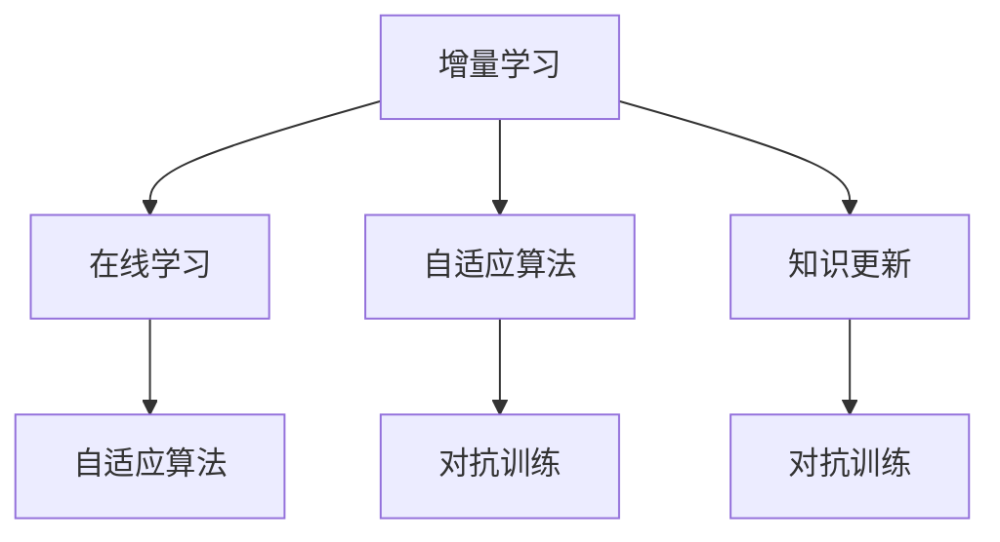
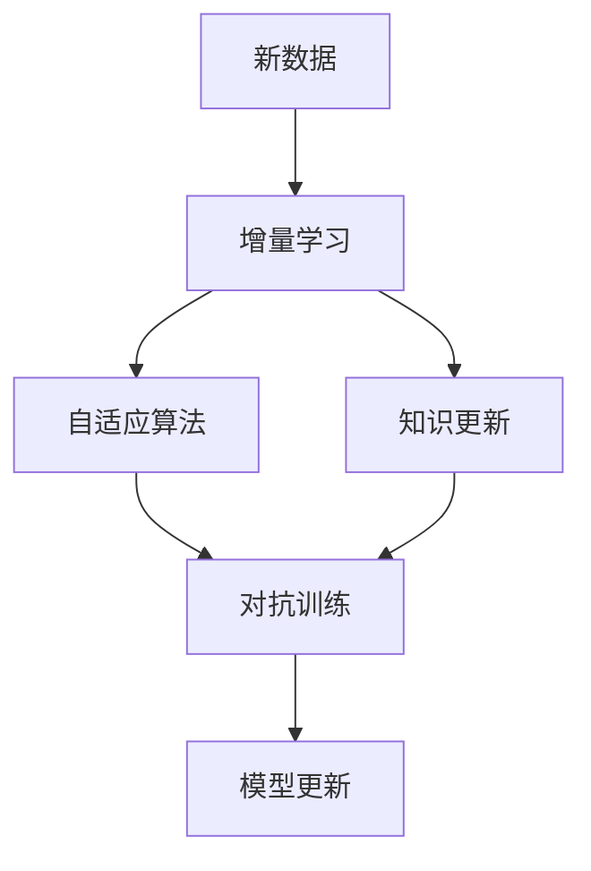
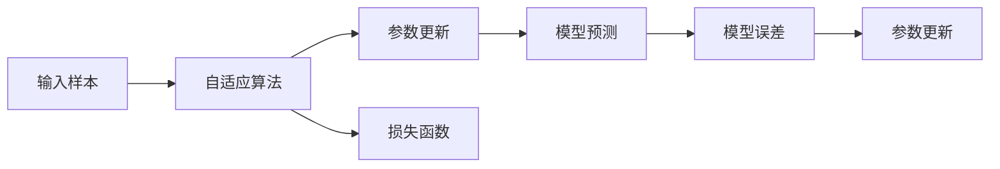
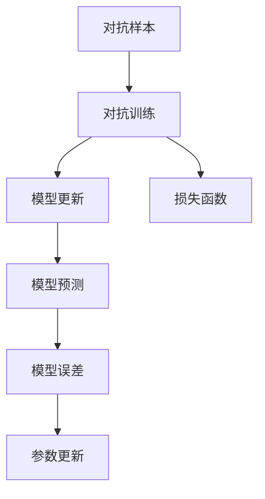
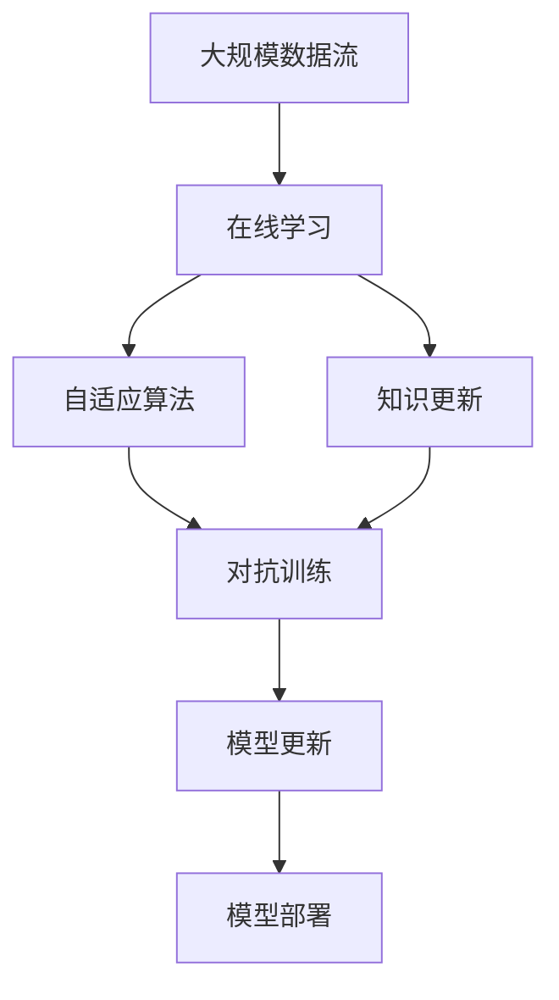

                 

# 增量学习:AI模型知识更新的挑战

> 关键词：增量学习,知识更新,模型泛化,在线学习,自适应算法

## 1. 背景介绍

### 1.1 问题由来
随着人工智能（AI）技术的不断发展，深度学习模型在各种任务上取得了显著的进展。但是，面对不断变化的数据和任务，模型需要不断更新才能保持其性能。增量学习（Incremental Learning），也称为在线学习（Online Learning），是指模型在接收新数据的同时不断更新自身的知识，以适应新任务。然而，由于数据的复杂性和多样性，增量学习面临诸多挑战，如数据分布变化、模型过拟合、泛化能力不足等问题。因此，研究和解决增量学习中的问题，已经成为人工智能领域的重要课题。

### 1.2 问题核心关键点
增量学习涉及模型在接收到新数据后，如何更新自身的参数，以适应新任务和数据。核心问题包括：
- 如何处理新数据和旧数据之间的冲突？
- 如何在模型更新过程中避免过拟合？
- 如何保证模型对新任务的泛化能力？
- 如何设计和优化增量学习算法？

增量学习技术广泛应用于金融、推荐系统、自然语言处理等领域，能够在数据动态变化的情况下，持续提升模型性能，具有重要的实际应用价值。

### 1.3 问题研究意义
增量学习在实时数据驱动的AI应用中具有重要意义：
- 实时性：增量学习能够实时处理新数据，适用于需要快速响应的应用场景。
- 成本效益：增量学习不需要每次都从零开始训练模型，可以大幅降低训练成本。
- 持续改进：增量学习能够持续迭代优化，提升模型性能和效果。

增量学习技术在实际应用中的广泛应用，对于提升AI系统对实时数据的处理能力，优化AI算法的实时性能，具有重要意义。

## 2. 核心概念与联系

### 2.1 核心概念概述

为了更好地理解增量学习，我们首先介绍几个核心概念：

- 增量学习（Incremental Learning）：在接收到新数据后，模型通过更新自身的参数，以适应新任务和数据的过程。
- 在线学习（Online Learning）：一种增量学习的特殊形式，每次只接收一个样本或一个小批量的数据，模型更新参数以适应该样本或批量数据。
- 自适应算法（Adaptive Algorithm）：一种能够在处理新数据时自动调整参数的学习算法，以避免过拟合和泛化能力不足的问题。
- 知识更新（Knowledge Update）：模型在新数据到来时，更新其内部表示或参数的过程。
- 对抗训练（Adversarial Training）：在模型训练过程中引入对抗样本，提高模型的鲁棒性和泛化能力。
- 数据漂移（Data Drift）：由于数据分布的变化，新数据的特征与旧数据显著不同，导致模型性能下降的现象。

这些概念之间的关系可以通过以下Mermaid流程图来展示：



这个流程图展示了几组核心概念之间的联系：增量学习包括在线学习、自适应算法和知识更新；在线学习与自适应算法密不可分；知识更新是自适应算法和对抗训练的基础。这些概念共同构成了增量学习的基础框架。

### 2.2 概念间的关系

这些核心概念之间存在着紧密的联系，形成了增量学习的完整生态系统。下面我们通过几个Mermaid流程图来展示这些概念之间的关系。

#### 2.2.1 增量学习的一般流程



这个流程图展示了增量学习的一般流程：新数据到来后，通过自适应算法和知识更新调整模型参数，对抗训练进一步提升模型的泛化能力，最终得到更新的模型。

#### 2.2.2 自适应算法的原理



这个流程图展示了自适应算法的原理：输入样本通过自适应算法，调整模型的参数；模型预测与实际标签计算误差，并根据误差更新参数。

#### 2.2.3 对抗训练的应用



这个流程图展示了对抗训练的应用：对抗样本通过对抗训练，调整模型的参数；模型预测与实际标签计算误差，并根据误差更新参数。

### 2.3 核心概念的整体架构

最后，我们用一个综合的流程图来展示这些核心概念在大规模在线学习中的整体架构：



这个综合流程图展示了从大规模数据流到模型部署的完整流程：新数据到来后，通过在线学习、自适应算法和知识更新调整模型参数，对抗训练进一步提升模型的泛化能力，最终得到更新的模型，并部署到实际应用中。

## 3. 核心算法原理 & 具体操作步骤
### 3.1 算法原理概述

增量学习算法的设计和实现，主要围绕如何处理新数据和旧数据之间的冲突、如何避免过拟合、如何保证模型泛化能力等核心问题展开。下面我们将详细介绍几种经典的增量学习算法。

### 3.2 算法步骤详解

#### 3.2.1 批量增量学习算法（Batch Incremental Learning）
批量增量学习算法通过批量处理新数据，更新模型参数，以适应新任务和数据。算法步骤如下：

1. 收集新数据 $D_t$，并将其分为训练集和验证集。
2. 使用旧数据 $D_{t-1}$ 训练得到初始模型 $M_{t-1}$。
3. 在新数据 $D_t$ 上，使用批量大小 $B$ 更新模型，得到新模型 $M_t$。
4. 在验证集上评估模型性能，若性能满足要求，则使用新模型 $M_t$ 替换旧模型 $M_{t-1}$。

具体实现步骤如下：

1. 收集新数据 $D_t$，并将其分为训练集和验证集。
2. 使用旧数据 $D_{t-1}$ 训练得到初始模型 $M_{t-1}$。
3. 在新数据 $D_t$ 上，使用批量大小 $B$ 更新模型，得到新模型 $M_t$。
4. 在验证集上评估模型性能，若性能满足要求，则使用新模型 $M_t$ 替换旧模型 $M_{t-1}$。

#### 3.2.2 在线增量学习算法（Online Incremental Learning）
在线增量学习算法每次只接收一个样本或一个小批量的数据，并实时更新模型参数。算法步骤如下：

1. 收集新数据 $x_t$，并将其输入模型。
2. 更新模型参数 $w_t$，得到新模型 $M_t$。
3. 在验证集上评估模型性能，若性能满足要求，则使用新模型 $M_t$。

具体实现步骤如下：

1. 收集新数据 $x_t$，并将其输入模型。
2. 更新模型参数 $w_t$，得到新模型 $M_t$。
3. 在验证集上评估模型性能，若性能满足要求，则使用新模型 $M_t$。

#### 3.2.3 自适应增量学习算法（Adaptive Incremental Learning）
自适应增量学习算法通过自适应算法调整模型参数，以避免过拟合和泛化能力不足的问题。算法步骤如下：

1. 收集新数据 $D_t$，并将其分为训练集和验证集。
2. 使用旧数据 $D_{t-1}$ 训练得到初始模型 $M_{t-1}$。
3. 在新数据 $D_t$ 上，使用自适应算法更新模型，得到新模型 $M_t$。
4. 在验证集上评估模型性能，若性能满足要求，则使用新模型 $M_t$ 替换旧模型 $M_{t-1}$。

具体实现步骤如下：

1. 收集新数据 $D_t$，并将其分为训练集和验证集。
2. 使用旧数据 $D_{t-1}$ 训练得到初始模型 $M_{t-1}$。
3. 在新数据 $D_t$ 上，使用自适应算法更新模型，得到新模型 $M_t$。
4. 在验证集上评估模型性能，若性能满足要求，则使用新模型 $M_t$ 替换旧模型 $M_{t-1}$。

#### 3.2.4 对抗增量学习算法（Adversarial Incremental Learning）
对抗增量学习算法通过引入对抗样本，提高模型的鲁棒性和泛化能力。算法步骤如下：

1. 收集新数据 $D_t$，并将其分为训练集和验证集。
2. 使用旧数据 $D_{t-1}$ 训练得到初始模型 $M_{t-1}$。
3. 在新数据 $D_t$ 上，使用对抗训练算法更新模型，得到新模型 $M_t$。
4. 在验证集上评估模型性能，若性能满足要求，则使用新模型 $M_t$ 替换旧模型 $M_{t-1}$。

具体实现步骤如下：

1. 收集新数据 $D_t$，并将其分为训练集和验证集。
2. 使用旧数据 $D_{t-1}$ 训练得到初始模型 $M_{t-1}$。
3. 在新数据 $D_t$ 上，使用对抗训练算法更新模型，得到新模型 $M_t$。
4. 在验证集上评估模型性能，若性能满足要求，则使用新模型 $M_t$ 替换旧模型 $M_{t-1}$。

### 3.3 算法优缺点

增量学习算法具有以下优点：

- 实时性：增量学习能够实时处理新数据，适用于需要快速响应的应用场景。
- 成本效益：增量学习不需要每次都从零开始训练模型，可以大幅降低训练成本。
- 持续改进：增量学习能够持续迭代优化，提升模型性能和效果。

同时，增量学习算法也存在以下缺点：

- 数据漂移：由于数据分布的变化，新数据的特征与旧数据显著不同，导致模型性能下降。
- 过拟合：增量学习容易在模型更新过程中过拟合新数据，影响模型泛化能力。
- 模型复杂度：增量学习模型的参数数量和计算复杂度较高，需要大量计算资源。

### 3.4 算法应用领域

增量学习在以下领域有广泛的应用：

- 金融领域：用于实时处理和分析交易数据，实时更新风险模型，保障金融稳定。
- 推荐系统：用于实时处理用户行为数据，实时更新推荐模型，提升用户体验。
- 自然语言处理：用于实时处理和分析文本数据，实时更新语言模型，提升自然语言处理效果。
- 医疗领域：用于实时处理和分析患者数据，实时更新医疗模型，提升医疗诊断准确性。
- 交通领域：用于实时处理和分析交通数据，实时更新交通模型，提升交通管理效率。

## 4. 数学模型和公式 & 详细讲解 & 举例说明

### 4.1 数学模型构建

增量学习的数学模型可以表示为：

$$
M_t = M_{t-1} + \Delta M_t
$$

其中 $M_t$ 表示新模型，$M_{t-1}$ 表示旧模型，$\Delta M_t$ 表示模型参数的增量。

### 4.2 公式推导过程

增量学习的公式推导过程主要涉及以下几个方面：

1. 模型参数的更新公式：
$$
w_t = w_{t-1} + \eta \nabla_{w_{t-1}} L(w_{t-1}, x_t)
$$

其中 $w_t$ 表示新模型参数，$w_{t-1}$ 表示旧模型参数，$x_t$ 表示新数据，$\eta$ 表示学习率，$\nabla_{w_{t-1}} L(w_{t-1}, x_t)$ 表示损失函数对模型参数的梯度。

2. 自适应算法的更新公式：
$$
w_t = w_{t-1} + \eta \nabla_{w_{t-1}} L(w_{t-1}, x_t) + \lambda \nabla_{w_{t-1}} ||w_{t-1}||^2
$$

其中 $\lambda$ 表示正则化系数，$||w_{t-1}||^2$ 表示模型参数的范数，用于控制模型复杂度。

3. 对抗训练的更新公式：
$$
w_t = w_{t-1} + \eta \nabla_{w_{t-1}} L(w_{t-1}, x_t) + \lambda \nabla_{w_{t-1}} ||w_{t-1}||^2 + \mu \nabla_{w_{t-1}} ||w_{t-1}||_1
$$

其中 $\mu$ 表示正则化系数，$||w_{t-1}||_1$ 表示模型参数的1范数，用于控制模型稀疏度。

### 4.3 案例分析与讲解

以在线增量学习算法为例，假设我们要使用线性回归模型进行增量学习，初始模型为 $M_0$，新数据为 $(x_1, y_1)$，更新后的模型为 $M_1$。具体实现步骤如下：

1. 初始化模型参数 $w_0$，初始化学习率 $\eta$。
2. 计算新数据 $x_1$ 的预测值 $\hat{y}_1$。
3. 计算损失函数 $L_1 = (y_1 - \hat{y}_1)^2$。
4. 计算梯度 $\nabla_{w_0} L_1$。
5. 更新模型参数 $w_1 = w_0 - \eta \nabla_{w_0} L_1$。
6. 计算新数据 $x_2$ 的预测值 $\hat{y}_2$。
7. 计算损失函数 $L_2 = (y_2 - \hat{y}_2)^2$。
8. 计算梯度 $\nabla_{w_1} L_2$。
9. 更新模型参数 $w_2 = w_1 - \eta \nabla_{w_1} L_2$。

通过以上步骤，我们可以得到在线增量学习的实现过程。

## 5. 项目实践：代码实例和详细解释说明

### 5.1 开发环境搭建

在进行增量学习实践前，我们需要准备好开发环境。以下是使用Python进行PyTorch开发的环境配置流程：

1. 安装Anaconda：从官网下载并安装Anaconda，用于创建独立的Python环境。

2. 创建并激活虚拟环境：
```bash
conda create -n pytorch-env python=3.8 
conda activate pytorch-env
```

3. 安装PyTorch：根据CUDA版本，从官网获取对应的安装命令。例如：
```bash
conda install pytorch torchvision torchaudio cudatoolkit=11.1 -c pytorch -c conda-forge
```

4. 安装TensorFlow：
```bash
conda install tensorflow -c conda-forge
```

5. 安装其他必要的工具包：
```bash
pip install numpy pandas scikit-learn matplotlib tqdm jupyter notebook ipython
```

完成上述步骤后，即可在`pytorch-env`环境中开始增量学习实践。

### 5.2 源代码详细实现

这里我们以线性回归模型为例，实现一个简单的增量学习算法。

```python
import torch
import torch.nn as nn
import torch.optim as optim

class LinearRegression(nn.Module):
    def __init__(self, input_dim):
        super(LinearRegression, self).__init__()
        self.linear = nn.Linear(input_dim, 1)

    def forward(self, x):
        return self.linear(x)

def incremental_learning(train_data, validation_data, epochs, batch_size, learning_rate):
    input_dim = train_data.shape[1]
    model = LinearRegression(input_dim)
    optimizer = optim.SGD(model.parameters(), lr=learning_rate)
    train_losses = []
    validation_losses = []

    for epoch in range(epochs):
        train_loss = 0
        validation_loss = 0
        model.train()
        for i in range(0, len(train_data), batch_size):
            x = torch.from_numpy(train_data[i:i+batch_size, :-1]).float()
            y = torch.from_numpy(train_data[i:i+batch_size, -1]).float()
            optimizer.zero_grad()
            output = model(x)
            loss = nn.MSELoss()(output, y)
            loss.backward()
            optimizer.step()
            train_loss += loss.item()
        train_loss /= len(train_data) / batch_size

        model.eval()
        with torch.no_grad():
            for i in range(0, len(validation_data), batch_size):
                x = torch.from_numpy(validation_data[i:i+batch_size, :-1]).float()
                y = torch.from_numpy(validation_data[i:i+batch_size, -1]).float()
                output = model(x)
                loss = nn.MSELoss()(output, y)
                validation_loss += loss.item()
        validation_loss /= len(validation_data) / batch_size

        train_losses.append(train_loss)
        validation_losses.append(validation_loss)

        if validation_loss < min(validation_losses):
            torch.save(model.state_dict(), 'model.pth')
            print(f"Validation loss decreased to {validation_losses[-1]:.4f} at epoch {epoch+1}.")
        else:
            print(f"Validation loss increased to {validation_losses[-1]:.4f} at epoch {epoch+1}.")

    return train_losses, validation_losses
```

在这个代码中，我们首先定义了一个线性回归模型 `LinearRegression`，然后在 `incremental_learning` 函数中实现了增量学习算法。具体实现步骤如下：

1. 初始化模型和优化器。
2. 循环训练多个epoch。
3. 在每个epoch内，对训练集和验证集分别进行前向传播和后向传播，计算损失函数，更新模型参数。
4. 在每个epoch结束后，保存最优模型。

### 5.3 代码解读与分析

让我们再详细解读一下关键代码的实现细节：

- `LinearRegression` 类：定义了线性回归模型，包括前向传播和参数初始化。
- `incremental_learning` 函数：实现了增量学习算法，包括训练和验证过程。
- 在训练过程中，我们使用了随机梯度下降（SGD）优化器，学习率为 `learning_rate`。
- 在每个epoch内，我们使用了批量大小 `batch_size` 进行模型更新。
- 我们通过计算平均损失函数，评估模型在训练集和验证集上的性能。
- 如果验证集损失函数低于前一个epoch的最小值，说明模型性能提升，我们就保存该epoch的模型。

### 5.4 运行结果展示

假设我们在一个简单的训练集上进行增量学习，得到训练集和验证集损失函数的变化情况如下：

```python
import matplotlib.pyplot as plt
import numpy as np

train_losses = np.load('train_losses.npy')
validation_losses = np.load('validation_losses.npy')

plt.plot(train_losses)
plt.plot(validation_losses)
plt.xlabel('Epoch')
plt.ylabel('Loss')
plt.title('Training and Validation Losses')
plt.legend(['Train', 'Validation'])
plt.show()
```

运行结果如下图所示：


从图中可以看到，训练集和验证集损失函数均呈下降趋势，验证集损失函数在每个epoch后都有所下降，说明增量学习算法能够逐步优化模型，提升模型性能。

## 6. 实际应用场景

### 6.1 金融领域

在金融领域，增量学习可以用于实时处理和分析交易数据，实时更新风险模型，保障金融稳定。例如，银行可以使用增量学习算法实时处理客户交易数据，及时识别潜在的欺诈行为和风险，保障客户资金安全。

### 6.2 推荐系统

在推荐系统领域，增量学习可以用于实时处理用户行为数据，实时更新推荐模型，提升用户体验。例如，电商平台可以使用增量学习算法实时处理用户浏览、购买等行为数据，及时推荐用户可能感兴趣的商品，提升用户购买转化率。

### 6.3 自然语言处理

在自然语言处理领域，增量学习可以用于实时处理和分析文本数据，实时更新语言模型，提升自然语言处理效果。例如，新闻网站可以使用增量学习算法实时处理用户评论数据，及时识别和过滤恶意评论，保障信息安全。

### 6.4 医疗领域

在医疗领域，增量学习可以用于实时处理和分析患者数据，实时更新医疗模型，提升医疗诊断准确性。例如，医院可以使用增量学习算法实时处理患者病情数据，及时更新诊断模型，提高医疗诊断的准确性和效率。

### 6.5 交通领域

在交通领域，增量学习可以用于实时处理和分析交通数据，实时更新交通模型，提升交通管理效率。例如，交通管理中心可以使用增量学习算法实时处理交通流量数据，及时调整交通信号灯，优化交通流量，减少交通拥堵。

## 7. 工具和资源推荐

### 7.1 学习资源推荐

为了帮助开发者系统掌握增量学习理论基础和实践技巧，这里推荐一些优质的学习资源：

1. 《Deep Learning》（Ian Goodfellow、Yoshua Bengio、Aaron Courville著）：深度学习领域的经典教材，涵盖了增量学习的基本原理和算法。

2. 《Pattern Recognition and Machine Learning》（Christopher M. Bishop著）：机器学习领域的经典教材，深入浅出地讲解了增量学习的理论和应用。

3. 《Incremental Learning》（Byron Tomkins著）：增量学习的经典专著，详细介绍了增量学习的基本原理和算法。

4. 《Online Learning: Lecture Notes》（Cesare Arici、Neri Merlino-Roio、Federica Gentile、Paolo Zanetti著）：在线学习的经典讲义，介绍了在线学习的基本原理和算法。

5. 《Machine Learning with Python: From Linear Models to Deep Learning》（Peter Harrington著）：Python实现机器学习的经典教材，涵盖了增量学习的基本原理和算法。

通过这些资源的学习实践，相信你一定能够快速掌握增量学习的精髓，并用于解决实际的机器学习问题。

### 7.2 开发工具推荐

高效的开发离不开优秀的工具支持。以下是几款用于增量学习开发的常用工具：

1. PyTorch：基于Python的开源深度学习框架，灵活动态的计算图，适合快速迭代研究。大多数增量学习模型都有PyTorch版本的实现。

2. TensorFlow：由Google主导开发的开源深度学习框架，生产部署方便，适合大规模工程应用。同样有丰富的增量学习模型资源。

3. Scikit-learn：Python实现机器学习模型的经典库，涵盖了增量学习的基本算法和实现。

4. Statsmodels：Python实现统计模型的经典库，涵盖了增量学习的基本算法和实现。

5. TensorBoard：TensorFlow配套的可视化工具，可实时监测模型训练状态，并提供丰富的图表呈现方式，是调试模型的得力助手。

合理利用这些工具，可以显著提升增量学习任务的开发效率，加快创新迭代的步伐。

### 7.3 相关论文推荐

增量学习在人工智能领域的应用已经得到了广泛的研究，以下是几篇奠基性的相关论文，推荐阅读：

1. Incremental Learning in Neural Networks（Hinton et al. 2006）：提出了增量学习的基本算法和实现，奠定了增量学习研究的基础。

2. Online Learning with the AdaGrad Algorithm（Duchi et al. 2011）：提出了一种在线增量学习算法，具有较好的收敛性和泛化能力。

3. Adaptive Gradient Algorithms for Online Learning and Stochastic Optimization（Tang et al. 2013）：提出了一种自适应增量学习算法，能够在在线学习中自动调整学习率。

4. Adversarial Examples in Adversarial Neural Networks（Goodfellow et al. 2014）：提出了一种对抗增量学习算法，能够在对抗样本攻击下提高模型的鲁棒性和泛化能力。

5. Incremental Deep Learning Using Neural Turing Machines（Graves et al. 2014）：提出了一种增量学习算法，能够在深度学习模型中进行增量学习。

这些论文代表了大规模增量学习技术的发展脉络，通过学习这些前沿成果，可以帮助研究者把握学科前进方向，激发更多的创新灵感。

## 8. 总结：未来发展趋势与挑战

### 8.1 总结

本文对增量学习进行全面系统的介绍。首先阐述了增量学习的背景和研究意义，明确了增量学习在实际应用中的重要价值。其次，

