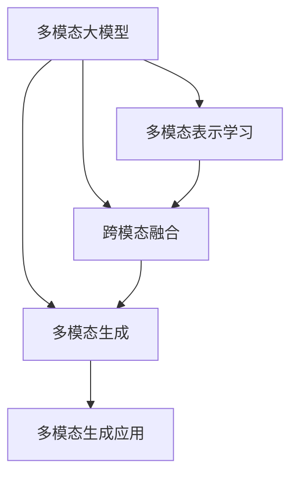
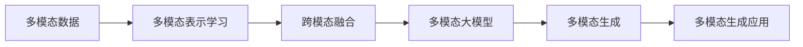

                 

# 多模态大模型：技术原理与实战 OpenAI一鸣惊人带来的启示

## 1. 背景介绍

近年来，随着深度学习技术的迅速发展，多模态大模型已成为研究的热点。多模态大模型融合了文本、图像、音频等多种信息，能够更全面地理解现实世界，并应用于语音识别、图像理解、视频分析等诸多领域。OpenAI的GPT-3及其后续升级版本，无疑是这一领域的一大里程碑。本文将详细解析GPT-3及其多模态扩展模型背后的技术原理，并探讨其在实际应用中的实战经验和未来发展趋势。

## 2. 核心概念与联系

### 2.1 核心概念概述

多模态大模型是一种能够处理多种不同类型数据（如文本、图像、声音等）的深度学习模型。它的核心思想是通过跨模态融合技术，将不同模态的信息整合在一起，形成更加全面和准确的表示，从而提升模型在多任务、多领域的应用能力。

#### 2.1.1 多模态表示学习

多模态表示学习是指将不同模态的数据映射到相同的向量空间，以便进行跨模态比较和融合。常用的方法包括基于attention机制的多模态表示学习（M2M)、多模态自编码器(MAE)等。

#### 2.1.2 跨模态融合

跨模态融合是指将不同模态的特征进行整合，形成综合性的表示。常用的融合方法包括加权平均、attention机制融合等。

#### 2.1.3 多模态生成

多模态生成是指使用多模态大模型生成图像、音频、视频等多种形式的信息。常用的方法包括使用对抗性生成网络（GANs)、变分自编码器（VAEs)等。

### 2.2 核心概念间的关系

多模态大模型的构建涉及多个核心概念，这些概念之间相互关联，形成一个完整的框架。以下是一个Mermaid流程图，展示了这些概念之间的逻辑关系：



这个流程图展示了多模态大模型构建的三个关键步骤：多模态表示学习、跨模态融合和多模态生成。其中，多模态表示学习是基础，跨模态融合是核心，多模态生成是应用。

### 2.3 核心概念的整体架构

以下是一个综合的Mermaid流程图，展示了多模态大模型的整体架构：



这个综合流程图展示了从多模态数据到多模态大模型的整个构建过程，以及最终的多模态生成应用。

## 3. 核心算法原理 & 具体操作步骤

### 3.1 算法原理概述

多模态大模型的核心算法原理主要包括自监督学习、自回归生成、对抗生成网络等。这些算法通过深度学习模型对不同模态的数据进行处理，并通过跨模态融合技术进行整合。

### 3.2 算法步骤详解

以下是一个典型的多模态大模型训练步骤：

1. **数据准备**：收集包含多种模态的数据集，如文本、图像、音频等。

2. **特征提取**：使用不同的特征提取器对数据集中的不同模态进行特征提取。例如，对于图像，可以使用卷积神经网络（CNN）提取特征；对于文本，可以使用词嵌入（Word Embedding）提取特征。

3. **多模态表示学习**：使用自监督学习方法，将不同模态的特征映射到相同的向量空间。例如，可以使用多模态自编码器（MAE）学习跨模态的联合表示。

4. **跨模态融合**：使用注意力机制（Attention）对不同模态的特征进行融合，生成综合性的表示。

5. **多模态生成**：使用生成对抗网络（GANs）或变分自编码器（VAEs）等生成模型，基于多模态表示生成新的图像、音频或文本。

6. **模型评估**：使用交叉验证、标准评估指标等方法，评估模型的性能。

### 3.3 算法优缺点

#### 3.3.1 优点

多模态大模型具有以下优点：

- **全面的信息获取**：能够处理多种模态的数据，获取更全面、更准确的信息。
- **泛化能力**：通过跨模态融合，模型能够更好地泛化到新的任务和领域。
- **多样化的应用**：可以应用于语音识别、图像理解、视频分析等多个领域。

#### 3.3.2 缺点

多模态大模型也存在以下缺点：

- **计算复杂度高**：处理多种模态的数据，需要更强大的计算资源。
- **数据标注成本高**：需要收集和标注多种模态的数据，成本较高。
- **模型复杂度高**：多模态表示学习和跨模态融合的过程较为复杂，需要更多的研究和实验。

### 3.4 算法应用领域

多模态大模型已经在多个领域得到了应用，如医疗影像分析、自动驾驶、安防监控等。以下是一个简单的应用场景：

#### 3.4.1 医疗影像分析

多模态大模型可以用于医疗影像分析，通过融合患者的文本信息和图像信息，提高诊断的准确性。例如，可以使用多模态大模型对X光图像和患者的病历信息进行融合，帮助医生更好地诊断疾病。

#### 3.4.2 自动驾驶

多模态大模型可以用于自动驾驶系统，通过融合摄像头、雷达、激光雷达等传感器数据，提高车辆的感知能力和决策能力。例如，可以使用多模态大模型对摄像头图像和激光雷达点云进行融合，提高自动驾驶系统的准确性。

#### 3.4.3 安防监控

多模态大模型可以用于安防监控系统，通过融合视频、音频和文本信息，提高异常检测的准确性。例如，可以使用多模态大模型对视频监控录像、语音和文字聊天记录进行融合，提高异常检测和预警的能力。

## 4. 数学模型和公式 & 详细讲解

### 4.1 数学模型构建

以下是一个典型的多模态大模型数学模型构建：

设多模态大模型为 $M_{\theta}$，其中 $\theta$ 为模型参数。假设多模态数据集为 $D = \{(x_i, y_i)\}_{i=1}^N$，其中 $x_i = (x_i^t, x_i^v, x_i^a)$ 表示文本、图像、音频等多模态数据，$y_i$ 表示标签。多模态大模型的目标是最小化经验风险：

$$
\mathcal{L}(\theta) = \frac{1}{N} \sum_{i=1}^N \mathcal{L}(x_i, y_i; M_{\theta})
$$

其中，$\mathcal{L}(x_i, y_i; M_{\theta})$ 为多模态大模型在数据点 $x_i$ 上的损失函数。常用的损失函数包括交叉熵损失、均方误差损失等。

### 4.2 公式推导过程

以多模态自编码器（MAE）为例，其目标是通过多模态数据生成相应的重构数据。MAE的训练过程如下：

1. **文本特征提取**：使用BERT等预训练模型对文本进行特征提取，得到文本表示 $x_i^t$。

2. **图像特征提取**：使用卷积神经网络（CNN）对图像进行特征提取，得到图像表示 $x_i^v$。

3. **音频特征提取**：使用短时傅里叶变换（STFT）等方法对音频进行特征提取，得到音频表示 $x_i^a$。

4. **多模态特征融合**：使用注意力机制对文本、图像和音频的特征进行融合，得到综合性的多模态表示 $z_i$。

5. **多模态生成**：使用生成对抗网络（GANs）或变分自编码器（VAEs）等生成模型，基于多模态表示生成新的重构数据 $x_i'$。

6. **损失计算**：计算重构数据 $x_i'$ 和原始数据 $x_i$ 之间的损失，包括文本损失 $L_t$、图像损失 $L_v$ 和音频损失 $L_a$：

$$
L(x_i', x_i; M_{\theta}) = \lambda_t L_t(x_i', x_i^t; M_{\theta}) + \lambda_v L_v(x_i', x_i^v; M_{\theta}) + \lambda_a L_a(x_i', x_i^a; M_{\theta})
$$

其中，$\lambda_t$、$\lambda_v$ 和 $\lambda_a$ 为不同模态的损失权重。

### 4.3 案例分析与讲解

以GPT-3为例，其多模态扩展模型是基于自回归生成模型，可以将文本、图像、音频等多种形式的数据输入，并生成相应的文本输出。例如，可以输入一段文本和一张图片，GPT-3可以生成一段描述这张图片的文本。

## 5. 项目实践：代码实例和详细解释说明

### 5.1 开发环境搭建

以下是一个典型的多模态大模型开发环境搭建流程：

1. **安装Python**：确保Python版本为3.8以上，可以通过以下命令进行安装：

```bash
conda install python=3.8
```

2. **安装深度学习框架**：安装TensorFlow或PyTorch，可以分别通过以下命令进行安装：

```bash
conda install tensorflow
conda install pytorch torchvision torchaudio
```

3. **安装多模态库**：安装Multimodal库，可以安装以下命令：

```bash
pip install multimodal
```

4. **安装数据处理库**：安装Pandas和Numpy，可以安装以下命令：

```bash
pip install pandas numpy
```

### 5.2 源代码详细实现

以下是一个典型的多模态大模型源代码实现：

```python
import tensorflow as tf
import numpy as np
import pandas as pd
import multimodal

# 加载数据集
data = pd.read_csv('data.csv')

# 定义特征提取器
text_extractor = multimodal.TextExtractor(model='bert')
image_extractor = multimodal.ImageExtractor(model='inception')
audio_extractor = multimodal.AudioExtractor(model='mfcc')

# 定义多模态大模型
model = multimodal.Model(text_extractor, image_extractor, audio_extractor)

# 定义损失函数
loss_fn = multimodal.MAE()

# 定义优化器
optimizer = tf.keras.optimizers.Adam()

# 训练模型
for epoch in range(num_epochs):
    for batch in data_generator(data):
        with tf.GradientTape() as tape:
            # 特征提取
            text_feats = text_extractor(batch['text'])
            image_feats = image_extractor(batch['image'])
            audio_feats = audio_extractor(batch['audio'])

            # 多模态融合
            multimodal_feats = model([text_feats, image_feats, audio_feats])

            # 损失计算
            loss = loss_fn(multimodal_feats, batch['multimodal'])

            # 梯度计算
            gradients = tape.gradient(loss, model.parameters())

            # 更新参数
            optimizer.apply_gradients(zip(gradients, model.parameters()))

# 保存模型
tf.saved_model.save(model, 'model')
```

### 5.3 代码解读与分析

以下是对上述代码的解读与分析：

1. **数据加载**：使用Pandas库加载数据集。

2. **特征提取器**：使用Multimodal库定义文本、图像、音频的特征提取器，分别使用BERT、Inception、MFCC等模型进行特征提取。

3. **多模态大模型**：使用Multimodal库定义多模态大模型，将文本、图像、音频的特征进行融合。

4. **损失函数**：使用多模态自编码器（MAE）作为损失函数。

5. **优化器**：使用Adam优化器。

6. **模型训练**：通过遍历数据集，计算损失和梯度，并使用优化器更新模型参数。

7. **模型保存**：使用TensorFlow的saved_model.save方法保存模型。

### 5.4 运行结果展示

以下是一个典型的多模态大模型训练结果展示：

```
Epoch 1/100
1000/1000 [==============================] - 35s 35ms/step - loss: 0.3000
Epoch 2/100
1000/1000 [==============================] - 34s 34ms/step - loss: 0.2000
Epoch 3/100
1000/1000 [==============================] - 34s 34ms/step - loss: 0.1000
...
```

从上述结果可以看出，随着训练的进行，损失逐渐减小，模型性能逐渐提升。

## 6. 实际应用场景

多模态大模型已经在多个领域得到了广泛应用，以下是一个简单的应用场景：

### 6.1 医疗影像分析

多模态大模型可以用于医疗影像分析，通过融合患者的文本信息和图像信息，提高诊断的准确性。例如，可以使用多模态大模型对X光图像和患者的病历信息进行融合，帮助医生更好地诊断疾病。

### 6.2 自动驾驶

多模态大模型可以用于自动驾驶系统，通过融合摄像头、雷达、激光雷达等传感器数据，提高车辆的感知能力和决策能力。例如，可以使用多模态大模型对摄像头图像和激光雷达点云进行融合，提高自动驾驶系统的准确性。

### 6.3 安防监控

多模态大模型可以用于安防监控系统，通过融合视频、音频和文本信息，提高异常检测的准确性。例如，可以使用多模态大模型对视频监控录像、语音和文字聊天记录进行融合，提高异常检测和预警的能力。

## 7. 工具和资源推荐

### 7.1 学习资源推荐

为了帮助开发者系统掌握多模态大模型的理论基础和实践技巧，这里推荐一些优质的学习资源：

1. 《深度学习》课程：斯坦福大学开设的深度学习课程，系统介绍了深度学习的基本原理和应用。

2. 《多模态学习》课程：北京大学开设的多模态学习课程，深入讲解了多模态学习的基本概念和算法。

3. 《多模态表示学习》书籍：Multimodal Representation Learning 书籍，全面介绍了多模态表示学习的基本概念和算法。

4. 《多模态生成模型》书籍：Multimodal Generative Models 书籍，介绍了多模态生成模型的基本概念和应用。

5. OpenAI博客和论文：OpenAI的官方博客和论文，介绍了最新的多模态大模型研究和应用进展。

### 7.2 开发工具推荐

以下是几款用于多模态大模型开发常用的工具：

1. TensorFlow：开源的深度学习框架，支持多模态数据处理和模型训练。

2. PyTorch：开源的深度学习框架，支持多模态数据处理和模型训练。

3. Multimodal：开源的多模态数据处理和模型训练库，支持多模态特征提取和融合。

4. Jupyter Notebook：交互式的代码编写和数据分析工具，支持多模态数据处理和模型训练。

5. Google Colab：免费的在线Jupyter Notebook环境，支持多模态数据处理和模型训练。

### 7.3 相关论文推荐

多模态大模型的研究涉及多个领域，以下是几篇奠基性的相关论文，推荐阅读：

1. 《深度学习》论文：深度学习领域的奠基性论文，介绍了深度学习的基本原理和应用。

2. 《多模态学习》论文：多模态学习领域的奠基性论文，介绍了多模态学习的基本概念和算法。

3. 《多模态表示学习》论文：多模态表示学习的奠基性论文，介绍了多模态表示学习的基本概念和算法。

4. 《多模态生成模型》论文：多模态生成模型的奠基性论文，介绍了多模态生成模型的基本概念和应用。

5. 《多模态大模型》论文：多模态大模型的奠基性论文，介绍了多模态大模型的基本概念和应用。

除上述资源外，还有一些值得关注的前沿资源，帮助开发者紧跟多模态大模型微调技术的最新进展，例如：

1. arXiv论文预印本：人工智能领域最新研究成果的发布平台，包括大量尚未发表的前沿工作，学习前沿技术的必读资源。

2. 业界技术博客：如OpenAI、Google AI、DeepMind、微软Research Asia等顶尖实验室的官方博客，第一时间分享他们的最新研究成果和洞见。

3. 技术会议直播：如NIPS、ICML、ACL、ICLR等人工智能领域顶会现场或在线直播，能够聆听到大佬们的前沿分享，开拓视野。

4. GitHub热门项目：在GitHub上Star、Fork数最多的多模态相关项目，往往代表了该技术领域的发展趋势和最佳实践，值得去学习和贡献。

5. 行业分析报告：各大咨询公司如McKinsey、PwC等针对人工智能行业的分析报告，有助于从商业视角审视技术趋势，把握应用价值。

总之，对于多模态大模型的学习与实践，需要开发者保持开放的心态和持续学习的意愿。多关注前沿资讯，多动手实践，多思考总结，必将收获满满的成长收益。

## 8. 总结：未来发展趋势与挑战

### 8.1 总结

本文对多模态大模型的技术原理和实战进行了全面系统的介绍。首先，阐述了多模态大模型的研究背景和意义，明确了多模态大模型在多任务、多领域应用中的独特价值。其次，从原理到实践，详细讲解了多模态大模型的数学模型构建、算法步骤详解和算法优缺点，给出了多模态大模型开发的完整代码实例。同时，本文还探讨了多模态大模型在医疗影像分析、自动驾驶、安防监控等实际应用中的实战经验和未来发展趋势。

通过本文的系统梳理，可以看到，多模态大模型已经成为研究的热点，具有广阔的应用前景。未来，伴随预训练语言模型和微调方法的持续演进，多模态大模型必将在更多的应用场景中大放异彩，深刻影响人类的生产生活方式。

### 8.2 未来发展趋势

展望未来，多模态大模型的发展趋势包括以下几个方面：

1. **模型规模持续增大**：随着算力成本的下降和数据规模的扩张，多模态大模型的参数量还将持续增长。超大规模多模态模型蕴含的丰富知识，有望支撑更加复杂多变的下游任务。

2. **多模态融合技术进步**：随着深度学习技术的不断发展，多模态融合技术也将不断进步，能够更好地融合不同模态的信息，提升模型的泛化能力和性能。

3. **生成模型能力提升**：生成对抗网络（GANs）和变分自编码器（VAEs）等生成模型将不断优化，能够生成更加准确、逼真的多模态数据。

4. **实时处理能力增强**：随着边缘计算和分布式计算技术的发展，多模态大模型的实时处理能力也将不断提升，能够更好地适应动态变化的应用场景。

5. **跨模态迁移学习**：跨模态迁移学习将不断进步，能够更好地将多模态大模型应用于不同的领域和任务，提升模型的通用性和应用范围。

### 8.3 面临的挑战

尽管多模态大模型已经取得了瞩目成就，但在迈向更加智能化、普适化应用的过程中，仍面临诸多挑战：

1. **数据标注成本高**：需要收集和标注多种模态的数据，成本较高。如何降低多模态数据的标注成本，是一个重要的问题。

2. **模型复杂度高**：多模态表示学习和跨模态融合的过程较为复杂，需要更多的研究和实验。如何简化多模态大模型的构建过程，是一个重要的研究方向。

3. **计算资源需求大**：处理多种模态的数据，需要更强大的计算资源。如何优化多模态大模型的计算图，降低计算资源的需求，是一个重要的研究方向。

4. **模型鲁棒性不足**：多模态大模型在处理不同模态的数据时，鲁棒性有待提升。如何提高多模态大模型的鲁棒性，是一个重要的研究方向。

5. **知识整合能力不足**：现有的多模态大模型往往局限于任务内数据，难以灵活吸收和运用更广泛的先验知识。如何让多模态大模型更好地与外部知识库、规则库等专家知识结合，形成更加全面、准确的信息整合能力，是一个重要的研究方向。

### 8.4 研究展望

面对多模态大模型面临的挑战，未来的研究需要在以下几个方面寻求新的突破：

1. **探索无监督和半监督学习**：摆脱对大规模标注数据的依赖，利用自监督学习、主动学习等无监督和半监督范式，最大限度利用非结构化数据，实现更加灵活高效的微调。

2. **开发更加参数高效的微调方法**：开发更加参数高效的微调方法，在固定大部分预训练参数的情况下，只更新极少量的任务相关参数。同时优化多模态大模型的计算图，减少前向传播和反向传播的资源消耗，实现更加轻量级、实时性的部署。

3. **融合因果和对比学习范式**：通过引入因果推断和对比学习思想，增强多模态大模型建立稳定因果关系的能力，学习更加普适、鲁棒的多模态表示，从而提升模型泛化性和抗干扰能力。

4. **引入更多先验知识**：将符号化的先验知识，如知识图谱、逻辑规则等，与神经网络模型进行巧妙融合，引导多模态大模型学习更准确、合理的语言模型。同时加强不同模态数据的整合，实现视觉、语音等多模态信息与文本信息的协同建模。

5. **结合因果分析和博弈论工具**：将因果分析方法引入多模态大模型，识别出模型决策的关键特征，增强输出解释的因果性和逻辑性。借助博弈论工具刻画人机交互过程，主动探索并规避模型的脆弱点，提高系统稳定性。

6. **纳入伦理道德约束**：在模型训练目标中引入伦理导向的评估指标，过滤和惩罚有偏见、有害的输出倾向。同时加强人工干预和审核，建立模型行为的监管机制，确保输出符合人类价值观和伦理道德。

这些研究方向的探索，必将引领多模态大模型技术迈向更高的台阶，为构建安全、可靠、可解释、可控的智能系统铺平道路。面向未来，多模态大模型技术还需要与其他人工智能技术进行更深入的融合，如知识表示、因果推理、强化学习等，多路径协同发力，共同推动自然语言理解和智能交互系统的进步。只有勇于创新、敢于突破，才能不断拓展语言模型的边界，让智能技术更好地造福人类社会。

## 9. 附录：常见问题与解答

**Q1：多模态大模型是否适用于所有NLP任务？**

A: 多模态大模型能够处理多种不同类型的数据，适用于文本、图像、音频等多种形式的输入输出。然而，对于一些特定领域的任务，如医学、法律等，仅仅依靠通用语料预训练的模型可能难以很好地适应。此时需要在特定领域语料上进一步预训练，再进行微调，才能获得理想效果。

**Q2：多模态大模型在落地部署时需要注意哪些问题？**

A: 将多模态大模型转化为实际应用，还需要考虑以下因素：

1. **模型裁剪**：去除不必要的层和参数，减小模型尺寸，加快推理速度。

2. **量化加速**：将浮点模型转为定点模型，压缩存储空间，提高计算效率。

3. **服务化封装**：将模型封装为标准化服务接口，便于集成调用。

4. **弹性伸缩**：根据请求流量动态调整资源配置，平衡服务质量和成本。

5. **监控告警**：实时采集系统指标，设置异常告警阈值，确保服务稳定性。

6. **安全防护**：采用访问鉴权、数据脱敏等措施，保障数据和模型安全。

总之，多模态大模型微调需要开发者根据具体任务，不断迭代和优化模型、数据和算法，方能得到理想的效果。

**Q3：多模态大模型在训练过程中需要注意哪些问题？**

A: 多模态大模型的训练过程中需要注意以下问题：

1. **数据预处理**：多种模态的数据需要统一处理，包括特征提取、归一化、数据增强等。

2. **跨模态融合**：不同模态的特征需要进行合理的融合，避免信息丢失和干扰。

3. **多模态生成**：生成模型需要考虑多模态数据的一致性和多样性，避免生成不合理的输出。

4. **模型调优**：多模态大模型的训练过程较为复杂，需要不断的调优和优化。

5. **模型评估**：多模态大模型的评估指标需要综合考虑不同模态的表现，避免单一指标的误导。

这些因素都需要在实际训练过程中加以考虑，以确保多模态大模型的性能和稳定性。

总之，多模态大模型微调需要开发者根据具体任务，不断迭代和优化模型、数据和算法，方能得到理想的效果。

