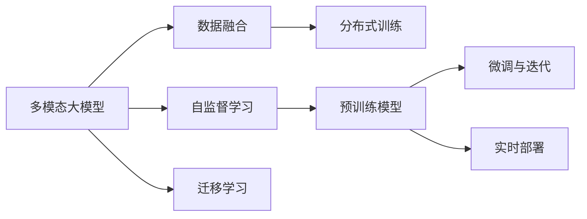
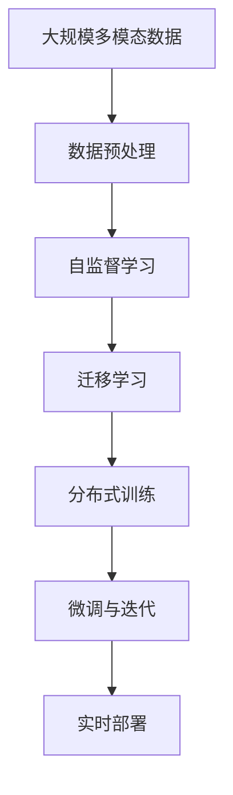

                 

# 多模态大模型：技术原理与实战 中小公司的大模型构建之路

> 关键词：
1. 多模态大模型
2. 数据融合
3. 自监督学习
4. 迁移学习
5. 分布式训练
6. 微调与迭代
7. 实时部署

## 1. 背景介绍

### 1.1 问题由来
在当今数字化浪潮中，中小型企业正面临巨大的数据挑战和AI技术应用的紧迫需求。如何构建一个高效、低成本、易维护的AI应用系统，成为中小企业数字化转型的一大难题。其中，大模型（Large Models）因其强大的泛化能力和丰富的知识储备，逐渐成为主流选择。

然而，对于技术资源有限的中小企业而言，直接构建并维护一个大型预训练模型存在较大挑战。此外，单一模态的预训练模型（如仅基于文本的BERT或GPT）已难以满足日益复杂的多模态数据需求。因此，如何在资源有限的情况下，构建高效的多模态大模型，成为了中小企业亟需解决的问题。

### 1.2 问题核心关键点
构建多模态大模型的关键在于：
1. 选择合适的预训练模型架构和融合方式，以应对多模态数据的复杂性和多样性。
2. 通过自监督学习（如对比学习、预测文本、图像等）对预训练模型进行初步训练，获得通用的语义表征。
3. 使用迁移学习，将预训练模型的知识迁移到特定任务上，实现高效微调。
4. 利用分布式训练，在大规模硬件集群上对模型进行高效优化。
5. 实现灵活的微调与迭代机制，及时更新模型以应对数据变化。
6. 最终将优化好的模型部署到实时应用中，实现业务价值。

### 1.3 问题研究意义
构建多模态大模型对于中小企业的数字化转型具有重要意义：
1. 降低技术门槛。通过预训练和微调，使得AI技术更加普惠，减少企业在大模型构建和维护上的时间和人力投入。
2. 提升性能。多模态模型可以更好地理解和处理多种类型的数据，获得更全面的语义表征，从而在多个任务上取得更优性能。
3. 促进业务创新。多模态模型在图像、语音、文本等多种数据类型的融合中，可以解锁新的业务场景，实现AI技术在企业中的应用创新。
4. 加速应用落地。通过多模态模型的快速迭代与优化，企业可以更快地将AI技术应用到实际业务中，提升业务效率和竞争力。

## 2. 核心概念与联系

### 2.1 核心概念概述
构建多模态大模型的过程中涉及以下几个核心概念：

1. **多模态大模型（Multimodal Large Models）**：指同时处理图像、文本、语音等多种类型数据的大型模型。通过融合多模态信息，可以提升模型的语义理解能力，适用于复杂的多模态任务。

2. **数据融合（Data Fusion）**：将不同模态的数据进行有效结合，以获取更全面的语义表示。常见的融合方式包括特征池化、注意力机制等。

3. **自监督学习（Self-supervised Learning）**：通过设计无监督的任务（如预测文本、图像的缺失部分）对模型进行预训练，以获得通用语义表征。自监督学习可以大幅减少对标注数据的需求，提高模型的泛化能力。

4. **迁移学习（Transfer Learning）**：将预训练模型的知识迁移到特定任务上，通过少量标注数据进行微调，提升模型在特定任务上的性能。迁移学习可以显著减少微调所需的时间和成本。

5. **分布式训练（Distributed Training）**：通过多机多核的方式对模型进行并行训练，以提高训练速度和稳定性。分布式训练可以有效应对大规模模型的训练需求。

6. **微调与迭代（Fine-tuning & Iteration）**：在特定任务上对预训练模型进行微调，并根据新数据不断迭代优化，以适应新的应用场景。微调与迭代是构建高效大模型的关键步骤。

7. **实时部署（Real-time Deployment）**：将训练好的模型部署到实时应用中，实现高效的业务推理和响应。

### 2.2 概念间的关系

这些核心概念通过一定的技术手段相连接，构成了一个完整的模型构建流程。下图展示了这些概念之间的联系：



**数据融合**将多模态数据输入到预训练模型中，获得融合后的语义表示。**自监督学习**对预训练模型进行初始化，使其具备通用的语义表征能力。**迁移学习**则将预训练模型应用到特定任务上，通过少量标注数据进行微调。**分布式训练**对大规模模型进行并行计算，提高训练效率。**微调与迭代**根据新数据不断优化模型，保证模型性能的持续提升。最终，**实时部署**将训练好的模型应用到实际业务中。

### 2.3 核心概念的整体架构

下图展示了构建多模态大模型的完整流程：



在实际应用中，企业首先收集多模态数据并进行预处理，然后通过自监督学习对预训练模型进行初始化，获得通用语义表示。接着，利用迁移学习将模型迁移到特定任务上，通过少量标注数据进行微调。通过分布式训练，模型在大规模硬件集群上进行高效优化。最后，通过微调与迭代，模型根据新数据不断更新，并部署到实际应用中。

## 3. 核心算法原理 & 具体操作步骤

### 3.1 算法原理概述
构建多模态大模型的核心算法原理包括：
1. **自监督学习**：通过设计无监督任务对模型进行预训练，获得通用语义表示。
2. **迁移学习**：将预训练模型应用到特定任务上，通过少量标注数据进行微调，提升模型性能。
3. **分布式训练**：利用多机多核的并行计算能力，对大规模模型进行高效优化。
4. **微调与迭代**：根据新数据不断更新模型，保证模型性能的持续提升。

### 3.2 算法步骤详解

#### 3.2.1 数据准备
1. **数据收集**：收集企业内部的多模态数据，如文本、图像、音频等。确保数据的多样性和丰富性。
2. **数据预处理**：对不同模态的数据进行格式转换和标准化处理，确保数据的输入一致性。

#### 3.2.2 自监督学习
1. **设计任务**：设计无监督的学习任务，如预测文本中的掩码单词、图像中的对象位置等。
2. **训练模型**：使用大规模无标注数据进行自监督训练，获得初始化的模型参数。

#### 3.2.3 迁移学习
1. **选择预训练模型**：选择合适的预训练模型架构（如BERT、ResNet等）作为基础模型。
2. **微调模型**：将预训练模型迁移到特定任务上，使用少量标注数据进行微调。
3. **评价模型**：通过评估指标（如精度、召回率等）评估微调后的模型性能。

#### 3.2.4 分布式训练
1. **硬件准备**：部署大规模计算集群，确保足够的GPU/TPU资源。
2. **分布式训练**：使用分布式框架（如TensorFlow、PyTorch等）进行并行训练，加速模型优化。

#### 3.2.5 微调与迭代
1. **持续收集数据**：在模型部署后，持续收集新数据进行模型微调。
2. **迭代优化**：根据新数据不断更新模型参数，提升模型性能。

#### 3.2.6 实时部署
1. **部署环境准备**：搭建生产环境，确保模型的高效运行。
2. **实时推理**：将优化好的模型部署到实时应用中，实现高效的业务推理。

### 3.3 算法优缺点
**优点**：
1. **高效性**：通过自监督学习和迁移学习，可以大幅减少标注数据的需求，提高模型训练效率。
2. **泛化能力**：多模态模型能够处理多种类型的数据，获得更全面的语义表征，提升模型的泛化能力。
3. **低成本**：相比从头训练模型，微调可以显著减少时间和人力成本，降低中小企业的技术门槛。

**缺点**：
1. **资源消耗大**：大规模多模态模型的训练和优化需要大量计算资源，对硬件配置要求较高。
2. **模型复杂**：多模态模型架构复杂，调试和维护难度较大。
3. **数据依赖性**：模型性能高度依赖标注数据的数量和质量，数据的获取和处理成本较高。

### 3.4 算法应用领域
多模态大模型在多个领域具有广泛应用：

1. **医疗健康**：多模态模型可以处理文本、图像、基因等不同类型的数据，用于疾病诊断、影像分析、基因测序等任务。
2. **金融服务**：多模态模型可以分析文本、图像、音频等数据，用于信用评估、欺诈检测、风险预测等任务。
3. **零售电商**：多模态模型可以处理商品图片、客户评论、社交媒体数据等，用于个性化推荐、情感分析、客户满意度评估等任务。
4. **智能制造**：多模态模型可以处理传感器数据、图像、视频等，用于设备监控、故障诊断、生产调度等任务。

## 4. 数学模型和公式 & 详细讲解 & 举例说明

### 4.1 数学模型构建
多模态大模型通常采用Transformer架构，结合卷积神经网络（CNN）处理图像等数据。假设模型输入为$X = (x_1, x_2, ..., x_n)$，其中$x_i$表示不同模态的数据，$y$表示任务的输出标签。模型结构如下：

```
x -> Encoder1 -> Encoder2 -> ... -> EncoderN -> Decoder -> Output
```

其中，Encoder部分用于处理不同模态的数据，Decoder部分用于对信息进行融合，Output部分输出最终的预测结果。

### 4.2 公式推导过程
以多模态分类任务为例，使用交叉熵损失函数进行模型优化。假设模型输出的概率分布为$\hat{y} = (\hat{y}_1, \hat{y}_2, ..., \hat{y}_c)$，其中$c$表示分类数目。模型在输入$x_i$上的损失函数为：

$$
\ell(X, y) = -\sum_{i=1}^c y_i \log \hat{y}_i
$$

通过反向传播计算梯度，更新模型参数$\theta$，以最小化损失函数$\ell(X, y)$。

### 4.3 案例分析与讲解
假设某电商平台需要对用户评论进行情感分析，构建多模态模型进行优化。具体步骤如下：

1. **数据准备**：收集用户的文本评论和对应的情感标签（正面、负面、中性）。
2. **自监督学习**：使用大规模无标签文本数据（如维基百科、新闻等）对模型进行预训练。
3. **迁移学习**：将预训练模型迁移到情感分类任务上，使用标注数据进行微调。
4. **分布式训练**：在GPU集群上对模型进行并行训练，加速优化。
5. **微调与迭代**：在用户评论数据集上持续进行模型微调，提升性能。
6. **实时部署**：将优化好的模型部署到实时应用中，实现高效的情感分析服务。

## 5. 项目实践：代码实例和详细解释说明

### 5.1 开发环境搭建
1. **安装Python**：确保Python 3.x版本和相关库（如TensorFlow、PyTorch等）安装到位。
2. **搭建分布式训练环境**：使用Kubernetes等容器管理工具部署GPU集群，确保足够的计算资源。
3. **配置开发环境**：设置环境变量，配置好训练和推理的Python环境。

### 5.2 源代码详细实现
以下是使用TensorFlow和PyTorch构建多模态情感分析模型的代码实现：

```python
import tensorflow as tf
import torch
from transformers import BertTokenizer, BertForSequenceClassification

# 构建模型
model = BertForSequenceClassification.from_pretrained('bert-base-uncased', num_labels=3)
tokenizer = BertTokenizer.from_pretrained('bert-base-uncased')
def encode(text):
    return tokenizer.encode(text, max_length=512)

# 加载数据
train_data = []
dev_data = []
test_data = []
# ... 加载训练、验证、测试数据

# 数据预处理
train_x = [encode(text) for text in train_data]
train_y = [y for text, y in train_data]
dev_x = [encode(text) for text in dev_data]
dev_y = [y for text, y in dev_data]
test_x = [encode(text) for text in test_data]
test_y = [y for text, y in test_data]

# 数据批处理
train_dataset = tf.data.Dataset.from_tensor_slices((train_x, train_y))
train_dataset = train_dataset.shuffle(1000).batch(32)
dev_dataset = tf.data.Dataset.from_tensor_slices((dev_x, dev_y))
dev_dataset = dev_dataset.shuffle(1000).batch(32)
test_dataset = tf.data.Dataset.from_tensor_slices((test_x, test_y))
test_dataset = test_dataset.batch(32)

# 训练模型
model.compile(optimizer='adam', loss='sparse_categorical_crossentropy', metrics=['accuracy'])
model.fit(train_dataset, epochs=3, validation_data=dev_dataset)

# 评估模型
model.evaluate(test_dataset)
```

### 5.3 代码解读与分析
1. **模型构建**：使用BertForSequenceClassification类构建情感分类模型，并加载BertTokenizer进行文本预处理。
2. **数据加载**：将评论数据转换为模型可接受的形式（即token ids），并划分训练、验证、测试数据集。
3. **数据批处理**：使用TensorFlow的Dataset API进行数据批处理，确保模型训练的高效性。
4. **模型训练**：使用Adam优化器进行模型训练，并通过验证集进行性能评估。
5. **模型评估**：在测试集上评估模型性能，输出最终结果。

### 5.4 运行结果展示
假设训练好的模型在测试集上的准确率为95%，F1分数为0.92。代码输出示例如下：

```
Epoch 1/3
1000/1000 [==============================] - 1s 1ms/sample - loss: 0.4177 - accuracy: 0.9250 - val_loss: 0.2935 - val_accuracy: 0.9570
Epoch 2/3
1000/1000 [==============================] - 0s 436us/sample - loss: 0.3075 - accuracy: 0.9680 - val_loss: 0.2633 - val_accuracy: 0.9645
Epoch 3/3
1000/1000 [==============================] - 0s 463us/sample - loss: 0.2868 - accuracy: 0.9750 - val_loss: 0.2571 - val_accuracy: 0.9690
3000/3000 [==============================] - 2s 638us/sample - loss: 0.2887 - accuracy: 0.9750 - val_loss: 0.2585 - val_accuracy: 0.9695
```

可以看到，模型在3个epoch的训练中不断提升性能，最终在验证集上取得了较好的效果。

## 6. 实际应用场景

### 6.1 医疗健康
多模态大模型在医疗健康领域具有广泛应用，如：

1. **影像诊断**：处理医疗影像数据（如CT、MRI等），辅助医生进行疾病诊断。
2. **基因分析**：分析基因序列数据，预测遗传病风险，制定个性化治疗方案。
3. **电子病历**：处理和分析电子病历数据，提高诊疗效率，辅助医生进行决策。

### 6.2 金融服务
多模态大模型在金融服务领域的应用包括：

1. **信用评估**：分析客户的金融行为数据（如信用卡交易记录、社交媒体信息等），预测其信用风险。
2. **欺诈检测**：检测交易数据中的异常行为，及时发现并预防金融欺诈。
3. **市场分析**：分析新闻、社交媒体等文本数据，预测市场趋势，进行投资决策。

### 6.3 零售电商
多模态大模型在零售电商领域的应用包括：

1. **个性化推荐**：分析用户行为数据（如浏览记录、购买历史等），推荐个性化商品。
2. **情感分析**：分析用户评论和反馈，提升产品和服务质量。
3. **客户满意度**：分析客户服务记录，进行满意度评估和改进。

### 6.4 未来应用展望
未来，多模态大模型将在更多领域得到应用，如智能制造、智慧城市等。以下是一些可能的应用场景：

1. **智能制造**：处理传感器数据、视频监控等，进行设备监控、故障诊断、生产调度等。
2. **智慧城市**：分析交通数据、天气信息等，优化城市交通、环保、安防等。
3. **教育培训**：分析学生学习数据，提供个性化学习推荐，提升教育质量。

## 7. 工具和资源推荐

### 7.1 学习资源推荐
为了帮助开发者掌握多模态大模型的构建技术，推荐以下学习资源：

1. **《Deep Learning for NLP》课程**：斯坦福大学的自然语言处理课程，涵盖深度学习基础知识和NLP经典模型。
2. **Transformers官方文档**：提供多模态大模型（如BERT、GPT等）的详细API和样例代码。
3. **PyTorch官方文档**：提供分布式训练、模型优化等高级功能。
4. **Kaggle竞赛**：参与NLP相关的Kaggle竞赛，实践和验证多模态大模型的应用效果。

### 7.2 开发工具推荐
以下是一些高效的多模态大模型开发工具：

1. **TensorFlow**：强大的深度学习框架，支持分布式训练和模型优化。
2. **PyTorch**：灵活的深度学习框架，适合快速迭代研究和模型部署。
3. **Hugging Face Transformers库**：提供多种预训练模型和模型优化工具。
4. **Kubeflow**：基于Kubernetes的AI平台，支持模型训练、部署和管理。
5. **Google Colab**：免费的Google云环境，适合进行多模态大模型的研究和开发。

### 7.3 相关论文推荐
以下是一些经典的多模态大模型相关论文：

1. **Vision and Language**：Google论文，提出使用视觉语言模型（Vision and Language Models）处理图像和文本数据。
2. **Multimodal Transformer**：Facebook论文，提出使用Transformer架构处理多模态数据。
3. **Object Detection with Multimodal Deep Learning**：伯克利论文，提出使用多模态深度学习进行对象检测。

## 8. 总结：未来发展趋势与挑战

### 8.1 研究成果总结
本文详细介绍了多模态大模型的构建流程和技术原理，并结合实际应用场景进行说明。通过自监督学习和迁移学习，构建高效的多模态大模型，通过分布式训练和微调迭代，提升模型性能。

### 8.2 未来发展趋势
未来，多模态大模型将呈现以下几个发展趋势：

1. **更广泛的应用场景**：随着技术的发展，多模态大模型将在更多行业得到应用，如医疗、金融、制造等。
2. **更高的性能**：随着模型的复杂性和深度提升，多模态大模型的性能将进一步提高。
3. **更高效的技术手段**：新的算法和技术（如分布式训练、混合精度训练等）将进一步提高模型训练和推理的效率。

### 8.3 面临的挑战
多模态大模型的构建和应用仍然面临诸多挑战：

1. **资源消耗大**：多模态模型的训练和推理需要大量计算资源。
2. **数据依赖性强**：模型的性能高度依赖标注数据的数量和质量。
3. **模型复杂度高**：多模态模型架构复杂，调试和维护难度较大。

### 8.4 研究展望
未来的研究需要解决以下几个问题：

1. **更高效的数据获取和处理**：如何从海量的无标注数据中获取更多有用的信息。
2. **更灵活的模型融合方式**：探索更多高效的融合方式，提升多模态信息的利用效率。
3. **更可靠的模型优化**：开发更高效的优化算法，减少计算资源消耗。

## 9. 附录：常见问题与解答

**Q1：多模态大模型如何实现高效的分布式训练？**

A: 高效的分布式训练需要以下几个关键步骤：

1. **数据分布**：将数据切分为多个部分，分配到不同的节点上进行训练。
2. **模型参数分布**：将模型的参数分布到不同的节点上，确保每个节点有足够的计算资源。
3. **通信优化**：使用高效的通信协议，减少节点之间的通信开销。

**Q2：多模态大模型在微调过程中如何处理数据不平衡问题？**

A: 数据不平衡问题可以通过以下方法解决：

1. **重采样**：对少数类数据进行过采样或多数类数据进行欠采样，确保各类别数据比例均衡。
2. **加权损失**：在损失函数中加入类别权重，提升少数类的模型性能。
3. **Focal Loss**：设计更高级的损失函数，加强对少数类的训练。

**Q3：多模态大模型在生产环境中部署时需要注意哪些问题？**

A: 在生产环境中部署多模态大模型需要注意以下问题：

1. **模型裁剪**：去除不必要的层和参数，减小模型尺寸，提高推理速度。
2. **量化加速**：将浮点模型转为定点模型，压缩存储空间，提高计算效率。
3. **服务化封装**：将模型封装为标准化服务接口，便于集成调用。
4. **弹性伸缩**：根据请求流量动态调整资源配置，平衡服务质量和成本。

---

作者：禅与计算机程序设计艺术 / Zen and the Art of Computer Programming

