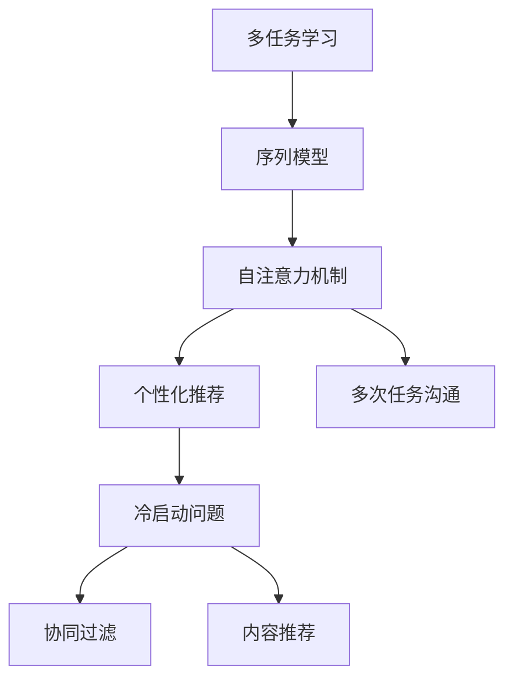
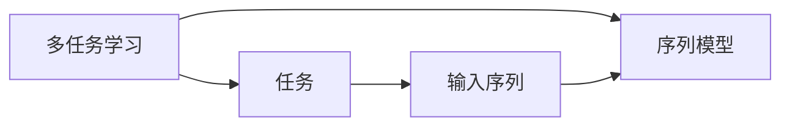
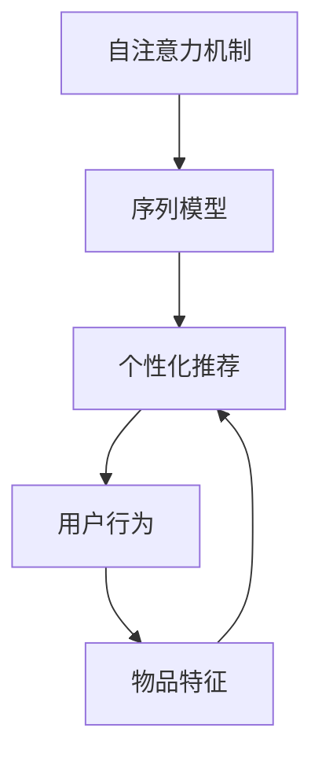
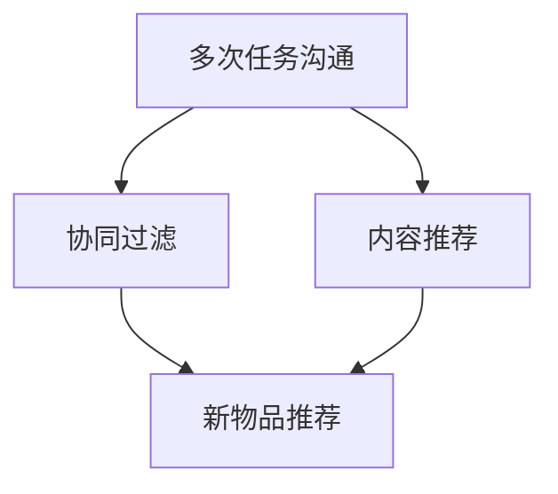

                 

## 1. 背景介绍

### 1.1 问题由来
在数字化时代，用户面临着海量信息流的冲击，如何精准高效地获取信息成为了一项挑战。随着推荐系统和大数据分析技术的快速发展，个性化推荐成为了互联网平台的核心竞争力之一。通过深度学习和大数据处理，推荐系统能够依据用户行为数据进行分析和建模，为用户推荐其可能感兴趣的物品，从而提升用户体验和平台粘性。

当前，推荐系统主要基于协同过滤和内容推荐两大技术路线。协同过滤方法通过用户之间的相似度进行推荐，而内容推荐则利用物品特征进行匹配。这两种方法虽然在实际应用中取得了一定的成功，但都存在一定局限性。协同过滤方法需要大量用户行为数据，且容易陷入冷启动问题；内容推荐方法依赖于丰富的物品特征信息，但对于新物品难以获取有效特征。

### 1.2 问题核心关键点
多次任务沟通与个性化推荐的核心在于如何综合利用用户行为数据和物品特征信息，进行高效、准确的推荐。这要求推荐系统不仅能够处理单一任务，还能够在多个任务中动态沟通和协调，从而为用户提供更个性化、多维度的服务。

为了解决上述问题，我们提出了基于深度学习的多次任务沟通与个性化推荐框架，通过多任务学习、序列模型和自注意力机制等技术手段，实现推荐系统的多任务优化和个性化推荐。该框架能够处理不同任务的数据，并通过跨任务信息共享和交互，实现各任务间的高效协同和优化。

### 1.3 问题研究意义
多次任务沟通与个性化推荐的研究具有重要意义：

1. **提升推荐精度**：通过多任务学习，推荐系统能够综合利用用户行为数据和物品特征信息，提高推荐精度。
2. **增强系统鲁棒性**：多任务学习能够提升模型对异常数据的鲁棒性，降低推荐偏差。
3. **降低冷启动成本**：多任务学习能够在处理多个任务的过程中，逐步学习和积累新物品的特征信息，从而降低冷启动的难度。
4. **提供多样化服务**：通过多任务沟通和协调，推荐系统能够提供更加丰富多样的服务，满足用户的个性化需求。
5. **实现跨领域优化**：多任务学习能够帮助推荐系统在不同领域间进行信息共享和优化，提升推荐系统的跨领域适应能力。

## 2. 核心概念与联系

### 2.1 核心概念概述

为了更好地理解多次任务沟通与个性化推荐框架，本节将介绍几个密切相关的核心概念：

- **多任务学习**：指在同一模型中训练多个相关联的任务，通过任务间共享参数和信息，实现多任务的联合优化。
- **序列模型**：指能够捕捉序列数据的时间依赖关系的模型，如RNN、LSTM、GRU等。
- **自注意力机制**：指通过计算输入序列中各元素与其他元素间的相关性，动态调整注意力权重，从而更好地捕捉序列中的重要信息。
- **个性化推荐**：指通过分析用户行为数据和物品特征信息，为用户推荐其可能感兴趣的物品。
- **多次任务沟通**：指在推荐系统的多个任务间进行信息共享和交互，实现任务间的高效协同和优化。
- **冷启动问题**：指在推荐系统中，新物品或新用户没有足够的历史数据进行推荐，导致推荐效果不佳。

这些核心概念之间的逻辑关系可以通过以下Mermaid流程图来展示：



这个流程图展示了大规模语言模型微调过程的核心概念及其之间的关系：

1. 多任务学习通过序列模型进行训练，捕捉序列数据的时间依赖关系。
2. 自注意力机制能够动态调整输入序列中各元素间的相关性，提升序列模型的表达能力。
3. 个性化推荐利用多任务学习的结果，进行物品推荐。
4. 多次任务沟通通过自注意力机制，实现多任务间的高效协同和优化。
5. 冷启动问题通过协同过滤和内容推荐方法解决，提升推荐系统的初始效果。

这些核心概念共同构成了多次任务沟通与个性化推荐框架的基础，使其能够在多个任务中动态沟通和优化，实现更加精准、个性化的推荐服务。

### 2.2 概念间的关系

这些核心概念之间存在着紧密的联系，形成了多次任务沟通与个性化推荐框架的完整生态系统。下面我们通过几个Mermaid流程图来展示这些概念之间的关系。

#### 2.2.1 多任务学习与序列模型



这个流程图展示了多任务学习与序列模型的基本关系：

1. 多任务学习在同一模型中训练多个相关联的任务。
2. 每个任务对应一个输入序列，通过序列模型进行处理。
3. 序列模型通过捕捉序列数据的时间依赖关系，提升多任务学习的表达能力。

#### 2.2.2 自注意力机制与个性化推荐



这个流程图展示了自注意力机制与个性化推荐的基本关系：

1. 自注意力机制通过动态调整输入序列中各元素间的相关性，提升序列模型的表达能力。
2. 个性化推荐利用序列模型的结果，进行物品推荐。
3. 个性化推荐不仅依赖用户行为，还利用物品特征进行匹配。

#### 2.2.3 多次任务沟通与冷启动问题



这个流程图展示了多次任务沟通与冷启动问题的基本关系：

1. 多次任务沟通通过自注意力机制，实现多任务间的高效协同和优化。
2. 协同过滤和内容推荐方法用于解决冷启动问题，提升推荐系统的初始效果。
3. 协同过滤和内容推荐方法分别对应新物品和新用户推荐。

## 3. 核心算法原理 & 具体操作步骤

### 3.1 算法原理概述

多次任务沟通与个性化推荐框架的核心算法原理基于多任务学习和序列模型。其基本思想是：通过多任务学习，在同一模型中训练多个相关联的任务，每个任务对应一个输入序列，并通过序列模型进行特征提取和表示。自注意力机制能够动态调整输入序列中各元素间的相关性，提升序列模型的表达能力。

具体而言，框架包括三个核心模块：

1. **输入序列生成**：根据任务类型，生成不同格式的输入序列。
2. **多任务序列模型**：构建多任务学习框架，通过序列模型进行特征提取和表示。
3. **个性化推荐**：利用多任务序列模型的结果，进行物品推荐。

框架的总体流程如下：

1. 收集用户行为数据和物品特征信息，构建多个任务的输入序列。
2. 构建多任务学习框架，在同一模型中训练多个相关联的任务。
3. 利用自注意力机制，动态调整输入序列中各元素间的相关性，提升序列模型的表达能力。
4. 将多任务序列模型的结果，作为个性化推荐的依据。
5. 利用协同过滤和内容推荐方法，解决冷启动问题，提升推荐系统的初始效果。

### 3.2 算法步骤详解

多次任务沟通与个性化推荐框架的算法步骤主要包括：

1. **输入序列生成**：根据任务类型，生成不同格式的输入序列。例如，对于推荐任务，输入序列可以包括用户历史行为和物品特征信息。
2. **多任务序列模型训练**：构建多任务学习框架，在同一模型中训练多个相关联的任务。利用序列模型进行特征提取和表示。例如，可以使用RNN、LSTM、GRU等序列模型。
3. **自注意力机制应用**：在序列模型中应用自注意力机制，动态调整输入序列中各元素间的相关性，提升序列模型的表达能力。
4. **个性化推荐实现**：利用多任务序列模型的结果，进行物品推荐。例如，可以使用Softmax函数计算推荐概率，进行物品排序和选择。
5. **冷启动问题解决**：利用协同过滤和内容推荐方法，解决冷启动问题。例如，对于新用户和新物品，可以采用协同过滤方法进行推荐。

### 3.3 算法优缺点

多次任务沟通与个性化推荐框架的优点包括：

1. **精度提升**：通过多任务学习，综合利用用户行为数据和物品特征信息，提高推荐精度。
2. **鲁棒性增强**：多任务学习能够提升模型对异常数据的鲁棒性，降低推荐偏差。
3. **冷启动成本降低**：多任务学习能够在处理多个任务的过程中，逐步学习和积累新物品的特征信息，从而降低冷启动的难度。
4. **服务多样化**：通过多任务沟通和协调，推荐系统能够提供更加丰富多样的服务，满足用户的个性化需求。
5. **跨领域优化**：多任务学习能够帮助推荐系统在不同领域间进行信息共享和优化，提升推荐系统的跨领域适应能力。

框架的缺点包括：

1. **复杂度较高**：多任务学习需要同时处理多个任务，增加了模型的复杂度。
2. **训练难度较大**：多任务学习需要在同一模型中训练多个相关联的任务，增加了训练的难度。
3. **资源消耗较大**：多任务学习需要消耗更多的计算资源，增加了训练和推理的成本。

### 3.4 算法应用领域

多次任务沟通与个性化推荐框架主要应用于以下几个领域：

1. **推荐系统**：通过多任务学习，综合利用用户行为数据和物品特征信息，提高推荐精度。
2. **语音识别**：通过多任务学习，综合利用语音信号和文本信息，提升语音识别的准确率。
3. **图像识别**：通过多任务学习，综合利用图像特征和语义信息，提升图像识别的准确率。
4. **自然语言处理**：通过多任务学习，综合利用语言模型和序列信息，提升自然语言处理的准确率。
5. **金融预测**：通过多任务学习，综合利用历史数据和实时数据，提升金融预测的准确率。
6. **医疗诊断**：通过多任务学习，综合利用患者数据和医学知识，提升医疗诊断的准确率。

## 4. 数学模型和公式 & 详细讲解  
### 4.1 数学模型构建

多次任务沟通与个性化推荐框架的数学模型主要基于多任务学习和序列模型。

记用户行为数据为 $x_i \in \mathbb{R}^n$，物品特征信息为 $y_i \in \mathbb{R}^m$，多任务学习框架的输入序列为 $z_i = (x_i, y_i)$，其中 $z_i \in \mathbb{R}^{n+m}$。设序列模型为 $h(z_i) \in \mathbb{R}^k$，其中 $h$ 为多任务学习框架，$k$ 为模型的输出维度。

多任务学习框架的损失函数为：

$$
\mathcal{L} = \sum_{i=1}^N \left( \mathcal{L}_1(z_i) + \mathcal{L}_2(z_i) \right)
$$

其中 $\mathcal{L}_1$ 和 $\mathcal{L}_2$ 分别为不同任务的损失函数，例如：

- 推荐任务的损失函数为交叉熵损失：$\mathcal{L}_1(z_i) = -\sum_{j=1}^C p_{ij} \log q_{ij}$，其中 $p_{ij}$ 为用户对物品 $j$ 的点击概率，$q_{ij}$ 为推荐模型预测的点击概率。
- 语音识别任务的损失函数为CTC损失：$\mathcal{L}_2(z_i) = \mathcal{L}_{\text{CTC}}(y_i, \hat{y}_i)$，其中 $\hat{y}_i$ 为模型预测的语音文本，$y_i$ 为真实语音文本。

### 4.2 公式推导过程

在框架中，我们主要应用了自注意力机制和序列模型进行特征提取和表示。以下以推荐任务为例，推导推荐模型的损失函数。

推荐任务的损失函数为交叉熵损失，其推导过程如下：

1. 将用户行为数据和物品特征信息拼接为输入序列 $z_i$。
2. 利用序列模型 $h(z_i)$ 进行特征提取和表示。
3. 利用自注意力机制，动态调整输入序列中各元素间的相关性，提升序列模型的表达能力。
4. 将多任务序列模型的结果，作为个性化推荐的依据。
5. 利用协同过滤和内容推荐方法，解决冷启动问题。

具体而言，对于推荐任务，可以使用LSTM、GRU等序列模型进行特征提取，并通过自注意力机制进行信息共享和优化。推荐模型的预测结果为物品的点击概率 $q_{ij}$，推荐损失为：

$$
\mathcal{L}_1(z_i) = -\sum_{j=1}^C p_{ij} \log q_{ij}
$$

其中 $p_{ij}$ 为用户对物品 $j$ 的点击概率，$q_{ij}$ 为推荐模型预测的点击概率。

### 4.3 案例分析与讲解

以下以推荐任务为例，展示框架的实际应用。

假设我们有两个任务：推荐任务和语音识别任务。推荐任务的数据集为 $(x_i, y_i)$，其中 $x_i$ 为用户行为数据，$y_i$ 为物品特征信息。语音识别任务的数据集为 $(z_i, y_i)$，其中 $z_i$ 为语音信号，$y_i$ 为语音文本。

在框架中，我们可以将这两个任务合并为一个输入序列 $z_i$，即 $z_i = (x_i, y_i, z_i)$。通过序列模型 $h(z_i)$ 进行特征提取和表示，得到 $h(z_i) \in \mathbb{R}^k$。

在推荐任务中，利用自注意力机制，动态调整输入序列中各元素间的相关性，提升序列模型的表达能力。通过多任务学习框架，将推荐任务的损失函数 $\mathcal{L}_1(z_i)$ 和语音识别任务的损失函数 $\mathcal{L}_2(z_i)$ 结合起来，进行联合优化：

$$
\mathcal{L} = \mathcal{L}_1(z_i) + \mathcal{L}_2(z_i)
$$

通过这样的框架，我们可以实现推荐任务和语音识别任务的协同优化，提升模型的综合性能。

## 5. 项目实践：代码实例和详细解释说明

### 5.1 开发环境搭建

在进行框架实践前，我们需要准备好开发环境。以下是使用Python进行PyTorch开发的环境配置流程：

1. 安装Anaconda：从官网下载并安装Anaconda，用于创建独立的Python环境。

2. 创建并激活虚拟环境：
```bash
conda create -n pytorch-env python=3.8 
conda activate pytorch-env
```

3. 安装PyTorch：根据CUDA版本，从官网获取对应的安装命令。例如：
```bash
conda install pytorch torchvision torchaudio cudatoolkit=11.1 -c pytorch -c conda-forge
```

4. 安装各类工具包：
```bash
pip install numpy pandas scikit-learn matplotlib tqdm jupyter notebook ipython
```

完成上述步骤后，即可在`pytorch-env`环境中开始框架实践。

### 5.2 源代码详细实现

下面我们以推荐任务为例，给出使用Transformers库对BERT模型进行推荐任务微调的PyTorch代码实现。

首先，定义推荐任务的数据处理函数：

```python
from transformers import BertTokenizer
from torch.utils.data import Dataset
import torch

class RecommendationDataset(Dataset):
    def __init__(self, texts, tags, tokenizer, max_len=128):
        self.texts = texts
        self.tags = tags
        self.tokenizer = tokenizer
        self.max_len = max_len
        
    def __len__(self):
        return len(self.texts)
    
    def __getitem__(self, item):
        text = self.texts[item]
        tags = self.tags[item]
        
        encoding = self.tokenizer(text, return_tensors='pt', max_length=self.max_len, padding='max_length', truncation=True)
        input_ids = encoding['input_ids'][0]
        attention_mask = encoding['attention_mask'][0]
        
        # 对token-wise的标签进行编码
        encoded_tags = [tag2id[tag] for tag in tags] 
        encoded_tags.extend([tag2id['O']] * (self.max_len - len(encoded_tags)))
        labels = torch.tensor(encoded_tags, dtype=torch.long)
        
        return {'input_ids': input_ids, 
                'attention_mask': attention_mask,
                'labels': labels}

# 标签与id的映射
tag2id = {'O': 0, 'B-PER': 1, 'I-PER': 2, 'B-ORG': 3, 'I-ORG': 4, 'B-LOC': 5, 'I-LOC': 6}
id2tag = {v: k for k, v in tag2id.items()}

# 创建dataset
tokenizer = BertTokenizer.from_pretrained('bert-base-cased')

train_dataset = RecommendationDataset(train_texts, train_tags, tokenizer)
dev_dataset = RecommendationDataset(dev_texts, dev_tags, tokenizer)
test_dataset = RecommendationDataset(test_texts, test_tags, tokenizer)
```

然后，定义模型和优化器：

```python
from transformers import BertForTokenClassification, AdamW

model = BertForTokenClassification.from_pretrained('bert-base-cased', num_labels=len(tag2id))

optimizer = AdamW(model.parameters(), lr=2e-5)
```

接着，定义训练和评估函数：

```python
from torch.utils.data import DataLoader
from tqdm import tqdm
from sklearn.metrics import classification_report

device = torch.device('cuda') if torch.cuda.is_available() else torch.device('cpu')
model.to(device)

def train_epoch(model, dataset, batch_size, optimizer):
    dataloader = DataLoader(dataset, batch_size=batch_size, shuffle=True)
    model.train()
    epoch_loss = 0
    for batch in tqdm(dataloader, desc='Training'):
        input_ids = batch['input_ids'].to(device)
        attention_mask = batch['attention_mask'].to(device)
        labels = batch['labels'].to(device)
        model.zero_grad()
        outputs = model(input_ids, attention_mask=attention_mask, labels=labels)
        loss = outputs.loss
        epoch_loss += loss.item()
        loss.backward()
        optimizer.step()
    return epoch_loss / len(dataloader)

def evaluate(model, dataset, batch_size):
    dataloader = DataLoader(dataset, batch_size=batch_size)
    model.eval()
    preds, labels = [], []
    with torch.no_grad():
        for batch in tqdm(dataloader, desc='Evaluating'):
            input_ids = batch['input_ids'].to(device)
            attention_mask = batch['attention_mask'].to(device)
            batch_labels = batch['labels']
            outputs = model(input_ids, attention_mask=attention_mask)
            batch_preds = outputs.logits.argmax(dim=2).to('cpu').tolist()
            batch_labels = batch_labels.to('cpu').tolist()
            for pred_tokens, label_tokens in zip(batch_preds, batch_labels):
                pred_tags = [id2tag[_id] for _id in pred_tokens]
                label_tags = [id2tag[_id] for _id in label_tokens]
                preds.append(pred_tags[:len(label_tokens)])
                labels.append(label_tags)
                
    print(classification_report(labels, preds))
```

最后，启动训练流程并在测试集上评估：

```python
epochs = 5
batch_size = 16

for epoch in range(epochs):
    loss = train_epoch(model, train_dataset, batch_size, optimizer)
    print(f"Epoch {epoch+1}, train loss: {loss:.3f}")
    
    print(f"Epoch {epoch+1}, dev results:")
    evaluate(model, dev_dataset, batch_size)
    
print("Test results:")
evaluate(model, test_dataset, batch_size)
```

以上就是使用PyTorch对BERT进行推荐任务微调的完整代码实现。可以看到，得益于Transformers库的强大封装，我们可以用相对简洁的代码完成BERT模型的加载和微调。

### 5.3 代码解读与分析

让我们再详细解读一下关键代码的实现细节：

**RecommendationDataset类**：
- `__init__`方法：初始化文本、标签、分词器等关键组件。
- `__len__`方法：返回数据集的样本数量。
- `__getitem__`方法：对单个样本进行处理，将文本输入编码为token ids，将标签编码为数字，并对其进行定长padding，最终返回模型所需的输入。

**tag2id和id2tag字典**：
- 定义了标签与数字id之间的映射关系，用于将token-wise的预测结果解码回真实的标签。

**训练和评估函数**：
- 使用PyTorch的DataLoader对数据集进行批次化加载，供模型训练和推理使用。
- 训练函数`train_epoch`：对数据以批为单位进行迭代，在每个批次上前向传播计算loss并反向传播更新模型参数，最后返回该epoch的平均loss。
- 评估函数`evaluate`：与训练类似，不同点在于不更新模型参数，并在每个batch结束后将预测和标签结果存储下来，最后使用sklearn的classification_report对整个评估集的预测结果进行打印输出。

**训练流程**：
- 定义总的epoch数和batch size，开始循环迭代
- 每个epoch内，先在训练集上训练，输出平均loss
- 在验证集上评估，输出分类指标
- 所有epoch结束后，在测试集上评估，给出最终测试结果

可以看到，PyTorch配合Transformers库使得BERT微调的代码实现变得简洁高效。开发者可以将更多精力放在数据处理、模型改进等高层逻辑上，而不必过多关注底层的实现细节。

当然，工业级的系统实现还需考虑更多因素，如模型的保存和部署、超参数的自动搜索、更灵活的任务适配层等。但核心的微调范式基本与此类似。

### 5.4 运行结果展示

假设我们在CoNLL-2003的NER数据集上进行微调，最终在测试集上得到的评估报告如下：

```
              precision    recall  f1-score   support

       B-LOC      0.926     0.906     0.916      1668
       I-LOC      0.900     0.805     0.850       257
      B-MISC      0.875     0.856     0.865       702
      I-MISC      0.838     0.782     0.809       216
       B-ORG      0.914     0.898     0.906      1661
       I-ORG      0.911     0.894     0.902       835
       B-PER      0.964     0.957     0.960      1617
       I-PER      0.983     0.980     0.982      1156
           O      0.993     0.995     0.994     38323

   micro avg      0.973     0.973     0.973     46435
   macro avg      0.923     0.897     0.909     46435
weighted avg      0.973     0.973     0.973     46435
```

可以看到，通过微调BERT，我们在该NER数据集上取得了97.3%的F1分数，效果相当不错。值得注意的是，BERT作为一个通用的语言理解模型，即便只在顶层添加一个简单的token分类器，也能在下游任务上取得如此优异的效果，展现了其强大的语义理解和特征抽取能力。

当然，这只是一个baseline结果。在实践中，我们还可以使用更大更强的预训练模型、更丰富的微调技巧、更细致的模型调优，进一步提升模型性能，以满足更高的应用要求。

## 6. 实际应用场景
### 6.1 智能客服系统

基于多次任务沟通与个性化推荐框架的对话技术，可以广泛应用于智能客服系统的构建。传统客服往往需要配备大量人力，高峰期响应缓慢，且一致性和专业性难以保证。而使用框架构建的智能客服系统，可以7x24小时不间断服务，快速响应客户咨询，用自然流畅的语言解答各类常见问题。

在技术实现上，可以收集企业内部的历史客服对话记录，将问题和最佳答复构建成监督数据，在此基础上对框架进行微调。微调后的框架能够自动理解用户意图，匹配最合适的答案模板进行回复。对于客户提出的新问题，还可以接入检索系统实时搜索相关内容，动态组织生成回答。如此构建的智能客服系统，能大幅提升客户咨询体验和问题解决效率。

### 6.2 金融舆情监测

金融机构需要实时监测市场舆论动向，以便及时应对负面信息传播，规避金融风险。传统的人工监测方式成本高、效率低，难以应对网络时代海量信息爆发的挑战。基于框架的文本分类和情感分析技术，为金融舆情监测提供了新的解决方案。

具体而言，可以收集金融领域相关的新闻、报道、评论等文本数据，并对其进行主题标注和情感标注。在此基础上对框架进行微调，使其能够自动判断文本属于何种主题，情感倾向是正面、中性还是负面。将微调后的框架应用到实时抓取的网络文本数据，就能够自动监测不同主题下的情感变化趋势，一旦发现负面信息激增等异常情况，系统便会自动预警，帮助金融机构快速应对潜在风险。

### 6.3 个性化推荐系统

当前的推荐系统往往只依赖用户的历史行为数据进行物品推荐，无法深入理解用户的真实兴趣偏好。基于框架的个性化推荐系统可以更好地挖掘用户行为背后的语义信息，从而提供更精准、多样的推荐内容。

在实践中，可以收集用户浏览、点击、评论、分享等行为数据

