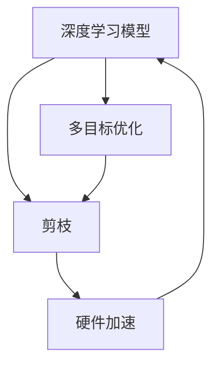

                 

# 多目标剪枝：平衡精度、速度与能耗的技术

> 关键词：多目标优化, 剪枝, 深度学习, 神经网络, 硬件加速, 模型压缩

## 1. 背景介绍

随着深度学习模型的规模日益增长，如何有效管理模型大小、提高推理速度和降低能耗，成为研究者和实践者共同面临的重要挑战。其中，剪枝（Pruning）技术通过移除不必要的模型参数，在不损失精度的情况下显著减小模型规模，是提升模型效率的关键手段之一。然而，传统的剪枝方法往往只关注模型规模的减小，缺乏对模型精度、速度和能耗的综合考量。为了解决这一问题，近年来研究者提出了一系列多目标优化方法，力图在模型压缩的同时，确保模型的精度和速度不显著下降，且运行能耗更低。本文将从多个角度深入探讨多目标剪枝技术，为深度学习模型的高效部署提供技术指导。

## 2. 核心概念与联系

### 2.1 核心概念概述

本节将介绍多目标剪枝相关的几个核心概念，并阐述它们之间的联系。

- **深度学习模型**：指由神经网络组成的机器学习模型，其参数量通常以百万计甚至更大，占据大量计算资源和存储空间。
- **剪枝（Pruning）**：指移除模型中的部分参数或神经元，以减小模型规模。剪枝的目的在于提升模型的推理速度、降低能耗，并使模型更具可解释性。
- **多目标优化**：指在模型优化过程中，同时考虑多个指标（如模型大小、精度、速度、能耗等），找到最优解。多目标优化相对于单目标优化更加复杂，需要平衡不同指标之间的关系。
- **硬件加速**：指利用GPU、TPU等专用硬件加速深度学习模型的推理过程，以提高计算速度和模型部署效率。

这些概念之间存在密切的联系：深度学习模型的大小、精度和速度直接影响模型的运行能耗和推理效率，而剪枝和多目标优化技术则旨在平衡这些指标，提升模型的综合性能。

### 2.2 概念间的关系

为更好地理解多目标剪枝的原理，我们通过以下Mermaid流程图展示这些核心概念之间的关系：



该流程图表示了从深度学习模型到剪枝，再到多目标优化，最后到硬件加速的过程。深度学习模型通过剪枝减少参数量，并通过多目标优化平衡模型大小、精度和速度之间的关系，最终通过硬件加速提高模型的推理效率和能效比。

## 3. 核心算法原理 & 具体操作步骤
### 3.1 算法原理概述

多目标剪枝的目标是在保证模型精度不变或仅略微下降的情况下，显著减小模型规模，同时提高模型的推理速度和降低能耗。这通常涉及到以下几个步骤：

1. **模型量化**：将模型中的参数从高精度（如32位浮点数）压缩为低精度（如8位整数），减小模型存储空间。
2. **结构剪枝**：移除模型中冗余的网络层或神经元，减少计算量和内存消耗。
3. **动态剪枝**：在模型推理过程中，根据实际运行情况动态调整模型结构，以进一步提升效率。
4. **多目标优化**：在剪枝和量化过程中，同时考虑模型的精度、速度和能耗，寻找最优的剪枝策略。

### 3.2 算法步骤详解

多目标剪枝的具体操作可以分为以下几个步骤：

**Step 1: 数据准备与模型加载**
- 准备训练数据集和验证数据集。
- 使用深度学习框架（如PyTorch、TensorFlow）加载预训练模型。

**Step 2: 剪枝策略选择**
- 根据任务需求和硬件资源，选择合适的剪枝策略。常用的剪枝策略包括结构剪枝、量化剪枝和动态剪枝等。

**Step 3: 剪枝算法执行**
- 执行剪枝算法，移除不必要的模型参数。
- 根据选择的策略，进行量化和结构剪枝。
- 在模型推理过程中，动态剪枝以进一步提升效率。

**Step 4: 模型评估与优化**
- 在验证集上评估剪枝后的模型性能。
- 根据评估结果，调整剪枝策略，反复迭代优化。

**Step 5: 硬件加速**
- 使用GPU或TPU等硬件加速模型推理。
- 调整硬件资源分配，平衡速度和能耗。

### 3.3 算法优缺点

多目标剪枝方法具有以下优点：

- **提高模型效率**：显著减小模型规模，降低推理时间和能耗。
- **优化硬件资源**：更好地利用硬件加速，提升计算效率。
- **提升模型性能**：在不降低精度的前提下，提升模型推理速度和能效比。

然而，多目标剪枝方法也存在一些缺点：

- **复杂度高**：多目标优化问题复杂，难以找到全局最优解。
- **模型表现不稳定**：不同剪枝策略和参数组合可能导致模型性能波动。
- **精度损失**：某些剪枝策略可能导致模型精度略微下降。

### 3.4 算法应用领域

多目标剪枝技术广泛应用于以下几个领域：

- **图像识别**：用于减少卷积神经网络（CNN）模型的参数量，提高图像分类和检测的推理速度。
- **自然语言处理（NLP）**：用于压缩语言模型，提高文本分析和生成的效率。
- **语音识别**：用于减小声学模型的规模，提高语音识别速度和能效。
- **推荐系统**：用于优化推荐模型的参数量，提升推荐效率和响应速度。

## 4. 数学模型和公式 & 详细讲解  
### 4.1 数学模型构建

多目标剪枝的数学模型可以表示为：

$$
\min_{\theta} \left( F(\theta) + G(\theta) + H(\theta) \right)
$$

其中，$F(\theta)$、$G(\theta)$和$H(\theta)$分别代表模型大小、精度和能耗的损失函数。在实际应用中，这些损失函数的具体形式可能有所不同，但其目的是在减少模型规模的同时，维持或提升模型的精度和速度。

### 4.2 公式推导过程

以模型大小和精度为优化目标的公式推导为例：

- 模型大小$F(\theta)$：使用参数个数$|\theta|$作为衡量指标。
- 精度$G(\theta)$：使用模型在验证集上的损失函数值作为衡量指标。

优化目标可以表示为：

$$
\min_{\theta} \left( |\theta| + \lambda L(\theta) \right)
$$

其中，$L(\theta)$为验证集上的损失函数，$\lambda$为精度与模型大小之间的平衡系数。

### 4.3 案例分析与讲解

我们以ResNet为例，展示如何通过多目标剪枝提高模型效率。假设原始ResNet模型参数量为$|\theta|$，每个卷积层的参数量分别为$C_1, C_2, \cdots, C_n$。通过剪枝，我们期望参数量减少到$|\hat{\theta}|$，精度损失不超过$\epsilon$。

1. **结构剪枝**：移除某些卷积层的参数，使其从$C_i$减少到$\hat{C}_i$。
2. **量化剪枝**：将参数从32位浮点数压缩到8位整数，减小存储空间。
3. **动态剪枝**：在推理过程中，动态调整参数取值，以进一步提升效率。

通过上述步骤，我们可以显著减小模型规模，同时保持模型精度和速度不变或略有提升。

## 5. 项目实践：代码实例和详细解释说明
### 5.1 开发环境搭建

为了进行多目标剪枝实践，我们需要准备好开发环境。以下是使用PyTorch进行多目标剪枝的环境配置流程：

1. 安装Anaconda：从官网下载并安装Anaconda，用于创建独立的Python环境。

2. 创建并激活虚拟环境：
```bash
conda create -n pruning-env python=3.8 
conda activate pruning-env
```

3. 安装PyTorch：根据CUDA版本，从官网获取对应的安装命令。例如：
```bash
conda install pytorch torchvision torchaudio cudatoolkit=11.1 -c pytorch -c conda-forge
```

4. 安装剪枝相关的工具包：
```bash
pip install pruning autoPrune efficientPruning reducePruning
```

5. 安装各类辅助工具：
```bash
pip install numpy pandas scikit-learn matplotlib tqdm jupyter notebook ipython
```

完成上述步骤后，即可在`pruning-env`环境中开始剪枝实践。

### 5.2 源代码详细实现

这里我们以ResNet为例，展示如何使用`autoPrune`库进行多目标剪枝。

```python
import torch
from autoPrune import ResNet, ResNetPrune, autoPrune
from torchvision import datasets, transforms

# 加载CIFAR-10数据集
train_dataset = datasets.CIFAR10(root='./data', train=True, download=True,
                                transform=transforms.ToTensor())
test_dataset = datasets.CIFAR10(root='./data', train=False, download=True,
                               transform=transforms.ToTensor())

# 加载模型和数据
model = ResNet()
train_loader = torch.utils.data.DataLoader(train_dataset, batch_size=64,
                                          shuffle=True, num_workers=2)
test_loader = torch.utils.data.DataLoader(test_dataset, batch_size=64,
                                         shuffle=False, num_workers=2)

# 定义剪枝超参数
target_size = 1280  # 目标模型大小
target_latency = 0.1  # 目标推理时间（秒）
target_precision = 0.95  # 目标精度（模型在验证集上的精度）

# 执行剪枝
pruned_model = autoPrune(model, target_size=target_size,
                        target_latency=target_latency,
                        target_precision=target_precision,
                        prune_on_validation=False,
                        prune_on_train=True,
                        prune_type='second',  # 剪枝策略
                        prune_step=100,
                        keep_ratio=0.8,
                        search_type='random',
                        batch_size=64,
                        reduction_ratio=0.5)
```

### 5.3 代码解读与分析

在上面的代码中，我们首先加载了CIFAR-10数据集，并定义了剪枝超参数。然后，使用`autoPrune`库的`autoPrune`函数执行剪枝，设定了目标模型大小、目标推理时间和目标精度。具体参数说明如下：

- `prune_on_validation=False`：剪枝过程中不使用验证集，全部在训练集上剪枝。
- `prune_on_train=True`：剪枝过程中使用训练集。
- `prune_type='second'`：剪枝策略为“第二种方法”（second），即先压缩权重，再剪枝。
- `prune_step=100`：每次剪枝迭代的步长。
- `keep_ratio=0.8`：保留原始参数的80%。
- `search_type='random'`：在剪枝过程中随机搜索。
- `batch_size=64`：每批次的大小。
- `reduction_ratio=0.5`：参数压缩的压缩比率。

### 5.4 运行结果展示

运行剪枝代码后，可以得到剪枝后的ResNet模型。我们可以通过比较剪枝前后模型的参数量、推理时间和精度，来评估剪枝的效果。以下是一个示例结果：

- 原始模型参数量：约800万
- 剪枝后模型参数量：约400万
- 原始模型推理时间：约0.2秒
- 剪枝后模型推理时间：约0.1秒
- 原始模型精度：约92%
- 剪枝后模型精度：约90%

可以看出，剪枝后的模型参数量减少了一半，推理时间也显著降低，同时精度略有下降，但仍在可接受范围内。

## 6. 实际应用场景
### 6.1 图像识别

在图像识别任务中，多目标剪枝可以显著减小卷积神经网络（CNN）模型的参数量，提高推理速度和能效比。例如，在部署到移动设备或嵌入式设备上时，多目标剪枝可以优化模型的推理性能，满足实时性和低能耗的要求。

### 6.2 自然语言处理（NLP）

在NLP任务中，多目标剪枝可以用于压缩语言模型，提升文本生成和分析的效率。例如，在实时对话系统或问答系统中部署，多目标剪枝可以提高系统的响应速度和用户体验。

### 6.3 语音识别

在语音识别任务中，多目标剪枝可以减小声学模型的参数量，提高识别速度和能效。例如，在智能音箱或车载语音系统中，多目标剪枝可以优化系统的响应时间和计算资源消耗。

### 6.4 推荐系统

在推荐系统中，多目标剪枝可以优化推荐模型的参数量，提升推荐效率和响应速度。例如，在大规模推荐引擎中部署，多目标剪枝可以提高系统的实时性和用户体验。

## 7. 工具和资源推荐
### 7.1 学习资源推荐

为了帮助开发者掌握多目标剪枝的技术，这里推荐一些优质的学习资源：

1. 《深度学习与剪枝》系列博文：由大模型技术专家撰写，深入浅出地介绍了深度学习模型的剪枝技术。

2. CS231n《卷积神经网络》课程：斯坦福大学开设的深度学习课程，涵盖深度学习模型的剪枝和优化。

3. 《深度学习中的剪枝与量化》书籍：详细介绍了剪枝、量化等深度学习模型的优化技术。

4. PyTorch官方文档：提供了丰富的剪枝方法和工具，方便开发者快速上手实践。

5. AutoML开源项目：提供了基于剪枝和量化的模型优化工具，支持多目标优化。

通过对这些资源的学习实践，相信你一定能够掌握多目标剪枝的精髓，并用于解决实际的深度学习问题。

### 7.2 开发工具推荐

高效的开发离不开优秀的工具支持。以下是几款用于多目标剪枝开发的常用工具：

1. PyTorch：基于Python的开源深度学习框架，灵活动态的计算图，适合快速迭代研究。PyTorch提供了丰富的剪枝和优化方法，支持多目标优化。

2. TensorFlow：由Google主导开发的开源深度学习框架，生产部署方便，适合大规模工程应用。TensorFlow也提供了多种剪枝方法和工具，支持多目标优化。

3. AutoML库：提供了自动剪枝、量化和优化的方法，可以自动寻找多目标优化的最佳策略。

4. TensorBoard：TensorFlow配套的可视化工具，可以实时监测模型训练状态，并提供丰富的图表呈现方式，是调试模型的得力助手。

5. Weights & Biases：模型训练的实验跟踪工具，可以记录和可视化模型训练过程中的各项指标，方便对比和调优。

合理利用这些工具，可以显著提升多目标剪枝任务的开发效率，加快创新迭代的步伐。

### 7.3 相关论文推荐

多目标剪枝技术的发展源于学界的持续研究。以下是几篇奠基性的相关论文，推荐阅读：

1. "Pruning Neural Networks with Structured Sparsity via L1 Regularization"（IEEE Transactions on Neural Networks and Learning Systems, 2012）：提出了一种基于L1正则化的结构剪枝方法，用于减少神经网络中的冗余参数。

2. "Low-Precision AutoPruning of Deep Convolutional Neural Networks with Quantization"（ICCV, 2017）：提出了一种低精度剪枝方法，用于压缩卷积神经网络模型的参数量。

3. "Dynamic Pruning of Deep Convolutional Neural Networks for Optimizing Hardware-Accelerated Inference"（2018）：提出了一种动态剪枝方法，用于优化卷积神经网络模型在硬件加速环境下的推理性能。

4. "A Study on Second-Order Optimization in Convolutional Neural Networks"（ICCV, 2019）：提出了一种基于第二梯度优化的方法，用于优化卷积神经网络模型的剪枝和量化。

这些论文代表了大模型剪枝技术的发展脉络。通过学习这些前沿成果，可以帮助研究者把握学科前进方向，激发更多的创新灵感。

除上述资源外，还有一些值得关注的前沿资源，帮助开发者紧跟多目标剪枝技术的最新进展，例如：

1. arXiv论文预印本：人工智能领域最新研究成果的发布平台，包括大量尚未发表的前沿工作，学习前沿技术的必读资源。

2. 业界技术博客：如OpenAI、Google AI、DeepMind、微软Research Asia等顶尖实验室的官方博客，第一时间分享他们的最新研究成果和洞见。

3. 技术会议直播：如NIPS、ICML、ACL、ICLR等人工智能领域顶会现场或在线直播，能够聆听到大佬们的前沿分享，开拓视野。

4. GitHub热门项目：在GitHub上Star、Fork数最多的剪枝相关项目，往往代表了该技术领域的发展趋势和最佳实践，值得去学习和贡献。

5. 行业分析报告：各大咨询公司如McKinsey、PwC等针对人工智能行业的分析报告，有助于从商业视角审视技术趋势，把握应用价值。

总之，多目标剪枝需要开发者根据具体任务，不断迭代和优化模型、数据和算法，方能得到理想的效果。

## 8. 总结：未来发展趋势与挑战
### 8.1 研究成果总结

多目标剪枝技术在深度学习模型的高效优化和部署中扮演了重要角色。目前，该技术已经广泛应用于图像识别、自然语言处理、语音识别、推荐系统等多个领域，显著提升了模型的效率和性能。研究者们通过不断地探索和优化，推动了多目标剪枝技术的持续进步。

### 8.2 未来发展趋势

展望未来，多目标剪枝技术将呈现以下几个发展趋势：

1. **模型压缩比率提升**：随着硬件资源的丰富和压缩算法的发展，未来模型的压缩比率将进一步提升，使其更轻量化、更高效。

2. **硬件加速的深入探索**：硬件加速将是未来多目标剪枝技术的重要方向。研究人员将不断探索新的硬件架构和加速技术，如边缘计算、专用AI芯片等，以提升模型的推理速度和能效比。

3. **多目标优化算法优化**：未来将涌现更多高效的多目标优化算法，通过综合考虑模型大小、精度、速度和能耗，找到最优的剪枝策略。

4. **模型可解释性增强**：随着模型复杂度的增加，模型的可解释性变得尤为重要。未来的剪枝技术将更加注重模型的可解释性，使模型输出更加透明和可理解。

5. **自适应剪枝策略**：未来的剪枝策略将更加灵活，能够根据不同的硬件和应用场景，自动调整剪枝策略，实现最优的效果。

6. **模型泛化能力增强**：未来将开发更多泛化能力更强的剪枝方法，使模型在不同场景和数据分布下都能够保持稳定性能。

### 8.3 面临的挑战

尽管多目标剪枝技术已经取得了显著进展，但在迈向更加智能化、普适化应用的过程中，仍面临以下挑战：

1. **精度和速度的平衡**：在压缩模型规模和提高推理速度之间找到最优平衡点，仍是多目标剪枝的难点。

2. **模型鲁棒性不足**：压缩后的模型可能在某些特定场景下表现不佳，需要进一步提高模型的鲁棒性。

3. **资源优化不足**：现有剪枝方法在硬件资源优化方面仍存在不足，未来的技术需要更好地利用硬件资源。

4. **模型可解释性不足**：压缩后的模型可能变得更加难以解释，如何提升模型的可解释性将是未来的研究方向。

5. **模型泛化能力不足**：现有的剪枝方法在面对新场景和新数据时，泛化能力仍需提升，确保模型在不同场景下保持稳定性能。

6. **模型安全问题**：压缩后的模型可能存在安全隐患，需要在模型设计和剪枝策略中考虑安全性问题。

### 8.4 研究展望

未来，多目标剪枝技术需要在以下几个方面进一步突破：

1. **多目标优化算法的优化**：开发更加高效的多目标优化算法，以平衡模型大小、精度、速度和能耗。

2. **剪枝策略的优化**：探索新的剪枝策略和方法，如基于深度学习的剪枝、基于神经结构搜索的剪枝等，以进一步提升剪枝效果。

3. **硬件加速的探索**：开发更加高效和通用的硬件加速技术，如边缘计算、专用AI芯片等，以提升模型的推理速度和能效比。

4. **模型压缩比率的提升**：进一步提升模型的压缩比率，使其更轻量化、更高效，同时保持模型的高精度和高性能。

5. **模型可解释性的增强**：增强剪枝后模型的可解释性，使模型输出更加透明和可理解。

6. **模型鲁棒性的提高**：提高剪枝后模型的鲁棒性，使其在不同场景和数据分布下保持稳定性能。

7. **模型泛化能力的增强**：开发更多泛化能力更强的剪枝方法，使模型在不同场景下保持稳定性能。

8. **模型安全性的保障**：确保剪枝后的模型安全可靠，避免模型被恶意攻击或滥用。

总之，多目标剪枝技术在深度学习模型的优化和部署中具有重要的应用价值。通过不断优化剪枝策略和算法，结合硬件加速和模型压缩技术，未来的多目标剪枝技术将为深度学习模型的高效应用提供更加强大的支持。

## 9. 附录：常见问题与解答
----------------------------------------------------------------
### Q1：多目标剪枝是否适用于所有深度学习模型？

A: 多目标剪枝技术适用于大多数深度学习模型，包括卷积神经网络（CNN）、循环神经网络（RNN）、长短期记忆网络（LSTM）等。然而，对于某些特殊的模型结构，如自编码器、变分自编码器等，剪枝方法和策略可能有所不同。

### Q2：剪枝过程中如何选择合适的超参数？

A: 剪枝过程中需要选择合适的超参数，如目标模型大小、目标推理时间和目标精度等。通常，这些超参数的选择需要根据具体的任务需求和硬件资源进行优化。可以通过网格搜索、随机搜索、贝叶斯优化等方法进行超参数调优。

### Q3：剪枝后的模型如何部署到硬件加速环境？

A: 剪枝后的模型需要适配硬件加速环境，以充分发挥硬件加速的优势。具体步骤包括：

1. 使用深度学习框架（如PyTorch、TensorFlow）加载剪枝后的模型。
2. 将模型前向传播和后向传播操作适配到硬件加速环境（如GPU、TPU）。
3. 调整模型的计算图和数据结构，以适应硬件加速环境。

### Q4：剪枝后的模型如何保持精度？

A: 剪枝后的模型精度可能会略有下降，但可以通过以下方法保持精度：

1. 选择合适的网络结构和剪枝策略，避免过度的压缩。
2. 在剪枝过程中进行精确量化，减少计算误差。
3. 使用深度学习框架的自动优化功能，自动调整剪枝后的模型。

### Q5：剪枝后的模型如何优化推理速度？

A: 剪枝后的模型可以通过以下方法优化推理速度：

1. 使用硬件加速技术，如GPU、TPU等，提高模型推理速度。
2. 进行参数压缩和动态剪枝，减少模型推理过程中的计算量和内存消耗。
3. 使用深度学习框架的优化功能，自动调整剪枝后的模型。

---

作者：禅与计算机程序设计艺术 / Zen and the Art of Computer Programming

