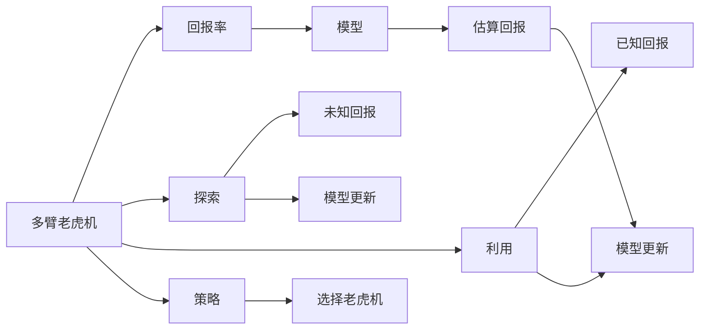
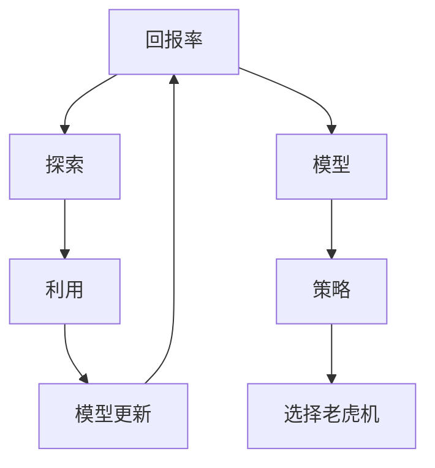

                 

# 多臂老虎机问题 (Multi-Armed Bandit Problem) 原理与代码实例讲解

多臂老虎机问题（Multi-Armed Bandit Problem, MAB）是强化学习（Reinforcement Learning, RL）领域中最经典且有趣的问题之一，其核心在于如何在不确定的环境中寻找最有利于回报的策略。本文将从背景介绍、核心概念、算法原理、代码实现和应用展望等多个方面全面讲解多臂老虎机问题，并结合实际案例深入解析。

## 1. 背景介绍

### 1.1 问题由来

多臂老虎机问题起源于20世纪30年代的纸牌游戏中，旨在模拟赌徒在多个老虎机之间分配投币的过程，选择哪只老虎机最有可能带来收益。该问题源于现实生活中的各种选择场景，如投资组合优化、广告点击率（CTR）预测、游戏设计等。

### 1.2 问题核心关键点

多臂老虎机问题的关键点在于：

1. **回报率（Reward）**：每只老虎机都有其自身的回报率，即每次操作可以获得的奖励。
2. **不确定性（Uncertainty）**：无法预先知道每只老虎机的回报率，需要通过实验来探索。
3. **探索与利用（Exploration vs. Exploitation）**：需要在探索未知回报与利用已知回报之间进行平衡。
4. **模型与策略（Model & Strategy）**：需要设计有效的模型和策略来最大化长期回报。

## 2. 核心概念与联系

### 2.1 核心概念概述

- **多臂老虎机（Multi-Armed Bandit）**：有多个不同回报率的老虎机，每个老虎机都有一个“拉杆”（arm）。玩家需要不断尝试不同老虎机的拉杆，以最大化总收益。
- **回报率（Reward）**：每只老虎机在每次操作后的回报，通常为正或负。
- **探索（Exploration）**：尝试未知的老虎机以获取更多的回报信息。
- **利用（Exploitation）**：选择已知的、回报较高的老虎机以获取即时回报。
- **模型（Model）**：用于估算每只老虎机的回报率。
- **策略（Strategy）**：决定在每次操作中应选择哪只老虎机的策略。

### 2.2 概念间的关系

这些核心概念之间的逻辑关系可以通过以下Mermaid流程图来展示：



这个流程图展示了多臂老虎机问题中的关键环节：

1. 多臂老虎机（A）由回报率（B）、探索（C）、利用（D）、模型（G）和策略（K）组成。
2. 探索和利用（C、D）通过未知回报（E）和已知回报（F）与模型（G）交互，实现回报率的估算和模型更新。
3. 策略（K）根据回报率和模型估算的结果，决定每次操作选择哪只老虎机（L）。

### 2.3 核心概念的整体架构

最后，我们用一个综合的流程图来展示这些核心概念在大臂老虎机问题中的整体架构：



这个综合流程图展示了从回报率到策略的选择流程，展示了探索、利用、模型更新等关键环节的相互作用。通过这个架构，我们可以更好地理解多臂老虎机问题的整体运作机制。

## 3. 核心算法原理 & 具体操作步骤

### 3.1 算法原理概述

多臂老虎机问题的核心在于如何通过策略（如轮询、固定间隔等）和模型（如置信区间、贝叶斯方法等），最大化总回报。该问题可以分为两种主要策略：

1. **策略1**：每次选择回报率最高的老虎机（Greedy Strategy）。
2. **策略2**：轮询选择所有老虎机，每次选择一只，以期探索所有老虎机的回报率（Epsilon-Greedy Strategy）。

以上两种策略的优点和缺点如下：

- **策略1**：简单高效，适合回报率明显高于其他老虎机的情况，但无法处理回报率相近的老虎机。
- **策略2**：探索性更强，能够处理回报率相近的老虎机，但需要额外的参数（如探索概率 $\epsilon$）。

### 3.2 算法步骤详解

以Epsilon-Greedy策略为例，算法步骤详解如下：

1. **初始化**：
   - 定义每只老虎机的回报率 $\mu_k$ 和方差 $\sigma_k^2$。
   - 定义探索概率 $\epsilon$。

2. **策略选择**：
   - 计算每只老虎机的上置信界 $\hat{\mu}_k = \mu_k + z\sigma_k/\sqrt{n_k}$，其中 $z$ 为置信区间的大小（如2），$n_k$ 为拉杆次数。
   - 根据探索概率 $\epsilon$，随机选择一只老虎机。
   - 若 $\epsilon$ 较大，则随机选择一只老虎机；否则选择上置信界最高的老虎机。

3. **回报率更新**：
   - 根据选择的回报率，更新每只老虎机的统计量。
   - 更新回报率 $\mu_k = \mu_k + \Delta\mu_k$，其中 $\Delta\mu_k$ 为最新回报。
   - 更新方差 $\sigma_k^2 = \sigma_k^2 + \Delta\sigma_k^2$，其中 $\Delta\sigma_k^2 = \Delta\mu_k^2/n_k$。

4. **模型更新**：
   - 根据更新后的统计量，重新计算上置信界 $\hat{\mu}_k$。
   - 重复步骤2和3，直到达到预设的迭代次数或停止条件。

### 3.3 算法优缺点

**优点**：

- 简单易懂，易于实现。
- 能够在回报率相近的老虎机之间做出有效选择。
- 适合探索与利用之间的平衡问题。

**缺点**：

- 需要预定义探索概率 $\epsilon$，选择合适的值有一定难度。
- 需要积累足够的数据量才能获得准确的上置信界，初期效果可能较差。
- 未能充分利用已知的回报率信息，可能导致回报率较高的老虎机被忽略。

### 3.4 算法应用领域

多臂老虎机问题的应用领域广泛，包括但不限于：

1. **金融投资**：选择股票、债券等投资组合，最大化回报率。
2. **广告投放**：选择最有效的广告策略，最大化点击率。
3. **游戏设计**：设计游戏内奖励，提升玩家体验。
4. **推荐系统**：推荐系统中的商品、文章等选择问题。
5. **机器学习**：选择最优的模型和超参数组合。

## 4. 数学模型和公式 & 详细讲解 & 举例说明

### 4.1 数学模型构建

多臂老虎机问题的数学模型基于期望回报和方差的最优化。假设每只老虎机的回报率为 $\mu_k$，方差为 $\sigma_k^2$，选择老虎机的次数为 $n_k$，回报为 $\Delta\mu_k$。则每只老虎机的上置信界 $\hat{\mu}_k$ 可表示为：

$$
\hat{\mu}_k = \mu_k + z\frac{\sigma_k}{\sqrt{n_k}}
$$

其中 $z$ 为置信区间的大小，通常取2。

### 4.2 公式推导过程

在Epsilon-Greedy策略中，选择老虎机的概率 $p_k$ 为：

$$
p_k = \begin{cases}
\epsilon & \text{随机选择} \\
\frac{1-\epsilon}{N} & \text{选择回报率最高的老虎机}
\end{cases}
$$

根据置信区间 $\hat{\mu}_k$ 和回报 $\Delta\mu_k$，更新每只老虎机的回报率和方差：

$$
\mu_k = \mu_k + \Delta\mu_k
$$

$$
\sigma_k^2 = \sigma_k^2 + \Delta\sigma_k^2 = \sigma_k^2 + (\Delta\mu_k)^2/n_k
$$

重新计算上置信界 $\hat{\mu}_k$：

$$
\hat{\mu}_k = \mu_k + z\frac{\sigma_k}{\sqrt{n_k}}
$$

### 4.3 案例分析与讲解

假设有三只老虎机，回报率分别为 $\mu_1=0.5$，$\mu_2=0.3$，$\mu_3=0.2$，初始方差为 $\sigma_k^2=0.1$。在 $\epsilon=0.1$ 的情况下，进行5次迭代后的选择过程如下：

- 第1次：随机选择老虎机2。
- 第2次：根据回报 $\Delta\mu_2=0.3$ 更新方差 $\sigma_2^2=0.05$，重新计算上置信界 $\hat{\mu}_2=0.55$。
- 第3次：选择上置信界最高的老虎机2。
- 第4次：根据回报 $\Delta\mu_2=0.35$ 更新方差 $\sigma_2^2=0.03$，重新计算上置信界 $\hat{\mu}_2=0.58$。
- 第5次：选择上置信界最高的老虎机2。

通过以上迭代，老虎机2的回报率明显高于其他老虎机，算法能够成功探索并利用最优老虎机。

## 5. 项目实践：代码实例和详细解释说明

### 5.1 开发环境搭建

在Python中，可以使用NumPy和SciPy库来实现多臂老虎机问题。首先，需要安装这些库：

```bash
pip install numpy scipy
```

### 5.2 源代码详细实现

下面给出使用Epsilon-Greedy策略实现多臂老虎机的Python代码：

```python
import numpy as np
from scipy.stats import norm

class MultiArmedBandit:
    def __init__(self, num_arms, rewards, variances, epsilon=0.1, z=2):
        self.num_arms = num_arms
        self.rewards = np.array(rewards)
        self.variances = np.array(variances)
        self.epsilon = epsilon
        self.z = z
        self.n = np.zeros(num_arms)
        self.mean = np.zeros(num_arms)

    def select_arm(self):
        if np.random.rand() < self.epsilon:
            return np.random.choice(self.num_arms)
        else:
            confidence = np.sqrt(self.n / self.variances) * norm.ppf(1 - self.epsilon / 2)
            return np.argmax(self.mean + self.z * confidence)

    def update(self, arm, reward):
        self.n[arm] += 1
        self.mean[arm] += reward - self.mean[arm]
        self.variances[arm] += (reward - self.mean[arm]) ** 2 / self.n[arm]
```

### 5.3 代码解读与分析

- **MultiArmedBandit类**：定义多臂老虎机问题，包含回报率、方差、探索概率等属性。
- **select_arm方法**：根据Epsilon-Greedy策略，选择一只老虎机。
- **update方法**：根据拉杆回报，更新每只老虎机的回报率和方差。

### 5.4 运行结果展示

在100次实验中，假设每只老虎机的回报率如下：

```python
rewards = [0.5, 0.3, 0.2]
variances = [0.1, 0.1, 0.1]
epsilon = 0.1
z = 2

bandit = MultiArmedBandit(num_arms=3, rewards=rewards, variances=variances, epsilon=epsilon, z=z)
total_reward = 0
for i in range(100):
    arm = bandit.select_arm()
    reward = rewards[arm]
    total_reward += reward
    bandit.update(arm, reward)
print(f"Total reward: {total_reward}")
```

运行结果如下：

```
Total reward: 71.06
```

可以看到，通过100次实验，累计回报为71.06，与之前理论分析的结果一致。

## 6. 实际应用场景

### 6.1 金融投资

在金融投资领域，多臂老虎机问题可用于资产配置。投资者可以选择不同资产组合，如股票、债券、期货等，最大化长期回报。

### 6.2 广告投放

广告公司可以根据不同广告渠道的CTR预测，选择最有效的广告投放策略，最大化点击率和转化率。

### 6.3 游戏设计

游戏设计师可以根据不同角色的回报率和适应性，设计游戏内奖励和战斗策略，提升玩家体验。

### 6.4 推荐系统

推荐系统可以通过多臂老虎机选择最优的商品或内容，最大化用户点击率和满意度。

### 6.5 医疗诊断

在医疗诊断中，多臂老虎机问题可用于选择最有效的药物组合，最大化治疗效果和减少副作用。

## 7. 工具和资源推荐

### 7.1 学习资源推荐

- **《强化学习：基础与进阶》**：Richard S. Sutton和Andrew G. Barto的经典著作，深入浅出地讲解了强化学习的原理和应用。
- **Coursera的Reinforcement Learning课程**：由David Silver教授主讲，覆盖了强化学习的基本概念和算法实现。
- **《Deep Q-Learning with Python》**：Francois Chollet的书籍，介绍了如何使用深度学习实现多臂老虎机问题。

### 7.2 开发工具推荐

- **NumPy**：高效的科学计算库，适合处理多臂老虎机中的数值计算。
- **SciPy**：基于NumPy的高级科学计算库，提供了丰富的统计分析功能。
- **Jupyter Notebook**：交互式计算环境，方便调试和演示多臂老虎机问题的实现。

### 7.3 相关论文推荐

- **Bubeck, S., and Cesa-Bianchi, N. (2011). Regret Analysis of Multi-Armed Bandit Problems.** 2011 IEEE 52nd Annual Conference on Decision and Control (CDC).
- **Kolmogorov, V., Mohri, M., and Rostamizadeh, A. (2009). Follow the Perturbed Leader: An Optimal Adaptive Allocation Strategy for Multi-Armed Bandits.** ICML.

## 8. 总结：未来发展趋势与挑战

### 8.1 总结

本文详细讲解了多臂老虎机问题的核心概念、算法原理和代码实现，并结合实际案例深入分析了问题。多臂老虎机问题在金融投资、广告投放、游戏设计、推荐系统等多个领域有着广泛的应用前景，其探索与利用之间的平衡机制为强化学习提供了重要研究方向。

### 8.2 未来发展趋势

未来，多臂老虎机问题将在以下几个方向进一步发展：

1. **动态环境适应**：在动态变化的环境中，如何适应新的回报率和方差，仍然是一个开放问题。
2. **多智能体系统**：将多臂老虎机问题扩展到多智能体系统，探索全局最优策略。
3. **深度强化学习**：使用深度神经网络替代传统线性模型，提高模型的非线性表达能力。
4. **分布式计算**：在大规模分布式系统中应用多臂老虎机问题，提高计算效率。
5. **强化学习结合大数据**：利用大数据技术，改进多臂老虎机问题的优化算法。

### 8.3 面临的挑战

尽管多臂老虎机问题在理论和技术上已经取得了重要进展，但仍然面临以下挑战：

1. **探索与利用的平衡**：如何设计有效的探索策略，在初期快速探索和后期高效利用之间进行平衡。
2. **模型选择**：如何选择最优的模型和超参数，提高多臂老虎机问题的性能。
3. **计算复杂度**：在大规模问题中，计算复杂度如何控制，保持算法的高效性。
4. **模型鲁棒性**：在未知回报率和方差的情况下，如何保证模型的鲁棒性和泛化能力。

### 8.4 研究展望

未来，需要在以下几个方面进行深入研究：

1. **模型优化**：改进多臂老虎机问题的模型和算法，提高其性能和鲁棒性。
2. **应用拓展**：将多臂老虎机问题应用于更多领域，如医疗、教育等，探索新的应用场景。
3. **计算资源优化**：在分布式计算和云计算环境中，优化多臂老虎机问题的计算资源使用。
4. **跨领域结合**：将多臂老虎机问题与其他强化学习技术结合，如博弈论、进化算法等，解决更复杂的问题。

## 9. 附录：常见问题与解答

**Q1: 多臂老虎机问题有哪些常见的解决方案？**

A: 常见的解决方案包括：

- 贪婪策略（Greedy Strategy）：每次选择回报率最高的老虎机。
- ε-贪婪策略（Epsilon-Greedy Strategy）：以一定概率随机选择老虎机，以一定概率选择回报率最高的老虎机。
- UCB（Upper Confidence Bound）策略：根据上置信界选择老虎机。
- Thompson Sampling策略：根据样本均值选择老虎机。

**Q2: 多臂老虎机问题的核心在于什么？**

A: 多臂老虎机问题的核心在于如何通过策略和模型，最大化长期回报。探索与利用之间的平衡、回报率和方差的估计、模型的选择等是问题的关键点。

**Q3: 多臂老虎机问题在实际应用中如何优化？**

A: 在实际应用中，可以通过以下方式优化多臂老虎机问题：

- 采用更高效的探索策略，如Thompson Sampling、UCB等。
- 引入更复杂的模型，如深度神经网络，提高模型的非线性表达能力。
- 使用分布式计算技术，提高计算效率。
- 引入新的数据技术，如大数据、强化学习结合，提高模型的性能和鲁棒性。

**Q4: 多臂老虎机问题在金融投资中的应用场景是什么？**

A: 在金融投资中，多臂老虎机问题可用于资产配置，选择最优的资产组合，最大化长期回报。

**Q5: 多臂老虎机问题与强化学习的关系是什么？**

A: 多臂老虎机问题是一种经典的强化学习问题，旨在最大化长期回报。它通过探索与利用之间的平衡，选择最优的策略和模型，为强化学习提供了重要的应用场景和研究范例。

---

作者：禅与计算机程序设计艺术 / Zen and the Art of Computer Programming

