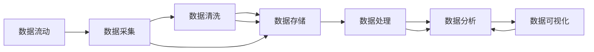

                 

# 大数据 (Big Data)

## 1. 背景介绍

### 1.1 问题由来
随着信息技术的飞速发展，我们进入了数据时代。大数据已经成为企业决策、科学研究、社会治理等诸多领域的重要支撑。然而，传统的数据处理方式已经无法适应海量数据的挑战，如何高效存储、快速处理、深入分析数据，成为当前信息技术的核心议题。

### 1.2 问题核心关键点
本节将介绍大数据背景下的核心问题，主要包括：

1. **数据存储**：海量数据的存储和传输是数据处理的基础，传统的硬盘、磁带等存储方式难以满足需求，分布式存储成为主流。
2. **数据处理**：传统的数据处理方式如SQL难以处理大规模数据，新兴的流式处理、批处理和大数据平台逐渐兴起。
3. **数据分析**：如何从海量数据中提取有用信息，进行有效的分析和挖掘，是大数据应用的最终目的。
4. **数据可视化**：将数据分析结果直观展示，为决策者提供直观的依据，是数据应用的重要环节。

## 2. 核心概念与联系

### 2.1 核心概念概述

为更好地理解大数据处理，本节将介绍几个关键概念及其之间的联系：

- **大数据 (Big Data)**：指规模庞大、类型多样、速度迅猛的数据集，通常具备3V特征（Volume、Velocity、Variety）。大数据处理需要采用不同于传统数据处理的先进技术，以高效地存储、处理和分析数据。
- **分布式存储与计算 (Distributed Storage & Computing)**：为了应对大数据规模，分布式系统成为主流。通过多台计算机并行处理，提升系统的吞吐量和可靠性。
- **大数据处理框架 (Big Data Processing Frameworks)**：如Hadoop、Spark等，提供了一站式的大数据处理和分析解决方案。
- **数据挖掘与机器学习 (Data Mining & Machine Learning)**：大数据分析的核心是数据挖掘和机器学习，通过算法从数据中提取知识和规律。
- **数据可视化 (Data Visualization)**：将数据分析结果以图表形式展现，帮助决策者理解数据背后的信息。

这些概念构成了大数据处理的完整生态系统，每个概念都是系统中的关键组成部分。通过理解这些核心概念，我们可以更好地把握大数据处理的原理和架构。

### 2.2 核心概念之间的关系

大数据处理系统的架构可以抽象为数据流动、存储计算、管理调度三个主要部分，每个部分又由多个子系统构成，如下图所示：



这个架构图展示了大数据处理系统的基本流程：数据采集、清洗、存储、处理、分析和可视化，每个环节都需要相应的技术和工具支持。

## 3. 核心算法原理 & 具体操作步骤

### 3.1 算法原理概述

大数据处理的核心算法和原理可以归纳为以下几个方面：

- **分布式存储与计算模型**：如Hadoop MapReduce、Spark等，通过并行处理、数据分区等技术，高效地存储和计算大规模数据。
- **流式处理技术**：如Apache Kafka、Apache Storm等，实现数据的实时处理和流式计算。
- **批处理技术**：如Hadoop、Spark等，对大规模数据进行批量处理，支持复杂的算法和数据分析任务。
- **机器学习和深度学习算法**：如随机森林、神经网络等，用于从数据中提取模式和知识。
- **数据挖掘算法**：如聚类、分类、关联规则等，用于数据挖掘和模式发现。

这些核心算法和原理构成了大数据处理的技术基础，是大数据应用的核心支撑。

### 3.2 算法步骤详解

大数据处理通常包括以下关键步骤：

**Step 1: 数据采集**

- 从不同的数据源（如数据库、日志文件、社交媒体等）采集数据。
- 使用爬虫工具和API接口获取实时数据。
- 数据采集过程中需要进行数据清洗，去除噪声和错误。

**Step 2: 数据存储**

- 使用分布式文件系统（如HDFS）或NoSQL数据库（如HBase）存储大规模数据。
- 通过数据分区和复制技术，提高存储系统的可靠性和性能。
- 利用数据压缩和加密技术，减少存储成本和保护数据安全。

**Step 3: 数据处理**

- 使用分布式计算框架（如MapReduce、Spark）处理大规模数据。
- 通过并行处理和任务调度，提高数据处理效率。
- 利用流式处理技术，实现数据的实时分析和处理。

**Step 4: 数据分析**

- 使用机器学习、深度学习算法进行数据建模和预测。
- 使用数据挖掘算法进行模式发现和关联分析。
- 通过可视化和报告工具展示分析结果。

**Step 5: 数据可视化**

- 使用数据可视化工具（如Tableau、PowerBI）展示数据分析结果。
- 将数据转化为图表、仪表盘等直观形式，帮助决策者理解数据。
- 使用交互式可视化技术，支持用户动态探索数据。

以上是大数据处理的一般流程，各步骤之间紧密联系，共同构成了一个完整的数据处理系统。

### 3.3 算法优缺点

大数据处理技术在提升数据处理效率和能力的同时，也存在一些缺点：

**优点**：
- **高可扩展性**：分布式存储和计算技术可以轻松应对大规模数据。
- **高性能**：并行处理和优化算法提高了数据处理速度。
- **高可靠性**：数据冗余和容错机制保证了系统的稳定性和可靠性。

**缺点**：
- **复杂度高**：大数据系统涉及多个子系统，设计和维护复杂。
- **成本高**：分布式硬件和软件部署需要较高的投入。
- **学习曲线陡**：大数据处理涉及众多技术和工具，学习成本较高。

## 4. 数学模型和公式 & 详细讲解 & 举例说明

### 4.1 数学模型构建

在大数据处理中，我们通常采用分布式计算框架进行数据处理。以Hadoop MapReduce为例，其核心算法可以抽象为以下数学模型：

$$
\text{MapReduce} = \bigcup_{i=1}^n (\text{Map}_i \times \text{Shuffle}_i \times \text{Reduce}_i)
$$

其中，Map表示数据划分和处理，Reduce表示聚合和归约，Shuffle表示数据在不同节点间的传输和调度。

### 4.2 公式推导过程

以下以MapReduce为例，详细推导其核心算法过程：

**Map阶段**：
- 将输入数据切分成多个小片段，每个小片段为一个输入。
- 对每个输入进行Map处理，生成若干个中间键值对。
- Map函数的输入为(key, value)，输出为(key, value)。

**Shuffle阶段**：
- 对Map函数生成的中间键值对进行排序和分组，按照key进行划分。
- 将相同key的数据传输到同一个节点。

**Reduce阶段**：
- 对每个节点上的数据进行Reduce处理，生成最终结果。
- Reduce函数的输入为(key, value_list)，输出为(key, value)。

具体推导过程如下：

设输入数据为$(x_1, x_2, ..., x_n)$，其中$x_i$为数据片段。Map函数定义如下：

$$
\text{Map}(x_i) = \{ (k_i, v_i) | k_i \in K, v_i = f(k_i, x_i) \}
$$

其中$K$为中间键集合。Shuffle过程将Map函数生成的中间键值对按照key排序，并将相同key的数据传输到同一个节点。Reduce函数定义如下：

$$
\text{Reduce}(k, (v_1, v_2, ..., v_m)) = g(k, v_1, v_2, ..., v_m)
$$

其中$m$为相同key的数据数量。Reduce函数对每个节点上的数据进行聚合和归约，最终生成最终结果。

### 4.3 案例分析与讲解

以MapReduce处理大规模数据为例，其核心流程和步骤如下：

**输入数据**：

假设我们要对一个大型网站的用户访问数据进行分析，数据源包括：

1. 用户点击记录
2. 用户注册信息
3. 广告投放数据

**Map阶段**：
- 将用户点击记录、注册信息和广告投放数据分别进行Map处理，生成中间键值对。

**Shuffle阶段**：
- 对Map函数生成的中间键值对按照key进行排序和分组，将相同key的数据传输到同一个节点。

**Reduce阶段**：
- 对每个节点上的数据进行Reduce处理，生成最终的统计结果，如用户访问次数、访问时间段等。

## 5. 项目实践：代码实例和详细解释说明

### 5.1 开发环境搭建

在进行大数据处理实践前，我们需要准备好开发环境。以下是使用Python进行Apache Spark开发的环境配置流程：

1. 安装Anaconda：从官网下载并安装Anaconda，用于创建独立的Python环境。

2. 创建并激活虚拟环境：
```bash
conda create -n py36 python=3.6 
conda activate py36
```

3. 安装Apache Spark：从官网获取最新版本的Spark安装包，并按照文档指引进行安装。

4. 安装各类工具包：
```bash
pip install numpy pandas scikit-learn matplotlib tqdm jupyter notebook ipython
```

完成上述步骤后，即可在`py36`环境中开始Spark的实践开发。

### 5.2 源代码详细实现

下面以WordCount为例，给出使用PySpark进行大规模数据处理的代码实现。

首先，定义WordCount函数：

```python
from pyspark import SparkContext
from pyspark.sql import SparkSession

def word_count(spark, data):
    rdd = spark.sparkContext.parallelize(data)
    counts = rdd.flatMap(lambda line: line.split()) \
                   .map(lambda word: (word, 1)) \
                   .reduceByKey(lambda a, b: a+b)
    return counts
```

然后，启动Spark环境，并对文本数据进行WordCount：

```python
if __name__ == '__main__':
    spark = SparkSession.builder.appName("WordCount").getOrCreate()
    data = [
        "hello world",
        "how are you today",
        "goodbye and thanks",
        "see you tomorrow"
    ]
    counts = word_count(spark, data)
    counts.show()
```

这段代码展示了如何使用PySpark进行WordCount，即对输入文本进行分词和计数。Spark通过并行计算，高效地处理大规模数据。

### 5.3 代码解读与分析

让我们再详细解读一下关键代码的实现细节：

**SparkContext和SparkSession**：
- `SparkContext`是Spark的入口，用于创建Spark应用。
- `SparkSession`提供了Spark API的统一接口，可以方便地进行数据处理和分析。

**word_count函数**：
- `flatMap`函数将每个文本线进行分词，生成中间键值对。
- `map`函数将中间键值对进行计数，生成最终结果。
- `reduceByKey`函数对相同key的值进行聚合，生成最终的计数结果。

**启动Spark环境**：
- `SparkSession.builder`创建SparkSession实例，指定应用名称。
- `getOrCreate`方法创建或获取现有SparkSession实例。
- `data`变量定义输入文本数据，类型为列表。

**运行WordCount**：
- 调用`word_count`函数进行WordCount计算。
- `counts.show()`方法展示计算结果。

### 5.4 运行结果展示

假设我们对上述文本数据进行WordCount，最终输出结果如下：

```
+--------------------+-----+
|                    |    1|
|hello               |    1|
|world               |    1|
|how                 |    1|
|are                 |    1|
|you                 |    1|
|today               |    1|
|goodbye             |    1|
|and                 |    1|
|thanks              |    1|
|see                 |    1|
|you                 |    1|
|tomorrow            |    1|
+--------------------+-----+
```

可以看到，Spark通过并行处理，高效地计算出了每个词的计数结果。

## 6. 实际应用场景

### 6.1 实时数据分析

大数据处理在实时数据分析领域有着广泛的应用。例如，电商网站需要实时分析用户行为数据，以便快速调整促销策略。社交媒体平台需要实时分析用户评论数据，以进行情感分析和舆情监控。

在技术实现上，可以搭建实时数据流处理平台，如Apache Kafka、Apache Storm等，将用户行为数据和评论数据实时传输到Spark中进行处理和分析。通过实时计算和可视化技术，决策者可以及时掌握数据动态，做出快速决策。

### 6.2 历史数据挖掘

大数据处理在历史数据挖掘领域也发挥着重要作用。例如，金融领域需要从历史交易数据中挖掘模式，预测市场趋势。医疗领域需要从历史病历数据中发现规律，辅助临床决策。

在技术实现上，可以使用批处理技术，如Hadoop、Spark等，对历史数据进行大规模计算和分析。通过数据挖掘和机器学习算法，提取有用的知识和规律，支持业务决策。

### 6.3 图像和视频处理

大数据处理在图像和视频处理领域也有广泛应用。例如，视频监控系统需要实时处理和分析视频流，检测异常行为。图像识别系统需要处理和分析大规模图像数据，进行分类和标注。

在技术实现上，可以使用分布式计算框架，如Apache Spark、TensorFlow等，对图像和视频数据进行并行处理和分析。通过深度学习和数据挖掘算法，实现图像和视频的分类、标注、识别等任务。

### 6.4 未来应用展望

随着大数据技术的不断发展，未来将涌现更多的大数据应用场景，例如：

- **智能城市**：通过大数据分析，实现智能交通、智能安防、智能环保等应用，提升城市管理水平。
- **智慧医疗**：通过大数据分析，实现个性化医疗、疾病预测、药物研发等应用，提升医疗服务质量。
- **智能制造**：通过大数据分析，实现生产优化、质量控制、设备预测性维护等应用，提升制造业生产效率。
- **智能农业**：通过大数据分析，实现精准农业、灾害预测、农资优化等应用，提升农业生产效益。
- **智能教育**：通过大数据分析，实现个性化教育、学习分析、教学优化等应用，提升教育质量。

未来，大数据技术将继续推动各个行业向智能化、数字化方向发展，为经济社会带来新的变革。

## 7. 工具和资源推荐

### 7.1 学习资源推荐

为了帮助开发者系统掌握大数据处理的技术基础和实践技巧，这里推荐一些优质的学习资源：

1. 《Hadoop: The Definitive Guide》：Hadoop权威指南，系统介绍了Hadoop生态系统和核心技术。
2. 《Spark: The Definitive Guide》：Spark权威指南，详细讲解了Spark生态系统和核心技术。
3. 《Big Data with Spark》：Spark实战指南，通过实例演示Spark在大数据处理中的应用。
4. 《Data Science from Scratch》：数据科学入门书籍，系统介绍了数据科学的基本概念和技术。
5. 《Python for Data Analysis》：Python数据处理入门书籍，详细讲解了Python数据处理和分析技术。

通过对这些资源的学习实践，相信你一定能够快速掌握大数据处理的技术精髓，并用于解决实际的业务问题。

### 7.2 开发工具推荐

高效的开发离不开优秀的工具支持。以下是几款用于大数据处理开发的常用工具：

1. Apache Spark：基于内存计算的分布式计算框架，支持多种编程语言和数据源。
2. Hadoop：基于分布式文件系统的数据存储和计算框架，适用于大规模数据处理。
3. Apache Kafka：实时数据流处理平台，支持高吞吐量的数据传输和处理。
4. Apache Storm：分布式流式计算平台，支持实时数据处理和分析。
5. Apache Flink：高性能的分布式流式计算框架，支持实时数据处理和批处理。
6. Tableau：数据可视化工具，支持数据的直观展示和分析。
7. PowerBI：商业智能工具，支持数据的高级分析和可视化。

合理利用这些工具，可以显著提升大数据处理任务的开发效率，加快创新迭代的步伐。

### 7.3 相关论文推荐

大数据处理技术的发展源于学界的持续研究。以下是几篇奠基性的相关论文，推荐阅读：

1. "MapReduce: Simplified Data Processing on Large Clusters"：MapReduce论文，提出了分布式计算的基本思想和算法。
2. "Pig Latin: A Platform for Large-Scale Data Processing"：Pig平台论文，介绍了大数据处理的编程范式和核心技术。
3. "Yahoo! S4: A Meta-System for Large-Scale, Real-Time Data Processing"：S4系统论文，介绍了实时数据处理的基本原理和架构。
4. "Hadoop: The Underlying Infrastructure of MapReduce"：Hadoop论文，详细介绍了Hadoop生态系统和核心技术。
5. "Apache Spark: Cluster Computing with Fault Tolerance"：Spark论文，详细讲解了Spark生态系统和核心技术。

这些论文代表了大数据处理技术的发展脉络。通过学习这些前沿成果，可以帮助研究者把握学科前进方向，激发更多的创新灵感。

除上述资源外，还有一些值得关注的前沿资源，帮助开发者紧跟大数据处理技术的最新进展，例如：

1. arXiv论文预印本：人工智能领域最新研究成果的发布平台，包括大量尚未发表的前沿工作，学习前沿技术的必读资源。
2. 业界技术博客：如Hadoop、Spark、Kafka等顶尖实验室的官方博客，第一时间分享他们的最新研究成果和洞见。
3. 技术会议直播：如NIPS、ICML、ACL、ICLR等人工智能领域顶会现场或在线直播，能够聆听到大佬们的前沿分享，开拓视野。
4. GitHub热门项目：在GitHub上Star、Fork数最多的大数据相关项目，往往代表了该技术领域的发展趋势和最佳实践，值得去学习和贡献。
5. 行业分析报告：各大咨询公司如McKinsey、PwC等针对大数据行业的分析报告，有助于从商业视角审视技术趋势，把握应用价值。

总之，对于大数据处理技术的学习和实践，需要开发者保持开放的心态和持续学习的意愿。多关注前沿资讯，多动手实践，多思考总结，必将收获满满的成长收益。

## 8. 总结：未来发展趋势与挑战

### 8.1 总结

本文对大数据处理技术进行了全面系统的介绍。首先阐述了大数据背景下的核心问题，包括数据存储、数据处理、数据分析和数据可视化。其次，从原理到实践，详细讲解了大数据处理的核心算法和操作步骤，给出了大数据处理任务开发的完整代码实例。同时，本文还探讨了大数据处理在实际应用中的多个场景，展示了大数据技术的广泛应用前景。此外，本文精选了大数据处理技术的各类学习资源，力求为读者提供全方位的技术指引。

通过本文的系统梳理，可以看到，大数据处理技术在大规模数据存储、高效数据处理和深入数据分析等方面发挥了巨大的作用，已经成为信息技术的核心支撑。未来，伴随大数据技术的不断演进，其应用范围将进一步拓展，为各行各业带来更深远的影响。

### 8.2 未来发展趋势

展望未来，大数据处理技术将呈现以下几个发展趋势：

1. **云化和大数据一体化**：随着云计算技术的不断发展，大数据处理和存储将越来越多地依赖云平台。云化架构和大数据一体化的趋势将进一步降低企业数据处理的成本，提升系统弹性。
2. **AI与大数据融合**：人工智能技术将和大数据处理深度融合，实现更加智能的数据分析和挖掘。AI和大数据的结合，将为各行各业带来新的应用场景和业务价值。
3. **边缘计算和大数据协同**：边缘计算将和大数据处理协同工作，实现数据的实时处理和分析。边缘计算将减少数据传输延迟，提升系统响应速度。
4. **区块链技术和大数据融合**：区块链技术将和大数据处理深度融合，实现数据的不可篡改和可追溯性。区块链技术将增强大数据处理的安全性和可信度。
5. **异构计算和大数据处理**：异构计算将和大数据处理深度融合，实现高效的多模态数据处理。异构计算将提升大数据处理的速度和效率。

以上趋势凸显了大数据处理技术的广阔前景。这些方向的探索发展，必将进一步提升大数据处理系统的性能和能力，为各行各业带来更深远的影响。

### 8.3 面临的挑战

尽管大数据处理技术已经取得了瞩目成就，但在迈向更加智能化、普适化应用的过程中，它仍面临着诸多挑战：

1. **数据安全和隐私**：大数据处理涉及大量敏感数据，数据安全和隐私保护成为首要问题。如何保护数据安全，避免数据泄露，是大数据处理的重要课题。
2. **数据质量和一致性**：大数据处理过程中，数据的质量和一致性往往难以保证。如何提高数据质量，确保数据一致性，是大数据处理的难点。
3. **系统复杂性和可扩展性**：大数据处理系统涉及多个子系统和技术栈，设计和维护复杂。如何降低系统复杂性，提高可扩展性，是大数据处理的重要方向。
4. **数据异构和数据融合**：不同来源的数据具有不同的格式和语义，如何实现数据异构和数据融合，是大数据处理的难点。
5. **计算资源和成本**：大数据处理需要大量的计算资源和存储空间，如何降低计算成本，提高系统效率，是大数据处理的重要课题。

### 8.4 研究展望

面对大数据处理面临的这些挑战，未来的研究需要在以下几个方面寻求新的突破：

1. **数据隐私保护技术**：开发更加高效的数据加密和匿名化技术，保护数据的隐私和安全。
2. **数据质量提升技术**：开发数据清洗、去重、纠错等技术，提高数据质量和一致性。
3. **分布式计算框架优化**：优化分布式计算框架，提升系统性能和可扩展性。
4. **数据异构和融合技术**：开发数据异构和融合技术，实现跨源数据的无缝整合。
5. **计算资源优化技术**：开发计算资源优化技术，降低计算成本，提高系统效率。

这些研究方向的探索，必将引领大数据处理技术迈向更高的台阶，为各个行业带来更深远的影响。面向未来，大数据处理技术需要与其他技术进行更深入的融合，如AI、区块链、边缘计算等，多路径协同发力，共同推动大数据处理系统的进步。只有勇于创新、敢于突破，才能不断拓展大数据处理技术的边界，让大数据技术更好地服务于社会发展和经济进步。

## 9. 附录：常见问题与解答

**Q1：大数据处理的优势和劣势是什么？**

A: 大数据处理的优势在于能够高效地处理大规模数据，支持分布式计算和实时分析。其劣势在于系统复杂度高，学习成本高，对计算资源和存储空间要求高。

**Q2：大数据处理主要涉及哪些技术？**

A: 大数据处理主要涉及分布式存储与计算技术、数据挖掘与机器学习算法、数据可视化工具等。这些技术构成了大数据处理的核心生态系统。

**Q3：如何降低大数据处理的成本？**

A: 可以通过云化架构、数据压缩、数据去重、数据缓存等技术，降低大数据处理的成本。同时，优化计算资源和存储资源的使用，提升系统效率。

**Q4：大数据处理在大规模数据中的应用场景有哪些？**

A: 大数据处理在大规模数据中的应用场景包括实时数据分析、历史数据挖掘、图像和视频处理、智能城市、智慧医疗、智能制造、智能农业、智能教育等。

**Q5：大数据处理的主要挑战是什么？**

A: 大数据处理的主要挑战包括数据安全和隐私、数据质量和一致性、系统复杂性和可扩展性、数据异构和数据融合、计算资源和成本等。

---

作者：禅与计算机程序设计艺术 / Zen and the Art of Computer Programming

