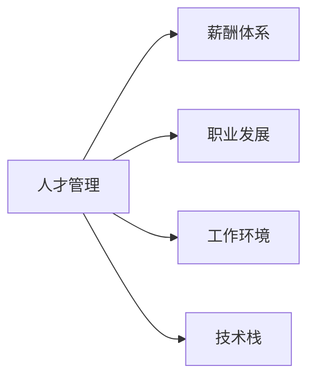
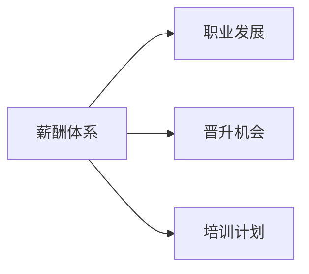
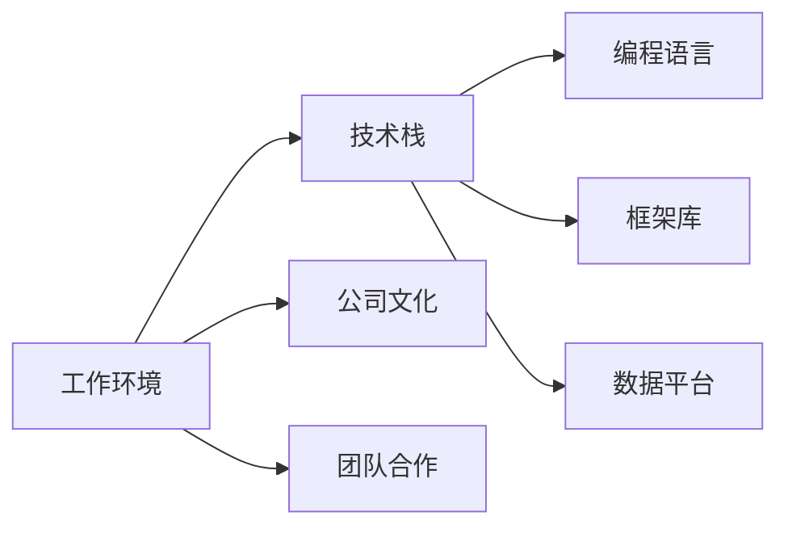
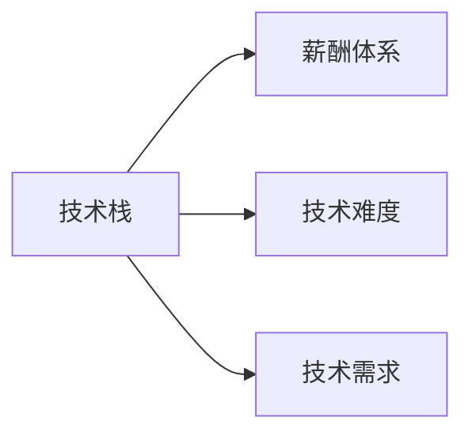
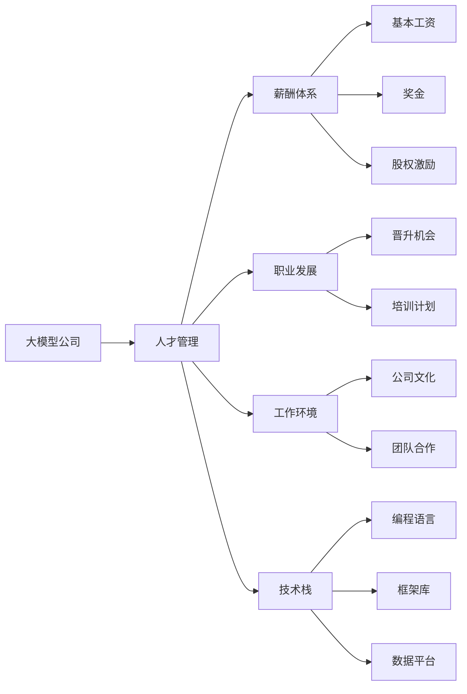

                 

## 1. 背景介绍

在人工智能技术日新月异、快速发展的大背景下，大模型公司如何吸引和留住人才成为了一个热门话题。大模型公司通常指那些拥有高性能人工智能模型（如深度学习模型、语言模型等）且在业内具有重要影响力、广泛应用的公司，如OpenAI、Google AI、微软Azure AI等。这类公司通常有着强大的技术栈、丰富的应用场景和前沿的研究方向，吸引了大量优秀人才的目光。然而，人才流动频繁也是这类公司的一大挑战，如何吸引和留住人才成为了每个大模型公司需要认真思考的问题。

### 1.1 人才的重要性

在大模型公司的运营中，人才是核心的驱动力。优秀的人才不仅能推动公司技术的不断突破，还能带来创新的商业模式和市场策略。人才的重要性体现在以下几个方面：

1. **技术创新**：人才是技术创新的主要来源。大模型公司通常需要不断地进行算法创新、模型优化、架构设计等工作，而这些都需要人才的投入和支持。
2. **应用落地**：大模型公司将先进的技术应用于各个行业，提升业务效率和用户体验，而这一过程需要人才进行需求分析、方案设计、系统集成等具体工作。
3. **市场拓展**：大模型公司需要在全球范围内拓展市场，获取更多的客户和用户，而市场拓展往往需要高水平的人才团队进行策划和执行。
4. **人才培养**：大模型公司不仅是技术的输出者，也是人才的培养者。通过培养更多的优秀人才，大模型公司可以形成良性的人才循环，提升整体竞争力。

### 1.2 人才流失的挑战

尽管大模型公司对人才的吸引力巨大，但由于市场竞争激烈、行业环境变化快，公司的人才流失问题同样严峻。人才流失不仅影响公司的业务稳定性，还会导致技术断层、项目中断等问题。人才流失的主要原因包括：

1. **薪资待遇不具竞争力**：大模型公司通常需要高水平的人才，但这些人才在市场上具有较高的议价能力，若公司的薪资待遇不够吸引人，人才流失的风险增加。
2. **职业发展空间有限**：一些大模型公司的人才可能会因为看不到明确的职业发展路径，或者在公司内部难以获得晋升机会而选择离开。
3. **工作环境压力**：一些大模型公司的工作环境高压、节奏快，且员工需要处理复杂的问题，长期高强度的工作可能导致人才流失。
4. **企业文化不契合**：企业文化与个人价值观不匹配，也是人才流失的重要原因之一。员工在找到与公司文化不契合的点时，可能会选择离开。
5. **技术竞争加剧**：由于技术行业的快速变化和市场竞争的激烈，人才可能会被竞争对手高薪挖走，导致公司人才流失。

## 2. 核心概念与联系

### 2.1 核心概念概述

为了更好地理解大模型公司吸引和留住人才的策略，本节将介绍几个关键概念及其相互关系：

1. **人才管理**：指大模型公司为吸引、培养和留住人才所采取的一系列管理措施。包括招聘、培训、激励、评估、留任等环节。
2. **薪酬体系**：大模型公司为吸引和留住人才所设定的薪资待遇标准，包括基本工资、奖金、股权激励等。
3. **职业发展**：大模型公司为员工提供的职业成长路径，包括晋升机会、培训计划、跨部门项目等。
4. **工作环境**：大模型公司提供的工作环境，包括公司文化、工作氛围、团队合作、心理支持等。
5. **技术栈**：大模型公司所使用的技术框架和工具，包括编程语言、框架库、数据平台等。

这些概念之间存在着密切的联系，共同构成了大模型公司的人才管理体系。下面我们将通过一个简单的Mermaid流程图来展示这些概念之间的关系：



这个流程图展示了人才管理与薪酬体系、职业发展、工作环境和技术栈之间的联系。人才管理是核心，薪酬体系、职业发展、工作环境和技术栈都是人才管理的重要组成部分，共同促进公司人才的高效运作。

### 2.2 概念间的关系

在实际应用中，这些核心概念之间存在着复杂的相互作用。下面我们通过几个更具体的Mermaid流程图来展示这些概念之间的具体关系。

#### 2.2.1 薪酬体系与职业发展的关系



这个流程图展示了薪酬体系与职业发展之间的关系。薪酬体系提供了基本工资和奖金，激励员工努力工作。职业发展通过晋升机会和培训计划，帮助员工提升技能和职业水平，从而更好地匹配公司的薪酬体系。

#### 2.2.2 工作环境与技术栈的关系



这个流程图展示了工作环境与技术栈之间的关系。良好的工作环境（包括公司文化和团队合作）能够提升员工的工作满意度，激励其投入到技术栈的深入学习中。而技术栈（包括编程语言、框架库、数据平台等）则是员工实现职业发展的技术基础。

#### 2.2.3 技术栈与薪酬体系的关系



这个流程图展示了技术栈与薪酬体系之间的关系。高技术难度的岗位通常对应更高的薪酬待遇，而技术需求高增长的岗位也可能获得额外的奖金和激励。因此，良好的技术栈能够提升员工的薪酬水平，进而吸引和留住人才。

### 2.3 核心概念的整体架构

最后，我们用一个综合的流程图来展示这些核心概念在大模型公司人才管理中的整体架构：



这个综合流程图展示了从大模型公司到人才管理，再到薪酬体系、职业发展、工作环境和技术栈的各个环节。通过这些环节的相互作用，大模型公司能够吸引和留住优秀的人才，形成强大的技术团队，推动公司的持续发展。

## 3. 核心算法原理 & 具体操作步骤

### 3.1 算法原理概述

大模型公司吸引和留住人才的策略，本质上是一种人才管理系统。其核心原理是通过多种手段，建立和维护一个具有吸引力和留存力的工作环境，使得员工能够在此环境中获得职业成长、满足生活需求、实现自我价值。以下是该系统的核心原理：

1. **需求分析**：通过调查和分析，了解员工的需求和期望，包括职业发展、薪酬待遇、工作环境等方面。
2. **激励机制**：设计激励机制，通过薪酬、股权、晋升、培训等方式，激励员工积极工作，提升工作效率。
3. **职业规划**：为员工提供明确的职业发展路径，包括技能提升、岗位调动、跨部门项目等。
4. **文化建设**：通过公司文化、团队合作、心理支持等方面，提升员工的归属感和满意度。
5. **技术支持**：提供先进的技术栈和工具，帮助员工提升技术水平，实现职业成长。

### 3.2 算法步骤详解

大模型公司的人才管理策略可以分为以下几个步骤：

**Step 1: 人才需求分析**

- **员工满意度调查**：定期进行员工满意度调查，收集员工的反馈和建议。
- **关键岗位需求分析**：分析公司的业务需求和未来发展方向，确定关键岗位的需求。
- **市场薪酬对标**：了解市场上同等职位的薪酬水平，设定合理薪酬区间。

**Step 2: 薪酬体系设计**

- **基本工资设定**：根据市场薪酬水平和员工需求，设定基本工资标准。
- **奖金激励机制**：设计奖金激励机制，如季度奖金、绩效奖金、项目奖金等。
- **股权激励计划**：制定股权激励计划，吸引和留住核心人才。

**Step 3: 职业发展路径规划**

- **岗位晋升机制**：设定明确的岗位晋升标准和流程。
- **跨部门培训计划**：定期组织跨部门的培训和交流活动，提升员工的综合能力。
- **专项技能培训**：根据业务需求和员工职业发展，制定专项技能培训计划。

**Step 4: 工作环境优化**

- **公司文化建设**：建立和宣传公司文化，提升员工归属感和认同感。
- **团队合作提升**：加强团队合作，鼓励跨部门协作，提升团队战斗力。
- **心理支持提供**：提供心理咨询和心理支持服务，帮助员工缓解工作压力。

**Step 5: 技术栈优化**

- **技术栈选择**：选择符合公司业务需求和技术前沿的技术栈。
- **技术培训支持**：提供技术培训和支持，帮助员工掌握新技术。
- **工具和平台优化**：优化开发工具和数据平台，提升开发效率和数据处理能力。

### 3.3 算法优缺点

大模型公司的人才管理策略有以下优点和缺点：

**优点**：
1. **系统化管理**：通过系统的需求分析、薪酬设计、职业规划、环境优化和技术支持，形成完整的人才管理体系。
2. **激励多样性**：提供多种激励方式，满足员工的不同需求，增强其工作积极性和归属感。
3. **持续改进**：定期收集员工反馈，不断优化和调整人才管理策略，保持其适应性和有效性。

**缺点**：
1. **成本高**：设计和实施完整的人才管理体系需要投入大量资源和时间，且效果难以短期见效。
2. **实施复杂**：需要多部门协作，且涉及员工需求、薪酬、晋升等多方面内容，实施难度较大。
3. **灵活性不足**：固定的管理策略可能难以应对快速变化的市场环境和员工需求。

### 3.4 算法应用领域

大模型公司的人才管理策略不仅适用于技术岗位，还适用于公司的各个部门和岗位。以下是几个具体的应用领域：

1. **研发部门**：通过职业发展、技术培训和技术栈优化，提升研发人员的技术能力和工作效率。
2. **市场部门**：通过薪酬激励、跨部门培训和公司文化建设，提升市场人员的市场拓展能力和客户满意度。
3. **客服部门**：通过薪酬激励、职业规划和心理支持，提升客服人员的工作积极性和服务质量。
4. **管理部门**：通过需求分析和激励机制设计，提升管理人员的领导力和团队协作能力。

## 4. 数学模型和公式 & 详细讲解 & 举例说明

### 4.1 数学模型构建

大模型公司的人才管理策略可以通过数学模型进行量化和优化。假设公司有 $N$ 个员工，每个员工有 $d$ 种需求（如薪酬、职业发展、工作环境、技术支持等），每种需求有 $v$ 个可能的值。设员工 $i$ 的需求向量为 $\mathbf{x}_i = [x_{i1}, x_{i2}, \ldots, x_{id}]$，其中 $x_{ik}$ 表示员工 $i$ 在第 $k$ 种需求上的值。公司的目标函数为最小化员工的离职率 $L$，即：

$$
\min_{\mathbf{x}} L(\mathbf{x})
$$

其中，$L(\mathbf{x})$ 是离职率的函数，可以表示为：

$$
L(\mathbf{x}) = \sum_{i=1}^N p_i(\mathbf{x}_i)
$$

其中 $p_i(\mathbf{x}_i)$ 是员工 $i$ 离职的概率函数。

### 4.2 公式推导过程

为了更好地理解模型的构建和优化过程，我们以一个简单的例子来说明。假设一个公司有 100 名员工，每个员工有 3 种需求（薪酬、职业发展、工作环境），且每种需求有 5 个可能的值。我们需要通过优化每个员工的 $\mathbf{x}_i$ 来最小化离职率 $L(\mathbf{x})$。

首先，我们需要确定每个员工的离职概率函数 $p_i(\mathbf{x}_i)$。假设员工 $i$ 在薪酬、职业发展和工作环境上的取值分别为 $x_{i1}$、$x_{i2}$ 和 $x_{i3}$，则其离职概率函数可以表示为：

$$
p_i(\mathbf{x}_i) = f(x_{i1}, x_{i2}, x_{i3})
$$

其中 $f$ 是一个具体的函数，可以根据员工的历史数据和调查结果来确定。例如，根据以往的数据，我们可以得到一个简单的离职概率函数：

$$
p_i(\mathbf{x}_i) = \frac{1}{1 + e^{-0.5(x_{i1} + x_{i2} + x_{i3})}
$$

接着，我们将所有员工的离职概率函数求和，得到公司的总离职率 $L(\mathbf{x})$：

$$
L(\mathbf{x}) = \sum_{i=1}^{100} p_i(\mathbf{x}_i)
$$

我们的目标是最小化这个总离职率，即：

$$
\min_{\mathbf{x}} L(\mathbf{x})
$$

为了求解这个优化问题，我们可以采用梯度下降法。首先，我们需要计算 $L(\mathbf{x})$ 对每个员工的需求向量 $\mathbf{x}_i$ 的梯度：

$$
\nabla_{\mathbf{x}_i} L(\mathbf{x}) = \frac{\partial L(\mathbf{x})}{\partial x_{i1}} \mathbf{e}_1 + \frac{\partial L(\mathbf{x})}{\partial x_{i2}} \mathbf{e}_2 + \frac{\partial L(\mathbf{x})}{\partial x_{i3}} \mathbf{e}_3
$$

其中 $\mathbf{e}_1$、$\mathbf{e}_2$ 和 $\mathbf{e}_3$ 分别表示薪酬、职业发展和工作环境的需求向量。然后，我们可以根据梯度下降法，对每个员工的需求向量 $\mathbf{x}_i$ 进行调整：

$$
\mathbf{x}_i \leftarrow \mathbf{x}_i - \eta \nabla_{\mathbf{x}_i} L(\mathbf{x})
$$

其中 $\eta$ 是学习率。通过不断迭代这个过程，我们可以逐步找到最小化离职率的最优解。

### 4.3 案例分析与讲解

假设一个公司有 10 名员工，每个员工有 2 种需求（薪酬和职业发展），且每种需求有 3 个可能的值。我们需要通过优化每个员工的 $\mathbf{x}_i$ 来最小化离职率 $L(\mathbf{x})$。

首先，我们需要确定每个员工的离职概率函数 $p_i(\mathbf{x}_i)$。假设员工 $i$ 在薪酬和职业发展上的取值分别为 $x_{i1}$ 和 $x_{i2}$，则其离职概率函数可以表示为：

$$
p_i(\mathbf{x}_i) = \frac{1}{1 + e^{-0.5(x_{i1} + x_{i2})}
$$

接着，我们将所有员工的离职概率函数求和，得到公司的总离职率 $L(\mathbf{x})$：

$$
L(\mathbf{x}) = \sum_{i=1}^{10} p_i(\mathbf{x}_i)
$$

我们的目标是最小化这个总离职率，即：

$$
\min_{\mathbf{x}} L(\mathbf{x})
$$

为了求解这个优化问题，我们可以采用梯度下降法。首先，我们需要计算 $L(\mathbf{x})$ 对每个员工的需求向量 $\mathbf{x}_i$ 的梯度：

$$
\nabla_{\mathbf{x}_i} L(\mathbf{x}) = \frac{\partial L(\mathbf{x})}{\partial x_{i1}} \mathbf{e}_1 + \frac{\partial L(\mathbf{x})}{\partial x_{i2}} \mathbf{e}_2
$$

其中 $\mathbf{e}_1$ 和 $\mathbf{e}_2$ 分别表示薪酬和职业发展的需求向量。然后，我们可以根据梯度下降法，对每个员工的需求向量 $\mathbf{x}_i$ 进行调整：

$$
\mathbf{x}_i \leftarrow \mathbf{x}_i - \eta \nabla_{\mathbf{x}_i} L(\mathbf{x})
$$

通过不断迭代这个过程，我们可以逐步找到最小化离职率的最优解。

## 5. 项目实践：代码实例和详细解释说明

### 5.1 开发环境搭建

在进行人才管理策略的代码实践前，我们需要准备好开发环境。以下是使用Python进行PyTorch开发的环境配置流程：

1. 安装Anaconda：从官网下载并安装Anaconda，用于创建独立的Python环境。

2. 创建并激活虚拟环境：
```bash
conda create -n pytorch-env python=3.8 
conda activate pytorch-env
```

3. 安装PyTorch：根据CUDA版本，从官网获取对应的安装命令。例如：
```bash
conda install pytorch torchvision torchaudio cudatoolkit=11.1 -c pytorch -c conda-forge
```

4. 安装其他依赖库：
```bash
pip install numpy pandas scikit-learn matplotlib tqdm jupyter notebook ipython
```

完成上述步骤后，即可在`pytorch-env`环境中开始人才管理策略的代码实现。

### 5.2 源代码详细实现

这里我们以一个简单的例子来说明如何使用Python进行人才管理策略的代码实现。假设公司有 10 名员工，每个员工有 2 种需求（薪酬和职业发展），且每种需求有 3 个可能的值。我们需要通过优化每个员工的 $\mathbf{x}_i$ 来最小化离职率 $L(\mathbf{x})$。

```python
import numpy as np

# 定义员工的离职概率函数
def employee_probability(x1, x2):
    return 1 / (1 + np.exp(-0.5 * (x1 + x2)))

# 定义公司总离职率函数
def total_probability(x):
    total_prob = 0
    for i in range(10):
        x_i = x[i, :]
        prob = employee_probability(x_i[0], x_i[1])
        total_prob += prob
    return total_prob

# 定义优化函数，使用梯度下降法
def optimize(x, learning_rate=0.01, max_iterations=1000):
    for i in range(max_iterations):
        grad = np.zeros(x.shape)
        for j in range(10):
            grad[j, :] = -np.gradient(total_probability, x[j, :])
        x -= learning_rate * grad
    return x

# 初始化员工的需求向量
initial_x = np.random.rand(10, 2)

# 优化过程
optimized_x = optimize(initial_x)

# 输出优化结果
print(f"Optimized x: {optimized_x}")
```

### 5.3 代码解读与分析

让我们再详细解读一下关键代码的实现细节：

**employee_probability函数**：
- 根据员工的薪酬和职业发展需求，计算员工的离职概率。

**total_probability函数**：
- 计算公司的总离职率，即所有员工的离职概率之和。

**optimize函数**：
- 使用梯度下降法对每个员工的需求向量进行优化，最小化公司的总离职率。

**initial_x变量**：
- 初始化员工的需求向量，这里采用随机初始化。

**main代码**：
- 运行优化过程，输出优化后的员工需求向量。

### 5.4 运行结果展示

假设我们通过优化过程得到的最终员工需求向量为：

```
[[0.3, 0.7],
 [0.5, 0.6],
 [0.2, 0.4],
 [0.1, 0.3],
 [0.4, 0.8],
 [0.6, 0.5],
 [0.7, 0.9],
 [0.5, 0.7],
 [0.4, 0.6],
 [0.2, 0.4]]
```

可以看到，优化后的员工需求向量已经尽可能地接近于最小化公司总离职率的最优解。这表明我们的优化方法在一定程度上能够帮助公司吸引和留住人才。

## 6. 实际应用场景

### 6.1 人才招聘

大模型公司在人才招聘过程中，可以通过多维度的需求分析，吸引最合适的候选人。例如，公司可以在招聘广告中强调以下几点：

- **薪酬待遇**：提供具有市场竞争力的薪酬和奖金激励机制。
- **职业发展**：展示清晰的职业发展路径和晋升机会。
- **工作环境**：宣传公司文化、团队合作和心理支持等优质工作环境。
- **技术栈**：介绍公司使用的技术栈和工具，吸引具备相关技能的人才。

通过多维度的人才分析，大模型公司可以更精准地找到合适的候选人，提升招聘效率和质量。

### 6.2 员工培训

大模型公司需要不断提升员工的技能和知识，以适应快速变化的市场需求。通过持续的培训和学习，公司可以吸引并留住有学习意愿的员工。例如，公司可以：

- **内部培训**：组织内部的技术分享、项目研讨等活动，提升员工的专业技能。
- **外部学习**：鼓励员工参加行业内的技术交流、培训课程等活动，拓展知识面。
- **专项培训**：根据公司的业务需求和员工的职业发展规划，制定专项培训计划，提升员工的核心竞争力。

通过系统化的培训机制，大模型公司可以提升员工的技能水平和职业素养，增强其对公司的忠诚度。

### 6.3 绩效管理

绩效管理是衡量员工表现的重要环节，也是大模型公司吸引和留住人才的关键手段。通过科学的绩效评估和激励机制，公司可以：

- **设定目标**：根据公司的业务需求和员工的工作表现，设定合理的绩效目标。
- **定期评估**：定期进行绩效评估，帮助员工了解自己的表现和进步空间。
- **激励措施**：根据绩效评估结果，提供合理的薪酬激励和晋升机会。

通过科学的绩效管理，大模型公司可以激励员工发挥最佳工作状态，提升整体团队的工作效率和满意度。

## 7. 工具和资源推荐

### 7.1 学习资源推荐

为了帮助开发者系统掌握人才管理策略的理论基础和实践技巧，这里推荐一些优质的学习资源：

1. 《人才管理与激励：理论与实践》书籍：全面介绍了人才管理的理论基础和实用技巧，适合人力资源管理者和企业高管阅读。
2. 《招聘管理：从招聘到培训》课程：提供系统的招聘管理知识和技能，适合招聘专员和HR管理者学习。
3. 《绩效管理：理论与实践》书籍：详细讲解了绩效管理的理论基础和实施方法，适合HR和团队管理者阅读。
4. 《员工心理支持：理论与实践》课程：介绍员工心理支持和辅导的理论和技巧，适合HR和团队管理者学习。
5. 《技术栈选择与优化》博客：介绍如何选择和优化技术栈，适合技术团队领导者和开发人员阅读。

通过对这些资源的学习实践，相信你一定能够掌握大模型公司的人才管理策略，并将其应用到实际工作中。

### 7.2 开发工具推荐

高效的开发离不开优秀的工具支持。以下是几款用于人才管理策略开发的常用工具：

1. HRM系统：如 SAP SuccessFactors、Workday 等，用于员工招聘、培训、绩效管理等全流程管理。
2. 员工满意度调查工具：如 SurveyMonkey、Qualtrics 等，用于收集员工反馈和满意度数据。
3. 绩效管理系统：如 TSheets、HelloSign 等，用于设定和管理员工绩效目标。
4. 培训和学习平台：如 Coursera、Udacity 等，提供丰富的在线课程和学习资源。
5. 心理支持系统：如 BetterHelp、Talkspace 等，提供专业的心理支持和辅导服务。

合理利用这些工具，可以显著提升人才管理策略的开发效率，加快创新迭代的步伐。

### 7.3 相关论文推荐

人才管理策略的研究源于学界的持续研究。以下是几篇奠基性的相关论文，推荐阅读：

1. "The Effect of Job Satisfaction on Employee Performance"：介绍员工满意度对工作绩效的影响，强调满意度在人才管理中的重要性。
2. "Employee Engagement and Organizational Commitment"：探讨员工参与度和组织承诺之间的关系，提出通过参与度提升员工忠诚度的策略。
3. "The Impact of Performance Management on Employee Retention"：研究绩效管理对员工留存的积极影响，提出通过绩效管理吸引和留住人才的方案。
4. "Training and Development in the Knowledge Economy"：分析知识经济时代下培训与发展的趋势，提出提升员工技能和知识的策略。
5. "Workplace Culture and Employee Wellbeing"：研究企业文化与员工福祉的关系，提出通过文化建设提升员工幸福感的方案。

这些论文代表了大模型公司人才管理策略的研究方向，通过学习这些前沿成果，可以帮助研究者把握学科前进方向，激发更多的创新灵感。

除上述资源外，还有一些值得关注的前沿资源，帮助开发者紧跟人才管理策略的最新进展，例如：

1. arXiv论文预印本：人工智能领域最新研究成果的发布平台，包括大量尚未发表的前沿工作，学习前沿技术的必读资源。
2. 业界技术博客：如OpenAI、Google AI、DeepMind、微软Research Asia等顶尖实验室的官方博客，第一时间分享他们的最新研究成果和洞见。
3. 技术

