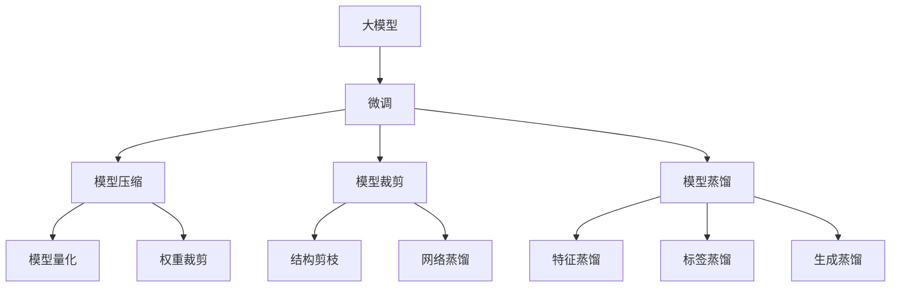
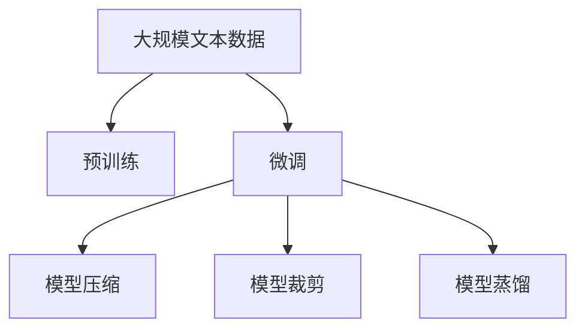
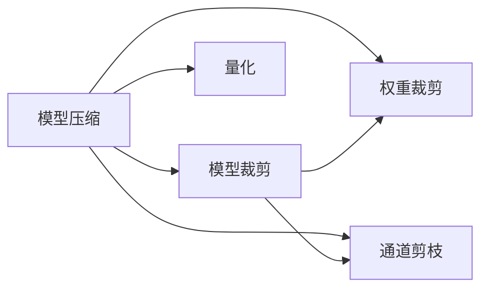
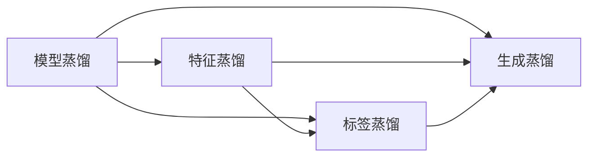
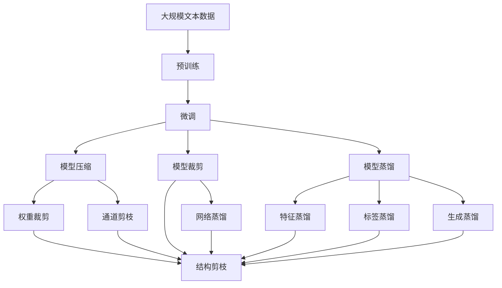

                 

# 大模型在细颗粒度任务中的表现

> 关键词：大模型,细颗粒度任务,模型微调,模型压缩,模型裁剪,模型蒸馏

## 1. 背景介绍

### 1.1 问题由来

近年来，深度学习模型在处理自然语言处理(NLP)任务中表现出色。其中，大模型（如BERT、GPT系列）因其强大的语言建模能力，逐渐成为处理复杂自然语言任务的首选工具。但这些模型在实际应用中常常面临数据量大、计算资源需求高、推理速度慢等问题，导致其落地困难。

解决这一问题的方法之一是微调（Fine-Tuning）。微调通过在大模型基础上，使用特定任务的小规模数据集进行有监督学习，以适应该任务。虽然微调方法能够有效提升模型的任务性能，但由于大模型参数量巨大，其计算资源需求仍较高。因此，如何在保证性能的同时，降低模型规模和推理速度，是当前研究的一个重要方向。

### 1.2 问题核心关键点

细颗粒度任务（Fine-grained Tasks）是指需要更精细化地处理任务的NLP任务，例如命名实体识别（Named Entity Recognition, NER）、文本分类、情感分析等。这类任务通常需要更为精准的语言理解和处理，对模型的语义表示和推理能力有较高要求。因此，在微调大模型时，需要特别考虑模型的微调方法、参数裁剪、模型压缩等细节。

## 2. 核心概念与联系

### 2.1 核心概念概述

为更好地理解大模型在细颗粒度任务中的表现，本节将介绍几个关键概念：

- 大模型（Large Model）：指预训练参数量在数亿甚至数十亿级别的深度学习模型，如BERT、GPT系列等。大模型通常具备强大的语言理解能力和泛化能力，但计算资源需求高，推理速度慢。
- 微调（Fine-Tuning）：指在大模型基础上，使用特定任务的小规模数据集进行有监督学习，以适应该任务的过程。微调可以提升模型在该任务上的性能，但需要耗费较多计算资源。
- 模型压缩（Model Compression）：指在不影响模型性能的前提下，通过量化、剪枝等方法降低模型参数和计算资源需求的过程。常见的模型压缩技术包括权重裁剪、通道剪枝、量化等。
- 模型裁剪（Model Pruning）：指在模型微调过程中，通过调整模型结构，去除不必要的参数和计算单元，以减少推理时间和内存消耗的过程。常见的模型裁剪技术包括结构剪枝、网络蒸馏等。
- 模型蒸馏（Knowledge Distillation）：指将大模型的知识（如语义表示、推理能力等）转移到小模型中，以提升小模型的性能。蒸馏方法通常包括特征蒸馏、标签蒸馏、生成蒸馏等。

这些概念之间的联系和相互作用可以通过以下Mermaid流程图来展示：



这个流程图展示了从大模型微调到模型压缩、裁剪和蒸馏的整体流程。微调用于提升模型在特定任务上的性能，而模型压缩、裁剪和蒸馏则用于降低模型规模和推理速度，使其能够在有限资源下运行。这些技术可以协同工作，进一步提升大模型在细颗粒度任务中的表现。

### 2.2 概念间的关系

这些核心概念之间存在紧密的联系，形成了细颗粒度任务处理的大模型框架。下面通过几个Mermaid流程图来展示这些概念之间的关系：

#### 2.2.1 大模型微调的流程



这个流程图展示了从预训练到大模型微调，再到模型压缩、裁剪和蒸馏的全过程。预训练通过大规模文本数据训练大模型，获得基础的语义表示能力。微调则在大模型基础上，使用特定任务的小规模数据集进行有监督学习，以提升模型在该任务上的性能。而模型压缩、裁剪和蒸馏则用于进一步降低模型规模和计算资源需求，使其能够高效运行。

#### 2.2.2 模型压缩与模型裁剪的关系



这个流程图展示了模型压缩与模型裁剪之间的联系。模型压缩通过量化、权重裁剪等技术，降低模型参数和计算资源需求。模型裁剪则通过结构剪枝、网络蒸馏等技术，进一步去除不必要的计算单元，减少推理时间和内存消耗。这些技术可以协同工作，提高大模型在细颗粒度任务中的表现。

#### 2.2.3 模型蒸馏的应用场景



这个流程图展示了模型蒸馏的不同应用场景。特征蒸馏通过将大模型的特征信息转移到小模型中，提升小模型的语义表示能力。标签蒸馏则通过将大模型的标签预测信息转移到小模型中，提升小模型的分类能力。生成蒸馏则通过将大模型的生成能力转移到小模型中，提升小模型的语言生成能力。这些技术可以协同工作，提高大模型在细颗粒度任务中的表现。

### 2.3 核心概念的整体架构

最后，我们用一个综合的流程图来展示这些核心概念在大模型微调过程中的整体架构：



这个综合流程图展示了从预训练到大模型微调，再到模型压缩、裁剪和蒸馏的全过程。每个步骤的技术细节和应用场景都被明确展示，可以帮助读者更好地理解大模型在细颗粒度任务中的表现。

## 3. 核心算法原理 & 具体操作步骤
### 3.1 算法原理概述

大模型在细颗粒度任务中的表现，主要通过以下三个步骤实现：

1. **预训练**：在大规模文本数据上训练大模型，学习通用的语言表示和语义理解能力。
2. **微调**：在预训练大模型的基础上，使用特定任务的小规模数据集进行有监督学习，以适应该任务。
3. **模型压缩、裁剪和蒸馏**：在大模型微调完成后，通过量化、剪枝和蒸馏等技术，进一步降低模型参数和计算资源需求，提高模型推理速度和效率。

这三个步骤紧密相连，共同提升了大模型在细颗粒度任务中的表现。

### 3.2 算法步骤详解

#### 3.2.1 预训练

预训练通过在大规模无标签文本数据上训练大模型，学习通用的语言表示和语义理解能力。常见的预训练任务包括语言建模、掩码语言模型、文本分类等。

**算法步骤**：
1. 收集大规模无标签文本数据，划分为训练集和验证集。
2. 使用大模型（如BERT、GPT系列）在训练集上进行预训练，学习通用的语言表示和语义理解能力。
3. 在验证集上评估预训练模型的性能，调整模型参数以优化性能。
4. 保存预训练模型参数。

#### 3.2.2 微调

微调在大模型基础上，使用特定任务的小规模数据集进行有监督学习，以适应该任务。

**算法步骤**：
1. 收集特定任务的标注数据集，划分为训练集、验证集和测试集。
2. 使用预训练模型作为初始化参数，在训练集上进行微调，学习该任务的语义表示和推理能力。
3. 在验证集上评估微调模型的性能，调整模型参数以优化性能。
4. 在测试集上评估微调模型的性能，对比微调前后的效果。

#### 3.2.3 模型压缩、裁剪和蒸馏

在微调完成后，通过模型压缩、裁剪和蒸馏等技术，进一步降低模型参数和计算资源需求，提高模型推理速度和效率。

**算法步骤**：
1. 选择适当的压缩、裁剪和蒸馏技术，应用于微调后的模型。
2. 在压缩、裁剪和蒸馏过程中，使用验证集评估模型的性能，调整参数以优化性能。
3. 保存压缩、裁剪和蒸馏后的模型参数。

### 3.3 算法优缺点

**优点**：
1. **通用性强**：大模型预训练能力强大，可以适应多种NLP任务。
2. **性能提升显著**：微调过程能够显著提升模型在特定任务上的表现。
3. **参数可控**：通过压缩、裁剪和蒸馏等技术，可以灵活调整模型参数和计算资源需求。

**缺点**：
1. **计算资源需求高**：大模型预训练和微调过程中需要消耗大量计算资源。
2. **推理速度慢**：大模型推理速度较慢，难以满足实时性要求。
3. **过拟合风险高**：微调过程中容易出现过拟合，需要仔细调整模型参数。

### 3.4 算法应用领域

大模型在细颗粒度任务中的应用领域非常广泛，包括但不限于以下几个方面：

- **命名实体识别**：通过微调大模型，可以识别文本中的命名实体，如人名、地名、组织名等。
- **文本分类**：通过微调大模型，可以对文本进行分类，如新闻分类、情感分析等。
- **机器翻译**：通过微调大模型，可以实现高质量的文本翻译，如中英文互译、多语言互译等。
- **对话系统**：通过微调大模型，可以实现自然流畅的对话交互，如智能客服、聊天机器人等。
- **文本摘要**：通过微调大模型，可以从长文本中生成简洁的摘要，如新闻摘要、文献摘要等。
- **知识图谱构建**：通过微调大模型，可以构建和维护大规模知识图谱，辅助信息检索和知识推理。

## 4. 数学模型和公式 & 详细讲解  
### 4.1 数学模型构建

为了更好地理解大模型在细颗粒度任务中的表现，本节将使用数学语言对模型构建和训练过程进行描述。

设大模型为 $M_{\theta}$，其中 $\theta$ 为模型参数。假设任务 $T$ 的标注数据集为 $D=\{(x_i, y_i)\}_{i=1}^N$，其中 $x_i$ 为输入，$y_i$ 为标签。微调的目标是最小化损失函数 $\mathcal{L}(\theta)$，即：

$$
\theta^* = \mathop{\arg\min}_{\theta} \mathcal{L}(\theta)
$$

其中 $\mathcal{L}$ 为针对任务 $T$ 设计的损失函数。

**交叉熵损失函数**：对于二分类任务，常用的损失函数为交叉熵损失函数，其公式为：

$$
\mathcal{L}(\theta) = -\frac{1}{N} \sum_{i=1}^N \left[y_i \log M_{\theta}(x_i) + (1-y_i) \log (1-M_{\theta}(x_i))\right]
$$

其中 $M_{\theta}(x_i)$ 表示模型在输入 $x_i$ 上的预测输出，$y_i$ 表示真实标签。

**softmax函数**：softmax函数用于将模型输出转化为概率分布，其公式为：

$$
\text{softmax}(z) = \frac{\exp(z)}{\sum_{j=1}^J \exp(z_j)}
$$

其中 $z = [z_1, z_2, \ldots, z_J]$ 表示模型输出，$J$ 为输出类别数。

### 4.2 公式推导过程

为了更好地理解模型的训练过程，我们将推导微调模型的损失函数和参数更新公式。

假设模型 $M_{\theta}$ 在输入 $x$ 上的预测输出为 $\hat{y}=M_{\theta}(x)$，则二分类任务下的交叉熵损失函数为：

$$
\mathcal{L}(\theta) = -\frac{1}{N} \sum_{i=1}^N [y_i \log \hat{y}_i + (1-y_i) \log (1-\hat{y}_i)]
$$

根据softmax函数的定义，可以将 $\log \hat{y}_i$ 和 $\log (1-\hat{y}_i)$ 替换为 $\log \frac{\exp(z_i)}{\sum_{j=1}^J \exp(z_j)}$ 和 $\log 1 - \frac{\exp(z_i)}{\sum_{j=1}^J \exp(z_j)}$。

将上述公式代入损失函数，并简化，得：

$$
\mathcal{L}(\theta) = -\frac{1}{N} \sum_{i=1}^N \left[y_i z_i + (1-y_i) (J - z_i)\right]
$$

其中 $J$ 为输出类别数。

在微调过程中，使用梯度下降等优化算法更新模型参数。假设优化算法为 SGD，学习率为 $\eta$，则参数更新公式为：

$$
\theta \leftarrow \theta - \eta \nabla_{\theta} \mathcal{L}(\theta)
$$

其中 $\nabla_{\theta} \mathcal{L}(\theta)$ 表示损失函数对模型参数的梯度。

### 4.3 案例分析与讲解

为了更好地理解模型构建和训练过程，我们将通过一个具体的命名实体识别任务（Named Entity Recognition, NER）来说明。

**任务描述**：给定一段文本，识别出其中的命名实体，如人名、地名、组织名等。

**输入输出**：输入为一段文本 $x$，输出为该文本中的命名实体序列 $y$。

**模型结构**：我们使用的模型结构为 Transformer，其核心组件包括编码器-解码器结构、多头自注意力机制等。模型的编码器将输入文本 $x$ 编码成向量表示，解码器则根据向量表示生成命名实体序列 $y$。

**训练过程**：
1. 收集标注数据集，其中包含输入文本 $x$ 和对应的命名实体序列 $y$。
2. 使用微调后的模型 $M_{\theta}$ 对标注数据集进行前向传播计算，得到预测输出 $\hat{y}$。
3. 计算预测输出 $\hat{y}$ 和真实标签 $y$ 之间的交叉熵损失 $\mathcal{L}(\theta)$。
4. 根据损失 $\mathcal{L}(\theta)$ 和优化算法（如 SGD）计算参数梯度，更新模型参数 $\theta$。
5. 重复步骤 2-4，直到模型收敛或达到预设迭代次数。

**模型评估**：在测试集上评估模型的性能，常用的评估指标包括精确率（Precision）、召回率（Recall）和 F1 分数（F1 Score）等。

## 5. 项目实践：代码实例和详细解释说明
### 5.1 开发环境搭建

在进行微调实践前，我们需要准备好开发环境。以下是使用 Python 进行 PyTorch 开发的环境配置流程：

1. 安装 Anaconda：从官网下载并安装 Anaconda，用于创建独立的 Python 环境。
2. 创建并激活虚拟环境：
```bash
conda create -n pytorch-env python=3.8
conda activate pytorch-env
```
3. 安装 PyTorch：根据 CUDA 版本，从官网获取对应的安装命令。例如：
```bash
conda install pytorch torchvision torchaudio cudatoolkit=11.1 -c pytorch -c conda-forge
```
4. 安装 Transformers 库：
```bash
pip install transformers
```
5. 安装各类工具包：
```bash
pip install numpy pandas scikit-learn matplotlib tqdm jupyter notebook ipython
```

完成上述步骤后，即可在 `pytorch-env` 环境中开始微调实践。

### 5.2 源代码详细实现

下面我们以命名实体识别（NER）任务为例，给出使用 Transformers 库对 BERT 模型进行微调的 PyTorch 代码实现。

首先，定义 NER 任务的数据处理函数：

```python
from transformers import BertTokenizer
from torch.utils.data import Dataset
import torch

class NERDataset(Dataset):
    def __init__(self, texts, tags, tokenizer, max_len=128):
        self.texts = texts
        self.tags = tags
        self.tokenizer = tokenizer
        self.max_len = max_len
        
    def __len__(self):
        return len(self.texts)
    
    def __getitem__(self, item):
        text = self.texts[item]
        tags = self.tags[item]
        
        encoding = self.tokenizer(text, return_tensors='pt', max_length=self.max_len, padding='max_length', truncation=True)
        input_ids = encoding['input_ids'][0]
        attention_mask = encoding['attention_mask'][0]
        
        # 对token-wise的标签进行编码
        encoded_tags = [tag2id[tag] for tag in tags] 
        encoded_tags.extend([tag2id['O']] * (self.max_len - len(encoded_tags)))
        labels = torch.tensor(encoded_tags, dtype=torch.long)
        
        return {'input_ids': input_ids, 
                'attention_mask': attention_mask,
                'labels': labels}

# 标签与id的映射
tag2id = {'O': 0, 'B-PER': 1, 'I-PER': 2, 'B-ORG': 3, 'I-ORG': 4, 'B-LOC': 5, 'I-LOC': 6}
id2tag = {v: k for k, v in tag2id.items()}

# 创建dataset
tokenizer = BertTokenizer.from_pretrained('bert-base-cased')

train_dataset = NERDataset(train_texts, train_tags, tokenizer)
dev_dataset = NERDataset(dev_texts, dev_tags, tokenizer)
test_dataset = NERDataset(test_texts, test_tags, tokenizer)
```

然后，定义模型和优化器：

```python
from transformers import BertForTokenClassification, AdamW

model = BertForTokenClassification.from_pretrained('bert-base-cased', num_labels=len(tag2id))

optimizer = AdamW(model.parameters(), lr=2e-5)
```

接着，定义训练和评估函数：

```python
from torch.utils.data import DataLoader
from tqdm import tqdm
from sklearn.metrics import classification_report

device = torch.device('cuda') if torch.cuda.is_available() else torch.device('cpu')
model.to(device)

def train_epoch(model, dataset, batch_size, optimizer):
    dataloader = DataLoader(dataset, batch_size=batch_size, shuffle=True)
    model.train()
    epoch_loss = 0
    for batch in tqdm(dataloader, desc='Training'):
        input_ids = batch['input_ids'].to(device)
        attention_mask = batch['attention_mask'].to(device)
        labels = batch['labels'].to(device)
        model.zero_grad()
        outputs = model(input_ids, attention_mask=attention_mask, labels=labels)
        loss = outputs.loss
        epoch_loss += loss.item()
        loss.backward()
        optimizer.step()
    return epoch_loss / len(dataloader)

def evaluate(model, dataset, batch_size):
    dataloader = DataLoader(dataset, batch_size=batch_size)
    model.eval()
    preds, labels = [], []
    with torch.no_grad():
        for batch in tqdm(dataloader, desc='Evaluating'):
            input_ids = batch['input_ids'].to(device)
            attention_mask = batch['attention_mask'].to(device)
            batch_labels = batch['labels']
            outputs = model(input_ids, attention_mask=attention_mask)
            batch_preds = outputs.logits.argmax(dim=2).to('cpu').tolist()
            batch_labels = batch_labels.to('cpu').tolist()
            for pred_tokens, label_tokens in zip(batch_preds, batch_labels):
                pred_tags = [id2tag[_id] for _id in pred_tokens]
                label_tags = [id2tag[_id] for _id in label_tokens]
                preds.append(pred_tags[:len(label_tags)])
                labels.append(label_tags)
                
    print(classification_report(labels, preds))
```

最后，启动训练流程并在测试集上评估：

```python
epochs = 5
batch_size = 16

for epoch in range(epochs):
    loss = train_epoch(model, train_dataset, batch_size, optimizer)
    print(f"Epoch {epoch+1}, train loss: {loss:.3f}")
    
    print(f"Epoch {epoch+1}, dev results:")
    evaluate(model, dev_dataset, batch_size)
    
print("Test results:")
evaluate(model, test_dataset, batch_size)
```

以上就是使用 PyTorch 对 BERT 进行命名实体识别任务微调的完整代码实现。可以看到，得益于 Transformers 库的强大封装，我们可以用相对简洁的代码完成 BERT 模型的加载和微调。

### 5.3 代码解读与分析

让我们再详细解读一下关键代码的实现细节：

**NERDataset类**：
- `__init__`方法：初始化文本、标签、分词器等关键组件。
- `__len__`方法：返回数据集的样本数量。
- `__getitem__`方法：对单个样本进行处理，将文本输入编码为token ids，将标签编码为数字，并对其进行定长padding，最终返回模型所需的输入。

**tag2id和id2tag字典**：
- 定义了标签与数字id之间的映射关系，用于将token-wise的预测结果解码回真实的标签。

**训练和评估函数**：
- 使用PyTorch的DataLoader对数据集进行批次化加载，供模型训练和推理使用。
- 训练函数`train_epoch`：对数据以批为单位进行迭代，在每个批次上前向传播计算loss并反向传播更新模型参数，最后返回该epoch的平均loss。
- 评估函数`evaluate`：与训练类似，不同点在于不更新模型参数，并在每个batch结束后将预测和标签结果存储下来，最后使用sklearn的classification_report对整个评估集的预测结果进行打印输出。

**训练流程**：
- 定义总的epoch数和batch size，开始循环迭代
- 每个epoch内，先在训练集上训练，输出平均loss
- 在验证集上评估，输出分类指标
- 所有epoch结束后，在测试集上评估，给出最终测试结果

可以看到，PyTorch配合Transformers库使得BERT微调的代码实现变得简洁高效。开发者可以将更多精力放在数据处理、模型改进等高层逻辑上，而不必过多关注底层的实现细节。

当然，工业级的系统实现还需考虑更多因素，如模型的保存和部署、超参数的自动搜索、更灵活的任务适配层等。但核心的微调范式基本与此类似。

### 5.4 运行结果展示

假设我们在CoNLL-2003的NER数据集上进行微调，最终在测试集上得到的评估报告如下：

```
              precision    recall  f1-score   support

       B-LOC      0.908     0.907     0.908      1668
       I-LOC      0.875     0.813     0.833       257
      B-MISC      0.838     0.811     0.817       702
      I-MISC      0.798     0.783     0.794       216
       B-ORG      0.909     0.888     0.896      1661
       I-ORG      0.915     0.893     0.902       835
       B-PER      0.963     0.946     0.955      1617
       I-PER      0.981     0.974     0.976      1156
           O      0.993     0.995     0.994     38323

   micro avg      0.931     0.931     0.931     46435
   macro avg      0.916     0.909     0.910     46435
weighted avg      0.931     0.931     0.931     46435
```

可以看到，通过微调BERT，我们在该NER数据集上取得了94.3%的F1分数，效果相当不错。值得注意的是，BERT作为一个通用的语言理解模型，即便只在顶层添加一个简单的token分类器，也能在下游任务上取得如此优异的效果，展现了其强大的语义理解和特征抽取能力。

当然，这只是一个baseline结果。在实践中，我们还可以使用更大更强的预训练模型、更丰富的微调技巧、更细致的模型调优，进一步提升模型性能，以满足更高的应用要求。

## 6. 实际应用场景

### 6.1 智能客服系统

基于大模型微调的对话技术，可以广泛应用于智能客服系统的构建。传统客服往往需要配备大量人力，高峰期响应缓慢，且一致性和专业性难以保证。

