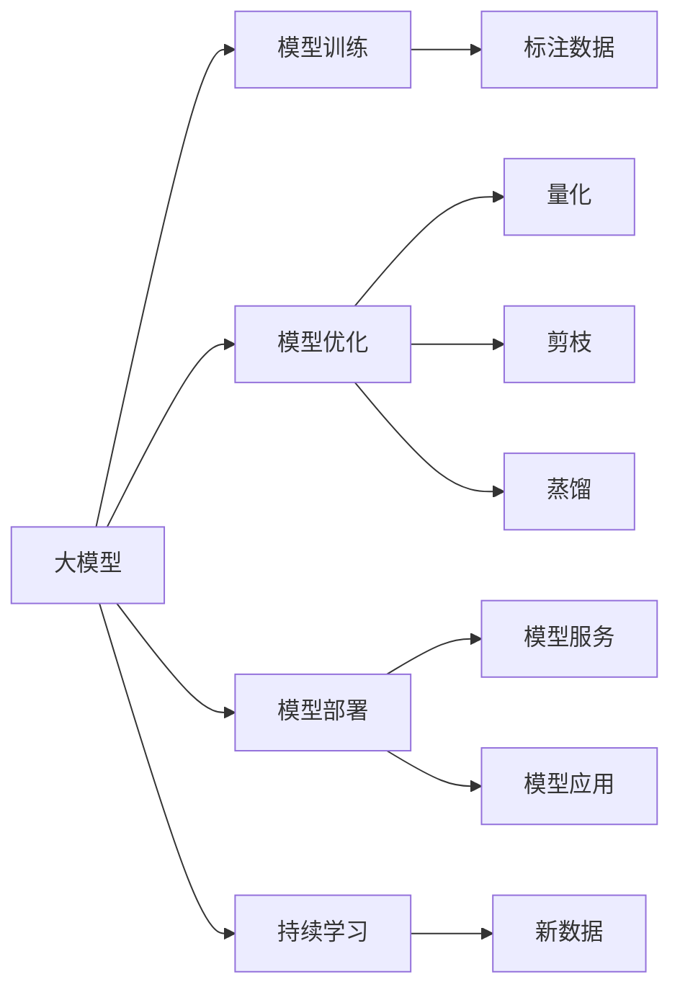

                 

# 大模型开发者的挑战与机遇

> 关键词：大模型开发, 挑战, 机遇, 数据处理, 模型设计, 性能优化, 持续学习

## 1. 背景介绍

在人工智能快速发展的当下，大模型（Large Models）作为新一代的计算工具，成为了各行业数字化转型的重要推动力。大模型通常指参数量超过百亿的模型，如BERT、GPT-3、T5等，这些模型在自然语言处理、计算机视觉、语音识别等多个领域展现了令人瞩目的性能。然而，大模型的开发和应用并非易事，大模型开发者面临诸多挑战，同时也拥有广阔的机遇。

### 1.1 大模型开发的挑战

大模型开发的挑战主要包括以下几个方面：

- **数据处理**：大模型的训练通常需要海量的标注数据，这些数据的收集、清洗、标注成本高且复杂。同时，由于大模型的复杂性，数据处理过程中的一些微小差异，可能会导致模型性能的大幅波动。
- **模型设计**：大模型的设计需要考虑模型架构、优化器、超参数、正则化等多种因素，设计和调试工作量大，且优化效果不一定理想。
- **计算资源**：大模型通常需要强大的计算资源进行训练，GPU、TPU等高性能设备的需求使得模型的训练和部署成本高昂。
- **性能优化**：模型的推理速度、内存占用等性能问题需要通过一系列优化手段进行改善，如量化、剪枝、蒸馏等，这些优化手段又可能引入新的问题。
- **持续学习**：大模型在实际应用中需要不断适应新数据，保持模型的时效性和适应性，持续学习策略的设计和应用也是大模型的重要挑战。

### 1.2 大模型开发的机遇

尽管存在诸多挑战，大模型的开发和应用同样带来了巨大的机遇：

- **高效的自动化能力**：大模型能够自动学习数据中的知识，减少了人工干预的需求，大幅提升了效率。
- **强大的泛化能力**：大模型在跨领域、跨任务上表现出色，可以应用于更多的实际场景。
- **创新空间广阔**：大模型提供了一个新的研究范式，吸引了众多开发者和研究者进行探索和创新，推动了技术的进步。
- **降低成本**：大模型在各个任务上的一站式解决方案，减少了对专业知识的需求，降低了开发的门槛。

## 2. 核心概念与联系

### 2.1 核心概念概述

在进行大模型开发时，我们需要掌握以下几个核心概念：

- **大模型**：指具有庞大参数量和复杂结构，能够学习到丰富知识的大型深度学习模型，如BERT、GPT-3、T5等。
- **模型训练**：通过大量数据训练模型，优化模型参数，使其能够准确预测任务输出。
- **模型优化**：通过各种方法提升模型的训练和推理效率，如量化、剪枝、蒸馏等。
- **模型部署**：将训练好的模型封装为可用的服务或应用，并适配具体的硬件和环境。
- **持续学习**：模型在实际应用中不断适应新数据，保持性能和适应性。

这些概念构成了大模型开发的全流程，从数据准备、模型训练到模型部署，再到持续学习，每个环节都影响着大模型的最终表现。

### 2.2 概念间的关系

通过以下Mermaid流程图，可以清晰地看到各个核心概念之间的关系：



这个流程图展示了从大模型到模型训练、优化、部署、持续学习的完整流程。标注数据是模型训练的前提，优化和部署提升了模型性能和可用性，而持续学习则保证了模型在实际应用中的高效性和适应性。

## 3. 核心算法原理 & 具体操作步骤

### 3.1 算法原理概述

大模型的开发通常遵循以下几个步骤：

1. **数据准备**：收集并处理用于训练和验证的数据。
2. **模型选择和设计**：选择合适的模型架构，如Transformer、RNN等，并设计模型的超参数。
3. **模型训练**：使用训练数据训练模型，并使用验证数据进行模型评估和调优。
4. **模型优化**：对训练好的模型进行量化、剪枝等优化操作，提升模型的推理效率。
5. **模型部署**：将优化后的模型封装为API或服务，适配特定的硬件和环境。
6. **持续学习**：在实际应用中不断收集新数据，更新和优化模型。

### 3.2 算法步骤详解

以下是具体的大模型开发步骤：

**Step 1: 数据准备**

数据准备是模型开发的基础，需要确保数据的完整性和多样性。常用的数据处理步骤包括：

- **数据收集**：从公开数据集、网络爬取、人工标注等方式收集数据。
- **数据清洗**：去除噪声数据、缺失值等。
- **数据标注**：根据具体任务进行标注，如分类任务的标签标注、生成任务的文本生成等。

**Step 2: 模型选择和设计**

模型选择和设计是模型开发的核心环节，需要根据具体任务选择合适的模型架构和超参数。常用的模型包括：

- **Transformer模型**：适合文本生成和分类任务。
- **RNN模型**：适合序列数据处理任务。
- **CNN模型**：适合图像处理任务。

超参数的选择需要根据经验进行反复调试，常用的超参数包括：

- **学习率**：控制模型更新速度。
- **批大小**：控制模型训练效率。
- **正则化参数**：控制模型的泛化能力。

**Step 3: 模型训练**

模型训练是模型开发的中心环节，需要选择合适的训练算法和优化器。常用的训练算法包括：

- **随机梯度下降（SGD）**：基本训练算法。
- **AdamW**：常用的优化器，适用于复杂模型。

常用的评估指标包括：

- **准确率**：适用于分类任务。
- **F1分数**：适用于不平衡分类任务。
- **BLEU分数**：适用于文本生成任务。

**Step 4: 模型优化**

模型优化是提升模型性能和推理效率的重要手段，常用的优化方法包括：

- **量化**：将浮点数转换为整数，减少内存占用和计算量。
- **剪枝**：去除模型中的冗余参数，减少计算量。
- **蒸馏**：通过小模型预测，减少大模型的计算量。

**Step 5: 模型部署**

模型部署是将训练好的模型适配具体应用场景的过程，常用的方法包括：

- **API封装**：将模型封装为API接口，方便调用。
- **模型服务**：将模型部署为服务，提高效率。
- **硬件适配**：根据具体硬件平台，优化模型的计算图和参数。

**Step 6: 持续学习**

持续学习是保持模型时效性和适应性的重要手段，常用的方法包括：

- **增量学习**：在线学习新数据，保持模型的时效性。
- **知识蒸馏**：通过小模型预测，学习新知识。
- **正则化**：控制模型的学习速度，防止过拟合。

### 3.3 算法优缺点

大模型的开发和应用带来了许多优点：

- **泛化能力强**：大模型可以自动学习数据的知识，适用于多种任务。
- **效率高**：自动化学习过程，减少了人工干预。
- **性能优异**：在多个任务上表现出色。

同时，大模型的开发和应用也存在一些缺点：

- **数据依赖性强**：大模型的训练需要大量的标注数据，数据收集和标注成本高。
- **计算资源需求高**：大模型需要强大的计算资源进行训练和推理，成本高。
- **性能问题多**：模型推理速度慢、内存占用大，需要进行优化。

### 3.4 算法应用领域

大模型在多个领域得到了广泛的应用，包括：

- **自然语言处理（NLP）**：如文本分类、情感分析、文本生成等。
- **计算机视觉（CV）**：如图像分类、目标检测、图像生成等。
- **语音识别（ASR）**：如语音转文本、语音合成等。
- **推荐系统**：如个性化推荐、广告推荐等。
- **游戏AI**：如游戏策略、角色控制等。

## 4. 数学模型和公式 & 详细讲解 & 举例说明

### 4.1 数学模型构建

大模型的开发通常需要构建数学模型，并使用优化算法进行训练。常用的数学模型包括：

- **损失函数**：衡量模型预测输出与真实标签之间的差异。
- **优化器**：通过梯度下降算法更新模型参数。

以文本分类任务为例，常用的数学模型和优化算法如下：

**损失函数**：交叉熵损失函数

$$
\mathcal{L}(\theta) = -\frac{1}{N}\sum_{i=1}^N [y_i\log \hat{y}_i + (1-y_i)\log (1-\hat{y}_i)]
$$

**优化器**：AdamW

$$
\theta \leftarrow \theta - \eta \nabla_{\theta}\mathcal{L}(\theta)
$$

其中 $\theta$ 为模型参数，$\eta$ 为学习率，$\nabla_{\theta}\mathcal{L}(\theta)$ 为损失函数对模型参数的梯度。

### 4.2 公式推导过程

以下是文本分类任务中，使用AdamW优化器进行模型训练的详细推导过程：

1. **前向传播**：将输入数据输入模型，计算模型输出 $\hat{y}$。
2. **损失函数**：计算损失函数 $\mathcal{L}(\theta)$。
3. **反向传播**：计算损失函数对模型参数的梯度 $\nabla_{\theta}\mathcal{L}(\theta)$。
4. **更新模型参数**：根据梯度和优化器更新模型参数 $\theta$。

具体推导过程如下：

$$
\begin{aligned}
\mathcal{L}(\theta) &= -\frac{1}{N}\sum_{i=1}^N [y_i\log \hat{y}_i + (1-y_i)\log (1-\hat{y}_i)] \\
&= -\frac{1}{N}\sum_{i=1}^N [y_i\log \hat{y}_i + (1-y_i)\log (1-\hat{y}_i)] \\
\nabla_{\theta}\mathcal{L}(\theta) &= \frac{1}{N}\sum_{i=1}^N [(y_i - \hat{y}_i)]
\end{aligned}
$$

根据以上推导过程，我们可以使用AdamW优化器更新模型参数，如：

$$
\theta \leftarrow \theta - \eta \nabla_{\theta}\mathcal{L}(\theta)
$$

其中 $\eta$ 为学习率，$\nabla_{\theta}\mathcal{L}(\theta)$ 为损失函数对模型参数的梯度。

### 4.3 案例分析与讲解

以BERT模型为例，分析其在大规模语言理解任务上的应用：

1. **数据准备**：使用大规模无标签文本数据对BERT进行预训练。
2. **模型选择和设计**：选择合适的Transformer模型结构，并设计超参数。
3. **模型训练**：使用标注数据对BERT进行微调，提升模型在特定任务上的性能。
4. **模型优化**：对微调后的BERT进行量化、剪枝等优化操作。
5. **模型部署**：将优化后的BERT封装为API接口，方便调用。
6. **持续学习**：在实际应用中不断收集新数据，更新和优化模型。

## 5. 项目实践：代码实例和详细解释说明

### 5.1 开发环境搭建

在开发大模型时，需要一个稳定的开发环境，通常使用Python和PyTorch。以下是搭建开发环境的详细步骤：

1. **安装Python**：从官网下载并安装Python，建议使用Anaconda进行管理。
2. **安装PyTorch**：根据CUDA版本，从官网获取对应的安装命令。例如：

```bash
conda install pytorch torchvision torchaudio cudatoolkit=11.1 -c pytorch -c conda-forge
```

3. **安装相关库**：安装TensorBoard、Weights & Biases、Transformers等常用库。

```bash
pip install tensorboard weights-biases transformers
```

### 5.2 源代码详细实现

以下是使用PyTorch和Transformers库进行BERT微调的具体实现：

```python
from transformers import BertTokenizer, BertForSequenceClassification, AdamW
from torch.utils.data import Dataset, DataLoader
from torch import nn
import torch

class TextDataset(Dataset):
    def __init__(self, texts, labels):
        self.texts = texts
        self.labels = labels
        
    def __len__(self):
        return len(self.texts)
    
    def __getitem__(self, idx):
        text = self.texts[idx]
        label = self.labels[idx]
        
        encoding = tokenizer(text, return_tensors='pt', padding=True, truncation=True, max_length=512)
        input_ids = encoding['input_ids']
        attention_mask = encoding['attention_mask']
        
        return {'input_ids': input_ids, 'attention_mask': attention_mask, 'labels': torch.tensor(label, dtype=torch.long)}

tokenizer = BertTokenizer.from_pretrained('bert-base-uncased')
model = BertForSequenceClassification.from_pretrained('bert-base-uncased', num_labels=2)
optimizer = AdamW(model.parameters(), lr=2e-5)

device = torch.device('cuda') if torch.cuda.is_available() else torch.device('cpu')
model.to(device)

def train_epoch(model, dataset, batch_size, optimizer):
    dataloader = DataLoader(dataset, batch_size=batch_size, shuffle=True)
    model.train()
    epoch_loss = 0
    for batch in dataloader:
        input_ids = batch['input_ids'].to(device)
        attention_mask = batch['attention_mask'].to(device)
        labels = batch['labels'].to(device)
        model.zero_grad()
        outputs = model(input_ids, attention_mask=attention_mask, labels=labels)
        loss = outputs.loss
        epoch_loss += loss.item()
        loss.backward()
        optimizer.step()
    return epoch_loss / len(dataloader)

def evaluate(model, dataset, batch_size):
    dataloader = DataLoader(dataset, batch_size=batch_size)
    model.eval()
    preds, labels = [], []
    with torch.no_grad():
        for batch in dataloader:
            input_ids = batch['input_ids'].to(device)
            attention_mask = batch['attention_mask'].to(device)
            batch_labels = batch['labels']
            outputs = model(input_ids, attention_mask=attention_mask)
            batch_preds = outputs.logits.argmax(dim=1).to('cpu').tolist()
            batch_labels = batch_labels.to('cpu').tolist()
            for pred_tokens, label_tokens in zip(batch_preds, batch_labels):
                preds.append(pred_tokens[:len(label_tokens)])
                labels.append(label_tokens)
                
    return torch.tensor(preds), torch.tensor(labels)

def main():
    epochs = 5
    batch_size = 16
    
    for epoch in range(epochs):
        loss = train_epoch(model, train_dataset, batch_size, optimizer)
        print(f'Epoch {epoch+1}, train loss: {loss:.3f}')
        
        dev_preds, dev_labels = evaluate(model, dev_dataset, batch_size)
        print(f'Epoch {epoch+1}, dev accuracy: {torch.nn.functional.accuracy(dev_preds, dev_labels):.3f}')
        
    test_preds, test_labels = evaluate(model, test_dataset, batch_size)
    print(f'Epoch {epochs}, test accuracy: {torch.nn.functional.accuracy(test_preds, test_labels):.3f}')

if __name__ == '__main__':
    main()
```

### 5.3 代码解读与分析

以下是代码的详细解读和分析：

1. **TextDataset类**：定义数据集的处理逻辑，包括文本的编码、输入id、注意力掩码等。
2. **模型选择和设计**：选择BERT模型结构，并指定标签数量。
3. **训练和评估函数**：定义训练和评估函数，使用AdamW优化器更新模型参数。
4. **主函数**：循环训练和评估模型，输出训练和评估结果。

## 6. 实际应用场景

大模型在多个实际应用场景中得到了广泛的应用：

### 6.1 医疗影像诊断

在大规模医疗影像数据上预训练的模型，可以用于辅助医生进行疾病诊断和治疗决策。如利用BERT模型对医学影像进行文本描述，结合卷积神经网络进行疾病诊断。

### 6.2 金融风险预测

在金融领域，大模型可以用于预测股票价格、分析市场情绪等。利用大模型的泛化能力，可以从历史数据中学习市场规律，预测未来的市场变化。

### 6.3 自动驾驶

在大规模自然语言和图像数据上预训练的模型，可以用于自动驾驶系统的智能交互和决策支持。如利用BERT模型对自然语言指令进行理解，生成驾驶策略。

### 6.4 机器人控制

在大规模语音和文本数据上预训练的模型，可以用于机器人的智能交互和任务执行。如利用大模型对语音指令进行理解，生成机器人的操作命令。

## 7. 工具和资源推荐

### 7.1 学习资源推荐

为了帮助开发者系统掌握大模型的开发，这里推荐一些优质的学习资源：

1. **《深度学习》**：Ian Goodfellow等著，全面介绍深度学习的基本概念和算法。
2. **《动手学深度学习》**：李沐等著，动手实践，深入浅出地介绍深度学习的核心技术。
3. **Coursera深度学习课程**：由Andrew Ng等教授主讲，涵盖了深度学习的各个方面。
4. **PyTorch官方文档**：PyTorch官方文档，包含丰富的教程和案例，帮助开发者快速上手。

### 7.2 开发工具推荐

大模型的开发通常使用Python和PyTorch，以下是几个常用的开发工具：

1. **Anaconda**：用于管理Python环境和库的生态系统。
2. **Jupyter Notebook**：交互式的Python开发环境，方便调试和分享代码。
3. **TensorBoard**：可视化模型训练过程和结果，方便调试和分析。
4. **Weights & Biases**：实时记录和可视化模型训练过程，方便调优。

### 7.3 相关论文推荐

以下是几篇具有代表性的相关论文，推荐阅读：

1. **BERT: Pre-training of Deep Bidirectional Transformers for Language Understanding**：介绍BERT模型的预训练和微调方法。
2. **GPT-3: Language Models are Unsupervised Multitask Learners**：介绍GPT-3模型的预训练和微调方法。
3. **Adapter-BASE: A Meta-Structure for Transfer Learning**：介绍适配器（Adapter）微调方法。
4. **Albert: A Lightweight Transformer for Self-supervised Learning of Language Representations**：介绍Albert模型的预训练和微调方法。

## 8. 总结：未来发展趋势与挑战

### 8.1 总结

大模型开发是一个复杂且充满挑战的过程，但也带来了巨大的机遇。大模型的高效、泛化能力强，可以应用于多个领域，提高工作效率和精度。然而，数据准备、模型设计、计算资源等都是大模型开发的难点。

### 8.2 未来发展趋势

展望未来，大模型的开发和应用将呈现以下几个趋势：

1. **自动化程度提高**：自动化学习过程将进一步减少人工干预，提高开发效率。
2. **模型规模增大**：大模型的参数量和结构将进一步提升，学习能力更强。
3. **应用领域拓展**：大模型将广泛应用于医疗、金融、自动驾驶等多个领域，带来更多实际应用场景。
4. **优化技术进步**：量化、剪枝、蒸馏等优化技术将不断进步，提升模型性能和推理效率。
5. **模型可解释性提升**：如何提高大模型的可解释性，将是大模型发展的重要方向。

### 8.3 面临的挑战

尽管大模型的开发和应用带来了许多机遇，但也存在以下挑战：

1. **数据收集和标注成本高**：大模型的训练需要大量标注数据，成本高。
2. **计算资源需求大**：大模型的训练和推理需要强大的计算资源，成本高。
3. **模型过拟合风险大**：大模型的过拟合风险大，需要多种优化手段进行缓解。
4. **模型可解释性差**：大模型的决策过程缺乏可解释性，难以调试和优化。
5. **模型安全性和隐私保护**：大模型的使用需要考虑安全性和隐私保护，避免有害信息输出。

### 8.4 研究展望

未来的研究需要在以下几个方面进行探索：

1. **无监督学习**：减少对标注数据的依赖，利用无监督和半监督学习进行模型训练。
2. **多模态学习**：融合视觉、语音等多模态信息，提升大模型的泛化能力和应用场景。
3. **小样本学习**：在数据量有限的情况下，利用小样本学习方法提高大模型的性能。
4. **模型可解释性**：提高大模型的可解释性，帮助用户理解和调试模型。
5. **模型安全性和隐私保护**：建立模型使用的安全性和隐私保护机制，确保输出安全。

总之，大模型开发和应用充满挑战，但也带来了许多机遇。未来的研究需要在多个方向进行探索和创新，不断提升大模型的性能和应用场景，推动人工智能技术的发展。

## 9. 附录：常见问题与解答

### Q1: 大模型的训练需要大量标注数据，如何处理数据收集和标注的成本问题？

**A**: 数据收集和标注的成本是制约大模型开发的重要因素。以下是一些处理数据收集和标注成本的策略：

1. **利用现有数据集**：从公开数据集中获取数据，减少标注成本。
2. **数据增强**：利用数据增强技术，从已有数据中生成新的训练样本。
3. **众包标注**：利用众包平台进行标注，减少人工标注成本。
4. **主动学习**：利用主动学习技术，选择最有价值的数据进行标注。

### Q2: 大模型在训练过程中容易出现过拟合，如何解决过拟合问题？

**A**: 过拟合是模型训练中常见的问题，以下是一些缓解过拟合的方法：

1. **正则化**：使用L2正则、Dropout等方法，防止模型过度适应训练数据。
2. **早停法**：在模型性能不再提升时，停止训练，防止过拟合。
3. **数据增强**：利用数据增强技术，生成更多训练样本。
4. **模型优化**：使用量化、剪枝、蒸馏等方法，优化模型结构。

### Q3: 如何提高大模型的推理速度和内存占用？

**A**: 大模型的推理速度和内存占用是影响实际应用的重要因素。以下是一些提高模型推理效率的方法：

1. **量化**：将模型参数从浮点数转换为定点数，减少内存占用和计算量。
2. **剪枝**：去除模型中的冗余参数，减小模型大小。
3. **蒸馏**：使用小模型进行预测，减少大模型的计算量。
4. **模型并行**：利用模型并行技术，将大模型拆分为多个小模型进行推理。

### Q4: 如何提高大模型的可解释性？

**A**: 大模型的可解释性是研究的热点问题。以下是一些提高模型可解释性的方法：

1. **可视化技术**：使用可视化技术，展示模型内部的权重和激活值。
2. **局部可解释性**：使用局部可解释性技术，展示模型对单个样本的推理过程。
3. **注意力机制**：使用注意力机制，展示模型对输入数据的关注点。
4. **因果推断**：利用因果推断技术，解释模型决策的因果关系。

### Q5: 大模型的开发和应用需要考虑哪些伦理和安全问题？

**A**: 大模型的开发和应用需要考虑伦理和安全问题，以下是一些需要考虑的方面：

1. **偏见和歧视**：大模型可能学习到有偏见的数据，导致不公平的输出。
2. **隐私保护**：大模型的使用需要考虑用户的隐私保护问题。
3. **模型可控性**：需要建立模型使用的监管机制，确保模型输出符合伦理和法律要求。

总之，大模型的开发和应用需要考虑多方面的因素，包括数据收集、模型设计、优化、部署、持续学习等环节。只有全面考虑这些因素，才能开发出高效、可靠、可控的大模型，服务于实际应用。

---

作者：禅与计算机程序设计艺术 / Zen and the Art of Computer Programming

