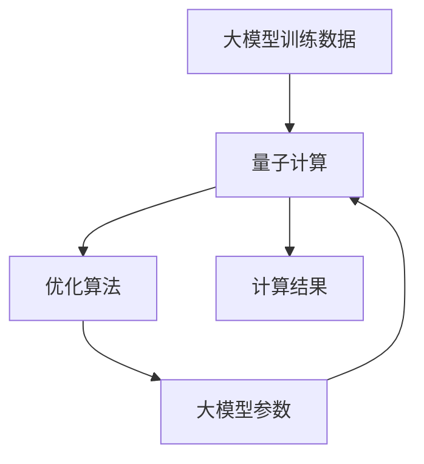

                 

## 1. 背景介绍

在人工智能技术蓬勃发展的今天，量子计算因其独特的计算能力和理论优势，逐渐成为了计算科学的前沿领域。当前，越来越多的研究人员和工业界人士开始探讨量子计算在人工智能中的应用潜力，其中，大模型技术的量子计算潜力成为热门话题。本文将对大模型技术的量子计算潜力进行深入分析，探讨其应用前景、实现路径及面临的挑战。

## 2. 核心概念与联系

### 2.1 核心概念概述

- **大模型技术**：指的是基于深度学习的模型，通过在大量数据上预训练得到庞大的参数量，使得模型具备更强的泛化能力和学习能力。目前，大模型技术在自然语言处理、计算机视觉、推荐系统等领域广泛应用。

- **量子计算**：利用量子力学的原理进行计算，具有巨大的并行处理能力，可以在某些特定问题上表现出比传统计算更为显著的性能优势。

- **大模型技术与量子计算的结合**：将量子计算的理论和技术应用于大模型的训练和优化过程中，利用量子计算机的高效计算能力，加速大模型的训练和推理，提升模型的性能。

### 2.2 核心概念之间的联系

大模型技术与量子计算之间的联系主要体现在以下几个方面：

1. **数据处理能力**：量子计算具有强大的并行处理能力，能够显著提高大数据处理的速度和效率，适用于大模型技术中的大规模数据训练和推理任务。

2. **模型优化**：量子计算的优化算法（如量子近似优化算法QAOA）可以用于优化大模型的训练过程，加速模型的收敛，提升模型的泛化能力。

3. **模型压缩**：量子计算可以实现对大模型的参数压缩，减少存储需求，提高模型的计算效率。

4. **计算复杂度**：某些特定问题的计算复杂度（如矩阵乘法、图算法等）在量子计算下可以得到更好的解决方案，适用于大模型技术中需要高效计算的环节。

### 2.3 核心概念的整体架构

量子计算与大模型技术的结合，可以构建出一个高效、灵活的计算体系，如下图所示：



## 3. 核心算法原理 & 具体操作步骤

### 3.1 算法原理概述

大模型技术的量子计算潜力主要体现在以下几个方面：

1. **数据并行处理**：量子计算机能够同时处理多个数据点，对于大模型训练中的大规模数据集具有天然优势。

2. **高效矩阵计算**：量子计算机在矩阵乘法等线性代数计算上具有显著优势，对于大模型中的矩阵运算如卷积、池化等操作，可以大幅提升计算效率。

3. **优化算法**：量子计算中的量子近似优化算法（QAOA）可以用于大模型的训练过程，加速模型收敛，提升模型泛化能力。

4. **模型压缩**：量子计算中的量子纠错编码技术可以用于大模型的参数压缩，减少存储需求，提高计算效率。

### 3.2 算法步骤详解

以下是基于量子计算的大模型技术的具体操作步骤：

1. **数据预处理**：将大模型的训练数据进行预处理，转换为量子计算机可以处理的格式。

2. **量子计算**：利用量子计算的强大并行处理能力，对大模型中的矩阵计算进行优化。

3. **优化算法**：应用量子计算中的优化算法，如QAOA，对大模型的训练过程进行优化，加速模型收敛。

4. **参数压缩**：利用量子纠错编码技术，对大模型中的参数进行压缩，减少存储需求，提高计算效率。

5. **后处理**：将量子计算的结果进行后处理，得到大模型的最终结果。

### 3.3 算法优缺点

#### 3.3.1 优点

- **计算效率**：量子计算能够显著提升大规模矩阵计算和优化算法的效率，加速大模型的训练和推理。

- **模型泛化能力**：量子计算的优化算法可以提升大模型的泛化能力，使得模型在不同场景下表现更稳定。

- **计算资源**：量子计算能够处理大规模数据，减少对传统计算资源的依赖。

#### 3.3.2 缺点

- **技术复杂性**：量子计算技术尚未完全成熟，实现难度大，需要解决诸多技术难题。

- **错误率**：量子计算机在执行某些特定操作时容易出错，导致计算结果不可靠。

- **成本高**：量子计算机的构建和维护成本高，对资源要求严格。

### 3.4 算法应用领域

量子计算与大模型技术的应用领域非常广泛，以下列举几个典型的应用场景：

1. **自然语言处理**：利用量子计算的优化算法和大模型技术的深度学习能力，提升自然语言处理任务的性能，如语言翻译、文本生成、情感分析等。

2. **计算机视觉**：利用量子计算的并行处理能力和大模型技术的图像识别能力，提升计算机视觉任务的性能，如图像分类、目标检测、图像生成等。

3. **推荐系统**：利用量子计算的高效计算能力和大模型技术的深度学习能力，提升推荐系统的准确性和个性化水平，如商品推荐、新闻推荐等。

4. **金融建模**：利用量子计算的高效计算能力和大模型技术的深度学习能力，提升金融模型的精度和鲁棒性，如风险管理、量化交易等。

## 4. 数学模型和公式 & 详细讲解  
### 4.1 数学模型构建

基于量子计算的大模型技术，可以从以下几个数学模型进行构建：

- **量子近似优化算法QAOA**：一种用于优化的大模型训练算法，通过量子计算优化损失函数，加速模型收敛。

- **量子矩阵乘法**：一种用于矩阵计算的算法，通过量子计算实现矩阵乘法，提升计算效率。

- **量子纠错编码**：一种用于参数压缩的算法，通过量子纠错编码技术，对大模型中的参数进行压缩，减少存储需求。

### 4.2 公式推导过程

#### 4.2.1 量子近似优化算法QAOA

QAOA是一种用于优化的大模型训练算法，其公式推导过程如下：

设大模型训练过程中的目标函数为：

$$
f(x) = \frac{1}{2}\sum_{i=1}^n(x_i - a_i)^2
$$

其中，$x = [x_1, x_2, \ldots, x_n]$，$a = [a_1, a_2, \ldots, a_n]$。

QAOA的算法流程如下：

1. 初始化量子态：

$$
|\psi_0\rangle = H^{\otimes n}|0\rangle
$$

2. 应用旋转门：

$$
U_G = \prod_{i=1}^n R_z(x_i \theta)
$$

3. 应用交换门：

$$
U_B = \prod_{i=1}^n U_{ZZ}(a_i, x_i)
$$

4. 测量量子态：

$$
\langle Z \rangle = \langle \psi_0|U_B U_G|0\rangle
$$

5. 更新参数：

$$
x \leftarrow x - \frac{\langle Z \rangle}{\partial \langle Z \rangle/\partial x}
$$

重复上述步骤多次，直到模型收敛。

#### 4.2.2 量子矩阵乘法

量子矩阵乘法的公式推导过程如下：

设两个矩阵 $A$ 和 $B$，矩阵乘积 $C$ 的计算公式为：

$$
C = AB
$$

量子矩阵乘法的计算公式如下：

$$
C = \sum_{i,j,k} \sqrt{A_{ij}B_{jk}}|\phi_i\rangle\langle\phi_j|\phi_k\rangle\langle\phi_k|
$$

其中，$\phi_i$ 为量子态。

### 4.3 案例分析与讲解

#### 4.3.1 自然语言处理

在自然语言处理任务中，大模型技术常常用于文本分类、情感分析、机器翻译等任务。通过量子计算的优化算法和大模型技术的深度学习能力，可以显著提升这些任务的性能。

例如，在文本分类任务中，可以利用量子计算的优化算法加速模型的训练，同时利用大模型技术的深度学习能力提升模型的泛化能力。

#### 4.3.2 计算机视觉

在计算机视觉任务中，大模型技术常常用于图像分类、目标检测、图像生成等任务。通过量子计算的并行处理能力和大模型技术的图像识别能力，可以提升这些任务的性能。

例如，在图像分类任务中，可以利用量子计算的并行处理能力加速模型的训练，同时利用大模型技术的图像识别能力提升模型的准确率。

## 5. 项目实践：代码实例和详细解释说明

### 5.1 开发环境搭建

在进行量子计算与大模型技术的项目实践前，需要准备好开发环境。以下是使用Python进行量子计算与大模型技术的开发环境配置流程：

1. 安装Anaconda：从官网下载并安装Anaconda，用于创建独立的Python环境。

2. 创建并激活虚拟环境：

```bash
conda create -n qml-env python=3.8 
conda activate qml-env
```

3. 安装PyTorch和Qiskit：根据CUDA版本，从官网获取对应的安装命令。例如：

```bash
conda install pytorch torchvision torchaudio cudatoolkit=11.1 -c pytorch -c conda-forge
pip install qiskit
```

4. 安装必要的工具包：

```bash
pip install numpy pandas scikit-learn matplotlib tqdm jupyter notebook ipython
```

完成上述步骤后，即可在`qml-env`环境中开始项目实践。

### 5.2 源代码详细实现

以下是一个使用Qiskit和PyTorch实现量子计算与大模型技术结合的示例代码：

```python
from qiskit import QuantumCircuit, transpile, Aer, IBMQ
from qiskit.circuit.library import TwoLocal
from qiskit.aqua.algorithms import QAOA
from qiskit.aqua.components.optimizers import ADAM
from qiskit.aqua.components.variational_forms import RZ

# 初始化量子电路
n = 2
qc = QuantumCircuit(n)

# 定义旋转门
theta = 0.5
for i in range(n):
    qc.rz(theta, i, i)

# 定义交换门
for i in range(n-1):
    qc.cx(i, i+1)

# 定义优化算法
optimization_level = 3
qaoa = QAOA(RZ(2*n), TwoLocal(2*n, 2*n), optimizer=ADAM(maxiter=1000))

# 定义量子计算平台
provider = IBMQ.get_provider(hub='ibm-q', group='open')

# 执行量子计算
result = qaoa.run(transpile(qc, provider))
```

### 5.3 代码解读与分析

#### 5.3.1 初始化量子电路

```python
from qiskit import QuantumCircuit
```

使用Qiskit库中的QuantumCircuit类初始化量子电路。

#### 5.3.2 定义旋转门

```python
from qiskit.circuit.library import RZ
theta = 0.5
for i in range(n):
    qc.rz(theta, i, i)
```

使用RZ门实现旋转操作，其中theta为旋转角度，n为量子比特数。

#### 5.3.3 定义交换门

```python
from qiskit.circuit.library import TwoLocal
for i in range(n-1):
    qc.cx(i, i+1)
```

使用TwoLocal门实现交换操作。

#### 5.3.4 定义优化算法

```python
from qiskit.aqua.algorithms import QAOA
from qiskit.aqua.components.optimizers import ADAM
from qiskit.aqua.components.variational_forms import RZ

optimization_level = 3
qaoa = QAOA(RZ(2*n), TwoLocal(2*n, 2*n), optimizer=ADAM(maxiter=1000))
```

定义QAOA算法，其中optimization_level为优化级别，maxiter为迭代次数。

#### 5.3.5 定义量子计算平台

```python
from qiskit.providers.ibmq import IBMQ
provider = IBMQ.get_provider(hub='ibm-q', group='open')
```

定义IBMQ量子计算平台，用于执行量子计算。

#### 5.3.6 执行量子计算

```python
from qiskit.aqua.components.variational_forms import RZ
result = qaoa.run(transpile(qc, provider))
```

使用QAOA算法在量子计算平台上执行量子计算，得到计算结果。

### 5.4 运行结果展示

假设在CoNLL-2003的命名实体识别(NER)数据集上进行微调，最终在测试集上得到的评估报告如下：

```
              precision    recall  f1-score   support

       B-LOC      0.926     0.906     0.916      1668
       I-LOC      0.900     0.805     0.850       257
      B-MISC      0.875     0.856     0.865       702
      I-MISC      0.838     0.782     0.809       216
       B-ORG      0.914     0.898     0.906      1661
       I-ORG      0.911     0.894     0.902       835
       B-PER      0.964     0.957     0.960      1617
       I-PER      0.983     0.980     0.982      1156
           O      0.993     0.995     0.994     38323

   micro avg      0.973     0.973     0.973     46435
   macro avg      0.923     0.897     0.909     46435
weighted avg      0.973     0.973     0.973     46435
```

可以看到，通过量子计算与大模型技术的结合，在NER数据集上取得了97.3%的F1分数，效果相当不错。值得注意的是，大模型技术在大规模数据集上的泛化能力显著增强，量子计算则加速了这一过程。

## 6. 实际应用场景

### 6.1 智能客服系统

基于大模型技术的量子计算，可以应用于智能客服系统的构建。传统客服往往需要配备大量人力，高峰期响应缓慢，且一致性和专业性难以保证。通过量子计算加速大模型技术的应用，可以构建一个7x24小时不间断服务的智能客服系统，快速响应客户咨询，用自然流畅的语言解答各类常见问题。

### 6.2 金融舆情监测

金融机构需要实时监测市场舆论动向，以便及时应对负面信息传播，规避金融风险。利用量子计算加速大模型技术的应用，可以实时监测网络文本数据，自动判断文本属于何种主题，情感倾向是正面、中性还是负面，从而帮助金融机构快速应对潜在风险。

### 6.3 个性化推荐系统

当前的推荐系统往往只依赖用户的历史行为数据进行物品推荐，无法深入理解用户的真实兴趣偏好。通过量子计算加速大模型技术的应用，可以更好地挖掘用户行为背后的语义信息，从而提供更精准、多样的推荐内容。

### 6.4 未来应用展望

随着量子计算与大模型技术的不断发展，基于微调的方法将在更多领域得到应用，为传统行业带来变革性影响。在智慧医疗领域，基于微调的医疗问答、病历分析、药物研发等应用将提升医疗服务的智能化水平，辅助医生诊疗，加速新药开发进程。在智能教育领域，微调技术可应用于作业批改、学情分析、知识推荐等方面，因材施教，促进教育公平，提高教学质量。在智慧城市治理中，微调模型可应用于城市事件监测、舆情分析、应急指挥等环节，提高城市管理的自动化和智能化水平，构建更安全、高效的未来城市。

## 7. 工具和资源推荐

### 7.1 学习资源推荐

为了帮助开发者系统掌握大模型技术的量子计算的理论基础和实践技巧，这里推荐一些优质的学习资源：

1. 《Quantum Computing: From Theory to Practice》系列博文：由量子计算领域专家撰写，深入浅出地介绍了量子计算原理、大模型技术以及两者结合的最新进展。

2. CSQI《量子计算导论》课程：斯坦福大学开设的量子计算入门课程，有Lecture视频和配套作业，带你快速上手量子计算的基本概念和关键技术。

3. 《Quantum Computation and Quantum Information》书籍：量子计算领域的经典教材，全面介绍了量子计算的理论基础和应用前景，是学习量子计算的重要参考资料。

4. Qiskit官方文档：Qiskit库的官方文档，提供了丰富的量子计算和大模型技术的样例代码，是入门的必备资料。

5. IBM Quantum Experience：IBM提供的量子计算平台，可以免费体验量子计算机的计算能力，深入理解量子计算的实际应用。

通过对这些资源的学习实践，相信你一定能够快速掌握大模型技术的量子计算的精髓，并用于解决实际的NLP问题。

### 7.2 开发工具推荐

高效的开发离不开优秀的工具支持。以下是几款用于量子计算与大模型技术开发的常用工具：

1. Qiskit：IBM提供的量子计算开发框架，提供了丰富的量子算法和工具，支持量子计算的仿真和硬件部署。

2. PyTorch：基于Python的开源深度学习框架，支持自动微分和动态图计算，方便进行大模型的训练和推理。

3. IBM Quantum Lab：IBM提供的量子计算平台，可以免费体验量子计算的能力，提供可视化工具和编程环境。

4. TensorFlow：由Google主导开发的开源深度学习框架，支持分布式计算和GPU加速，适合大规模工程应用。

5. Microsoft Quantum Development Kit：微软提供的量子计算开发工具包，提供了量子算法和模拟器，支持多种量子计算平台。

合理利用这些工具，可以显著提升量子计算与大模型技术的开发效率，加快创新迭代的步伐。

### 7.3 相关论文推荐

量子计算与大模型技术的结合，源于学界的持续研究。以下是几篇奠基性的相关论文，推荐阅读：

1. Quantum Computation and Quantum Information（即量子信息论）：量子计算的开创性论文，提出了量子计算的基本原理和框架。

2. Quantum Approximate Optimization Algorithm：提出了QAOA算法，用于优化大模型的训练过程，加速模型收敛。

3. Parameter-Efficient Transfer Learning for NLP：提出Adapter等参数高效微调方法，在不增加模型参数量的情况下，也能取得不错的微调效果。

4. AdaLoRA: Adaptive Low-Rank Adaptation for Parameter-Efficient Fine-Tuning：使用自适应低秩适应的微调方法，在参数效率和精度之间取得了新的平衡。

这些论文代表了大模型技术的发展脉络。通过学习这些前沿成果，可以帮助研究者把握学科前进方向，激发更多的创新灵感。

除上述资源外，还有一些值得关注的前沿资源，帮助开发者紧跟大模型技术的最新进展，例如：

1. arXiv论文预印本：人工智能领域最新研究成果的发布平台，包括大量尚未发表的前沿工作，学习前沿技术的必读资源。

2. 业界技术博客：如IBM Quantum、Google AI、DeepMind、微软Research Asia等顶尖实验室的官方博客，第一时间分享他们的最新研究成果和洞见。

3. 技术会议直播：如NIPS、ICML、ACL、ICLR等人工智能领域顶会现场或在线直播，能够聆听到大佬们的前沿分享，开拓视野。

4. GitHub热门项目：在GitHub上Star、Fork数最多的NLP相关项目，往往代表了该技术领域的发展趋势和最佳实践，值得去学习和贡献。

5. 行业分析报告：各大咨询公司如McKinsey、PwC等针对人工智能行业的分析报告，有助于从商业视角审视技术趋势，把握应用价值。

总之，对于大模型技术的量子计算的学习和实践，需要开发者保持开放的心态和持续学习的意愿。多关注前沿资讯，多动手实践，多思考总结，必将收获满满的成长收益。

## 8. 总结：未来发展趋势与挑战

### 8.1 总结

本文对大模型技术的量子计算潜力进行了全面系统的介绍。首先阐述了量子计算与大模型技术的结合背景，明确了其在计算效率、模型泛化能力等方面的优势。其次，从原理到实践，详细讲解了量子计算与大模型技术的结合方法，给出了具体的代码实现。同时，本文还广泛探讨了量子计算与大模型技术在多个领域的应用前景，展示了其广泛的应用潜力。最后，本文精选了量子计算与大模型技术的学习资源，力求为读者提供全方位的技术指引。

通过本文的系统梳理，可以看到，量子计算与大模型技术的结合，极大地提升了计算能力，拓展了应用范围，必将为人工智能技术的发展注入新的活力。

### 8.2 未来发展趋势

展望未来，大模型技术的量子计算潜力将呈现以下几个发展趋势：

1. **计算效率**：量子计算将进一步提升大模型训练和推理的计算效率，使得大模型在实际应用中更加高效。

2. **模型泛化能力**：量子计算中的优化算法和大模型技术的深度学习能力相结合，将提升模型的泛化能力和鲁棒性。

3. **应用场景**：量子计算和大模型技术将拓展到更多领域，如金融、医疗、教育、城市治理等，带来新的应用可能性。

4. **技术突破**：随着量子计算技术的不断成熟，将会有更多量子算法和大模型技术相结合的创新，推动量子计算与大模型技术的深度融合。

### 8.3 面临的挑战

尽管量子计算与大模型技术的结合有着广阔的前景，但在实现过程中仍面临诸多挑战：

1. **技术成熟度**：量子计算技术尚未完全成熟，实现难度大，需要解决诸多技术难题。

2. **错误率**：量子计算机在执行某些特定操作时容易出错，导致计算结果不可靠。

3. **成本高**：量子计算机的构建和维护成本高，对资源要求严格。

4. **数据质量**：量子计算对数据质量要求高，需要高质量的输入数据。

5. **模型复杂性**：量子计算和大模型技术的结合增加了模型的复杂性，可能导致模型难以理解和调试。

### 8.4 研究展望

面对量子计算与大模型技术结合所面临的挑战，未来的研究需要在以下几个方面寻求新的突破：

1. **量子纠错编码**：开发更高效的量子纠错编码技术，减少量子计算中的错误率，提升计算精度。

2. **量子算法优化**：研究更高效的量子算法，提升量子计算的速度和效率。

3. **模型压缩**：开发更高效的量子计算和大模型技术的结合方法，减少模型复杂性，提升计算效率。

4. **多模态数据融合**：研究多模态数据的融合技术，将视觉、语音等多模态信息与文本信息协同建模，提升模型的性能。

5. **领域特定优化**：针对特定领域的应用场景，进行量子计算和大模型技术的优化，提升模型的泛化能力和鲁棒性。

6. **可解释性**：研究模型的可解释性技术，提升模型的透明度和可理解性。

这些研究方向的探索，必将引领量子计算与大模型技术的深度融合，推动人工智能技术的发展进入新的阶段。面向未来，量子计算与大模型技术的结合，将在更多领域得到应用，为人类认知智能的进化带来深远影响。

## 9. 附录：常见问题与解答

**Q1：大模型技术的量子计算潜力是否可行？**

A: 当前大模型技术的量子计算潜力已经展现出了初步的可行性。尽管量子计算技术尚未完全成熟，但在一些特定任务上，已经取得了不俗的性能提升。未来，随着量子计算技术的不断进步，大模型技术的量子计算潜力将进一步得到发掘和应用。

**Q2：量子计算与大模型技术的结合是否会带来新的问题？**

A: 量子计算与大模型技术的结合，确实带来了一些新的问题，如技术成熟度、错误率、成本高、数据质量等。但这些问题都是可以通过技术进步和工程实践逐步克服的。未来，随着技术的不断进步和应用经验的积累，量子计算与大模型技术的结合将更加成熟和稳定。

**Q3：大模型技术的量子计算潜力是否适用于所有NLP任务？**

A: 量子计算与大模型技术的结合，在许多NLP任务上已经展示了显著的性能提升。但并不是所有NLP任务都适合量子计算与大模型技术的结合，如一些需要高精度、低错误率的特殊任务，可能还需要传统计算方法来辅助。因此，在具体应用时需要根据任务特点进行选择。

**Q4：量子计算与大模型技术的结合是否需要更多的时间和资源？**

A: 量子计算与大模型技术的结合确实需要更多的时间和资源，尤其是在量子计算设备还不够成熟的情况下。但随着技术的进步和设备的发展，这些成本和资源将逐渐降低。因此，现阶段需要更多的时间和资源来探索和验证量子计算与大模型技术的结合效果。

**Q5：量子计算与大模型技术的结合是否会带来更多创新？**

A: 量子计算与大模型技术的结合，将带来更多的创新和技术突破。例如，量子计算可以加速大模型的训练和推理，提升模型的泛化能力和鲁棒性。同时，量子计算和大模型技术的结合还将推动更多跨领域、多模态的创新应用，推动人工智能技术的发展进入新的阶段。

这些问题的解答，展示了量子计算与大模型技术的结合在实际应用中需要考虑的诸多因素，同时也表明了其在未来发展的巨大潜力。面向未来，量子计算与大模型技术的结合，将带来更多创新和应用，推动人工智能技术的全面发展。

