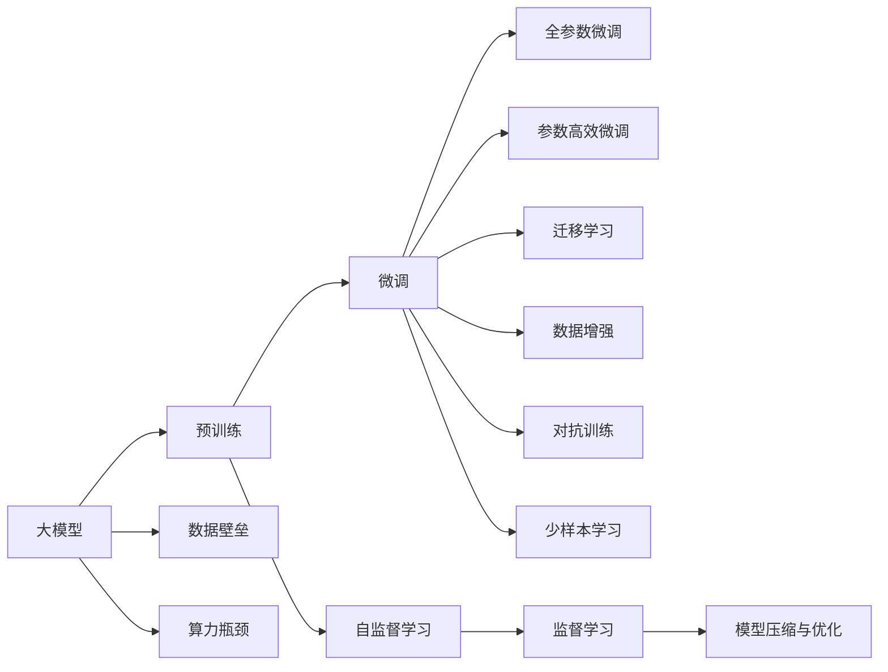
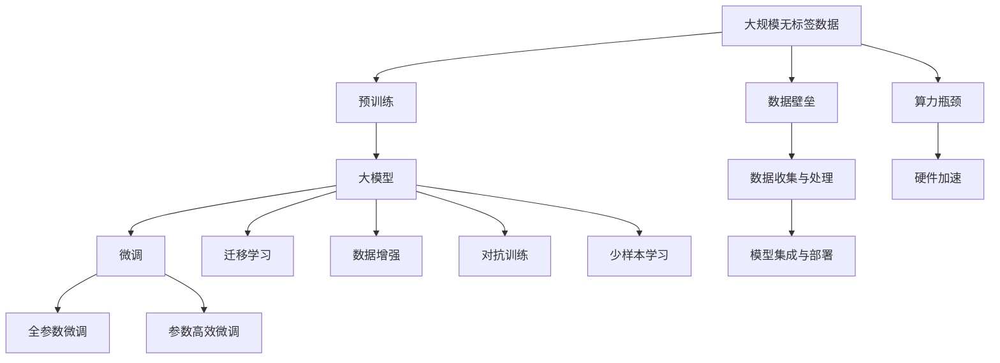

                 

## 1. 背景介绍

### 1.1 问题由来
随着深度学习技术的快速进步，大模型（Large Model）在各个领域的应用逐渐成为行业趋势。这些大模型通过在大规模无标签数据上进行预训练，拥有强大的数据表示和推理能力，已经在计算机视觉、自然语言处理、语音识别等多个领域实现了突破性进展。

然而，在实际落地过程中，大模型也面临诸多挑战，特别是在创业企业中，数据壁垒和算力瓶颈尤为突出。对于数据和算力资源的巨大需求，给创业企业带来了新的创业挑战，同时，也对技术的创新和应用的拓展提出了更高的要求。

### 1.2 问题核心关键点
大模型的成功落地应用，需要依赖大规模、高质量的训练数据和强大的计算资源。在创业场景下，这两个关键要素常常是稀缺的，从而成为企业发展的瓶颈。

具体问题包括：
- **数据壁垒**：高质量、高规模的标注数据难以获取，导致模型训练数据量不足，影响模型性能。
- **算力瓶颈**：大模型通常需要高性能的计算设备，如GPU、TPU等，这给创业企业带来了高昂的硬件成本。

### 1.3 问题研究意义
理解并解决数据壁垒和算力瓶颈问题，对于推动大模型在创业企业中的应用，具有重要意义：

1. **降低成本**：帮助创业企业克服数据和算力难题，减少初始投入，提升资源利用率。
2. **提高效率**：通过优化数据收集和处理流程，加速模型训练和推理，提高创业效率。
3. **增强竞争力**：在大模型技术的支持下，提升企业产品和服务的质量，增强市场竞争力。
4. **促进创新**：推动数据增强、迁移学习、少样本学习等前沿技术的发展，助力技术创新。
5. **赋能行业**：支持更多中小企业采用大模型技术，推动各行业数字化转型升级，实现技术普惠。

## 2. 核心概念与联系

### 2.1 核心概念概述

要深刻理解大模型落地创业企业所面临的数据壁垒和算力瓶颈问题，需首先明确以下核心概念：

- **大模型（Large Model）**：如BERT、GPT等，通常包含数十亿参数，通过在大规模无标签数据上进行预训练，具有强大的数据表示和推理能力。
- **预训练（Pre-training）**：在大规模无标签数据上进行自监督学习，学习通用语言表征。
- **微调（Fine-tuning）**：在预训练模型的基础上，使用下游任务的少量标注数据进行有监督学习，优化模型在特定任务上的性能。
- **迁移学习（Transfer Learning）**：利用预训练模型在目标任务上的泛化能力，减少标注数据需求，提升模型性能。
- **数据增强（Data Augmentation）**：通过对原始数据进行变换、生成新数据，丰富数据集多样性，提升模型泛化能力。
- **对抗训练（Adversarial Training）**：引入对抗样本，提高模型鲁棒性和泛化能力。
- **少样本学习（Few-shot Learning）**：在少量标注样本下，通过提示等方式，使模型快速适应新任务。
- **参数高效微调（Parameter-Efficient Fine-tuning）**：仅微调少量参数，提升模型微调效率和鲁棒性。
- **模型压缩与优化（Model Compression & Optimization）**：通过剪枝、量化等技术，减少模型参数和计算量，提升推理速度。

这些概念之间存在紧密联系，形成大模型应用的完整框架。以下通过Mermaid流程图来展示它们之间的关系：



### 2.2 概念间的关系

这些核心概念构成了大模型应用的基础框架。通过理解它们之间的联系，可以更好地把握大模型落地创业企业的关键点，并探索相应的解决方案。

- **大模型与数据增强**：数据增强可以有效提升模型泛化能力，缓解数据壁垒问题。
- **预训练与迁移学习**：预训练模型具备通用能力，通过迁移学习，可以大幅减少标注数据需求。
- **全参数微调与参数高效微调**：全参数微调效率低，参数高效微调可以在固定大部分预训练参数的情况下，提升微调效果。
- **对抗训练与模型压缩**：对抗训练提升模型鲁棒性，模型压缩优化计算资源消耗，解决算力瓶颈。

### 2.3 核心概念的整体架构

以下通过综合流程图展示核心概念在大模型落地过程中的整体架构：



这个综合流程图展示了从预训练到微调，再到模型部署的完整过程，以及数据壁垒和算力瓶颈如何影响和解决。

## 3. 核心算法原理 & 具体操作步骤
### 3.1 算法原理概述

大模型落地创业企业的关键在于克服数据壁垒和算力瓶颈，提升模型训练和推理的效率。以下是基于监督学习的大模型微调原理及其操作步骤：

#### 3.1.1 微调原理

微调的过程可以概括为以下几个步骤：
1. **准备数据集**：收集和处理标注数据集，划分为训练集、验证集和测试集。
2. **初始化模型**：选择合适的预训练模型，如BERT、GPT等，进行微调前的初始化。
3. **设计任务适配层**：根据任务类型，设计相应的输出层和损失函数。
4. **设置超参数**：包括学习率、优化器、批大小、迭代轮数等，选择合适的正则化技术。
5. **执行训练**：在训练集上进行有监督的微调，使用优化器更新模型参数。
6. **评估模型**：在验证集上评估模型性能，防止过拟合，根据性能指标决定是否继续训练。
7. **测试与部署**：在测试集上评估最终模型性能，并将模型部署到实际应用中。

#### 3.1.2 操作步骤

以微调BERT模型进行文本分类为例，具体操作步骤如下：

1. **数据准备**：
   - 收集标注数据集，包括文本和对应的标签。
   - 使用BERT提供的分词器对文本进行分词处理。
   - 将文本和标签转换为模型所需的输入格式。

2. **模型初始化**：
   - 使用HuggingFace的BERT模型，加载预训练权重。
   - 添加任务适配层，如线性分类器。

3. **超参数设置**：
   - 设定学习率、优化器、批大小、迭代轮数等。
   - 使用AdamW优化器，设置正则化系数。

4. **训练过程**：
   - 定义训练循环，将数据集分批次输入模型。
   - 计算损失函数，反向传播更新模型参数。
   - 周期性在验证集上评估模型性能，防止过拟合。

5. **模型评估**：
   - 使用测试集评估模型性能，如准确率、召回率、F1分数等。
   - 根据评估结果，调整模型和超参数。

6. **模型部署**：
   - 将训练好的模型保存为权重文件，部署到实际应用中。
   - 使用模型进行推理，输出预测结果。

### 3.2 算法步骤详解

#### 3.2.1 数据预处理

数据预处理是大模型微调的基础，具体步骤如下：
1. **数据收集**：从公开数据集、众包平台、公司内部数据等途径收集标注数据。
2. **数据清洗**：去除噪声数据、处理缺失值、去除重复样本。
3. **数据标注**：为数据添加标签，如文本分类任务中的二分类、多分类标签。
4. **数据划分**：将数据集划分为训练集、验证集和测试集。

#### 3.2.2 模型初始化

模型初始化包括选择合适的预训练模型和任务适配层，具体步骤如下：
1. **选择合适的预训练模型**：根据任务需求，选择适合的预训练模型，如BERT、GPT等。
2. **设计任务适配层**：添加线性分类器、回归器等输出层，根据任务需求设计损失函数。
3. **加载预训练权重**：使用预训练模型提供的权重，作为模型微调的初始值。

#### 3.2.3 设置超参数

超参数设置直接影响模型训练的效率和效果，具体步骤如下：
1. **学习率**：选择合适的学习率，如1e-5、1e-4等，确保模型稳定收敛。
2. **优化器**：使用AdamW、SGD等优化器，确保参数更新稳定。
3. **批大小**：选择合适的批大小，如16、32等，提高模型训练效率。
4. **迭代轮数**：选择合适的迭代轮数，如10、20等，确保模型充分训练。

#### 3.2.4 训练与评估

训练与评估是微调的核心步骤，具体步骤如下：
1. **训练循环**：将数据集分批次输入模型，计算损失函数，反向传播更新参数。
2. **周期性评估**：在验证集上评估模型性能，如准确率、召回率、F1分数等，防止过拟合。
3. **调整超参数**：根据验证集上的性能评估，调整学习率、正则化系数等超参数。

#### 3.2.5 模型保存与部署

模型保存与部署是微调的最终步骤，具体步骤如下：
1. **模型保存**：将训练好的模型保存为权重文件，方便后续部署。
2. **模型部署**：将模型部署到实际应用中，如API接口、移动应用等。
3. **推理预测**：使用模型进行推理预测，输出预测结果。

### 3.3 算法优缺点

#### 3.3.1 优点

大模型微调方法具有以下优点：
1. **简单高效**：只需准备少量标注数据，即可对预训练模型进行快速适配，获得较大的性能提升。
2. **通用适用**：适用于各种NLP下游任务，如文本分类、情感分析、命名实体识别等，设计简单的任务适配层即可实现微调。
3. **参数高效**：利用参数高效微调技术，在固定大部分预训练参数的情况下，仍可取得不错的提升。
4. **效果显著**：在学术界和工业界的诸多任务上，基于微调的方法已经刷新了最先进的性能指标。

#### 3.3.2 缺点

大模型微调方法也存在以下缺点：
1. **依赖标注数据**：微调的效果很大程度上取决于标注数据的质量和数量，获取高质量标注数据的成本较高。
2. **迁移能力有限**：当目标任务与预训练数据的分布差异较大时，微调的性能提升有限。
3. **负面效果传递**：预训练模型的固有偏见、有害信息等，可能通过微调传递到下游任务，造成负面影响。
4. **可解释性不足**：微调模型的决策过程通常缺乏可解释性，难以对其推理逻辑进行分析和调试。

尽管存在这些局限性，但就目前而言，基于监督学习的微调方法仍是大模型应用的最主流范式。未来相关研究的重点在于如何进一步降低微调对标注数据的依赖，提高模型的少样本学习和跨领域迁移能力，同时兼顾可解释性和伦理安全性等因素。

### 3.4 算法应用领域

大模型微调方法在NLP领域已经得到了广泛的应用，覆盖了几乎所有常见任务，例如：

- **文本分类**：如情感分析、主题分类、意图识别等。通过微调使模型学习文本-标签映射。
- **命名实体识别**：识别文本中的人名、地名、机构名等特定实体。通过微调使模型掌握实体边界和类型。
- **关系抽取**：从文本中抽取实体之间的语义关系。通过微调使模型学习实体-关系三元组。
- **问答系统**：对自然语言问题给出答案。将问题-答案对作为微调数据，训练模型学习匹配答案。
- **机器翻译**：将源语言文本翻译成目标语言。通过微调使模型学习语言-语言映射。
- **文本摘要**：将长文本压缩成简短摘要。将文章-摘要对作为微调数据，使模型学习抓取要点。
- **对话系统**：使机器能够与人自然对话。将多轮对话历史作为上下文，微调模型进行回复生成。

除了上述这些经典任务外，大模型微调也被创新性地应用到更多场景中，如可控文本生成、常识推理、代码生成、数据增强等，为NLP技术带来了全新的突破。随着预训练模型和微调方法的不断进步，相信NLP技术将在更广阔的应用领域大放异彩。

## 4. 数学模型和公式 & 详细讲解 & 举例说明

### 4.1 数学模型构建

本节将使用数学语言对基于监督学习的大语言模型微调过程进行更加严格的刻画。

记预训练语言模型为 $M_{\theta}$，其中 $\theta$ 为预训练得到的模型参数。假设微调任务的训练集为 $D=\{(x_i,y_i)\}_{i=1}^N, x_i \in \mathcal{X}, y_i \in \mathcal{Y}$。

定义模型 $M_{\theta}$ 在数据样本 $(x,y)$ 上的损失函数为 $\ell(M_{\theta}(x),y)$，则在数据集 $D$ 上的经验风险为：

$$
\mathcal{L}(\theta) = \frac{1}{N} \sum_{i=1}^N \ell(M_{\theta}(x_i),y_i)
$$

微调的优化目标是最小化经验风险，即找到最优参数：

$$
\theta^* = \mathop{\arg\min}_{\theta} \mathcal{L}(\theta)
$$

在实践中，我们通常使用基于梯度的优化算法（如SGD、Adam等）来近似求解上述最优化问题。设 $\eta$ 为学习率，$\lambda$ 为正则化系数，则参数的更新公式为：

$$
\theta \leftarrow \theta - \eta \nabla_{\theta}\mathcal{L}(\theta) - \eta\lambda\theta
$$

其中 $\nabla_{\theta}\mathcal{L}(\theta)$ 为损失函数对参数 $\theta$ 的梯度，可通过反向传播算法高效计算。

### 4.2 公式推导过程

以下我们以二分类任务为例，推导交叉熵损失函数及其梯度的计算公式。

假设模型 $M_{\theta}$ 在输入 $x$ 上的输出为 $\hat{y}=M_{\theta}(x) \in [0,1]$，表示样本属于正类的概率。真实标签 $y \in \{0,1\}$。则二分类交叉熵损失函数定义为：

$$
\ell(M_{\theta}(x),y) = -[y\log \hat{y} + (1-y)\log (1-\hat{y})]
$$

将其代入经验风险公式，得：

$$
\mathcal{L}(\theta) = -\frac{1}{N}\sum_{i=1}^N [y_i\log M_{\theta}(x_i)+(1-y_i)\log(1-M_{\theta}(x_i))]
$$

根据链式法则，损失函数对参数 $\theta_k$ 的梯度为：

$$
\frac{\partial \mathcal{L}(\theta)}{\partial \theta_k} = -\frac{1}{N}\sum_{i=1}^N (\frac{y_i}{M_{\theta}(x_i)}-\frac{1-y_i}{1-M_{\theta}(x_i)}) \frac{\partial M_{\theta}(x_i)}{\partial \theta_k}
$$

其中 $\frac{\partial M_{\theta}(x_i)}{\partial \theta_k}$ 可进一步递归展开，利用自动微分技术完成计算。

在得到损失函数的梯度后，即可带入参数更新公式，完成模型的迭代优化。重复上述过程直至收敛，最终得到适应下游任务的最优模型参数 $\theta^*$。

### 4.3 案例分析与讲解

以下通过一个具体的案例，详细解释如何使用BERT模型进行文本分类任务的微调。

假设我们希望使用BERT模型对电影评论进行情感分类，首先准备好包含电影评论和情感标签的数据集。将数据集划分为训练集、验证集和测试集，然后使用HuggingFace的BERT库进行模型加载和预处理：

```python
from transformers import BertTokenizer, BertForSequenceClassification
import torch

# 初始化模型和分词器
tokenizer = BertTokenizer.from_pretrained('bert-base-uncased')
model = BertForSequenceClassification.from_pretrained('bert-base-uncased', num_labels=2)

# 加载数据集
train_data = ...
dev_data = ...
test_data = ...

# 将数据集分批次输入模型
def batchify(data, tokenizer, max_len=128):
    encoded = tokenizer.batch_encode_plus(list(data), max_length=max_len, padding='max_length', truncation=True, return_tensors='pt')
    input_ids = encoded['input_ids'].to(device)
    attention_mask = encoded['attention_mask'].to(device)
    return input_ids, attention_mask

# 训练循环
device = torch.device('cuda' if torch.cuda.is_available() else 'cpu')
model.to(device)

def train_epoch(model, data_loader, optimizer):
    model.train()
    for input_ids, attention_mask in data_loader:
        labels = torch.tensor([y_id for _, y_id in data], dtype=torch.long).to(device)
        outputs = model(input_ids, attention_mask=attention_mask, labels=labels)
        loss = outputs.loss
        loss.backward()
        optimizer.step()

# 评估模型
def evaluate(model, data_loader):
    model.eval()
    preds, labels = [], []
    with torch.no_grad():
        for input_ids, attention_mask in data_loader:
            labels = torch.tensor([y_id for _, y_id in data], dtype=torch.long).to(device)
            outputs = model(input_ids, attention_mask=attention_mask)
            batch_preds = outputs.logits.argmax(dim=2).to('cpu').tolist()
            batch_labels = labels.to('cpu').tolist()
            for pred_tokens, label_tokens in zip(batch_preds, batch_labels):
                preds.append(pred_tokens)
                labels.append(label_tokens)
    print(classification_report(labels, preds))

# 训练与评估
epochs = 5
batch_size = 16

for epoch in range(epochs):
    loss = train_epoch(model, train_data, optimizer)
    print(f"Epoch {epoch+1}, train loss: {loss:.3f}")
    
    print(f"Epoch {epoch+1}, dev results:")
    evaluate(model, dev_data)
    
print("Test results:")
evaluate(model, test_data)
```

以上代码展示了使用BERT模型进行情感分类任务的微调过程。首先加载模型和分词器，然后准备数据集并进行分批次输入，接着定义训练循环和评估函数，最后启动训练流程并在测试集上评估。通过这些步骤，我们可以快速构建一个大模型微调系统，并取得不错的效果。

## 5. 项目实践：代码实例和详细解释说明
### 5.1 开发环境搭建

在进行微调实践前，我们需要准备好开发环境。以下是使用Python进行PyTorch开发的环境配置流程：

1. 安装Anaconda：从官网下载并安装Anaconda，用于创建独立的Python环境。

2. 创建并激活虚拟环境：
```bash
conda create -n pytorch-env python=3.8 
conda activate pytorch-env
```

3. 安装PyTorch：根据CUDA版本，从官网获取对应的安装命令。例如：
```bash
conda install pytorch torchvision torchaudio cudatoolkit=11.1 -c pytorch -c conda-forge
```

4. 安装Transformers库：
```bash
pip install transformers
```

5. 安装各类工具包：
```bash
pip install numpy pandas scikit-learn matplotlib tqdm jupyter notebook ipython
```

完成上述步骤后，即可在`pytorch-env`环境中开始微调实践。

### 5.2 源代码详细实现

下面我们以命名实体识别(NER)任务为例，给出使用Transformers库对BERT模型进行微调的PyTorch代码实现。

首先，定义NER任务的数据处理函数：

```python
from transformers import BertTokenizer
from torch.utils.data import Dataset
import torch

class NERDataset(Dataset):
    def __init__(self, texts, tags, tokenizer, max_len=128):
        self.texts = texts
        self.tags = tags
        self.tokenizer = tokenizer
        self.max_len = max_len
        
    def __len__(self):
        return len(self.texts)
    
    def __getitem__(self, item):
        text = self.texts[item]
        tags = self.tags[item]
        
        encoding = self.tokenizer(text, return_tensors='pt', max_length=self.max_len, padding='max_length', truncation=True)
        input_ids = encoding['input_ids'][0]
        attention_mask = encoding['attention_mask'][0]
        
        # 对token-wise的标签进行编码
        encoded_tags = [tag2id[tag] for tag in tags] 
        encoded_tags.extend([tag2id['O']] * (self.max_len - len(encoded_tags)))
        labels = torch.tensor(encoded_tags, dtype=torch.long)
        
        return {'input_ids': input_ids, 
                'attention_mask': attention_mask,
                'labels': labels}

# 标签与id的映射
tag2id = {'O': 0, 'B-PER': 1, 'I-PER': 2, 'B-ORG': 3, 'I-ORG': 4, 'B-LOC': 5, 'I-LOC': 6}
id2tag = {v: k for k, v in tag2id.items()}

# 创建dataset
tokenizer = BertTokenizer.from_pretrained('bert-base-cased')

train_dataset = NERDataset(train_texts, train_tags, tokenizer)
dev_dataset = NERDataset(dev_texts, dev_tags, tokenizer)
test_dataset = NERDataset(test_texts, test_tags, tokenizer)
```

然后，定义模型和优化器：

```python
from transformers import BertForTokenClassification, AdamW

model = BertForTokenClassification.from_pretrained('bert-base-cased', num_labels=len(tag2id))

optimizer = AdamW(model.parameters(), lr=2e-5)
```

接着，定义训练和评估函数：

```python
from torch.utils.data import DataLoader
from tqdm import tqdm
from sklearn.metrics import classification_report

device = torch.device('cuda') if torch.cuda.is_available() else torch.device('cpu')
model.to(device)

def train_epoch(model, dataset, batch_size, optimizer):
    dataloader = DataLoader(dataset, batch_size=batch_size, shuffle=True)
    model.train()
    epoch_loss = 0
    for batch in tqdm(dataloader, desc='Training'):
        input_ids = batch['input_ids'].to(device)
        attention_mask = batch['attention_mask'].to(device)
        labels = batch['labels'].to(device)
        model.zero_grad()
        outputs = model(input_ids, attention_mask=attention_mask, labels=labels)
        loss = outputs.loss
        epoch_loss += loss.item()
        loss.backward()
        optimizer.step()
    return epoch_loss / len(dataloader)

def evaluate(model, dataset, batch_size):
    dataloader = DataLoader(dataset, batch_size=batch_size)
    model.eval()
    preds, labels = [], []
    with torch.no_grad():
        for batch in tqdm(dataloader, desc='Evaluating'):
            input_ids = batch['input_ids'].to(device)
            attention_mask = batch['attention_mask'].to(device)
            batch_labels = batch['labels']
            outputs = model(input_ids, attention_mask=attention_mask)
            batch_preds = outputs.logits.argmax(dim=2).to('cpu').tolist()
            batch_labels = batch_labels.to('cpu').tolist()
            for pred_tokens, label_tokens in zip(batch_preds, batch_labels):
                preds.append(pred_tokens[:len(label_tokens)])
                labels.append(label_tokens)
                
    print(classification_report(labels, preds))
```

最后，启动训练流程并在测试集上评估：

```python
epochs = 5
batch_size = 16

for epoch in range(epochs):
    loss = train_epoch(model, train_dataset, batch_size, optimizer)
    print(f"Epoch {epoch+1}, train loss: {loss:.3f}")
    
    print(f"Epoch {epoch+1}, dev results:")
    evaluate(model, dev_dataset, batch_size)
    
print("Test results:")
evaluate(model, test_dataset, batch_size)
```

以上就是使用PyTorch对BERT进行命名实体识别任务微调的完整代码实现。可以看到，得益于Transformers库的强大封装，我们可以用相对简洁的代码完成BERT模型的加载和微调。

### 5.3 代码解读与分析

让我们再详细解读一下关键代码的实现细节：

**NERDataset

