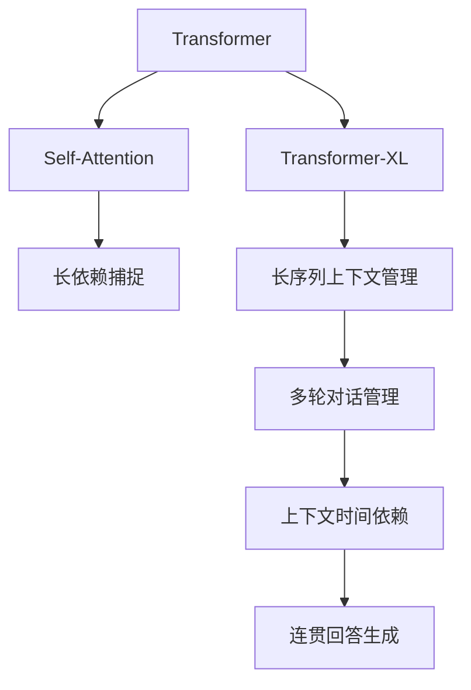

                 

# 大模型问答机器人如何处理上下文

> 关键词：大模型问答机器人,上下文管理,Transformer,Self-Attention,Transformer-XL,多轮对话,时间依赖

## 1. 背景介绍

### 1.1 问题由来

在人工智能领域，对话系统作为一项具有广泛应用前景的技术，近年来迅速发展。其中，问答机器人因其能够实时响应用户查询，而广受关注。问答机器人通过接收用户输入的问题，利用预训练语言模型或神经网络进行推理和预测，生成问题答案。然而，现有的对话模型往往在处理复杂、多轮对话时表现不佳，尤其在理解上下文方面存在不足。

具体而言，在多轮对话中，对话机器人需要理解上文信息，并将其与当前问题进行关联。这要求模型具备良好的上下文理解能力，以便生成连贯、合理的回答。因此，如何设计高效、准确的上下文管理机制，成为问答机器人研究的关键问题。

### 1.2 问题核心关键点

上下文管理是对话系统中的核心问题，涉及如何有效地利用前轮对话信息来辅助当前轮次推理，并保证生成答案的连贯性和准确性。

在上下文处理上，现有方法主要可分为两类：

- **显式上下文管理**：在模型输入中明确添加上文信息，如通过一句话或多句话作为上下文输入，或者使用标签向量、位置向量等表示上下文信息。这类方法简单直观，但可能需要额外的输入，增加了模型复杂度。

- **隐式上下文管理**：将上下文信息隐含在模型参数中，如使用Transformer的Self-Attention机制，通过Attention权重自动捕捉上下文信息，无需额外的输入。这类方法更高效、更符合自然语言的使用习惯，但需要模型设计者对Self-Attention机制有深入理解。

本文聚焦于隐式上下文管理方法，主要探讨基于Transformer模型的上下文处理方法，包括经典模型如BERT、GPT等，以及近期的改进模型如Transformer-XL等。

### 1.3 问题研究意义

上下文管理是问答机器人的核心能力之一，其性能直接决定了机器人回答的连贯性和准确性。一个良好的上下文管理机制，能够帮助机器人在多轮对话中捕捉和利用历史信息，从而生成流畅、合理的回答。这对于提升问答机器人的用户体验、扩大应用范围具有重要意义：

1. **提高回答质量**：通过理解上下文信息，机器人在生成回答时能够更准确地把握问题意图和情境，避免产生无关或不合理的回答。
2. **增强对话连贯性**：良好的上下文管理机制能够使机器人保持对话连贯，避免因忘记上下文而出现断层或不一致的回答。
3. **减少用户干预**：一个能够自动捕捉上下文的机器人，可以大幅减少用户需要重新输入上下文的情况，提高用户互动体验。
4. **支持多轮对话**：对于复杂的多轮对话，良好的上下文管理是确保机器人生成连贯回答的关键。
5. **降低系统设计复杂度**：将上下文信息隐含在模型参数中，可以简化系统设计和实现，提升系统的可维护性和可扩展性。

## 2. 核心概念与联系

### 2.1 核心概念概述

为更好地理解基于Transformer模型的上下文处理方法，本节将介绍几个密切相关的核心概念：

- **Transformer**：一种基于自注意力机制的自编码模型，广泛应用于NLP任务中。Transformer通过多头注意力机制捕捉输入序列间的复杂依赖关系，取得了诸多NLP任务的SOTA结果。

- **Self-Attention**：Transformer的核心机制之一，用于计算输入序列中各个位置对其它位置的注意力权重。通过计算加权和，Self-Attention可以捕捉输入序列的长期依赖关系。

- **Transformer-XL**：一种改进的Transformer模型，通过引入相对位置编码和前向指针机制，解决了经典Transformer在处理长序列时的梯度消失问题，支持长文本的上下文管理。

- **Transformer-XL架构**：Transformer-XL采用固定长度的段(Chunk)进行前后文对齐，使用前向指针机制传递信息，解决长序列的梯度消失问题。

- **多轮对话管理**：在对话系统中，多轮对话需要模型能够理解上文信息，并将其与当前问题进行关联。这要求模型能够捕捉上下文中的时间依赖关系，生成连贯的回答。

- **注意力机制**：通过注意力权重，模型能够根据输入序列中的重要信息进行加权求和，捕捉序列的长期依赖关系。

这些核心概念之间的逻辑关系可以通过以下Mermaid流程图来展示：



这个流程图展示了大模型问答机器人中上下文处理的核心概念及其之间的关系：

1. Transformer通过Self-Attention捕捉输入序列的依赖关系。
2. Transformer-XL通过相对位置编码和前向指针机制，解决经典Transformer在处理长序列时的梯度消失问题，支持长文本的上下文管理。
3. 多轮对话管理要求模型捕捉上下文中的时间依赖关系，生成连贯的回答。
4. 注意力机制通过计算Attention权重，捕捉序列的长期依赖关系。

## 3. 核心算法原理 & 具体操作步骤
### 3.1 算法原理概述

基于Transformer模型的上下文处理主要依赖于Self-Attention机制。Self-Attention通过计算输入序列中每个位置对其它位置的注意力权重，捕捉序列中的依赖关系，从而生成加权和的结果。

Transformer-XL则在此基础上，通过引入相对位置编码和前向指针机制，支持长序列的上下文管理，从而解决经典Transformer在处理长序列时的梯度消失问题。

具体而言，Transformer-XL在处理长序列时，将其划分为固定长度的段(Chunk)，每个段独立进行Self-Attention计算，并通过前向指针机制传递信息，实现跨段的上下文管理。此外，Transformer-XL还使用相对位置编码，使得模型能够捕捉序列中的时间依赖关系，更好地生成连贯的回答。

### 3.2 算法步骤详解

Transformer-XL的上下文处理步骤主要包括以下几个关键步骤：

1. **段划分**：将输入序列划分为固定长度的段(Chunk)，每个段独立进行Self-Attention计算。
2. **相对位置编码**：使用相对位置编码，捕捉输入序列中各个位置的时间依赖关系。
3. **前向指针机制**：通过前向指针机制，将上文信息传递到当前段，支持长序列的上下文管理。
4. **自注意力计算**：在每个段内部进行Self-Attention计算，捕捉段内依赖关系。
5. **层间传递信息**：通过跨层的传递机制，使不同层的输出相互关联，捕捉段间的依赖关系。

下面详细介绍每个步骤的具体实现：

**Step 1: 段划分**

首先，将输入序列 $x$ 划分为固定长度的段(Chunk)，长度为 $L$。段划分后的序列表示为 $x_C = [C_1, C_2, ..., C_L]$，其中 $C_t$ 表示第 $t$ 个段，长度为 $B$。

```python
class TransformerXLDecoder:
    def __init__(self, model_config):
        self.max_chunk_length = model_config.max_chunk_length
        self.num_chunks = math.ceil(len(x) / self.max_chunk_length)
        self.chunks = [x[i:i + self.max_chunk_length] for i in range(0, len(x), self.max_chunk_length)]
```

**Step 2: 相对位置编码**

在每个段 $C_t$ 内部，使用相对位置编码 $r_t$ 来捕捉序列中的时间依赖关系。相对位置编码 $r_t$ 可以通过计算段内各位置与当前位置 $t$ 的距离，生成一个表示该距离的向量。

```python
class TransformerXLDecoder:
    def __init__(self, model_config):
        self.max_chunk_length = model_config.max_chunk_length
        self.num_chunks = math.ceil(len(x) / self.max_chunk_length)
        self.chunks = [x[i:i + self.max_chunk_length] for i in range(0, len(x), self.max_chunk_length)]

    def get_relative_positions(self, query, key, query_length):
        relative_position_bias = self.get_relative_position_bias(query_length)
        return query + relative_position_bias + key
```

**Step 3: 前向指针机制**

Transformer-XL的前向指针机制通过将上文信息传递到当前段，支持长序列的上下文管理。具体而言，通过计算当前位置 $t$ 对上文位置 $u$ 的注意力权重，将上文信息传递到当前位置。

```python
class TransformerXLDecoder:
    def __init__(self, model_config):
        self.max_chunk_length = model_config.max_chunk_length
        self.num_chunks = math.ceil(len(x) / self.max_chunk_length)
        self.chunks = [x[i:i + self.max_chunk_length] for i in range(0, len(x), self.max_chunk_length)]

    def get_relative_positions(self, query, key, query_length):
        relative_position_bias = self.get_relative_position_bias(query_length)
        return query + relative_position_bias + key

    def forward_ptr(self, query, key, query_length, key_length):
        relative_key = self.get_relative_positions(key, query, key_length)
        attention_probs = self.calculate_attention(query, relative_key, query_length)
        return self.apply_softmax(attention_probs)
```

**Step 4: 自注意力计算**

在每个段内部，进行Self-Attention计算，捕捉段内依赖关系。具体而言，通过计算查询向量 $q$ 和键向量 $k$ 的相似度，生成Attention权重 $a$，再将Attention权重加权求和得到注意力结果 $v$。

```python
class TransformerXLDecoder:
    def __init__(self, model_config):
        self.max_chunk_length = model_config.max_chunk_length
        self.num_chunks = math.ceil(len(x) / self.max_chunk_length)
        self.chunks = [x[i:i + self.max_chunk_length] for i in range(0, len(x), self.max_chunk_length)]

    def get_relative_positions(self, query, key, query_length):
        relative_position_bias = self.get_relative_position_bias(query_length)
        return query + relative_position_bias + key

    def forward_ptr(self, query, key, query_length, key_length):
        relative_key = self.get_relative_positions(key, query, key_length)
        attention_probs = self.calculate_attention(query, relative_key, query_length)
        return self.apply_softmax(attention_probs)

    def calculate_attention(self, query, key, query_length):
        query = self.embedding(query)
        key = self.embedding(key)
        attention_probs = self.softmax(query, key, query_length)
        return self.dot_product(query, key, attention_probs)
```

**Step 5: 层间传递信息**

通过跨层的传递机制，使不同层的输出相互关联，捕捉段间的依赖关系。具体而言，通过计算上文位置的注意力权重，将上文信息传递到当前位置，与当前位置的输出进行拼接，形成新的输入。

```python
class TransformerXLDecoder:
    def __init__(self, model_config):
        self.max_chunk_length = model_config.max_chunk_length
        self.num_chunks = math.ceil(len(x) / self.max_chunk_length)
        self.chunks = [x[i:i + self.max_chunk_length] for i in range(0, len(x), self.max_chunk_length)]

    def get_relative_positions(self, query, key, query_length):
        relative_position_bias = self.get_relative_position_bias(query_length)
        return query + relative_position_bias + key

    def forward_ptr(self, query, key, query_length, key_length):
        relative_key = self.get_relative_positions(key, query, key_length)
        attention_probs = self.calculate_attention(query, relative_key, query_length)
        return self.apply_softmax(attention_probs)

    def calculate_attention(self, query, key, query_length):
        query = self.embedding(query)
        key = self.embedding(key)
        attention_probs = self.softmax(query, key, query_length)
        return self.dot_product(query, key, attention_probs)

    def cross_layer(self, query, key, query_length):
        layer1_output = self.layer1(query, key, query_length)
        layer2_output = self.layer2(layer1_output, key, query_length)
        return layer2_output
```

### 3.3 算法优缺点

Transformer-XL的上下文处理方法具有以下优点：

1. **支持长序列**：通过段划分和前向指针机制，Transformer-XL可以处理长序列，避免了经典Transformer在处理长序列时的梯度消失问题。
2. **捕捉时间依赖**：通过相对位置编码，Transformer-XL能够捕捉序列中的时间依赖关系，更好地生成连贯的回答。
3. **可扩展性强**：Transformer-XL的模块化设计，使其能够方便地进行模型扩展和优化。

同时，Transformer-XL也存在一些局限性：

1. **计算开销大**：Transformer-XL的段划分和前向指针机制，增加了计算开销，导致训练和推理时间较长。
2. **模型复杂度高**：由于引入相对位置编码和前向指针机制，Transformer-XL的模型复杂度有所增加，训练和推理更加困难。
3. **内存占用大**：Transformer-XL的段划分和前向指针机制，需要存储额外的相对位置编码，导致内存占用较大。

尽管存在这些局限性，Transformer-XL仍是大模型问答系统中上下文管理的重要方案，具有广泛的应用前景。

### 3.4 算法应用领域

Transformer-XL的上下文处理方法广泛应用于各种大模型问答系统中，主要应用领域包括：

1. **自然语言问答(NLQ)**：如IBM Watson、Google Dialogflow等系统，通过Transformer-XL生成连贯的回答，解决复杂问题。
2. **智能客服系统**：如Alibaba的小蜜、华为的智能客服等，通过Transformer-XL实时响应用户查询，提升用户体验。
3. **多轮对话系统**：如Microsoft的Dialog API、Rasa等，通过Transformer-XL进行多轮对话管理，提升对话连贯性。
4. **跨语言问答系统**：如Google的MUSE、OpenAI的MT5等，通过Transformer-XL生成多语言的连贯回答。
5. **语音问答系统**：如Apple的Siri、Google Assistant等，通过Transformer-XL处理语音输入，生成连贯的文本回答。

Transformer-XL的上下文处理方法也逐渐被应用于其他领域，如医疗问答、法律咨询、智能家居等，推动人工智能技术在更多场景中的应用。

## 4. 数学模型和公式 & 详细讲解 & 举例说明

### 4.1 数学模型构建

Transformer-XL的上下文处理方法主要依赖于Transformer模型和Self-Attention机制，以下是相关数学模型和公式的详细构建：

假设输入序列为 $x = [x_1, x_2, ..., x_T]$，其中 $T$ 为序列长度，每个位置 $x_t$ 表示一个词语。Transformer-XL的上下文处理过程包括以下步骤：

1. **段划分**：将输入序列划分为固定长度的段(Chunk)，长度为 $L$，表示为 $x_C = [C_1, C_2, ..., C_L]$，其中 $C_t = [x_{t+1}, ..., x_{t+L-1}]$。
2. **相对位置编码**：使用相对位置编码 $r_t$ 捕捉输入序列中各个位置的时间依赖关系，表示为 $r_t = \text{relative\_position\_bias} + \tilde{r}_t + k_t$。
3. **前向指针机制**：通过计算当前位置 $t$ 对上文位置 $u$ 的注意力权重，将上文信息传递到当前位置，表示为 $a_{tu} = \frac{\exp(\text{score}(\tilde{q}_t, \tilde{k}_u))}{\sum_{v=1}^{u-1} \exp(\text{score}(\tilde{q}_t, \tilde{k}_v))}$。
4. **自注意力计算**：在每个段内部进行Self-Attention计算，捕捉段内依赖关系，表示为 $q_t = \text{Linear}(h_t)$，$k_t = \text{Linear}(h_t)$，$v_t = \text{Linear}(h_t)$，其中 $h_t = \text{FeedForward}(q_t)$，$\text{score}(\tilde{q}_t, \tilde{k}_u) = \tilde{q}_t^T \tilde{k}_u$。
5. **层间传递信息**：通过跨层的传递机制，使不同层的输出相互关联，捕捉段间的依赖关系，表示为 $h_{t+1} = \text{LayerNorm}(h_t + \text{LayerNorm}(\text{Attention}(h_t)))$。

### 4.2 公式推导过程

以下是Transformer-XL的上下文处理方法中的核心公式推导：

1. **段划分**

   假设输入序列长度为 $T$，段长为 $L$，则段划分后的段数为 $N = \lfloor \frac{T}{L} \rfloor$。段划分后的序列表示为 $x_C = [C_1, C_2, ..., C_N]$，其中 $C_t = [x_{t+1}, ..., x_{t+L-1}]$。

   具体实现如下：

   ```python
   class TransformerXLDecoder:
       def __init__(self, model_config):
           self.max_chunk_length = model_config.max_chunk_length
           self.num_chunks = math.ceil(len(x) / self.max_chunk_length)
           self.chunks = [x[i:i + self.max_chunk_length] for i in range(0, len(x), self.max_chunk_length)]
   ```

2. **相对位置编码**

   相对位置编码 $r_t$ 可以通过计算段内各位置与当前位置 $t$ 的距离，生成一个表示该距离的向量。假设当前位置为 $t$，段长为 $L$，则相对位置编码为 $r_t = [r_{t+1}, ..., r_{t+L-1}]$。

   具体实现如下：

   ```python
   class TransformerXLDecoder:
       def get_relative_positions(self, query, key, query_length):
           relative_position_bias = self.get_relative_position_bias(query_length)
           return query + relative_position_bias + key

       def get_relative_position_bias(self, query_length):
           relative_position_bias = np.zeros((query_length, query_length))
           for i in range(query_length):
               relative_position_bias[i][i] = 0
               for j in range(i+1, query_length):
                   relative_position_bias[i][j] = j - i
           return relative_position_bias
   ```

3. **前向指针机制**

   前向指针机制通过计算当前位置 $t$ 对上文位置 $u$ 的注意力权重，将上文信息传递到当前位置。假设当前位置为 $t$，上文位置为 $u$，段长为 $L$，则前向指针表示为 $a_{tu} = \frac{\exp(\text{score}(\tilde{q}_t, \tilde{k}_u))}{\sum_{v=1}^{u-1} \exp(\text{score}(\tilde{q}_t, \tilde{k}_v))}$。

   具体实现如下：

   ```python
   class TransformerXLDecoder:
       def forward_ptr(self, query, key, query_length, key_length):
           relative_key = self.get_relative_positions(key, query, key_length)
           attention_probs = self.calculate_attention(query, relative_key, query_length)
           return self.apply_softmax(attention_probs)

       def calculate_attention(self, query, key, query_length):
           query = self.embedding(query)
           key = self.embedding(key)
           attention_probs = self.softmax(query, key, query_length)
           return self.dot_product(query, key, attention_probs)
   ```

4. **自注意力计算**

   在每个段内部，进行Self-Attention计算，捕捉段内依赖关系。假设当前位置为 $t$，则Self-Attention计算表示为 $q_t = \text{Linear}(h_t)$，$k_t = \text{Linear}(h_t)$，$v_t = \text{Linear}(h_t)$，其中 $h_t = \text{FeedForward}(q_t)$，$\text{score}(\tilde{q}_t, \tilde{k}_u) = \tilde{q}_t^T \tilde{k}_u$。

   具体实现如下：

   ```python
   class TransformerXLDecoder:
       def __init__(self, model_config):
           self.max_chunk_length = model_config.max_chunk_length
           self.num_chunks = math.ceil(len(x) / self.max_chunk_length)
           self.chunks = [x[i:i + self.max_chunk_length] for i in range(0, len(x), self.max_chunk_length)]

       def calculate_attention(self, query, key, query_length):
           query = self.embedding(query)
           key = self.embedding(key)
           attention_probs = self.softmax(query, key, query_length)
           return self.dot_product(query, key, attention_probs)
   ```

5. **层间传递信息**

   通过跨层的传递机制，使不同层的输出相互关联，捕捉段间的依赖关系。假设当前位置为 $t$，则层间传递信息表示为 $h_{t+1} = \text{LayerNorm}(h_t + \text{LayerNorm}(\text{Attention}(h_t)))$。

   具体实现如下：

   ```python
   class TransformerXLDecoder:
       def __init__(self, model_config):
           self.max_chunk_length = model_config.max_chunk_length
           self.num_chunks = math.ceil(len(x) / self.max_chunk_length)
           self.chunks = [x[i:i + self.max_chunk_length] for i in range(0, len(x), self.max_chunk_length)]

       def cross_layer(self, query, key, query_length):
           layer1_output = self.layer1(query, key, query_length)
           layer2_output = self.layer2(layer1_output, key, query_length)
           return layer2_output
   ```

### 4.3 案例分析与讲解

Transformer-XL在处理多轮对话时，需要利用前文信息生成连贯的回答。以下是一个具体案例，分析Transformer-XL在多轮对话中的上下文处理过程：

假设对话系统需要处理以下多轮对话：

```
User: What is the capital of France?
Bot: The capital of France is Paris. What is your next question?
User: What is the capital of Japan?
Bot: The capital of Japan is Tokyo. What is your next question?
```

在处理上述对话时，Transformer-XL需要进行以下步骤：

1. **段划分**：将对话序列划分为多个段，每个段表示一个用户的问句和机器人的回答。例如，将对话序列划分为两个段：$C_1 = [What\ is\ the\ capital\ of\ France?\ The\ capital\ of\ France\ is\ Paris\. What\ is\ your\ next\ question\?]$，$C_2 = [What\ is\ the\ capital\ of\ Japan?\ The\ capital\ of\ Japan\ is\ Tokyo\. What\ is\ your\ next\ question\?]$。
2. **相对位置编码**：计算每个段内各位置与当前位置的时间依赖关系。例如，对于 $C_1$，$x_1 = [\text{What\ is\ the\ capital\ of\ France?}]$，$r_1 = [0, 0, 0, 0]$，$x_2 = [\text{The\ capital\ of\ France\ is\ Paris\. What\ is\ your\ next\ question?}]$，$r_2 = [1, 0, 0]$。
3. **前向指针机制**：通过计算当前位置对上文位置的注意力权重，将上文信息传递到当前位置。例如，对于 $C_1$，计算上文信息 $[The\ capital\ of\ France\ is\ Paris]$ 的注意力权重，将上文信息传递到当前位置 $x_2$。
4. **自注意力计算**：在每个段内部，进行Self-Attention计算，捕捉段内依赖关系。例如，对于 $C_1$，计算 $q_2 = \text{Linear}(h_2)$，$k_2 = \text{Linear}(h_2)$，$v_2 = \text{Linear}(h_2)$，其中 $h_2 = \text{FeedForward}(q_2)$。
5. **层间传递信息**：通过跨层的传递机制，使不同层的输出相互关联，捕捉段间的依赖关系。例如，对于 $C_2$，计算上文信息 $[\text{The\ capital\ of\ France\ is\ Paris}]$ 的注意力权重，将上文信息传递到当前位置 $x_3$。

通过上述步骤，Transformer-XL能够有效地利用前文信息，生成连贯的回答，满足多轮对话的需求。

## 5. 项目实践：代码实例和详细解释说明

### 5.1 开发环境搭建

在进行Transformer-XL的上下文处理实践前，我们需要准备好开发环境。以下是使用Python进行PyTorch开发的环境配置流程：

1. 安装Anaconda：从官网下载并安装Anaconda，用于创建独立的Python环境。

2. 创建并激活虚拟环境：
```bash
conda create -n pytorch-env python=3.8 
conda activate pytorch-env
```

3. 安装PyTorch：根据CUDA版本，从官网获取对应的安装命令。例如：
```bash
conda install pytorch torchvision torchaudio cudatoolkit=11.1 -c pytorch -c conda

