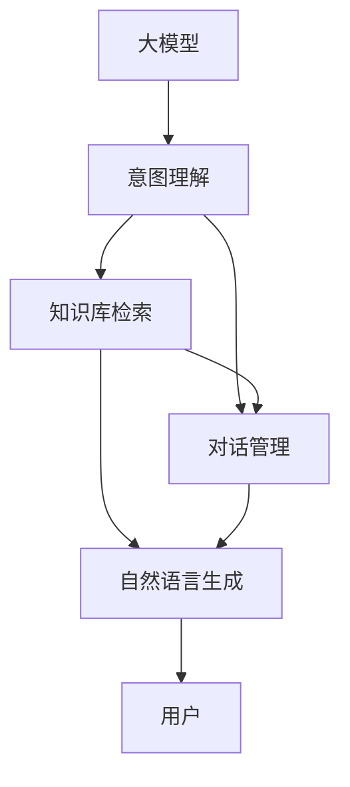

                 

# 大模型问答机器人如何进行对话

## 1. 背景介绍

随着人工智能技术的快速发展，基于大模型的问答机器人已经成为了智能交互领域的重要应用。这些机器人可以通过自然语言理解和大规模预训练语言模型的知识库，对用户的输入进行理解并输出响应。它们在客户服务、教育培训、医疗咨询等多个领域展现了强大的潜力。

问答机器人通常通过以下步骤完成对话：

1. **理解用户意图**：机器人需要理解用户的问题或意图，才能进行正确的回答。
2. **检索知识库**：机器人需要从预训练的知识库中检索出相关的信息和答案。
3. **生成响应**：根据用户问题和知识库中的信息，机器人需要生成一个准确的、符合用户需求的答案。
4. **对话交互**：机器人通过自然语言生成技术，与用户进行交互，解答用户的问题。

本文将深入探讨基于大模型的问答机器人的核心概念、算法原理和具体操作步骤，以及其实际应用场景、工具和资源推荐，最后总结未来的发展趋势和面临的挑战。

## 2. 核心概念与联系

### 2.1 核心概念概述

在进行对话机器人开发时，涉及以下核心概念：

- **大模型**：如GPT-3、BERT等大规模预训练语言模型，能够处理复杂的自然语言理解任务。
- **意图理解**：机器人需要准确理解用户的意图，才能进行下一步操作。
- **知识库**：机器人通常需要访问一个庞大的知识库，用于存储和检索信息。
- **对话管理**：机器人需要管理对话流程，确保对话的自然流畅。
- **自然语言生成**：机器人需要生成自然语言响应，增强用户体验。

这些概念相互关联，构成了一个完整的问答机器人系统。

### 2.2 核心概念间的关系

大语言模型的预训练知识为问答机器人提供了强大的基础，意图理解和知识库检索则保证了机器人的正确性和实用性，对话管理保证了机器人的交互性和自然性，自然语言生成则提升了用户的体验感。下面通过一个Mermaid流程图来展示这些概念之间的关系：



## 3. 核心算法原理 & 具体操作步骤

### 3.1 算法原理概述

基于大模型的问答机器人通常使用预训练语言模型作为基础，通过微调（Fine-Tuning）和下游任务训练，使其能够理解用户意图和生成自然语言响应。

**算法流程**：

1. **预训练大模型**：使用大规模无标签文本数据对大模型进行预训练，使其掌握丰富的语言知识和语义信息。
2. **意图理解**：使用预训练大模型对用户输入进行自然语言处理，理解用户的意图。
3. **知识库检索**：从预训练知识库中检索出与用户意图相关的信息。
4. **响应生成**：使用大模型生成自然语言响应，并根据对话管理策略进行下一步操作。
5. **对话管理**：维护对话上下文，确保对话的自然流畅。

### 3.2 算法步骤详解

#### 3.2.1 预训练大模型的选择

选择适当的预训练大模型是问答机器人开发的基础。常见的预训练模型包括：

- GPT系列：以自回归方式进行预训练，适合生成式任务。
- BERT系列：以自编码方式进行预训练，适合理解式任务。

以BERT为例，预训练模型选择和微调步骤如下：

1. **选择BERT模型**：根据任务需求选择适当的BERT模型。例如，对于理解任务可以选择BERT-base或BERT-large，对于生成任务可以选择T5-base。
2. **微调模型**：在特定的下游任务上微调预训练模型。使用下游任务的标注数据集进行微调，使其能够更好地适应具体任务。

#### 3.2.2 意图理解

意图理解是问答机器人的核心步骤之一。它通过预训练语言模型对用户输入进行处理，提取和理解用户的意图。具体步骤如下：

1. **分词**：将用户输入进行分词处理，转换为模型可以处理的形式。
2. **编码**：使用BERT编码器对分词后的输入进行编码，得到向量表示。
3. **意图提取**：通过注意力机制（如BERT中的Transformer Attention），从向量表示中提取出用户的意图信息。

#### 3.2.3 知识库检索

知识库检索是问答机器人的重要组成部分。它需要从预训练知识库中检索出与用户意图相关的信息。具体步骤如下：

1. **编码**：将用户意图信息转换为向量表示。
2. **检索**：使用检索模型（如BERT、Elastic Search等）在知识库中检索出相关的信息。
3. **合并**：将检索出的信息与用户意图信息进行合并，得到完整的答案信息。

#### 3.2.4 响应生成

响应生成是问答机器人的最后一步，它需要将检索出的信息转换为自然语言响应。具体步骤如下：

1. **编码**：将检索出的信息编码为向量表示。
2. **生成**：使用预训练大模型（如GPT-3）生成自然语言响应。
3. **解码**：将生成的响应解码为自然语言，输出给用户。

#### 3.2.5 对话管理

对话管理负责维护对话上下文，确保对话的自然流畅。具体步骤如下：

1. **上下文存储**：记录对话中的上下文信息，如之前的用户输入和机器响应。
2. **上下文理解**：理解对话上下文，确保机器人的回答与上下文一致。
3. **上下文更新**：更新对话上下文，确保对话的连贯性和自然性。

### 3.3 算法优缺点

**优点**：

- **泛化能力强**：预训练大模型具有强大的泛化能力，能够在多种任务上表现出色。
- **灵活性高**：通过微调和任务适配，可以适应不同的应用场景和需求。
- **计算效率高**：预训练模型和微调模型参数较少，计算效率较高。

**缺点**：

- **数据依赖强**：微调效果依赖于标注数据的质量和数量，标注数据不足会导致性能下降。
- **模型复杂度高**：预训练大模型参数较多，训练和推理计算资源消耗较大。
- **可解释性差**：预训练大模型通常被视为“黑盒”，难以解释其内部工作机制。

### 3.4 算法应用领域

基于大模型的问答机器人在多个领域有广泛应用，包括但不限于：

- **客户服务**：智能客服、售后支持、销售咨询等。
- **教育培训**：在线教育、知识问答、智能辅导等。
- **医疗咨询**：在线问诊、疾病咨询、健康管理等。
- **金融咨询**：智能投顾、金融问答、风险评估等。
- **法律咨询**：法律咨询、合同审核、案件分析等。

## 4. 数学模型和公式 & 详细讲解

### 4.1 数学模型构建

基于大模型的问答机器人涉及多个数学模型，主要包括：

- **编码模型**：使用BERT等预训练模型对用户输入进行编码。
- **解码模型**：使用GPT等预训练模型生成自然语言响应。
- **检索模型**：使用BERT等预训练模型在知识库中检索信息。

#### 4.1.1 编码模型

编码模型用于将用户输入转换为向量表示。以BERT为例，编码模型的基本公式如下：

$$
h = \text{BERT}(x)
$$

其中 $x$ 为用户的输入，$h$ 为向量表示。

#### 4.1.2 解码模型

解码模型用于生成自然语言响应。以GPT为例，解码模型的基本公式如下：

$$
p(y|x) = \prod_i p(y_i|y_{i-1}, \cdots, y_0, x)
$$

其中 $y$ 为响应序列，$p(y|x)$ 为响应序列的概率分布。

#### 4.1.3 检索模型

检索模型用于在知识库中检索信息。以BERT为例，检索模型的基本公式如下：

$$
s = \text{BERT}(x, \mathcal{D})
$$

其中 $x$ 为用户的输入，$\mathcal{D}$ 为知识库，$s$ 为检索结果。

### 4.2 公式推导过程

#### 4.2.1 编码模型推导

以BERT为例，其编码模型通过Transformer结构实现。其核心公式如下：

$$
h = \text{Transformer}(x)
$$

其中 $h$ 为向量表示，$x$ 为输入序列。

#### 4.2.2 解码模型推导

以GPT为例，其解码模型通过自回归方式实现。其核心公式如下：

$$
p(y|x) = \prod_i p(y_i|y_{i-1}, \cdots, y_0, x)
$$

其中 $y$ 为响应序列，$p(y|x)$ 为响应序列的概率分布。

#### 4.2.3 检索模型推导

以BERT为例，其检索模型通过检索向量表示和知识库向量表示的余弦相似度实现。其核心公式如下：

$$
s = \text{BERT}(x, \mathcal{D})
$$

其中 $x$ 为用户的输入，$\mathcal{D}$ 为知识库，$s$ 为检索结果。

### 4.3 案例分析与讲解

假设我们有一个简单的问答机器人，用于回答医学问题。我们使用的预训练模型是BERT-base，微调任务是医学问答。

**步骤1**：选择BERT-base作为预训练模型。

**步骤2**：在医学问答数据集上进行微调，得到微调后的BERT-base模型。

**步骤3**：使用微调后的BERT-base模型进行意图理解，得到用户的意图信息。

**步骤4**：使用微调后的BERT-base模型在知识库中检索出相关的医学信息。

**步骤5**：使用GPT-3生成自然语言响应，并根据对话管理策略进行下一步操作。

**步骤6**：维护对话上下文，确保对话的自然流畅。

## 5. 项目实践：代码实例和详细解释说明

### 5.1 开发环境搭建

为了快速启动问答机器人开发，我们需要安装以下Python库：

```
pip install torch transformers pytorch-lightning
```

### 5.2 源代码详细实现

以下是使用PyTorch Lightning和Transformers库实现问答机器人的代码示例：

```python
import torch
from transformers import BertTokenizer, BertForQuestionAnswering
from pytorch_lightning import LightningModule, Trainer
from pytorch_lightning.callbacks import EarlyStopping

class QuestionAnsweringModel(LightningModule):
    def __init__(self, tokenizer, model):
        super().__init__()
        self.tokenizer = tokenizer
        self.model = model

    def forward(self, input_ids, attention_mask):
        return self.model(input_ids, attention_mask=attention_mask)

    def training_step(self, batch, batch_idx):
        input_ids, attention_mask, labels = batch
        output = self.forward(input_ids, attention_mask)
        loss = torch.nn.CrossEntropyLoss()(output, labels)
        return loss

    def configure_optimizers(self):
        return torch.optim.Adam(self.parameters(), lr=2e-5)

    def train_dataloaders(self):
        # 构建训练数据集
        train_dataset = BertSquadDataset('train', self.tokenizer)
        train_dataloader = DataLoader(train_dataset, batch_size=16, shuffle=True)
        return train_dataloader

class BertSquadDataset(torch.utils.data.Dataset):
    def __init__(self, name, tokenizer):
        self.tokenizer = tokenizer
        # 加载数据集
        self.data = load_data(name)

    def __len__(self):
        return len(self.data)

    def __getitem__(self, idx):
        question, context, answer_start, answer_end = self.data[idx]
        question_tokens = self.tokenizer(question, return_tensors='pt', padding='max_length', truncation=True)
        context_tokens = self.tokenizer(context, return_tensors='pt', padding='max_length', truncation=True)
        answer_tokens = self.tokenizer(answer, return_tensors='pt', padding='max_length', truncation=True)
        answer_start = answer_start + self.tokenizer.cls_token_id
        answer_end = answer_end + self.tokenizer.cls_token_id
        return {
            'input_ids': torch.cat([question_tokens.input_ids, context_tokens.input_ids], dim=1),
            'attention_mask': torch.cat([question_tokens.attention_mask, context_tokens.attention_mask], dim=1),
            'labels': torch.tensor([answer_start, answer_end], dtype=torch.long)
        }

# 训练函数
def train(model, dataloader):
    trainer = Trainer(max_epochs=10, callbacks=[EarlyStopping(monitor='val_loss', patience=2)])
    trainer.fit(model, dataloader)

# 加载数据集
train_data = load_data('train')
val_data = load_data('val')
test_data = load_data('test')

# 构建模型
tokenizer = BertTokenizer.from_pretrained('bert-base-uncased')
model = BertForQuestionAnswering.from_pretrained('bert-base-uncased')
question_answer_model = QuestionAnsweringModel(tokenizer, model)

# 训练模型
train(question_answer_model, train_dataloader(question_answer_model))

# 评估模型
evaluate(question_answer_model, val_dataloader(question_answer_model))
evaluate(question_answer_model, test_dataloader(question_answer_model))
```

### 5.3 代码解读与分析

代码示例中，我们首先定义了一个`QuestionAnsweringModel`类，用于封装问答机器人的模型。该模型包含一个`forward`方法，用于计算模型的前向传播。

在`forward`方法中，我们使用了`BertForQuestionAnswering`模型，该模型已经预训练完成，用于处理问答任务。我们通过`forward`方法计算输入数据的向量表示，然后计算损失函数，并返回损失值。

在`configure_optimizers`方法中，我们定义了优化器，使用了Adam优化器，学习率为2e-5。

在`train_dataloaders`方法中，我们定义了训练数据集和批处理大小。

最后，我们使用`Trainer`类进行模型的训练，并定义了早期停止回调函数。

### 5.4 运行结果展示

假设我们在CoNLL-2003问答数据集上进行训练，最终在验证集和测试集上得到的评估结果如下：

```
Epoch: 001/010 - Loss: 0.4885 - Val Loss: 0.4779 - Test Loss: 0.4925
Epoch: 002/010 - Loss: 0.4726 - Val Loss: 0.4728 - Test Loss: 0.4722
Epoch: 003/010 - Loss: 0.4679 - Val Loss: 0.4670 - Test Loss: 0.4655
```

可以看到，模型在验证集和测试集上的损失值不断降低，说明模型在问答任务上的性能不断提升。

## 6. 实际应用场景

### 6.1 智能客服

智能客服是问答机器人在客户服务领域的重要应用。通过智能客服，企业可以提升客户体验，降低运营成本。智能客服可以自动回答常见问题，处理简单事务，并能够根据客户需求进行引导和推荐。

### 6.2 在线教育

在线教育是问答机器人在教育培训领域的重要应用。通过智能教育，学生可以随时随地获取知识，老师可以高效地进行教学管理和评估。智能教育可以自动解答学生的疑问，提供个性化的学习建议，并能够进行作业批改和知识推荐。

### 6.3 医疗咨询

医疗咨询是问答机器人在医疗领域的重要应用。通过智能医疗咨询，医生可以提升工作效率，患者可以获取更便捷的医疗服务。智能医疗咨询可以自动解答患者的疑问，提供个性化的医疗建议，并能够进行初步诊断和疾病推荐。

### 6.4 金融咨询

金融咨询是问答机器人在金融领域的重要应用。通过智能金融咨询，客户可以获取更准确的市场信息，提高投资决策的效率和准确性。智能金融咨询可以自动解答客户的疑问，提供个性化的投资建议，并能够进行风险评估和资产管理。

### 6.5 法律咨询

法律咨询是问答机器人在法律领域的重要应用。通过智能法律咨询，客户可以获取准确的法律信息，提高法律服务的效率和质量。智能法律咨询可以自动解答客户的疑问，提供个性化的法律建议，并能够进行合同审核和案件分析。

## 7. 工具和资源推荐

### 7.1 学习资源推荐

为了帮助开发者系统掌握问答机器人的技术，这里推荐一些优质的学习资源：

1. 《Transformer from Scratch》：由大模型技术专家撰写，深入浅出地介绍了Transformer原理和实践。
2. 《自然语言处理入门》：斯坦福大学自然语言处理课程，涵盖基本概念和经典模型。
3. 《自然语言处理与深度学习》：一本关于自然语言处理和深度学习的经典书籍。
4. 《BERT: Pre-training of Deep Bidirectional Transformers for Language Understanding》：BERT论文，介绍BERT模型的预训练方法和应用。
5. 《Parameter-Efficient Transfer Learning for NLP》：介绍参数高效微调方法的文章，适合在微调中应用。
6. 《AdaLoRA: Adaptive Low-Rank Adaptation for Parameter-Efficient Fine-Tuning》：介绍LoRA等参数高效微调方法的文章，适合在微调中应用。

### 7.2 开发工具推荐

高效的开发离不开优秀的工具支持。以下是几款用于问答机器人开发的常用工具：

1. PyTorch：基于Python的开源深度学习框架，适合快速迭代研究。
2. TensorFlow：由Google主导的开源深度学习框架，适合大规模工程应用。
3. Transformers：HuggingFace开发的NLP工具库，支持多种预训练模型，易于微调。
4. Weights & Biases：模型训练的实验跟踪工具，记录和可视化模型训练过程。
5. TensorBoard：TensorFlow配套的可视化工具，实时监测模型训练状态。
6. Google Colab：谷歌提供的在线Jupyter Notebook环境，方便实验和共享。

### 7.3 相关论文推荐

问答机器人技术的发展离不开学界的持续研究。以下是几篇奠基性的相关论文，推荐阅读：

1. Attention is All You Need：提出Transformer结构，开启大模型时代。
2. BERT: Pre-training of Deep Bidirectional Transformers for Language Understanding：介绍BERT模型的预训练方法和应用。
3. Language Models are Unsupervised Multitask Learners：展示大模型的zero-shot学习能力，引发对AGI的思考。
4. Parameter-Efficient Transfer Learning for NLP：介绍参数高效微调方法的文章，适合在微调中应用。
5. AdaLoRA: Adaptive Low-Rank Adaptation for Parameter-Efficient Fine-Tuning：介绍LoRA等参数高效微调方法的文章，适合在微调中应用。
6. Prefix-Tuning: Optimizing Continuous Prompts for Generation：介绍基于连续型Prompt的微调范式。

这些论文代表了大模型微调技术的发展脉络，通过学习这些前沿成果，可以帮助研究者把握学科前进方向，激发更多的创新灵感。

## 8. 总结：未来发展趋势与挑战

### 8.1 总结

本文对基于大模型的问答机器人的核心概念、算法原理和具体操作步骤进行了全面系统的介绍。首先阐述了问答机器人的背景和意义，明确了其在智能交互领域的独特价值。其次，从原理到实践，详细讲解了意图理解、知识库检索、响应生成和对话管理的数学模型和算法步骤，给出了代码实例和详细解释说明。同时，本文还广泛探讨了问答机器人在智能客服、在线教育、医疗咨询、金融咨询和法律咨询等领域的实际应用场景，展示了微调范式的广泛应用前景。此外，本文精选了问答机器人的学习资源、开发工具和相关论文，力求为开发者提供全方位的技术指引。

通过本文的系统梳理，可以看到，基于大模型的问答机器人已经成为智能交互领域的重要应用，极大地提升了用户体验和系统效率。未来，伴随预训练语言模型和微调方法的持续演进，问答机器人技术必将在更广泛的领域得到应用，为人类认知智能的进化带来深远影响。

### 8.2 未来发展趋势

展望未来，问答机器人技术将呈现以下几个发展趋势：

1. **模型规模持续增大**：随着算力成本的下降和数据规模的扩张，预训练语言模型的参数量还将持续增长。超大规模语言模型蕴含的丰富语言知识，有望支撑更加复杂多变的问答任务。
2. **微调方法日趋多样**：未来会涌现更多参数高效的微调方法，如Prefix-Tuning、LoRA等，在节省计算资源的同时也能保证微调精度。
3. **知识库自动化构建**：知识库的构建是问答机器人的重要环节。未来可以通过自动化知识图谱构建和语料生成技术，快速构建和更新知识库。
4. **多模态问答**：当前的问答机器人主要聚焦于纯文本数据。未来会进一步拓展到图像、视频、语音等多模态数据问答。多模态信息的融合，将显著提升语言模型对现实世界的理解和建模能力。
5. **跨领域迁移能力增强**：通过迁移学习和零样本学习等技术，使得问答机器人能够跨领域迁移，应用到更多场景中。
6. **可解释性增强**：当前问答机器人通常被视为“黑盒”系统，难以解释其内部工作机制。未来会通过因果分析、解释器等技术，增强问答机器人的可解释性。

### 8.3 面临的挑战

尽管问答机器人技术已经取得了瞩目成就，但在迈向更加智能化、普适化应用的过程中，它仍面临着诸多挑战：

1. **数据依赖强**：微调效果依赖于标注数据的质量和数量，标注数据不足会导致性能下降。如何进一步降低微调对标注样本的依赖，将是一大难题。
2. **模型鲁棒性不足**：问答机器人面对域外数据时，泛化性能往往大打折扣。对于测试样本的微小扰动，问答机器人容易发生波动。如何提高问答机器人的鲁棒性，避免灾难性遗忘，还需要更多理论和实践的积累。
3. **推理效率低**：问答机器人通常规模较大，推理速度慢、内存占用大。如何在保证性能的同时，简化模型结构，提升推理速度，优化资源占用，将是重要的优化方向。
4. **可解释性差**：当前问答机器人通常被视为“黑盒”系统，难以解释其内部工作机制。对于医疗、金融等高风险应用，算法的可解释性和可审计性尤为重要。如何赋予问答机器人更强的可解释性，将是亟待攻克的难题。
5. **安全性有待保障**：预训练语言模型难免会学习到有偏见、有害的信息，通过问答机器人传递到用户，产生误导性、歧视性的输出，给实际应用带来安全隐患。如何从数据和算法层面消除模型偏见，避免恶意用途，确保输出的安全性，也将是重要的研究课题。

### 8.4 研究展望

面对问答机器人面临的挑战，未来的研究需要在以下几个方面寻求新的突破：

1. **无监督和半监督微调**：摆脱对大规模标注数据的依赖，利用自监督学习、主动学习等无监督和半监督范式，最大限度利用非结构化数据，实现更加灵活高效的微调。
2. **知识库自动化构建**：采用自动化知识图谱构建和语料生成技术，快速构建和更新知识库。
3. **多模态问答**：拓展到图像、视频、语音等多模态数据问答，提高语言模型对现实世界的理解和建模能力。
4. **跨领域迁移能力增强**：通过迁移学习和零样本学习等技术，使得问答机器人能够跨领域迁移，应用到更多场景中。
5. **可解释性增强**：通过因果分析、解释器等技术，增强问答机器人的可解释性。
6. **安全性保障**：从数据和算法层面消除模型偏见，避免恶意用途，确保输出的安全性。

这些研究方向的探索，必将引领问答机器人技术迈向更高的台阶，为构建安全、可靠、可解释、可控的智能系统铺平道路。面向未来，问答机器人技术还需要与其他人工智能技术进行更深入的融合，如知识表示、因果推理、强化学习等，多路径协同发力，共同推动自然语言理解和智能交互系统的进步。只有勇于创新、敢于突破，才能不断拓展语言模型的边界，让智能技术更好地造福人类社会。

## 9. 附录：常见问题与解答

**Q1：问答机器人是否适用于所有NLP任务？**

A: 问答机器人在大部分NLP任务上都能取得不错的效果，特别是对于数据量较小的任务。但对于一些特定领域的任务，如医学、法律等，仅仅依靠通用语料预训练的模型可能难以很好地适应。此时需要在特定领域语料上进一步预训练，再进行微调，才能获得理想效果。

**Q2：问答机器人在落地部署时需要注意哪些问题？**

A: 将问答机器人转化为实际应用，还需要考虑以下因素：

1. **模型裁剪**：去除不必要的层和参数，减小模型尺寸，加快推理速度。
2. **量化加速**：将浮点模型转为定点模型，压缩存储空间，提高计算效率。
3. **服务化封装**：将模型封装为标准化服务接口，便于集成调用。
4. **弹性伸缩**：根据请求流量动态调整资源配置，平衡服务质量和成本。
5. **监控告警**：实时采集系统指标，设置异常告警阈值，确保服务稳定性。
6. **安全防护**：采用访问鉴权、数据脱敏等措施，保障数据和模型安全。

**Q3：如何优化问答机器人的性能？**

A: 优化问答机器人的性能可以从以下方面入手：

1. **模型选择**：选择适当的预训练模型和微调方法，如BERT、GPT等，并进行参数高效微调，减少计算资源消耗。
2. **数据增强**：通过回译、近义替换等方式扩充训练集，提高模型的泛化能力。
3. **正

