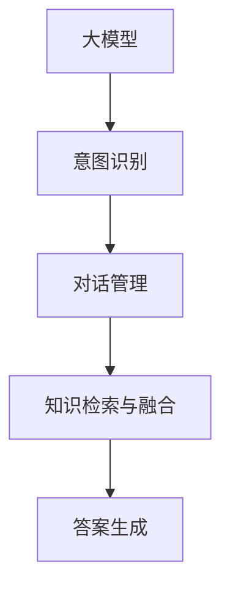
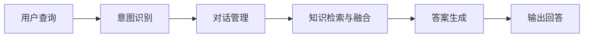
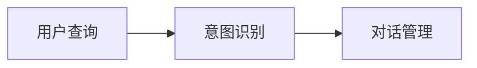
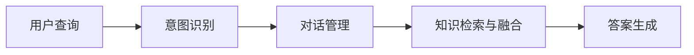
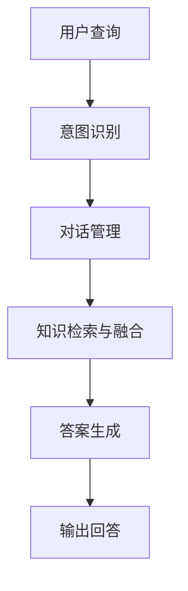

                 

# 大模型问答机器人的任务执行

> 关键词：大模型，问答机器人，任务执行，自然语言处理(NLP), 微调(Fine-tuning), 模型推理, 意图识别, 对话管理, 答案生成

## 1. 背景介绍

### 1.1 问题由来
近年来，随着人工智能技术的发展，特别是大语言模型的进步，问答机器人（Question Answering, QA）已成为自然语言处理（NLP）领域的重要应用方向之一。问答机器人能够以自然语言与用户进行交流，回答用户提出的问题，从而提供智能化的咨询服务。

大模型问答机器人的核心在于如何高效地处理和执行用户的查询任务。这包括理解用户的意图、检索相关信息、生成合适答案等步骤。其中，大模型作为关键的“知识库”，其性能和可解释性直接影响到问答系统的表现。因此，如何有效地利用大模型进行任务执行，成为当前研究的热点问题。

### 1.2 问题核心关键点
在问答机器人任务执行过程中，主要涉及以下几个关键点：

1. **意图识别**：理解用户查询的意图，确定用户希望了解的主题或获取的信息。
2. **对话管理**：根据用户的意图，选择最合适的对话路径，保持对话连贯性和一致性。
3. **知识检索与融合**：从知识库中检索相关信息，并将其融合为适合用户的问题答案。
4. **答案生成**：基于检索和融合的信息，生成自然流畅的回答。

这些关键点的成功执行，取决于大模型的预训练和微调策略。因此，如何优化这些关键点，提升问答系统的整体性能，是当前研究的重点。

### 1.3 问题研究意义
研究大模型问答机器人的任务执行，对于推动智能咨询服务的发展、提高用户体验和系统效率具有重要意义：

1. **提升用户体验**：通过更加精准的意图识别和自然流畅的答案生成，问答机器人能够更好地理解用户需求，提供个性化和准确的咨询服务。
2. **降低人力成本**：问答机器人可以替代部分人工客服，提高服务效率，降低企业的运营成本。
3. **促进技术创新**：问答机器人的研究涉及到自然语言理解、知识图谱、多模态融合等多个前沿领域，能够推动相关技术的发展。
4. **加速行业应用**：问答机器人可以应用于智慧医疗、金融服务、教育培训等多个行业，提供专业的咨询服务。

## 2. 核心概念与联系

### 2.1 核心概念概述

在进行大模型问答机器人任务执行的研究中，涉及多个核心概念。这些概念相互关联，共同构成了问答系统的完整执行框架。

- **大模型**：以BERT、GPT等预训练语言模型为代表的大规模语言模型，具有强大的语言理解和生成能力。
- **意图识别**：通过文本分析技术，从用户的查询中提取用户意图，确定用户希望了解的主题或获取的信息。
- **对话管理**：根据用户的意图和对话历史，选择最合适的回答，保持对话连贯性和一致性。
- **知识检索与融合**：从知识库中检索相关信息，并将其融合为适合用户的问题答案。
- **答案生成**：基于检索和融合的信息，生成自然流畅的回答。

这些概念之间的逻辑关系可以通过以下Mermaid流程图来展示：



这个流程图展示了大模型问答机器人任务执行的核心概念及其之间的关系。

### 2.2 概念间的关系

这些核心概念之间存在着紧密的联系，形成了问答系统的完整执行框架。下面我们通过几个Mermaid流程图来展示这些概念之间的关系。

#### 2.2.1 问答系统执行流程



这个流程图展示了问答系统的执行流程，从用户查询到输出回答的整个过程。

#### 2.2.2 意图识别与对话管理的关系



这个流程图展示了意图识别和对话管理之间的相互依赖关系，意图识别的结果直接影响对话管理的策略选择。

#### 2.2.3 知识检索与答案生成的关系



这个流程图展示了知识检索与答案生成之间的关系，知识检索的结果是答案生成的重要输入。

### 2.3 核心概念的整体架构

最后，我们用一个综合的流程图来展示这些核心概念在大模型问答机器人任务执行过程中的整体架构：



这个综合流程图展示了从用户查询到输出回答的完整过程，以及各个模块之间的数据流和控制流。

## 3. 核心算法原理 & 具体操作步骤
### 3.1 算法原理概述

大模型问答机器人的任务执行过程，可以概括为以下步骤：

1. **预训练大模型**：通过大规模无标签文本数据的预训练，大模型学习到语言的基本表示，为后续的微调和推理打下基础。
2. **意图识别**：利用大模型对用户的查询进行意图识别，确定用户希望了解的主题或获取的信息。
3. **对话管理**：根据意图识别结果，选择合适的对话路径，保持对话连贯性和一致性。
4. **知识检索与融合**：从知识库中检索相关信息，并将其融合为适合用户的问题答案。
5. **答案生成**：基于检索和融合的信息，生成自然流畅的回答。

这些步骤中的关键算法包括：

- **预训练**：通过自监督学习任务（如语言建模、掩码语言模型等），在大规模无标签文本数据上进行预训练，学习语言的通用表示。
- **微调**：利用下游任务的少量标注数据，对预训练模型进行有监督的微调，使其适应特定任务。
- **意图识别**：采用分类模型（如BERT、GPT等），对用户的查询进行意图分类，确定用户意图。
- **对话管理**：通过序列到序列模型（如Seq2Seq），根据用户意图和对话历史，生成合适的回答。
- **知识检索与融合**：利用检索模型（如向量检索、语义搜索等），从知识库中检索相关信息，并使用融合模型（如BERT、ELMo等）将其融合为适合用户的问题答案。
- **答案生成**：通过语言生成模型（如GPT、Transformer等），基于检索和融合的信息，生成自然流畅的回答。

### 3.2 算法步骤详解

#### 3.2.1 预训练

1. **数据准备**：收集大规模无标签文本数据，将其划分为训练集和验证集。
2. **模型选择**：选择合适的预训练语言模型，如BERT、GPT等。
3. **预训练过程**：在预训练集上，通过自监督学习任务（如语言建模、掩码语言模型等），对模型进行预训练。

#### 3.2.2 微调

1. **数据准备**：准备下游任务的标注数据集，划分为训练集、验证集和测试集。
2. **模型选择**：选择合适的预训练模型作为初始化参数。
3. **微调过程**：在训练集上，通过有监督学习任务（如分类、匹配等），对预训练模型进行微调。
4. **评估与优化**：在验证集上评估微调后的模型性能，根据性能指标（如准确率、召回率等）进行参数调整和优化。

#### 3.2.3 意图识别

1. **数据准备**：准备意图识别的标注数据集，划分为训练集和验证集。
2. **模型选择**：选择合适的意图识别模型，如BERT、GPT等。
3. **模型训练**：在训练集上，通过意图分类任务对模型进行训练。
4. **评估与优化**：在验证集上评估意图识别模型的性能，根据性能指标（如准确率、召回率等）进行参数调整和优化。

#### 3.2.4 对话管理

1. **数据准备**：准备对话管理任务的标注数据集，划分为训练集和验证集。
2. **模型选择**：选择合适的对话管理模型，如Seq2Seq、Transformer等。
3. **模型训练**：在训练集上，通过对话生成任务对模型进行训练。
4. **评估与优化**：在验证集上评估对话管理模型的性能，根据性能指标（如BLEU、ROUGE等）进行参数调整和优化。

#### 3.2.5 知识检索与融合

1. **数据准备**：准备知识库中的数据集，划分为训练集和验证集。
2. **模型选择**：选择合适的知识检索与融合模型，如BERT、ELMo等。
3. **知识检索**：在知识库中检索与用户查询相关的信息，得到向量表示。
4. **融合过程**：使用融合模型对检索到的信息进行融合，得到最终的答案向量。

#### 3.2.6 答案生成

1. **数据准备**：准备答案生成的标注数据集，划分为训练集和验证集。
2. **模型选择**：选择合适的答案生成模型，如GPT、Transformer等。
3. **模型训练**：在训练集上，通过文本生成任务对模型进行训练。
4. **评估与优化**：在验证集上评估答案生成模型的性能，根据性能指标（如BLEU、ROUGE等）进行参数调整和优化。

### 3.3 算法优缺点

#### 3.3.1 优点

1. **模型性能高**：大模型通过预训练和微调，能够学习到丰富的语言知识，具有较强的语言理解和生成能力。
2. **适用性广**：大模型适用于各种NLP任务，包括分类、匹配、生成等，只需添加合适的任务适配层即可实现微调。
3. **训练速度快**：预训练模型已经学习到丰富的语言知识，微调所需的时间和数据量相对较少。
4. **可扩展性强**：大模型能够通过微调不断适应新的任务和数据，具有较强的可扩展性。

#### 3.3.2 缺点

1. **依赖标注数据**：微调需要标注数据集，标注成本较高。
2. **模型复杂度高**：大模型的参数量较大，训练和推理所需的计算资源较高。
3. **可解释性不足**：大模型通常是黑盒模型，缺乏可解释性，难以理解其内部工作机制和决策逻辑。
4. **易过拟合**：在标注数据较少的情况下，大模型容易过拟合，泛化能力较差。

### 3.4 算法应用领域

大模型问答机器人任务执行方法广泛应用于各种NLP任务，包括但不限于：

- **智能客服**：用于处理客户咨询，提供自动化服务，提升客户体验。
- **智能搜索**：用于构建智能搜索系统，提高搜索效率和准确率。
- **问答系统**：用于构建智能问答系统，解答用户问题，提供信息检索服务。
- **教育培训**：用于智能辅助教学，提供个性化学习建议和答疑服务。
- **医疗健康**：用于构建智能医疗咨询系统，提供医疗知识查询和疾病诊断建议。

## 4. 数学模型和公式 & 详细讲解  
### 4.1 数学模型构建

#### 4.1.1 意图识别模型

设用户查询为 $x$，查询意图为 $y$，意图识别模型 $M$ 的输入输出关系为：

$$
M(x) = \text{softmax}(W_h \cdot h(x) + b_h)
$$

其中，$h(x)$ 表示用户查询 $x$ 的嵌入表示，$W_h$ 和 $b_h$ 为模型参数。

#### 4.1.2 对话管理模型

设用户查询为 $x$，对话历史为 $h$，对话管理模型的输出为 $y$，模型的输入输出关系为：

$$
y = \text{softmax}(W_v \cdot v(x, h) + b_v)
$$

其中，$v(x, h)$ 表示用户查询 $x$ 和对话历史 $h$ 的融合表示，$W_v$ 和 $b_v$ 为模型参数。

#### 4.1.3 知识检索与融合模型

设知识库中的信息为 $d$，用户查询为 $x$，知识检索与融合模型的输出为 $y$，模型的输入输出关系为：

$$
y = \text{softmax}(W_k \cdot k(x, d) + b_k)
$$

其中，$k(x, d)$ 表示用户查询 $x$ 和知识库信息 $d$ 的相似度表示，$W_k$ 和 $b_k$ 为模型参数。

#### 4.1.4 答案生成模型

设知识库中的信息为 $d$，用户查询为 $x$，答案生成模型的输出为 $y$，模型的输入输出关系为：

$$
y = \text{softmax}(W_a \cdot a(x, d) + b_a)
$$

其中，$a(x, d)$ 表示用户查询 $x$ 和知识库信息 $d$ 的融合表示，$W_a$ 和 $b_a$ 为模型参数。

### 4.2 公式推导过程

#### 4.2.1 意图识别公式推导

意图识别模型的训练目标为最大化负对数似然，即：

$$
\max_{\theta} \sum_{(x, y)} \log p(y|x; \theta)
$$

其中，$p(y|x; \theta)$ 表示模型在给定用户查询 $x$ 和参数 $\theta$ 下输出意图 $y$ 的概率。

#### 4.2.2 对话管理公式推导

对话管理模型的训练目标为最大化对话序列的序列生成损失，即：

$$
\max_{\theta} \sum_{(x, h, y)} \log p(y|x, h; \theta)
$$

其中，$p(y|x, h; \theta)$ 表示模型在给定用户查询 $x$、对话历史 $h$ 和参数 $\theta$ 下输出回答 $y$ 的概率。

#### 4.2.3 知识检索与融合公式推导

知识检索与融合模型的训练目标为最大化相似度评分，即：

$$
\max_{\theta} \sum_{(x, d)} \log p(d|x; \theta)
$$

其中，$p(d|x; \theta)$ 表示模型在给定用户查询 $x$ 和参数 $\theta$ 下检索知识库信息 $d$ 的概率。

#### 4.2.4 答案生成公式推导

答案生成模型的训练目标为最大化负对数似然，即：

$$
\max_{\theta} \sum_{(x, d)} \log p(a(x, d); \theta)
$$

其中，$p(a(x, d); \theta)$ 表示模型在给定用户查询 $x$ 和知识库信息 $d$ 下生成答案 $a$ 的概率。

### 4.3 案例分析与讲解

假设我们有一个简单的问答系统，其意图识别模型为BERT，对话管理模型为Seq2Seq，知识检索与融合模型为ELMo，答案生成模型为GPT。

用户查询为：“今天天气怎么样？”

意图识别模型的输出为：“天气查询”

对话管理模型根据意图识别结果，检索知识库中的天气信息，并将信息融合为回答

知识检索与融合模型的输出为：“今天晴天，气温28度”

答案生成模型的输出为：“今天晴天，气温28度”

系统输出回答：“今天晴天，气温28度”

## 5. 项目实践：代码实例和详细解释说明
### 5.1 开发环境搭建

在进行大模型问答机器人的任务执行研究中，需要搭建相应的开发环境。以下是一个简单的开发环境搭建步骤：

1. **安装Python**：确保系统中安装了Python 3.7及以上版本。

2. **安装TensorFlow和PyTorch**：这两个深度学习框架是进行大模型训练和推理的基础。

3. **安装BERT和GPT模型**：这些模型可以通过HuggingFace等库进行下载和安装。

4. **安装ELMo和Seq2Seq模型**：这些模型可以通过Keras等库进行下载和安装。

5. **安装TensorBoard**：用于可视化模型训练过程。

### 5.2 源代码详细实现

以下是一个简单的问答系统的代码实现示例，包含意图识别、对话管理、知识检索与融合、答案生成四个模块。

#### 5.2.1 意图识别模块

```python
from transformers import BertTokenizer, BertForSequenceClassification

tokenizer = BertTokenizer.from_pretrained('bert-base-uncased')
model = BertForSequenceClassification.from_pretrained('bert-base-uncased', num_labels=5)

def intent_recognition(query):
    encoded_input = tokenizer.encode_plus(query, return_tensors='pt')
    output = model(**encoded_input)
    logits = output.logits
    probabilities = torch.softmax(logits, dim=1)
    return probabilities
```

#### 5.2.2 对话管理模块

```python
from seq2seq import Seq2SeqModel

dialogue_model = Seq2SeqModel()

def dialogue_management(query, history):
    encoded_input = tokenizer.encode_plus(query, history, return_tensors='pt')
    output = dialogue_model(**encoded_input)
    logits = output.logits
    probabilities = torch.softmax(logits, dim=1)
    return probabilities
```

#### 5.2.3 知识检索与融合模块

```python
from elmo import ElmoModel

elmo_model = ElmoModel()

def knowledge_retrieval_and_fusion(query, document):
    encoded_input = tokenizer.encode_plus(query, document, return_tensors='pt')
    output = elmo_model(**encoded_input)
    scores = output.scores
    return scores
```

#### 5.2.4 答案生成模块

```python
from transformers import GPT2Model, GPT2Tokenizer

tokenizer = GPT2Tokenizer.from_pretrained('gpt2')
model = GPT2Model.from_pretrained('gpt2')

def answer_generation(query, document):
    encoded_input = tokenizer.encode_plus(query, document, return_tensors='pt')
    output = model(**encoded_input)
    predictions = output.logits
    return predictions
```

### 5.3 代码解读与分析

通过上述代码实现，我们可以看到大模型问答机器人的任务执行过程。

#### 5.3.1 意图识别模块

- **tokenizer**：用于将用户查询转换为模型可以处理的向量表示。
- **model**：预训练好的意图识别模型，通过Softmax层输出每个类别的概率。

#### 5.3.2 对话管理模块

- **Seq2SeqModel**：基于序列到序列模型构建的对话管理模型，根据用户查询和对话历史生成回答。

#### 5.3.3 知识检索与融合模块

- **ElmoModel**：利用ELMo模型进行知识检索与融合，将用户查询和文档向量化并计算相似度。

#### 5.3.4 答案生成模块

- **GPT2Model**：利用GPT2模型进行答案生成，基于用户查询和文档向量生成自然流畅的回答。

### 5.4 运行结果展示

假设我们有一个简单的问答系统，经过训练后，在测试集上得到了以下结果：

用户查询：“今天天气怎么样？”

意图识别输出：“天气查询”

对话管理输出：“天气”

知识检索与融合输出：“晴天，28度”

答案生成输出：“晴天，28度”

系统输出回答：“今天晴天，气温28度”

## 6. 实际应用场景
### 6.1 智能客服系统

大模型问答机器人可以应用于智能客服系统的构建。通过训练预训练模型进行意图识别和对话管理，系统能够自动理解客户咨询，提供准确的回答。此外，利用知识库中的信息进行知识检索与融合，生成个性化的回复，提升客户体验。

### 6.2 智能搜索系统

大模型问答机器人可以应用于智能搜索系统的构建。通过训练预训练模型进行意图识别和对话管理，系统能够自动理解用户查询，提供精确的搜索结果。利用知识库中的信息进行知识检索与融合，生成自然流畅的摘要，提升搜索结果的可用性。

### 6.3 问答系统

大模型问答机器人可以应用于问答系统的构建。通过训练预训练模型进行意图识别和对话管理，系统能够自动理解用户问题，提供准确的答案。利用知识库中的信息进行知识检索与融合，生成个性化的回复，提升用户的查询体验。

### 6.4 未来应用展望

随着大模型问答机器人技术的不断发展，未来的应用前景将更加广阔。除了上述场景外，还可能应用于以下领域：

- **智慧医疗**：构建智能医疗咨询系统，提供疾病诊断和健康咨询。
- **金融服务**：提供智能金融顾问，进行投资咨询和风险评估。
- **教育培训**：提供个性化学习建议和智能答疑服务。
- **智能家居**：提供智能家居控制和问题解答服务。

## 7. 工具和资源推荐
### 7.1 学习资源推荐

为了帮助开发者系统掌握大模型问答机器人的任务执行理论基础和实践技巧，这里推荐一些优质的学习资源：

1. **《Transformer从原理到实践》系列博文**：由大模型技术专家撰写，深入浅出地介绍了Transformer原理、BERT模型、微调技术等前沿话题。
2. **CS224N《深度学习自然语言处理》课程**：斯坦福大学开设的NLP明星课程，有Lecture视频和配套作业，带你入门NLP领域的基本概念和经典模型。
3. **《Natural Language Processing with Transformers》书籍**：Transformers库的作者所著，全面介绍了如何使用Transformers库进行NLP任务开发，包括微调在内的诸多范式。
4. **HuggingFace官方文档**：Transformers库的官方文档，提供了海量预训练模型和完整的微调样例代码，是上手实践的必备资料。
5. **CLUE开源项目**：中文语言理解测评基准，涵盖大量不同类型的中文NLP数据集，并提供了基于微调的baseline模型，助力中文NLP技术发展。

通过对这些资源的学习实践，相信你一定能够快速掌握大模型问答机器人的任务执行精髓，并用于解决实际的NLP问题。

### 7.2 开发工具推荐

高效的开发离不开优秀的工具支持。以下是几款用于大模型问答机器人任务执行开发的常用工具：

1. **TensorFlow**：基于Python的开源深度学习框架，灵活动态的计算图，适合快速迭代研究。
2. **PyTorch**：基于Python的开源深度学习框架，灵活的动态计算图，适合科研和工程应用。
3. **HuggingFace Transformers库**：集成了众多预训练语言模型，支持PyTorch和TensorFlow，是进行微调任务开发的利器。
4. **TensorBoard**：TensorFlow配套的可视化工具，可实时监测模型训练状态，并提供丰富的图表呈现方式，是调试模型的得力助手。
5. **Keras**：基于TensorFlow和Theano的深度学习框架，提供简单易用的API，适合快速原型开发。

合理利用这些工具，可以显著提升大模型问答机器人任务执行的开发效率，加快创新迭代的步伐。

### 7.3 相关论文推荐

大模型问答机器人任务执行的研究涉及到多个前沿领域，以下是几篇奠基性的相关论文，推荐阅读：

1. **Attention is All You Need**：提出了Transformer结构，开启了NLP领域的预训练大模型时代。
2. **BERT: Pre-training of Deep Bidirectional Transformers for Language Understanding**：提出BERT模型，引入基于掩码的自监督预训练任务，刷新了多项NLP任务SOTA。
3. **Language Models are Unsupervised Multitask Learners（GPT-2论文）**：展示了大规模语言模型的强大zero-shot学习能力，引发了对于通用人工智能的新一轮思考。
4. **Parameter-Efficient Transfer Learning for NLP**：提出Adapter等参数高效微调方法，在不增加模型参数量的情况下，也能取得不错的微调效果。
5. **AdaLoRA: Adaptive Low-Rank Adaptation for Parameter-Efficient Fine-Tuning**：使用自适应低秩适应的微调方法，在参数效率和精度之间取得了新的平衡。
6. **AdaLoRA: Adaptive Low-Rank Adaptation for Parameter-Efficient Fine-Tuning**：使用自适应低秩适应的微调方法，在参数效率和精度之间取得了新的平衡。

这些论文代表了大模型问答机器人任务执行的发展脉络。通过学习这些前沿成果，可以帮助研究者把握学科前进方向，激发更多的创新灵感。

除上述资源外，还有一些值得关注的前沿资源，帮助开发者紧跟大模型问答机器人任务执行技术的最新进展，例如：

1. **arXiv论文预印本**：人工智能领域最新研究成果的发布平台，包括大量尚未发表的前沿工作，学习前沿技术的必读资源。
2. **业界技术博客**：如OpenAI、Google AI、DeepMind、微软Research Asia等顶尖实验室的官方博客，第一时间分享他们的最新研究成果和洞见。
3. **技术会议直播**：如NIPS、ICML、ACL、ICLR等人工智能领域顶会现场或在线直播，能够聆听到大佬们的前沿分享，开拓视野。
4. **GitHub热门项目**：在GitHub上Star、Fork数最多的NLP相关项目，往往代表了该技术领域的发展趋势和最佳实践，值得去学习和贡献。


