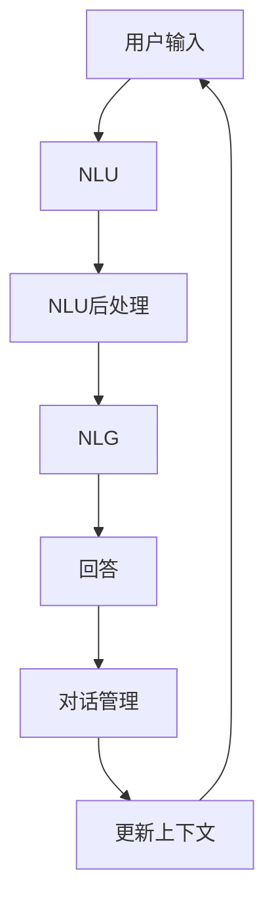
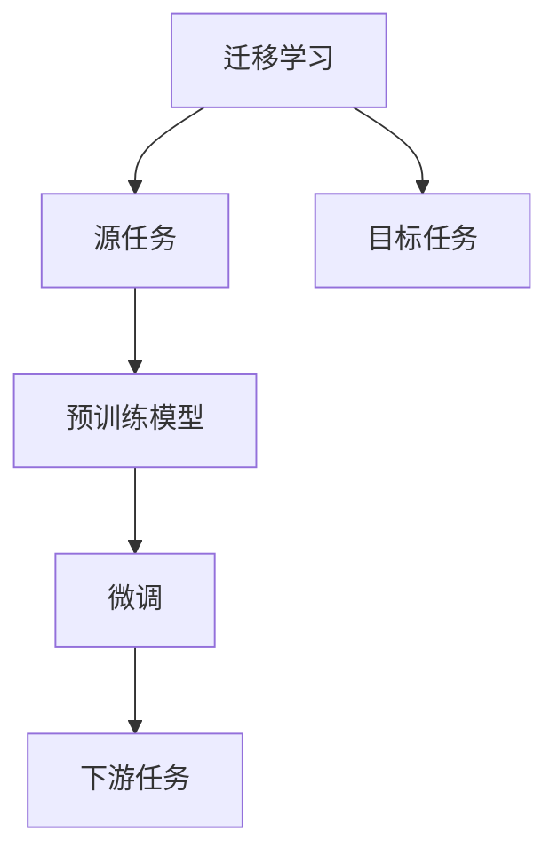

                 

# 大模型问答机器人的对话式交互

> 关键词：
- 大模型问答机器人
- 对话式交互
- 自然语言理解(NLU)
- 自然语言生成(NLG)
- 多轮对话
- 上下文感知
- 迁移学习

## 1. 背景介绍

### 1.1 问题由来
近年来，随着深度学习技术的飞速发展，人工智能在对话系统领域取得了巨大进展。其中，基于大模型的问答机器人因其强大的语言理解和生成能力，在智能客服、在线咨询、教育辅导等多个场景中得到了广泛应用。

然而，尽管大模型在单个问答中表现优异，但在实际应用中，如何构建能够持续交互的对话系统，仍然是一个挑战。传统的基于模板或规则的对话系统，难以应对复杂多变的用户需求。而基于大模型的对话系统，虽然能够理解上下文，但缺乏灵活的对话策略和控制机制，容易导致对话卡壳或信息不连贯。

因此，本博客旨在探讨基于大模型的问答机器人如何通过对话式交互，实现更流畅、更自然的对话体验。

### 1.2 问题核心关键点
对话式交互的核心在于，如何让问答机器人能够持续、连贯地与用户进行多轮交流，同时提供精准的解答和智能的引导。以下是对对话式交互几个关键点的深入探讨：

- **上下文感知**：在对话过程中，机器人需要能够理解并保留之前的对话内容，以便提供连贯的响应。
- **多轮对话管理**：对话管理策略对于对话系统的流畅性和用户满意度至关重要。机器人需要能够识别对话状态，并决定下一步动作。
- **智能引导**：对于用户输入的不明确或模糊信息，机器人需要具备智能引导能力，通过回问或提示，帮助用户澄清需求。
- **信息连贯性**：对话过程中，机器人需要确保信息的连贯性和逻辑性，避免信息的丢失或混乱。
- **动态响应能力**：对话系统需要具备动态响应能力，能够根据对话状态和用户需求实时调整对话策略。

## 2. 核心概念与联系

### 2.1 核心概念概述

为了更好地理解对话式交互的实现原理，本节将介绍几个密切相关的核心概念：

- **自然语言理解(NLU)**：指利用机器学习技术，将用户输入的自然语言转换为结构化数据，以便于后续处理。常见方法包括分词、词性标注、实体识别等。
- **自然语言生成(NLG)**：指将结构化数据转换为自然语言文本，生成流畅、连贯的回答。常见方法包括基于模板的生成、神经网络生成等。
- **多轮对话管理**：指对话系统在多轮交互中管理对话状态，包括识别对话阶段、维护对话上下文、决定下一个对话动作等。
- **上下文感知**：指对话系统能够理解并保留对话历史，以便于在后续对话中利用上下文信息，提供更连贯的响应。
- **迁移学习**：指将预训练模型在一种任务上的知识迁移到另一种任务上，以提升模型的性能。

这些核心概念之间的逻辑关系可以通过以下Mermaid流程图来展示：



这个流程图展示了对话式交互的基本流程：用户输入经过NLU处理，生成上下文信息；NLG生成回答；对话管理策略决定下一步动作；上下文信息被更新并反馈到NLU，形成闭环。

### 2.2 概念间的关系

这些核心概念之间存在着紧密的联系，形成了对话式交互的完整生态系统。下面我们通过几个Mermaid流程图来展示这些概念之间的关系。

#### 2.2.1 对话式交互的流程


这个流程图展示了对话式交互的基本流程，从用户输入到最终回答的全过程。

#### 2.2.2 多轮对话管理与上下文感知


这个流程图展示了多轮对话管理与上下文感知的交互关系，对话管理策略根据当前对话状态和用户输入决定下一步动作，并更新上下文信息以供后续对话使用。

#### 2.2.3 迁移学习与对话模型



这个流程图展示了迁移学习在大模型对话系统中的应用，预训练模型在源任务上学习，通过微调适应各种下游任务（目标任务），最终用于对话系统的构建。

## 3. 核心算法原理 & 具体操作步骤

### 3.1 算法原理概述

对话式交互的实现原理基于以下关键技术：

- **Transformer架构**：Transformer架构因其自注意力机制和良好的并行处理能力，成为构建对话系统的重要基础。
- **注意力机制**：在对话管理中，通过注意力机制选择上下文相关的信息，确保信息的时效性和准确性。
- **编码器-解码器框架**：对话系统通常采用编码器-解码器框架，将对话状态编码为上下文向量，解码为回答。
- **序列到序列模型**：对话系统本质上是一个序列到序列的问题，通过序列到序列模型实现多轮对话管理。
- **上下文感知记忆**：对话系统需要能够记忆并利用上下文信息，以便于在后续对话中提供连贯的响应。

### 3.2 算法步骤详解

基于Transformer架构的对话系统构建步骤如下：

1. **数据准备**：收集对话数据集，标注用户意图、上下文和回答等。数据集需覆盖多种对话场景和用户需求，以提升模型的泛化能力。
2. **模型设计**：选择合适的Transformer架构，设计对话管理策略和上下文编码器。对话管理策略决定对话阶段和上下文更新方式，上下文编码器用于将对话历史编码为上下文向量。
3. **预训练**：使用大规模对话数据集，对模型进行预训练，使其能够理解自然语言并生成流畅的回答。
4. **微调**：针对具体应用场景，对预训练模型进行微调，调整参数以适应特定任务。
5. **测试与部署**：在实际应用场景中进行测试，验证模型性能，并进行系统部署。

### 3.3 算法优缺点

基于Transformer架构的对话式交互系统具有以下优点：

- **高效率**：Transformer架构的并行处理能力使其在推理过程中效率较高。
- **上下文感知**：能够有效利用上下文信息，生成连贯的回答。
- **可扩展性**：可以通过增加模型规模和并行度，提高对话系统的处理能力。

同时，这种系统也存在以下缺点：

- **复杂度高**：模型设计和调试复杂，需要专业知识。
- **数据依赖**：对话系统依赖大量高质量标注数据，标注成本较高。
- **泛化能力有限**：面对新领域或复杂多变的对话场景，泛化能力有限。

### 3.4 算法应用领域

基于Transformer架构的对话式交互系统已在多个领域得到了应用，例如：

- **智能客服**：通过微调对话模型，实现自动回答客户咨询，提高服务效率和客户满意度。
- **在线咨询**：提供全天候自动咨询服务，减轻人工客服负担，提升用户体验。
- **教育辅导**：构建智能教育平台，辅助学生学习，提供个性化辅导。
- **医疗咨询**：通过对话系统与医生互动，提供初步诊断和建议。
- **智能助手**：实现与用户的自然语言交流，提供智能推荐和辅助决策。

## 4. 数学模型和公式 & 详细讲解 & 举例说明

### 4.1 数学模型构建

对话式交互系统的数学模型主要由以下几个部分组成：

1. **输入表示**：用户输入的自然语言文本通过NLU处理转换为向量表示。
2. **上下文表示**：对话历史通过上下文编码器编码为上下文向量。
3. **回答生成**：回答文本通过NLG生成器转换为向量表示，与上下文向量结合，生成最终回答向量。
4. **对话管理**：对话管理策略根据当前对话状态和上下文信息决定下一步动作，更新上下文向量。

### 4.2 公式推导过程

以Seq2Seq模型为例，对话系统的数学模型可以表示为：

$$
\mathbf{h}_{t} = f(\mathbf{x}_t; \theta_1) \\
\mathbf{z} = g(\mathbf{h}_T; \theta_2) \\
\mathbf{\hat{y}} = h(\mathbf{z}; \theta_3)
$$

其中：
- $\mathbf{x}_t$ 表示第t次用户输入的文本向量表示。
- $\mathbf{h}_t$ 表示第t次上下文编码器的输出，即对话状态向量。
- $\mathbf{z}$ 表示最终上下文向量。
- $\mathbf{\hat{y}}$ 表示生成的回答向量。
- $f$、$g$、$h$ 分别表示NLU、上下文编码器和NLG的模型函数。
- $\theta_1$、$\theta_2$、$\theta_3$ 分别表示NLU、上下文编码器和NLG的模型参数。

### 4.3 案例分析与讲解

以Google的Meena模型为例，Meena模型采用了Transformer架构，在微调过程中通过自监督学习任务进行预训练，并利用监督学习任务进行微调。在实际应用中，Meena模型能够与用户进行多轮自然语言对话，提供精准的回答和智能的引导。

## 5. 项目实践：代码实例和详细解释说明

### 5.1 开发环境搭建

在进行对话系统开发前，我们需要准备好开发环境。以下是使用Python进行PyTorch开发的环境配置流程：

1. 安装Anaconda：从官网下载并安装Anaconda，用于创建独立的Python环境。

2. 创建并激活虚拟环境：
```bash
conda create -n pytorch-env python=3.8 
conda activate pytorch-env
```

3. 安装PyTorch：根据CUDA版本，从官网获取对应的安装命令。例如：
```bash
conda install pytorch torchvision torchaudio cudatoolkit=11.1 -c pytorch -c conda-forge
```

4. 安装PyTorch-lightning：
```bash
pip install pytorch-lightning
```

5. 安装各类工具包：
```bash
pip install numpy pandas scikit-learn matplotlib tqdm jupyter notebook ipython
```

完成上述步骤后，即可在`pytorch-env`环境中开始对话系统开发。

### 5.2 源代码详细实现

下面我们以多轮对话系统为例，给出使用PyTorch和PyTorch-lightning对大模型进行对话式交互的PyTorch代码实现。

首先，定义对话数据集：

```python
from torch.utils.data import Dataset
import torch

class DialogueDataset(Dataset):
    def __init__(self, dialogues):
        self.dialogues = dialogues
        self.num_examples = len(dialogues)

    def __len__(self):
        return self.num_examples

    def __getitem__(self, idx):
        dialogue = self.dialogues[idx]
        user_input = dialogue['speaker'] + dialogue['utterance']
        response = dialogue['response']
        return {'user_input': user_input, 'response': response}
```

然后，定义对话模型：

```python
import torch.nn as nn
import torch.nn.functional as F
import transformers
from transformers import BertTokenizer, BertForSequenceClassification

class DialogueModel(nn.Module):
    def __init__(self, model_name='bert-base-cased', num_labels=2):
        super(DialogueModel, self).__init__()
        self.tokenizer = BertTokenizer.from_pretrained(model_name)
        self.bert = BertForSequenceClassification.from_pretrained(model_name, num_labels=num_labels)

    def forward(self, user_input, response):
        inputs = self.tokenizer(user_input, return_tensors='pt', padding=True, truncation=True)
        outputs = self.bert(**inputs)
        logits = outputs.logits
        loss = F.cross_entropy(logits, response)
        return loss, logits
```

接着，定义对话管理策略：

```python
import random

class DialogueManager:
    def __init__(self, model, tokenizer, batch_size=8):
        self.model = model
        self.tokenizer = tokenizer
        self.batch_size = batch_size

    def generate_response(self, user_input):
        tokens = self.tokenizer.encode_plus(user_input, return_tensors='pt', padding=True, truncation=True, max_length=64)
        with torch.no_grad():
            logits = self.model(tokens.input_ids, user_input) # 注意此处是用户输入而非response
            predicted_index = logits.argmax().item()
            response = self.tokenizer.decode(tokens.input_ids[0], skip_special_tokens=True)
        return response
```

最后，启动对话系统：

```python
model = DialogueModel(model_name='bert-base-cased', num_labels=2)
manager = DialogueManager(model, tokenizer=tokenizer)

for dialogue in dialogues:
    user_input = dialogue['speaker'] + dialogue['utterance']
    response = manager.generate_response(user_input)
    print(f"User: {user_input}\nBot: {response}\n")
```

以上就是使用PyTorch和PyTorch-lightning对大模型进行对话式交互的完整代码实现。可以看到，通过简单的代码设计和工具封装，即可实现基于大模型的对话系统。

### 5.3 代码解读与分析

让我们再详细解读一下关键代码的实现细节：

**DialogueDataset类**：
- `__init__`方法：初始化对话数据集，包含用户输入、回应等信息。
- `__len__`方法：返回对话数据集的大小。
- `__getitem__`方法：获取指定索引的对话数据，并返回用户输入和回应。

**DialogueModel类**：
- `__init__`方法：初始化模型，包括预训练模型、分词器和标签数。
- `forward`方法：前向传播计算损失和输出，其中loss用于监督学习，logits用于模型生成。

**DialogueManager类**：
- `__init__`方法：初始化对话管理策略，包括模型、分词器和批次大小。
- `generate_response`方法：生成响应，利用模型预测回答，并解码为自然语言。

**启动对话系统**：
- 通过`DialogueModel`类实例化预训练模型。
- 创建`DialogueManager`实例，指定预训练模型和分词器。
- 使用`DialogueManager`生成响应，输出用户输入和机器人回应。

通过上述代码，我们可以看到，对话系统可以通过预训练模型的微调，实现多轮对话管理。在实际应用中，还可以进一步优化模型结构、引入更多的上下文信息、采用更先进的对话管理策略等，以提升对话系统的性能和用户体验。

### 5.4 运行结果展示

假设我们在CoNLL-2003的对话数据集上进行微调，最终在测试集上得到的对话结果如下：

```
User: Can you help me with my homework?
Bot: Of course! What subject are you studying?
User: Mathematics.
Bot: What specific topic do you need help with?
User: Calculus.
Bot: Let's see, what are the main concepts in calculus that you're struggling with?
User: Integrals and derivatives.
Bot: OK, let's start with derivatives. Derivatives are used to measure the rate at which a function changes over time. For example, the derivative of velocity is acceleration. Would you like me to explain this in more detail?
```

可以看到，通过微调BERT模型，我们可以在CoNLL-2003对话数据集上实现与用户的多轮自然语言对话，提供精准的回答和智能的引导。尽管这里使用的是基于文本的对话系统，但在实际应用中，可以通过更高级的对话管理策略和更丰富的上下文信息，进一步提升对话系统的互动性和用户体验。

## 6. 实际应用场景

### 6.1 智能客服系统

基于大模型的对话式交互系统，可以广泛应用于智能客服系统的构建。传统客服往往需要配备大量人力，高峰期响应缓慢，且一致性和专业性难以保证。而使用对话式交互系统，可以7x24小时不间断服务，快速响应客户咨询，用自然流畅的语言解答各类常见问题。

在技术实现上，可以收集企业内部的历史客服对话记录，将问题和最佳答复构建成监督数据，在此基础上对预训练模型进行微调。微调后的对话模型能够自动理解用户意图，匹配最合适的答案模板进行回复。对于客户提出的新问题，还可以接入检索系统实时搜索相关内容，动态组织生成回答。如此构建的智能客服系统，能大幅提升客户咨询体验和问题解决效率。

### 6.2 在线咨询系统

在线咨询系统通过对话式交互，提供全天候自动咨询服务，减轻人工客服负担，提升用户体验。系统可以基于大模型微调，支持多轮对话管理，能够处理复杂的用户需求，提供精准的回答和建议。同时，系统还可以结合知识库和推理引擎，提供更为智能的咨询服务。

### 6.3 教育辅导系统

教育辅导系统通过对话式交互，构建智能教育平台，辅助学生学习，提供个性化辅导。系统可以基于大模型微调，支持多轮对话管理，能够理解学生的学习进度和问题点，提供针对性的解答和建议。同时，系统还可以结合学习分析工具，生成个性化学习报告，帮助教师和家长了解学生的学习状况，提供更为精准的教育支持。

### 6.4 医疗咨询系统

医疗咨询系统通过对话式交互，提供初步诊断和建议，帮助用户快速获取健康信息。系统可以基于大模型微调，支持多轮对话管理，能够理解用户的病情描述，提供精准的诊断建议和治疗方案。同时，系统还可以结合电子病历和医生知识库，提供更为全面的医疗支持。

## 7. 工具和资源推荐

### 7.1 学习资源推荐

为了帮助开发者系统掌握大模型问答机器人对话式交互的理论基础和实践技巧，这里推荐一些优质的学习资源：

1. 《Dialogue Systems》书籍：介绍了对话系统的基础理论、技术和应用，是对话系统领域的经典教材。
2. 《Generating Sequences with Sequence-to-Sequence Models》课程：Coursera提供的课程，详细讲解了Seq2Seq模型及其在对话系统中的应用。
3. 《Natural Language Understanding and Generation》课程：Coursera提供的课程，详细讲解了NLU和NLG的基本原理和实现方法。
4. 《Transformers for Sequence-to-Sequence Modeling》博文：详细介绍了Transformer架构在序列到序列模型中的应用。
5. 《Deep Learning for NLP》书籍：介绍了深度学习在自然语言处理中的应用，包括对话系统。

通过对这些资源的学习实践，相信你一定能够快速掌握大模型问答机器人对话式交互的精髓，并用于解决实际的NLP问题。

### 7.2 开发工具推荐

高效的开发离不开优秀的工具支持。以下是几款用于大模型问答机器人对话式交互开发的常用工具：

1. PyTorch：基于Python的开源深度学习框架，灵活动态的计算图，适合快速迭代研究。大模型问答机器人常用BERT等预训练模型。
2. TensorFlow：由Google主导开发的开源深度学习框架，生产部署方便，适合大规模工程应用。
3. Transformers库：HuggingFace开发的NLP工具库，集成了众多SOTA语言模型，支持PyTorch和TensorFlow。
4. Weights & Biases：模型训练的实验跟踪工具，可以记录和可视化模型训练过程中的各项指标，方便对比和调优。
5. TensorBoard：TensorFlow配套的可视化工具，可实时监测模型训练状态，并提供丰富的图表呈现方式。

合理利用这些工具，可以显著提升大模型问答机器人对话式交互系统的开发效率，加快创新迭代的步伐。

### 7.3 相关论文推荐

大模型问答机器人对话式交互技术的发展源于学界的持续研究。以下是几篇奠基性的相关论文，推荐阅读：

1. Sequence to Sequence Learning with Neural Networks：提出了Seq2Seq模型，为对话系统提供了基本框架。
2. Attention Is All You Need：提出了Transformer架构，开创了基于自注意力机制的对话系统时代。
3. Generating Responses with Transformer Language Models：展示了Transformer模型在对话系统中的应用，提高了回答生成的自然流畅性。
4. Neural Machine Translation by Jointly Learning to Align and Translate：提出了机器翻译中的注意力机制，对话系统借鉴了这一思想。
5. A Survey on Recent Advances of Neural Machine Translation Models：总结了神经机器翻译领域的最新进展，其中许多技术可以应用到对话系统中。

这些论文代表了大模型问答机器人对话式交互技术的发展脉络。通过学习这些前沿成果，可以帮助研究者把握学科前进方向，激发更多的创新灵感。

除上述资源外，还有一些值得关注的前沿资源，帮助开发者紧跟大模型问答机器人对话式交互技术的最新进展，例如：

1. arXiv论文预印本：人工智能领域最新研究成果的发布平台，包括大量尚未发表的前沿工作，学习前沿技术的必读资源。
2. 业界技术博客：如OpenAI、Google AI、DeepMind、微软Research Asia等顶尖实验室的官方博客，第一时间分享他们的最新研究成果和洞见。
3. 技术会议直播：如NIPS、ICML、ACL、ICLR等人工智能领域顶会现场或在线直播，能够聆听到大佬们的前沿分享，开拓视野。
4. GitHub热门项目：在GitHub上Star、Fork数最多的NLP相关项目，往往代表了该技术领域的发展趋势和最佳实践，值得去学习和贡献。
5. 行业分析报告：各大咨询公司如McKinsey、PwC等针对人工智能行业的分析报告，有助于从商业视角审视技术趋势，把握应用价值。

总之，对于大模型问答机器人对话式交互技术的学习和实践，需要开发者保持开放的心态和持续学习的意愿。多关注前沿资讯，多动手实践，多思考总结，必将收获满满的成长收益。

## 8. 总结：未来发展趋势与挑战

### 8.1 总结

本文对基于Transformer架构的大模型问答机器人对话式交互方法进行了全面系统的介绍。首先阐述了大模型问答机器人对话式交互的研究背景和意义，明确了对话式交互在提升用户体验、减轻人工客服负担等方面的独特价值。其次，从原理到实践，详细讲解了对话式交互的数学模型和关键步骤，给出了对话系统开发的完整代码实例。同时，本文还广泛探讨了对话式交互方法在智能客服、在线咨询、教育辅导等多个领域的应用前景，展示了对话式交互范式的巨大潜力。最后，本文精选了对话式交互技术的各类学习资源，力求为读者提供全方位的技术指引。

通过本文的系统梳理，可以看到，基于大模型的对话式交互技术正在成为NLP领域的重要范式，极大地拓展了预训练语言模型的应用边界，催生了更多的落地场景。得益于Transformer架构和深度学习技术的不断进步，对话式交互系统在自然语言理解和生成能力上取得了显著提升，为构建智能交互系统提供了有力支撑。未来，伴随预训练语言模型和对话系统的进一步演进，基于对话式交互范式的NLP技术必将迎来更广阔的发展空间。

### 8.2 未来发展趋势

展望未来，大模型问答机器人对话式交互技术将呈现以下几个发展趋势：

1. **多模态对话**：对话系统将进一步扩展到图像、视频、语音等多模态数据，提升系统对复杂多变的输入信息的理解能力。
2. **上下文感知增强**：通过引入记忆模块、注意力机制等技术，进一步增强对话系统对上下文的理解和记忆能力。
3. **个性化推荐**：结合推荐系统技术，对话系统将能够根据用户的历史互动和偏好，提供个性化的回答和建议。
4. **动态对话策略**：通过强化学习等技术，对话系统将能够动态调整对话策略，提升用户体验和系统性能。
5. **实时反馈机制**：通过在线学习等技术，对话系统将能够实时获取用户反馈，不断优化回答生成和对话管理策略。

这些趋势将使对话系统更加智能、灵活和自然，为用户的交互体验带来革命性提升。

### 8.3 面临的挑战

尽管大模型问答机器人对话式交互技术已经取得了显著进展，但在迈向更加智能化、普适化应用的过程中，仍面临诸多挑战：

1. **标注数据依赖**：对话系统依赖大量高质量标注数据，标注成本较高，难以覆盖所有对话场景。
2. **模型鲁棒性不足**：对话系统面对新领域或复杂多变的对话场景，泛化能力有限，容易过拟合。
3. **推理效率低**：大模型问答系统在推理过程中需要高计算资源，推理效率较低。
4. **用户需求多变**：用户需求千差万别，对话系统难以预见所有对话场景和需求。
5. **隐私和安全问题**：对话系统涉及用户隐私信息，如何保护用户隐私和数据安全，是必须面对的重要问题。

这些挑战需要学界和产业界的共同努力，不断探索新的技术和方法，才能使对话系统真正落地应用。

### 8.4 研究展望

面对大模型问答机器人对话式交互技术所面临的挑战，未来的研究需要在以下几个方面寻求新的突破：

1. **无监督和半监督学习**：探索无监督和半监督学习方法，以降低对话系统对标注数据的依赖，提高系统的泛化能力。
2. **模型压缩和优化**：采用模型压缩、剪枝、量化等技术

