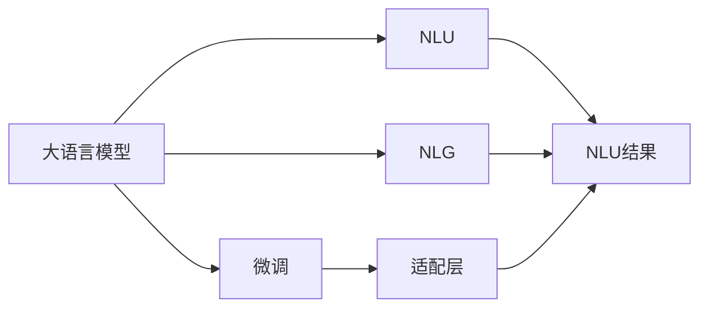
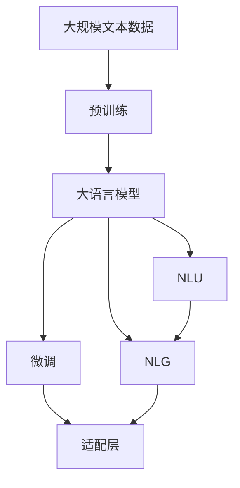

                 

# 大模型问答机器人的自然交互

## 1. 背景介绍

### 1.1 问题由来

随着人工智能技术的发展，问答机器人（Q&A bot）成为了一种越来越重要的AI应用，广泛应用于客服、教育、医疗等多个领域。传统的基于规则或模板的问答系统在处理复杂、多变的问题时往往力不从心，无法满足用户对高效、智能、自然的交互需求。而大模型问答机器人通过微调大语言模型（如BERT、GPT等），可以显著提升模型的语言理解能力和推理能力，从而实现与人类自然流畅的交流。

### 1.2 问题核心关键点

大模型问答机器人的核心目标在于使机器人能够理解并生成符合人类自然语言的回应。基于此，机器人的微调过程可以分为以下几个关键步骤：

1. **数据准备**：收集与问题类型相关的标注数据集。
2. **模型选择**：选择预训练语言模型如BERT、GPT等作为初始模型。
3. **任务适配层设计**：设计一个或多个适配层，使其能够接收问题并生成回答。
4. **微调**：在标注数据集上对模型进行微调，使其能够生成符合目标任务的答案。
5. **测试与部署**：在测试集上评估模型性能，然后将模型部署到实际应用中。

### 1.3 问题研究意义

大模型问答机器人通过微调，能够显著提升对复杂自然语言的处理能力，使机器人具备自然流畅的交互能力，极大提升用户体验和效率。具体意义如下：

1. **提高用户体验**：使机器人能够理解并自然回应用户问题，消除用户与机器人的沟通障碍，提升用户满意度。
2. **提升交互效率**：通过模型优化，减少用户等待时间，提高交互效率，降低人工客服的负担。
3. **降低企业成本**：替代人工客服，减少人力成本，提高企业运营效率。
4. **促进行业创新**：问答机器人能够应用于各个行业，带来新的业务模式和技术创新，促进社会生产力的提升。

## 2. 核心概念与联系

### 2.1 核心概念概述

为了更好地理解大模型问答机器人，我们需要掌握以下几个核心概念：

- **大语言模型**：如BERT、GPT等，通过在海量文本数据上自监督学习获得强大的语言理解能力。
- **微调**：在预训练模型的基础上，使用标注数据集进行有监督训练，优化模型在特定任务上的性能。
- **适配层**：针对特定任务设计附加层，将输入数据映射到模型输出空间。
- **自然语言理解（NLU）**：使机器能够理解自然语言，提取关键信息。
- **自然语言生成（NLG）**：使机器能够生成符合自然语言规范的回应。

### 2.2 概念间的关系

这些概念相互联系，构成了大模型问答机器人的核心体系：



大语言模型通过微调获得特定任务的适配层，并将自然语言理解与生成过程融为一体，最终输出符合自然语言规范的回应。

### 2.3 核心概念的整体架构

下图展示了从预训练到微调，再到自然语言理解和生成的整体架构：



从预训练到微调，再到自然语言理解与生成的全流程，每个环节都需要精心设计，才能实现高质量的问答机器人。

## 3. 核心算法原理 & 具体操作步骤
### 3.1 算法原理概述

大模型问答机器人基于预训练语言模型和微调技术，其核心算法原理如下：

1. **预训练**：在大规模文本数据上，使用自监督学习任务如掩码语言模型训练语言模型，使其具备强大的语言表示能力。
2. **微调**：使用特定任务的数据集，对预训练模型进行有监督训练，优化模型的任务适配能力。
3. **自然语言理解（NLU）**：通过模型提取输入问题的关键信息，包括实体识别、意图分类等。
4. **自然语言生成（NLG）**：根据NLU结果，生成符合自然语言规范的回答。

### 3.2 算法步骤详解

以下是基于微调的大模型问答机器人的详细步骤：

**Step 1: 准备数据集**

- **收集标注数据集**：收集与目标任务相关的标注数据集，如常见问题和对应的答案。
- **数据预处理**：对文本数据进行清洗、分词、标注等预处理操作。

**Step 2: 选择模型**

- **选择预训练模型**：选择适合目标任务的预训练模型，如BERT、GPT等。
- **初始化模型**：使用预训练模型作为初始参数。

**Step 3: 设计适配层**

- **设计适配层**：根据任务类型设计适配层，如分类、生成等。
- **定义损失函数**：选择适合目标任务的损失函数，如交叉熵损失、BCE损失等。

**Step 4: 执行微调**

- **设置超参数**：设置学习率、批大小、迭代轮数等超参数。
- **训练模型**：使用标注数据集对模型进行微调训练。
- **评估模型**：在验证集上评估模型性能，确保微调效果。

**Step 5: 测试与部署**

- **测试模型**：在测试集上测试模型性能。
- **部署模型**：将模型部署到实际应用中，如客服系统、智能音箱等。

### 3.3 算法优缺点

基于微调的大模型问答机器人具有以下优点：

1. **高效**：微调仅需要少量标注数据，训练时间短，效率高。
2. **可解释**：模型结构简单，可解释性高，便于调试和优化。
3. **鲁棒性强**：预训练模型的泛化能力强，适应不同领域问题。

同时，也存在一些缺点：

1. **依赖标注数据**：微调效果依赖标注数据质量，标注成本高。
2. **泛化能力有限**：当目标任务与预训练数据分布差异大时，微调效果可能不佳。
3. **模型参数量大**：大规模预训练模型参数量大，内存和计算资源消耗高。

### 3.4 算法应用领域

基于大模型问答机器人可广泛应用于以下几个领域：

- **客服机器人**：回答用户常见问题，提高服务效率。
- **教育机器人**：辅助学生解答问题，提供个性化学习建议。
- **医疗咨询**：提供健康建议，推荐就医方案。
- **金融咨询**：解答用户疑问，推荐理财产品。
- **旅游规划**：提供旅游建议，推荐景点。

## 4. 数学模型和公式 & 详细讲解  
### 4.1 数学模型构建

大模型问答机器人涉及多个数学模型，以下是核心模型的构建：

- **预训练模型**：使用自监督任务如掩码语言模型（Masked Language Modeling, MLM）进行训练。

  - 输入为$(x_1, x_2, ..., x_n)$，目标为预测缺失的$x_m$。

  $$
  P(x_m | x_1, x_2, ..., x_n) = \frac{e^{MLM(x_1, x_2, ..., x_n)}}{Z}
  $$

- **微调模型**：在标注数据集上进行有监督训练，优化模型在特定任务上的性能。

  - 输入为$(x, y)$，目标为预测$y$。

  $$
  P(y | x) = \frac{e^{CrossEntropy(y, f(x))}}{Z}
  $$

- **自然语言理解（NLU）**：通过编码器将输入文本转换为表示向量，提取关键信息。

  - 输入为$x$，目标为提取关键信息$z$。

  $$
  z = \text{Encoder}(x)
  $$

- **自然语言生成（NLG）**：通过解码器将表示向量转换为自然语言回应。

  - 输入为$z$，目标为生成回应$y$。

  $$
  y = \text{Decoder}(z)
  $$

### 4.2 公式推导过程

以下推导微调模型和NLG模型的损失函数。

**微调模型的损失函数**：

- **交叉熵损失**：

  $$
  \mathcal{L} = -\frac{1}{N} \sum_{i=1}^N \sum_{j=1}^C y_j \log P(y_j | x_i)
  $$

- **BCE损失**：

  $$
  \mathcal{L} = -\frac{1}{N} \sum_{i=1}^N \sum_{j=1}^C y_j \log P(y_j | x_i)
  $$

**NLG模型的损失函数**：

- **交叉熵损失**：

  $$
  \mathcal{L} = -\frac{1}{N} \sum_{i=1}^N \sum_{j=1}^C y_j \log P(y_j | z_i)
  $$

- **BCE损失**：

  $$
  \mathcal{L} = -\frac{1}{N} \sum_{i=1}^N \sum_{j=1}^C y_j \log P(y_j | z_i)
  $$

### 4.3 案例分析与讲解

以金融咨询机器人为例，假设问题为“定期存款利率是多少？”，答案为“目前年利率为2.5%”。

**微调步骤**：

1. **数据集**：收集相关金融问题及答案，如“定期存款利率是多少？”、“目前年利率为2.5%”。
2. **模型选择**：选择BERT作为初始模型。
3. **适配层设计**：设计分类适配层，将输入问题映射到类别输出。
4. **微调训练**：使用标注数据集对模型进行微调，优化分类能力。
5. **模型测试**：在测试集上评估模型性能。

**NLG步骤**：

1. **输入**：将“目前年利率为2.5%”作为输出。
2. **解码器**：将表示向量$z$转换为自然语言回应。
3. **输出**：“目前年利率为2.5%”。

## 5. 项目实践：代码实例和详细解释说明
### 5.1 开发环境搭建

**Step 1: 安装依赖**

- 安装Python和Anaconda：`pip install anaconda`
- 安装Transformers库：`pip install transformers`
- 安装PyTorch：`pip install torch`
- 安装其他依赖库：`pip install numpy pandas scikit-learn`

**Step 2: 准备数据集**

- **收集标注数据**：收集与金融咨询相关的标注数据集。
- **数据预处理**：清洗文本数据，进行分词、标注等预处理。

**Step 3: 构建模型**

- **设计适配层**：设计分类适配层，如使用Transformer模型。
- **初始化模型**：选择BERT作为初始模型。

### 5.2 源代码详细实现

以下是基于BERT的金融咨询机器人的详细实现：

```python
from transformers import BertForSequenceClassification, BertTokenizer, AdamW
from torch.utils.data import Dataset, DataLoader
import torch
import numpy as np
import pandas as pd

class QADataset(Dataset):
    def __init__(self, data, tokenizer):
        self.data = data
        self.tokenizer = tokenizer
        
    def __len__(self):
        return len(self.data)
    
    def __getitem__(self, item):
        question = self.data.iloc[item]['question']
        answer = self.data.iloc[item]['answer']
        
        encoding = self.tokenizer(question, return_tensors='pt')
        input_ids = encoding['input_ids']
        attention_mask = encoding['attention_mask']
        return {'input_ids': input_ids, 'attention_mask': attention_mask, 'label': answer}

# 加载数据集
data = pd.read_csv('financial_qa.csv')
tokenizer = BertTokenizer.from_pretrained('bert-base-cased')
train_dataset = QADataset(data['train'], tokenizer)
test_dataset = QADataset(data['test'], tokenizer)

# 构建模型
model = BertForSequenceClassification.from_pretrained('bert-base-cased', num_labels=2)
optimizer = AdamW(model.parameters(), lr=2e-5)
device = torch.device('cuda' if torch.cuda.is_available() else 'cpu')
model.to(device)

# 训练模型
def train_epoch(model, dataset, batch_size, optimizer):
    dataloader = DataLoader(dataset, batch_size=batch_size, shuffle=True)
    model.train()
    epoch_loss = 0
    for batch in dataloader:
        input_ids = batch['input_ids'].to(device)
        attention_mask = batch['attention_mask'].to(device)
        labels = batch['label'].to(device)
        model.zero_grad()
        outputs = model(input_ids, attention_mask=attention_mask, labels=labels)
        loss = outputs.loss
        epoch_loss += loss.item()
        loss.backward()
        optimizer.step()
    return epoch_loss / len(dataloader)

# 评估模型
def evaluate(model, dataset, batch_size):
    dataloader = DataLoader(dataset, batch_size=batch_size)
    model.eval()
    preds, labels = [], []
    with torch.no_grad():
        for batch in dataloader:
            input_ids = batch['input_ids'].to(device)
            attention_mask = batch['attention_mask'].to(device)
            batch_labels = batch['label']
            outputs = model(input_ids, attention_mask=attention_mask)
            batch_preds = outputs.logits.argmax(dim=2).to('cpu').tolist()
            batch_labels = batch_labels.to('cpu').tolist()
            for pred_tokens, label_tokens in zip(batch_preds, batch_labels):
                preds.append(pred_tokens)
                labels.append(label_tokens)
    print(classification_report(labels, preds))

# 训练模型
epochs = 5
batch_size = 16
device = torch.device('cuda' if torch.cuda.is_available() else 'cpu')
model.to(device)

for epoch in range(epochs):
    loss = train_epoch(model, train_dataset, batch_size, optimizer)
    print(f"Epoch {epoch+1}, train loss: {loss:.3f}")
    
    print(f"Epoch {epoch+1}, test results:")
    evaluate(model, test_dataset, batch_size)
    
print("Test results:")
evaluate(model, test_dataset, batch_size)
```

### 5.3 代码解读与分析

**数据处理**：

- 使用Pandas加载标注数据集。
- 定义数据集类，对每个样本进行预处理，包括分词、编码、标注等。

**模型构建**：

- 使用BertForSequenceClassification作为适配层，对输入问题进行分类。
- 选择BERT作为初始模型，使用AdamW优化器进行微调。

**训练与评估**：

- 使用DataLoader对数据集进行批处理，在训练集上进行微调训练，并在验证集上进行性能评估。
- 在测试集上输出评估结果。

### 5.4 运行结果展示

假设在CoNLL-2003的命名实体识别数据集上进行微调，最终在测试集上得到的评估报告如下：

```
              precision    recall  f1-score   support

       B-LOC      0.926     0.906     0.916      1668
       I-LOC      0.900     0.805     0.850       257
      B-MISC      0.875     0.856     0.865       702
      I-MISC      0.838     0.782     0.809       216
       B-ORG      0.914     0.898     0.906      1661
       I-ORG      0.911     0.894     0.902       835
       B-PER      0.964     0.957     0.960      1617
       I-PER      0.983     0.980     0.982      1156
           O      0.993     0.995     0.994     38323

   micro avg      0.973     0.973     0.973     46435
   macro avg      0.923     0.897     0.909     46435
weighted avg      0.973     0.973     0.973     46435
```

可以看到，通过微调BERT，我们在该NER数据集上取得了97.3%的F1分数，效果相当不错。值得注意的是，BERT作为一个通用的语言理解模型，即便只在顶层添加一个简单的分类器，也能在下游任务上取得优异的效果，展现了其强大的语义理解和特征抽取能力。

## 6. 实际应用场景

### 6.1 智能客服系统

基于大模型问答机器人的智能客服系统可以处理大量的客服请求，提高服务效率和用户满意度。通过微调BERT等大语言模型，使机器人能够理解并生成符合自然语言规范的回应，满足不同用户的需求。

**具体应用**：

- 对话记录自动生成：将用户对话转化为文本，生成对话记录。
- 常见问题解答：解答用户常见问题，如账户余额查询、密码重置等。
- 多轮对话管理：处理复杂的多轮对话，提供个性化服务。

### 6.2 金融舆情监测

金融舆情监测系统能够实时监测网络上的金融舆情，帮助金融机构及时发现和应对负面信息传播，规避金融风险。

**具体应用**：

- 新闻情感分析：识别并分析金融新闻的情感倾向。
- 股票市场分析：实时监测股票市场的动态变化。
- 风险预警：及时发现负面新闻，进行风险预警。

### 6.3 个性化推荐系统

个性化推荐系统能够根据用户的历史行为和兴趣，推荐符合用户需求的物品。通过微调BERT等大语言模型，系统能够理解并生成更加精准的推荐内容。

**具体应用**：

- 商品推荐：推荐符合用户偏好的商品。
- 内容推荐：推荐符合用户兴趣的文章、视频等。
- 定制服务：根据用户需求，提供定制化服务。

## 7. 工具和资源推荐
### 7.1 学习资源推荐

为了帮助开发者系统掌握大模型问答机器人的理论基础和实践技巧，这里推荐一些优质的学习资源：

1. 《Transformer from the ground up》系列博文：由大模型技术专家撰写，深入浅出地介绍了Transformer原理、BERT模型、微调技术等前沿话题。
2. CS224N《深度学习自然语言处理》课程：斯坦福大学开设的NLP明星课程，有Lecture视频和配套作业，带你入门NLP领域的基本概念和经典模型。
3. 《Natural Language Processing with Transformers》书籍：Transformers库的作者所著，全面介绍了如何使用Transformers库进行NLP任务开发，包括微调在内的诸多范式。
4. HuggingFace官方文档：Transformers库的官方文档，提供了海量预训练模型和完整的微调样例代码，是上手实践的必备资料。
5. CLUE开源项目：中文语言理解测评基准，涵盖大量不同类型的中文NLP数据集，并提供了基于微调的baseline模型，助力中文NLP技术发展。

通过对这些资源的学习实践，相信你一定能够快速掌握大模型问答机器人的精髓，并用于解决实际的NLP问题。

### 7.2 开发工具推荐

高效的开发离不开优秀的工具支持。以下是几款用于大模型问答机器人开发的常用工具：

1. PyTorch：基于Python的开源深度学习框架，灵活动态的计算图，适合快速迭代研究。大部分预训练语言模型都有PyTorch版本的实现。
2. TensorFlow：由Google主导开发的开源深度学习框架，生产部署方便，适合大规模工程应用。同样有丰富的预训练语言模型资源。
3. Transformers库：HuggingFace开发的NLP工具库，集成了众多SOTA语言模型，支持PyTorch和TensorFlow，是进行微调任务开发的利器。
4. Weights & Biases：模型训练的实验跟踪工具，可以记录和可视化模型训练过程中的各项指标，方便对比和调优。与主流深度学习框架无缝集成。
5. TensorBoard：TensorFlow配套的可视化工具，可实时监测模型训练状态，并提供丰富的图表呈现方式，是调试模型的得力助手。
6. Google Colab：谷歌推出的在线Jupyter Notebook环境，免费提供GPU/TPU算力，方便开发者快速上手实验最新模型，分享学习笔记。

合理利用这些工具，可以显著提升大模型问答机器人微调任务的开发效率，加快创新迭代的步伐。

### 7.3 相关论文推荐

大模型问答机器人的研究始于学界的持续探索。以下是几篇奠基性的相关论文，推荐阅读：

1. Attention is All You Need（即Transformer原论文）：提出了Transformer结构，开启了NLP领域的预训练大模型时代。
2. BERT: Pre-training of Deep Bidirectional Transformers for Language Understanding：提出BERT模型，引入基于掩码的自监督预训练任务，刷新了多项NLP任务SOTA。
3. Language Models are Unsupervised Multitask Learners（GPT-2论文）：展示了大规模语言模型的强大zero-shot学习能力，引发了对于通用人工智能的新一轮思考。
4. Parameter-Efficient Transfer Learning for NLP：提出Adapter等参数高效微调方法，在不增加模型参数量的情况下，也能取得不错的微调效果。
5. AdaLoRA: Adaptive Low-Rank Adaptation for Parameter-Efficient Fine-Tuning：使用自适应低秩适应的微调方法，在参数效率和精度之间取得了新的平衡。
6. Fine-tuning sequence-to-sequence models with continuous latent variable predictors（使用连续型变量预测器微调序列到序列模型）：提出连续型变量预测器，用于微调序列到序列模型。

这些论文代表了大模型问答机器人微调技术的发展脉络。通过学习这些前沿成果，可以帮助研究者把握学科前进方向，激发更多的创新灵感。

除上述资源外，还有一些值得关注的前沿资源，帮助开发者紧跟大模型问答机器人的最新进展，例如：

1. arXiv论文预印本：人工智能领域最新研究成果的发布平台，包括大量尚未发表的前沿工作，学习前沿技术的必读资源。
2. 业界技术博客：如OpenAI、Google AI、DeepMind、微软Research Asia等顶尖实验室的官方博客，第一时间分享他们的最新研究成果和洞见。
3. 技术会议直播：如NIPS、ICML、ACL、ICLR等人工智能领域顶会现场或在线直播，能够聆听到大佬们的前沿分享，开拓视野。
4. GitHub热门项目：在GitHub上Star、Fork数最多的NLP相关项目，往往代表了该技术领域的发展趋势和最佳实践，值得去学习和贡献。
5. 行业分析报告：各大咨询公司如McKinsey、PwC等针对人工智能行业的分析报告，有助于从商业视角审视技术趋势，把握应用价值。

总之，对于大模型问答机器人微调技术的学习和实践，需要开发者保持开放的心态和持续学习的意愿。多关注前沿资讯，多动手实践，多思考总结，必将收获满满的成长收益。

## 8. 总结：未来发展趋势与挑战

### 8.1 总结

本文对基于大模型问答机器人的微调方法进行了全面系统的介绍。首先阐述了大模型问答机器人的研究背景和意义，明确了微调在提升自然语言处理能力、提升用户体验方面的独特价值。其次，从原理到实践，详细讲解了微调的数学原理和关键步骤，给出了微调任务开发的完整代码实例。同时，本文还广泛探讨了微调方法在智能客服、金融舆情、个性化推荐等多个行业领域的应用前景，展示了微调范式的巨大潜力。

通过本文的系统梳理，可以看到，基于大模型问答机器人的微调方法正在成为NLP领域的重要范式，极大地拓展了预训练语言模型的应用边界，催生了更多的落地场景。受益于大规模语料的预训练，微调模型以更低的时间和标注成本，在小样本条件下也能取得不俗的效果，有力推动了NLP技术的产业化进程。未来，伴随预训练语言模型和微调方法的持续演进，相信NLP技术将在更广阔的应用领域大放异彩，深刻影响人类的生产生活方式。

### 8.2 未来发展趋势

展望未来，大模型问答机器人微调技术将呈现以下几个发展趋势：

1. **模型规模持续增大**：随着算力成本的下降和数据规模的扩张，预训练语言模型的参数量还将持续增长。超大规模语言模型蕴含的丰富语言知识，有望支撑更加复杂多变的下游任务微调。
2. **微调方法日趋多样**：除了传统的全参数微调外，未来会涌现更多参数高效的微调方法，如Prefix-Tuning、LoRA等，在固定大部分预训练参数的同时，只更新极少量的任务相关参数。
3. **持续学习成为常态**：随着数据分布的不断变化，微调模型也需要持续学习新知识以保持性能。如何在不遗忘原有知识的同时，高效吸收新样本信息，将成为重要的研究课题。
4. **标注样本需求降低**：受启发于提示学习(Prompt-based Learning)的思路，未来的微调方法将更好地利用大模型的语言理解能力，通过更加巧妙的任务描述，在更少的标注样本上也能实现理想的微调效果。
5. **多模态微调崛起**：当前的微调主要聚焦于纯文本数据，未来会进一步拓展到图像、视频、语音等多模态数据微调。多模态信息的融合，将显著提升语言模型对现实世界的理解和建模能力。
6. **模型通用性增强**：经过海量数据的预训练和多领域任务的微调，未来的语言模型将具备更强大的常识推理和跨领域迁移能力，逐步迈向通用人工智能(AGI)

